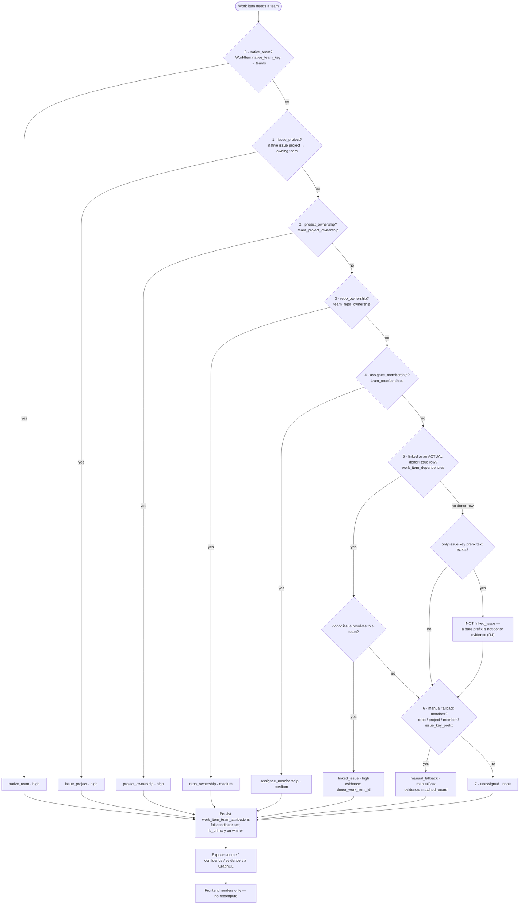
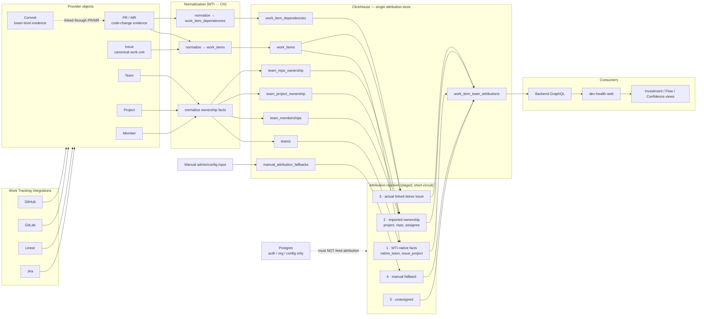
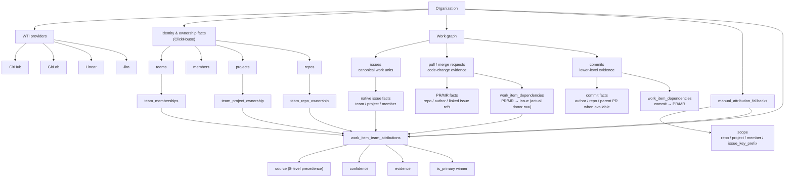
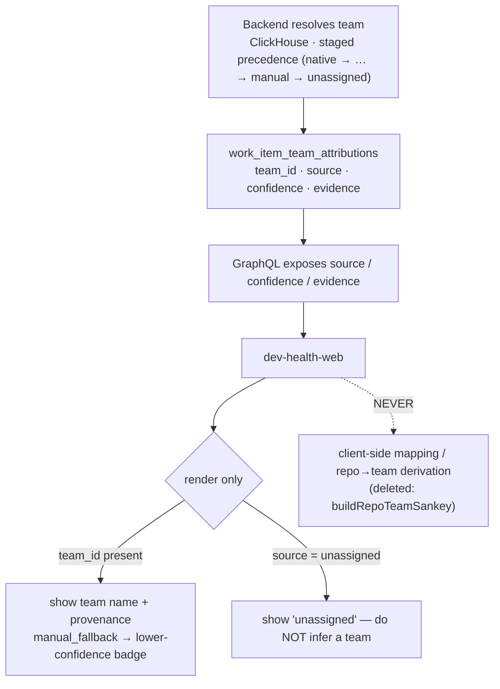

# CHAOS-2600 — Implementation Plan: ClickHouse-Only Team Attribution

> Source of intent: `team-realignment.md` (the CHAOS-2600 corrective plan).
> This document converts that 12-phase corrective plan into a **gated changeset sequence**,
> grounded in the *actual* current code (verified by a 10-agent parallel codebase sweep, all
> findings `high` confidence). Every changeset has a `/codex:adversarial-review` gate and an
> alignment check so we cannot drift from the invariants.

---

## 0. What the grounding sweep changed about the plan

The corrective doc hedges ("models *similar to*", "*likely* target areas"). The sweep replaced
those guesses with anchored facts. Three of them reshape the plan:

1. **Query-time attribution already reads only ClickHouse.** The runtime resolvers
   (`ops/src/dev_health_ops/providers/teams.py:61-142`) are built from `store.get_all_teams()` —
   they have **no Postgres import**. Postgres `TeamMapping`/`IdentityMapping`
   (`models/settings.py:571-730`) is an *upstream config layer* bridged into the ClickHouse
   `teams` dimension by `bridge_teams_to_clickhouse` (`providers/team_bridge.py:49-111`).
   → The work is "delete the bridge + make CH the system of record", **not** "rewrite the resolvers".

2. **The CH ownership tables already exist.** Migration `051_team_attribution_dimensions.sql`
   created `team_memberships`, `team_project_ownership`, `team_repo_ownership`,
   `work_item_team_attributions`; `team_autoimport_{github,gitlab,jira,linear}.py` already write
   them CH-native (no Postgres). → Phase 3 is mostly built; what remains is **re-homing the
   `teams`-dimension population** (`members`, `project_keys`, `repo_patterns`) off the bridge.

3. **The precedence fix is bigger than a one-dict edit.** The doc's target `_SOURCE_ORDER`
   adds **two new sources** (`issue_project`, `manual_fallback`) that do not exist today, and the
   ClickHouse `work_item_team_attributions.source` **and** `confidence` `Enum8`s must be ALTERed
   (current `confidence` is `Enum8('high'=1,'medium'=2,'low'=3)` — a `manual`/`none` insert throws).

### The current (buggy) state, anchored

| Concern | Truth on disk | Anchor |
| --- | --- | --- |
| Precedence dict | `{native_team:0, linked_issue:1, project_ownership:2, repo_ownership:3, assignee_membership:4, unassigned:5}` — `linked_issue` outranks ownership+assignee (the bug) | `metrics/compute_work_items.py:105-112` |
| Winner selection | iterate sources sorted by `_SOURCE_ORDER`; first non-empty source wins; **full candidate set still emitted** with `is_primary` | `compute_work_items.py:307-340` |
| Postgres→CH bridge | single fn, 4 lazy import sites + admin/sync_runtime dispatchers; sits **first** in the daily Celery chain | `providers/team_bridge.py:49`; `sync_runtime.py:392-408` |
| Manual fallback | **does not exist** — zero hits for `manual_attribution_fallback*` anywhere in ops | (grep, verified) |
| `issue_project` source | **does not exist** — `TeamAttributionSource` has only 6 values | `compute_work_items.py:61-68` |
| Donor-row enforcement | already enforced: extkey must resolve to a real `work_items` row; missing/ambiguous → no inheritance | `compute_work_items.py:380-496` |
| Provenance in GraphQL | provenance exists on the CH record but is **never** SELECTed or in the Strawberry SDL | `metrics/schemas.py:384-395`; `api/graphql/resolvers/analytics.py:640-712` |
| Web client-side attribution | orphaned dead code derives teams from `evidence` JSON — a latent boundary violation, **no live caller** | `web/src/lib/investment/transforms.ts:374-523` |

---

## 1. Target invariant contract (the north star)

Every changeset is judged against this. Do not let any PR weaken it.

### 1.1 Source of truth
- ClickHouse is the **only** persistence layer read *or written* for team/project/member/repo/manual attribution.
- Postgres stores auth/org/config only. **No attribution code reads Postgres.**

### 1.2 Precedence (deterministic staged resolution)
```
0 native_team          (native issue team)
1 issue_project        (native issue project ownership)   ← NEW
2 project_ownership    (imported provider project ownership)
3 repo_ownership       (imported provider repo ownership)
4 assignee_membership  (imported team membership)
5 linked_issue         (actual linked donor issue row)    ← DEMOTED (was 1)
6 manual_fallback      (explicit ClickHouse fallback)      ← NEW
7 unassigned
```
- `linked_issue` must **lose** to every native/imported fact and **beat only** `manual_fallback`/`unassigned`.
- `manual_fallback` must **never** override any native/imported/linked fact.
- Selection still emits the **full candidate set** (provenance rows); only the *winner* changes.

### 1.3 Linked-issue & prefix rules
- `linked_issue` requires an **actual donor `work_items` row** (already enforced — preserve it).
- An external issue-key *prefix* with **no** resolved donor row is **not** linked-issue inheritance.
  It may only match an explicit `manual_fallback` record with `scope_type = issue_key_prefix`,
  emitting `source = manual_fallback`, low/manual confidence.

### 1.4 Provenance everywhere
Every final attribution carries: `org_id, work_item_id, provider, team_id, team_name, source,
confidence, evidence, is_primary, computed_at`.
`source ∈ {native_team, issue_project, project_ownership, repo_ownership, assignee_membership,
linked_issue, manual_fallback, unassigned}`; `confidence ∈ {high, medium, low, manual, none}`.

### 1.5 Resolution decision tree (navigation + off-the-rails fallback)

This is the single canonical picture of *how a work item gets a team*. **To debug a surprising
attribution:** read `team_attribution_source` from the persisted provenance, jump to that node, and
verify every stage **above** it correctly returned "no". The first stage that returns "yes" wins
and the walk stops — nothing below can override it.



**Invariants encoded in the tree (do not let any PR break these):**
- The walk is **top-down and short-circuits** — stage *N* only runs if stages `0..N-1` all returned "no".
- **`linked_issue` (5)** requires a real `work_item_dependencies` donor row whose target resolves to
  an actual `work_items` row *that itself has a team*. A bare issue-key prefix with no donor falls
  through to stage 6 (verified: `compute_work_items.py:412-496`; D1/R1).
- **`manual_fallback` (6)** can only beat `unassigned`. If it ever beats a native/imported/linked
  team, that is a precedence **bug** — check `_SOURCE_ORDER`.
- **`unassigned` (7)** is the floor. A *whole org* landing here usually means the ClickHouse `teams`
  dimension is empty (a CS5 regression), not a resolver bug.

### 1.6 Attribution data flow (WTI → ClickHouse → resolver → consumers)

Shows *where the data comes from* and the one hard boundary: **Postgres must not feed attribution.**



### 1.7 Data object hierarchy



### 1.8 Source reference matrix (forward navigation)

| # | `source` | Resolves from (ClickHouse) | Confidence | Beats | Never overrides | Evidence keys |
|--:|---|---|---|---|---|---|
| 0 | `native_team` | `WorkItem.native_team_key` → `teams` | high | all below | — (top) | `native_team_key` |
| 1 | `issue_project` | native issue project → owning team | high | 2–7 | 0 | `project_id, owner_team` |
| 2 | `project_ownership` | `team_project_ownership` | high | 3–7 | 0–1 | `project_id, provider` |
| 3 | `repo_ownership` | `team_repo_ownership` | medium | 4–7 | 0–2 | `repo_full_name` |
| 4 | `assignee_membership` | `team_memberships` (assignee identity) | medium | 5–7 | 0–3 | `member_id, identity` |
| 5 | `linked_issue` | `work_item_dependencies` donor → donor's team | high (donor's) | 6–7 | 0–4 | `dependency_type, donor_work_item_id, donor_provider` |
| 6 | `manual_fallback` | `manual_attribution_fallbacks` (repo/project/member/issue_key_prefix) | manual\|low | 7 only | 0–5 | `scope_type, scope_id, reason` |
| 7 | `unassigned` | — (nothing matched) | none | — (floor) | — | `reason` |

### 1.9 Off-the-rails matrix (symptom → diagnosis → fix)

When attribution looks wrong, find the symptom, jump to the stage, apply the fix.

| Symptom | Likely stage | Diagnose | Fix / owning CS |
|---|---|---|---|
| A whole org is `unassigned` | 7 (floor) | `get_all_teams()` empty? CH `teams` populated for `org_id`? | CS5 regression — re-home teams population; verify daily-chain order |
| PR attributed to a surprising team via `linked_issue` | 5 | which `work_item_dependencies` edge? donor's own team? extkey ambiguous? | confirm donor row + `_canonical_target`; check `_INHERITABLE_RELATIONSHIP_TYPES` |
| `manual_fallback` beats a real team | precedence | `_SOURCE_ORDER` has `manual_fallback=6`? loader merging manual at the wrong rank? | restore rank — manual is the lowest non-unassigned tier (CS2/CS3) |
| A bare prefix (e.g. `CHAOS`) attributes as `linked_issue` | 5 vs 6 | did a full key resolve to a real `work_items` row, or did a prefix shortcut leak in? | **R1 invariant** — no prefix→team in `linked_issue`; route to manual `issue_key_prefix` (CS3) |
| Team flips back and forth after a re-org | RMT dedup | duplicate ownership rows; read lacks `FINAL`/`argMax` | add `FINAL`/`argMax` to ownership + manual reads (CS3 §4.6) |
| Provenance absent in the API | GraphQL | resolver SELECTs the provenance columns? SDL has the fields? | CS4 — expose `source/confidence/evidence` |
| Web shows a different team than the backend | client recompute | any client-side mapping derived from `evidence`? | CS7 — delete `buildRepoTeamSankey`; render-only |

### 1.10 Provider × entity test-coverage contract

Attribution is **provider-agnostic** (the resolver never branches on provider) — so it must be
**tested** that way. Every WTI provider × normalized entity must be covered; **no Linear-only
coverage.** Current state (5-agent audit, 2026-06-22):

| provider \ entity | teams | projects | members | issues |
|---|---|---|---|---|
| jira   | partial | partial | partial | yes |
| gitlab | partial | yes     | **no**  | yes |
| github | yes     | n/a¹    | yes     | yes |
| linear | yes     | partial | yes     | yes |

`yes` = normalized + asserted · `partial` = sink/integration only (no normalizer unit test) · `no` =
normalized but never asserted · `n/a` = provider lacks the entity. ¹ GitHub has no native Project.

> **This matrix tracks TEST coverage, not consumption.** We functionally pull teams, projects, and
> members for every provider that supports them (auto-import). A `partial`/`no` cell = "not yet
> asserted," NOT "not consumed." (Conflating the two produced a false "Linear projects not ingested"
> reading 2026-06-22.)

**Consumption matrix (functional — what `run_team_autoimport` pulls):**

| provider | teams | projects | members | repo ownership | member store |
|---|---|---|---|---|---|
| linear | ✓ `discover_linear` | ✓ `assoc.project_keys` | ✓ `discover_members_linear` | — | edges + roster |
| jira   | ✓ `discover_jira` | ✓ `assoc.project_keys` | ✓ `discover_members_jira_bulk` | — | edges + roster |
| github | ✓ `discover_github` | n/a (repo = scope) | ✓ `discover_members_github` | ✓ `team_repo_ownership` | edges (+ roster, CS-COV) |
| gitlab | ✓ `discover_gitlab` | ✓ (project paths) | ✓ `discover_members_gitlab` | — | edges (+ roster, CS-COV) |

Two member stores: **`team_memberships` (edges)** — written by all 4, read by the ladder
(`loaders/clickhouse.py:449-485` → `member_by_identity` → `assignee_membership`,
`compute_work_items.py:415-422`); this is the canonical attribution source, all 4 consume here.
**`teams.members` (roster)** — linear/jira auto-import + admin surgical-replacement (CS5); read by the
secondary `TeamResolver` + admin/display. **CS-COV adds github/gitlab roster population** ("pull
members of orgs and teams from github and gitlab", user decision 2026-06-22). Chain: members →
assignee → issues → PRs/MRs → (maybe) commits; commit authors are a separate git-side source,
member↔author reconciliation deferred.

- The **resolver row** is multi-provider (CS2: `test_jira_issue_project_wins_over_linked_issue`,
  `test_assignee_membership_wins_over_jira_linked_donor`, plus GitHub/GitLab/Linear donor + ownership
  tests). The **dimension** (team/project/member autoimport) is the gap — and because jira/github/
  gitlab carry `native_team_key=None`, it is the single point of failure for non-Linear attribution.
- **Gaps → CHAOS-2609 (CS-COV):** gitlab/members normalized-but-never-asserted (high), gitlab epics
  untested (high), jira team/project/member sink-only (medium), linear native projects not ingested
  (medium). The matrix must reach all-`yes`/`n/a` (acceptance §6).
- Canonical, ships-in-repo copy: `team-attribution.md §0.4`; guardrail in root + ops `AGENTS.md`.

---

## 2. Decision gates (resolve BEFORE writing code)

### D1 — `external_issue_key` re-routing — **RESOLVED: R1 (verified in code 2026-06-22)**

Phase 5 forbids `PR text "CHAOS-123" → prefix "CHAOS" → team` as `linked_issue`. The concern was
that `external_issue_key` text-parsed edges are **today the only** cross-provider PR→issue donor
mechanism for GitHub PRs and GitLab MRs (only Linear has a native-attachment donor row;
`linear/normalize.py:152-187`), so dropping them would silently zero non-Linear PR→issue
inheritance.

**Code verification (`build_linked_issue_team_resolver`, `compute_work_items.py:412-496`):**
- `key_index` is built **only** from real Linear/Jira `work_items` rows (`:425-434`).
- `_canonical_target("extkey:CHAOS-2400")` → `key_index.get("CHAOS-2400")` → **None** when no such
  work item exists (`:436-440`).
- The candidate loop **skips** any falsy target (`:486 if not target_id: continue`) **and** any
  target whose donor work item did not itself resolve to a real team (`:488-489`).
- Therefore a `linked_issue` attribution is **impossible** without (a) an inheritable edge, (b) the
  bare key resolving to an actual `work_items` row, and (c) that row having its own resolved team.
- The forbidden `"CHAOS" prefix → team` shortcut **does not exist** in the `linked_issue` path.
  Prefix→team only lives in `ProjectKeyTeamResolver` (`providers/teams.py:76-93`), which feeds
  `native_team`/`issue_project`/`project_ownership` — never `linked_issue`.

**Conclusion (R1).** Phase 5's "linked issue requires an actual donor row" and "issue-key prefix is
not linked-issue inheritance" are **already satisfied** by the existing donor-row enforcement. So:
- **No extraction-layer change.** `external_issue_key` stays in `_INHERITABLE_RELATIONSHIP_TYPES`
  (`:375-377`); it already demands a real donor → emits `linked_issue` (now demoted to rank 5).
- The **only** net-new prefix work is CS3's `manual_fallback` `issue_key_prefix` scope, used only
  when **no** donor row resolves (the case that today falls to `unassigned`).
- R2 (drop all text-parsed edges) was rejected: it would *remove* a satisfied-and-intended
  capability (the Linear branch-convention recovery, `github/normalize.py:860`) and reduce
  attribution coverage for **no** correctness gain.

### D2 — staged functions vs. re-ranked dict — **DECIDED**
The doc prefers explicit staged resolution; the current code uses a numeric `_SOURCE_ORDER` loop
that **emits all candidates** (the schema persists the full set). A naive staged short-circuit
would regress provenance rows (`test_team_attribution_schema.py`). **Decision:** keep full
candidate emission; express precedence as staged winner-selection backed by the (re-ranked,
8-value) `_SOURCE_ORDER`. Best of both; no provenance regression.

---

## 3. Changeset sequence

Eight changesets (= eight PRs), ordered to respect the migration/runtime ordering risks in §4.
`ops` and `web` are separate repos; ops changes (CS4) must reach **ops main** before the web
changeset (CS7) can pass the schema exact-diff. Each CS lists: **Goal · Files · Validation ·
Codex gate · Alignment check.**

> **Branch strategy.** Cut an integration branch per repo
> (`fix/clickhouse-only-team-attribution`) off `origin/main`; stack each CS as its own PR onto the
> integration branch (squash), merge integration → main at the end. Never push to `main`
> (project rule). Push the branch *then* `gh pr create --head <branch> --base <integration>`.

---

### CS0 — Contract & guardrails (ops + web + root AGENTS)  ·  *low risk, lands first*

**Goal.** Establish the north-star contract and the doc-freshness gate that holds every later PR.
**Files.**
- `AGENTS.md` (root), `ops/AGENTS.md`, `web/AGENTS.md`: add the **"Team attribution source of
  truth"** invariant (§1.1/1.3) and the **"Documentation freshness requirement"** guardrail +
  PR-checklist items (Phase 9/11 text).
- `ops/docs/architecture/team-attribution.md`: add the **target** precedence + provenance contract
  (§1.2/1.4), clearly marked *"target state — implemented across CHAOS-2600 CS1–CS7"* so it does
  not claim not-yet-shipped behavior as done.

**Validation.** Markdown only; `ci/run_tests.sh format` (web) / docs lint if present. No code.
**Codex gate.**
```
/codex:adversarial-review --base fix/clickhouse-only-team-attribution --background \
  "Challenge whether this contract is internally consistent and complete: precedence order,
   provenance enum, source-of-truth statement, and whether the doc-freshness guardrail is
   enforceable. Find any invariant that later code cannot actually satisfy."
```
**Alignment check.** Contract text == §1 of this plan, verbatim where possible.

---

### CS1 — ClickHouse schema foundations (ops)  ·  *additive, no behavior change*

**Goal.** Land the storage the later resolver needs, with **zero** behavior change (table empty,
enums merely widened).
**Files.**
- `ops/src/dev_health_ops/migrations/clickhouse/053_manual_attribution_fallbacks.sql` (next free
  number; lexicographic order). `CREATE TABLE IF NOT EXISTS manual_attribution_fallbacks` per
  Phase 2 DDL, `ReplacingMergeTree(updated_at)`, **`org_id` leading in `ORDER BY`**
  (`PARTITION BY org_id`, `ORDER BY (org_id, provider, scope_type, scope_id, team_id)`).
- Same migration: `ALTER TABLE work_item_team_attributions MODIFY COLUMN source Enum8(...)` to add
  `issue_project` and `manual_fallback`; `MODIFY COLUMN confidence Enum8(...)` to add `manual`,
  `none` (apply the same `confidence` widening to the three edge tables if they share the enum).
- `ops/src/dev_health_ops/storage/clickhouse.py`: add `insert_manual_attribution_fallbacks`
  (mirror `_insert_team_edge_rows` / `insert_work_item_team_attributions`, explicit column list,
  `org_id` auto-injection).
- `ops/src/dev_health_ops/metrics/sinks/base.py`: add `write_manual_attribution_fallbacks` to the
  sink protocol + base impl.

**Validation.**
- `cd ops && dev-hops migrate clickhouse upgrade` (force path) then `... status --check` (the wait primitive).
- Insert a fallback row; round-trip read; assert the new `source`/`confidence` enum values accept
  inserts (an INSERT of `source='manual_fallback'` must **not** throw).
- **Rebuild the worker/beat image** before any worker-path verification (`worker_stale_image` —
  baked site-packages); `AUTO_RUN_MIGRATIONS=false` in workers, so the ALTER must be applied
  explicitly.
- `cd ops && mypy --install-types --non-interactive .` + `ci/run_tests.sh ... unit` (CI-parity).
**Codex gate.**
```
/codex:adversarial-review --base fix/clickhouse-only-team-attribution --background \
  "Migration safety: is the Enum8 ALTER on work_item_team_attributions.source/confidence safe and
   backward-compatible? Will any in-flight writer emit a value the pre-ALTER enum rejects? Does the
   new manual_attribution_fallbacks table put org_id first in ORDER BY, dedup correctly under
   ReplacingMergeTree, and avoid the empty top-level migrations/ decoy dir? Idempotency of
   CREATE/ALTER on re-run."
```
**Alignment check.** `grep` confirms migration lives under
`src/dev_health_ops/migrations/clickhouse/` (not the empty top-level decoy). Enum values match §1.4 exactly.

---

### CS2 — Precedence rewrite + `issue_project` + `linked_issue` demotion (ops)  ·  *core fix*

**Goal.** Make `linked_issue` a true low-precedence fallback; introduce `issue_project`; preserve
full candidate emission.
**Files.**
- `ops/src/dev_health_ops/metrics/compute_work_items.py`:
  - Extend `TeamAttributionSource` Literal (`:61-68`) with `issue_project`, `manual_fallback`.
  - Re-rank `_SOURCE_ORDER` (`:105-112`) to the 8-value order in §1.2.
  - Add an `issue_project` candidate constructor (native issue's project; distinct from imported
    `project_ownership`). `WorkItem` already separates `native_team_key`/`project_key`
    (`models/work_items.py:59-60`).
  - Reconcile the misleading `specificity` values (`linked_issue=90`, `project=50`, `native=100`)
    so within-source tiebreaks don't imply cross-source strength.
  - Keep emitting **all** candidates; only winner selection changes (D2).
- Tests (`ops/tests/test_linked_issue_team_inheritance.py`):
  - **Invert** the three precedence tests that encode the bug:
    `test_linked_issue_wins_over_assignee_membership` (`:378`),
    `test_state_duration_linked_issue_wins_over_assignee_membership` (`:411`),
    the `is_primary` assertions in `test_compute_emits_attribution_candidates_and_primary_cycle_team` (`:458-503`).
  - **Add** new coverage the suite lacks: `project_ownership` beats `linked_issue`,
    `repo_ownership` beats `linked_issue`, `assignee_membership` beats `linked_issue`,
    `issue_project` beats `linked_issue`.
  - Keep `test_inheritance_never_overrides_native_team` (`:112`) **green** (native stays rank 0).
  - **Do not touch** `test_team_reconcile_guards.py` (unrelated — reconcile, not precedence) or
    `test_team_attribution_schema.py` (sink shape).
- Docs (same PR): `ops/docs/architecture/data-pipeline.md` §4 + `team-attribution.md` cascade —
  reorder so `linked_issue` is below imported ownership; stop citing `IdentityMapping.team_ids` as
  the membership source (it becomes CH ownership).

**Validation.** `mypy` + full `ci/run_tests.sh ... unit` incl. `@pytest.mark.clickhouse` where the
resolver hits live CH; assert provenance candidate rows still emit (no regression vs schema test).
**Codex gate.**
```
/codex:adversarial-review --base fix/clickhouse-only-team-attribution --background \
  "Precedence correctness: does the new _SOURCE_ORDER make linked_issue lose to native/imported
   AND still beat unassigned? Does any path still let linked_issue or a bare prefix win over
   ownership? Did full candidate emission (is_primary on the full set) survive the winner-selection
   rewrite, or did we silently drop provenance rows? Is issue_project distinct from project_ownership
   and not double-counting? Tenant org_id scoping intact on every read?"
```
**Alignment check.** Drift grep: `_SOURCE_ORDER` equals §1.2 byte-for-byte; no test asserts
`linked_issue` winning over any imported/native source.

---

### CS3 — Manual-fallback resolver (ops)  ·  *net-new resolution path*

**Goal.** Read `manual_attribution_fallbacks`, match scopes, emit `source = manual_fallback` as the
lowest non-unassigned tier — never an override.
**Files.**
- `ops/src/dev_health_ops/metrics/loaders/clickhouse.py`: extend `load_team_attribution_context`
  (`:359-443`) to SELECT manual fallbacks **with `FINAL`/`argMax(...) GROUP BY` dedup** (the
  existing ownership reads lack dedup — see §4; harden them in the same PR). Implement scope
  matching for `repo`/`project`/`member` and the **new** `issue_key_prefix` matcher (match a work
  item's *referenced* keys' prefix → team) — this is the most novel logic; it only fires when no
  donor row resolved.
- `ops/src/dev_health_ops/metrics/compute_work_items.py`: emit a `manual_fallback` candidate
  (rank 6) with `confidence ∈ {manual, low}` and `evidence` showing the matched fallback record
  (Phase 6 example shape).
- Tests: `manual_fallback` does **not** override native/linked; manual applies only when nothing
  stronger exists; `issue_key_prefix` **without** a donor does not inherit `linked_issue`;
  `issue_key_prefix` **can** match `manual_fallback` only (Phase 7 replacement test names).

**Validation.** `mypy` + unit + clickhouse-marked; verify a seeded prefix fallback resolves to
`manual_fallback` and a real donor still wins over it.
**Codex gate.**
```
/codex:adversarial-review --base fix/clickhouse-only-team-attribution --background \
  "Manual fallback must never override: prove no scope (repo/project/member/issue_key_prefix) can
   beat native/imported/linked. Does the issue_key_prefix matcher match the right work items and
   not over-match (e.g. CHAOS vs CHAOSX)? Is the new read FINAL/argMax-deduped so a stale RMT row
   can't win? org_id in every predicate? Does a dangling extkey with no donor correctly fall to
   manual_fallback rather than silently inheriting linked_issue?"
```
**Alignment check.** Re-run §5 drift checklist; confirm `evidence` populated for every
`manual_fallback`/`linked_issue`/`unassigned` per Phase 6 examples.

---

### CS4 — Provenance in GraphQL (ops)  ·  *must reach ops main before CS7*

**Goal.** Expose the persisted provenance the data layer already has.
**Files.**
- `ops/src/dev_health_ops/api/graphql/models/outputs.py`: new `@strawberry.type` provenance fields
  (`team_attribution_source/confidence/evidence`, `is_primary`) — mirror the existing
  `WorkGraphProvenance` pattern (`outputs.py:544`).
- `ops/src/dev_health_ops/api/graphql/resolvers/analytics.py` (and/or `data_health.py`): SELECT the
  provenance columns from `work_item_team_attributions` (persisted but never read today).
- `ops/src/dev_health_ops/api/graphql/export_schema.py`: regenerate the SDL (driver for CS7).

**Validation.** `mypy` + GraphQL resolver tests; `python -m dev_health_ops...export_schema`
produces the SDL the web side will diff against.
**Codex gate.**
```
/codex:adversarial-review --base fix/clickhouse-only-team-attribution --background \
  "Does exposing provenance leak cross-tenant data or over-expose internal evidence? Are the new
   Strawberry fields nullable-correct and ordered so the SDL is deterministic? Does the resolver
   SELECT keep org scoping and argMax-dedup on work_item_team_attributions?"
```
**Alignment check.** SDL captured for CS7; provenance fields == §1.4.

---

### CS5 — Re-home team population, remove the bridge (ops)  ·  *highest structural risk*

**Goal.** Delete the Postgres→CH bridge (`sync_teams_to_analytics` / `bridge_teams_to_clickhouse`)
and make org-scoped team population write the ClickHouse `teams` dimension **directly** — **without**
emptying the dimension the resolvers read. **Nothing else changes:** the sync operations (`sync
teams` and the per-entity team/project/member sync) and the **"Auto Import" UX option** (checkboxes
that run `run_team_autoimport` to import teams/projects/members CH-native) stay as-is — they already
write ClickHouse directly. This CS removes *only* the Postgres-bridge path. Manual fallback (CS3) is
the separate explicit-override option.
**Files.**
- `ops/src/dev_health_ops/providers/teams.py`: rewrite the org-scoped path (`:635-720`) to write CH
  `teams` directly via the existing CH-native write (the no-org direct path `:722-745` already does
  this), dropping `_project_teams_to_postgres` + `bridge_teams_to_clickhouse`. Preserve the row shape
  exactly (deterministic `team_uuid = uuid5("team:{org}:{team_id}")`, `members`, `project_keys`,
  `repo_patterns`) or `get_all_teams()`-based resolvers break.
- Neutralize the bridge's other callers **first**: `workers/product_tasks.py:sync_teams_to_analytics`
  (in the daily chain `sync_runtime.py:392-408`) → repoint to a CH-native team refresh or remove
  from the chain; admin enqueues in `api/admin/routers/teams.py` + `identities.py`.
- Hard-deprecate `dev-hops teams reconcile` (`providers/team_reconcile.py`) → exit-non-zero stub
  ("Team attribution is ClickHouse-only"); remove its `_COMMAND_REQUIREMENTS` entry (`cli.py:420`).
- Triage `api/services/configuration/jira_activity_inference.py` (uses `IdentityMappingService`) —
  it will ImportError when CS6 deletes the service; decide here (rewrite to CH or remove).
- **Delete `providers/team_bridge.py`** only after all four import sites are re-homed.
- Docs (same PR): `ops/docs/ops/cli-reference.md` (`sync teams` is CH-only; drop `teams reconcile`)
  + `ops/docs/architecture/database-architecture.md` (remove the "Postgres-first source of truth"
  section + both Mermaid bridge diagrams `:140-211`).

**Validation.**
- Live proof on a real org via host `dev-hops` (`.venv/bin/dev-hops`, explicit DSNs): run
  `sync teams --org <org>`, assert ClickHouse `teams` is **populated** (members/project_keys/
  repo_patterns non-empty), then run the daily metrics chain and assert team attribution is
  **non-empty** (no silent degrade to unassigned). Use a control org with `org_id=''` checks.
- Rebuild worker/beat/web images before verifying the chain.
- `mypy` + `ci/run_tests.sh ... unit`; update `test_team_members_bridge.py`,
  `test_team_reconcile_guards.py`, `test_sync_teams_routing_invariants.py`.
**Codex gate.**
```
/codex:adversarial-review --base fix/clickhouse-only-team-attribution --background \
  "Data-loss hunt: after deleting the bridge, can the ClickHouse teams dimension end up empty or
   stale for an org-scoped sync, silently zeroing attribution? Are ALL bridge import sites
   (teams.py, team_reconcile.py, product_tasks.py, sync_team.py) and the daily Celery chain
   re-homed, or does run_daily_metrics now run before teams are populated? Does the direct-CH write
   reproduce the exact team_uuid/members/project_keys/repo_patterns shape the resolvers require?
   Any dangling import or broken admin enqueue?"
```
**Alignment check.** `grep -R "bridge_teams_to_clickhouse" ops/src` → no runtime callers;
daily chain populates `teams` before metrics.

---

### CS6 — Delete Postgres mapping models & admin surface (ops)

**Goal.** Remove the now-unread Postgres attribution layer entirely.
**Files.**
- Delete `TeamMapping`/`IdentityMapping` (`models/settings.py:571-730`) + re-exports
  (`models/__init__.py:53/64/112/159`).
- Delete config-CRUD that exists only to feed them: `api/services/configuration/{team_mapping,
  identity_mapping,team_drift_sync,team_discovery,team_member_resolver}.py` and the mapping
  portions of `team_membership.py`; admin endpoints in `routers/teams.py` + `identities.py`;
  schemas in `admin/schemas_flat.py:210-321` + re-exports.
- Rewrite `api/graphql/resolvers/data_health.py` `IdentityMappingHealth` (`:157-219`) — drop or
  re-source off CH.
- Rewrite `api/services/org_deletion.py` — remove the `team_mappings`/`identity_mappings`
  `PostgresDeletionTarget` entries (`:275-282`) + model imports (`:33/41`); keep the CH `teams`
  purge.
- **New Alembic migration** to `DROP TABLE team_mappings, identity_mappings` (created only in
  `alembic/versions/0001_initial_schema.py:278-371`; do not edit that inert history). The DROP must
  run after the ORM models leave metadata.
- Docs (same PR): finalize `database-architecture.md` (tables removed from the Postgres list).

**Validation.** `grep -R "TeamMapping\|IdentityMapping" ops/src ops/tests` → no runtime/admin
attribution usage (inert migration refs OK); `mypy` clean (no dangling imports);
`alembic upgrade head` then `downgrade` round-trips; admin + org-deletion tests pass.
**Codex gate.**
```
/codex:adversarial-review --base fix/clickhouse-only-team-attribution --background \
  "Deletion safety: is there ANY remaining runtime/admin/worker importer of TeamMapping or
   IdentityMapping (e.g. jira_activity_inference, data_health, _helpers re-exports)? Does the
   Alembic DROP run after the models leave metadata, and is downgrade coherent? Does org_deletion
   still purge correctly without the dropped tables/imports? Any admin route now 500s?"
```
**Alignment check.** §5 drift checklist: the three `grep` acceptance commands return no runtime hits.

---

### CS7 — Web: provenance render + boundary + dead-code deletion (web)  ·  *after CS4 on ops main*

**Goal.** Render backend provenance; delete the client-side attribution; document the boundary.
**Files.**
- Regenerate `web/src/lib/graphql/schema.graphql` from **ops `export_schema` on ops main**
  (never hand-edit — exact-diff incl. docstrings + ordering); regenerate `__generated__/*`.
- Surface provenance (render-only) in the investment/data-health surfaces; show `manual_fallback`
  as a distinct lower-confidence label (never as issue/team truth).
- **Delete** `web/src/lib/investment/transforms.ts:buildRepoTeamSankey` (`:374-523`) + its
  `repoTeamMap`/evidence-derivation block (orphaned boundary violation; verified no live caller).
- **Create** `web/docs/architecture/team-attribution-boundary.md` — **ready-to-drop content in
  Appendix A** (Phase 10 text + a frontend-facing compact decision tree so the boundary is visible
  to web devs "for insurance"); link it from `web/AGENTS.md` and
  `web/docs/user-journeys/investment-view.md`.

**Validation.** `web` gate = tsc + vitest + **Playwright e2e** (copy/label/nav changes break specs;
self-contained harness) + design-lint + **prettier-write before push** (Format check). Confirm the
schema exact-diff is green (only possible once CS4 is on ops main).
**Codex gate.**
```
/codex:adversarial-review --base fix/clickhouse-only-team-attribution --background \
  "Boundary enforcement: does ANY client path still recompute team attribution after deleting
   buildRepoTeamSankey? Is web/schema.graphql byte-exact with ops main export_schema (docstrings +
   ordering), or will the live-e2e exact-diff fail? Does manual_fallback render as fallback, not as
   team truth? Any e2e spec asserting removed text?"
```
**Alignment check.** `grep` web for client-side team derivation → none; boundary doc linked.

---

## 4. Cross-cutting ordering rules (must not be reordered)

1. **Enum ALTER before any new-value write** (CS1 → CS2/CS3). Workers run
   `AUTO_RUN_MIGRATIONS=false`; apply the ALTER explicitly and **rebuild worker/beat**. Emitting
   `source='manual_fallback'`/`confidence='manual'` before the ALTER → CH INSERT throws.
2. **`manual_attribution_fallbacks` table before its reader** (CS1 → CS3). A missing table → throw
   or silent `[]` degrade.
3. **Re-home bridge callers before deleting the bridge** (CS5 internal order). The bridge sits
   *first* in the daily chain; delete-before-rehome breaks per-org daily metrics at runtime.
4. **Delete models only after they're unread** (CS5 → CS6). CS5 makes Postgres mappings
   written-but-unread; CS6 removes the write surface + models + Alembic DROP together.
5. **ops schema → ops main before web SDL regen** (CS4 → CS7). The live-e2e exact-diff fails if web
   SDL is regenerated from an ops *branch*. → ops-first, web-second is mandatory (overrides any
   naive "same-PR" reading of Phase 11; the two-repo split is the same-PR unit per repo).
6. **Harden RMT dedup on ownership + manual reads.** `load_team_attribution_context` reads
   ownership with **no `FINAL`/`argMax`** today; once ownership outranks `linked_issue`, a stale
   duplicate wins *more often*. Add dedup to the manual read (CS3) and harden the three ownership
   reads in the same PR.

---

## 5. Standing alignment checklist (run on EVERY PR before its codex gate)

This is the "stay aligned" harness — a fast drift scan plus the doc-freshness rule.

```bash
# Precedence is exactly the target (after CS2)
grep -n "_SOURCE_ORDER" -A10 ops/src/dev_health_ops/metrics/compute_work_items.py
#   → native_team0 issue_project1 project_ownership2 repo_ownership3
#     assignee_membership4 linked_issue5 manual_fallback6 unassigned7

# No runtime Postgres attribution (after CS6)
grep -RIn "TeamMapping\|IdentityMapping" ops/src        # → no runtime/admin attribution hits
grep -RIn "bridge_teams_to_clickhouse" ops/src          # → no callers (after CS5)

# No client-side attribution (after CS7)
grep -RIn "buildRepoTeamSankey\|repoTeamMap" web/src     # → none

# Provider × entity coverage is multi-provider, not Linear-only (matrix: team-attribution.md §0.4)
grep -REc 'jira:|gitlab:|"jira"|"gitlab"|"github"' ops/tests/test_linked_issue_team_inheritance.py
#   → attribution tests exercise jira/gitlab/github donors+items, not just linear

# Docs changed in the same PR as behavior (Phase 11)
git diff --name-only <base>...HEAD | grep -q '^ops/docs/\|AGENTS.md' || echo "DOC DRIFT: behavior change without doc update"
```

Plus, every PR must satisfy:
- [ ] Tests assert the documented precedence order (not the old one).
- [ ] **Provider × entity matrix kept green** — attribution tests cover `{jira,gitlab,github,linear} × {teams,projects,members,issues}`; no Linear-only coverage (matrix: `team-attribution.md §0.4`).
- [ ] Attribution output carries `source` + `confidence` + `evidence`.
- [ ] CI-parity gates run **locally** before push (ops: `mypy --install-types --non-interactive .`
      + `ci/run_tests.sh format quality unit`; web: tsc + vitest + Playwright e2e + design-lint +
      prettier-write).
- [ ] `/codex:adversarial-review` run for the changeset; output captured to
      `/tmp/claude/codex-review-<branch>.md`; every blocking finding fixed or explicitly waived
      with rationale.
- [ ] Relevant architecture/CLI/boundary docs updated **in this PR**.

---

## 6. Final acceptance gate (maps Phase-13 acceptance criteria → proof)

CHAOS-2600 is done only when each row passes:

| # | Acceptance criterion | Proof |
| --: | --- | --- |
| 1 | No runtime attribution reads Postgres team mappings | `grep` (CS6) + CS5/CS6 codex gates |
| 2 | No runtime attribution reads Postgres identity mappings | `grep` (CS6) |
| 3 | `team_bridge.py` deleted (or hard-deprecation only) | CS5 — file removed |
| 4 | No Postgres→CH team bridge remains | CS5 grep |
| 5 | Manual mappings stored in ClickHouse only | CS1 table + CS3 reader |
| 6 | Manual mappings emit `source = manual_fallback` | CS3 test |
| 7 | `linked_issue` lower precedence than native/imported | CS2 `_SOURCE_ORDER` + tests |
| 8 | `linked_issue` requires an actual donor row | preserved `build_linked_issue_team_resolver`; CS3 test |
| 9 | Issue-key prefix is **not** linked-issue inheritance | CS3 test (D1/R1) |
| 10 | Issue-key-prefix fallback emits `manual_fallback` | CS3 test |
| 11 | Output includes source + confidence + evidence | CS2/CS3 + CS4 GraphQL |
| 12 | Tests explicitly protect the precedence model | CS2/CS3 inverted + new tests |
| 13 | Backend docs state ClickHouse-only attribution | CS0/CS2/CS5/CS6 docs |
| 14 | Frontend docs state UI never resolves attribution | CS7 boundary doc |
| 15 | Doc-freshness enforced in AGENTS/PR checklist | CS0 guardrail |
| 16 | Any attribution change updates docs in same PR | §5 drift check, every PR |
| 17 | Tests and docs describe the same precedence | CS2 alignment check |
| 18 | No backfill/migration-retention/compat path for PG attribution | CS5/CS6 — none added |
| 19 | Provider × entity test matrix all `yes`/`n/a` (no Linear-only coverage) | `team-attribution.md §0.4` matrix green; CS-COV (CHAOS-2609) |

**Final adversarial pass.** Before declaring done, run one full-branch
`/codex:adversarial-review --base origin/main --background "Whole-epic ship/no-ship: is ClickHouse
truly the only attribution store, is precedence correct end-to-end, and is there any silent
attribution-coverage regression for GitHub/GitLab PR→issue inheritance under R1?"`

---

## 7. Risk register

| Risk | Mitigation |
| --- | --- |
| Deleting bridge silently empties CH `teams` → attribution → unassigned | CS5 live-org proof (populate → daily → non-empty); codex data-loss gate |
| `external_issue_key` re-routing severs GitHub/GitLab PR→issue inheritance | D1/R1 keeps donor-resolving extkeys; only bare-prefix-no-donor → manual; codex coverage gate |
| Enum ALTER vs. worker emitting new values | Ordering rule §4.1; rebuild worker/beat; explicit migrate |
| Stale RMT duplicate wins now that ownership outranks linked | §4.6 add `FINAL`/`argMax` dedup |
| web schema exact-diff fails (regen from ops branch) | §4.5 ops-main-first; never hand-edit SDL |
| `jira_activity_inference` ImportError on model delete | CS5 triage before CS6 deletion |
| Provenance regression (dropped candidate rows in staged rewrite) | D2 keep full candidate emission; codex CS2 gate |

---

## 8. Suggested commit/PR titles (per the doc's sequence)

```
CS0  docs: define clickhouse-only team attribution contract + doc-freshness guardrail
CS1  feat(clickhouse): manual_attribution_fallbacks table + source/confidence enum widening
CS2  fix(metrics): demote linked_issue, add issue_project, lock precedence
CS3  feat(metrics): manual_fallback resolver (incl. issue_key_prefix) with provenance
CS4  feat(graphql): expose team attribution provenance (source/confidence/evidence)
CS5  refactor(teams): write ClickHouse directly; remove postgres team bridge
CS6  chore(models): delete postgres team/identity mappings + admin surface + alembic drop
CS7    feat(web): render provenance, delete client-side attribution, add boundary doc
CS-COV test(providers): close team/project/member dimension gaps; provider×entity matrix all-green
```

> **CS-COV (CHAOS-2609)** is the provider-coverage hardening changeset — it makes the §1.10 matrix
> green (gitlab/members, gitlab epics, jira dimension, linear projects). Mostly test-only; can run
> in parallel with CS3–CS4 since it touches the autoimport/normalize dimension, not the resolver.

---

## Appendix A — `web/docs/architecture/team-attribution-boundary.md` (CS7, ready to drop in)

This is the exact file CS7 creates. The compact tree is the frontend-facing "insurance" copy of
the backend decision tree (§1.5): web devs see *where the decision is made* and that the UI's only
job is to render it.

````markdown
# Team Attribution Boundary

dev-health-web **never resolves team attribution.** The backend (ClickHouse-only, staged
precedence) decides the team and persists the provenance; the frontend renders it and nothing more.

If team coverage is low or `unassigned` is high, **do not** add frontend mapping logic. Fix it
upstream: backend sync, linked-issue capture, ClickHouse ownership data, or a ClickHouse
`manual_attribution_fallbacks` record. Manual fallbacks must render as `manual_fallback`
(lower-confidence), never disguised as issue/team truth.

## Where the decision is made (and where it is NOT)



## Rules

- Render `team_name` as today; surface `team_attribution_source` / `confidence` / `evidence` when useful.
- Never recompute attribution client-side. There is no repo→team or prefix→team logic in web.
- `source = unassigned` renders as unassigned — the frontend must not guess a team.
- The full backend decision tree + precedence + off-the-rails matrix live in
  `dev-health-ops` `docs/architecture/team-attribution.md` (mirror of the CHAOS-2600 plan §1.5–1.9).
````
