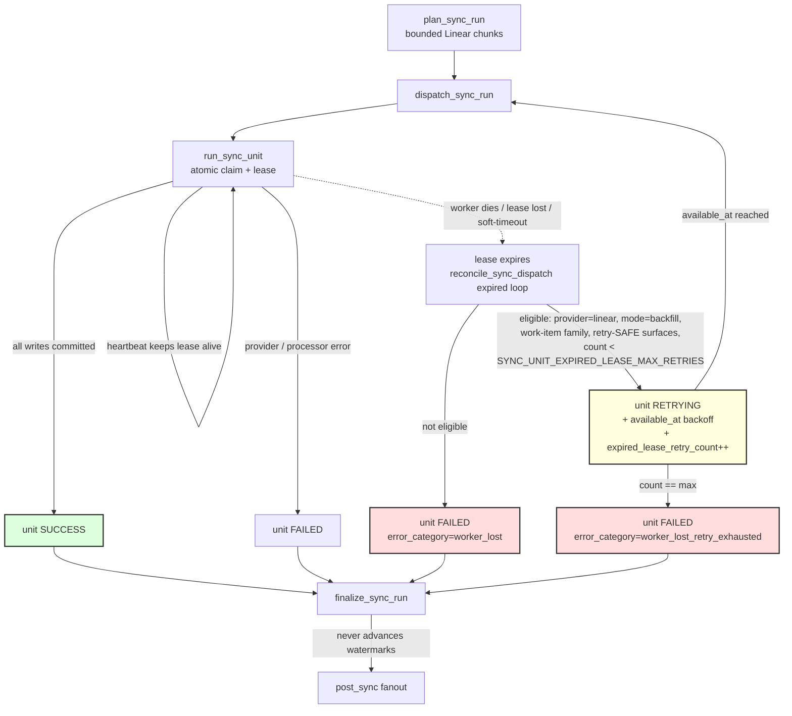

# Data Pipeline Architecture (dev-health-ops)

## Pipeline Overview

The dev-health-ops backend follows a strict unidirectional pipeline:

```
Connectors → Processors → Sinks → Metrics → Visualization
```

Each stage has clear responsibilities. Do not collapse layers or bypass stages.

---

All paths below are relative to `src/dev_health_ops/`.

## 1. Connectors (`connectors/`)

**Purpose:** Fetch raw data from external providers.

### Supported Providers

| Provider | Module | Sync Targets |
|----------|--------|--------------|
| Local Git | `connectors/local.py` | git, blame |
| GitHub | `connectors/github.py` | git, prs, cicd, deployments, work-items |
| GitLab | `connectors/gitlab.py` | git, prs, cicd, deployments, native incidents, work-items |
| Jira | `connectors/jira.py` | work-items, JSM native incidents |
| Synthetic | `connectors/synthetic.py` | fixtures generation |

### Rules

- Network I/O should be async and batch-friendly
- Respect rate limits and backoff mechanisms
- Return raw provider data (minimal transformation)
- Handle pagination completely (never assume single page)

---

## 2. Processors (`processors/`)

**Purpose:** Normalize and transform connector outputs into internal models.

### Key Processor

- `processors/local.py` — Primary processor for local git data

### Responsibilities

- Map provider-specific fields to unified models
- Normalize timestamps to UTC
- Resolve identities across providers
- Enrich with computed fields (e.g., commit size buckets)

### Rules

- No network I/O
- No persistence logic
- Transform only, no business decisions
- Output must match models in `models/`

---

## 3. Storage / Sinks (`metrics/sinks/`)

**Purpose:** Persist processed data to storage backends.

### Supported Backends

| Backend | Connection | Use Case |
|---------|------------|----------|
| PostgreSQL | `postgresql+asyncpg://` | Relational, migrations |
| ClickHouse | `clickhouse://` | Analytics queries |
| MongoDB | `mongodb://` | Document storage |
| SQLite | `sqlite+aiosqlite://` | Local dev/test |

### Rules

- **No file exports. No debug dumps. No JSON/YAML output paths.**
- All persistence goes through sink modules
- Backend selection via `--db` flag or `DATABASE_URI`
- Secondary sink via `SECONDARY_DATABASE_URI` with `sink='both'`

### Sink Interface

```python
async def write_batch(records: List[Model], session: AsyncSession) -> int:
    """Write a batch of records. Returns count written."""
```

---

## 4. Metrics (`metrics/`)

**Purpose:** Compute higher-level rollups and aggregates from persisted data.

### Key Metric Tables

| Table | Key | Content |
|-------|-----|---------|
| `repo_metrics_daily` | `(repo_id, day)` | Commits, LOC, PR cycle time |
| `user_metrics_daily` | `(repo_id, author_email, day)` | User activity |
| `work_item_metrics_daily` | `(day, provider, work_scope_id, team_id)` | Throughput, WIP, cycle time |
| `team_metrics_daily` | `(team_id, day)` | After-hours, weekend ratios |

### Computation Model

- Metrics are **append-only** with `computed_at` versioning
- Use `argMax(<metric>, computed_at)` to get latest value
- Re-computation is safe (idempotent via compound keys)

### Work-item team attribution

> See [Team Attribution](team-attribution.md) for the full architecture with
> sequence, flowchart, ER, and component diagrams.

> **CHAOS-2600 (current model):** the implemented precedence is the 8-source staged model in
> [team-attribution.md §0](team-attribution.md) (`native_team > issue_project > project_ownership >
> repo_ownership > assignee_membership > linked_issue > manual_fallback > unassigned`), resolved
> **query-time from ClickHouse** — the team catalog (`teams`), the team→project / team→repo ownership
> dimensions, and identity→team membership (the ClickHouse `identities` table). There is **no live
> Postgres** team or identity-membership lookup.
>
> **The numbered list below is HISTORICAL** (the pre-CHAOS-2600 4-tier cascade) and is kept only for
> orientation. In particular, the assignee-membership tier no longer reads `IdentityMapping.team_ids`
> from Postgres — that path is dead (dropped in CS6); membership is matched against ClickHouse
> `teams.members` / the `identities` table. `linked_issue` is a true fallback **below** ownership and
> assignee membership, not above them.

Historically, every work item was stamped with a `team_id` at compute time
(`metrics/compute_work_items.py`) via a fallback cascade
(`resolve_base_team` + one inheritance tier), first match wins:

1. **Scope key** — `ProjectKeyTeamResolver.resolve(work_scope_id)`: the Jira
   project key, GitHub/GitLab repo path, or Linear project name.
2. **Project key** — retry with `WorkItem.project_key` (Linear's TEAM key,
   which differs from the project name when an issue sits in a project).
3. **Assignee membership** — `TeamResolver` mapped the primary assignee's
   canonical identity to a team. *(Historical: this read `IdentityMapping.team_ids`
   from Postgres; CS5 resolves assignee membership from ClickHouse
   `teams.members` / the `identities` table instead.)*
4. **Linked-issue inheritance** — `LinkedIssueTeamResolver`: an item that
   still resolved to no team borrows the team of an issue it links to via
   `work_item_dependencies`. This is **provider-agnostic** — a GitHub/GitLab
   PR inherits the team of the Linear/Jira issue it closes — and is what lets
   PRs (which match none of tiers 1–3) share a team dimension with the issue
   trackers in the investment allocation-coverage and team-exchange views.
5. **`unassigned`** — the normalized sentinel when every tier misses.

Cross-provider links are captured during sync as provider-neutral
`extkey:KEY` dependency edges (GitHub: PR body magic-words + head branch;
GitLab: issue/MR description magic-words; Jira: native `issuelinks`). The
key is resolved to the real `linear:`/`jira:` work item at inheritance time,
so over-capturing is harmless — a key with no matching issue never resolves,
and a key that exists in **both** Linear and Jira is treated as ambiguous and
dropped rather than guessed.
Only **inheritance-safe relationship types** (`relates_to`, `relates`,
`duplicates`, `external_issue_key`) transfer a team; blocking links
(`blocks`/`blocked_by`), which routinely span teams, are ignored. When
several donors match one source, the lexicographically smallest canonical
target wins (a stable tiebreak, since ClickHouse rows are unordered).

The resolver (`build_linked_issue_team_resolver`) is built **once per run**
and applied to *every* work-item metric family — cycle-times
(`compute_work_item_metrics_daily`), state-durations
(`compute_work_item_state_durations_daily`), and the issue-type / investment
rollups (via `_get_team`) — so a PR reads with the same team in every table
and cross-table joins stay consistent.

It must see a **donor-complete** set, not just the active window — but the
read is **bounded to the linked surface** (the work items actually referenced
by a dependency edge), not the tenant's whole history, and is best-effort (a
failed donor read degrades to no inheritance rather than aborting the run):

- `job_daily` reads dependency edges
  (`ClickHouseDataLoader.load_work_item_dependencies`, `FINAL`) **bounded to
  the source ids evaluated this run** (the run-window work items), collects the
  referenced target ids / external keys, and loads only those donor items via
  `load_work_item_dependencies_donors`. This still spans repos and time (a PR
  can close an issue completed long before the metrics day, or a repo-less
  Linear/Jira issue) without scanning the full graph.
- `job_work_items` (the sync) treats the **freshly-extracted edges as
  authoritative** for the items it synced — they are the current
  source-of-truth, so a link removed from a PR is simply absent and stops
  granting inheritance — and loads only the referenced donor *items* from
  ClickHouse (bounded), so an incremental run that re-fetches only the PR still
  finds a donor synced earlier.

All donor reads are **tenant-scoped**: the org-wide donor/edge queries run
only under an explicit `org_id`, so a PR can never inherit a team from another
organization's issue. An unscoped (dev/CLI) run skips inheritance rather than
reading across tenants.

Because the edges are written during a **work-items sync**, a sync (not just a
metrics recompute) is required for newly-captured links to take effect.

> Note: branch-name capture trusts the head branch (the Linear convention),
> so a contributor could in principle name a branch to force a team
> inheritance. This is an analytics-attribution signal, not an authorization
> boundary, and it is bounded to the contributor's own org (tenant-scoped
> donors) and to inheritance-safe relationship types — the worst case is a
> self-inflicted mis-attribution of one PR's team within the org — so it is
> accepted rather than gated.

> Known limitation: `work_item_dependencies` is append-only and has no
> tombstone, so a *removed* link is not deleted from the table. The **sync**
> path is unaffected — it re-extracts the PR's current edges, so a removed link
> stops inheriting immediately. But a standalone **`job_daily` recompute** reads
> persisted edges and can keep honoring a removed link until the next sync
> re-stamps the source. A general link-lifecycle/tombstone for
> `work_item_dependencies` (which also affects the work-graph) is tracked as a
> follow-up.

**Purpose:** Render persisted data for exploration.

### dev-health-web

- **Visualization-only** — Must not become source of truth
- Consumes data via GraphQL API from dev-health-ops
- No category recomputation at UX time

---

## Backfill Pipeline

Historical backfill reuses the same data pipeline (Connectors -> Processors -> Sinks) but operates differently from incremental sync:

### How It Works

1. **Date range splitting** -- The `BackfillChunker` divides the requested date range into bounded windows. Non-Linear providers use the default 7-day window. Linear work-item-family backfills use `LINEAR_BACKFILL_MAX_WINDOW_DAYS` (default `14`); CHAOS-2717 bounds each window's issue crawl to its own slice (`updatedAt` gte/lte), so the size balances a single unit's lease/soft-timeout budget against per-hour request volume (smaller windows re-multiply per-window teams/cycles fetches toward Linear's rate limit).
2. **Sequential processing** -- Each chunk runs through the standard sync pipeline independently
3. **Progress tracking** -- A `BackfillJob` record in PostgreSQL tracks chunk completion and overall progress

### Key Differences from Incremental Sync

| Aspect | Incremental Sync | Backfill |
|--------|-----------------|----------|
| Trigger | Scheduled / manual | Manual or API-triggered |
| Date range | From watermark to now | Explicit `--since` / `--before` |
| Watermarks | Updates SyncWatermarks | **Never** updates watermarks |
| Chunking | Single pass | Bounded windows (7d default; Linear work-item families use `LINEAR_BACKFILL_MAX_WINDOW_DAYS`, default `14`) |
| Progress | Job run status only | Per-chunk progress via BackfillJob |
| Queue | `sync` | `sync` fan-out (`dispatch_sync_run` → `run_sync_unit` → `finalize_sync_run`; the dedicated `backfill` queue was retired in CHAOS-2647) |

### ClickHouse retry idempotency matrix

If a Linear work-item backfill commits ClickHouse writes and the worker dies
before terminal status, bounded retry can replay the same completed window with
identical natural keys and newer version-column values. Readers are the safety
boundary: retry eligibility requires every production reader to collapse the
table as listed below.

| Surface | Engine/version | Reader collapse/fence | Retry verdict |
| --- | --- | --- | --- |
| `work_items` | `ReplacingMergeTree(last_synced)` | `FINAL` on `(org_id, repo_id, work_item_id)` in loaders, work-graph, investment, capacity, GraphQL, data-health, and API work-unit readers | SAFE |
| `work_item_transitions` | `ReplacingMergeTree(last_synced)` | Semantic-row dedupe: group by every semantic event column (`org_id`, `repo_id`, `work_item_id`, `occurred_at`, `provider`, statuses/raw statuses, `actor`) and keep `max(last_synced)` | SAFE |
| `work_item_dependencies` | `ReplacingMergeTree(last_synced)` | Existing loader reads with `FINAL`; dependency rows key on the semantic relationship tuple | SAFE |
| `work_item_interactions` | `ReplacingMergeTree(last_synced)` | Semantic-row dedupe: group by `org_id`, `work_item_id`, `provider`, `interaction_type`, `occurred_at`, `actor`, `body_length`; no production reader currently bypasses this helper | SAFE |
| `work_item_reopen_events` | `ReplacingMergeTree(last_synced)` | Semantic-row dedupe: group by `org_id`, `work_item_id`, `occurred_at`, statuses/raw statuses, `actor`; no production reader currently bypasses this helper | SAFE |
| `sprints` | `ReplacingMergeTree(last_synced)` | `FINAL` on `(org_id, provider, sprint_id)` | SAFE |
| `work_item_cycle_times` | `ReplacingMergeTree(computed_at)` | Readers use `argMax(..., computed_at)` by work-item natural key | SAFE |
| `work_item_state_durations_daily` | `MergeTree` | Readers use `argMax(..., computed_at)` by rollup key | SAFE |
| `work_item_team_attributions` | `ReplacingMergeTree(computed_at)` | Latest snapshot fence `(work_item_id, max(computed_at))` plus `FINAL` for exact-key duplicates, matching `api/graphql/resolvers/team_attribution.py` | SAFE |
| `manual_attribution_fallbacks` | `ReplacingMergeTree(updated_at)` | Readers use latest active fallback by key/version | SAFE |
| `ai_attribution` | `ReplacingMergeTree(computed_at)` | Readers use resolved latest attribution rows | SAFE |

Do not make replay idempotency depend on delete-by-window, sync-unit attempt
columns, or plain `FINAL` for event-style surfaces whose sorting keys are
coarser than the event semantics.

**Retry-DISABLED policy.** Retry is DISABLED for any surface not proven retry-SAFE above. The collapse mechanism is per-surface: `FINAL` for `work_items` / `work_item_dependencies` / `sprints`; semantic-row dedupe for the event surfaces `work_item_transitions` / `work_item_interactions` / `work_item_reopen_events`; `argMax(..., computed_at)` for `work_item_cycle_times` / `work_item_state_durations_daily`; and a latest-snapshot fence + `FINAL` for `work_item_team_attributions` (`manual_attribution_fallbacks` / `ai_attribution` resolve to their latest rows). Because every Linear work-item backfill surface above is currently SAFE, **no surface is presently retry-disabled**. If a future surface lacks proven reader-collapse it must be marked retry-DISABLED here and excluded from the worker-core eligibility gate before any chunk that writes it can become retry-eligible.

### Tier Limits

Backfill depth is gated by organization billing tier:

| Tier | Max Days |
|------|----------|
| Community | 30 |
| Team | 90 |
| Enterprise | Unlimited |

### Components

- `backfill/chunker.py` -- `chunk_date_range()` splits date ranges into windows
- `backfill/runner.py` -- `run_backfill_for_config()` orchestrates chunked sync
- `backfill/cli.py` -- `dev-hops backfill run` CLI command
- `workers/sync_units.py` -- `dispatch_sync_run` → `run_sync_unit` → `finalize_sync_run` fan-out on the `sync` queue (API backfill plans a backfill-mode `SyncRun`; the standalone `run_backfill` task was removed in CHAOS-2647)
- `models/backfill.py` -- `BackfillJob` PostgreSQL model for progress tracking
- `api/services/backfill.py` -- `BackfillJobService` async CRUD for API layer

### Composition with Incremental Sync (no date gap)

> Unit decomposition and reference-data cardinality: see [Sync Unit Model](sync-unit-model.md). The work-item-family collapse writes per-dataset watermarks only for incremental/full-resync units, preserving the invariant below.

Coverage summaries are a separate consumer path from ClickHouse reader collapse. They must expand any composite work-item-family `SyncRunUnit` using its `family_dataset_*` flags before summarizing comments, history, projects, or labels coverage. That rule applies to admin coverage and observability views, not to the retry-idempotency matrix.

Backfill **never seeds the watermark** (CHAOS-2514), so the first incremental
sync after a backfill cold-starts. Continuity across the seam is provided by the
incremental **cold-start depth** (CHAOS-2569): with no watermark, the planner
resolves `window_start = now - initial_sync_depth` (default 30d, tier-capped)
rather than a 1-day window.

**Contract:** a `backfill` followed by `Sync Now` produces **no date gap** as
long as the first incremental runs within `initial_sync_depth` of the backfill's
`before`. In the canonical onboarding flow (backfill up to ~now, then daily
incrementals) the cold-start window `[now - depth, now]` overlaps the backfill's
upper bound, so coverage is continuous. The no-gap guarantee is **bounded to the
cold-start depth**: backfill stays watermark-free (CHAOS-2514) and no
`backfilled-through` marker is introduced. Closing the paused-then-resumed
residual below would require such a marker and is deliberately deferred
(CHAOS-2588).

**Residual edges (intentional / tracked):**

1. *Paused-then-resumed* -- if the first incremental runs **more than
   `initial_sync_depth` days** after the backfill's `before` (e.g. scheduling
   paused for >30d immediately after a backfill), a gap `[before, now - depth]`
   remains. Narrow operational residual, tracked in CHAOS-2588.
2. *Deliberate historical backfill* -- backfilling a window whose `before` is
   far in the past does **not** trigger a giant `[before, now]` first
   incremental; the user chose a historical window, and auto-filling to now
   would be surprising and expensive. This is **intended**, not a gap to close.

### Retry Lifecycle (Expired-Lease Recovery)

Linear work-item backfill chunks are long and provider-paced, so a worker can lose its lease (crash, `SIGKILL`, or a soft-timeout) mid-chunk before the unit reaches a terminal state. The periodic `reconcile_sync_dispatch` relay owns recovery:

- **Eligible expired leases retry.** A unit is retry-eligible only when ALL of the following hold: `provider == linear`, `mode == backfill`, the dataset is a work-item family, the parent run is still non-terminal, every ClickHouse surface the chunk writes is in the proven retry-SAFE set, and `expired_lease_retry_count < SYNC_UNIT_EXPIRED_LEASE_MAX_RETRIES`. The relay flips `RUNNING -> RETRYING` (atomic CAS), increments `expired_lease_retry_count`, clears the lease, and sets `available_at = now + SYNC_UNIT_EXPIRED_LEASE_RETRY_BACKOFF_SECONDS`. When `available_at` is reached the unit is redispatched through the normal `dispatch_sync_run` path.
- **Ineligible expired leases fail.** Any unit that is not retry-eligible (wrong provider/mode/dataset, parent run already terminal, or any touched surface is NOT proven idempotent) is marked terminal `FAILED` with `error_category = worker_lost` — the pre-existing behavior. Retry is **DISABLED by default**; only the narrowly-eligible Linear backfill path opts in.
- **Exhausted retries fail.** When `expired_lease_retry_count` reaches `SYNC_UNIT_EXPIRED_LEASE_MAX_RETRIES`, the unit is marked terminal `FAILED` with `error_category = worker_lost_retry_exhausted`.
- **Soft-timeout** is classified the same way (`error_category = soft_timeout`) and follows the same retry-eligibility policy, handled minimally before the hard time limit hits (no ClickHouse mutation, no finalization in the timeout handler).

**Watermark non-update invariant (CHAOS-2514) holds across retries.** A retried chunk re-reads its original explicit `[since, before]` window; backfill never advances `SyncWatermarks`, so re-running a chunk cannot skip or double-advance incremental coverage. Combined with idempotent ClickHouse writes on the retry-SAFE surfaces, a redispatched chunk re-writes the same rows and downstream reads collapse them (no double-counting).



## Durable Dispatch & Reconciliation

A committed `SyncRun` cannot strand if a Celery publish failed, a worker died,
the broker purged a message, or finalization was never enqueued. Producers write
a durable `sync_dispatch_outbox` row **in the same transaction** as the
run/units/terminal-writes, and the periodic `reconcile_sync_dispatch` beat is the
sole durable relay that re-drives due rows. Dispatch and finalize are
at-least-once (idempotent via the unit claim guard and the post-sync ledger);
post-sync fanout is at-most-once (never double-counts). See
[Dispatch Outbox](dispatch-outbox.md) for the full design, crash-window flow,
and per-kind delivery semantics (CHAOS-2581).

## Storage Schema Highlights

### ClickHouse Tables

Tables are `MergeTree` partitioned by `toYYYYMM(day)`:

```sql
CREATE TABLE repo_metrics_daily (
    repo_id UUID,
    day Date,
    computed_at DateTime,
    -- metrics columns
) ENGINE = MergeTree()
PARTITION BY toYYYYMM(day)
ORDER BY (repo_id, day);
```

### PostgreSQL Tables

Managed via Alembic migrations in `alembic/`:

```bash
# Generate migration
alembic revision --autogenerate -m "description"

# Apply migrations
alembic upgrade head
```

---

## Environment Variables

| Variable | Purpose | Required |
|----------|---------|----------|
| `DATABASE_URI` | Primary database connection | Yes |
| `SECONDARY_DATABASE_URI` | Secondary sink (with `--sink both`) | No |
| `DB_ECHO` | Enable SQL logging | No |
| `BATCH_SIZE` | Records per batch insert | No (default: 100) |
| `MAX_WORKERS` | Parallel workers | No (default: 4) |

---

## Adding New Pipeline Components

### New Connector

1. Create `connectors/newprovider.py`
2. Implement async fetch methods
3. Register in `connectors/__init__.py`
4. Add CLI integration in `cli.py`

### New Metric

1. Define model in `models/`
2. Add sink in `metrics/sinks/`
3. Implement computation in `metrics/`
4. Create Alembic migration if using Postgres
5. Update dev-health-web or OTLP dashboards as needed

### Rules When Modifying

- Never bypass sinks for persistence
- Always handle pagination
- Add tests under `tests/`
- Respect existing async patterns
