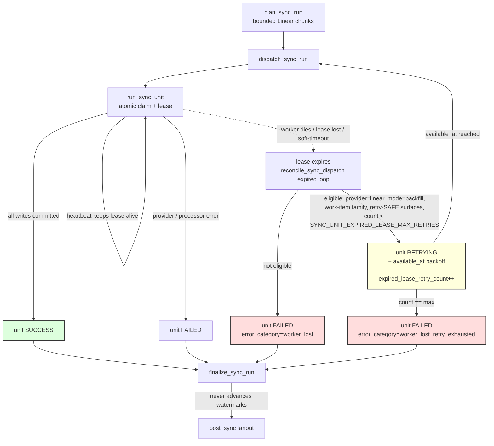

# Data Pipeline Architecture (dev-health-ops)

## Pipeline Overview

The dev-health-ops backend follows a strict unidirectional pipeline:

```
Connectors → Processors → Sinks → Metrics → Visualization
```

Each stage has clear responsibilities. Do not collapse layers or bypass stages.

---

All paths below are relative to `src/dev_health_ops/`.

## 1. Connectors (`connectors/`)

**Purpose:** Fetch raw data from external providers.

### Supported Providers

| Provider | Module | Sync Targets |
|----------|--------|--------------|
| Local Git | `connectors/local.py` | git, blame |
| GitHub | `connectors/github.py` | git, prs, cicd, deployments, work-items |
| GitLab | `connectors/gitlab.py` | git, prs, cicd, deployments, native incidents, work-items |
| Jira | `connectors/jira.py` | work-items, JSM native incidents |
| Synthetic | `connectors/synthetic.py` | fixtures generation |

### Rules

- Network I/O should be async and batch-friendly
- Respect rate limits and backoff mechanisms
- Return raw provider data (minimal transformation)
- Handle pagination completely (never assume single page)

---

## 2. Processors (`processors/`)

**Purpose:** Normalize and transform connector outputs into internal models.

### Key Processor

- `processors/local.py` — Primary processor for local git data

### Responsibilities

- Map provider-specific fields to unified models
- Normalize timestamps to UTC
- Resolve identities across providers
- Enrich with computed fields (e.g., commit size buckets)

### Rules

- No network I/O
- No persistence logic
- Transform only, no business decisions
- Output must match models in `models/`

---

## 3. Storage / Sinks (`metrics/sinks/`)

**Purpose:** Persist processed data to storage backends.

### Supported Backends

| Backend | Connection | Use Case |
|---------|------------|----------|
| PostgreSQL | `postgresql+asyncpg://` | Relational, migrations |
| ClickHouse | `clickhouse://` | Analytics queries |
| MongoDB | `mongodb://` | Document storage |
| SQLite | `sqlite+aiosqlite://` | Local dev/test |

### Rules

- **No file exports. No debug dumps. No JSON/YAML output paths.**
- All persistence goes through sink modules
- Backend selection via `--db` flag or `DATABASE_URI`
- Secondary sink via `SECONDARY_DATABASE_URI` with `sink='both'`

### Sink Interface

```python
async def write_batch(records: List[Model], session: AsyncSession) -> int:
    """Write a batch of records. Returns count written."""
```

---

## 4. Metrics (`metrics/`)

**Purpose:** Compute higher-level rollups and aggregates from persisted data.

### Key Metric Tables

| Table | Key | Content |
|-------|-----|---------|
| `repo_metrics_daily` | `(repo_id, day)` | Commits, LOC, PR cycle time |
| `user_metrics_daily` | `(repo_id, author_email, day)` | User activity |
| `work_item_metrics_daily` | `(day, provider, work_scope_id, team_id)` | Throughput, WIP, cycle time |
| `team_metrics_daily` | `(team_id, day)` | After-hours, weekend ratios |

### Computation Model

- Metrics are **append-only** with `computed_at` versioning
- Use `argMax(<metric>, computed_at)` to get latest value
- Re-computation is safe (idempotent via compound keys)

### Work-item team attribution

> See [Team Attribution](team-attribution.md) for the full architecture with
> sequence, flowchart, ER, and component diagrams.

> **CHAOS-2600 (current model):** the implemented precedence is the 8-source staged model in
> [team-attribution.md §0](team-attribution.md) (`native_team > issue_project > project_ownership >
> repo_ownership > assignee_membership > linked_issue > manual_fallback > unassigned`), resolved
> **query-time from ClickHouse** — the team catalog (`teams`), the team→project / team→repo ownership
> dimensions, and identity→team membership (the ClickHouse `identities` table). There is **no live
> Postgres** team or identity-membership lookup.
>
> **The numbered list below is HISTORICAL** (the pre-CHAOS-2600 4-tier cascade) and is kept only for
> orientation. In particular, the assignee-membership tier no longer reads `IdentityMapping.team_ids`
> from Postgres — that path is dead (dropped in CS6); membership is matched against ClickHouse
> `teams.members` / the `identities` table. `linked_issue` is a true fallback **below** ownership and
> assignee membership, not above them.

Historically, every work item was stamped with a `team_id` at compute time
(`metrics/compute_work_items.py`) via a fallback cascade
(`resolve_base_team` + one inheritance tier), first match wins:

1. **Scope key** — `ProjectKeyTeamResolver.resolve(work_scope_id)`: the Jira
   project key, GitHub/GitLab repo path, or Linear project name.
2. **Project key** — retry with `WorkItem.project_key` (Linear's TEAM key,
   which differs from the project name when an issue sits in a project).
3. **Assignee membership** — `TeamResolver` mapped the primary assignee's
   canonical identity to a team. *(Historical: this read `IdentityMapping.team_ids`
   from Postgres; CS5 resolves assignee membership from ClickHouse
   `teams.members` / the `identities` table instead.)*
4. **Linked-issue inheritance** — `LinkedIssueTeamResolver`: an item that
   still resolved to no team borrows the team of an issue it links to via
   `work_item_dependencies`. This is **provider-agnostic** — a GitHub/GitLab
   PR inherits the team of the Linear/Jira issue it closes — and is what lets
   PRs (which match none of tiers 1–3) share a team dimension with the issue
   trackers in the investment allocation-coverage and team-exchange views.
5. **`unassigned`** — the normalized sentinel when every tier misses.

Cross-provider links are captured during sync as provider-neutral
`extkey:KEY` dependency edges (GitHub: PR body magic-words + head branch;
GitLab: issue/MR description magic-words; Jira: native `issuelinks`). The
key is resolved to the real `linear:`/`jira:` work item at inheritance time,
so over-capturing is harmless — a key with no matching issue never resolves,
and a key that exists in **both** Linear and Jira is treated as ambiguous and
dropped rather than guessed.
Only **inheritance-safe relationship types** (`relates_to`, `relates`,
`duplicates`, `external_issue_key`) transfer a team; blocking links
(`blocks`/`blocked_by`), which routinely span teams, are ignored. When
several donors match one source, the lexicographically smallest canonical
target wins (a stable tiebreak, since ClickHouse rows are unordered).

The resolver (`build_linked_issue_team_resolver`) is built **once per run**
and applied to *every* work-item metric family — cycle-times
(`compute_work_item_metrics_daily`), state-durations
(`compute_work_item_state_durations_daily`), and the issue-type / investment
rollups (via `_get_team`) — so a PR reads with the same team in every table
and cross-table joins stay consistent.

It must see a **donor-complete** set, not just the active window — but the
read is **bounded to the linked surface** (the work items actually referenced
by a dependency edge), not the tenant's whole history, and is best-effort (a
failed donor read degrades to no inheritance rather than aborting the run):

- `job_daily` reads dependency edges
  (`ClickHouseDataLoader.load_work_item_dependencies`, `FINAL`) **bounded to
  the source ids evaluated this run** (the run-window work items), collects the
  referenced target ids / external keys, and loads only those donor items via
  `load_work_item_dependencies_donors`. This still spans repos and time (a PR
  can close an issue completed long before the metrics day, or a repo-less
  Linear/Jira issue) without scanning the full graph.
- `job_work_items` (the sync) treats the **freshly-extracted edges as
  authoritative** for the items it synced — they are the current
  source-of-truth, so a link removed from a PR is simply absent and stops
  granting inheritance — and loads only the referenced donor *items* from
  ClickHouse (bounded), so an incremental run that re-fetches only the PR still
  finds a donor synced earlier.

All donor reads are **tenant-scoped**: the org-wide donor/edge queries run
only under an explicit `org_id`, so a PR can never inherit a team from another
organization's issue. An unscoped (dev/CLI) run skips inheritance rather than
reading across tenants.

Because the edges are written during a **work-items sync**, a sync (not just a
metrics recompute) is required for newly-captured links to take effect.

> Note: branch-name capture trusts the head branch (the Linear convention),
> so a contributor could in principle name a branch to force a team
> inheritance. This is an analytics-attribution signal, not an authorization
> boundary, and it is bounded to the contributor's own org (tenant-scoped
> donors) and to inheritance-safe relationship types — the worst case is a
> self-inflicted mis-attribution of one PR's team within the org — so it is
> accepted rather than gated.

> Known limitation: `work_item_dependencies` is append-only and has no
> tombstone, so a *removed* link is not deleted from the table. The **sync**
> path is unaffected — it re-extracts the PR's current edges, so a removed link
> stops inheriting immediately. But a standalone **`job_daily` recompute** reads
> persisted edges and can keep honoring a removed link until the next sync
> re-stamps the source. A general link-lifecycle/tombstone for
> `work_item_dependencies` (which also affects the work-graph) is tracked as a
> follow-up.

**Purpose:** Render persisted data for exploration.

### dev-health-web

- **Visualization-only** — Must not become source of truth
- Consumes data via GraphQL API from dev-health-ops
- No category recomputation at UX time

---

## Backfill Pipeline

Historical backfill reuses the same data pipeline (Connectors -> Processors -> Sinks) but operates differently from incremental sync:

### How It Works

1. **Date range splitting** -- The `BackfillChunker` divides the requested date range into bounded windows. Non-Linear providers use the default 7-day window. Linear work-item-family backfills use `LINEAR_BACKFILL_MAX_WINDOW_DAYS` (default `14`); CHAOS-2717 bounds each window's issue crawl to its own slice (`updatedAt` gte/lte), so the size balances a single unit's lease/soft-timeout budget against per-hour request volume (smaller windows re-multiply per-window teams/cycles fetches toward Linear's rate limit).
2. **Sequential processing** -- Each chunk runs through the standard sync pipeline independently
3. **Progress tracking** -- A `BackfillJob` record in PostgreSQL tracks chunk completion and overall progress

### Key Differences from Incremental Sync

| Aspect | Incremental Sync | Backfill |
|--------|-----------------|----------|
| Trigger | Scheduled / manual | Manual or API-triggered |
| Date range | From watermark to now | Explicit `--since` / `--before` |
| Watermarks | Updates SyncWatermarks | **Never** updates watermarks |
| Chunking | Single pass | Bounded windows (7d default; Linear work-item families use `LINEAR_BACKFILL_MAX_WINDOW_DAYS`, default `14`) |
| Progress | Job run status only | Per-chunk progress via BackfillJob |
| Queue | `sync` | `sync` fan-out (`dispatch_sync_run` → `run_sync_unit` → `finalize_sync_run`; the dedicated `backfill` queue was retired in CHAOS-2647) |

### ClickHouse retry idempotency matrix

If a Linear work-item backfill commits ClickHouse writes and the worker dies
before terminal status, bounded retry can replay the same completed window with
identical natural keys and newer version-column values. Readers are the safety
boundary: retry eligibility requires every production reader to collapse the
table as listed below.

| Surface | Engine/version | Reader collapse/fence | Retry verdict |
| --- | --- | --- | --- |
| `work_items` | `ReplacingMergeTree(last_synced)` | `FINAL` on `(org_id, repo_id, work_item_id)` in loaders, work-graph, investment, capacity, GraphQL, data-health, and API work-unit readers | SAFE |
| `work_item_transitions` | `ReplacingMergeTree(last_synced)` | Semantic-row dedupe: group by every semantic event column (`org_id`, `repo_id`, `work_item_id`, `occurred_at`, `provider`, statuses/raw statuses, `actor`) and keep `max(last_synced)` | SAFE |
| `work_item_dependencies` | `ReplacingMergeTree(last_synced)` | Existing loader reads with `FINAL`; dependency rows key on the semantic relationship tuple | SAFE |
| `work_item_interactions` | `ReplacingMergeTree(last_synced)`, key `(org_id, work_item_id, occurred_at, interaction_type, interaction_id)` (CHAOS-8790) | Readers use the view `work_item_interactions_current`: `FINAL`, and a legacy row (`interaction_id = ''`) is hidden once a keyed row exists in its `(org_id, work_item_id, occurred_at, interaction_type)` slot. The Python semantic-row helper (`WORK_ITEM_INTERACTIONS_DEDUPED`) groups on content, not on the id, and is not a reader contract; it is frozen with the Python code | SAFE |
| `work_item_reopen_events` | `ReplacingMergeTree(last_synced)` | Semantic-row dedupe: group by `org_id`, `work_item_id`, `occurred_at`, statuses/raw statuses, `actor`; no production reader currently bypasses this helper | SAFE |
| `sprints` | `ReplacingMergeTree(last_synced)` | `FINAL` on `(org_id, provider, sprint_id)` | SAFE |
| `work_item_cycle_times` | `ReplacingMergeTree(computed_at)` | Readers use `argMax(..., computed_at)` by work-item natural key | SAFE |
| `work_item_state_durations_daily` | `MergeTree` | Readers use `argMax(..., computed_at)` by rollup key | SAFE |
| `work_item_team_attributions` | `ReplacingMergeTree(computed_at)` | Latest snapshot fence `(work_item_id, max(computed_at))` plus `FINAL` for exact-key duplicates, matching `api/graphql/resolvers/team_attribution.py` | SAFE |
| `manual_attribution_fallbacks` | `ReplacingMergeTree(updated_at)` | Readers use latest active fallback by key/version | SAFE |
| `ai_attribution` | `ReplacingMergeTree(computed_at)` | Readers use resolved latest attribution rows | SAFE |

Do not make replay idempotency depend on delete-by-window, sync-unit attempt
columns, or plain `FINAL` for event-style surfaces whose sorting keys are
coarser than the event semantics.

**Retry-DISABLED policy.** Retry is DISABLED for any surface not proven retry-SAFE above. The collapse mechanism is per-surface: `FINAL` for `work_items` / `work_item_dependencies` / `sprints`; semantic-row dedupe for the event surfaces `work_item_transitions` / `work_item_reopen_events`; the id-keyed rule for `work_item_interactions` (the provider comment id is part of the sorting key, so two comments in one millisecond are two rows, and the view `work_item_interactions_current` hides a legacy row once a keyed row exists in its slot); `argMax(..., computed_at)` for `work_item_cycle_times` / `work_item_state_durations_daily`; and a latest-snapshot fence + `FINAL` for `work_item_team_attributions` (`manual_attribution_fallbacks` / `ai_attribution` resolve to their latest rows). Because every Linear work-item backfill surface above is currently SAFE, **no surface is presently retry-disabled**. If a future surface lacks proven reader-collapse it must be marked retry-DISABLED here and excluded from the worker-core eligibility gate before any chunk that writes it can become retry-eligible.

### Tier Limits

Backfill depth is gated by organization billing tier:

| Tier | Max Days |
|------|----------|
| Community | 30 |
| Team | 90 |
| Enterprise | Unlimited |

### Components

- `backfill/chunker.py` -- `chunk_date_range()` splits date ranges into windows
- `backfill/runner.py` -- `run_backfill_for_config()` orchestrates chunked sync
- `backfill/cli.py` -- `dev-hops backfill run` CLI command
- `workers/sync_units.py` -- `dispatch_sync_run` → `run_sync_unit` → `finalize_sync_run` fan-out on the `sync` queue (API backfill plans a backfill-mode `SyncRun`; the standalone `run_backfill` task was removed in CHAOS-2647)
- `models/backfill.py` -- `BackfillJob` PostgreSQL model for progress tracking
- `api/services/backfill.py` -- `BackfillJobService` async CRUD for API layer

### Composition with Incremental Sync (no date gap)

> Unit decomposition and reference-data cardinality: see [Sync Unit Model](sync-unit-model.md). The work-item-family collapse writes per-dataset watermarks only for incremental/full-resync units, preserving the invariant below.

Coverage summaries are a separate consumer path from ClickHouse reader collapse. They must expand any composite work-item-family `SyncRunUnit` using its `family_dataset_*` flags before summarizing comments, history, projects, or labels coverage. That rule applies to admin coverage and observability views, not to the retry-idempotency matrix.

Backfill **never seeds the watermark** (CHAOS-2514), so the first incremental
sync after a backfill cold-starts. Continuity across the seam is provided by the
incremental **cold-start depth** (CHAOS-2569): with no watermark, the planner
resolves `window_start = now - initial_sync_depth` (default 30d, tier-capped)
rather than a 1-day window.

**Contract:** a `backfill` followed by `Sync Now` produces **no date gap** as
long as the first incremental runs within `initial_sync_depth` of the backfill's
`before`. In the canonical onboarding flow (backfill up to ~now, then daily
incrementals) the cold-start window `[now - depth, now]` overlaps the backfill's
upper bound, so coverage is continuous. The no-gap guarantee is **bounded to the
cold-start depth**: backfill stays watermark-free (CHAOS-2514) and no
`backfilled-through` marker is introduced. Closing the paused-then-resumed
residual below would require such a marker and is deliberately deferred
(CHAOS-2588).

**Residual edges (intentional / tracked):**

1. *Paused-then-resumed* -- if the first incremental runs **more than
   `initial_sync_depth` days** after the backfill's `before` (e.g. scheduling
   paused for >30d immediately after a backfill), a gap `[before, now - depth]`
   remains. Narrow operational residual, tracked in CHAOS-2588.
2. *Deliberate historical backfill* -- backfilling a window whose `before` is
   far in the past does **not** trigger a giant `[before, now]` first
   incremental; the user chose a historical window, and auto-filling to now
   would be surprising and expensive. This is **intended**, not a gap to close.

### Retry Lifecycle (Expired-Lease Recovery)

Linear work-item backfill chunks are long and provider-paced, so a worker can lose its lease (crash, `SIGKILL`, or a soft-timeout) mid-chunk before the unit reaches a terminal state. The periodic `reconcile_sync_dispatch` relay owns recovery:

- **Eligible expired leases retry.** A unit is retry-eligible only when ALL of the following hold: `provider == linear`, `mode == backfill`, the dataset is a work-item family, the parent run is still non-terminal, every ClickHouse surface the chunk writes is in the proven retry-SAFE set, and `expired_lease_retry_count < SYNC_UNIT_EXPIRED_LEASE_MAX_RETRIES`. The relay flips `RUNNING -> RETRYING` (atomic CAS), increments `expired_lease_retry_count`, clears the lease, and sets `available_at = now + SYNC_UNIT_EXPIRED_LEASE_RETRY_BACKOFF_SECONDS`. When `available_at` is reached the unit is redispatched through the normal `dispatch_sync_run` path.
- **Ineligible expired leases fail.** Any unit that is not retry-eligible (wrong provider/mode/dataset, parent run already terminal, or any touched surface is NOT proven idempotent) is marked terminal `FAILED` with `error_category = worker_lost` — the pre-existing behavior. Retry is **DISABLED by default**; only the narrowly-eligible Linear backfill path opts in.
- **Exhausted retries fail.** When `expired_lease_retry_count` reaches `SYNC_UNIT_EXPIRED_LEASE_MAX_RETRIES`, the unit is marked terminal `FAILED` with `error_category = worker_lost_retry_exhausted`.
- **Soft-timeout** is classified the same way (`error_category = soft_timeout`) and follows the same retry-eligibility policy, handled minimally before the hard time limit hits (no ClickHouse mutation, no finalization in the timeout handler).

**Watermark non-update invariant (CHAOS-2514) holds across retries.** A retried chunk re-reads its original explicit `[since, before]` window; backfill never advances `SyncWatermarks`, so re-running a chunk cannot skip or double-advance incremental coverage. Combined with idempotent ClickHouse writes on the retry-SAFE surfaces, a redispatched chunk re-writes the same rows and downstream reads collapse them (no double-counting).


```mermaid
graph TD
    Plan[plan_sync_run<br/>bounded Linear chunks] --> Dispatch[dispatch_sync_run]
    Dispatch --> Run[run_sync_unit<br/>atomic claim + lease]
    Run -->|heartbeat keeps lease alive| Run
    Run -->|all writes committed| Success[unit SUCCESS]
    Run -->|provider / processor error| Failure[unit FAILED]
    Run -. worker dies / lease lost / soft-timeout .-> Expired[lease expires<br/>reconcile_sync_dispatch expired loop]

    Expired -->|eligible: provider=linear, mode=backfill,<br/>work-item family, retry-SAFE surfaces,<br/>count &lt; SYNC_UNIT_EXPIRED_LEASE_MAX_RETRIES| Retrying[unit RETRYING<br/>+ available_at backoff<br/>+ expired_lease_retry_count++]
    Retrying -->|available_at reached| Dispatch
    Expired -->|not eligible| WorkerLost[unit FAILED<br/>error_category=worker_lost]
    Retrying -->|count == max| Exhausted[unit FAILED<br/>error_category=worker_lost_retry_exhausted]

    Success --> Finalize[finalize_sync_run]
    Failure --> Finalize
    WorkerLost --> Finalize
    Exhausted --> Finalize
    Finalize -->|never advances watermarks| PostSync[post_sync fanout]

    style Retrying fill:#ffd,stroke:#333,stroke-width:2px
    style Exhausted fill:#fdd,stroke:#333,stroke-width:2px
    style WorkerLost fill:#fdd,stroke:#333,stroke-width:2px
    style Success fill:#dfd,stroke:#333,stroke-width:2px
```

## Durable Dispatch & Reconciliation

A committed `SyncRun` cannot strand if a Celery publish failed, a worker died,
the broker purged a message, or finalization was never enqueued. Producers write
a durable `sync_dispatch_outbox` row **in the same transaction** as the
run/units/terminal-writes, and the periodic `reconcile_sync_dispatch` beat is the
sole durable relay that re-drives due rows. Dispatch, finalize, and post-sync
are at-least-once: unit claims and ledgers guard execution, while post-sync
readers select the newest compute generation per logical key. See
[Dispatch Outbox](dispatch-outbox.md) for the full design, crash-window flow,
and per-kind delivery semantics (CHAOS-2581).

## Post-sync recompute of the touched days

A sync unit writes raw rows; the daily job computes every derived daily table.
A work-items sync whose window is one day can write raw rows that belong to
older days (an item completed three weeks ago, a late transition). The
post-sync fan-out therefore starts a daily run for every day that the raw rows
of its sync run touched, not only for the window of the run.

Code: `internal/syncdispatchruntime/touched_days.go` (the three steps of the
fan-out), `touched_days_clickhouse.go` (the record), and
`dailyPostSyncWriter.StartTouchedDayTx` in
`internal/workerservice/sync_dispatch.go` (the run start).

**The record.** The ClickHouse table `daily_metrics_touched_days` (migration
108) holds events `(org_id, day, repo_id, kind, at)`, `kind` = `touched` or
`dispatched`, engine `ReplacingMergeTree(at)`. A key `(org_id, day, repo_id)`
is *pending* while its newest `touched` event is newer than its newest
`dispatched` event. The nil UUID is the repository of the work items that have
none. A reader always aggregates for each key (`maxIf(at, kind = ...)`); it
never reads the rows as they are. Every `at` is the ClickHouse clock.

**The steps of one fan-out** (`NativePostSyncService.Fanout`):

1. *Before the Postgres transaction.* If a successful unit of the sync run
   wrote work items, one server-side `INSERT ... SELECT` appends a `touched`
   event for each `(day, repository)` of the rows of `work_items` and
   `work_item_transitions` whose `last_synced` is at or after the start of the
   sync run minus five minutes (`postSyncTouchedClockMargin`: the two times
   come from two processes). The days of an item are the days of `created_at`,
   `started_at`, `completed_at` and `closed_at`; the day of a transition is the
   day of `occurred_at`, under the repository of its item. Then the fan-out
   reads the pending days, newest first (at most 3660), with the time of the
   read (`TakenAt`). A failure here fails the fan-out; it is never read as "no
   day was touched".
2. *In the transaction*, after the run of the window: the days of the window
   need no second run. Of the other pending days the fan-out takes the 31
   newest (`PostSyncTouchedDaysPerFanout`) and starts one daily run for each,
   of the generation of the sync run, with the pending repositories of the day
   as an explicit list. A day with more than 1000 pending repositories gets
   no run: the daily job refuses a run above that cap, so the day stays
   pending. Such a day never holds one of the 31 slots: the fan-out walks the
   pending days newest first, 31 days at a time, and starts runs for the 31
   newest days that can start. The walk is bounded by the pending read (3660
   days, at most 119 reads of repositories); days it did not reach count as
   carried over. Each fan-out logs ONE Error line (phase
   `over_repository_limit`, fields `touched_days_over_limit` = the count,
   `touched_days_over_limit_newest`, `touched_days_over_limit_oldest`) and adds
   the count to the counter event `over_repository_limit`. The fan-out starts no
   run for them; the drain takes them in parts (see "Drain of the pending
   touched days"). A run that exists for `(day, generation)` is left
   as it is and the day stays pending.
3. *After the commit*: the fan-out appends the `dispatched` events, all one
   millisecond before `TakenAt`, and ends only `touched` events at or before
   that time. An event of the millisecond of the read may be one this fan-out
   did not read, so it stays pending (one more recompute, never a lost day). A key that another record touched after the read keeps a newer
   `touched` event and stays pending.

**Why the record is complete.** A `post_sync` job exists only after every unit
of its sync run is `success` or `failed`: `NativeFinalizeSyncRunService`
commits nothing else while one unit is in another state
(`TestNativeFinalizeSyncRunWritesNoPostSyncWhileAUnitIsNotTerminal`). So no
unit of the run writes a raw row after the read of step 1.

**Delivery.** The record is at-least-once: each failure leaves the day pending
or its run started. A failed record or a rolled-back transaction leaves the
day pending for the next delivery. A failed mark after the commit, and a
second delivery after a commit, leave the day pending for the next fan-out
or drain pass of the organization, which computes it once more. No path ends a key whose run
did not commit.

**Limits.**

- A fan-out takes the 31 newest pending days. The rest is taken by the drain,
  newest first too (see "Drain of the pending touched days"). An operator sees the
  carry-over of a fan-out in the Info field `touched_days_carried_over` of the
  log line `post_sync_fanout.touched_days` and in the counter event
  `days_carried_over`. An Error line (phase `read_truncated`) comes only above
  3660 pending days.
- A late event records the days of its own timestamps only. The days between
  the day of a late event and the day it was written are not recorded, but the
  daily compute counts work in progress at the end of every day an item is
  open. Executed: two items started on 08-08, one completed on 08-15 and
  written on 08-20: the work in progress at the end of 08-15 / 08-16 / 08-18
  is 1 / 2 / 2 after the fan-out and its runs, and 1 / 1 / 1 after a full
  recompute. Those state metrics stay stale until a full recompute
  (CHAOS-8855). Main is staler: it recomputes the window only.
- Retention: migration 108 sets no TTL and no Go registry bounds the table.
  A sync appends at most one `touched` row for each distinct (day, repository)
  of the rows it wrote and one `dispatched` row for each key a run was started
  for. A merge keeps the newest row of each kind for each key, so the table
  holds at most two rows for each (organization, day, repository) ever
  touched, in partitions by month of the day.
- The record covers work items and their transitions. Other raw tables are
  computed by the window of their sync run.
- A day that an item *left* (its `completed_at` moved or was cleared) is not
  recorded: the stored row no longer names that day.
- A unit that the reconciler set to `failed` while its process still writes
  can write a row after the read. The row is recorded by the next sync that
  writes the item again.
- A touched day after its runs equals a recompute of every repository, also
  when one work scope has items in two repositories. `work_item_metrics_daily`,
  `work_item_user_metrics_daily`, `work_item_state_durations_daily` and
  `estimate_coverage_metrics_daily` replace rows by a key that has
  `work_scope_id` and no `repo_id`: a row is the row of a work scope. The
  work-item families (`work_item`, `work_item_estimate`, `work_item_state`)
  compute each work scope of their partition once, over the items of every
  repository of the organization, so a run of listed repositories reads the
  items that an unlisted repository has in a shared scope
  (`internal/jobs/metrics/daily/work_item_scope_read.go`;
  `TestDailyRunOfListedRepositoriesComputesASharedWorkScopeOverEveryRepository`).
  One work item id stored under two repository ids counts once: the row with
  the newest `last_synced` is the item, and of two rows of one `last_synced`
  the row of the lower repository id.
  Cost: the items read has no `repo_id` predicate. `work_items` is sorted by
  `(org_id, repo_id, work_item_id)`, so the read uses the `org_id` part of the
  key and reads the item rows of the organization, where a read of one
  repository reads the rows of that repository. The scope ids go into the statement
  as a filter of at most 2000 values and 64 KiB of rendered text
  (`internal/jobs/metrics/querybound`); above either bound the read has no
  scope filter, returns the same rows and logs a warning with the scope count
  and the bound.
- A pod of an older build beside the new table neither writes nor reads it.
- Deploy order: ClickHouse migration 108 must be applied before the new
  coordinator runs. Without the table the whole post-sync fan-out fails loud
  (Error log phase `record`, counter `record_failed`) and the job is delivered
  again.

Counter: `dev_health_post_sync_touched_days_total{event}` with `keys_recorded`,
`days_dispatched`, `days_carried_over`, `days_already_started`,
`read_truncated`, `record_failed`, `mark_failed`. Log lines:
`post_sync_fanout.touched_days` and the failure line with `phase`.

## Drain of the pending touched days

A fan-out leaves every pending day behind its 31 newest. Without a drain only
a later fan-out takes them, so an organization with no later sync would keep
them for ever, and a first sync or a long backfill would fill only its newest
days. The drain (`TouchedDaysDrain`, `internal/syncdispatchruntime/touched_days_drain.go`,
CHAOS-8846) starts the daily runs of those days without a sync.

**What a user sees.** After a first sync or a backfill the newest days have
their rows in minutes (the window of the sync run and the 31 newest touched
days). The drain then goes on from there towards the oldest day, 31 days for
each batch, one batch after the other. History so grows back from today in one
piece: there is never a hole between two filled ranges. A day that waits has
its old rows or no rows; it never has a row that says zero.

**Triggers.** No timer, no job kind and no queue of its own:

- *Floor*: the dispatch of the nightly run of an organization
  (`daily_metrics_fanout`, 01:00 UTC, `Dispatcher.Work`). Once a day for every
  active organization, with or without a sync.
- *Continuation*: the end of every daily run of the organization
  (`FinalizeHandler.Work`, after the run succeeded or failed for good). The end
  of the last run of a batch starts the next batch.

A chain of passes ends by itself: a pass that starts no run produces no run
end.

**One pass.**

1. If drain runs of the organization are not ended (created in the last 24
   hours), the trigger does nothing. At most 31 drain runs of one organization
   are in flight.
2. The days with a run of a fan-out or of the drain that ended without a
   result go back to pending (`ReturnToPending`). Their keys were marked when
   the run started; without this step such a run would lose its day.
3. ClickHouse, with no Postgres transaction open: the pending days, newest
   first, and the pending repositories of the first 31 that can start.
4. One Postgres transaction under an advisory lock for the organization: the
   in-flight count again, then one run for each day, generation
   `touched-drain:<trigger>:<id of the run that triggered the pass>`.
5. After the commit: the `dispatched` events of exactly the keys the runs
   list, one millisecond before the read of step 3.

**Order and the 31 slots.** The fan-out and the drain both take the newest
pending days, and each has its own 31. The drain reads after the fan-out
marked its days, so in the normal case the two take different days. Because a
chain of passes goes on until nothing is pending, the old days are reached
when no new touches arrive. They can wait without a bound only when syncs keep
touching 31 or more new days faster than a batch of 31 runs ends; the gauge of
the oldest pending age shows that case, it does not remove it.

**A day over the repository limit.** A day with more than 1000 pending
repositories is split: a pass takes 1000 of them as one run and marks only
those; the next pass, which has another generation, takes the next 1000. Each
part is one Warn line (`touched_days_drain.day_split`) and one count of
`days_split`. A part is a run of listed repositories, as the run of every
touched day is: what it writes for a work scope with items in two
repositories is the limit named above for the work-item families.

**A run that ends without a result.** Three ends count: the status `failed`,
the status `canceled`, and a run that is not ended 24 hours after its creation
(a blocked run, a run whose jobs were lost; a daily run has no other terminal
status than `succeeded` and `no_repositories`, which a run of listed
repositories never gets). The keys of such a run are pending again at the next
pass and get a new run. Every such run of the last 72 hours is looked at, not
only the newest run of the day: a newer run of the same day lists other keys.
Only the keys marked at or before the end of the run are returned, so the same
failure is never returned twice and a run started after it keeps its marks. A
key of the day that another run computed before that end is returned too and
is computed once more. A run that ends after its 24 hours is computed twice.

When the 3 newest runs of a day all ended without a result, the
drain starts no run for it: the day stays pending, each pass reports it in one
Error line (`touched_days_drain.days_skipped_after_failed_runs`) and in the
counter event `days_skipped_after_failed_runs`, and it holds no slot, so the
other days still drain. A run of the day that succeeds, of any trigger, makes
it startable again. The fan-out has no such rule: it takes a pending day by
age only.

**Delivery.** At-least-once, as the fan-out. A stop before the commit leaves
every day pending. A stop between the commit and the mark leaves the days
pending with their runs started: a second delivery of the same trigger builds
the same run ids and starts nothing, and a later pass computes the days once
more. Two passes at the same time are put in sequence by the lock, and the
second starts nothing. A fan-out that reads the record between the commit and
the mark of a pass starts a second run for the days both took: the day is
computed twice, never lost.

**Size.** 366 pending days of one organization: the fan-out starts its window
(at most 15 days) and 31 days; the drain starts the other 320 in 11 passes.

**Telemetry.** Log line `touched_days_drain.pass` for each pass that found a
pending day (`drain_pass` = the trigger letter, `n` for the nightly dispatch or
`e` for the end of a run, and the id of that run with `_` for `-`;
`outcome`, `drain_days_started`, `drain_days_pending_left`,
`drain_days_split`, `drain_days_already_started`,
`drain_days_returned_to_pending`, `drain_days_skipped`,
`drain_runs_in_flight`, `drain_oldest_pending_day`,
`drain_oldest_pending_age`); Error line `touched_days_drain.failed` with
`phase`. Counter `dev_health_touched_days_drain_total{event}` with `passes`,
`days_started`, `days_split`, `days_already_started`,
`days_returned_to_pending`, `days_skipped_after_failed_runs`, `in_flight`,
`nothing_pending`, `pass_failed`, `mark_failed`, `read_truncated`. Gauge
`dev_health_touched_days_oldest_pending_age_seconds`: the highest age of the
oldest pending day over the organizations whose last pass in the process left
a day pending. Each worker process exports its own value: read the highest
over the processes. A process drops its report of an organization 25 hours
after its last pass of it, so an organization with a pending day is always
shown (some process runs its nightly pass), and one that another process
drained is shown for at most 25 hours more. The pass line names the
organization and is the exact record. The age is the time since the newest `touched` event of the key
that has waited longest: the table keeps only the newest event of a key, so
the age is a lower bound.

**Limits.**

- A drain run that never ends holds back the next pass for 24 hours. Then its
  day is returned and started again; a day whose runs never end so holds back
  the drain of its organization for three days before it is skipped. The
  blocked-run marker reports each run.
- A run without a result is seen for 72 hours after it was created. An
  organization with no pass in that time (no active nightly run) keeps the
  keys marked.
- The fan-out has no skip rule. A day that the drain skips stays pending, so
  each later fan-out that finds it among its 31 newest pending days starts
  one more run for it. No other day is lost by that: the drain takes what the
  fan-out leaves, and a skipped day holds no slot of the drain.
- A mark that keeps failing while the runs succeed makes each pass start the
  same days again (`mark_failed` counts it). Nothing bounds that but the 31
  runs in flight.
- The line of the fan-out (`post_sync_fanout.touched_days`) has no pending-age
  fields: the fan-out does not read the whole backlog. The pass that follows
  the end of its runs reports them.
- An organization that the nightly schedule does not list as active has no
  floor trigger: its pending days wait for the end of a daily run.
- A pod of an older build runs no pass. Its fan-out still takes 31 days.

## Storage Schema Highlights

### ClickHouse Tables

Tables are `MergeTree` partitioned by `toYYYYMM(day)`:

```sql
CREATE TABLE repo_metrics_daily (
    repo_id UUID,
    day Date,
    computed_at DateTime,
    -- metrics columns
) ENGINE = MergeTree()
PARTITION BY toYYYYMM(day)
ORDER BY (repo_id, day);
```

### PostgreSQL Tables

Managed via Alembic migrations in `alembic/`:

```bash
# Generate migration
alembic revision --autogenerate -m "description"

# Apply migrations
alembic upgrade head
```

---

## Environment Variables

| Variable | Purpose | Required |
|----------|---------|----------|
| `DATABASE_URI` | Primary database connection | Yes |
| `SECONDARY_DATABASE_URI` | Secondary sink (with `--sink both`) | No |
| `DB_ECHO` | Enable SQL logging | No |
| `BATCH_SIZE` | Records per batch insert | No (default: 100) |
| `MAX_WORKERS` | Parallel workers | No (default: 4) |

---

## Adding New Pipeline Components

### New Connector

1. Create `connectors/newprovider.py`
2. Implement async fetch methods
3. Register in `connectors/__init__.py`
4. Add CLI integration in `cli.py`

### New Metric

1. Define model in `models/`
2. Add sink in `metrics/sinks/`
3. Implement computation in `metrics/`
4. Create Alembic migration if using Postgres
5. Update dev-health-web or OTLP dashboards as needed

### Rules When Modifying

- Never bypass sinks for persistence
- Always handle pagination
- Add tests under `tests/`
- Respect existing async patterns
