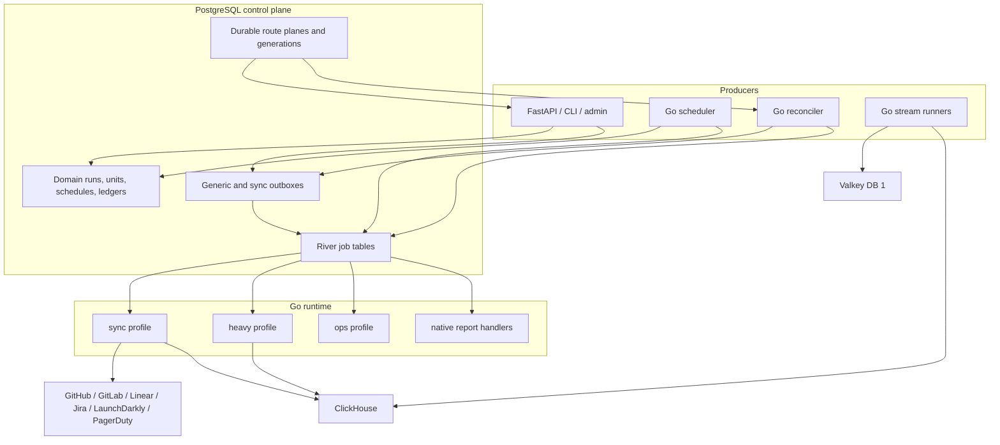

# Technical Requirements and Design: Go Worker Cutover Completion

**Status:** Proposed for implementation  
**Decision owner:** Dev Health Ops architecture  
**Linear:** CHAOS-3033  
**Last updated:** 2026-07-24  
**Foundation design:** [Go Worker Runtime TRD](go-worker-runtime-trd.md)  
**Delivery plan:** Repository-only [Go Worker Cutover Completion Plan](https://github.com/full-chaos/dev-health-ops/blob/main/docs/plans/go-worker-cutover-implementation-plan.md)  
**Original delivery plan:** Repository-only [Go Worker Migration Implementation Plan](https://github.com/full-chaos/dev-health-ops/blob/main/docs/plans/go-worker-migration-implementation-plan.md)

## 1. Purpose

This document defines the remaining technical work required to complete
CHAOS-3033. It exists because the implemented Go/River foundation and parity
harnesses do not yet provide end-to-end ownership of the production worker
surface.

The foundation TRD remains authoritative for River, database roles, job
envelopes, middleware, provider budgets, stream semantics, and the domain-state
model. This document supersedes its assumptions about implementation status,
activation readiness, and cutover completeness.

The target is not a permanent tandem runtime. Celery and Go may run in separate
stacks against the same dataset only for bounded baseline comparison, never as
simultaneous write owners of the same workload. The target is one supported
worker platform:

- River and dedicated Go processes own bounded jobs, scheduling, reconciliation,
  and stream consumption;
- PostgreSQL domain rows remain the product source of truth;
- ClickHouse remains the only analytics and attribution backend;
- Valkey database 1 remains for streams, cache, and distributed provider state;
- Celery, Beat, the result backend, Valkey database 0 worker use, and Python
  worker algorithms are removed after an observed and reversible cutover.

## 2. Decision summary

1. CHAOS-3033 has two explicit milestones:
   - **Celery-off checkpoint:** no Celery worker or Beat process runs; temporary,
     bounded Python algorithm services may still be invoked by Go.
   - **Migration complete:** no Go worker depends on Python worker modules or a
     Python worker algorithm bridge, and no production Celery dependency,
     import, configuration, queue, or operational command remains.
2. The epic may not close at the Celery-off checkpoint. Its definition of done
   is the migration-complete milestone.
3. Every legacy task, periodic entry, webhook consumer, direct API-triggered
   task, fan-out producer, and registered job kind receives exactly one target
   owner in a checked contract.
4. Logical queue/profile coverage is derived from the job registry. Executable
   capability is derived from concrete runtime handler registration, never
   inferred from a registry declaration alone.
5. The Go scheduler replaces all checked-in Beat ownership. Product schedules
   use database-backed occurrence identities; fixed maintenance schedules use
   deterministic River occurrences.
6. Go provider workers must cover GitHub, GitLab, Linear, Jira, LaunchDarkly,
   and PagerDuty at the full configured dataset matrix.
7. Temporary Python compatibility is permitted only as a documented transition
   with an owner, deletion condition, durable idempotency, and an expiry gate.
   It cannot satisfy native-migration acceptance.
8. The canonical local `compose.yml` and every supported production renderer
   become Go-default. Celery is an explicit rollback profile before removal,
   then is deleted after the stability gate.

## 3. Current measured state

The cutover begins from the following checked-in state at merge
`4cc70a390`:

| Surface | Current state |
|---|---|
| Registered bounded-job kinds | 24 |
| Migration routes | 23 `celery`, 1 `river_canary` |
| Durable provider-unit default | Celery unless an operator promotes the canary |
| Complete provider routes | LaunchDarkly feature flags only |
| Deployment contract | hard-coded `coexistence_disabled` |
| Default Go replicas | zero |
| Unconditional Beat entries | 19 |
| Optional Beat entries | 1 scheduled-sync occurrence consumer |
| Root default Go services | none |
| Report kinds | advertised as compiled, not constructed by a production worker |
| Analytics/work-graph compute | Go orchestration calling Python worker algorithms |
| Sync dispatch | non-canary units still published as Celery signatures |
| Scheduler | source-gated off; scheduled-sync planning remains incomplete |
| Reconciler | source-gated to shadow behavior |
| Stream consumers | Go loops exist; external recompute still requires a Beat bridge |

The current fail-closed gates are correct for coexistence. They are not
activation switches. Changing `profiles.json` alone would fail readiness or
startup and must not be treated as a cutover mechanism.

## 4. Scope

### 4.1 In scope

- exhaustive workload ownership;
- missing Go handler construction and runtime registration;
- complete periodic scheduling and scheduled occurrence materialization;
- native provider execution for every supported provider/dataset;
- native sync coordination, finalization, discovery, and team drift;
- native analytics, work-graph, investment, and remaining-metric execution;
- report runtime registration;
- PagerDuty webhook stream processing;
- native external-ingest recompute;
- retention and runtime telemetry replacements;
- both durable route planes and an audited bulk transition;
- canonical local and production deployment activation;
- live cutover, parity, recurrence, rollback, and decommission evidence;
- deletion of Celery and Python worker-only code after the stability gate.

### 4.2 Out of scope

- replacing PostgreSQL domain workflows with a workflow engine;
- changing ClickHouse attribution authority;
- horizontally scaling external ingest before a separate reclaim design;
- removing Valkey database 1;
- introducing Temporal, NATS, or another broker;
- Cloudflare deployment or validation as a cutover gate;
- destructive database or volume recreation.

## 5. Non-negotiable correctness requirements

1. No workload is considered migrated because a type, package, schema, or
   compatibility endpoint exists. A production binary must construct the
   handler and exact startup validation must prove its queue coverage.
2. No zero-work, skipped, disabled, or bridge-only result may satisfy native
   parity acceptance.
3. A provider unit delivered to River must never terminalize as
   `route_disabled` for a scope that producers are allowed to route to River.
4. One logical occurrence has one durable identity across retries, restarts,
   scheduler replicas, and runtime transitions.
5. Queue delivery is guarded at-least-once. Domain ledgers, leases,
   compare-and-set transitions, and deterministic identities prevent duplicate
   product effects.
6. A route transition must serialize with the old producer/consumer, prove
   quiescence, generation-bump the durable route, and be durably audited.
7. Rollback stops new routing before inspecting or changing queued work.
8. Go services use separate least-privilege domain and queue-control roles.
   Long-running services never receive the migration DSN.
9. Secrets and full provider payloads never enter River arguments, logs,
   operator responses, or evidence artifacts.
10. The canonical Compose cutover preserves existing PostgreSQL, ClickHouse,
    and Valkey volumes.

## 6. Complete workload ownership inventory

### 6.1 Beat replacement

The implementation must preserve the checked cadence and missed-run policy of
all 19 unconditional entries. The optional occurrence consumer is folded into
the Go scheduled-sync path and then removed.

| Existing Beat entry | Current cadence | Target owner | Required target behavior |
|---|---:|---|---|
| `dispatch-scheduled-syncs` | 300 seconds | Go scheduler + sync planner | Materialize the complete authoritative occurrence graph and advance the marker transactionally |
| `dispatch-scheduled-metrics` | 300 seconds | Go scheduler | Enqueue due configured metric coordinators with a deterministic occurrence |
| `run-daily-metrics` | 01:00 UTC daily | Go scheduler + heavy worker | Enumerate eligible organizations and enqueue native daily dispatch |
| `run-complexity-daily` | 00:45 UTC daily | Go scheduler + heavy worker | Preserve the daily floor cadence and organization fan-out |
| `run-recommendations` | 02:00 UTC daily | Go scheduler + heavy worker | Preserve finalize gating and daily safety-net behavior |
| `run-release-impact-daily` | 01:30 UTC daily | Go scheduler + heavy worker | Preserve per-organization fan-out |
| `reconcile-sync-dispatch` | 60 seconds | Go reconciler | Own lease repair, wakeup materialization, and River publication |
| `run-capacity-forecast` | Monday 04:00 UTC | Go scheduler + heavy worker | Preserve weekly organization fan-out |
| `process-ingest-streams` | 30-second launcher | `stream-ingest` | Continuous guarded at-least-once consumption |
| `process-product-telemetry-streams` | 30-second launcher | `stream-ingest` | Continuous guarded at-least-once consumption |
| `process-external-ingest-streams` | 30-second launcher | `stream-external` | Singleton continuous guarded at-least-once consumption |
| `dispatch-go-external-ingest-recompute-bridge` | 10 seconds | remove; native external recompute | Consume the durable debounce/batch state without Beat or Celery |
| `external-ingest-stream-health` | 60 seconds | stream runtime telemetry | Emit lag, pending, reclaim, error, and readiness signals |
| `phone-home-heartbeat` | 00:00 UTC daily | Go scheduler + ops worker | Enqueue one deterministic daily heartbeat |
| `dispatch-scheduled-reports` | 300 seconds | Go scheduler + report worker | Materialize due report runs and enqueue native report execution |
| `monitor-queue-depths` | 60 seconds | Go runtime telemetry | Replace legacy queue metrics with River age/depth/saturation and stream lag |
| `run-membership-backfill-daily` | 03:30 UTC daily | Go scheduler + heavy worker | Preserve the daily no-LLM safety-net fan-out |
| `prune-rate-limit-observations` | 05:00 UTC daily | Go scheduler + ops worker | Bounded retention for the rate-limit observation store |
| `prune-external-ingest-batches` | 05:15 UTC daily | Go scheduler + ops worker | Bounded retention for external-ingest status batches |
| optional `consume-pending-scheduled-sync-occurrences` | 300 seconds, default off | fold into Go scheduler/planner | Claim, materialize, retry, and quarantine without a Python Beat handoff |

The cadence contract must be generated from or compared against the existing
schedule definitions so a migration cannot silently change timing.

### 6.2 Non-Beat worker surfaces

The transitional ownership inventory must also include work that is absent from
the 24-kind registry:

| Existing surface | Target |
|---|---|
| `sync_team_drift` and `/teams/trigger-drift-sync` | registered native Go team-drift coordinator |
| `process_pagerduty_webhook_event` | PagerDuty Go stream handler with retry/dead-letter parity |
| sync fan-out tasks | native Go coordinators using domain ledgers and River |
| Celery health task/inspect commands | Go health/readiness/metrics and operator APIs |
| report task construction | native `internal/jobs/report` runtime registered in the heavy or latency profile |
| rate-limit and external-ingest pruning | distinct bounded retention operations |

No production Celery task may remain outside the inventory. CI fails when a new
task decorator, Beat entry, `apply_async`, `send_task`, or `.delay` call appears
without an explicit transitional owner.

## 7. Target architecture



The Python API remains a producer and product API. At migration completion it
does not execute worker algorithms on behalf of Go and does not import
production Celery task modules.

## 8. Contract and runtime-registration design

### 8.1 Canonical contract roles

- `registry.json` defines the stable kind, profile, queue, argument schema,
  timeout, retry, delivery, idempotency, and concurrency policy.
- `migration-state.json` defines release state, active route, rollback route,
  and required evidence.
- durable database route rows define the currently operated generation and
  pause state.
- the deployment manifest defines process identity, replicas, resources,
  secrets, and connection budgets.
- concrete builder registrations define executable binary capability.

Queue and kind lists in deployment renderers are projections of the registry.
They must not become independent declarations.

### 8.2 Exact startup validation

`Registry.ValidateStartup` becomes a production readiness dependency. For each
enabled profile it proves:

- every executable registry kind has exactly one constructed handler;
- every constructed handler matches the registry descriptor;
- every required queue has a configured consumer;
- no queue or handler is extra;
- available queued contract versions are supported;
- connection and worker budgets match the deployment manifest.

The empty `latency` profile is removed unless real latency kinds are assigned
and registered. It may not remain as a permanently unready placeholder.

### 8.3 Transitional ownership inventory

A checked transitional inventory maps every legacy surface to:

- target kind or process;
- current implementation state;
- target owner;
- compatibility dependency, if any;
- deletion evidence;
- acceptance test identifier.

This inventory is removed with the final Celery cleanup after CI proves no
legacy surface remains.

## 9. Scheduling and reconciliation

### 9.1 Product schedules

Database-backed schedules use the existing lock order and one transaction:

1. claim a bounded due window with `FOR UPDATE SKIP LOCKED`;
2. validate organization, entitlement, and schedule policy;
3. derive the versioned deterministic occurrence;
4. create or reuse the authoritative run, units, and outbox rows;
5. advance the marker only after durable handoff;
6. commit and emit bounded telemetry.

Scheduled sync must not stop at inserting a pending occurrence. Go owns
materialization, retry backoff, malformed-row quarantine, and marker
advancement.

### 9.2 Fixed periodic schedules

Fixed maintenance schedules use deterministic occurrence keys containing the
schedule identity and canonical due time. Duplicate scheduler replicas may
attempt insertion, but only one River occurrence becomes available.

Each schedule declares:

- cadence and time zone;
- catch-up or skip policy;
- uniqueness window;
- target kind and argument constructor;
- maximum attempts and terminal behavior;
- alerting threshold for a missing occurrence.

### 9.3 Reconciler

The reconciler changes from checked-in shadow composition to mutation
ownership only after every sync wakeup has a concrete River consumer. It owns:

- expired claim and lease repair;
- dispatch/finalize/reference/post-sync wakeup materialization;
- generic outbox relay repair;
- generation-aware publication;
- stranded-run detection.

Mutation activation is a reviewed source change, not an environment toggle.

## 10. Provider and sync execution

### 10.1 Provider matrix

The provider contract covers the full configured dataset matrix for:

- GitHub;
- GitLab;
- Linear;
- Jira;
- LaunchDarkly;
- PagerDuty.

Capability metadata is not execution evidence. A route becomes ready only when
the native handler, credential resolver, pagination/window behavior,
normalization, sink effects, watermark, retry classification, rate budget, and
lease recovery all pass the provider matrix.

PagerDuty coverage includes `services`, `business-services`,
`escalation-policies`, `schedules`, `on-calls`, `users`, `teams`, `incidents`,
`incident-alerts`, `incident-log-entries`, and `incident-notes`. The contract
also preserves token, OAuth bearer, client-credentials, region, enrichment,
incremental cursor, service-repository mapping, and canonical-incident feature
behavior.

### 10.2 Lease and effect ownership

Go claims the authoritative `SyncRunUnit` lease before provider execution.
Only Go may:

- renew the lease;
- transition unit status;
- commit the completion watermark;
- record terminal or retryable failure;
- create downstream completion/finalization wakeups.

A transitional provider compatibility service, if used, receives only bounded
identifiers and Go's claim context. It executes the provider algorithm and
returns result/watermark evidence. It must not acquire its own unit lease,
complete the unit, or enqueue Celery/River work. The existing
`run_sync_unit.run()` wrapper is therefore not a valid bridge.

The compatibility request cannot contain credentials, provider configuration,
raw provider payloads, SQL, module names, callable names, or arbitrary URLs.
Python reloads the authoritative tenant-scoped unit and credential graph,
verifies the live Go lease and fixed provider/dataset adapter, and releases
database read transactions before long provider work. Go owns cancellation and
must revalidate the lease before every terminal mutation. Non-cooperative
Python algorithms run in a killable child process; canceling only a thread or
future does not satisfy the contract.

An ambiguous disconnect after a possible sink effect is never converted into
success. The effect must be fenced by a deterministic durable identity and
read back, or the unit enters an explicit reconciliation-required state.

### 10.3 Native completion requirement

The transitional service must be deleted before migration completion. Native Go
fixture and live parity are required for every configured provider/dataset,
including PagerDuty.

### 10.4 Sync coordinators

Dispatch, finalization, reference discovery, post-sync, team autoimport, and
team drift become native Go coordinators. They preserve:

- authoritative domain counts rather than Celery chords;
- generation-aware idempotency;
- capped-unit redispatch;
- cancellation and partial-failure propagation;
- fail-closed organization/provider credential handling;
- ClickHouse team projection authority.

No canonical sync path may call `.apply_async`, `.delay`, `send_task`, or a
Celery signature.

### 10.5 PagerDuty webhook processing

PagerDuty webhook delivery is independently routable from dataset sync. The Go
job reloads the exact source stream entry plus the active same-organization
binding and credential graph. Event identity and raw-body digest provide the
receipt identity.

The source entry remains durable across retryable failures. It may be deleted
only after either the canonical reconciliation effect commits or a terminal
dead-letter record commits. Feature-disabled, malformed, revoked-binding,
retryable, and retry-exhausted outcomes remain distinguishable, and replay of a
successfully persisted event is a bounded no-op.

## 11. Analytics, graph, investment, and reports

### 11.1 Native compute boundary

The current HTTP/child-process compatibility path is transitional. The final
runtime ports worker-owned algorithms into Go while preserving:

- exact query scopes and windows;
- numerical tolerances and deterministic seeds;
- ClickHouse and PostgreSQL write ownership;
- generation/replay semantics;
- resource budgets;
- output/artifact parity.

Python request-serving code may remain in the API, but Go workers may not import
or invoke `dev_health_ops.workers` algorithms at migration completion.

### 11.2 Reports

`internal/jobs/report` is registered by a production worker through an explicit
builder. Both report kinds must be constructed, added to the River worker set,
included in exact startup validation, and tested against artifact goldens.
Advertising them in a compiled-kind list is not sufficient.

### 11.3 Work graph and investment

Registry ownership metadata must match the actual package. Investment kinds may
not claim a nonexistent `internal/jobs/investment` owner while being executed
through the work-graph compatibility bridge.

## 12. Streams and external recompute

Stream delivery is guarded at-least-once:

1. claim a new or pending entry;
2. validate bounds and tenant identity;
3. persist idempotently through canonical sinks;
4. record durable completion;
5. acknowledge the stream entry.

Crash-after-write/before-ack may redeliver and must be harmless.

The external runner remains a singleton. Its recompute controller directly
consumes the durable debounce/batch state and invokes the native planner. It
must not write `bridge_pending` work that only Beat can drain.

Native metrics cover lag, pending entries, reclaim attempts, poison/quarantine,
processing latency, and downstream recompute delay.

## 13. Durable route ownership

Two independent route planes must transition coherently:

| Plane | Durable table | Active values | Scope |
|---|---|---|---|
| Bounded job execution | `worker_job_routes` | `celery`, `shadow`, `river_canary`, `river` | Versioned kinds such as `sync.provider_unit` and `sync.team_autoimport` |
| Sync wakeup transport | `sync_dispatch_transport_routes` | `celery`, `river` | `dispatch_sync_run`, `finalize_sync_run`, `reference_discovery`, and `post_sync` |

They cannot be collapsed into one flag or one implicit registry decision.
Provider/dataset canaries are subscopes within `sync.provider_unit`; promoting
the kind does not prove that every provider executor exists.

The operator provides an authenticated, audited bulk plan:

1. inspect and validate the checked contract;
2. pause affected producers;
3. stop or drain the old consumers;
4. prove no active/queued Celery work remains for the selected surfaces;
5. wait out old route-row/outbox transactions;
6. generation-bump routes to River;
7. start and prove exact Go consumers;
8. resume producers;
9. record the transition and evidence.

Partial route-plane transitions fail closed. Raw production SQL and
unconditional Alembic route flips are prohibited.

Rollback performs the same sequence in reverse while the fallback release
exists. It never purges queues or downgrades additive schema.

## 14. Deployment design

### 14.1 Canonical local topology

The root `compose.yml` is the canonical local and current production-like
environment. Its default dependency chain becomes:

```text
migrate
  -> River role provisioning
  -> River schema migration/check
  -> worker contractcheck
  -> API and Go worker/controller/stream services
```

Default services include:

- heavy worker;
- ops worker;
- sync/provider worker;
- scheduler;
- reconciler;
- ingest stream runner;
- external stream runner singleton.

The existing `worker`, `worker-heavy`, `worker-ingest`, `worker-wi`, and `beat`
services move to an explicit `celery-fallback` profile during the reversible
checkpoint. The final cleanup deletes them.

`compose.go.yml` becomes a temporary compatibility wrapper or is retired once
the canonical file provides the complete topology. Existing volumes are
preserved.

### 14.2 Production renderers

Docker Compose, Kubernetes, Helm, and Swarm are generated or validated against
the same deployment contract. The contract supports a reviewed `go_default`
state and enforces:

- required processes are enabled with nonzero minimum replicas;
- scheduler and external stream singleton rules;
- PostgreSQL and PgBouncer budgets;
- queue/profile coverage;
- least-privilege secret wiring;
- non-root, read-only containers;
- no migration DSN in long-running workloads.

### 14.3 Images

CI publishes and smoke-tests every production binary:

- worker;
- scheduler;
- reconciler;
- stream runner;
- operator;
- contract checker;
- River migrator where separately packaged.

## 15. Observability and operator requirements

Before activation, the platform exposes:

- River jobs available, scheduled, running, retryable, discarded, and oldest
  age by bounded profile/queue/kind labels;
- execution duration, attempts, cancellation, and saturation;
- domain/River state mismatch;
- scheduled occurrence due, inserted, completed, missed, retried, quarantined;
- sync lease age, expired repair, generation drift, and finalization backlog;
- provider calls, retries, rate-limit delay, budget saturation, and watermark;
- stream lag, pending, reclaim, poison, and recompute delay;
- database pool saturation against manifest budgets;
- compatibility calls remaining, by fixed operation, during transition.

Readiness stays closed for missing handlers, unsupported queued versions,
route-generation drift, scheduler ownership ambiguity, unready provider scope,
or missing dependencies.

Operator APIs remain authenticated, authorized, audited, bounded, and
payload-redacted.

## 16. Security requirements

- River arguments contain references, not provider credentials or raw payloads.
- Credentials resolve after a valid tenant-scoped lease.
- Compatibility endpoints use a fixed allowlist, strict schemas, bounded
  responses, and a dedicated bearer secret.
- Compatibility endpoints cannot select an arbitrary command, module, URL, or
  operation.
- Provider redirects, pagination URLs, and base URLs retain current SSRF
  protections.
- Queue-control credentials cannot mutate arbitrary domain tables.
- Operator and migration credentials are not mounted into normal workers.
- Evidence and logs are scanned for secrets and personal data.

## 17. Failure-mode requirements

| Failure | Required outcome |
|---|---|
| scheduler replicas race | one durable occurrence; no duplicate effect |
| scheduler crashes before commit | no marker advancement or partial graph |
| scheduler crashes after commit | occurrence is discoverable and retryable |
| Go provider dies during execution | lease expires and recovers within bounded policy |
| compatibility service dies | Go retains lease authority and retries/fails by contract |
| stream crashes after write before ACK | redelivery is idempotent |
| route transition races a producer | lock/generation fence prevents old-owner publication |
| report handler missing | startup readiness remains closed |
| unsupported provider scope reaches River | readiness/capability test blocks deployment; unit is not silently lost |
| one profile is unavailable | unrelated profiles continue; affected backlog alerts |
| PostgreSQL or ClickHouse is unavailable | bounded retries; no false success |
| rollback starts with queued River work | routes pause; work is inspected/reconciled before owner reversal |

## 18. Cutover and rollback

### 18.1 Celery-off checkpoint

1. take fresh PostgreSQL/ClickHouse/Valkey evidence and a recoverable backup;
2. render and start the Go topology without transferring ownership;
3. prove exact handler/readiness and provider capability coverage;
4. stop Beat and all Celery consumers in one maintenance window;
5. prove legacy queues and active work are empty;
6. apply the audited two-plane River transition;
7. start or unpause Go ownership;
8. run representative sync, metric, report, webhook, retention, and backfill
   jobs;
9. observe at least two executions of short recurrence schedules;
10. compare canonical datasets against the baseline;
11. rehearse rollback while the fallback profile remains available.

### 18.2 Migration-complete gate

After the stability window:

- delete Python algorithm bridges and compatibility ledgers that have no
  ongoing product purpose;
- remove Celery task decorators, app/config, Beat schedule, signal hooks,
  inspect/runner commands, and result-backend code;
- remove Celery dependencies and Valkey database 0 worker configuration;
- delete fallback services and obsolete route flags;
- rerun disaster recovery from backup;
- update all architecture, deployment, operations, security, and contributor
  documentation.

## 19. Acceptance criteria

CHAOS-3033 is complete only when:

- every legacy workload surface has exactly one Go owner or an explicit removal
  decision;
- all 19 unconditional schedules and the optional occurrence path have a tested
  target owner;
- every executable registry kind has one concrete constructed handler;
- report handlers are production-registered;
- all configured provider/dataset pairs are native Go and route-ready;
- PagerDuty sync and webhook processing are covered;
- scheduled sync owns the full occurrence lifecycle;
- external recompute no longer depends on Beat or Python worker code;
- analytics, work-graph, and investment jobs no longer execute Python worker
  algorithms;
- both durable route planes are River-owned at current generations;
- the canonical local and all production stacks are Go-default;
- representative backfills match the baseline dataset;
- recurring schedules run repeatedly without missing or duplicate effects;
- rollback has been rehearsed against the same dataset;
- `bash ci/local_validate.sh` and the Go-only integration/DR gates pass;
- no production Celery import, dependency, process, queue, result backend, or
  operational command remains;
- Valkey database 0 is absent from the worker platform contract;
- all documentation describes one target worker runtime.

## 20. References

- [Go Worker Runtime TRD](go-worker-runtime-trd.md)
- Repository-only [Go Worker Migration Implementation Plan](https://github.com/full-chaos/dev-health-ops/blob/main/docs/plans/go-worker-migration-implementation-plan.md)
- Repository-only [Go Worker Cutover Completion Plan](https://github.com/full-chaos/dev-health-ops/blob/main/docs/plans/go-worker-cutover-implementation-plan.md)
- [Worker operations](../ops/workers.md)
- [Database connection pooling](../ops/database-connection-pooling.md)
- [Dispatch outbox architecture](dispatch-outbox.md)
- [Team attribution architecture](team-attribution.md)
