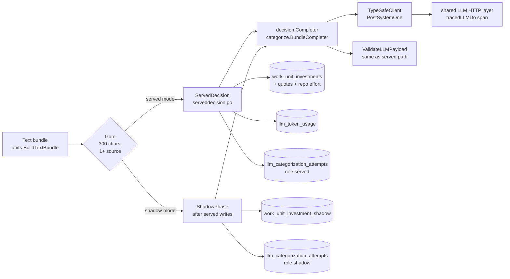

# Investment Decision Adapter: Shadow Mode and Served Mode

Engineering architecture of the decision backend (TypeSafe Jev) for investment
categorization. Records decisions made in CHAOS-8712 and CHAOS-8865. Linear is the
authority for decisions; this page records them after the fact and describes the code
on `main`. Where code and a design document differ, the code is described and the
difference is named.

Related: [Investment Categorization Pipeline](investment-categorization-pipeline.md) ·
[Investment Data Model](investment-data-model.md) ·
[LLM Categorization Contract](../llm/categorization-contract.md) ·
[Investment Taxonomy](../product/investment-taxonomy.md).

Code:

| Part | Path (under `internal/jobs/investment/`) |
| --- | --- |
| Seam `BundleCompleter`, `CategorizeBundleOnce` | `categorize/categorize.go` |
| Decision adapter, rubric, stamp | `categorize/decision/` |
| TypeSafe client | `categorize/typesafeclient.go` |
| Request span | `categorize/llmspan.go` |
| Shadow phase | `shadowphase.go`, `shadowsettings.go`, `shadowsanitize.go`, `shadowobserver.go` |
| Served mode | `serveddecision.go`, `nativeexecutor.go` |
| Table writers | `chwrite/shadow.go` |
| Tables | `internal/chmigrate/sql/109_work_unit_investment_shadow.sql`, `110_llm_categorization_attempts.sql` |

---

## 1. Purpose and decision record

The served categorizer is a generative model (`gpt-5-nano`). It writes a JSON mix over
the 15 canonical subcategories. CHAOS-8712 tested a decision backend: one typed
question per subcategory, one evidence question, one request. The model answers with
levels and picks an evidence span. Code builds the mix.

Result of CHAOS-8712 round 2 (Jev, rubric `decision-support-v1d`, level rule
`presence-floor:0.4`; the rubric in code is the later `v1f`, section 3.2):

| Item | Incumbent | Jev | Source |
| --- | --- | --- | --- |
| Support-set F1 on held-out real bundles (80) | 0.35 | 0.72 | results doc R2.3 |
| False-positive categories per bundle | 0.85 | 0.54 | results doc R2.3 |
| Cost ratio to incumbent (G4) | 1.00 | 0.299 | results doc R2.2 |
| Latency p50 / p95 | 6,468 / 9,462 ms | 116 / 169 ms | results doc R2.5 |
| `complete_strict` (full run, 1,253) | 0.989 | 0.978 | results doc R2.2 |

Jev repeats its support set more often than the incumbent (88% of held-out bundles
between two runs; the incumbent is lower, CHAOS-8856), but it is not bit-stable
(results doc R2.7 item 7).

The outcome ADOPT means the candidate passed a frozen gate. It did not authorize a
switch. The switch is a separate ruling (section 7).

The contract the adapter must keep (from the
[categorization contract](../llm/categorization-contract.md)):

- The 15 subcategory keys are fixed. The adapter cannot add, rename or drop one.
- Categorization never returns "unknown".
- The theme roll-up is deterministic (`units.RollupSubcategoriesToThemes`). The
  backend never picks a theme.
- Jev picks the support levels and one evidence span by id. Code resolves the span
  to the verbatim source text. Jev does not write the explanation. The explanation
  paths keep a text provider (section 5.4).

Not in scope here: customer documentation (`ops/docs/`), plans and trackers (Linear).

---

## 2. Components and data flow



### 2.1 The seam

`categorize.BundleCompleter` has one method. `CategorizeBundleOnce` calls it one time,
runs the shared `validateCompletionText`, and returns a `CategorizationOutcome` with
status `ok` or the `invalid_llm_output` shape. There is no repair call. A completer
error is returned unchanged. A typed-nil completer returns `ErrNoBundleCompleter`
and does not panic.

The generative call `CategorizeTextBundle` is not changed by this work.

### 2.2 The decision adapter (`categorize/decision`)

`Completer` implements `BundleCompleter`. `Classify` returns a `Classification`:

- state (nine states, section 4), status, `complete_strict`
- levels and renormalised level probabilities for each support key
- sufficiency level (-1 when not answered)
- the mix (only for state `ok`), evidence quotes, span id, handle
- warnings, error codes, tokens, returned model, `TopRawKey`

`Classify` returns an error only for a cancelled context. It holds no per-bundle state
and is safe to call from many goroutines. It has no `recover` and no pre-call gate;
both belong to the caller (served mode and shadow phase each have their own).

What is fixed in code, with no environment override: the rubric, the level rule
`presence-floor:0.4` (a key is supported only when P(level 0) < 0.4), the weight map
`support-map-v1` (levels 0 / 1 / 2 / 4) and the span rule `span-candidates-v1`. An
operator cannot change them, because a configurable category system is a banned
design (AGENTS.md "Hard Bans").

`TopRawKey` is the key with the highest `1 - P(level 0)` from the raw (not
renormalised) answers; a tie takes the first key in alphabetical order. It is used
only by served mode for state `zero_support`.

### 2.3 Rubric and identity stamp

The rubric is `decision-support-v1f.json`, embedded with `//go:embed`. Its sha256
(`eac20c67...`) is a constant. `LoadRubric` fails at construction when the digest or
a named version differs. The v1d file is test data only.

`Identity.Stamp()` is the string that identifies a classification configuration:

```
provider=typesafe;api=systemone;model=<requested model>;taxonomy=<taxonomy version>;
prompt=decision-support-v1f@<first 12 of rubric sha256>;adapter=decision-adapter-v3;
map=support-map-v1;level=presence-floor:0.4
```

(One line in code.) The stamp is the `categorization_model_version` of every served
decision row and the `shadow_config` of every shadow row. A decision row therefore
never matches a generative skip-existing key. A change of rubric, adapter, map or
level rule makes a new stamp, so the unit is asked again.

Difference from the design: the embedded rubric file still names `adapter_version:
decision-adapter-v2` (its bytes are the evaluated bytes). The loader does not compare
that field. The code constant `AdapterVersion` (`decision-adapter-v3`) is the one in
the stamp.

Rubric governance: the rubric is a second statement of the taxonomy next to
[`investment-taxonomy.md`](../product/investment-taxonomy.md). A taxonomy change
needs a rubric change, a new digest and a new stamp. Review conventions C3
(telemetry) and C9 (ports to Go) are still open in CHAOS-8712; the rubric does not
encode them.

Replay oracle: `decision/replay_oracle_test.go` replays recorded responses through
the production adapter and compares every field of `Classification` with the outputs of
the evaluated experiment code. A change that moves one stored outcome needs a new
`AdapterVersion`. The committed set has 37 cases; a larger real set runs only when
`DECISION_REPLAY_ORACLE_DIR` is set (data stays outside the repo).

### 2.4 The TypeSafe client

`categorize.TypeSafeClient` posts to `https://api.typesafe.ai` (`/v1/systemone`). It
satisfies `decision.Transport` (`PostSystemOne`) and is built on the shared LLM HTTP
layer: hardened client (no redirect, no proxy, 60 s), bounded body read (4 MiB), the
shared retry predicates. One retry (two attempts) for 429, 5xx, timeout and transport
error; no retry for 400/401/402/403/422. The client keeps the key out of logs and
errors (registered redaction; a key under 12 bytes is refused at construction;
`TYPESAFE_BASE_URL` other than the one host is refused).

Closed error classes of `SystemOneError`: `auth`, `rate_limit`, `server`,
`invalid_request`, `timeout`, `transport`, `unexpected_status`, `response_too_large`,
`decode`, `canceled`, `build_request`, `body_read`, `refused` and `model_not_found`
(404). 401, 402, 403 and an unknown model are deterministic failures (they stop a
run). `typesafe` is intentionally not in
`goImplementedProviderKinds`: it is a decision kind (`IsDecisionProviderKind`), not a
generative `Provider`.

---

## 3. Shadow phase

Purpose: measure the decision backend on real work units without changing any served
row.

- Runs inside `investment.materialize`, after every served write, in
  `Materializer.runShadow`. It returns nothing; it cannot change a served row, the run
  `Stats` or the job result.
- Default OFF. It runs only when `INVESTMENT_SHADOW_PROVIDER=typesafe`, the org is in
  `INVESTMENT_SHADOW_ORG_IDS` (`*` = all; empty = off, fails closed) and
  `TYPESAFE_API_KEY` is usable. A setting that cannot be used gives phase OFF and one
  WARN. It never fails the run.
- It does not run when the served provider is the decision kind (section 5).
- Gate: the served gate (`TextCharCount >= 300` and at least one text source), then a
  stable sample (FNV-1a 64 of org + unit, mod 100, against
  `INVESTMENT_SHADOW_SAMPLE_PERCENT`).
- Budget: `INVESTMENT_SHADOW_MAX_SECONDS` (default 60, clamp 120), spend cap
  `INVESTMENT_SHADOW_MAX_USD_PER_RUN` (default 0.50, clamp 100), concurrency
  `INVESTMENT_SHADOW_CONCURRENCY` (default 4, clamp 32). Each shadow write has its own
  15 s bound. Worst added job time is the budget plus 30 s.
- Skip-existing: a unit with a shadow row for the same input hash and `shadow_config`
  in a terminal state (`ok`, `zero_support`) is not asked again
  (`chquery.FetchExistingShadowKeys`).
- Failure isolation: each classification has its own `recover` (a panic ends as
  `adapter_defect`); a rejected key or unknown model stops the phase
  (`stop_reason=deterministic_failure`); a missing table stops it (`table_missing`).
  Stop reasons: `done`, `budget`, `cap`, `deterministic_failure`, `cancelled`,
  `table_missing`, `store_error`, `panic`. A unit cut by the budget, a cancel, the cap
  or a stop has no shadow row; a later run asks it.
- Shadow spend is not written to `llm_token_usage` (the org spend reader would show a
  cost the org did not pay). It is the sum of the attempt rows with `role = 'shadow'`.
- No circuit breaker: during a provider outage every run pays the whole budget.

### 3.1 Table `work_unit_investment_shadow`

Engine `ReplacingMergeTree(computed_at)`, `ORDER BY (org_id, work_unit_id,
categorization_input_hash, shadow_config)`, TTL 90 days.

| Column | Meaning |
| --- | --- |
| `state`, `categorization_status`, `complete_strict` | Decision state and mapped status |
| `subcategory_distribution_json`, `theme_distribution_json` | `Map(String, Float64)`, not JSON text. Only for state `ok`; empty for every other state. The theme map is the deterministic roll-up |
| `levels`, `level_probabilities`, `sufficiency_level` | Levels per key; probabilities renormalised for each key; -1 = not answered |
| `evidence_span_id`, `evidence_handle`, `evidence_source_type`, `evidence_source_id` | Reference to the cited span. No quote text is stored |
| `warnings`, `error_codes` | Bounded codes (`shadowsanitize.go`) |
| `shadow_config`, `rubric_sha256`, `model_returned` | Stamp and returned model |
| `served_run_id` | `categorization_run_id` of the hosting served run |

Rules for readers:

- No product reader reads this table. A guard test
  (`chwrite/shadow_reader_ban_test.go`) fails when a serving file names it. This holds
  by table, not by a filter.
- The key has no run id, so a repeat replaces the older row at merge time. Run-to-run
  stability cannot be measured from this table. Read the latest row with
  `argMax(..., computed_at)` grouped by the key.
- Org deletion purges both tables (`orgdeletion` discovery covers them).

---

## 4. States and what is served

The adapter has nine states. Served mode maps them as follows
(`serveddecision.go` `outcomeFor`, rulings of chris, 2026-10-07):

| State | Meaning | Served row |
| --- | --- | --- |
| `ok` | At least one key supported, one valid quote | Validated mix, one quote, status `ok` |
| `zero_support` | Every key at level 0 | Top raw key at 1.0, no quote, status `invalid_llm_output`, `evidence_quality` capped at 0.3. Audit codes `decision_zero_support`, `served_top_raw_key`. No generative fallback |
| `evidence_none` | Evidence answer is "none" | Mix of the support levels, no quote, status `invalid_llm_output`, cap 0.3. Audit codes `decision_evidence_none`, `served_level_mix` |
| `question_refused`, `answer_missing`, `answer_invalid`, `evidence_unanswered`, `adapter_defect` | Unusable answer | The `invalid_llm_output` row of the generative path (fallback prior, cap 0.3), code `decision_<state>` |
| `request_failed`, can pass later (timeout, rate limit, server error) | Transport failure | No row. The last row of the unit stays its latest row; the next run asks again |
| `request_failed`, deterministic (401/402/403, unknown model) | Rejected | The run ends, as in the generative path |

Notes:

- `zero_support` and `evidence_none` rows have status `invalid_llm_output`, so
  skip-existing does not reuse them. Such a unit is asked again in every run. This
  costs one request per unit per run (about USD 0.0001) and is a known limit.
- A unit cancelled by the run context has no row from this run.
- Every unit asked of the served backend is in exactly one outcome count of the metric
  (section 6), on every exit of the run.

---

## 5. Served mode

### 5.1 Switch

Served mode has no setting of its own (chris, 2026-10-07: no new setting). The
provider selection of the run decides: `LLM_PROVIDER=typesafe` selects the decision
kind, and `investment.materialize` classifies with `decision.Completer.Classify` in
place of `CategorizeTextBundle`. Rollback is the recorded old `LLM_PROVIDER` value.

- The key is `TYPESAFE_API_KEY` (and optional `TYPESAFE_MODEL`, default `jev-1.13.0`;
  `TYPESAFE_BASE_URL`). `TYPESAFE_API_KEY` alone selects nothing.
- The switch is process-wide: it applies to every org the worker materializes, BYO
  orgs included (the worker never reads org LLM settings).
- Only the worker group that runs `investment.materialize` (chart group `heavy`)
  categorizes. Other groups see the variable and ignore it.
- A served run cannot build its backend (no key, bad URL): deterministic
  `llm_provider_invalid`; the run fails. There is no silent fallback.
- With served mode on, the shadow phase is off.

Everything before the call (gates, skip-existing read) and after it (theme roll-up,
the three writes) is the one served path.

### 5.2 Latest row and skip-existing (CHAOS-8873)

`work_unit_investments` has one row for each `(org_id, work_unit_id)` (key without
model version). `FetchExistingInvestmentKeys` (`chquery/entities.go`) takes
`argMax(..., computed_at)` for each unit first, and then tests on that latest row:
status in (`ok`, `repaired`), `categorization_model_version` equals the current
version (the stamp, for a decision run), and the input hash is in the wanted set.
No filter runs before the `argMax`.

Effect: a switch to the decision kind asks each unit once (new stamp). A rollback to
the old provider asks each unit once again, because the latest row carries the decision
stamp. Before CHAOS-8873 the filter ran before the `argMax`, and a rollback kept the
decision row as the served row. CHAOS-8908 refines the tie-break of this reader; see
that ticket for the current rule.

### 5.3 Spend and attempts

- One `llm_token_usage` row for each run. Provider `typesafe`, model from the served
  identity (`usageIdentity`). The org spend reader groups by provider and model with no
  source filter, so served Jev spend is counted.
- One `llm_categorization_attempts` row for each HTTP attempt, `role = 'served'`.
  `finishServed` writes them, and the run line `investment served decision complete`,
  after the categorization on every exit (success, deterministic stop, cancel).
- Billed cost: input tokens x 42 nano-USD (`rates_version`
  `typesafe-systemone-2026-10-06`); output is free. The cost is on the last attempt
  row of a classification.

### 5.4 Explanation path

`investmentexplain` and the other text paths use `ResolveTextProviderKind`. For
`LLM_PROVIDER=typesafe` with the auto setting they ignore the decision kind and detect
a text provider by key (for the OpenAI key, with `LLM_MODEL`). A BYO org provider is
kept. The explanation path never calls the decision backend and never recomputes the
mix (AGENTS.md "UX-time LLM is explanation only").

### 5.5 Table `llm_categorization_attempts`

Engine `ReplacingMergeTree(computed_at)`, `ORDER BY (org_id, run_id, work_unit_id,
role, config, kind, attempt)`, TTL 400 days. Scalars only; no prompt, response or
source text.

| Column | Meaning |
| --- | --- |
| `role` | `served`, `shadow` or `fallback` |
| `config` | Stamp of the candidate (shadow and served decision rows) |
| `kind` | `first`, `retry`, `repair`, `fallback` |
| `attempt`, `http_status`, `error_class`, `request_id` | One HTTP attempt |
| `state` | Final decision state, on the last attempt of a classification only; empty on others |
| `input_tokens`, `output_tokens`, `cached_input_tokens`, `billed_cost_usd`, `rates_version` | Usage and rated cost; tokens and cost on the last attempt row only |
| `latency_ms`, `retry_wait_ms` | Timing |

Reader rule: the key holds the run id, so rows of different runs never replace each
other, and `ReplacingMergeTree` removes only a repeat of one batch, at merge time.
**Dedup by the 7-column key (`argMax` on `computed_at`) before any sum.** A sum of
raw rows counts an unmerged duplicate twice.

The header comment of migration 110 still says "only role = 'shadow' rows are
written". The code now also writes `role = 'served'`. The comment is not changed
here, because a changed migration file must stay byte-identical in the Python chain.

---

## 6. Operations

### 6.1 Settings

| Name | Where read | Default | Notes |
| --- | --- | --- | --- |
| `LLM_PROVIDER` | Served mode switch | prior value | `typesafe` = served decision mode. Process-wide |
| `TYPESAFE_API_KEY` | Client | none | Secret. 12 bytes or more. Heavy group only (`dev-health-ops-typesafe`, `secretKeyRef`) |
| `TYPESAFE_MODEL` | Client | `jev-1.13.0` | Versioned id; an alias is refused |
| `TYPESAFE_BASE_URL` | Client | `https://api.typesafe.ai` | Any other value is refused |
| `INVESTMENT_SHADOW_PROVIDER` | Shadow | empty = off | `typesafe` |
| `INVESTMENT_SHADOW_ORG_IDS` | Shadow | empty = off | List or `*` |
| `INVESTMENT_SHADOW_SAMPLE_PERCENT` | Shadow | 100 | 0..100 |
| `INVESTMENT_SHADOW_CONCURRENCY` | Shadow | 4 | clamp 32 |
| `INVESTMENT_SHADOW_MAX_SECONDS` | Shadow | 60 | clamp 120 |
| `INVESTMENT_SHADOW_MAX_USD_PER_RUN` | Shadow | 0.50 | clamp 100 |

All are read once for each `Execute` through `secrets.GetenvNamed`.

### 6.2 Switch on and roll back

Prerequisites: ClickHouse migrations 109 and 110 applied; the worker image holds the
served mode; `TYPESAFE_API_KEY` reaches the heavy group only.

- On: set `LLM_PROVIDER=typesafe` for the heavy group (a Secret change needs a
  rollout restart: the chart has no checksum for external Secrets). Write the old
  value to a private file first.
- Roll back: restore the old value the same way and restart. The next materialize
  asks each unit once with the old provider (section 5.2).
- Setting `LLM_PROVIDER` in the shared Secret `dev-health-ops` reaches all worker
  groups and the query-api, and `scripts/load-secrets.sh` re-applies it from the host
  `.env`. Check the roll packet of the release for the exact placement.

### 6.3 Telemetry

| Signal | Name | Labels |
| --- | --- | --- |
| Metric | `dev_health_investment_served_outcomes_total` | `model`, `outcome` (closed set of 12: `ok`, `zero_support`, `evidence_none`, `invalid_answer`, `adapter_defect`, `timeout`, `refused`, `server_error`, `rate_limited`, `rejected`, `transport_other`, `cancelled`) |
| Metrics (shadow) | `dev_health_investment_shadow_attempts_total`, `..._attempt_latency_seconds`, `..._phase_stops_total`, `..._phase_cancelled_runs_total`, `..._panics_recovered_total`, `..._attempt_write_errors_total`, `..._attempt_rows_dropped_total` | closed sets in `jobruntime/telemetry.go` |
| Span | `dev_health.llm.request` | One span for each HTTP attempt of every LLM provider (shared `tracedLLMDo`). Attributes: `llm.provider`, `llm.model`, `llm.role` (`served` / `shadow`, when set), `llm.attempt`, `http.response.status_code`, `error.class` |
| Log | `investment served decision complete`, `investment shadow phase complete` | scalar fields only |

`error.class` values: `timeout`, `refused`, `server`, `rate_limit`, `auth`,
`model_not_found`, `invalid_request`, `invalid_answer`, `canceled`, `other`. A span has
no URL, key, prompt, response text or peer string. Metrics reach SigNoz by OTLP push
from every worker binary (`otlpmetrics`), not by a scrape.

### 6.4 PASS / FAIL readback (chris, 2026-10-08)

For the first served runs on prod after the switch. Read from
`dev_health_investment_served_outcomes_total` and the request spans in SigNoz, with the
ClickHouse readback of the roll packet as a cross-check.

| Result | Condition |
| --- | --- |
| PASS | At least 97% of served outcomes are `ok`, `zero_support` or `evidence_none`; transport failures at or below 1%; the materialize job ends in success |
| HOLD | Transport failures above 1% and below 5%: look, no automatic rollback |
| FAIL (roll back) | Any auth or unknown-model failure; transport failures at 5% or more; or the job fails |

The review about 48 hours later is CHAOS-8922.

---

## 7. Known limits and open items

- Evidence base: one organization, English text, agent-labeled gold (results doc R2.7).
  `enablement` recall fell in round 2 (1 of 4 held-out gold positives).
- Jev is not bit-stable on repeat. A unit asked again can change its mix.
- `zero_support` and `evidence_none` units are asked again every run (section 4).
- Shadow phase runs inside the job and has no circuit breaker.
- Served mode is process-wide, not per org. A per-org LLM setting is the later home.
- A near tie between keys (about 1%) can change order between the stored
  renormalised level probabilities and the raw values; `TopRawKey` uses the raw values.
- CHAOS-8908: gives the skip check and the served reader one deterministic latest-row
  choice. It refines the tie-break of the latest-row rule of section 5.2.
- CHAOS-8922: review of the first served runs about 48 hours after the switch.
- CHAOS-8720: the LLM batch API port. The decision backend does not use a batch API;
  each unit is one synchronous request.
- CHAOS-3152: this directory name reads as dead; this page is reachable from
  [Investment Categorization Pipeline](investment-categorization-pipeline.md) and from
  the package comment of `categorize/decision`.
