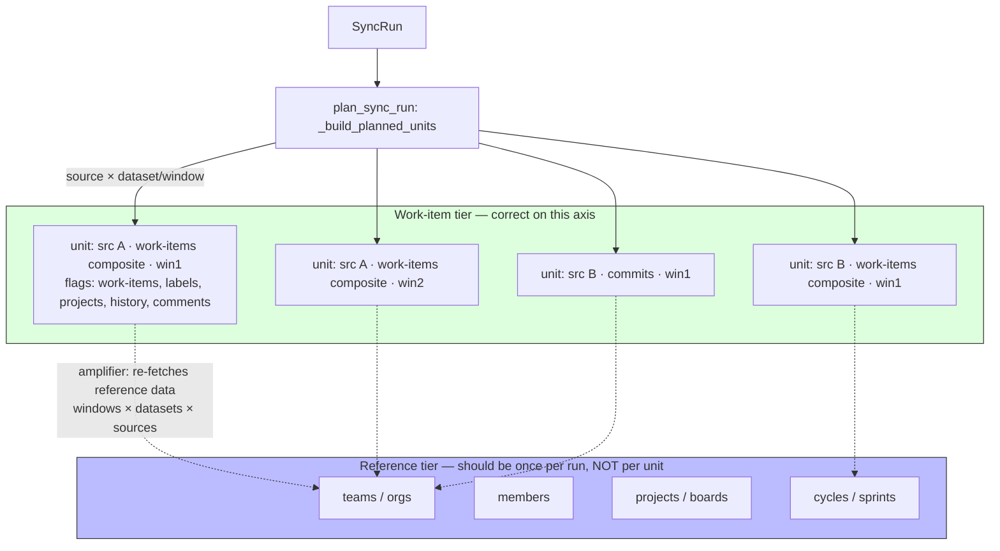

# Sync Unit Model

> **What this documents:** how a sync run is decomposed into executable units, and why **reference data** (teams, orgs, members, projects, boards/cycles/sprints) belongs on a different axis than **work items** (issues, PRs/MRs). This conceptual page was missing, which is why a structural request-amplification went unnoticed (CHAOS-2719). Shipped behavior is described here, and any remaining gaps are called out explicitly.

## Overview

A sync run is decomposed by the planner (`sync/planner.py` `_build_planned_units`) into units of:

```
source × dataset × date-window
```

Each `PlannedUnit` becomes one `SyncRunUnit` row and one `run_sync_unit` Celery task (see [Durable Dispatch Outbox](dispatch-outbox.md) for the task hierarchy). This axis is **correct for work items**, which are per-source and time-sliced: a 90-day backfill of issues legitimately splits into windows, and each window legitimately scopes to one source. The work-item-family datasets are the shipped exception: enabled family keys collapse into one composite `work-items` unit per `(source, window)` and are carried as `family_dataset_*` flags.

The axis is **wrong for reference entities**. Teams, orgs, members, projects, and boards/cycles/sprints are **source-independent and time-independent** — their true cardinality is *once per integration per run*. When a provider fetches reference data *inside* a work-item unit, it pays for that data `windows × datasets × sources` times.



For a 90-day backfill, `ceil(90/14)=7` windows. When the work-item family is enabled, each `(source, window)` now becomes **one** composite `SyncRunUnit`, not 5 separate dataset units, so the family executes once per source/window and carries `family_dataset_*` flags for the enabled child datasets. The same collapse applies to GitHub, GitLab, Jira, and Linear. This is the shipped fix for the work-item-family amplifier, and it is **not Linear-specific**.

## The two tiers

| Tier | Entities | Correct cardinality | Correct axis |
| ---- | -------- | ------------------- | ------------ |
| **Reference / discovery tier** | teams, orgs, members, projects, boards/cycles/sprints | **once per integration per run** | source-independent, time-independent |
| **Work-item tier** | issues, pull/merge requests, labels, history, comments, worklogs | per source, time-sliced | `source × dataset × window` |

**Design rule:** work-item units **read** reference data from a once-per-run source; they must never **fetch** it inline. The persisted ClickHouse store (`teams`, `sprints`) is the read source of truth — but a missing/stale row is **never** proof that an entity is absent. On a store miss, a unit fetches only **its own source's** reference data and persists it; it never falls back to an all-teams / all-repos scan.

## Per-provider entity × cardinality matrix

Legend: **once/run** = fetched once per sync run (correct); **per-unit** = re-fetched inside every work-item unit (amplifier); **discovery** = already pulled out into the once-per-run `team_autoimport` relay.

| Provider | teams / orgs | members | projects / boards | cycles / sprints | issues / PRs |
| -------- | ------------ | ------- | ----------------- | ---------------- | ------------ |
| **GitHub** | discovery (once/run) | discovery | discovery | n/a | per source/window (work-item) |
| **GitLab** | discovery (once/run) | discovery | discovery | n/a | per source/window (work-item, scoped via `settings.project_id`, instance-scoped via `settings.gitlab_instance_url` — CHAOS-2763 / CHAOS-2801) |
| **Jira** | once/run (resolver) | n/a here | per-unit JQL scope ✅ | **per-unit** ⚠️ (`get_sprint` in issue loop) | per source/window (work-item) |
| **Linear** | **per-unit** ⚠️ (`iter_teams()` all teams) | discovery | discovery | **per-unit** ⚠️ (`iter_cycles()` per team) | per source/window (work-item) |

The ⚠️ cells are the work this epic removes. GitHub/GitLab already solved this by pulling org/team/member/project discovery out of the sync unit into a once-per-run [`team_autoimport`](dispatch-outbox.md) relay; Linear (teams + cycles in-unit) and Jira (sprints in-unit) never got that tier. The permanent fix **generalizes the discovery tier to the work-item path** and adds the missing cycle/sprint read-back loader.

## The three amplifiers and their fixes

1. **Per-unit reference re-fetch** (Linear teams+cycles; Jira sprints). The dominant fixed overhead. **Fix (P2):** read teams/cycles/sprints from the persisted store via a once-per-run resolver; add a `get_all_sprints` loader and a cycle/sprint producer; bounded source-scoped API fallback on a store miss.
2. **Work-item-family redundancy.** The 5 family datasets (`work-items`, `work-item-labels`, `work-item-projects`, `work-item-history`, `work-item-comments`) used to re-run the *full* ingest, so enabling the family multiplied cost ×5 per source/window. **Shipped:** plan-time collapse now produces **one** composite ingest per `(source, window)`, with raw `dataset_key='work-items'` plus boolean `family_dataset_*` flags for each enabled child dataset.
3. **Source fan-out.** Work-item units that ignore their own source — Linear `IngestionContext(repo=None)` → all teams; GitHub `discover_repos` without a repo filter → all org repos; GitLab likewise (its `repo_name` is a numeric project id, not the `path_with_namespace` on `repos.repo`, so a naive filter can't reuse the GitHub match). **Fix (P1, shipped on the source-scoping branch):** thread the unit's `source_external_id` so a unit syncs only its one source; preserve the no-source CLI/org-wide path. GitHub shipped first (CHAOS-2720); GitLab shipped via a separate match branch keyed on the discovered repo's `settings.project_id` (CHAOS-2763), since the id spaces don't overlap.

**Target acceptance:** total provider API requests for a backfill scale `O(issues + teams + cycles/projects)`, not `O(windows × datasets × sources)`, across all four providers.

### GitLab numeric-id scoping is instance-scoped (CHAOS-2801)

GitLab `project_id` is only unique **within one GitLab instance** — it is not a
global identifier. An org with two GitLab integrations (two self-hosted
instances, or one self-hosted instance + gitlab.com) can have both discover a
project with the same numeric id. The CHAOS-2763 id-match alone (`repo_name ==
str(settings.project_id)`) cannot tell those two rows apart; a unit
authenticated to instance A could match instance B's same-id row, fetch
project `123` from instance A, and write the result under instance B's
`repo_id` (codex HIGH finding on PR #1143, round 3).

**Fix:** both GitLab repo write sites (`process_gitlab_project` and
`process_gitlab_projects_batch` in `processors/gitlab.py`) now persist the
connector's configured base URL as `settings.gitlab_instance_url` alongside
`settings.project_id`. The work-item scoping loop
(`metrics/job_work_items.py`) resolves this unit's own authenticated GitLab
host up front (reusing the same credential resolution the fetch call already
performs — no new credential path) and compares it against each numeric-id
match's `settings.gitlab_instance_url`.

Both the persist path and the comparison use the **single shared normalizer**
`normalize_gitlab_instance` (`providers/gitlab/instance.py`): lowercased
`scheme://host[:port]`, userinfo/path ignored, and the scheme's **default
port stripped** (http:80, https:443) while non-default ports are preserved.
Never fork a second copy — equivalent spellings of the same endpoint
(`https://host` vs `https://host:443` vs `HTTPS://Host/api/v4/`) must never
false-mismatch, or a harmless credential formatting change would flip every
row of a healthy integration to mismatch-reject and trip the CHAOS-2737
fail-closed path org-wide.

The write sites persist the **normalizer result directly**: when it returns
`None` (blank/malformed input) the key is **omitted** — never the raw URL,
which could retain path/query/userinfo from a malformed value at rest (the
CHAOS-2766/2780 credential-retention leak class) and would violate the
"unknown" semantic the scoping site relies on. An absent key reads exactly
like a pre-CHAOS-2801 row.

**Semantic — the three-case instance rule** (when the unit's instance is
known, per `project_id`; a row with a known *differing* discriminator is
always rejected):

| Same-`project_id` discriminated rows | Legacy (no-discriminator) rows | Outcome |
| --- | --- | --- |
| (a) at least one **matches** the unit's instance | dropped (shadowed) | scope to the discriminated match(es) only |
| (b) **none exist** | **accepted** | absent-accept — pure-legacy orgs unchanged (zero blast radius) |
| (c) only **mismatching** ones exist | dropped | **fail closed** — nothing matches; `require_source` raises with its audit log |

Case (c) rationale (codex HIGH, PR #1148 round-2): a known mismatching
discriminator *proves* cross-instance ambiguity exists for that numeric id —
the legacy row is plausibly the other instance's pre-discriminator row, so
accepting it risks the exact wrong-`repo_id` write this fix closes. Cases
(a)+(c) collapse to one predicate: a legacy row is accepted **only when no
same-`project_id` row carries any known discriminator**. Remediation for a
case-(c) failure is re-running discovery, which now stamps
`gitlab_instance_url` on every row.

Compatibility: an existing pure-legacy single-GitLab-instance org sees
**zero** behavior change (case b). An org that later adds a second instance
gains the full safety once its repos are re-discovered/re-synced and pick up
the discriminator. When the unit's own instance is **unknown** (e.g. a bare
CLI/env-only run with no resolvable base URL) the check never engages;
behavior matches pre-CHAOS-2801.

A rejected row is simply not "discovered" for that unit — the existing
CHAOS-2737 `require_source` fail-closed path (raise when a unit's source
never matched any repo) applies unchanged if no other row matches. This
supersedes the "Known limitation (deferred: CHAOS-2801)" note carried by
PR #1143. GitHub-path behavior is unaffected.

## Invariants this model must preserve

- **Backfill never writes watermarks.** Backfill units (`mode="backfill"`) must never update `sync_watermarks`; see [Data Pipeline](data-pipeline.md) and the planner module contract (CHAOS-2514). The work-item-family collapse writes per-dataset watermarks only for incremental/full-resync units.
- **Coverage and observability consumers must expand family flags.** Any consumer that reads `SyncRunUnit` rows for coverage or observability must expand `family_dataset_*` flags before interpreting a composite work-item-family unit. Raw `dataset_key='work-items'` alone does **not** prove coverage for comments, history, projects, or labels.
- **Provider coverage matrix.** Behavior stays green across `{jira, gitlab, github, linear} × {teams, projects, members, issues}` — see [Team Attribution](team-attribution.md). Never make a fix Linear-only.
- **ClickHouse idempotency.** Reference reads and collapsed/scoped writes stay idempotent (`teams FINAL`, `sprints FINAL`).
- **No Postgres team/identity attribution.** Reference data is read from ClickHouse, never a Postgres attribution bridge.

## Run auth freeze (CHAOS-2755)

A sync run's auth is **resolved once, at plan time, and frozen for the whole run.**
Before this, credentials were re-resolved from the *mutable*
`Integration.credential_id` at four independent points — reference discovery
(`_load_discovery_context`), the three BudgetGuard passes (`observe_run`,
`enforce_run`, `_active_budget_consumption`), and unit execution (`run_sync_unit`) —
so a credential edit *mid-run* could split one run across two identities
(mixed-auth). Freezing makes a run's auth **deterministic**.

**How it is stamped.** `plan_sync_run` resolves the credential immediately after
loading the integration and stamps three RUN-level columns on `sync_runs`:

| Column | Meaning |
| ------ | ------- |
| `credential_id` | The credential UUID resolved at plan time. **Plain UUID, no foreign key** — deleting a stamped credential mid-run is deliberately not blocked; it surfaces as the existing "Credential not found" unit failure. `NULL` for environment auth. |
| `credential_fingerprint` | A **safe-scope content witness** (`credentials/fingerprint.py`): a SHA-256 digest over non-secret identifiers plus per-secret SHA-256 markers. Never a raw secret, and deliberately **not** the full-payload runtime-cache hash (`sync_bootstrap._credential_fingerprint`). |
| `auth_source` | `integration_credential` \| `environment`. **`NULL` marks a legacy / pre-migration / in-flight-at-deploy run** that was never stamped and falls back to the mutable resolution path. |

**How it is read.** Every later phase resolves auth through
`sync_bootstrap.resolve_run_auth(run, integration, …)`, which is the single choke
point behind `SyncTaskBootstrap.load` (so BudgetGuard and `run_sync_unit` inherit
it) and is called directly by reference discovery. When `auth_source` is non-NULL
it uses the run-stamped credential; when `NULL` it falls back to today's
`Integration.credential_id` path so runs already in flight at deploy keep working.

**Deliberate asymmetries (this is what "freezing" means):**

- **`is_active` is enforced at plan-time stamping ONLY.** A run stamped against an
  active credential tolerates that credential being *deactivated* mid-run — the
  run finishes on the frozen credential. There is intentionally no bootstrap-time
  `is_active` check.
- **In-place secret edit (fingerprint mismatch).** If a credential's *secret bytes*
  change mid-run (same id, rotated token), the recomputed fingerprint no longer
  matches the stamp. Default behavior is **warn-and-continue** with the new secret
  (rotation-to-fix-a-bad-token is the common legitimate edit); set
  **`SYNC_RUN_AUTH_STRICT`** (`1`/`true`/`yes`/`on`) to hard-fail such units
  non-retryably during rollout.

**Capacity invariant (binding).** Run-level stamping is for **determinism only**.
No credential field is added to `PlannedUnit` or `SyncRunUnit`, and
`RuntimeCacheKey` is byte-unchanged. Credentials are auth state, **never** dispatch
capacity — changing or rotating credentials must never increase sync dispatch
capacity.

**Migration.** Alembic `0030` adds the three nullable `sync_runs` columns using the
retry-safe guarded-column pattern (revision `0022`).

## References

- Epic: CHAOS-2719 (sync unit model); children CHAOS-2718 (Linear reference re-fetch), CHAOS-2720 (GitHub source fan-out), CHAOS-2721 (work-item-family fan-in), CHAOS-2722 (window-aware budget), CHAOS-2725 (scoped backfill).
- Run auth freeze: CHAOS-2755 (parent CHAOS-2742 — harden sync budget / rate-limit without credential capacity).
- Related: [Durable Dispatch Outbox](dispatch-outbox.md), [Data Pipeline](data-pipeline.md), [Team Attribution](team-attribution.md), [Connector Inventory](../ops/connector-inventory.md).
- Rate limits & budget: [Provider Rate-Limit Policy](../providers/rate-limit-policy.md) — per-provider quota dimensions/headers/retry semantics, the credentials-are-not-capacity invariant, and how work-item units reserve budget by route family before dispatch.
