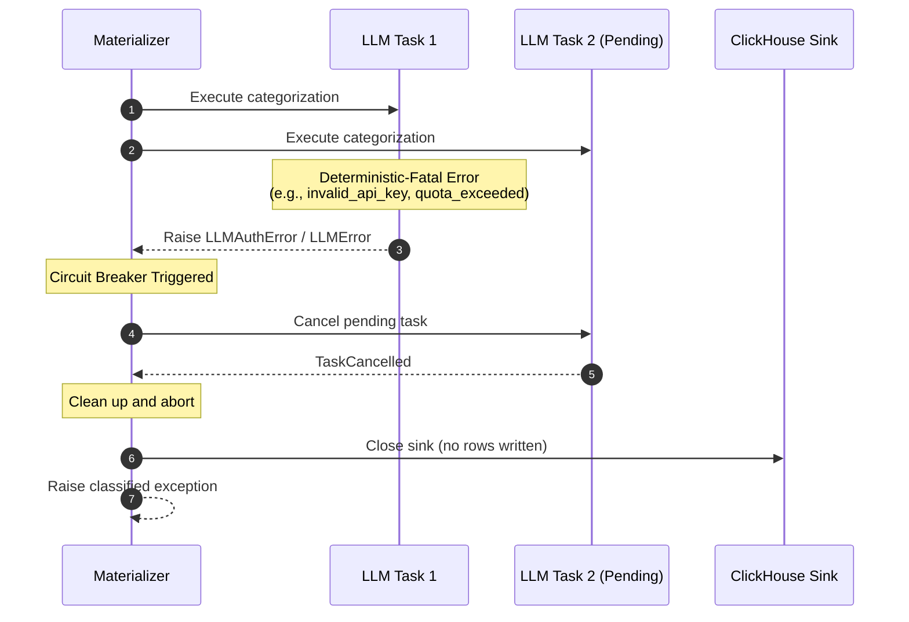

# LLM Error Taxonomy and Circuit-Breaker

This page describes the unified LLM error hierarchy and the circuit-breaker behavior during investment materialization.

## Error Taxonomy

All provider implementations raise exceptions from a unified hierarchy. This allows callers to catch a single base exception instead of importing provider-specific classes.

```
LLMError (base)
├── LLMAuthError          : Invalid or missing API key
├── LLMRateLimitError     : Rate limit or quota exceeded (HTTP 429)
├── LLMContextLengthError : Prompt exceeds model context window
├── LLMServerError        : Transient server-side error (HTTP 5xx)
└── LLMOutputError        : Empty or invalid output from model
```

## Circuit-Breaker Behavior

During parallel investment materialization, the system uses a circuit-breaker pattern to fail fast on deterministic-fatal errors. This prevents wasting API tokens and avoids writing partial or fabricated data to the database.



## Failure Classification

The system classifies failures into two categories:

### 1. Deterministic-Fatal Failures
These errors indicate a configuration or billing issue that will not resolve on retry. The circuit breaker triggers immediately, cancels all pending tasks, and aborts the run.
- `invalid_api_key` / `missing_key`
- `model_not_found`
- `quota_exceeded`
- Any `LLMAuthError`

### 2. Transient Failures
These errors are temporary and may resolve on retry. The system logs a warning and continues processing other tasks in the batch.
- `rate_limit` (without quota exhaustion)
- `server_error` (HTTP 5xx)
- `output_error` (empty or invalid JSON)
- `context_length` (specific to a single large prompt)

## Retry-After Clamping

For rate limit errors, the system respects the provider's `Retry-After` header. However, to prevent a worker from being pinned for an excessive duration, the system clamps the backoff delay to a maximum of 60 seconds.
