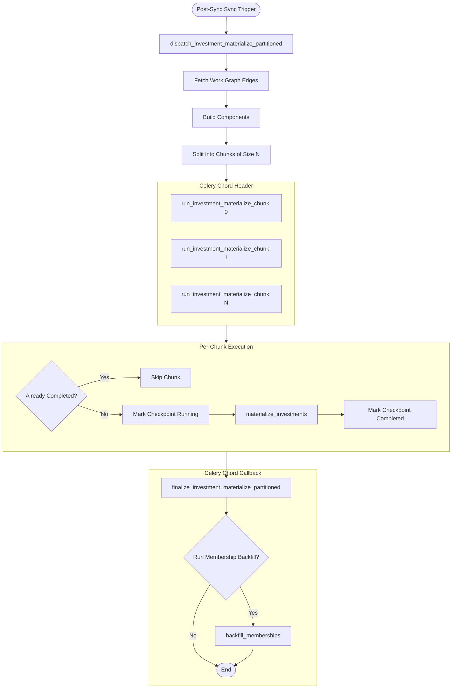
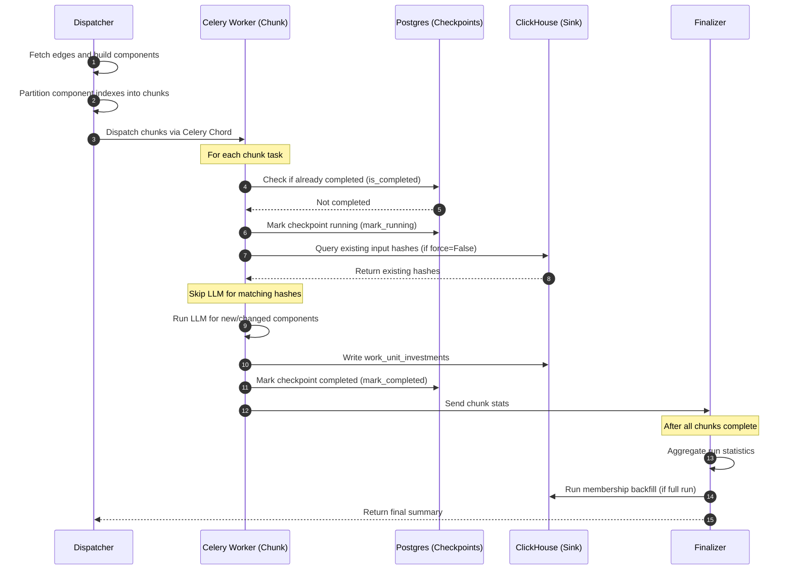

# Materialize Fan-Out and Partitioning

This page describes the partitioned fan-out and caching mechanisms used during investment materialization.

## Partitioned Fan-Out Flow

To handle large work graphs efficiently, the system partitions components and processes them in parallel using Celery chords.

## Sequence of Execution

The sequence diagram below shows the interaction between the dispatcher, chunk tasks, checkpoints, and the finalizer.

## Key Mechanisms

### 1. Checkpoint Protocol
Each chunk task is tracked in Postgres using a unique checkpoint scope ID derived from the `run_id` and `chunk_index`. If a task fails and retries, or if the worker restarts, the system checks the checkpoint table. Completed chunks are skipped, preventing redundant LLM calls.

### 2. Input Hash Caching
Before calling the LLM, the materializer computes a SHA-256 hash of the serialized evidence bundle for each component. If `force` is `False`, the system queries ClickHouse for existing valid records with the same hash and model version. Matching components are skipped. If `force` is `True`, the system bypasses this check and forces a fresh LLM call.

### 3. Membership Backfill Unification
To prevent partial-coverage bugs, the windowed materializer does not write `work_unit_membership` rows or completion markers. Instead, the finalizer triggers `backfill_memberships` at the end of a full run. This projection runs without the LLM, rebuilding the full work graph and projecting membership rows from the already persisted investments.
