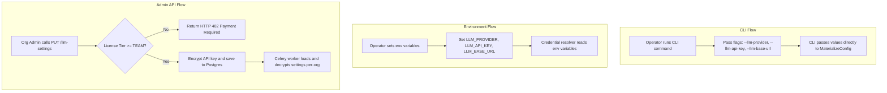

# Bring Your Own Key (BYOK) User Flows

This page describes the three primary user flows for configuring and using custom LLM credentials in the Dev Health platform.

## Configuration Options

Operators and administrators can configure LLM settings through three different channels.



## Detailed User Journeys

### 1. Operator via CLI Flags
This flow is ideal for local testing, one-off synchronizations, or debugging.
- **Action**: The operator runs the sync command with explicit flags:
  ```bash
  dev-hops sync git --llm-provider openai --llm-api-key sk-... --llm-concurrency 10
  ```
- **Precedence**: These values bypass all environment variables and database settings.

### 2. Operator via Environment Variables
This flow is suitable for single-tenant deployments or containerized environments (e.g., Docker Compose, Kubernetes).
- **Action**: The operator defines environment variables in the worker environment:
  ```bash
  export LLM_PROVIDER=anthropic
  export ANTHROPIC_API_KEY=sk-ant-...
  export INVESTMENT_LLM_CONCURRENCY=8
  ```
- **Precedence**: These values are used if no CLI flags are provided. They override database settings.

### 3. Organization Admin via Admin API
This flow is designed for multi-tenant SaaS deployments where individual organizations bring their own keys.
- **Action**: The organization administrator configures settings through the admin dashboard, which calls the settings API:
  ```http
  PUT /api/v1/admin/llm-settings
  Content-Type: application/json

  {
    "provider": "openai",
    "model": "gpt-5-mini",
    "api_key": "sk-...",
    "base_url": "https://api.openai.com/v1"
  }
  ```
- **Licensing Gate**: The API verifies that the organization's license tier is `TEAM` or higher. If the tier is lower (e.g., `FREE`), the request is rejected with an HTTP 402 error.
- **Security**: The API key is encrypted before being stored in the Postgres database.
- **Execution**: When a Celery task runs for the organization, the worker retrieves the settings from Postgres, decrypts the API key, and instantiates the provider.
