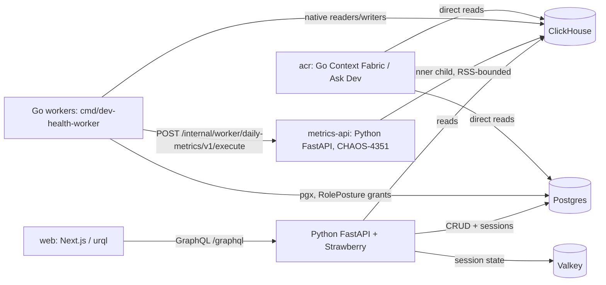
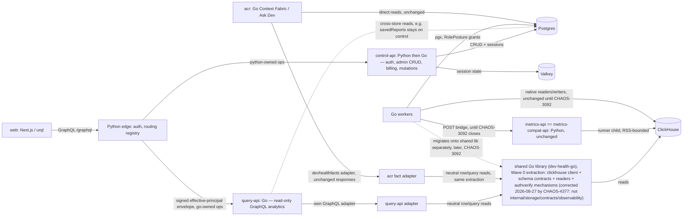
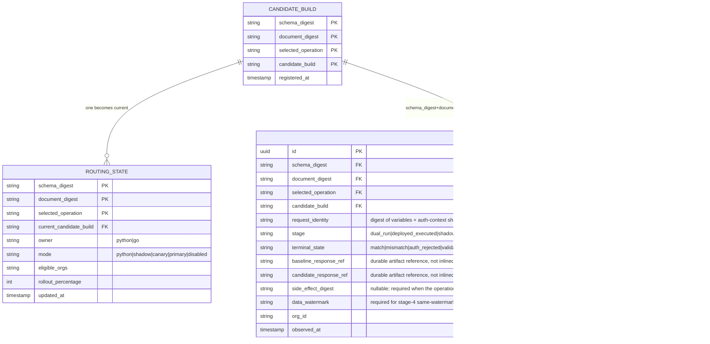

# Go API Epic — Plan (CHAOS-4352)

Status: DRAFT. Author: lane-go-api-plan (Fable), 2026-08-27. Architectural review: `codex exec -m gpt-5.6-sol -c model_reasoning_effort=xhigh`, incorporated into sections 3-8 below; independently reviewed via `codex:review` on this PR (2 rounds, findings addressed — see PR discussion for the full transcripts; per `AGENTS.md`, `.remember/` is per-run scaffolding and not cited here as a durable source).

## 1. Why this plan exists

CHAOS-4352 was a placeholder epic ("almost want even the Python API off Python", chris 2026-08-25). It was not scoped. This document scopes it: inventories the current Python API surface, proposes a Go target architecture and service boundary, and defines a migration strategy that will not repeat the incidents from the Celery→Go worker cutover (CHAOS-3033), which chris stopped mid-migration on 2026-08-26 after prod hit an RLIMIT_AS-vs-RSS memory-bound false positive and a stranded-partition classification gap that were never caught locally before they shipped.

## 2. Current state — API surface inventory

`ops/src/dev_health_ops/api/main.py` mounts, in order:

| Router | Backing store | Domain |
|---|---|---|
| `graphql_app` (Strawberry, `/graphql`) | ClickHouse (queries) + Postgres (mutations) | Analytics, investment, work graph, team attribution, DORA-class metrics; admin-ish mutations |
| `webhooks_router` | Postgres | Inbound provider webhooks |
| `admin_router` (19 sub-routers: ask_dev, audit_logs, credentials, customer_push, features, github_app, governance, identities, integrations, ip_allowlist, orgs, pagerduty(+bindings/services), platform, platform_ask_dev, retention, settings, setup, sync, teams, users) | Postgres, **except** `teams.py`/`identities.py` which are ClickHouse-only (`ClickHouseTeamAdminService`/`ClickHouseIdentityStore` — CHAOS-2600; no Postgres team/identity tables exist) | Org/user/team/identity CRUD, credentials, integrations, sync config, retention, feature flags, governance |
| `impersonation_router` | Postgres + Valkey | Support impersonation |
| `auth_router` | Postgres + Valkey (session) | Auth/session |
| `billing_router` | Postgres | Billing/licensing/subscriptions |
| `dev_router` (Ask Dev, ~45 files under `api/dev/`) | Mixed | Python Ask Dev prototype — **not a porting target**: chris's standing rule is that this prototype is not a reference; the real Ask Dev runtime is native Go in `acr/` against ClickHouse tables + contracts. Only the admin-facing slice (feature flags, settings surfaced via `admin/routers/ask_dev.py`) is durable. |
| `licensing_router`, `telemetry_router` | Postgres | Licensing, telemetry |
| `product_telemetry_router` | Valkey (queue, `get_redis_client`/`streams.py`) | Product telemetry event ingest |
| `ingest_router`, `external_ingest_router`(+status) | Postgres/ClickHouse | Ingest endpoints |
| `internal_acr_router` | Postgres (`get_postgres_session`, internal-service-credential model) | Internal, consumed by `acr/` |
| `worker_operational_router`, `worker_sync_router`, `worker_metrics_router`, `worker_workgraph_router` | Postgres/ClickHouse | **Internal bridge routes for Go workers.** `worker_metrics_router` is `/internal/worker/daily-metrics/v1/execute` — the daily-metrics compatibility bridge Go's heavy worker calls into a Python child process for families not yet natively ported (CHAOS-3092). This was just hardened 2026-08-27 (PR 3f1223b9e: RSS-based memory enforcement, replacing a self-imposed RLIMIT_AS bound that false-fired in prod). A dedicated `metrics-api` service (CHAOS-4351) now runs this Python image standalone in prod so the bridge's runner-child memory profile doesn't compete with the main API replicas. |
| `orgs_router` | Postgres | Org management |

**Not covered by the router table above: 35 handlers declared directly on `app` (`@app.get/post/…`) in `main.py`, not on a mounted `APIRouter`.** These include `/health`, `/ready`, `/health/workers`, and ~32 `/api/v1/*` REST analytics endpoints (`/api/v1/meta`, `/home`, `/explain`, `/heatmap`, `/work-units`, `/flame`(+aggregated), `/quadrant`, and siblings) — a legacy REST surface parallel to the GraphQL analytics queries, gated in the web client by `useGraphQLAnalytics` (CHAOS-4248 tracks dead-code cleanup here). **Before Wave 6 (admin/control REST) or any Python-retirement step, each of these 35 handlers must be classified as ported / retained / retired** — the router-level inventory above is not sufficient on its own to retire the Python composition root, since these health and `/api/v1/*` routes have no owning `APIRouter` and were missed by a `@router.*`-scoped inventory pass.

Endpoint density (`@router.get/post/put/delete/patch` count) — heaviest Postgres-CRUD surfaces: `admin/routers/sync.py` (16), `customer_push.py` (15), `settings.py` (13), `integrations.py` (13), `teams.py` (11), `orgs.py` (11); `dev/router.py` (10), `billing/router.py` (8).

GraphQL: `api/graphql/schema.py` defines `Query` and `Mutation` root types; 33 resolver files under `api/graphql/resolvers/`. **8 of `Query`'s fields are `dev_*` (`dev_scope_search`, `dev_metric_catalog`, `dev_metric`, `dev_evidence_search`, `dev_data_health`, `dev_status_snapshot`, `dev_change_summary`, `dev_work_graph_neighbors`, `schema.py:183-286`) and a 3-field `Subscription` root exists (`api/graphql/subscriptions.py:57-170`) — neither is covered by waves 1-6 below.** Both are Ask Dev prototype surface: out of scope for query-api/control-api porting per section 5's Ask Dev exclusion, but must be explicitly retired or retained (not silently left on the Python edge) before Python retirement is claimed complete. Consumer: `web/` (Next.js, urql client, TypeScript types generated from a schema export consumed by web CI for drift detection — `api/graphql/export_schema.py`). `acr/` (Go) does **not** consume this API; it reads Postgres/ClickHouse directly for its own runtime.

Auth/session: Valkey-backed sessions, per-request web session sync, tier resolution via `resolve_org_tier` (never `OrgLicense`-only), impersonation state kept in sync between Valkey and per-request web state.

Governing platform rule (root `AGENTS.md`): **ClickHouse is the only supported analytics backend; PostgreSQL is the semantic layer only.** Team/identity attribution has zero Postgres presence (CHAOS-2600) — it is ClickHouse-only, query-time.

## 3. Service boundary — recommendation

*(Codex `gpt-5.6-sol --effort=xhigh` architectural review incorporated below; raw output in `.remember/lanes/lane-go-api-plan/codex_round1_architecture.out`, lines 8401-8598.)*

**Recommendation: three planes, not a strict ClickHouse/Postgres split.**

| Plane | Runtime | Owns |
|---|---|---|
| `query-api` | Go (new) | Read-only, latency-bounded GraphQL analytics operations (mostly ClickHouse, some cross-store) |
| `control-api` | Python today, incremental Go | Auth, impersonation, billing/licensing, Postgres CRUD (admin routers), webhooks/ingest, operational controls, report metadata/mutations |
| `metrics-compat-api` | Existing Python `metrics-api` (CHAOS-4351) | Only the worker daily-metrics compatibility bridge endpoints + runner subprocess — unchanged by this epic |

The current FastAPI process is a composition root, not a service boundary — it mounts GraphQL, admin, auth, billing, ingest, Ask Dev, telemetry, and worker bridges in one process (`main.py`).

**Why this is not simply "metrics vs admin" along store lines.** The split follows workload and state ownership, not GraphQL verb or datastore name. Counter-examples that break a literal ClickHouse/Postgres cut:
- `savedReports` (a Query field) is Postgres-backed; all current Mutation fields are Postgres-backed report-control operations — both stay on `control-api` despite being reached through the same schema as the ClickHouse analytics queries.
- Team/identity administration reads/writes ClickHouse (the CHAOS-2600 attribution store) but is **administration**, not interactive analytics — it stays on `control-api`.
- The Ask Dev prototype (`api/dev/*`) is out of scope for either plane; its Go runtime lives in `acr/`.

**Auth stays put initially.** Do not split auth/session into a third thing yet — the request-path auth contract (Postgres token validation + impersonation precedence + org selection + ClickHouse context construction, `graphql/app.py`) is too entangled to lift alongside the first Go plane. `query-api` receives a short-lived, audience-bound signed effective-principal envelope from the Python edge; it must never reduce auth to bare JWT signature validation (disabled users, token-version revocation, org-switch membership checks, active impersonation, and tier fallback are all part of the contract) — see open decision 1.

**What `metrics-api` (CHAOS-4351) actually is:** the same Python API image, no route split, reachable only internally, isolated purely so the compatibility bridge's runner-child memory/PID profile doesn't compete with normal API traffic. It does **not** partially implement this split and must not be reused as the `query-api` name. `metrics-api` and `metrics-compat-api` (the plane named in the table above) are the same deployment — one name for one thing, not two. Retire it only when no Go worker still calls the compatibility endpoints, ledger-recovery is no longer needed, and a defined zero-traffic window has passed — moving GraphQL resolvers to Go neither requires nor justifies retiring it early. Retirement is owned by CHAOS-3092/CHAOS-4374, not this epic (open decision 6).

**`acr/` is not just an unchanged consumer — it is a second, independent Go implementation of most of what `query-api` would otherwise build from scratch.** `acr/internal/contextfabric/devhealthfacts` already has ClickHouse fact readers over the same `ops`-owned tables `query-api`'s resolvers would read: `metrics.go`, `pullrequests.go`, `workitems.go`, `ci.go`, `deployments.go`, `incidents.go`, `investment.go`, `identity.go`, `providers.go`, `source_health.go`, `workload.go`, `timebound.go` (window/scope handling), `readiness.go` (degraded-result semantics). `acr/internal/contextfabric/devhealthschema` is, in its own words, "the SINGLE declared snapshot of the production ClickHouse column types the Context Fabric readers depend on" — built specifically because two independent packages (`devhealthsource`, `devhealthfacts`) each hand-modeled the same column and drifted (CHAOS-3789, CHAOS-3781). `devhealthsource` is the schema/contract assembly layer on top. `acr/internal/auth` already implements the verification *mechanisms* a principal envelope needs — web-assertion JWKS verification, workload token exchange, k8s token review, a request limiter — but **not a directly reusable principal shape**: `web_assertion.go` carries only subject, org, repository scopes, and ACR-specific permissions, while Ops GraphQL's authz (`graphql/authz.py`) additionally checks user permissions, superuser state, active impersonation, and licensed features (open decision 1's full contract). Workload token exchange and k8s TokenReview are separate workload-credential mechanisms, not principal-envelope verification themselves. **Wave 0 extracts the JWKS/token-exchange/token-review verification mechanisms as reusable primitives; it does not extract or reuse ACR's principal shape.** `query-api` needs its own claim schema and verifier, defined and versioned before it becomes a Wave-0 dependency, built on top of those extracted mechanisms.

*Corrected 2026-08-27 by CHAOS-4377:* the sentence naming `acr/internal/contracts` + `internal/contractcheck`, `internal/storage`, and `internal/observability` as a store/contract/observability layer to extract was wrong. `internal/storage` is ACR's Principal/CredentialStore domain, not a ClickHouse client (the actual CH client is `internal/runtime/clickhouse`), and `internal/contracts`, `internal/contractcheck`, `internal/observability` are ACR-packet-shaped with no store-level content to extract. Wave 0 extracts exactly four packages into the standalone `dev-health-go` module: `clickhouse` (the read-only CH client, from `internal/runtime/clickhouse`), `schema` (from `devhealthschema`), `readers` (the neutral row readers beneath `devhealthfacts`), and `authverify` (the JWKS/token-exchange/token-review mechanisms, from `internal/auth`'s mechanism subset) — see `dev-health-go`'s own README for the package table.

Building `query-api` without this would recreate, a second time, exactly the kind of type-drift incident `devhealthschema`'s doc comment describes — the CHAOS-3033 lesson applied to a Go-vs-Go split this time, not Python-vs-Go. **Wave 0 must extract a shared library, store/contract layer only** (see §6): the ClickHouse client + org-scoping/reader-dedup primitives, the table schema contracts (`devhealthschema`), and the JWKS/token-exchange/token-review verification mechanisms from `internal/auth` — **not** resolver shapes, GraphQL types, response formatting, or ACR's consumer-domain fact shapes. `devhealthfacts`'s public interface is itself ACR-consumer-shaped (`ReadFacts(ctx, storage.Principal, FactQuery) (FactProviderResult, error)`, `CanonicalFact`/`FactValue` construction, `fact_registry.go`) and Go's `internal/` package boundary prevents a standalone module from importing it as-is. What Wave 0 extracts is **the neutral row/query contracts beneath `devhealthfacts`** — the raw ClickHouse column-level reads against `devhealthschema`'s declared types — leaving `devhealthfacts`'s `FactQuery`/`FactProviderResult`/`CanonicalFact` adapter layer in `acr`, and an equivalent GraphQL-shaped adapter layer in `query-api`, both built on the shared neutral readers. Both `acr` and `query-api` consume the extracted library through their own adapters; `ops`'s own native Go readers (the CHAOS-3092 daily-metrics ports) migrate onto it in a later, separate step, not as part of this epic's Wave 0.

## 4. GraphQL library choice

**Use gqlgen.** Strawberry already exports the schema as SDL (`export_schema.py`); gqlgen is schema-first and generates Go models/plumbing/resolver interfaces from that SDL, matching the existing server-schema → client-codegen direction. Web keeps its urql operations and generated TS types unchanged — GraphQL Code Generator accepts either a local SDL or a live endpoint, so the server language is irrelevant as long as the schema and wire behavior are stable. (`graph-gophers/graphql-go` also consumes SDL but offers less generation leverage at this schema size; `graphql-go/graphql` builds the schema programmatically, which would introduce a second manually-maintained schema — the wrong direction for drift control.)

During coexistence, enforce as a CI gate: `Strawberry export == checked-in canonical SDL == gqlgen input SDL == web codegen SDL`. Preserve runtime behavior, not just schema shape — custom scalar serialization, nullability, error paths/extension codes, subscriptions, query-depth/alias limits, disabled production introspection, and the existing request-size bound (`graphql/security.py`) are all client-visible contracts. Do not adopt gqlgen's automatic-persisted-query extension as a drop-in for the current `X-Persisted-Query-Id` header/registry — audit actual web usage first; the handshake shapes differ.

## 5. Migration strategy — not repeating the worker cutover's failures

The worker cutover's incidents shared one shape: a family was ported and deployed before its local-proof/executed-proof gate existed to catch a resource-model mismatch (RLIMIT_AS counts virtual address space, not RSS) and a classification gap (a dead ledger claim never reaching a terminal state). The API migration needs the HTTP/GraphQL equivalent of "executed-proof": a per-route/per-operation gate that proves the Go implementation produces the same observable result as Python on real traffic shapes, not just that it compiles and passes a hand-written unit test.

**Operation identity and routing.** `/graphql` multiplexes many behaviors, so path routing is insufficient. A rollout registry is keyed by `schema digest + canonical document digest + selected operation` (operation *name* is telemetry only — names collide and don't capture aliases/fragments/changed selections; a persisted-query ID is only an index once it resolves to the registered document digest). Each entry carries `owner: python|go`, `mode: python|shadow|canary|primary|disabled`, `eligible_orgs`/`rollout_percentage`, `candidate_build`, `schema_digest`. Rules: route the *whole* operation, never individual fields; an operation with both migrated and unmigrated root fields stays on Python; unregistered documents, introspection, subscriptions, and (initially) all mutations stay on Python; rollout is sticky by org + operation digest; **rollback is a registry change, not an image rollback.**

**Five-stage proof gate**, each with a named terminal state (`match`, `mismatch`, `auth_rejected`, `validation_rejected`, `dependency_failed`, `timeout`, `cancelled`, `resource_exhausted`, `fallback`, `unsupported`, `proof_failed` — no unclassified equivalent of a stranded partition is acceptable):
1. **Proof infrastructure first** — comparator, operation registry, rollout ledger, auth-context fixture matrix, and rollback path all exist before any resolver is ported.
2. **Local dual-run proof** — real Python and Go servers against the same producer-seeded scratch Postgres/ClickHouse/Valkey state; compare the *complete* observable response (status + contract headers, GraphQL `data`, `errors` incl. paths/extension codes, null-vs-omitted, scalar formatting, list ordering/pagination/cursors) **and server-side effects** — some resolvers (e.g. `home`/investment analytics) call telemetry/audit hooks such as `record_stale_investment_membership_scope` or increment fallback counters as a side effect of the read; response parity alone cannot catch Go silently dropping these. Inventory each resolver's side effects before porting it and assert them alongside the response digest. Every exclusion needs a written reason and must match something; the comparator itself must be falsified with planted defects (a removed row, changed nullability, changed error path, reordered results, a dropped side-effect call) — the CHAOS-3033 differential-oracle discipline applied to HTTP.
3. **Deployed executed proof** — the exact candidate build handles the request through real ingress, auth, org/impersonation resolution, GraphQL parse/validate, resolver dispatch, real DB access, serialization. A constructor, health check, direct resolver test, or bare 200 does not qualify.
4. **Read-only shadow** — Python serves the client response while Go receives the same authenticated operation in parallel; compare response digests only when both observed the same data watermark/snapshot. Executing an operation twice duplicates any side effect stage 2 found (a counter increment, an audit write) even though only Python's response reaches the client — shadowing is restricted to operations proven side-effect-free in stage 2, or the Go shadow path runs with side effects explicitly suppressed/tagged as shadow-only so they never double-count against the same telemetry an operator or alert reads.
5. **Sticky canary** — one operation, selected orgs first, widen gradually. No one-shot family deployment (the exact failure mode of the worker cutover's metrics-family ports).

Semantic parity and operational safety are separate claims — a canary must also execute representative concurrency inside the real container/cgroup measuring RSS, PIDs, cancellation, latency, error rate (the RLIMIT_AS-vs-RSS lesson: neither implies the other). For mutations (later phase): never shadow-dual-write production state, prove against cloned isolated stores first, canary a single primary implementation, require authoritative DB readback plus audit/outbox/job-ledger evidence, and never fall back after dispatch once a write outcome may be ambiguous.

Non-negotiables carried over from the worker cutover's post-mortem:
- **Local-proof-first.** No prod deploy of a cut-over route until it is proven on the shared local stack against real data (an org with real rows, not only fixtures) — this is standing orchestration policy after the 2026-08-26 stop order.
- **One-shot deploy waves**, not continuous partial rollout of unfinished waves.
- **Per-route feature flag + rollback**, not a big-bang switch.
- **A parity oracle**, built from the real producer (the actual resolver/handler), never hand-authored fixtures — the differential-oracle lesson from CHAOS-3033 (`internal/testsupport/oraclecompare`) is mandatory practice, not optional.
- **What does NOT get ported** must be explicit and written down before a wave starts, not discovered mid-port. Candidates already known: dead REST endpoints behind the `useGraphQLAnalytics` flag (CHAOS-4248 class); the Python Ask Dev prototype (`api/dev/*`) is out of scope entirely — Ask Dev's Go runtime lives in `acr/`, not this API.

## 6. Sequencing

**Wave 0 — build the gate** (no user-facing porting): freeze/export canonical SDL; inventory actual web documents + production operation frequency; implement the operation router + proof ledger; implement the effective-principal envelope; prove the comparator detects intentional divergences (planted-defect controls); deploy an empty Go `query-api` and prove a route becomes reachable when, and only when, its individual switch is enabled (the CHAOS-3033 "cited constructor is not proof of capability" lesson, applied here as a table-driven reachability test).

**Wave 0 also includes: extract the shared Go data/auth library from `acr`** — store/contract layer only: the `clickhouse` read-only query client (from `internal/runtime/clickhouse`, *corrected 2026-08-27 by CHAOS-4377* — not `internal/storage`, which is ACR's Principal/CredentialStore domain), `devhealthschema`'s table contracts, the neutral row/query readers beneath `devhealthfacts`, and the JWKS/token-exchange/token-review verification mechanisms from `internal/auth` — explicitly excluding resolver/response shapes, GraphQL types, ACR's `FactQuery`/`FactProviderResult`/`CanonicalFact` adapter layer, any directly-reused principal shape, and `internal/contracts`/`internal/contractcheck`/`internal/observability` (ACR-packet-shaped, no store-level content) — `query-api` defines its own claim schema on top of the extracted verification mechanisms (see §3). This must land **before or alongside** the rest of Wave 0, since `query-api`'s first reachable route (used to prove the switch-gated-reachability test above) should already be built on the extracted readers, not on hand-rolled ClickHouse queries that would need porting again later. `acr` migrates its own `devhealthfacts` adapter onto the extracted neutral readers in the same change (no behavior change to `acr`'s existing responses); `ops`'s native Go metrics readers (CHAOS-3092) migrate onto it separately, later, not as part of this wave.

**Wave 1 — `featureFlags` only.** Strongest first canary: read-only, ClickHouse-only, bounded, stable explicit ordering, already has a live ClickHouse test, and exercises a real non-happy-path (missing-table degraded result). Port only `featureFlags` in the first switch, not `featureFlagEvents`. If production inventory shows `featureFlags` gets no real traffic, use it for local/staging proof only and pick `reviewEdges` as the first production canary — a route with no traffic cannot furnish production executed-proof (stage 3 above).

**Recommended continuation, all read-only:** (2) `reviewEdges` — after making tie-ordering deterministic; (3) `hotspots`, `complexityTimeseries`, `cognitiveLoad`; (4) higher-fan-out analytics, Work Graph, DORA, batch `analytics`; (5) Postgres-backed GraphQL reads (`savedReports` and equivalents); (6) admin/control REST reads — the 19 admin routers' `GET` surface **plus every other `GET` handler not yet named**: the 35 direct-`@app.*` handlers (section 2), billing/licensing router reads, external-ingest status, telemetry, `internal_acr_router`, `orgs_router`. Each must reach an explicit ported/retained/retired disposition in this wave — an enumerated closed list, not "the 19 admin routers" as shorthand — or the mutation gate below has no attainable completion condition. **Mutation admission gate** — every read operation across both GraphQL and REST (Waves 1-6, the complete read surface) must be stable in production before this gate opens; opening it earlier (e.g. after Wave 5 alone, before Wave 6's REST reads exist) does not satisfy open decision 4. (7) **Mutations** — GraphQL report mutations and admin/control REST writes together, per-mutation-family DB/audit/outbox readback proof, single-primary canary, no shadow-dual-write (see the mutation rules in section 5). (8) public auth/impersonation edge **last**. The Python Ask Dev `dev_*` runtime is never in this sequence — it is out of scope for the Go API entirely.

## 7. Open decisions for chris

1. **ACCEPTED (chris 2026-08-27 18:11 PT). Effective-principal trust boundary.** Should phase-one Go independently query Postgres/Valkey for auth state, or trust a short-lived signed principal envelope issued by the Python edge? *Recommendation: signed envelope — reproducing the full auth contract (disabled users, token-version revocation, org-switch membership, impersonation, tier fallback) independently in Go before it has proven anything else is unnecessary risk.*
2. **ACCEPTED (chris 2026-08-27 18:11 PT). GraphQL eligibility policy.** Must Go-routed operations be registered/persisted documents, or is arbitrary normalized-AST eligibility allowed? *Recommendation: registered documents only, initially — closes the door on an unbounded operation-shape surface during the riskiest phase.*
3. **ACCEPTED (chris 2026-08-27 18:11 PT) — as a process gate, not a fixed rule set. Canonical parity rules.** Sign off on exact treatment of error ordering, null-vs-omission, floating-point comparison, concurrent ClickHouse watermark handling, and list tie-ordering — these decide what "match" is allowed to mean, before any operation reaches stage 2 of the proof gate. *This decision has no standing recommendation to accept a specific rule set — chris's acceptance covers the gate itself (sign-off required before stage 2), not yet-authored rule content; the exact rules still need to be proposed and signed off when the comparator is built (CHAOS-4381).*
4. **ACCEPTED (chris 2026-08-27 18:11 PT). Mutation admission.** May any write operation move before the read plane is broadly proven? What DB/audit/outbox readback is required per mutation family? *Recommendation: no mutation moves until Waves 1-6 (every read operation, GraphQL AND REST) are stable in production — this is the single gate; section 6's sequencing places all reads before it and puts every mutation (report mutations + admin CRUD writes) in one later wave.*
5. **ACCEPTED (chris 2026-08-27 18:11 PT). Shared library ownership.** Which repo hosts the extracted store/contract module — a new standalone `dev-health-go` module, or a `pkg/` package inside `ops` that `acr` imports as an external module? *Recommendation: new standalone module (e.g. `dev-health-go` or `dev-health-platform`), not `ops/pkg/`.* `acr` and `ops` are separate Go modules with separate release cadences and CI gates today; making `acr` depend on a package that lives inside `ops` inverts the dependency both ways in practice (a bugfix in the shared reader now requires an `ops` PR to unblock an `acr` release) and risks re-importing `ops`'s Python-adjacent dependency surface into `acr`'s build. A standalone module keeps the extraction's own promise — a store/contract layer with no resolver/response shapes attached — enforceable by the module boundary itself, not just by convention.
6. **`metrics-api` retirement** (not part of the 2026-08-27 18:11 PT acceptance — no recommendation stated here to accept; remains open, owned by CHAOS-3092). Name the exact remaining Python-compatibility families, recovery obligations, zero-traffic window, and rollback window that must all close before the `metrics-api` deployment is deleted — this is owned by CHAOS-3092, not this epic, but the two must not silently diverge.
7. **ACCEPTED (chris 2026-09-01 15:56 PT, "Go is the route"). Investment argMax NULL-skip semantics.** CHAOS-4547's fix wraps four Nullable columns (`repo_id`, `provider`, `work_unit_type`, `work_unit_name`) of `investment.go`'s `latestWorkUnitInvestmentsSource` in `(argMax(tuple(col), computed_at)).1`, so the Go plane reports a work unit's TRUE latest generation including a NULL, while `api/queries/investment.py`'s unwrapped `argMax(col, computed_at)` null-skips to a STALE non-null value from an earlier generation once the newest one clears the column (CHAOS-4759). *Decision: keep Go's behavior as correct; Python is NOT fixed (no Python GraphQL work under this epic's routing rules).* The resulting Go/Python divergence is deliberate and bounded by a telemetry guard (`RecordArgMaxNullTransitionGuard`, `cmd/query-api/internal/analytics/investmentargmaxtransitionguard.go`) rather than by matching Python's stale-read behavior — see that file's and `investment.go`'s doc comments for the mechanism and CHAOS-4759 for the full decision record.

## 8. Diagrams

### 8.1 Current topology

### 8.2 Target topology (end state of this epic — Wave 6, before public auth edge moves)

### 8.3 Operation rollout ledger (data model)

Proof identity must be bound to the exact candidate, not just the document: a `PROOF_RUN` keyed only by `document_digest` stays valid across a `candidate_build` change, and cannot distinguish two operations selected from the same multi-operation document. `schema_digest`, `document_digest`, `selected_operation`, and `candidate_build` together are the proof's immutable key — a proof run is evidence for exactly one tuple, never carried forward across any of the four changing.

One table cannot be both the append-only proof target and the mutable routing decision: `mode`, `rollout_percentage`, and "which build is current" all change as a rollout progresses, but a proof must stay pinned to the exact build it proved. Two entities, not one:

- **`CANDIDATE_BUILD`** — immutable, append-only. One row is created the first time a `candidate_build` registers against an operation; it is never updated. `PROOF_RUN` references this row, so a proof can never be silently reattributed to a later build.
- **`ROUTING_STATE`** — exactly one mutable row per `(schema_digest, document_digest, selected_operation)`. Holds the *current* `candidate_build` pointer, `mode`, `rollout_percentage`, `eligible_orgs`. This is what the request router reads on every call, and what a rollback mutates in place — moving the pointer back to an earlier (already-immutable) `CANDIDATE_BUILD` row is exactly the "registry change, not an image rollback" from section 5.

`PROOF_RUN` also records which *request* produced its verdict, not only which candidate: a registered document invoked with different variables, auth context, or org can diverge even when the document digest matches, and stage 2/4's "complete observable response" and "same watermark" claims need durable evidence to check, not just a pass/fail row.

