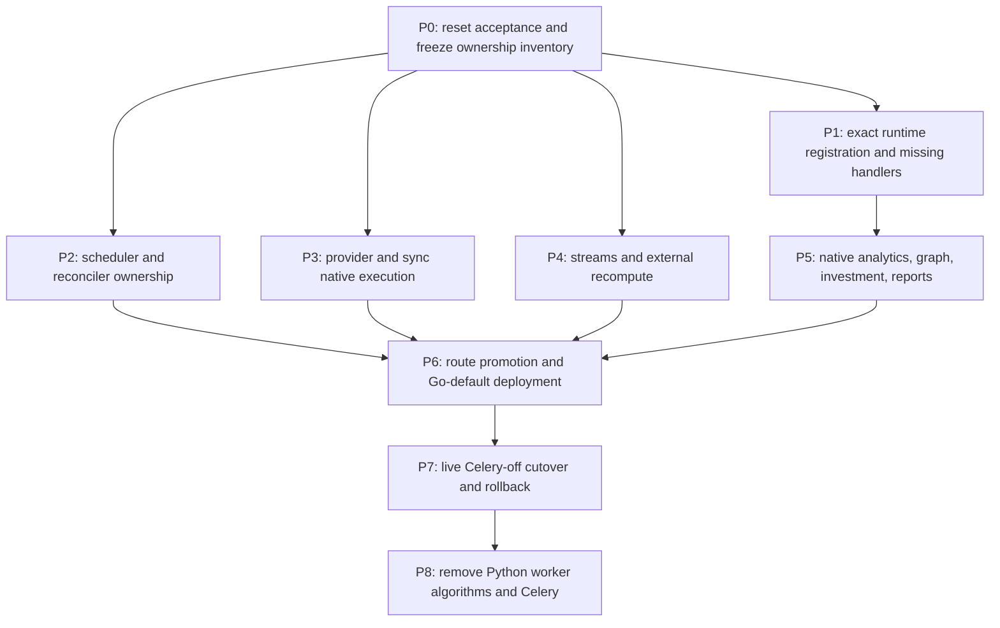

# Go Worker Cutover Completion Implementation Plan

**Status:** Execution-ready handoff  
**Epic:** CHAOS-3033  
**Last updated:** 2026-07-24  
**Technical design:** [Go Worker Cutover Completion TRD](../architecture/go-worker-cutover-trd.md)  
**Foundation plan:** [Go Worker Migration Implementation Plan](go-worker-migration-implementation-plan.md)

## 1. Objective

Complete the worker migration that the existing issue states describe as done.
The program is not complete when Go/River containers can run beside Celery. It
is complete when all production worker ownership is implemented in Go and
Celery/Beat/Python worker algorithms are removed.

This plan deliberately separates:

1. **Celery-off checkpoint:** Go owns execution, scheduling, leases, retries,
   routes, and streams. Explicitly temporary Python algorithm services may
   remain.
2. **Migration complete:** temporary worker algorithm services are deleted and
   no production Celery or Python worker dependency remains.

The first checkpoint is a reversible operational milestone. Only the second
closes CHAOS-3033.

## 2. New-session operating contract

The next session should begin here:

```text
repository: /Users/chris/projects/full-chaos/dev-health/ops
canonical worktree: /Users/chris/projects/full-chaos/dev-health/worktrees/ops/go-local-runtime-activation
canonical integration branch: feat/go-default-cutover
base commit: 4cc70a3904f75dbb5e5e9440107c36f55fa14682
canonical local infrastructure: /Users/chris/projects/full-chaos/dev-health/compose.yml
```

Operating rules:

- plan first and keep the root agent as orchestrator/integration owner;
- use parallel agents for disjoint implementation lanes;
- use lane worktrees/branches when agents edit unrelated surfaces;
- merge lanes into `feat/go-default-cutover` only after their focused gate;
- the orchestrator owns shared registry, migration-state, deployment-profile,
  route-policy, and final Compose integration files;
- do not edit or commit on `main`;
- preserve existing local database and stream volumes;
- Cloudflare failure is non-blocking;
- do not wait for manual parity capture: agents can run the Celery and Go stacks
  against the same dataset and compare continuously, but they must never be
  simultaneous write owners of the same workload;
- do not claim a phase complete because code is dormant, a handler type exists,
  or a test uses a fake builder;
- do not close the epic at the Celery-off checkpoint.

Recommended four-slot team:

| Slot | Role | Preferred model | Ownership |
|---|---|---|---|
| 1 | orchestrator/integrator | Sol medium | shared contracts, dependency order, integration, final gates |
| 2 | scheduler/control worker | Sol medium | scheduler, reconciler, periodic inventory |
| 3 | provider/sync worker | Sol medium | provider matrix, unit execution, sync coordinators |
| 4 | deployment or native-compute worker | Terra high | rotate between reports/analytics, manifests, Compose, and verification |

Use the currently available exploration-role model for fresh discovery and
reader/document review; prefer Luna when the agent runtime exposes it.

## 3. Verified starting state

- 24 registered job kinds.
- 23 kinds are `go_implemented` but still routed to Celery.
- `sync.provider_unit` is the only `river_canary` policy.
- the durable provider-unit route remains Celery unless an operator promotes it;
- only LaunchDarkly feature flags have a complete-route Go descriptor;
- the deployment manifest accepts only `coexistence_disabled`;
- all Go processes have zero minimum replicas and are disabled by default;
- the root canonical Compose stack starts Celery workers and Beat, not Go;
- 19 unconditional Beat entries and one optional occurrence consumer exist;
- the Go scheduler is source-gated off;
- the Go reconciler defaults to shadow composition;
- report kinds are advertised but no production worker constructs them;
- analytics/work-graph/investment handlers call Python worker algorithms;
- non-canary sync dispatch still creates Celery signatures;
- external recompute still requires a Beat compatibility task;
- PagerDuty provider datasets are absent from the Go capability inventory;
- PagerDuty webhook processing and team drift remain Celery-only surfaces
  outside the bounded-job registry.

## 4. Program dependency graph



After Wave 0 freezes ownership and acceptance, P1–P4 form the first
implementation wave. P5 begins as soon as the exact registration contract
lands; individual native-compute families can then proceed in parallel. P6 is
the integration boundary and must not activate incomplete profiles.

## 5. Program-wide acceptance rules

Every migrated surface must provide:

- one checked owner in the transitional workload inventory;
- a stable versioned argument contract;
- one concrete production handler registration;
- exact startup/profile/queue validation;
- success, retryable, terminal, cancellation, timeout, and panic behavior;
- durable idempotency and crash-window tests;
- real PostgreSQL/River integration coverage where state is involved;
- provider/ClickHouse/Valkey integration coverage where applicable;
- parity against a non-empty baseline dataset;
- rollback behavior and operator evidence;
- documentation changes in the same PR.

The following are false passes:

- zero scheduled occurrences;
- zero provider units;
- a skipped compatibility result;
- a fake builder satisfying profile coverage;
- a route string changed without the durable route rows;
- a Go handler that calls a Celery task wrapper;
- a stream entry consumed while its required downstream recompute is stranded;
- a capability listed in the registry but not constructed by a binary;
- parity that compares only job statuses rather than product data.

## 6. Phase 0 — acceptance reset and ownership lock

### CUT-00 — Reopen and reclassify incomplete work

#### Work

- Reopen CHAOS-3033.
- Reopen or replace sub-issues whose acceptance is unmet.
- Record two milestones: Celery-off and migration-complete.
- Remove “Done” from bridge-only, dormant, unwired, or unactivated work.
- Make the new TRD and this plan the execution handoff.

#### Acceptance

- Every open implementation item maps to a section below.
- The epic definition of done matches the migration-complete gate.
- A bridge-only implementation cannot close a native-migration issue.

### CUT-01 — Add the complete transitional workload inventory

#### Work

- Inventory every:
  - Celery task decorator;
  - Beat entry;
  - `.delay`, `.apply_async`, `send_task`, and Celery signature call;
  - webhook/task dispatch;
  - admin/API direct-trigger task;
  - bounded job registry kind;
  - stream consumer and downstream control action.
- Map each surface to one target kind/process or an explicit removal.
- Include all 19 unconditional Beat entries plus the optional occurrence
  consumer.
- Include team drift, PagerDuty webhooks, queue/health tasks, fan-out
  coordinators, pruning, and external recompute.
- Add CI that fails on an unmapped legacy surface or duplicate target owner.

#### Files

```text
contracts/jobs/v1/
src/dev_health_ops/workers/
src/dev_health_ops/api/
tests/workers/
ci/
```

#### Acceptance

- The inventory is non-empty and equals independent code discovery.
- Adding an unowned Celery task or schedule fails CI.
- Every inventory row has an executable acceptance-test identifier.

### CUT-02 — Make runtime capability truthful

#### Work

- Invoke `Registry.ValidateStartup` from production readiness.
- Derive expected queue/kind coverage from the registry.
- Derive actual capability from constructed handler adapters.
- Remove `compiledHandlerKinds` as an independent capability claim.
- Remove the empty latency profile or populate and wire it.
- Fail readiness on an executable kind without one concrete handler.
- Fail readiness on an extra handler, missing queue, unsupported queued
  contract version, or deployment-budget mismatch.

#### Acceptance

- The current unwired report state fails the new validation.
- Fake or dormant compiled descriptors cannot satisfy readiness.
- Every enabled profile passes exact production startup validation.

## 7. Phase 1 — missing runtime handlers

These work items can run in parallel after CUT-01 defines their stable target
kinds. The orchestrator alone edits the shared registry/migration documents.

### CUT-03 — Register native reports

#### Work

- Add an explicit report builder to production worker dependency sources.
- Construct `internal/jobs/report` production dependencies.
- Register both on-demand and scheduled adapters.
- Add the `reports` queue to the owning profile's actual River client.
- Preserve query allowlists, artifact hashes, notification leases, and golden
  output.
- Prove both kinds through exact startup validation.

#### Acceptance

- Both report kinds execute against real PostgreSQL and ClickHouse fixtures.
- Artifact and metadata goldens match.
- A missing report adapter closes readiness.
- Scheduled reports have a native scheduler producer before route promotion.

### CUT-04 — Port uncovered operational surfaces

#### Work

- Add distinct native operations for:
  - rate-limit observation retention;
  - external-ingest batch retention;
  - PagerDuty webhook stream processing;
  - heartbeat;
  - billing and generic webhook delivery where compatibility remains;
  - worker/queue health replacement.
- Wire `internal/jobs/pagerduty` into the external or dedicated stream runner.
- Preserve PagerDuty receipt, retry, dead-letter, canonical incident, and
  idempotency behavior.
- Ensure retention operations cannot broaden their target table.

#### Acceptance

- PagerDuty retry/dead-letter fixtures pass without a Celery worker.
- Both retention operations have bounded-delete and replay tests.
- Queue and stream telemetry replaces legacy monitoring without losing alerts.

## 8. Phase 2 — scheduler and reconciler ownership

### CUT-05 — Implement the complete Go periodic scheduler

#### Work

- Encode the exact cadence, time zone, catch-up, and uniqueness policy for all
  fixed schedules.
- Use deterministic occurrence keys.
- Add producers for daily metrics, complexity, recommendations, release
  impact, capacity, membership, reports, heartbeat, and both retention
  operations.
- Replace `monitor-queue-depths` and external health tasks with native metrics.
- Add an independent schedule-coverage test against the legacy Beat inventory.
- Do not introduce a permanent generic Python scheduler dispatcher.

#### Acceptance

- The coverage test accounts for all 19 unconditional entries.
- Two scheduler replicas create one occurrence per due time.
- Restart and missed-run behavior matches the documented policy.
- Unknown or unmapped schedule ownership closes readiness.

### CUT-06 — Complete scheduled-sync materialization

#### Work

- Activate Go marker ownership through reviewed source.
- Preserve organization, entitlement, cron, next-marker, and canonical lock
  order behavior.
- Materialize `JobRun`, `SyncRun`, units, reference-discovery state, and
  dispatch outbox in the authoritative transaction.
- Fold pending-occurrence consumption, retry backoff, and quarantine into Go.
- Remove the optional Python occurrence Beat consumer.

#### Acceptance

- A pending occurrence cannot remain indefinitely without an alert or terminal
  quarantine.
- Crash-before/after every transaction boundary produces no partial graph.
- Go and Python fixture calculations match before Python ownership is removed.

### CUT-07 — Activate the mutation reconciler

#### Work

- Complete River consumers for every wakeup kind first.
- Switch the checked source seam from shadow to mutation.
- Own expired claim/lease repair, outbox relay, finalization, reference
  discovery, and post-sync wakeups.
- Preserve route generation and lock order.
- Add active/active reconciler tests.

#### Acceptance

- Multiple replicas safely claim disjoint work.
- Every publish/mark crash window re-drives without loss.
- No reconciler operation publishes a Celery task.

## 9. Phase 3 — provider and sync native execution

This is the largest correctness lane and should use provider-specific agents
after the shared execution kernel is stable.

### CUT-08 — Freeze and test the full provider matrix

#### Work

- Generate the provider/dataset matrix from Python configuration and Go
  capability artifacts.
- Include GitHub, GitLab, Linear, Jira, LaunchDarkly, and PagerDuty.
- Bind producer route eligibility to complete-route readiness in one regression
  test.
- Add all PagerDuty datasets to the capability and fixture inventory.

#### Acceptance

- The Go and Python matrix sets are identical.
- No producer can route a scope whose Go descriptor is absent or disabled.
- PagerDuty is covered by the same contract as the other providers.

### CUT-09 — Implement Go-owned provider-unit execution

#### Work

- Reuse the Go provider foundation for typed credentials, HTTP policy,
  pagination, retries, rate-limit gates, budgets, normalization, and sinks.
- Add a fixed provider/dataset executor registry that distinguishes
  `native_go` from `python_compatibility`.
- Port each provider/dataset in independently reviewable slices.
- Preserve watermark and backfill window behavior.
- Keep Go as the only lease/status/completion owner.
- If a temporary provider algorithm service is required for the Celery-off
  checkpoint:
  - give it a fixed allowlist and strict request/response schema;
  - pass only identifiers and claim context;
  - reload and validate tenant, credential, provider, dataset, route, and live
    lease state inside the fixed Python adapter;
  - forbid independent lease acquisition, completion, and enqueue;
  - propagate cancellation to a killable child process;
  - record ambiguous effects for reconciliation instead of reporting success;
  - add an owner and deletion issue;
  - record the pair as `python_compatibility`, never `native_go`; this may close
    the Go-ownership checkpoint, but its native-debt item remains open through
    CUT-20.

#### Acceptance

- Fixture and non-empty live parity pass for every routed provider/dataset.
- Kill/retry/readback tests prove no lost or duplicated effects.
- `route_disabled` is unreachable for a producer-eligible scope.
- The Celery-off gate requires every routed pair to have one concrete native or
  approved compatibility executor.
- The migration-complete gate runs every provider/dataset with the
  compatibility service disabled.

### CUT-10 — Port sync coordinators and direct-trigger work

#### Work

- Port:
  - dispatch;
  - finalization;
  - reference discovery;
  - post-sync;
  - team autoimport;
  - `sync_team_drift`;
  - capped-unit redispatch and cancellation.
- Replace Celery group/chord/result assumptions with domain counts and outbox
  state.
- Change `/teams/trigger-drift-sync` to enqueue the registered River kind.
- Preserve fail-closed credential and ClickHouse projection behavior.

#### Acceptance

- No canonical sync source calls a Celery signature or task wrapper.
- Direct admin drift sync succeeds with Celery stopped.
- Partial failure, cancel, retry, and capped-unit outcomes match the baseline.

## 10. Phase 4 — streams and external recompute

### CUT-11 — Finish stream-runner ownership

#### Work

- Retain exact consumer-group names for takeover continuity.
- Test guarded at-least-once reclaim and poison/quarantine behavior.
- Replace external `bridge_pending` dispatch with native recompute planning.
- Preserve debounce, coalesced scope, atomic claim/clear, and batch outcome
  behavior.
- Keep external ingest singleton and enforce it in every renderer.

#### Acceptance

- Crash-after-write/before-ACK is harmless.
- External recompute completes with Beat stopped.
- No compatibility bridge row requires a Python/Celery drainer.
- Stream lag/reclaim/recompute alerts pass parity.

## 11. Phase 5 — native analytics, graph, and investment

Native-compute families can proceed in parallel but share one reviewed
ClickHouse/query and replay contract.

### CUT-12 — Establish Go-owned daily and remaining-metric execution

#### Work

- Port daily partition/finalize algorithms where practical in this phase.
- Port or place behind a fixed Go-owned compatibility service: capacity,
  complexity, DORA, extra metrics, membership, recommendations, release impact,
  and team metrics.
- Preserve scopes, windows, numerical tolerances, deterministic seeds, and
  resource budgets.
- Go/River remains the queue, retry, cancellation, and domain-completion owner
  for any transitional compatibility execution.
- Retain durable ambiguity/reconciliation handling through the transition.

#### Acceptance

- Seeded baseline outputs match within declared tolerances.
- Non-empty production-like datasets compare by canonical keys and values.
- The Celery-off gate succeeds with all Celery workers and Beat unavailable.
- The migration-complete gate succeeds with the Python metric bridge
  unavailable.

### CUT-13 — Establish Go-owned work-graph and investment execution

#### Work

- Port, or temporarily isolate behind fixed Go-owned compatibility adapters,
  work-graph build and all investment materialize/dispatch/chunk/finalize
  algorithms.
- Correct registry ownership metadata to real packages.
- Preserve LLM adapter contracts, prompt/model metadata, checkpoints, evidence,
  deterministic aggregation, and follow-on fan-out.
- Track every remaining Python algorithm as an explicit CUT-20 deletion item.

#### Acceptance

- Graph edge and investment distribution goldens match.
- Duplicate and resumed chunks do not double-count.
- The finalizer emits follow-on work exactly once.
- No adapter publishes Celery work or owns domain completion.
- The migration-complete gate succeeds with the Python work-graph bridge
  unavailable.

## 12. Phase 6 — route promotion and Go-default deployment

P6 begins only when CUT-02 through CUT-13 have green executable-coverage tests.
For the Celery-off checkpoint, a concrete executor may be native Go or an
approved Go-owned compatibility adapter. Registry metadata, an old Celery task
wrapper, or a disabled adapter is not executable coverage.

### CUT-14 — Generalize audited route cutover

#### Work

- Extend authenticated route control to all registered kinds.
- Support both:
  - `worker_job_routes`;
  - `sync_dispatch_transport_routes`.
- Add a dry-run plan showing affected kinds, generations, active work, and
  blockers.
- Add bulk pause, quiescence verification, generation-bumped apply, resume,
  and rollback.
- Preserve per-kind audit records and correlation identifiers.
- Reject partial route-plane transitions.

#### Acceptance

- No raw SQL is needed for normal cutover or rollback.
- A route race with an old producer is serialized and recoverable.
- Failed mid-plan transitions remain paused and diagnosable.
- Rollback is exercised with queued and active River work.

### CUT-15 — Activate the deployment contract

#### Work

- Add a reviewed `go_default` deployment state.
- Enable heavy, ops, sync, scheduler, reconciler, and both stream processes.
- Remove or populate latency.
- Enforce scheduler and external singleton rules.
- Recalculate PostgreSQL/PgBouncer/ClickHouse budgets.
- Update Docker Compose, Kubernetes, Helm, and Swarm.
- Publish and smoke-test every Go binary image.
- Move Celery to an explicit fallback topology before final deletion.

#### Acceptance

- Every supported renderer passes the same contract.
- Required Go processes have nonzero default replicas.
- Long-running workloads never receive migration credentials.
- Connection budgets remain below configured limits.

### CUT-16 — Refactor canonical root Compose

#### Work

- Update `/Users/chris/projects/full-chaos/dev-health/compose.yml`.
- Add the fail-closed migration/provision/contractcheck chain.
- Start all required Go processes by default.
- Use the canonical API only for explicitly temporary compatibility endpoints.
- Move `worker`, `worker-heavy`, `worker-ingest`, `worker-wi`, and `beat` behind
  `celery-fallback`.
- Retire or reduce `compose.go.yml` to a temporary wrapper.
- Add configuration tests that cover the root topology, including `worker-wi`.

#### Acceptance

- `docker compose config` succeeds without a Go profile.
- Default `up` starts Go owners and no Celery consumer.
- Fallback is opt-in and complete.
- Existing volumes and datasets are preserved.

## 13. Phase 7 — live Celery-off cutover

### CUT-17 — Capture the baseline autonomously

#### Work

- Run the current Celery and Go candidates against the same database/ClickHouse
  dataset.
- Capture:
  - route generations;
  - active, scheduled, and queued work;
  - domain run/unit states;
  - canonical table counts and keyed hashes;
  - provider watermarks;
  - report artifacts;
  - scheduler occurrences;
  - stream pending/lag;
  - error and retry metrics.
- Take a fresh recoverable backup without destroying or replacing volumes.
#### Acceptance

- Evidence is non-empty.
- Every family to be cut over has a baseline.
- Capture does not require user-driven job execution.

### CUT-18 — Execute and observe the cutover

#### Work

1. Build and start the Go topology without ownership transfer.
2. Prove exact readiness and handler coverage.
3. Stop all Celery workers and Beat in one maintenance window.
4. Prove legacy queues and active work are empty.
5. Apply the audited two-plane River transition.
6. Start/resume Go ownership.
7. Run representative provider syncs and backfills.
8. Trigger reports, webhooks, retention, and operational work.
9. Observe short schedules over at least two 10/20-minute cycles.
10. Compare product data and artifacts against the baseline.

#### Acceptance

- No Celery process is running.
- Every route is River-owned at the expected generation.
- No expected schedule is missing or duplicated.
- Dataset and artifact comparisons pass.
- No `route_disabled`, unsupported version, or stranded occurrence exists.

### CUT-19 — Rehearse rollback

#### Work

- Pause new River routing.
- Inspect/reconcile active River and domain work.
- Stop Go consumers.
- Apply audited rollback generations.
- Start the complete Celery fallback profile.
- Execute at least one representative job and occurrence.
- Return to Go ownership and confirm a second clean transition.

#### Acceptance

- Rollback and re-cutover use the same dataset and additive schema.
- No queue purge, volume deletion, or schema downgrade is required.
- Operator evidence identifies every transition and reconciliation.

## 14. Phase 8 — migration completion and decommission

### CUT-20 — Remove compatibility worker algorithms

#### Work

- Port every remaining provider, metric, work-graph, investment, scheduler, and
  operational algorithm to native Go.
- Delete compatibility endpoints used only by the transition.
- Delete child-process runners and compatibility execution ledgers that have no
  continuing product purpose.
- Prove all Go handlers with compatibility services unavailable.

#### Acceptance

- Go-only integration tests pass with the Python worker algorithm surface
  disabled.
- Every provider/dataset and compute family runs through a native Go executor.
- No migration issue remains classified as bridge-only.

### CUT-21 — Remove Celery and Valkey DB 0 worker use

#### Work

- Remove:
  - Celery dependency and application;
  - task decorators and task exports;
  - Beat schedule;
  - result backend;
  - signals, inspect, runner, and health-task commands;
  - Celery-specific routes, flags, tests, and fallback services;
  - Valkey database 0 worker configuration.
- Preserve Python modules still used by request-serving product code, but move
  shared domain logic out of worker namespaces where necessary.
- Update architecture, deployment, operations, security, contributor, and
  platform-contract documentation.

#### Acceptance

- Repository and lockfile scans find no production Celery import/dependency.
- No deployed service connects to Valkey database 0 for worker purposes.
- Go-only disaster recovery passes from backup.
- The transitional ownership inventory has no remaining surface and can be
  removed.
- CHAOS-3033 definition of done is satisfied.

## 15. Parallel execution map

| Wave | Orchestrator | Agent lane A | Agent lane B | Agent lane C |
|---|---|---|---|---|
| 0 | CUT-00/01 shared contracts | inventory audit | provider matrix audit | scheduler inventory audit |
| 1 | CUT-02 integration | CUT-03/04 reports + ops | CUT-05/06/07 scheduler + reconciler | CUT-08/09 provider kernel |
| 2 | shared sync contracts | CUT-10 sync coordinators | CUT-11 streams/recompute | CUT-12 native metrics |
| 3 | registry and replay integration | CUT-13 graph/investment | CUT-14 route operator | CUT-15 deployment renderers |
| 4 | CUT-16 root Compose | independent code verification | failure-injection suite | documentation/runbook audit |
| 5 | CUT-17/18 live cutover | baseline comparison | scheduler recurrence monitor | route/stream monitor |
| 6 | CUT-19 rollback | rollback verifier | data verifier | operator-evidence verifier |
| 7 | CUT-20/21 removal | dependency/import scan | Go-only DR | fresh-reader documentation test |

Agents must not concurrently edit:

```text
contracts/jobs/v1/migration-state.json
contracts/jobs/v1/registry.json
deploy/go-workers/profiles.json
cmd/dev-health-worker/dependencies.go
cmd/dev-health-workerctl/main.go
```

The orchestrator integrates those files after receiving lane-specific handler,
schedule, and capability results.

## 16. Proposed PR sequence

Independent PRs may be developed in parallel, but merge in this order:

1. ownership inventory and exact startup validation;
2. report and operational handler wiring;
3. scheduler/scheduled-sync/reconciler ownership;
4. provider matrix and native provider slices;
5. native sync coordinators;
6. stream/external recompute completion;
7. native metrics and graph/investment families;
8. generalized route operator;
9. deployment-contract and renderer activation;
10. canonical root Compose cutover;
11. live evidence and rollback;
12. compatibility/Celery removal.

Do not combine removal with the first live cutover PR. Preserve the fallback
until the rollback rehearsal and stability evidence are complete.

## 17. Validation matrix

| Area | Required validation |
|---|---|
| Ownership | independent Celery/Beat/API/registry inventory equality |
| Contracts | JSON schema, examples, Python↔Go goldens, breaking-change gate |
| Registration | production `ValidateStartup`, queue coverage, queued-version checks |
| Scheduler | cadence fingerprint, two replicas, missed run, crash windows, quarantine |
| Reconciler | route generations, lease repair, publish/mark crash windows |
| Provider | full provider × dataset fixtures, live non-empty parity, kill/retry/readback |
| Sync | duplicate dispatch/finalize, capped units, cancel, partial failure, direct admin trigger |
| Reports | PG/CH integration, artifact/metadata goldens, notifications |
| Metrics | seeded and production-like data comparison, numerical tolerances, replay |
| Work graph/investment | edge/distribution goldens, chunk resume, finalizer once-only |
| Streams | new/pending reclaim, poison, crash after write, external singleton |
| Routes | dry-run, pause/drain/apply/resume, partial failure, rollback/re-cutover |
| Deployment | root Compose, production Compose, Kubernetes, Helm, Swarm, image smoke |
| Security | secret scans, SSRF, tenant scope, least privilege, non-root images |
| Decommission | imports, dependencies, config, DB0 connections, Go-only DR |

## 18. Required commands and gates

Focused gates should run during each lane. The integration branch must finish
with:

```bash
GOTOOLCHAIN=go1.27.0 GOCACHE=/tmp/chaos3033-go-cache go test ./...
bash ci/check_go.sh integration
bash ci/check_go_containers.sh
pytest tests/workers tests/test_compose_config.py
docker compose -f /Users/chris/projects/full-chaos/dev-health/compose.yml config
docker compose -f deploy/docker-compose/compose.production.yml config
bash ci/local_validate.sh
```

Use repository-supported Helm/Kubernetes/Swarm render checks from
`tests/deploy/` and CI. If a command needs environment secrets, validate the
rendered structure with explicit non-secret test values.

The live gate additionally checks:

- every required container is healthy/ready;
- every route row matches the checked contract and generation;
- River has no unsupported queued contract version;
- no Celery worker or Beat process runs;
- Valkey DB 0 receives no worker traffic at migration completion;
- recurring schedules create and finish expected occurrences;
- canonical dataset comparisons pass;
- rollback remains available until CUT-21.

## 19. Handoff checklist

The next orchestrator should:

1. read the TRD and this plan completely;
2. verify the canonical worktree and branch are clean except for intended docs;
3. inspect current live Compose services without stopping them;
4. create/reopen the CUT work items in Linear;
5. assign one integration owner for shared contracts;
6. spawn the first three parallel lanes from Wave 0;
7. land CUT-01 and CUT-02 before promoting any checked route;
8. keep Celery/Go tandem available for autonomous comparisons;
9. update the plan after every merged lane with evidence, not issue status;
10. refuse the final close until CUT-20 and CUT-21 pass.

## 20. Definition of done

This implementation plan is complete when the TRD's acceptance criteria are
met and:

- all CUT items are merged with their required tests and documentation;
- the canonical root environment runs Go-default;
- production renderers run the same supported topology;
- the baseline, repeated schedules, cutover, rollback, and re-cutover evidence
  are retained;
- compatibility worker algorithms are removed;
- Celery and Beat are absent from production code and deployment;
- the epic and sub-issue states match the actual code.
