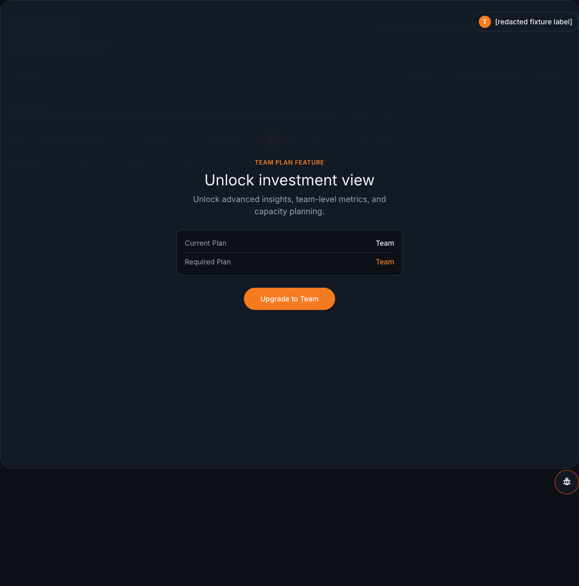

# Investment: follow the evidence

Use the Investment view to ask where effort appears to be going in the selected scope
and period. It describes work mix, not people. Start with the theme distribution, then
open a theme, a subcategory, and the supporting WorkUnits.

This sanitized fixture capture truthfully shows a Team-plan availability gate in the current
test surface; it is not an allocation result. Its [capture metadata](../images/fixture-capture-metadata.json)
records the fixture source, redaction, and rendered fixture state. When Investment is
available for your selected workspace, use the journey below to read its current result.

## 1. Start with the theme mix

The five fixed themes are **Feature Delivery**, **Operational / Support**,
**Maintenance / Tech Debt**, **Quality / Reliability**, and **Risk / Security**. Their
shares are effort-weighted, so they describe the mix of effort rather than a count of
tickets.

Read a result as a distribution: the work **appears** to lean in one or more directions.
For example, a theme share **suggests** that the selected effort **leans** toward
maintenance work. It does not assign a single permanent category to a WorkUnit or a
person.

## 2. Open a theme, then a subcategory

Choose a theme only after checking the selected scope, period, and **evidence quality**.
The next level shows subcategories, which make the mix more specific while preserving the
same effort-weighted interpretation. A low evidence-quality band asks you to be more
cautious, not to invent a missing explanation.

## 3. Inspect the linked work

Open the evidence for a subcategory to inspect its WorkUnits and the linked issues, pull
requests, commits, or incidents. This is where you check the actual work, source dates,
and caveats before choosing a team response.

!!! note "A careful interpretation"
    The Investment view **appears** to summarize a selected body of work. It never ranks
    people, and it never becomes a verdict about the value of that work.

## What the journey does not do

- It does not let a team rename the fixed themes or subcategories.
- It does not make WorkUnits into categories.
- It does not make a low-confidence distribution a conclusion.
- It does not recalculate categories while you read the page.

## Continue

- [Investment taxonomy](../../product/investment-taxonomy.md) is the shared definition of
  the fixed themes and subcategories.
- [How to read Dev Health](../how-to-read-dev-health.md) explains evidence quality and
  calibrated language.
- [Investment Flows](../views/investment-flows.md) helps compare where effort is moving.
