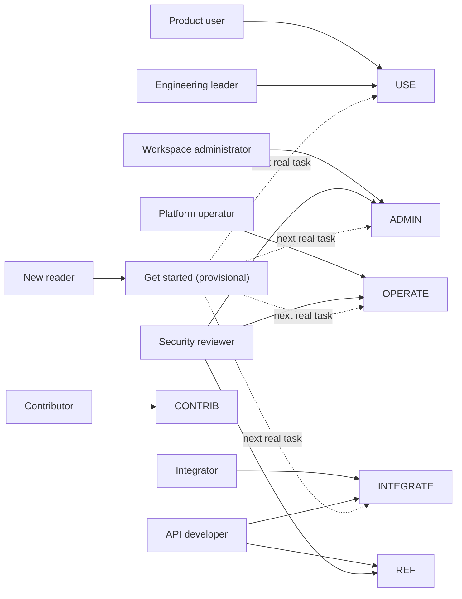
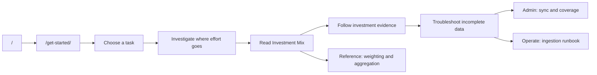
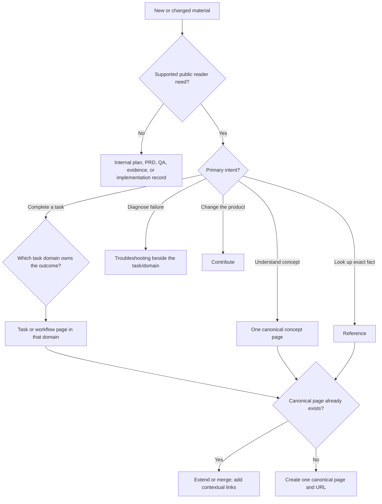
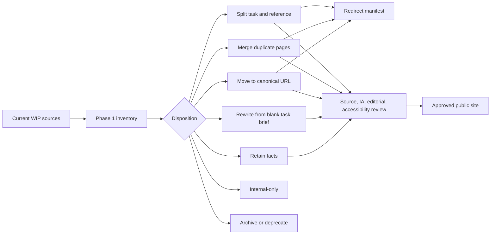
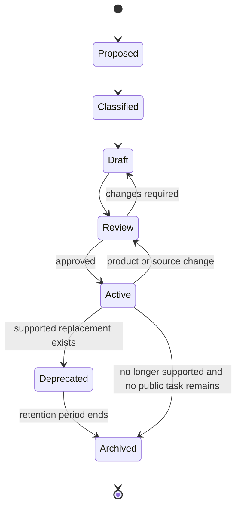
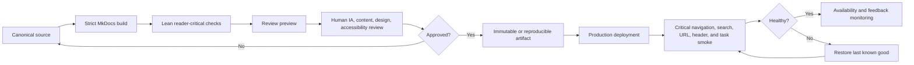
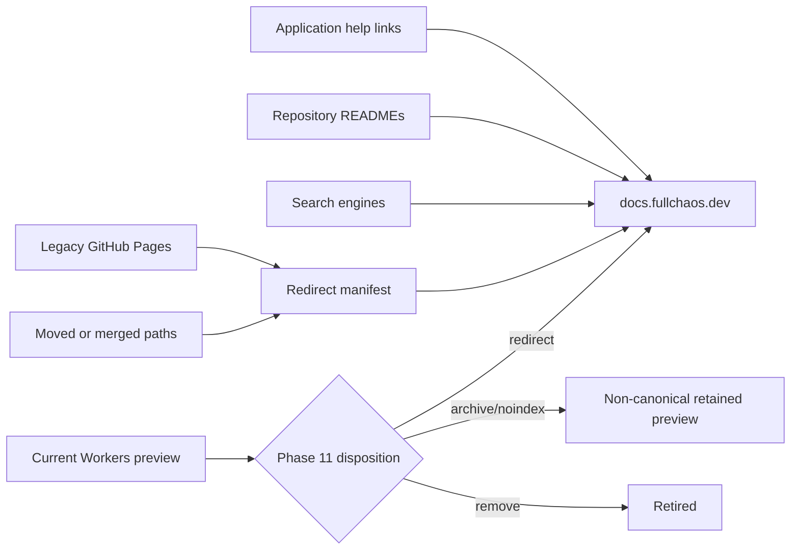
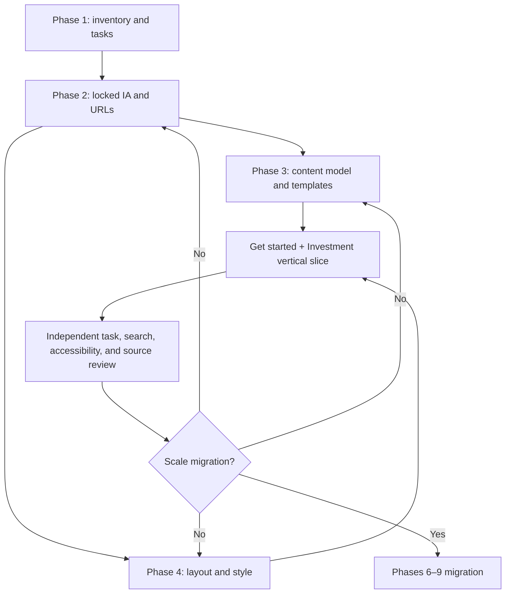

# IA diagrams and migration topology

These diagrams are explanatory views of the TSV files in `.github/documentation-program/ia/`. The TSV manifest is authoritative for node IDs and URLs.

## 1. Public site tree

```mermaid
flowchart TD
  HOME["/ — Documentation home"]
  GS["/get-started/ — provisional"]
  USE["/use/"]
  ADMIN["/admin/"]
  OPERATE["/operate/"]
  INTEGRATE["/integrate/"]
  REF["/reference/"]
  CONTRIB["/contribute/"]

  HOME --> GS
  HOME --> USE
  HOME --> ADMIN
  HOME --> OPERATE
  HOME --> INTEGRATE
  HOME --> REF
  HOME --> CONTRIB

  GS --> GS_TASK["Choose a task"]
  GS --> GS_PRE["Prerequisites"]
  GS --> GS_CON["Minimal concepts"]
  GS --> GS_GLOSS["Glossary"]

  USE --> U_NAV["Navigate and set context"]
  USE --> U_INV["Investment"]
  USE --> U_FLOW["Delivery flow"]
  USE --> U_CODE["Code and relationships"]
  USE --> U_PLAN["Plan and improve"]
  USE --> U_AI["AI workflows"]
  USE --> U_REPORT["Reports"]
  USE --> U_TROUBLE["Troubleshooting"]

  ADMIN --> A_WORK["Workspace"]
  ADMIN --> A_IDENT["Teams and identities"]
  ADMIN --> A_SRC["Data sources"]
  ADMIN --> A_SYNC["Sync and coverage"]
  ADMIN --> A_SEC["Security and audit"]
  ADMIN --> A_TROUBLE["Troubleshooting"]

  OPERATE --> O_PLAN["Plan"]
  OPERATE --> O_INSTALL["Install"]
  OPERATE --> O_CONFIG["Configure"]
  OPERATE --> O_MAINTAIN["Maintain"]
  OPERATE --> O_RUN["Run"]
  OPERATE --> O_OBSERVE["Observe"]
  OPERATE --> O_SECURITY["Security"]
  OPERATE --> O_RUNBOOKS["Runbooks"]

  INTEGRATE --> I_PUSH["Customer Push"]
  INTEGRATE --> I_API["Supported APIs"]
  INTEGRATE --> I_WEBHOOK["Webhooks"]
  INTEGRATE --> I_BUILD["Build an integration"]
  INTEGRATE --> I_TROUBLE["Troubleshooting"]

  REF --> R_API["API"]
  REF --> R_GQL["GraphQL"]
  REF --> R_CLI["CLI"]
  REF --> R_CONFIG["Configuration"]
  REF --> R_SCHEMA["Schemas"]
  REF --> R_MODEL["Data models"]
  REF --> R_METRIC["Metrics"]
  REF --> R_TAX["Taxonomies"]
  REF --> R_LIMIT["Limits and compatibility"]
  REF --> R_DEP["Deprecations"]

  CONTRIB --> C_START["Start"]
  CONTRIB --> C_ARCH["Architecture"]
  CONTRIB --> C_DEV["Develop and test"]
  CONTRIB --> C_REVIEW["Review and release"]
  CONTRIB --> C_DOCS["Documentation"]
```

## 2. Audience to task domain

## 3. Representative first-use and Investment journey

## 4. Content-placement decision tree

## 5. Current-to-target migration

## 6. Page lifecycle and ownership

## 7. Hosting-neutral publication flow

## 8. Canonical URL and redirect topology

## 9. Vertical-slice dependency graph

