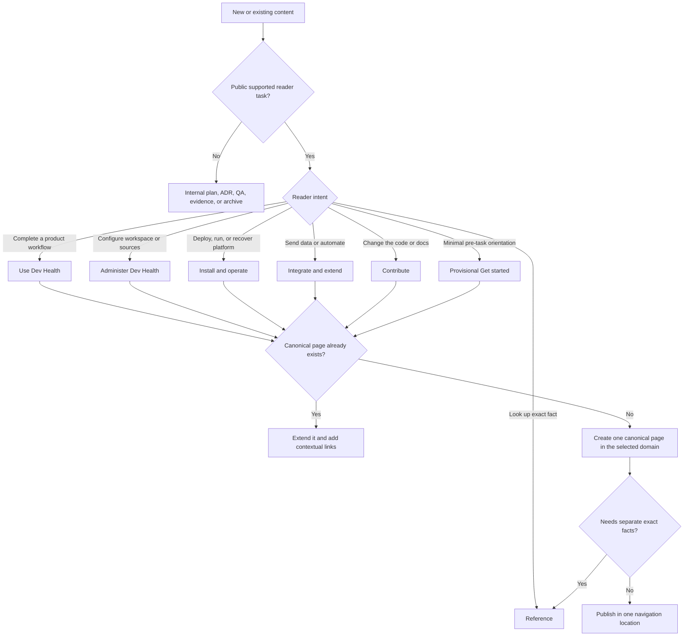

# Target documentation information architecture v2

**Status:** locked for layout, style, content-model, and prototype work  
**Decision date:** 2026-07-18  
**Source of structural truth:** the TSV files in this directory

## Locked amendments

* `/get-started/` remains provisionally so the next layout can be evaluated without another hierarchy reset, but its content is **100% reauthored from blank briefs**. The current “first ten minutes” title, sequence, and prose are not migration inputs.
* `/get-started/` and `/use/` overlap is acknowledged. The representative vertical slice must show that a separate branch improves first-task completion. Otherwise the useful material moves into `/` and `/use/`, and `/get-started/` becomes a concise chooser or redirect.
* Context Fabric is a reserved future customer documentation area. No empty, placeholder, or speculative page enters navigation. When the product surface is ready, use the placement decision tree:
  * `/integrate/context-fabric/` for connecting, supplying, or consuming context;
  * `/use/context-fabric/` for a first-class customer workflow;
  * `/reference/context-fabric/` for exact schemas, contracts, configuration, or limits;
  * no new top-level domain unless validated customer tasks cannot fit the approved domains.
* All other task domains and structural rules are locked. A change requires an explicit IA decision, not an implementation convenience.

## Structural invariants

1. Every public page has one stable ID, one canonical URL, and one canonical navigation location.
2. A page may have many contextual links but may not be copied into several navigation branches.
3. Navigation is organized by durable reader task, not repository, internal team, issue, or simple audience buckets.
4. Primary workflows are reachable without search.
5. Concepts are explained once; exact facts are referenced once; task pages link to both as needed.
6. Public versus internal is explicit. Plans, PRDs, QA specifications, raw evidence, fixtures, and implementation notes are internal by default.
7. Troubleshooting is located with the relevant task or product area, with only a limited symptom index.
8. Public off-navigation pages are named exceptions. Broad catch-all publication rules are prohibited.
9. Prefer three visible navigation levels before a leaf and no more than four path segments after a domain root. Generated reference may request a reviewed exception.
10. URLs and publication flow remain hosting-neutral until the Phase 11 Cloudflare ADR.

## Canonical task domains

| Label | Prefix | Purpose |
| --- | --- | --- |
| Get started | `/get-started/` | Provisional, minimal orientation and task routing; all content is rewritten. |
| Use Dev Health | `/use/` | Product workflows, interpretation, reports, and user-visible recovery. |
| Administer Dev Health | `/admin/` | Workspace, access, providers, sync, coverage, and administrative security. |
| Install and operate | `/operate/` | Deployment, configuration, lifecycle maintenance, observability, and recovery. |
| Integrate and extend | `/integrate/` | Supported ingestion, APIs, webhooks, automation, and integration work. |
| Reference | `/reference/` | Exact API, CLI, configuration, schema, metric, taxonomy, limit, and compatibility facts. |
| Contribute | `/contribute/` | Development setup, architecture, testing, review, release, and documentation contribution. |

The root `/` is the task router. It is not repeated inside `/get-started/`.

## Manifest layout

Each TSV row is one canonical node with:

`id`, `parent_id`, `url`, `label`, `kind`, `nav`, `public_state`, `lifecycle`, `provisional`, and `summary`.

Files are split only for reviewability:

* `home.tsv`
* `get-started.tsv`
* `use.tsv`
* `admin.tsv`
* `operate.tsv`
* `integrate.tsv`
* `reference.tsv`
* `contribute.tsv`

The validator reads all files as one manifest and checks unique IDs and URLs, valid parents, approved domains and types, depth, internal/public contradictions, the provisional Get Started flag, and the prohibition on live Context Fabric or legacy onboarding paths.

## Page-placement decision

## Content dispositions that are already locked

* Current onboarding pages are evidence only; none is retained by title or page boundary.
* Investment accuracy, taxonomy, and anti-drift work remain source evidence, but the public workflow and reference boundaries may change.
* Work Graph has one user workflow page; wrapper/reference stubs are merged or redirected.
* Capacity Planning has one canonical workflow location under Plan and improve.
* Shared metric definitions live in Reference; workflow pages explain interpretation.
* Internal design showcases, implementation plans, browser evidence, and QA fixtures do not enter public navigation.

## Approval and implementation rule

The complete page inventory and disposition work may add, remove, merge, or archive leaf nodes, but it may not invent a different top-level structure or preserve old content by inertia. Layout and style work must consume this IA. Any proposed design that requires renamed domains, duplicate locations, or a marketing-card hierarchy is rejected or must reopen the IA decision explicitly.
