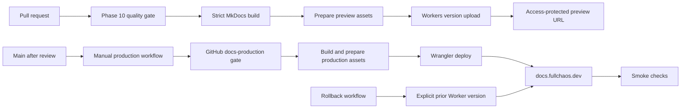

# ADR — Deliver the documentation with Workers Static Assets

- **Status:** Accepted for implementation
- **Date:** 2026-07-19
- **Linear:** CHAOS-3012
- **Production approval:** still controlled by Phases 11 and 12

## Decision

Deploy the documentation as a **Cloudflare Worker with Static Assets**, using the existing `dev-health-docs` Worker identity and no Worker script.

The MkDocs output is static. The initial configuration therefore contains only an `assets.directory`, `404-page` handling, automatic trailing-slash handling, explicit preview URLs, and the production custom domain. Request-time code, an `ASSETS` binding, and `run_worker_first` are prohibited until a documented reader or operational requirement needs them.

Cloudflare Pages will not be created as a second project.

## Why Pages and Workers now look the same

They are part of the same Cloudflare developer platform and share important implementation layers:

- Pages Functions executes on the Workers runtime.
- Static asset requests have the same basic cost model.
- Both products support Git integration, branch or version previews, custom domains, `_headers`, and `_redirects`.
- Both appear under **Workers & Pages** in the Cloudflare dashboard.

They are still separate deployment products and control planes:

| Concern | Pages | Workers Static Assets |
| --- | --- | --- |
| Project identity | Pages project | Worker |
| Primary deployment command | `wrangler pages deploy` | `wrangler deploy` or `wrangler versions upload` |
| Preview model | Pages branch deployments | Worker versions and preview aliases; Workers Builds can add branch previews and PR comments |
| Runtime code | Pages Functions, powered by Workers | Native Worker script when one is needed |
| Version promotion | Pages deployment model | Explicit Worker versions and deployments |
| Rollback | Pages deployment rollback | Promote or roll back a captured Worker version, including its static assets and configuration |
| Current Cloudflare direction | Supported | Recommended for new static and full-stack projects; new platform investment is focused here |

For a new documentation delivery configuration, the remaining Pages-specific conveniences do not justify a second product boundary.

## Requirements and fit

| Requirement | Decision evidence |
| --- | --- |
| Static MkDocs output | Static Assets supports a site without a Worker script. |
| Pull-request previews | `wrangler versions upload --preview-alias ...` creates a stable aliased preview and a version-specific URL. |
| Search-engine exclusion for previews | The preview build receives `robots.txt` and `X-Robots-Tag: noindex, nofollow`. |
| Restricted previews | Preview URLs must be protected with Cloudflare Access before repository preview uploads are enabled. |
| Canonical domain | Production deploy attaches `docs.fullchaos.dev` as a Worker custom domain. |
| 135 legacy redirects | Workers Static Assets reads `_redirects`; the current set is below the supported rule limit. |
| Response headers | Workers Static Assets reads `_headers`; production and preview builds use different generated policies. |
| Safe promotion | Pull requests upload a version but do not deploy it to production. |
| Rollback | The production workflow can invoke `wrangler rollback` for an explicit version ID. |
| No new framework | The pipeline builds MkDocs, prepares static files, and invokes pinned Wrangler. No application Worker is introduced. |

## Deployment model

## Security and trust boundaries

- Fork pull requests never receive Cloudflare credentials.
- Same-repository preview uploads remain disabled until `DOCS_CLOUDFLARE_PREVIEWS_ENABLED=true` is set after Access is configured.
- Production deploy remains disabled until `DOCS_CLOUDFLARE_PRODUCTION_ENABLED=true` is set and the `docs-production` environment has an approval policy.
- The Cloudflare API token must be scoped only to the account, Worker, and zone operations required by this deployment.
- Preview output is `noindex` even when Access is misconfigured; `noindex` is defense in depth, not access control.
- Production does not add a speculative Content Security Policy. A tested policy may be added later after verifying MkDocs Material scripts and search behavior.

## URL and redirect behavior

- `docs.fullchaos.dev` is the sole canonical production host.
- The generated `_redirects` file contains the Phase 9 path migrations as permanent `301` redirects.
- Cloudflare Static Assets redirects are path rules, not host-level redirect rules. Retirement of the old `dev-health-docs.fullchaos.workers.dev` host is therefore a separate cutover action: disable the old workers.dev route or retain a minimal host-redirect Worker only if an observed inbound-link requirement justifies it.
- Automatic trailing slashes match the MkDocs directory/index output and the approved canonical URL model.

## Rollback

A Worker version captures the static assets and Worker configuration used for that release. Production rollback uses an explicit version ID and creates a new deployment at 100% traffic. Storage rollback is irrelevant because this documentation Worker has no KV, D1, R2, Durable Object, queue, or other stateful binding.

The deploy workflow records Wrangler structured output and the source commit. Before any production deploy, the current version ID must be retained as the rollback target and the rollback command must be rehearsed against a non-production version.

## Consequences

### Positive

- One Cloudflare project rather than parallel Pages and Workers projects.
- Current Cloudflare-recommended static delivery path.
- Static-only operation with no request-time compute dependency.
- First-class version previews, explicit promotion, and rollback.
- Native support for the redirect and header files already required by the documentation migration.

### Trade-offs

- Preview URLs use `workers.dev`, not the production custom domain.
- Preview URL logs are limited; build output and synthetic smoke checks are the primary preview evidence.
- Access configuration and GitHub environment protection are account-level setup and cannot be proven by repository code alone.
- Workers and Pages remain operationally distinct enough that Pages documentation must not be used as the implementation contract for this Worker.

## Revisit this decision when

- a requirement can only be met by a Pages-specific deployment capability;
- request-time behavior is proposed, in which case the no-script rule must be reconsidered explicitly;
- the documentation becomes a multi-tenant publishing platform rather than one static site; or
- Cloudflare materially changes the supported product direction.
