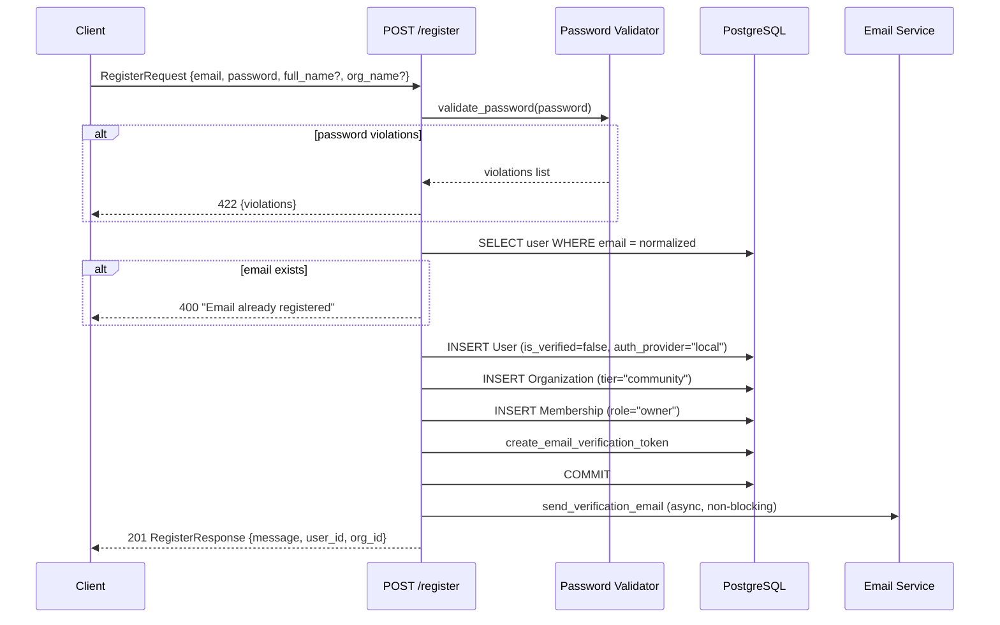
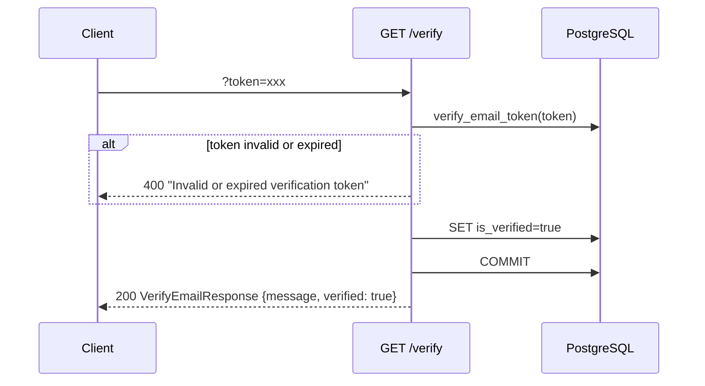
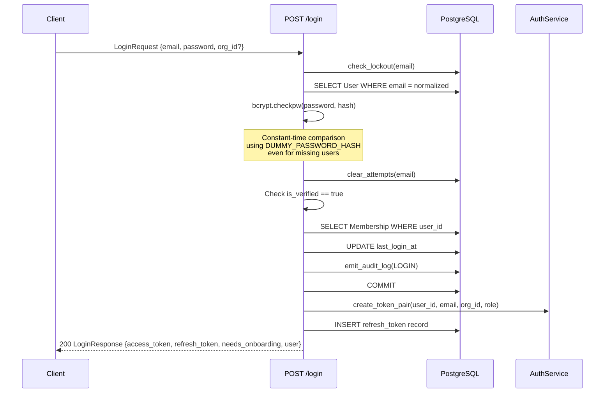
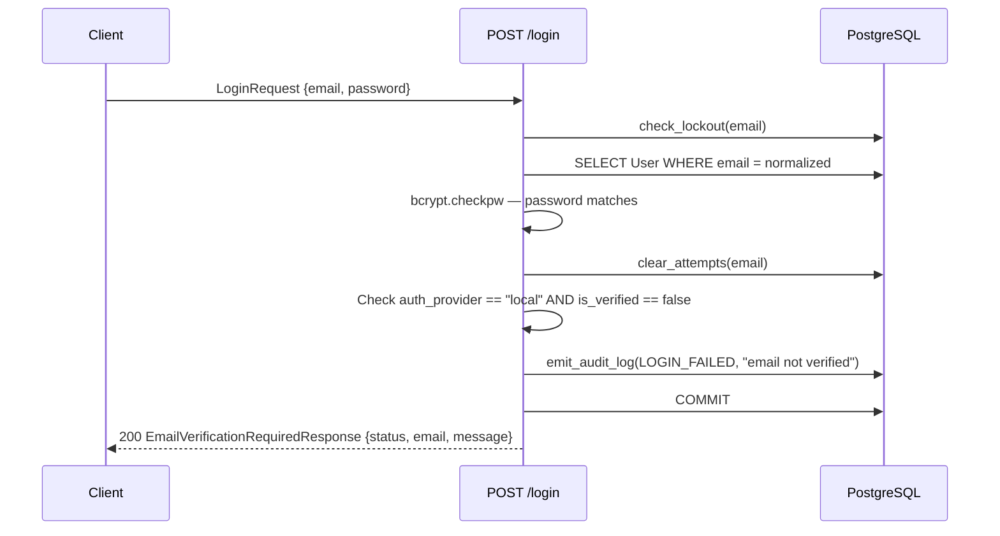
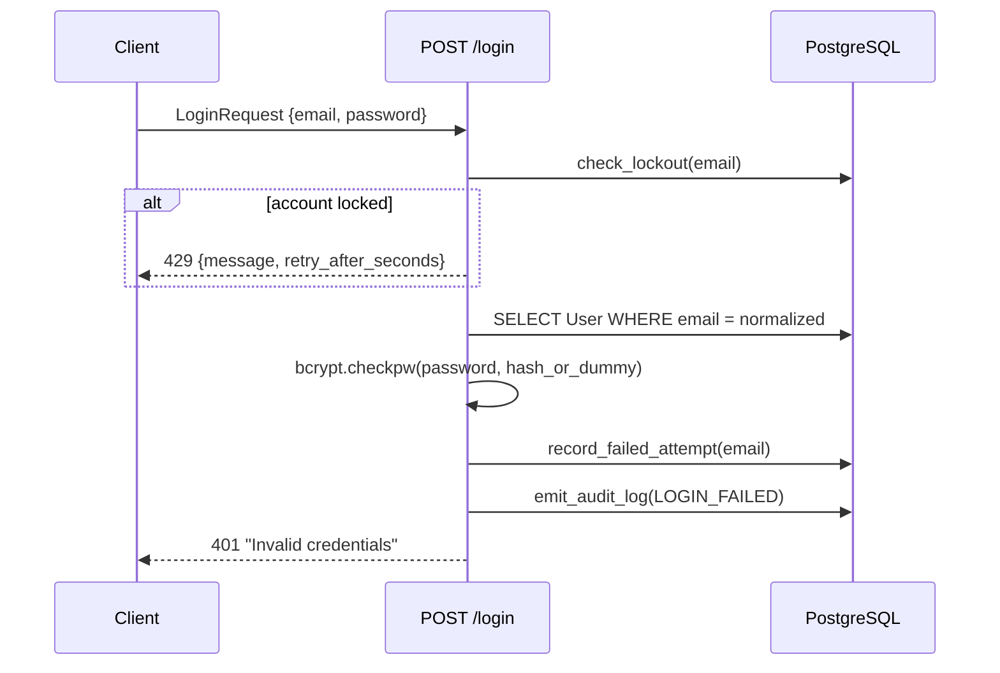
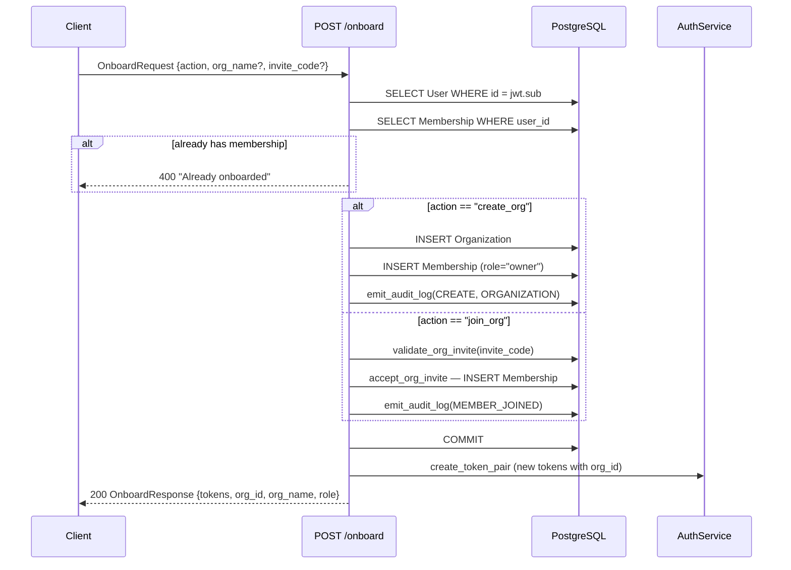
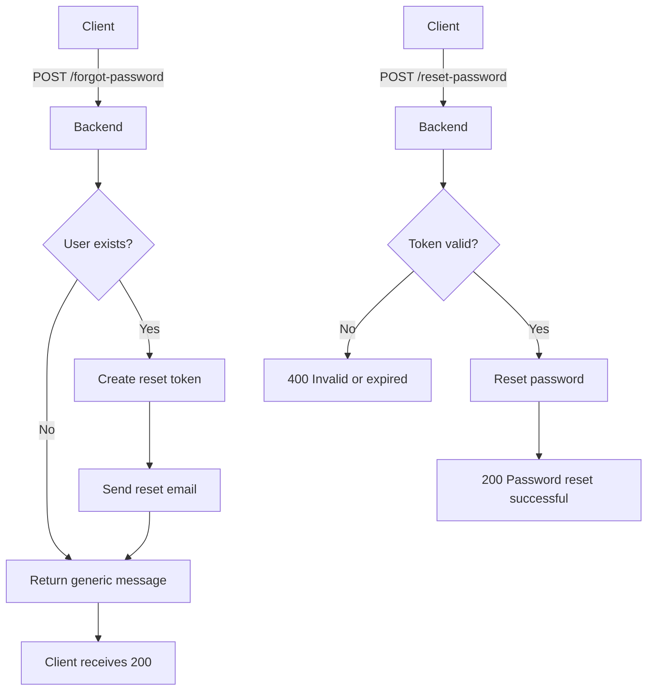
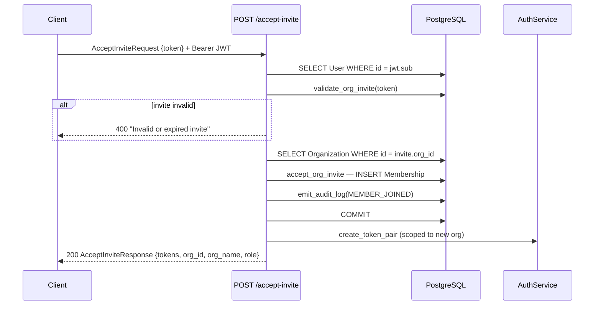
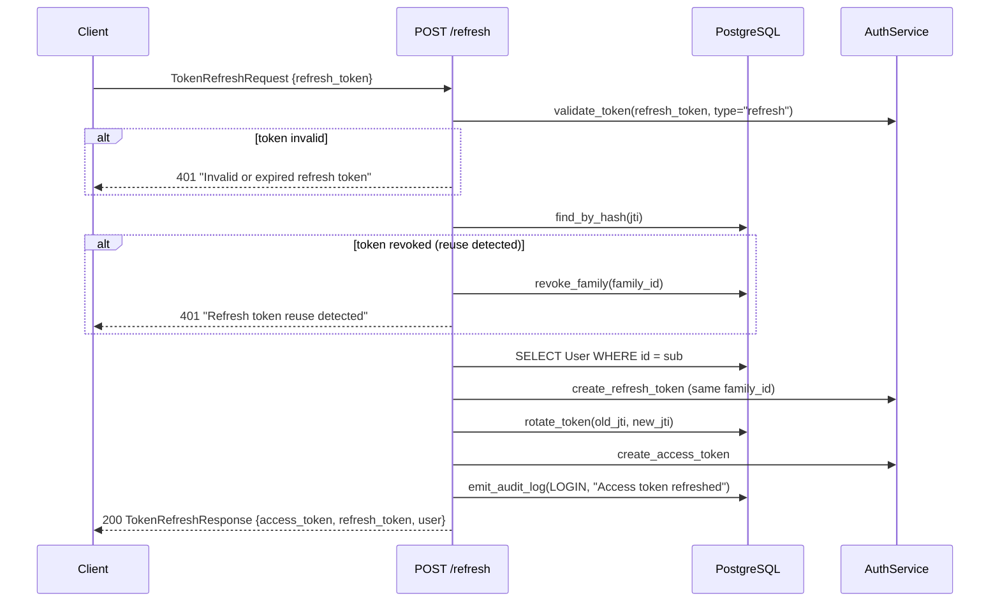
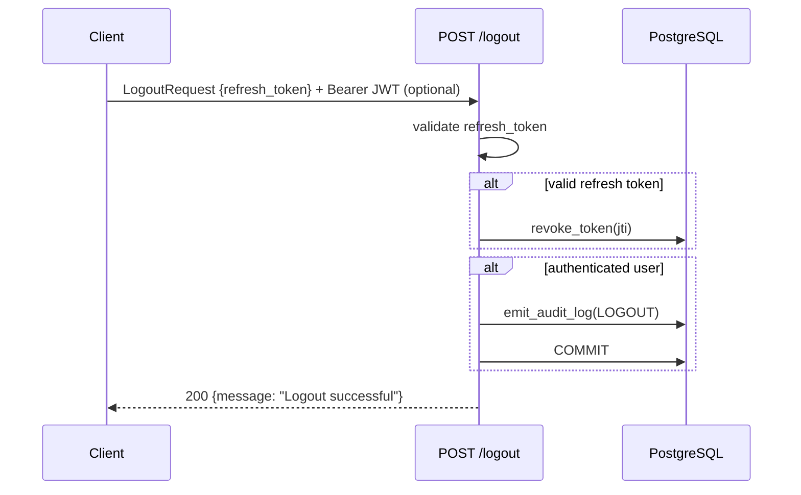

# Auth User Journeys

Backend authentication and authorization flows for the Dev Health platform. Each journey documents the API endpoint behavior, database operations, and response shapes.

All auth endpoints live under `/api/v1/auth/` in `src/dev_health_ops/api/auth/router.py`.

## Journey 1: Registration

A new user registers with email and password. The backend creates the user, an organization, and a membership in a single transaction, then sends a verification email asynchronously.

**Rate limit:** `AUTH_REGISTER_LIMIT` (3/hour per IP).

**Key detail:** Registration auto-creates org + membership, so newly registered users do NOT need onboarding (`needs_onboarding=false` on login).

## Journey 2: Email Verification

User clicks the verification link from their email. The backend validates the token and marks the user as verified.

**Rate limit:** 10/hour per IP.

**Resend flow:** `POST /resend-verification` accepts `{email}`, creates a new token, and resends. Returns a generic message regardless of whether the account exists (prevents enumeration). Rate limited to 3/hour.

## Journey 3: Login (Happy Path — Verified User)

User submits credentials. Backend validates password, checks verification status, resolves membership, and returns tokens.

**Rate limits:**
- `AUTH_LOGIN_IP_LIMIT` per IP
- `AUTH_LOGIN_LIMIT` per auth key

**`needs_onboarding`:** `true` only when user has no memberships and is not superuser. Since registration auto-creates a membership, this is typically `false` for self-registered users.

## Journey 4: Login (Unverified Email)

User has valid credentials but has not verified their email address.

**Important:** This returns HTTP 200 (not 401) with `status: "email_verification_required"`. The frontend detects this response shape and shows an amber verification banner instead of an error toast.

## Journey 5: Login (Invalid Credentials)

Password does not match, user does not exist, or account is disabled.

**Failure reasons (all return 401 with same message):**
- User not found
- Account disabled (`is_active=false`)
- No password hash (OAuth-only account)
- Password mismatch

**Account lockout:** After repeated failures, `check_lockout` returns `true` and the endpoint returns 429 with `retry_after_seconds`.

## Journey 6: Onboarding

For users who authenticated but have no organization membership (e.g., invited users who haven't accepted yet). Supports two actions: `create_org` or `join_org`.

**Requires authentication:** JWT bearer token in `Authorization` header.

## Journey 7: Password Reset

Two-step flow: request reset email, then submit new password with token.

**Anti-enumeration:** `POST /forgot-password` always returns the same generic message regardless of whether the account exists.

**Rate limit:** 3/hour for forgot-password.

## Journey 8: Invite Accept

Authenticated user accepts an organization invite. Creates membership and returns new tokens scoped to the organization.

**Requires authentication:** JWT bearer token in `Authorization` header.

## Journey 9: Token Refresh

Client exchanges a refresh token for a new access token. Implements token rotation with reuse detection.

**Security:** Refresh tokens are single-use. If a revoked token is reused, the entire token family is revoked (reuse detection).

**Rate limit:** `AUTH_REFRESH_LIMIT`.

## Journey 10: Logout

Client submits refresh token for revocation.

**Note:** The bearer JWT is optional — logout still revokes the refresh token even without it.

## Endpoint Reference

| Endpoint | Method | Auth | Rate Limit | Response |
|----------|--------|------|------------|----------|
| `/register` | POST | None | 3/hour | `RegisterResponse` (201) |
| `/verify` | GET | None | 10/hour | `VerifyEmailResponse` |
| `/resend-verification` | POST | None | 3/hour | `VerifyEmailResponse` |
| `/login` | POST | None | Per IP + key | `LoginResponse` or `EmailVerificationRequiredResponse` |
| `/forgot-password` | POST | None | 3/hour | `VerifyEmailResponse` |
| `/reset-password` | POST | None | None | `VerifyEmailResponse` |
| `/onboard` | POST | Bearer | None | `OnboardResponse` |
| `/accept-invite` | POST | Bearer | None | `AcceptInviteResponse` |
| `/refresh` | POST | None | Per limit | `TokenRefreshResponse` |
| `/validate` | POST | None | Per limit | `TokenValidateResponse` |
| `/me` | GET | Bearer | None | `MeResponse` |
| `/logout` | POST | Optional | None | `{message}` |

## Security Notes

- **Constant-time password comparison:** Even for nonexistent users, bcrypt compares against `DUMMY_PASSWORD_HASH` to prevent timing attacks.
- **Account lockout:** Failed login attempts are tracked per email. After threshold, returns 429 with retry delay.
- **Token rotation:** Refresh tokens are single-use with family-based reuse detection.
- **Anti-enumeration:** Forgot-password and resend-verification return generic messages regardless of account existence.
- **Audit logging:** All auth events (login, logout, registration, failures) are recorded with IP and user-agent.
