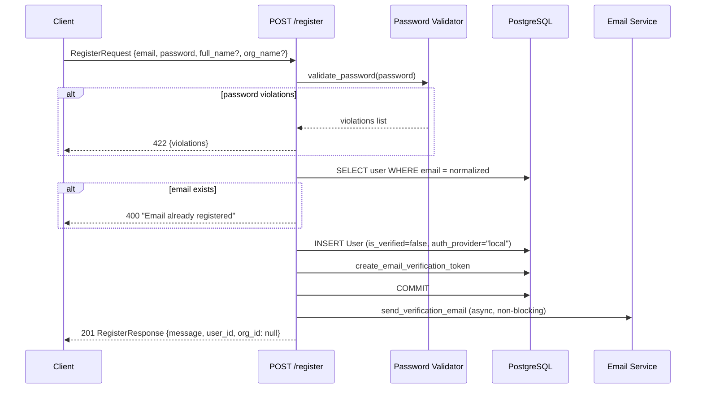
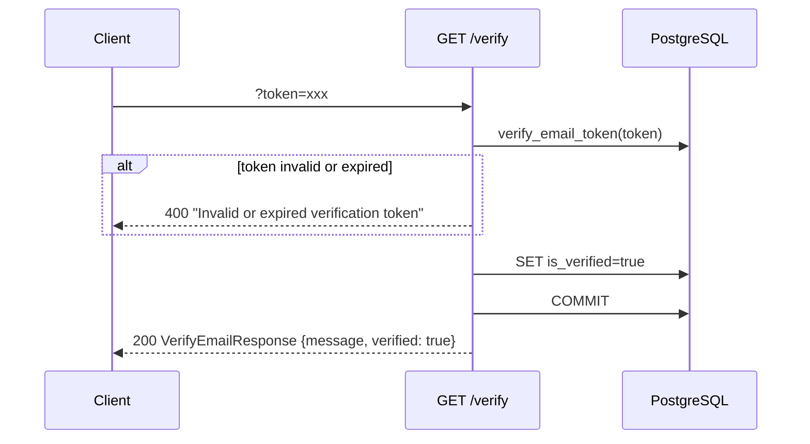
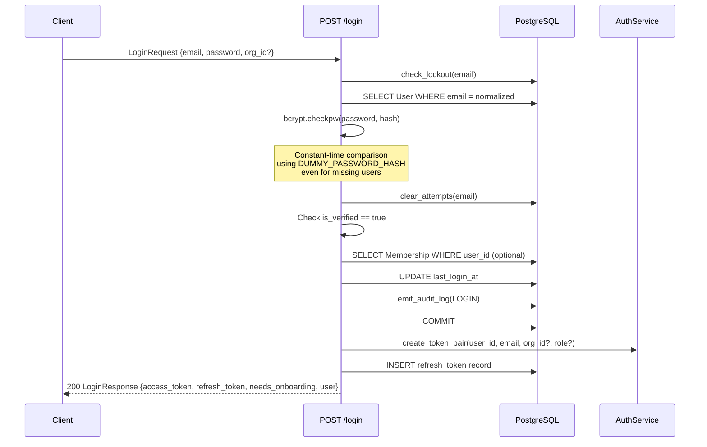
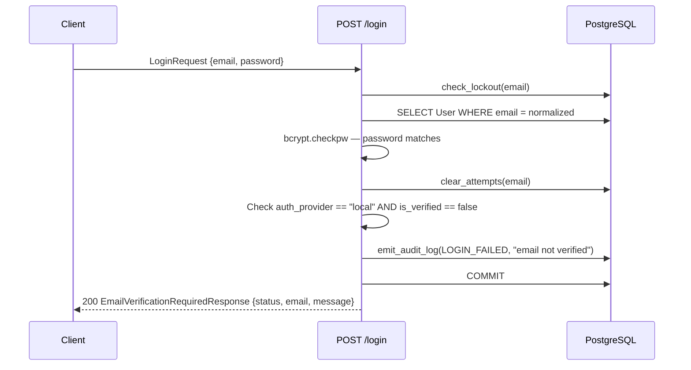
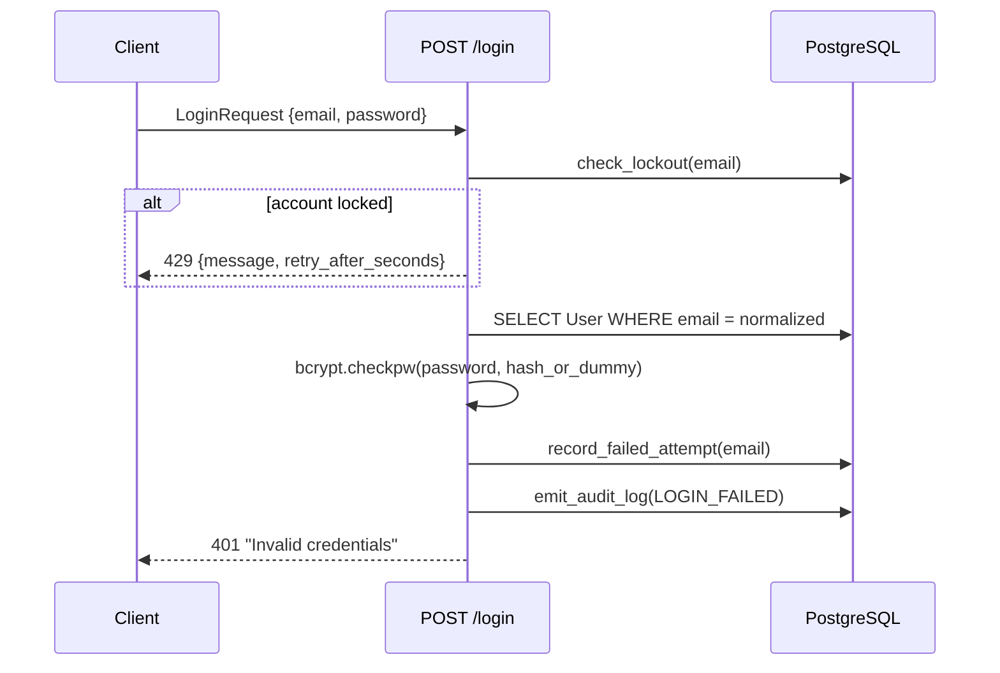
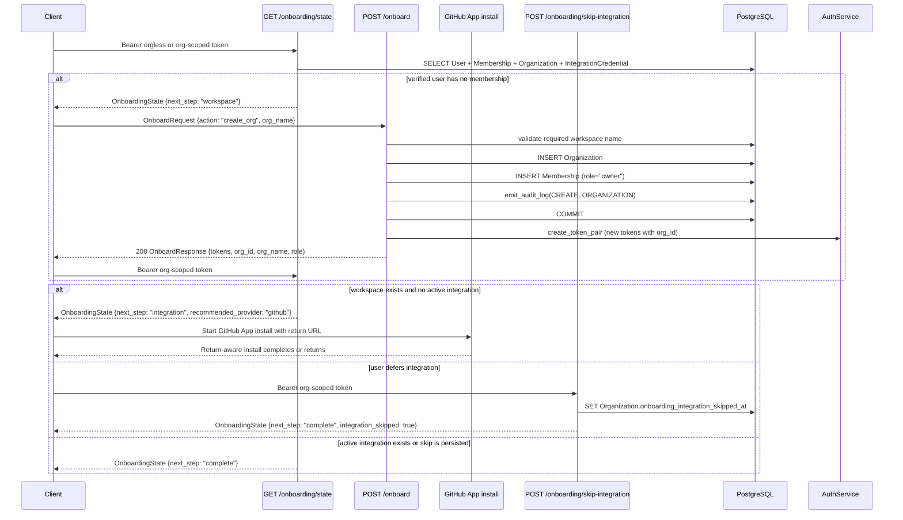
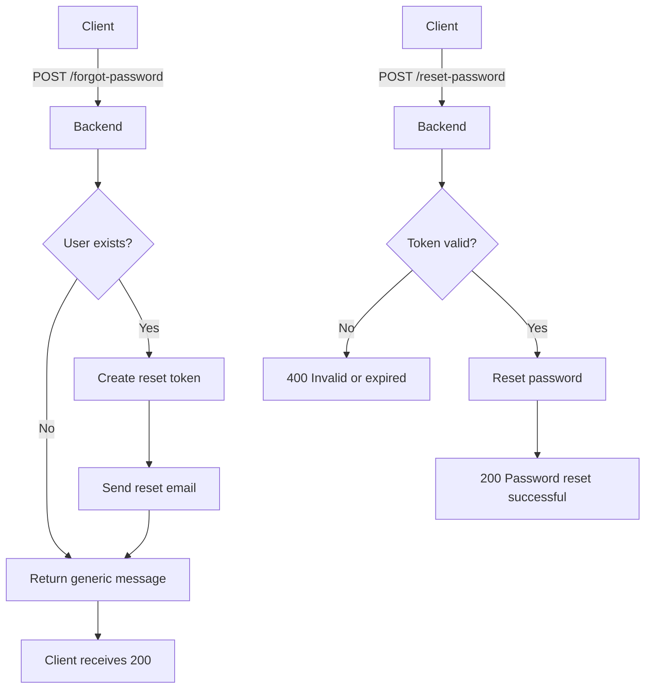
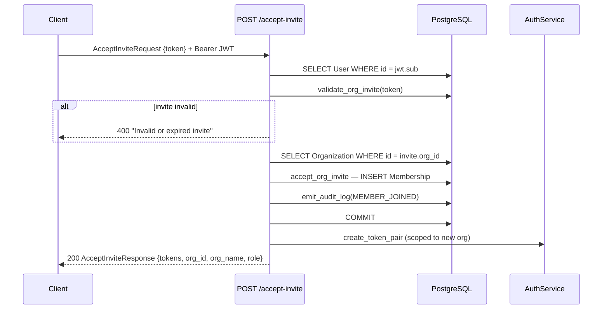
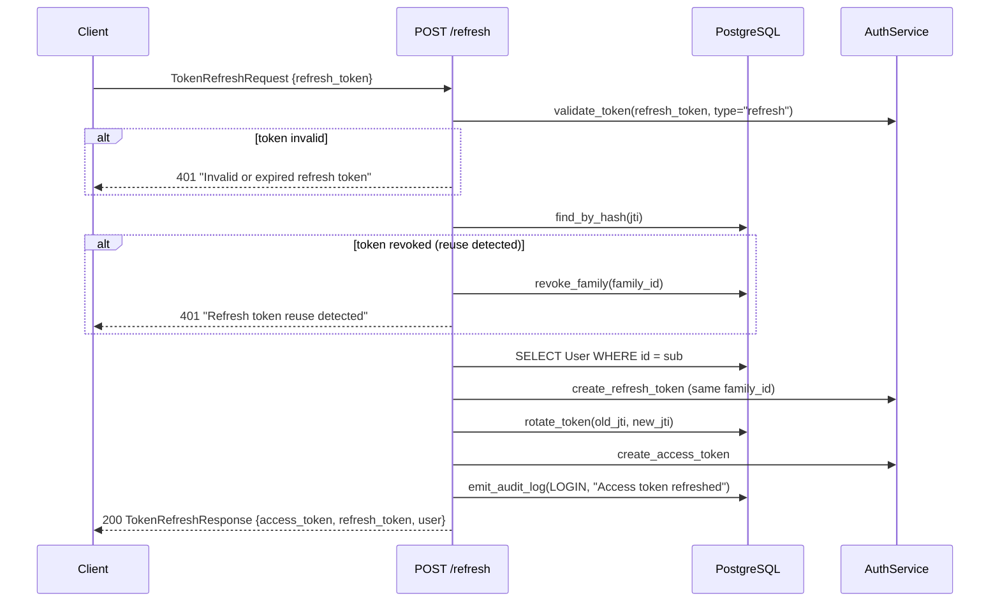
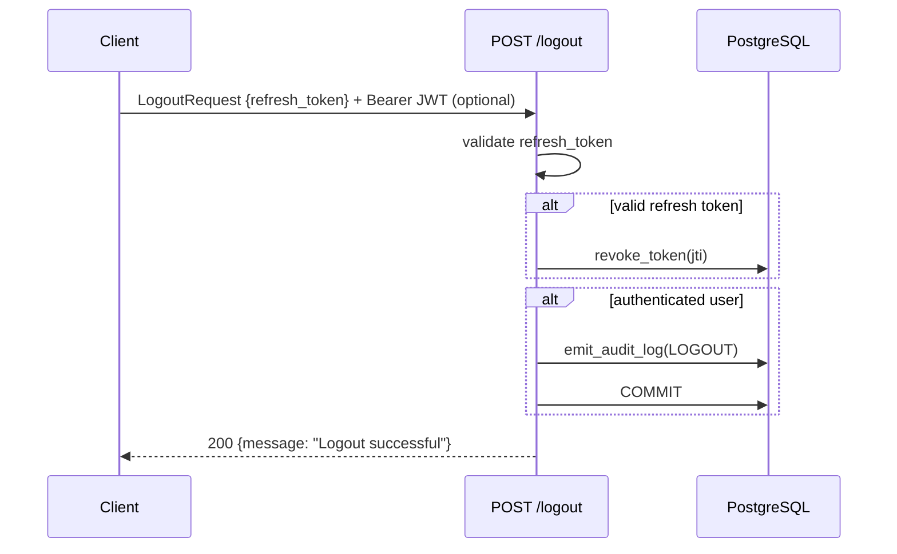

# Auth User Journeys

Backend authentication and authorization flows for the Dev Health platform. Each journey documents the API endpoint behavior, database operations, and response shapes.

All auth endpoints live under `/api/v1/auth/` in `src/dev_health_ops/api/auth/router.py`.

Source-of-truth tests for the first-run path: `tests/test_onboarding.py`, `tests/api/auth/test_register.py`, `tests/api/auth/test_onboarding_state.py`, `tests/api/auth/test_onboarding_skip.py`, `tests/api/test_new_user_journey.py`, and `tests/api/admin/test_setup_status.py`.

## Journey 1: Registration

A new user registers with email and password. In the first-run onboarding model, identity creation is separate from workspace creation. By default for Phase 2, registration creates only the user identity and email-verification token, then sends a verification email asynchronously. Organization/workspace creation happens later through the explicit onboarding workspace step.

**Rate limit:** `AUTH_REGISTER_LIMIT` (3/hour per IP).

**Key detail:** Registration creates the identity only when `AUTH_AUTO_CREATE_ORG_ON_REGISTER=false`. Newly registered and verified users authenticate with orgless tokens and route to the workspace step. The temporary compatibility flag `AUTH_AUTO_CREATE_ORG_ON_REGISTER=true` preserves the legacy behavior that creates a community org + owner membership during registration; tests pin both modes in `tests/api/auth/test_register.py` and `tests/api/auth/test_onboarding_foundation.py`.

## Journey 2: Email Verification

User clicks the verification link from their email. The backend validates the token and marks the user as verified.

**Rate limit:** 10/hour per IP.

**Resend flow:** `POST /resend-verification` accepts `{email}`, creates a new token, and resends. Returns a generic message regardless of whether the account exists (prevents enumeration). Rate limited to 3/hour.

## Journey 3: Login (Happy Path — Verified User)

User submits credentials. Backend validates password, checks verification status, resolves membership when present, and returns tokens. Verified orgless users are valid authenticated users; their token carries no org claim until they complete workspace creation or invite acceptance.

**Rate limits:**
- `AUTH_LOGIN_IP_LIMIT` per IP
- `AUTH_LOGIN_LIMIT` per auth key

**`needs_onboarding`:** `true` when a verified non-superuser has no membership. The client must call `GET /api/v1/auth/onboarding/state` for the canonical next step instead of inferring state from login alone.

## Journey 4: Login (Unverified Email)

User has valid credentials but has not verified their email address.

**Important:** This returns HTTP 200 (not 401) with `status: "email_verification_required"`. The frontend detects this response shape and shows an amber verification banner instead of an error toast.

## Journey 5: Login (Invalid Credentials)

Password does not match, user does not exist, or account is disabled.

**Failure reasons (all return 401 with same message):**
- User not found
- Account disabled (`is_active=false`)
- No password hash (OAuth-only account)
- Password mismatch

**Account lockout:** After repeated failures, `check_lockout` returns `true` and the endpoint returns 429 with `retry_after_seconds`.

## Journey 6: Onboarding

First-run onboarding is a server-routed sequence after identity verification. It separates workspace creation from integration setup and persists an explicit skip for users who choose to defer the first integration.

**Route sequence:**

1. `POST /register` creates identity. With `AUTH_AUTO_CREATE_ORG_ON_REGISTER=false`, `org_id` is `null`.
2. `GET /verify` marks the identity verified.
3. `POST /login` returns orgless tokens for verified users without memberships.
4. `GET /onboarding/state` returns `next_step="workspace"` for verified orgless non-superusers.
5. `POST /onboard` with `action="create_org"` requires `org_name`, creates the workspace organization and owner membership, and returns org-scoped tokens. `join_org` remains the invite path.
6. `GET /onboarding/state` returns `next_step="integration"` until the org has an active integration credential or a persisted skip.
7. The primary first integration is GitHub App installation. Return-aware install handling sends users back to the onboarding flow after installation.
8. `POST /onboarding/skip-integration` records `Organization.onboarding_integration_skipped_at` and returns a state with `next_step="complete"` and `integration_skipped=true` unless an integration is already connected.
9. `GET /api/v1/admin/setup/status` powers admin setup gating after onboarding by distinguishing missing integration, missing sync config, failed sync, running sync, and ready states.

**Completion:** Non-admin users complete onboarding when a first integration is connected or the integration step is skipped. Superusers/admins route to `dashboard` in onboarding state and do not block on first-run setup.

**Requires authentication:** JWT bearer token in `Authorization` header. `GET /onboarding/state` accepts verified orgless tokens; `POST /onboarding/skip-integration` requires an org-scoped token and membership.

**Migration behavior:** Alembic `0026_add_org_onboarding_integration_skipped_at.py` adds `organizations.onboarding_integration_skipped_at` for the C6 skip contract. Alembic `0027_make_refresh_tokens_org_id_nullable.py` allows refresh-token records without `org_id` so orgless verified identities can maintain sessions before workspace creation.

## Journey 7: Password Reset

Two-step flow: request reset email, then submit new password with token.

**Anti-enumeration:** `POST /forgot-password` always returns the same generic message regardless of whether the account exists.

**Rate limit:** 3/hour for forgot-password.

## Journey 8: Invite Accept

Authenticated user accepts an organization invite. Creates membership and returns new tokens scoped to the organization.

**Requires authentication:** JWT bearer token in `Authorization` header.

## Journey 9: Token Refresh

Client exchanges a refresh token for a new access token. Implements token rotation with reuse detection.

**Security:** Refresh tokens are single-use. If a revoked token is reused, the entire token family is revoked (reuse detection).

**Rate limit:** `AUTH_REFRESH_LIMIT`.

## Journey 10: Logout

Client submits refresh token for revocation.

**Note:** The bearer JWT is optional — logout still revokes the refresh token even without it.

## Endpoint Reference

| Endpoint | Method | Auth | Rate Limit | Response |
|----------|--------|------|------------|----------|
| `/register` | POST | None | 3/hour | `RegisterResponse` (201) |
| `/verify` | GET | None | 10/hour | `VerifyEmailResponse` |
| `/resend-verification` | POST | None | 3/hour | `VerifyEmailResponse` |
| `/login` | POST | None | Per IP + key | `LoginResponse` or `EmailVerificationRequiredResponse` |
| `/forgot-password` | POST | None | 3/hour | `VerifyEmailResponse` |
| `/reset-password` | POST | None | None | `VerifyEmailResponse` |
| `/onboard` | POST | Bearer | None | `OnboardResponse` |
| `/onboarding/state` | GET | Bearer | None | `OnboardingStateResponse` |
| `/onboarding/skip-integration` | POST | Bearer | None | `OnboardingStateResponse` |
| `/accept-invite` | POST | Bearer | None | `AcceptInviteResponse` |
| `/refresh` | POST | None | Per limit | `TokenRefreshResponse` |
| `/validate` | POST | None | Per limit | `TokenValidateResponse` |
| `/me` | GET | Bearer | None | `MeResponse` |
| `/logout` | POST | Optional | None | `{message}` |
| `/api/v1/admin/setup/status` | GET | Org-scoped admin bearer | None | `SetupStatusResponse` |

## Security Notes

- **Constant-time password comparison:** Even for nonexistent users, bcrypt compares against `DUMMY_PASSWORD_HASH` to prevent timing attacks.
- **Account lockout:** Failed login attempts are tracked per email. After threshold, returns 429 with retry delay.
- **Token rotation:** Refresh tokens are single-use with family-based reuse detection.
- **Anti-enumeration:** Forgot-password and resend-verification return generic messages regardless of account existence.
- **Audit logging:** All auth events (login, logout, registration, failures) are recorded with IP and user-agent.
- **Onboarding routing:** `GET /onboarding/state` is the single backend source of truth for workspace/integration/complete/dashboard routing.
