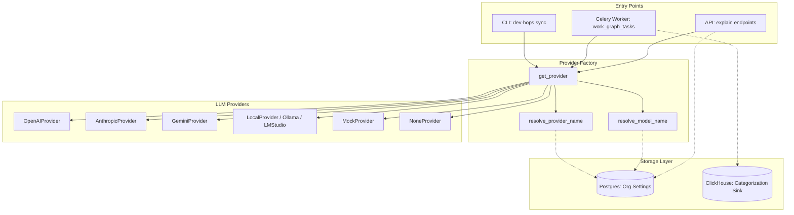

# BYO-LLM Architecture

This page describes the architecture of the Bring Your Own LLM (BYO-LLM) system in the Dev Health platform.

## Component Overview

The BYO-LLM system integrates multiple entry points, a provider factory, and dual database storage.

## Core Components

### 1. Entry Points
- **CLI**: Operators run commands like `dev-hops sync` to trigger manual synchronization.
- **Celery Worker**: Background tasks run partitioned materialization jobs.
- **API**: Endpoints like `/api/v1/work-units/{work_unit_id}/explain` generate explanations on demand.

### 2. Provider Factory
The `get_provider` function acts as a central factory. It resolves the provider name and model, retrieves credentials, and instantiates the correct provider class.
- **resolve_provider_name**: Determines which provider to use. It checks the requested name, the `LLM_PROVIDER` environment variable, and organization settings.
- **resolve_model_name**: Resolves the model name. It checks the requested model, environment variables, organization settings, and provider defaults.

### 3. LLM Providers
The platform supports multiple provider implementations:
- **OpenAIProvider**: Connects to OpenAI APIs.
- **AnthropicProvider**: Connects to Anthropic APIs.
- **GeminiProvider**: Connects to Google Gemini APIs.
- **LocalProvider / Ollama / LMStudio**: Connects to local or custom OpenAI-compatible endpoints.
- **MockProvider**: Returns deterministic mock responses for testing.
- **NoneProvider**: Represents an unconfigured state and fails closed for materialization.

### 4. Storage Layer
- **Postgres**: Stores organization-scoped settings. The `SettingsService` encrypts sensitive values like API keys before saving them.
- **ClickHouse**: Stores computed investment distributions and evidence quotes. The materializer writes directly to ClickHouse sinks.
