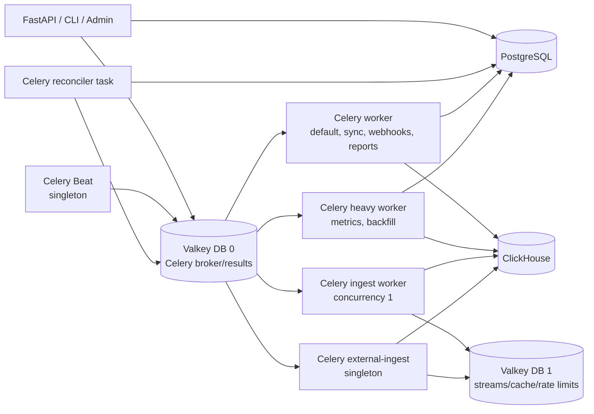
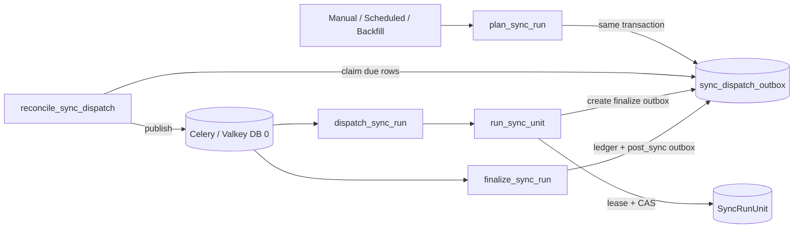
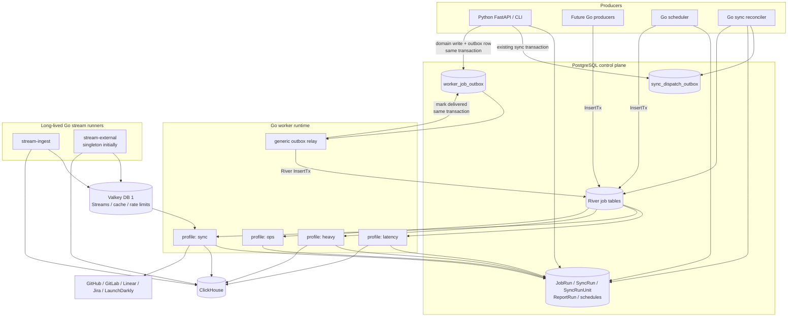
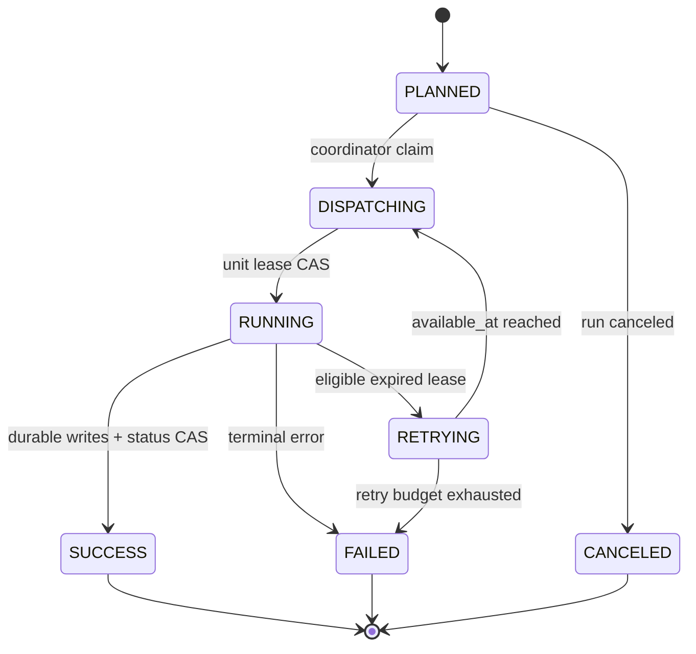
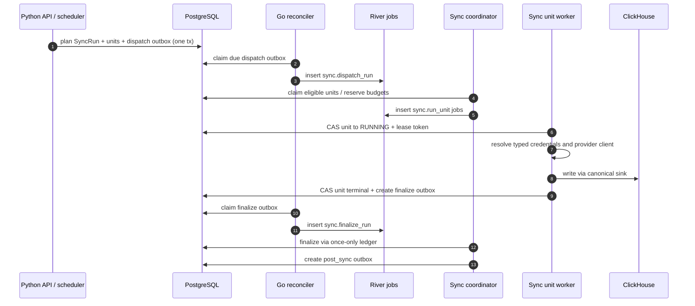
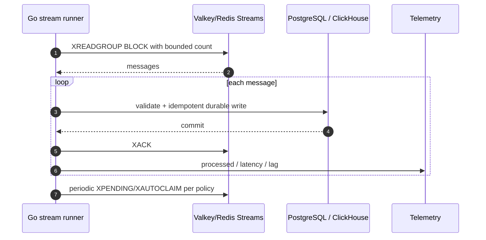

# Technical Requirements and Design: Go Worker Runtime

**Status:** Proposed  
**Decision owner:** Dev Health Ops architecture  
**Linear:** CHAOS-3033 / Go Worker Runtime Migration  
**Last updated:** 2026-07-20  
**Product requirements:** [Go Worker Migration PRD](../product/go-worker-migration-prd.md)  
**Delivery plan:** Repository-only [Go Worker Migration Implementation Plan](https://github.com/full-chaos/dev-health-ops/blob/main/docs/plans/go-worker-migration-implementation-plan.md)  
**Phase 0 decision:** [CHAOS-3034 River compatibility ADR](../decisions/chaos-3034-river-compatibility.md)

## 1. Decision summary

Adopt a hybrid Go execution platform:

1. **Adopt River OSS 0.40.0 backed by the existing PostgreSQL database** for
   bounded jobs, with mandatory direct PostgreSQL queue control. A session-mode
   endpoint may replace it only after passing the same compatibility matrix.
   Transaction-mode PgBouncer `PollOnly` is not an acceptable sole production
   path because it failed running-job cancellation propagation.
2. **Dedicated Go stream runners over the existing Valkey/Redis Streams** for internal ingest, product telemetry, and external ingest.
3. **A Go scheduler and reconciler** for periodic evaluation and database-backed repair.
4. **The existing `SyncRun`, `SyncRunUnit`, claim/lease, concurrency-budget, and dispatch-outbox model remains authoritative.**
5. **The public `dev-health-ops` repository implements its own publicly owned Go platform layer.** `dev-health-acr` is a reference implementation; it is not a direct module dependency unless a separate licensing and repository-boundary decision explicitly permits it.
6. **Temporal, NATS JetStream, and Asynq are not introduced in phase 1.**
7. **Valkey database 0 is removed only after Celery is fully decommissioned.** Valkey database 1 remains for cache, provider rate-limit state, and streams.

River is selected because the bounded-job system already depends on PostgreSQL as the durable source of truth and because transactional enqueue removes a distributed commit boundary between application state and an external broker. River also provides typed Go workers, multiple queues, delayed jobs, retries, uniqueness, periodic jobs, and job telemetry without adding a new service. The [Phase 0 evidence](evidence/go-worker-migration/v1-river-spike/README.md) makes direct PostgreSQL connectivity, or a session-mode endpoint with equivalent evidence, a hard boundary of that decision.

The design deliberately does not delegate domain correctness to River. River owns job availability and attempt execution. Domain tables own product state and idempotency.

## 2. Architectural context

### 2.1 Current execution model

The current topology separates Celery pools to contain starvation:



The sync path already uses a database workflow around the broker:



This means the queue is not the workflow system of record. It is a delivery transport around PostgreSQL state and repair loops.

### 2.2 Design constraints

- `dev-health-ops` is public; `dev-health-acr` is private and currently grants no public source license.
- PostgreSQL is the semantic and control-plane store.
- ClickHouse is the analytics and attribution store.
- Provider modules own fetch/auth/pagination/retry interpretation/normalization.
- Sinks remain the only persistence path for provider data.
- ClickHouse team and identity attribution remains authoritative.
- Current production traffic uses PgBouncer in transaction mode.
- Long-running units can approach one hour and must remain deploy-safe.
- Provider limits are fleet-wide and organization-scoped.
- External ingest is intentionally singleton until pending-entry reclaim semantics are redesigned.
- `post_sync` is intentionally at-most-once until CHAOS-2596 makes downstream reads/writes replay-safe.

## 3. Alternatives considered

| Option | Bounded-job fit | Workflow fit | Infra change | Python transition | Key concern | Decision |
|---|---:|---:|---:|---:|---|---|
| Keep Celery and add Go services around it | Medium | Low | Low | High | Retains broker/result split, decorators, Beat, and two runtimes indefinitely | Reject as target |
| Asynq on Valkey/Redis | High | Low | Low | Medium | Recreates the external broker model; current major version remains `v0` and API may change before `v1` | Reject |
| River OSS on PostgreSQL | High | Medium | Low | High | Adds queue load to PostgreSQL and requires pooler/notification design | **Select** |
| Temporal | Medium | Very high | High | Medium | Adds a Temporal service/cloud and duplicates the existing sync state machine | Defer |
| NATS JetStream | High | Low | High | Medium | Adds a broker while scheduler, domain state, dedup, and operator correlation still need application code | Defer |
| Bespoke `SKIP LOCKED` queue | Medium | Low | Low | High | Reimplements retries, maintenance, job state, telemetry, and tooling | Reject |
| Kubernetes Jobs/Kueue | Low | Low | High | Low | Too coarse and expensive for high-volume short/medium jobs | Reject |

### 3.1 Why River and not a complete workflow engine

The hardest sync correctness problems are already solved in domain-specific tables:

- planning by source, dataset, and window;
- exact claim/lease compare-and-set;
- organization/provider concurrency budgets;
- expired-lease repair;
- finalization ledgers;
- distinct delivery semantics for dispatch, finalize, and post-sync.

Replacing those with a generic workflow history would be a second migration with little product benefit. River should execute and retry wake-ups while the domain state machine remains explicit and inspectable.

### 3.2 River OSS feature boundary

The initial design relies only on open-source capabilities:

- PostgreSQL-backed jobs;
- transactional insertion;
- typed job arguments and workers;
- multiple queues and per-process worker limits;
- priorities;
- retries and scheduled availability;
- uniqueness;
- periodic jobs where appropriate;
- subscriptions/events for telemetry;
- transactional completion where a handler needs it;
- test helpers and optional UI evaluation.

The design does **not** require paid global concurrency limits, workflow/sequencing products, encrypted payloads, or managed dead-letter features. Fleet-wide provider budgets remain application-level.

## 4. Target architecture



### 4.1 Process topology

One binary may implement multiple profiles, but profiles remain separate deployments.

| Process/profile | Execution mode | Default work | Scaling model |
|---|---|---|---|
| `dev-health-worker --profile latency` | River client | webhooks, reports, billing, lightweight coordinators | HPA on oldest available age and saturation |
| `dev-health-worker --profile sync` | River client | sync coordinators and provider units | HPA by provider/cost queue age with DB/provider budget caps |
| `dev-health-worker --profile heavy` | River client | metrics, complexity, work graph, investment, backfills | HPA on backlog age plus CPU/memory; conservative DB/CH caps |
| `dev-health-worker --profile ops` | River client | retention, heartbeat, low-volume operational commands | fixed small replica count |
| `dev-health-scheduler` | leader/row-lock loop | schedule evaluation and enqueue only | at least two replicas; one active leader/locked row set |
| `dev-health-reconciler` | durable repair loop | sync outbox relay, lease expiry, stranded-run repair | multiple replicas safe through row claims |
| `dev-health-stream --profile ingest` | Redis Streams loop | internal ingest, product telemetry | scale only where consumer-group ordering permits |
| `dev-health-stream --profile external` | Redis Streams loop | external customer ingest | one replica/concurrency 1 until reclaim redesign |

The scheduler and reconciler may share one binary but should remain independently deployable because their failure and scaling characteristics differ.

## 5. Repository and package structure

Proposed layout:

```text
cmd/
  dev-health-worker/
  dev-health-scheduler/
  dev-health-reconciler/
  dev-health-stream/
  worker-contractcheck/

internal/
  platform/
    config/
    lifecycle/
    logging/
    telemetry/
    health/
    secrets/
  jobs/
    registry/
    middleware/
    contract/
    sync/
    metrics/
    workgraph/
    reports/
    webhooks/
    system/
  scheduler/
  reconciler/
  streams/
    runtime/
    ingest/
    external/
  providers/
    github/
    gitlab/
    linear/
    jira/
    launchdarkly/
  storage/
    postgres/
    clickhouse/
    valkey/
  version/

contracts/
  jobs/v1/
    schemas/
    examples/
    registry.json

migrations/
  postgres/
    river/
    worker/

scripts/
  worker/
  container/
```

The Go module may initially live at the repository root alongside Python. A separate `go.work` is unnecessary unless additional modules are introduced.

## 6. Unified worker model

Go has no class requirement. “Unified worker classes” are represented as typed interfaces, definitions, middleware, and deployment profiles.

### 6.1 Core types

```go
package job

type Args interface {
    Kind() string
    Version() int
}

type Handler[T Args] interface {
    Work(context.Context, *Context[T]) error
}

type Definition[T Args] struct {
    Queue          string
    Priority       int
    Timeout        time.Duration
    MaxAttempts    int
    RetryPolicy    RetryPolicy
    Idempotency    IdempotencyPolicy
    Concurrency    ConcurrencyPolicy
    Sensitivity    SensitivityPolicy
    DomainLink     DomainLinkPolicy
}

type Context[T Args] struct {
    JobID          int64
    Attempt        int
    Args           T
    CorrelationID  string
    OrganizationID uuid.UUID
    Deadline       time.Time
    Logger         *slog.Logger
    Trace          trace.Span
    Tx             pgx.Tx
}
```

A concrete River worker embeds the shared adapter:

```go
type RunSyncUnitArgs struct {
    SyncRunID  uuid.UUID `json:"sync_run_id"`
    UnitID     uuid.UUID `json:"unit_id"`
    ContractV  int       `json:"contract_version"`
}

func (RunSyncUnitArgs) Kind() string { return "sync.run_unit" }
func (RunSyncUnitArgs) Version() int { return 1 }

type RunSyncUnitWorker struct {
    runtime.WorkerDefaults[RunSyncUnitArgs]
    Service *syncunit.Service
}

func (w *RunSyncUnitWorker) Work(
    ctx context.Context,
    job *river.Job[RunSyncUnitArgs],
) error {
    return w.Service.Run(ctx, job.Args.SyncRunID, job.Args.UnitID)
}
```

### 6.2 Execution modes

#### Command worker

For bounded independently retryable work. Examples: webhook processing, report execution, metric partition, sync unit.

Required properties:

- explicit deadline;
- attempt classification;
- idempotency policy;
- no unbounded internal scheduling loop;
- no process-global credentials;
- cancellation-aware clients.

#### Coordinator worker

For database-backed planning, fan-out, finalization, and repair. Examples: dispatch sync run, daily metrics partitioner, finalize sync run.

Required properties:

- short transactions;
- row claims or once-only ledgers;
- child insertion in the same transaction where possible;
- no large provider fetch or analytics compute;
- safe duplicate wake-ups.

#### Stream runner

For long-lived Redis Streams consumer groups.

Required properties:

- lifecycle-owned blocking reads;
- bounded message batch;
- explicit acknowledgement after durable sink write;
- pending-entry reclaim policy;
- shutdown checkpoint;
- stream lag and pending telemetry;
- per-message idempotency.

#### Scheduler runner

For schedule evaluation only.

Required properties:

- advisory lock or `FOR UPDATE SKIP LOCKED`;
- deterministic occurrence key;
- no direct business workload;
- transactional schedule update and job insertion;
- explicit catch-up/missed-run policy.

## 7. Job contract

### 7.1 Envelope

River owns core job columns. Dev Health job arguments use a shared envelope inside `encoded_args`:

```json
{
  "contract_version": 1,
  "organization_id": "uuid",
  "correlation_id": "opaque-id",
  "idempotency_key": "stable-string",
  "domain": {
    "type": "sync_run_unit",
    "id": "uuid"
  },
  "payload": {
    "sync_run_id": "uuid",
    "unit_id": "uuid"
  }
}
```

Rules:

- `contract_version` is required.
- `organization_id` is required for tenant-scoped jobs and omitted only for explicitly global jobs.
- `correlation_id` is generated when missing and propagated to child jobs.
- `idempotency_key` contains no secret and is bounded.
- `domain` links to authoritative run state.
- `payload` contains identifiers and bounded options only.
- credentials, source records, SQL, report markdown, and raw webhook bodies are referenced by ID, not copied into the queue.

### 7.2 Registry artifact

`contracts/jobs/v1/registry.json` is generated or validated in CI and includes:

```json
{
  "kind": "sync.run_unit",
  "contract_version": 1,
  "profile": "sync",
  "queue": "sync.github.medium",
  "timeout_seconds": 3300,
  "max_attempts": 1,
  "delivery": "guarded_at_least_once",
  "idempotency": "sync_run_unit_lease_cas",
  "sensitive": false,
  "domain_link": "sync_run_unit"
}
```

The registry is the source for:

- startup validation;
- Python enqueue options;
- deployment queue coverage tests;
- documentation tables;
- operator redaction;
- migration routing flags;
- compatibility checks.

### 7.3 Compatibility policy

- Additive optional fields may remain within a version.
- Removing, renaming, changing type, or changing semantic meaning requires a new contract version.
- Go decoders reject unknown top-level envelope versions.
- Workers may support N and N-1 during rolling deployments.
- Producers may not emit N+1 until all target profiles report support.
- Golden fixtures are decoded by both Python and Go in CI.
- Queue migrations are additive and compatible with the oldest live binary in the rollout window.

## 8. Middleware and lifecycle

Middleware order:


### 8.1 Required middleware

- panic recovery;
- contract/schema validation;
- correlation and trace propagation;
- structured logging with safe attributes;
- queue-wait and execution metrics;
- context deadline;
- organization and integration resolution;
- provider budget/concurrency acquisition;
- idempotency or domain claim;
- retry/discard classification;
- Sentry or equivalent exception capture if retained;
- graceful shutdown accounting.

### 8.2 Prohibited middleware behavior

- logging encoded arguments;
- mutating process-global environment variables;
- opening a new database engine per job;
- applying migrations;
- retrying all errors indiscriminately;
- hiding a domain-state write failure behind queue completion;
- adding high-cardinality payload fields to metrics.

## 9. Queue and profile design

Logical queues preserve latency and cost isolation but are generated from the registry.

| Profile | Queues |
|---|---|
| `latency` | `default`, `webhooks`, `reports`, `sync.coordinator` |
| `sync` | `sync.github.light`, `sync.github.medium`, `sync.github.heavy`, `sync.gitlab.light`, `sync.gitlab.medium`, `sync.gitlab.heavy`, `sync.linear.medium`, `sync.jira.medium`, `sync.launchdarkly.light` |
| `heavy` | `metrics`, `backfill`, `workgraph`, `investment`, `complexity` |
| `ops` | `retention`, `heartbeat`, `notifications` |

A coordinator queue is always consumed by a low-latency profile so provider saturation cannot block dispatch or finalization.

Per-queue `MaxWorkers` is local to a process. Fleet-wide limits are enforced by the existing database/Valkey budget layer keyed by provider, organization, host, and cost class.

The current Celery `monitoring` queue is coexistence-only and has no target Go profile. `monitor_queue_depths` becomes native River/stream telemetry, while `external_ingest_stream_health` becomes stream-runner telemetry. Both Beat tasks remain registered and covered until their replacement metrics and alerts pass parity, then the queue is removed.

## 10. Scheduling design

### 10.1 Schedule evaluation

The scheduler repeats a bounded loop:

1. acquire a scheduler advisory lock or claim due rows with `FOR UPDATE SKIP LOCKED`;
2. read a limited batch of due schedules;
3. validate organization state and entitlement;
4. calculate a deterministic occurrence ID from schedule ID and due timestamp;
5. update `last_evaluated_at` and `next_run_at`;
6. insert the coordinator job in the same transaction;
7. commit;
8. emit bounded telemetry.

Multiple scheduler replicas are safe. A singleton deployment is no longer a correctness requirement, although only one process may hold a global advisory lock if that mode is selected.

### 10.2 Simple periodic maintenance

River periodic jobs may be used for process-internal maintenance only when:

- there is no organization-specific schedule row;
- duplicate insertion is protected by a unique occurrence key;
- missed-run behavior is documented;
- the schedule is not a product-visible source of truth.

The primary product scheduler remains database-driven.

## 11. Sync execution design

### 11.1 Preserved domain state machine



River job state does not replace these statuses.

### 11.2 Dispatch and unit sequence



### 11.3 Outbox coexistence

The existing `sync_dispatch_outbox` stays because it expresses domain-level recovery and distinct delivery semantics. The reconciler changes its transport adapter from Celery publish to River insert.

For dispatch, finalize, and discovery rows, the reconciler inserts the River job and marks the outbox row dispatched in the same PostgreSQL transaction. The River job uses a deterministic unique insertion key derived from the outbox row and kind. An insert or mark failure rolls the transaction back and leaves the row eligible for reconciliation.

- `dispatch_sync_run`: at-least-once queue insertion; unit claims prevent duplicate provider work.
- `finalize_sync_run`: at-least-once queue insertion; finalization ledger prevents duplicate finalization.
- `post_sync`: mark-before-insert/at-most-once until CHAOS-2596 closes.
- eligible Linear backfill expired leases: continue `RUNNING -> RETRYING` with current eligibility matrix.

No second generic sync workflow is introduced in River.

`post_sync` is the deliberate exception to atomic insert-and-mark during coexistence: its current mark-before-insert loss window and non-retryable behavior remain until CHAOS-2596 makes every downstream consumer replay-safe.

## 12. Post-sync and analytics idempotency

The Go migration must preserve current delivery semantics, not “improve” them without data proof.

| Work | Current guarantee | Target before CHAOS-2596 | Target after CHAOS-2596 |
|---|---|---|---|
| sync dispatch | at-least-once | guarded at-least-once | same |
| sync unit | duplicate wake-up possible; one lease owner | guarded at-least-once | same |
| finalization | at-least-once + ledger | guarded at-least-once | same |
| post-sync fan-out | at-most-once | at-most-once | durable guarded at-least-once |
| metric partitions | mixed by table/read path | migrate only with explicit matrix | replay-safe where proven |
| billing/email | task-specific | idempotency key or non-retryable | same |
| reports | run-row uniqueness required | guarded at-least-once | same |

Before a metrics handler is enabled, its ClickHouse tables and readers must be classified:

- replacing/deduplicated by stable key and generation;
- delete-before-insert within a bounded partition;
- append-only but read-time deduplicated;
- raw aggregate and unsafe under replay.

Unsafe families remain single-attempt/at-most-once or blocked.

## 13. Stream-runner design

### 13.1 Why streams are separate

A blocking stream read is a lifecycle, not a bounded scheduled task. It should not create one queue message every 30 seconds, compete for a generic worker slot, or require a task retry policy to keep consuming.

### 13.2 Processing sequence



### 13.3 External ingest invariant

`stream-external` remains:

- one replica;
- one logical consumer identity;
- one processing lane;
- reclaim disabled or configured exactly as the current proven model.

A separate issue must define partition keys, consumer identity, pending-entry ownership, and dedup before horizontal scaling.

### 13.4 Checkpoint and poison-message behavior

- Ack only after the authoritative write commits.
- Record a bounded failure reason and attempt count.
- Transient errors leave the message pending and apply backoff.
- Invalid messages move to the existing quarantine/dead-letter domain surface or a new explicitly modeled quarantine stream.
- Shutdown stops reads, completes the current bounded batch within deadline, and leaves uncommitted messages pending.
- Reclaim metrics distinguish normal retry, abandoned consumer, and poison-message churn.

## 14. Database and pooler design

### 14.1 Connections

Use two PostgreSQL pools in Go worker processes:

1. **Queue-control pool (`WORKER_DATABASE_URI`)**
   - validated production default: direct PostgreSQL; a session-mode pool
     requires the same compatibility matrix before adoption;
   - small bounded connection count;
   - used by River for `LISTEN/NOTIFY`, leadership, maintenance, and queue operations.

2. **Domain pool (`POSTGRES_URI`)**
   - existing PgBouncer transaction-mode endpoint;
   - used by application repositories and domain transactions;
   - prepared statements disabled where required by current deployment.

An environment that exposes only transaction-mode PgBouncer does not satisfy
the selected runtime contract. The Phase 0 harness showed that
`riverpgxv5` 0.40.0 with `PollOnly=true` can execute, retry, schedule, and
recover work at a 250 ms interval, but neither cross-client nor same-client
`JobCancel` reaches an already-running worker context. Infrastructure must
provide direct PostgreSQL queue control before a worker profile becomes ready.
A separately verified session-mode endpoint or cancellation control plane may replace this
condition only after equivalent cross-process and crash tests pass.

`WORKER_DATABASE_URI` is the additive Go queue-control contract introduced by
CHAOS-3037; it is not a Python database alias. `POSTGRES_URI` remains the
domain-database setting. Long-running processes validate both roles and fail
readiness if the direct queue-control DSN is absent, shared with the domain
role, or configured as transaction/session mode without the required evidence.
Only the one-shot migration path receives `MIGRATION_DATABASE_URI`.

### 14.2 Transactional enqueue from Python

Phase 0 rejects `riverqueue` 0.7.0 as a production dependency. Its standard
insert, same-transaction commit, rollback, queue, priority, attempts, and
scheduled-state behavior passed through direct PostgreSQL and PgBouncer
transaction mode. Its required unique insertion is incompatible with the River
0.40.0 migration-006 index shape, so Python must not write River tables or
depend on their internal columns/indexes.

The selected transition is an ops-owned, language-neutral
`worker_job_outbox`:

1. a producer writes domain state and one versioned outbox row in the same
   PostgreSQL transaction;
2. a Go relay claims due rows with an expiring lease;
3. the relay calls River's supported Go `InsertTx` API and marks the outbox row
   delivered in the same PostgreSQL transaction;
4. deterministic dedupe identity and lease reconciliation converge retries to
   one River job;
5. payloads remain bounded JSON identifiers/options with no credentials.

The exact table fields, states, crash windows, and reconciliation rules are
normative in the [CHAOS-3034 ADR](../decisions/chaos-3034-river-compatibility.md#worker-job-outbox-contract).
The sync path continues using its existing domain outbox rather than the generic
bridge.

### 14.3 River migrations

- River migrations run only in the one-shot migration job.
- Long-running processes never auto-migrate.
- Migrations are pinned to the selected River release.
- Deployment compatibility follows expand/contract rules.
- Rollback never drops queue tables while an older or newer runtime may still reference them.
- River schema backup/restore and retention behavior are added to the database operations runbook.

### 14.4 Queue retention

Completed/canceled/discarded job retention must be bounded. Product history belongs in domain run tables, not indefinite River rows.

Retention policy must preserve enough history for:

- incident diagnosis;
- rollout comparison;
- audit of operator retry/cancel;
- correlation to domain rows.

Exact durations are configuration, not contract, and must be validated against PostgreSQL growth.

## 15. Provider concurrency and rate limits

River queue concurrency is insufficient for global provider limits because it is local to each client/process.

Preserve and generalize:

- shared provider/org/host backoff windows in Valkey;
- database-backed in-flight reservations for provider/cost class;
- per-organization concurrency caps;
- provider-specific cost classification;
- retry-after propagation;
- explicit release on terminal status;
- stale reservation repair.

Acquisition order must be stable to avoid deadlocks:

1. validate domain claim;
2. acquire organization/provider concurrency reservation;
3. check distributed rate-limit gate;
4. execute provider request;
5. update shared backoff on 429/secondary limits;
6. release reservation in `defer`.

Jobs that cannot acquire a budget should snooze/defer rather than occupy a worker goroutine sleeping for long periods.

## 16. Error, retry, timeout, and cancellation model

### 16.1 Error taxonomy

```go
type Class string

const (
    Retryable      Class = "retryable"
    RetryAt        Class = "retry_at"
    RateLimited    Class = "rate_limited"
    Canceled       Class = "canceled"
    Discarded      Class = "discarded"
    DomainTerminal Class = "domain_terminal"
)
```

Handlers return typed errors with:

- safe category;
- retry time or backoff hint;
- domain status mutation requirement;
- operator-visible safe message;
- internal wrapped error for logging/tracing;
- whether Sentry capture is appropriate.

### 16.2 Timeouts

Timeouts are definition-specific. A soft/hard split is replaced with:

- context deadline delivered to clients and loops;
- lease heartbeat/checkpoint for long units;
- process shutdown deadline;
- optional watchdog that marks a non-cooperative handler unhealthy before forced process termination.

A process kill is recovered through River job state plus existing domain lease repair. The runtime must test the crash window at every external side effect.

### 16.3 Attempts

Queue attempts and domain attempts are separate:

- River attempts describe handler execution.
- `expired_lease_retry_count` describes domain recovery for eligible sync units.
- provider retry loops inside an HTTP client remain bounded and observable.
- no layer may silently multiply the configured retry budget.

The registry documents the total effective retry envelope.

## 17. Storage and domain-service porting

### 17.1 Adapter boundaries

Go handlers depend on interfaces owned by domain packages, not database drivers:

```go
type SyncUnitStore interface {
    Claim(context.Context, uuid.UUID, LeaseOptions) (Claim, error)
    Heartbeat(context.Context, Claim) error
    Complete(context.Context, Claim, Result) error
    Fail(context.Context, Claim, Failure) error
}

type AnalyticsSink interface {
    WriteBatch(context.Context, Batch) error
}
```

`internal/storage/postgres`, `internal/storage/clickhouse`, and `internal/storage/valkey` implement the interfaces.

### 17.2 Porting policy

A Python task is not considered migrated when only its Celery wrapper moves. Its application service, provider adapters, serialization, persistence, and tests must either:

- be implemented natively in Go; or
- be exposed through an intentionally stable service boundary with independent availability and versioning.

Per-job subprocess execution of Python is rejected as the target because it preserves startup, dependency, observability, and lifecycle costs while adding IPC failure modes.

A temporary long-lived Python service boundary may be accepted for an isolated algorithm or SDK only when:

- the boundary is contract-first;
- it can be deployed and rolled back independently;
- it does not become a generic “run arbitrary Python task” service;
- the implementation plan includes an ownership decision.

## 18. ACR reuse plan

### 18.1 Reuse as reference

The following ACR patterns should be adopted:

- `cmd/<binary>` command shells;
- typed environment configuration with validation;
- `_FILE` secret sources and conflict checks;
- safe/redacted startup attributes;
- `slog` JSON logging;
- signal-rooted contexts;
- ordered runtime composition and shutdown;
- health and readiness dependency checks;
- pgx and ClickHouse adapter boundaries;
- Go-only verification (`fmt`, `vet`, `test`, `race`, build);
- testcontainers integration;
- non-root/read-only container posture;
- reproducible image and SBOM/scan gates;
- contract-first JSON schema and golden fixture validation.

### 18.2 Do not reuse directly

Do not import or copy without approval:

- ACR context-packet, evidence, episode, entitlement, or credential domain models;
- ACR-specific environment names or auth policy;
- private repository packages;
- code whose license is incompatible with the public repository.

### 18.3 Ownership options

1. **Default:** clean implementation under `dev-health-ops/internal/platform`.
2. **Later extraction:** move generic code to a separately licensed public `dev-health-go` module.
3. **Rejected without explicit approval:** make public ops builds authenticate to or import the private ACR repository.

The phase-0 issue records the decision and code provenance.

## 19. Observability

### 19.1 Metrics

Required low-cardinality metrics:

- `worker_jobs_available{profile,queue,kind}`;
- `worker_job_oldest_age_seconds{profile,queue}`;
- `worker_jobs_running{profile,queue,kind}`;
- `worker_execution_saturation_ratio{profile}`;
- `worker_job_wait_seconds{profile,queue,kind}`;
- `worker_job_duration_seconds{profile,queue,kind,result}`;
- `worker_job_attempts_total{kind,result,error_category}`;
- `worker_job_panics_total{kind}`;
- `worker_job_cancellations_total{kind,reason}`;
- `worker_domain_state_mismatch_total{domain_type}`;
- `worker_sync_lease_expired_total{provider,dataset_family,result}`;
- `worker_stream_lag{stream,consumer_group}`;
- `worker_stream_pending{stream,consumer_group}`;
- `worker_stream_oldest_pending_seconds{stream,consumer_group}`;
- `worker_budget_wait_seconds{provider,cost_class}`;
- database pool saturation and acquisition time.

No organization IDs, repository names, job IDs, error text, or payload values are metric labels.

### 19.2 Traces

Trace context propagates:

- API request → enqueue;
- scheduler occurrence → coordinator;
- coordinator → child jobs;
- job → provider requests and database spans;
- stream message → sink write.

Because queue delay can be long, span links may be preferable to one continuously open parent span. The contract records `traceparent` or a safe correlation link.

### 19.3 Logs

Each start/finish log contains:

- job kind and contract version;
- River job ID;
- domain type and opaque ID;
- profile/queue;
- attempt;
- correlation ID;
- duration;
- safe result/error category.

Payloads, headers, credentials, DSNs, SQL values, and webhook bodies are excluded.

### 19.4 Readiness

`/readyz` verifies:

- queue-control PostgreSQL connectivity;
- domain PostgreSQL connectivity;
- required River schema version;
- ClickHouse only for profiles that use it;
- Valkey only for profiles that use streams/rate limits;
- job registry completeness;
- no unsupported contract versions already available to the profile.

Readiness does not execute a synthetic background job.

## 20. Operator surface

Required commands or authenticated endpoints:

```text
workers status
workers queues
workers jobs list --state available|running|retryable|scheduled
workers jobs cancel <id>
workers jobs retry <id>
workers queues pause <queue>
workers queues resume <queue>
workers drain --profile <profile>
workers streams status
workers contracts
```

Output is sanitized and excludes encoded arguments. Cancel/retry requires:

- authenticated operator;
- audit record;
- job-kind eligibility;
- domain-state precondition;
- explicit reason;
- correlation ID.

River UI may be deployed for internal use only after a security review confirms payload redaction, authentication, tenant separation, and audit requirements. It is not assumed by this design.

## 21. Security

- Worker images run as non-root with dropped capabilities and read-only root filesystem where practical.
- Secret values support file mounts and are never included in safe config attributes.
- Queue-control and domain PostgreSQL roles are least-privilege and distinct from migration roles.
- River tables are not exposed through public APIs.
- Job arguments never include tokens, passwords, webhook signatures, or raw auth headers.
- Operator actions are authenticated, authorized, audited, and rate-limited.
- Organization ID is validated against the referenced domain row; payload tenancy is never trusted alone.
- Provider credentials are decrypted only after the domain claim succeeds.
- Panic and error responses are bounded and redact implementation details.

## 22. Deployment and infrastructure changes

### 22.1 Images

Add multi-stage Go build targets:

- `dev-health-worker`;
- `dev-health-scheduler`;
- `dev-health-reconciler`;
- `dev-health-stream-runner`;
- `dev-health-workerctl`;
- `worker-contractcheck`.

The image should follow the ACR reference posture: pinned inputs, non-root numeric UID/GID, minimal runtime, read-only root where possible, SBOM, vulnerability scan, and reproducibility check.

A combined image is acceptable if entrypoint selection remains explicit and image size stays bounded.

### 22.2 Manifests

Update all supported stacks:

- root `compose.yml`;
- `deploy/docker-compose/compose.production.yml`;
- Kubernetes manifests;
- Helm chart/templates/values;
- Docker Swarm stack;
- environment examples and secret templates;
- configuration tests;
- local validation and release workflows.

During coexistence, Celery and Go deployments run side-by-side with non-overlapping routing.

### 22.3 Autoscaling

Autoscale on service-level signals, not raw process CPU alone:

- oldest available job age;
- available job count;
- active/max worker ratio;
- execution duration;
- provider budget saturation;
- stream lag/pending age;
- CPU/memory as guardrails.

Sync HPA must not exceed provider/org budget capacity. Heavy HPA must respect ClickHouse and PostgreSQL pool budgets.

### 22.4 Graceful rollout

Rollout sequence:

1. complete migrations;
2. start new replicas and verify readiness/contract support;
3. stop routing new work to old replicas;
4. drain old profile;
5. allow active jobs to complete or follow declared cancellation/retry policy;
6. verify no unsupported jobs remain;
7. terminate old replicas.

Progress deadlines and termination budgets become profile-specific. Long sync work still requires a lease-aware drain path; the design does not assume every job becomes short.

## 23. Migration coexistence

### 23.1 Routing flags

Routing is per job family:

```text
WORKER_ROUTE_SYNC_UNIT=celery|shadow_go|go
WORKER_ROUTE_REPORTS=celery|shadow_go|go
WORKER_ROUTE_WEBHOOKS=celery|shadow_go|go
WORKER_ROUTE_METRICS_DAILY=celery|shadow_go|go
...
```

Flags are validated against the registry and may be scoped to canary organizations.

`shadow_go` never performs externally visible writes unless the family has a dedicated compare-only sink.

### 23.2 Producer compatibility

During migration:

- Python producers enqueue versioned `worker_job_outbox` rows in their domain
  transactions; the Go relay is the only cross-language River writer.
- Go coordinators may enqueue Go child jobs.
- Celery producers and consumers remain only for families still routed to Celery.
- No job kind is consumed by both runtimes in write mode.
- Contract version support is checked before routing.

### 23.3 Rollback

Rollback a family by:

1. stop Go routing;
2. allow or cancel in-flight Go jobs according to policy;
3. verify domain rows are terminal or safely reclaimable;
4. restore Celery routing;
5. leave additive River schema in place;
6. compare state and open incident follow-up.

Rollback does not downgrade database schema or delete River rows.

## 24. Task migration map

| Current task | Target kind/mode | Profile | Key gate |
|---|---|---|---|
| `dispatch_scheduled_syncs` | scheduler evaluation | scheduler | schedule row locking parity |
| `reconcile_sync_dispatch` | sync reconciler loop/job | reconciler | outbox + lease failure injection |
| `dispatch_sync_run` | `sync.dispatch_run` coordinator | latency/sync coordinator | duplicate wake-up safety |
| `run_sync_unit` | `sync.run_unit` command | sync provider/cost queue | provider parity + lease CAS |
| `finalize_sync_run` | `sync.finalize_run` coordinator | latency/sync coordinator | once-only ledger |
| post-sync relay | `sync.post_sync` coordinator | heavy | CHAOS-2596 for durable retry |
| `run_post_sync_team_autoimport` | command | sync | ClickHouse authority preserved |
| `sync_team_drift` | `sync.team_drift` command | sync | provider matrix + fail-closed auth + ClickHouse projection parity |
| daily metrics dispatch | coordinator | heavy | deterministic partition identity |
| daily metrics batch | command | heavy | write/read dedup matrix |
| daily metrics finalize | coordinator | heavy | once-only run completion |
| complexity | command | heavy | historical limitation preserved |
| DORA / release impact | command/coordinator | heavy | output parity |
| work graph | command | heavy | edge parity and dedup |
| `run_investment_materialize` / `dispatch_investment_materialize_partitioned` | command/coordinator | heavy | direct + partitioned orchestration parity |
| `run_investment_materialize_chunk` | command | heavy | checkpoint + LLM adapter/telemetry parity |
| `finalize_investment_materialize_partitioned` | coordinator | heavy | aggregation + follow-on membership parity |
| membership backfill | command/coordinator | heavy | bounded partitions |
| capacity forecast | command | heavy | numeric parity |
| recommendations | command | heavy | output parity |
| `execute_saved_report` | `report.execute` command | latency/heavy | `ReportRun` uniqueness |
| report scheduler | scheduler | scheduler | occurrence uniqueness |
| `process_webhook_event` | command | latency | webhook-event idempotency |
| `process_pagerduty_webhook_event` | `webhook.pagerduty.process` command | latency | stream read/delete + retry/dead-letter parity |
| billing notification | command | latency/ops | external provider idempotency |
| heartbeat | command | ops | unique occurrence |
| retention jobs | command | ops | bounded delete/checkpoint |
| ingest consumer | stream runner | stream-ingest | checkpoint/reclaim parity |
| product telemetry consumer | stream runner | stream-ingest | checkpoint/reclaim parity |
| external ingest consumer | stream runner | stream-external | singleton invariant |
| `flush_external_ingest_recompute` | bounded control job | latency | SETNX/GETDEL debounce + persisted outcome parity |
| `external_ingest_stream_health` | native stream telemetry | stream-external | lag/alert parity |
| `monitor_queue_depths` | native exporter | all | alert parity |
| health check | endpoint | all | dependency readiness |

## 25. Test strategy

### 25.1 Unit

- registry validation;
- contract decoding/versioning;
- error classification;
- retry/backoff;
- redaction;
- schedule occurrence calculation;
- idempotency key generation;
- middleware order;
- cancellation behavior.

### 25.2 Contract

- Python encodes every fixture; Go decodes it.
- Go encodes every fixture; Python validates it.
- N/N-1 rolling compatibility.
- unknown version rejection.
- deployment profile covers every registered queue/kind.
- no sensitive field appears in registry examples.

### 25.3 Integration

Use testcontainers for:

- PostgreSQL with River migrations;
- PgBouncer transaction mode and River `PollOnly`, including the checked-in
  running-cancellation blocker regression;
- direct PostgreSQL or separately verified session-mode queue-control pool;
- ClickHouse writes and dedup reads;
- Valkey Streams consumer groups and reclaim;
- crash/restart during enqueue, claim, external call, sink write, domain completion, and queue completion.

### 25.4 Parity

- provider fixture corpus for pagination, rate limits, auth failures, and normalization;
- metric golden outputs on seeded ClickHouse/PostgreSQL data;
- report markdown comparison;
- work graph edge comparison;
- stream message outcome comparison;
- scheduler due/missed/catch-up comparison.

### 25.5 Load and soak

Measure:

- job enqueue throughput;
- queue-start latency under direct notifications and the unsupported PollOnly
  comparison profile;
- PostgreSQL CPU, locks, I/O, table growth, and vacuum;
- worker memory/goroutine growth;
- ClickHouse connection/write pressure;
- provider budget fairness;
- stream lag and reclaim under restart;
- rolling deploy with active one-hour units.

### 25.6 Security

- secret source permission tests;
- cross-tenant payload/domain mismatch;
- operator auth and audit;
- log/trace/metric payload scans;
- malformed job payload and oversized argument rejection;
- privilege tests for runtime database roles.

## 26. Failure-mode analysis

| Failure | Expected behavior |
|---|---|
| API transaction rolls back | Neither domain state nor a generic outbox/River job is committed |
| API commits but worker is down | Job remains available in PostgreSQL |
| Dispatch/finalize/discovery River insert or outbox mark fails | transaction rolls back; outbox row remains eligible and no partial job is committed |
| River worker crashes before domain claim | Job retries; no domain effect |
| Worker crashes after sync unit claim | domain lease expires; reconciler applies current retry/fail rules |
| Worker crashes after ClickHouse write before domain completion | retry allowed only if sink/read path is proven idempotent; otherwise terminal/manual path |
| Scheduler replica crashes while holding rows | transaction rollback releases locks; another replica evaluates |
| Direct queue pool unavailable | profile not ready; jobs remain in PostgreSQL |
| PgBouncer-only PollOnly deployment | readiness fails because running cancellation is unsupported; no production profile starts |
| Valkey rate-limit store unavailable | provider jobs fail closed/defer according to existing policy |
| Stream runner crashes before ack | message remains pending and is reclaimed per policy |
| External stream singleton is duplicated | readiness/config validation fails deployment |
| New producer emits unsupported contract | insertion/routing gate rejects before execution |
| Queue migration mismatch | process fails readiness and does not consume |
| Post-sync insert fails | preserve current at-most-once marking order until CHAOS-2596 |
| Operator retries unsafe job | command is rejected with audited reason |

## 27. Performance and capacity requirements

The implementation must baseline before choosing numeric production defaults. The checked-in [v0 Celery capture](evidence/go-worker-migration/v0-celery-baseline/README.md) distinguishes command rehearsal from production evidence; no production canary may start while its production capture remains unrecorded. Capacity configuration includes:

- queue-control pool connections per profile;
- domain pool connections;
- workers per queue;
- maximum active provider units by provider/org/cost;
- ClickHouse concurrent writers;
- stream batch size and block duration;
- scheduler/reconciler batch size and interval;
- River retention and maintenance cadence.

Default configurations must keep total worst-case connections below the documented PostgreSQL and ClickHouse budgets. CI should render all deployment profiles and calculate the maximum configured connection footprint.

## 28. Implementation gates

1. **Architecture gate:** River direct, N/N-1, worker-failure, load, and
   cross-language fixture harnesses pass; PollOnly running cancellation is an
   explicit NO-GO; direct PostgreSQL queue control is mandatory unless a
   session-mode endpoint separately passes the matrix; MPL-2.0 and
   clean-room provenance paths are recorded. The Python River client is also
   an explicit NO-GO, not a pending requirement.
2. **Foundation gate:** registry, contracts, runtime, health, telemetry,
   migrations, generic-outbox crash-window reconciliation, and container
   verification pass.
3. **Low-risk gate:** operational/report/webhook jobs pass shadow/canary and rollback.
4. **Stream gate:** dedicated consumers pass crash/reclaim and lag tests.
5. **Analytics gate:** each table/read path has replay classification and parity evidence.
6. **Sync gate:** each provider passes fixture, live canary, lease, budget, and credential tests.
7. **Post-sync gate:** CHAOS-2596 closes before durable re-drive changes.
8. **Cutover gate:** no Celery producers/consumers remain; two stable releases pass without rollback.
9. **Decommission gate:** remove Celery dependencies, Beat, broker/result config, DB0 operations, and stale docs.

## 29. Open technical decisions

- direct PostgreSQL versus session-mode pooler implementation for queue control;
- whether a future application-owned cancellation plane is worth validating;
- whether scheduler and reconciler share a binary/image;
- whether River UI can be safely deployed;
- whether a future authenticated HTTP transport should complement the selected
  `dev-health-workerctl` one-shot Go CLI;
- whether selected Python-only analytics algorithms stay behind a temporary service boundary;
- exact job retention and River maintenance settings;
- whether generic platform code is extracted after the first two worker families.

## 30. References

### Repository references

- `docs/decisions/chaos-3034-river-compatibility.md`
- `docs/architecture/evidence/go-worker-migration/`
- `docs/architecture/dispatch-outbox.md`
- `docs/architecture/worker-scaling-readiness.md`
- `docs/architecture/data-pipeline.md`
- `docs/ops/workers.md`
- `src/dev_health_ops/workers/config.py`
- `src/dev_health_ops/workers/tasks.py`
- `src/dev_health_ops/workers/async_runner.py`
- `compose.yml`
- `deploy/helm/dev-health/templates/worker-pools.yaml`
- `dev-health-acr/README.md`
- `dev-health-acr/docs/service-shell.md`

### External primary references

- River: <https://riverqueue.com/>
- River source and feature documentation: <https://github.com/riverqueue/river>
- River Python insert-only client: <https://pypi.org/project/riverqueue/>
- Temporal durable execution: <https://docs.temporal.io/>
- NATS JetStream: <https://docs.nats.io/nats-concepts/jetstream>
- Asynq stability statement: <https://github.com/hibiken/asynq>
