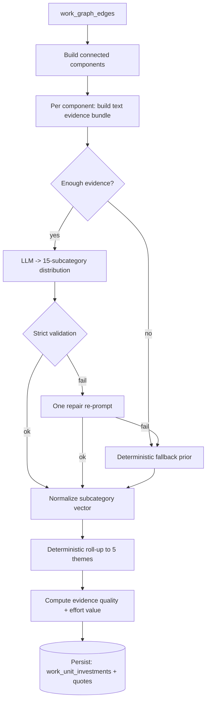

# Investment Categorization Pipeline

How a piece of work is assigned an investment categorization, end to end.

This is the **compute-time** pipeline. It runs during `dev-hops investment materialize`
(see [Investment Materialization](../ops/investment-materialization.md)), persists
distributions to ClickHouse (see [Investment Data Model](investment-data-model.md)),
and is read back — **effort-weighted** — by the API
(see [Investment API](../api/investment-api.md)).

For the strict LLM input/output schema, see the
[LLM Categorization Contract](../llm/categorization-contract.md). For the canonical
themes and subcategories, see the [Investment Taxonomy](../product/investment-taxonomy.md).

> **Mental model.** An individual issue, PR, or commit is **never** tagged with a
> category. The unit of categorization is a **WorkUnit** (a cluster of related items),
> and the output is a **probability distribution** over a fixed taxonomy — not a single
> label. Themes are a deterministic roll-up of subcategory probabilities; the LLM never
> picks a theme directly.

Code lives in `src/dev_health_ops/work_graph/investment/`.

---

## Pipeline at a glance



---

## Step 1 — Form the WorkUnit

`materialize_investments` reads typed edges from `work_graph_edges` via
`fetch_work_graph_edges` and builds **connected components** with `_build_components`.
Each component is one **WorkUnit**: a set of linked `issue` / `pr` / `commit` nodes.
The WorkUnit id is a stable SHA-256 of its sorted node tokens (`work_unit_id`).

Categorization therefore happens on the **cluster**, not on the individual item.

> **Correction — components are not window-bounded.** `fetch_work_graph_edges`
> filters by repo / org only, **not** by time. Components are built from the **full**
> edge set, and the requested time window (`--from` / `--to`) is applied **afterward**:
> a component is skipped only if its node time-bounds (`compute_time_bounds`) fall
> entirely outside the window. Do not describe components as "built from edges inside
> the window" — a long-lived component can span many periods. (Whether that is the
> desired product behavior is tracked separately as an engineering question.)

## Step 2 — Build the text evidence bundle

For each WorkUnit, `build_text_bundle` (in `evidence.py`) gathers bounded text:

| Source  | Max items | Fields used |
| ------- | --------- | ----------- |
| Issues  | 6         | title, description, type, labels, parent title, epic title |
| PRs     | 6         | title, body |
| Commits | 12        | subject line (first non-empty line) |

Each field is truncated to **280** chars and each source to **900** chars. The result
is a `source_block` (the text shown to the LLM) plus a per-source map (`source_texts`)
used later to verify quotes, and an `input_hash` (SHA-256 of the serialized sources)
persisted for audit.

## Step 3 — Gate: LLM vs deterministic fallback

Before any LLM call, `materialize_investments` decides per component:

- `text_char_count < MIN_EVIDENCE_CHARS` → fallback (`insufficient_evidence`)
- `text_source_count == 0` → fallback (`no_text_sources`)
- otherwise → send to the LLM

This keeps cost down and avoids asking the model to categorize empty clusters.

## Step 4 — LLM assigns subcategory probabilities

`categorize_text_bundle` (in `categorize.py`) sends the canonical prompt and expects a
**probability distribution across all 15 subcategories** (summing to 1), plus 1–10
**extractive evidence quotes** and a short `uncertainty` string. The 15 subcategories
are the fixed registry in `investment_taxonomy.py`
(see [Investment Taxonomy](../product/investment-taxonomy.md)).

**This is the step that makes the determination.** Everything downstream is
deterministic.

## Step 5 — Strict validation, one repair, deterministic fallback

`validate_llm_payload` (in `llm_schema.py`) enforces:

- top-level keys are exactly `subcategories`, `evidence_quotes`, `uncertainty`;
- the prompt and schema require all 15 canonical subcategory keys, with `0` for irrelevant categories; runtime validation defensively fills any missing canonical keys after sum validation and before normalization;
- every subcategory key is in the canonical set; each probability in `[0, 1]`;
- the distribution sums within `[0.9, 1.1]`, a clean `[0.98, 1.02]` sum is accepted as-is, a near-miss is renormalized and flagged `probability_sum_renormalized` in the audit, and `≤ 0` or outside `[0.9, 1.1]` is rejected;
- each evidence quote is a **literal substring** of the provided source text
  (anti-hallucination), 1-10 quotes, `source ∈ {issue, pr, commit}`, and each quote is `≤ 280` chars;
- `uncertainty` is non-empty and ≤ 280 chars.

On failure, exactly **one repair re-prompt** is attempted (the validation errors are
fed back). If it still fails, a deterministic fallback distribution is applied with
status `invalid_llm_output`.

> **The fallback is a neutral prior, not "unknown."** `FALLBACK_PRIOR` spreads weight
> evenly across one representative subcategory per theme (and zeroes the rest). It
> satisfies the "never unknown" contract, but semantically it means *"insufficient
> validated evidence to assign a confident mix,"* **not** a meaningful estimate. Treat
> low `evidence_quality` and a fallback `categorization_status` as low-confidence
> signals in any UX.

Possible `categorization_status` values: `ok`, `repaired`, `invalid_llm_output`,
`insufficient_evidence`, `no_text_sources`, and `llm_task_failed` (the async LLM task
raised before an outcome was recorded).

## Step 6 — Deterministic theme roll-up

Themes are **never** chosen by the LLM. `rollup_subcategories_to_themes` sums
subcategory probabilities by their prefix (`operational.on_call` → `operational`) and
normalizes across the 5 themes. The subcategory vector is first filled out to all 15
keys and normalized via `ensure_full_subcategory_vector`. Pure arithmetic — no model
involved. This is what prevents category drift.

## Step 7 — Evidence quality and effort value

`compute_evidence_quality` (in `evidence.py`) emits a `0–1` score:

```
0.4 * text_score + 0.3 * source_agreement + 0.3 * structural_density
```

where `text_score` reflects how much text was available, `source_agreement` rewards
having more than one source type (issue/pr/commit), and `structural_density` combines
graph density with average edge confidence. It is banded into
`high` / `moderate` / `low` / `very_low`.

Separately, `_effort_from_work_unit` computes the **effort value** used later for
weighting (see [Investment API](../api/investment-api.md)). Precedence:

1. commit churn (additions + deletions) → metric `churn_loc`
2. else PR churn → metric `churn_loc`
3. else issue active hours → metric `active_hours`
4. else `0.0`

## Step 8 — Persist

A `WorkUnitInvestmentRecord` is written per WorkUnit to `work_unit_investments` with the
theme distribution, subcategory distribution, structural evidence, evidence quality,
effort metric/value, and audit fields (`categorization_status`,
`categorization_model_version`, `categorization_input_hash`, `categorization_run_id`,
`computed_at`).

Evidence quotes are written to `work_unit_investment_quotes` by default for CLI and
worker materialization runs. They can be skipped with
`--no-persist-evidence-snippets` for storage-constrained backfills. See
[Investment Data Model](investment-data-model.md) for table schemas and read semantics.

---

## Guarantees

For every WorkUnit:

- theme probabilities sum to ~1.0;
- subcategory probabilities sum to the theme probabilities;
- evidence arrays exist (may be empty);
- evidence quality is always emitted;
- categorization never returns "unknown".

## What this pipeline does **not** do

- It does not tag individual issues/PRs/commits.
- It does not let the LLM choose themes or invent categories.
- It does not recompute anything at UX-time — explanations read persisted data only
  (see the [LLM Categorization Contract](../llm/categorization-contract.md)).
- It does not apply effort weighting here; weighting happens at read time in the API.
