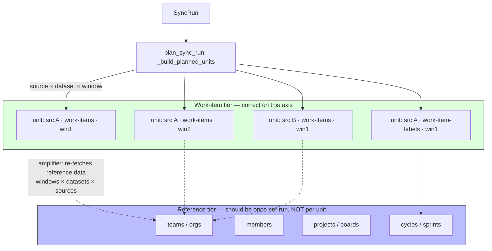

# Sync Unit Model

> **What this documents:** how a sync run is decomposed into executable units, and why **reference data** (teams, orgs, members, projects, boards/cycles/sprints) belongs on a different axis than **work items** (issues, PRs/MRs). This conceptual page was missing, which is why a structural request-amplification went unnoticed (CHAOS-2719). Target-state behavior is labeled where it is not yet shipped.

## Overview

A sync run is decomposed by the planner (`sync/planner.py` `_build_planned_units`) into units of:

```
source × dataset × date-window
```

Each `PlannedUnit` becomes one `SyncRunUnit` row and one `run_sync_unit` Celery task (see [Durable Dispatch Outbox](dispatch-outbox.md) for the task hierarchy). This axis is **correct for work items**, which are per-source and time-sliced: a 90-day backfill of issues legitimately splits into windows, and each window legitimately scopes to one source.

The axis is **wrong for reference entities**. Teams, orgs, members, projects, and boards/cycles/sprints are **source-independent and time-independent** — their true cardinality is *once per integration per run*. When a provider fetches reference data *inside* a work-item unit, it pays for that data `windows × datasets × sources` times.



For a 90-day Linear backfill: `ceil(90/14)=7 windows × 5 work-item-family datasets = 35 units`, each running the **complete** Linear ingest, each calling `iter_teams()` (all teams) plus `iter_cycles()` per team. The teams/cycles cardinality should be *one fetch per run*; instead it is `35× (× team count)`. This is the unmeasured amplifier behind Linear backfill request saturation, and it is **not Linear-specific**.

## The two tiers

| Tier | Entities | Correct cardinality | Correct axis |
| ---- | -------- | ------------------- | ------------ |
| **Reference / discovery tier** | teams, orgs, members, projects, boards/cycles/sprints | **once per integration per run** | source-independent, time-independent |
| **Work-item tier** | issues, pull/merge requests, labels, history, comments, worklogs | per source, time-sliced | `source × dataset × window` |

**Design rule:** work-item units **read** reference data from a once-per-run source; they must never **fetch** it inline. The persisted ClickHouse store (`teams`, `sprints`) is the read source of truth — but a missing/stale row is **never** proof that an entity is absent. On a store miss, a unit fetches only **its own source's** reference data and persists it; it never falls back to an all-teams / all-repos scan.

## Per-provider entity × cardinality matrix

Legend: **once/run** = fetched once per sync run (correct); **per-unit** = re-fetched inside every work-item unit (amplifier); **discovery** = already pulled out into the once-per-run `team_autoimport` relay.

| Provider | teams / orgs | members | projects / boards | cycles / sprints | issues / PRs |
| -------- | ------------ | ------- | ----------------- | ---------------- | ------------ |
| **GitHub** | discovery (once/run) | discovery | discovery | n/a | per source/window (work-item) |
| **GitLab** | discovery (once/run) | discovery | discovery | n/a | per source/window (work-item) |
| **Jira** | once/run (resolver) | n/a here | per-unit JQL scope ✅ | **per-unit** ⚠️ (`get_sprint` in issue loop) | per source/window (work-item) |
| **Linear** | **per-unit** ⚠️ (`iter_teams()` all teams) | discovery | discovery | **per-unit** ⚠️ (`iter_cycles()` per team) | per source/window (work-item) |

The ⚠️ cells are the work this epic removes. GitHub/GitLab already solved this by pulling org/team/member/project discovery out of the sync unit into a once-per-run [`team_autoimport`](dispatch-outbox.md) relay; Linear (teams + cycles in-unit) and Jira (sprints in-unit) never got that tier. The permanent fix **generalizes the discovery tier to the work-item path** and adds the missing cycle/sprint read-back loader.

## The three amplifiers and their fixes

1. **Per-unit reference re-fetch** (Linear teams+cycles; Jira sprints). The dominant fixed overhead. **Fix (P2):** read teams/cycles/sprints from the persisted store via a once-per-run resolver; add a `get_all_sprints` loader and a cycle/sprint producer; bounded source-scoped API fallback on a store miss.
2. **Work-item-family redundancy.** The 5 family datasets (`work-items`, `work-item-labels`, `work-item-projects`, `work-item-history`, `work-item-comments`) each re-run the *full* ingest, so enabling the family multiplies cost ×5 per source/window. **Fix (P3, target-state):** plan-time collapse to **one** composite ingest per `(source, window)`, writing per-dataset watermarks for each enabled family key.
3. **Source fan-out.** Work-item units that ignore their own source — Linear `IngestionContext(repo=None)` → all teams; GitHub `discover_repos` without a repo filter → all org repos. **Fix (P1, shipped on the source-scoping branch):** thread the unit's `source_external_id` so a unit syncs only its one source; preserve the no-source CLI/org-wide path.

**Target acceptance:** total provider API requests for a backfill scale `O(issues + teams + cycles/projects)`, not `O(windows × datasets × sources)`, across all four providers.

## Invariants this model must preserve

- **Backfill never writes watermarks.** Backfill units (`mode="backfill"`) must never update `sync_watermarks`; see [Data Pipeline](data-pipeline.md) and the planner module contract (CHAOS-2514). The work-item-family collapse writes per-dataset watermarks only for incremental/full-resync units.
- **Provider coverage matrix.** Behavior stays green across `{jira, gitlab, github, linear} × {teams, projects, members, issues}` — see [Team Attribution](team-attribution.md). Never make a fix Linear-only.
- **ClickHouse idempotency.** Reference reads and collapsed/scoped writes stay idempotent (`teams FINAL`, `sprints FINAL`).
- **No Postgres team/identity attribution.** Reference data is read from ClickHouse, never a Postgres attribution bridge.

## References

- Epic: CHAOS-2719 (sync unit model); children CHAOS-2718 (Linear reference re-fetch), CHAOS-2720 (GitHub source fan-out), CHAOS-2721 (work-item-family fan-in), CHAOS-2722 (window-aware budget), CHAOS-2725 (scoped backfill).
- Related: [Durable Dispatch Outbox](dispatch-outbox.md), [Data Pipeline](data-pipeline.md), [Team Attribution](team-attribution.md), [Connector Inventory](../ops/connector-inventory.md).
- Rate limits & budget: [Provider Rate-Limit Policy](../providers/rate-limit-policy.md) — per-provider quota dimensions/headers/retry semantics, the credentials-are-not-capacity invariant, and how work-item units reserve budget by route family before dispatch.
