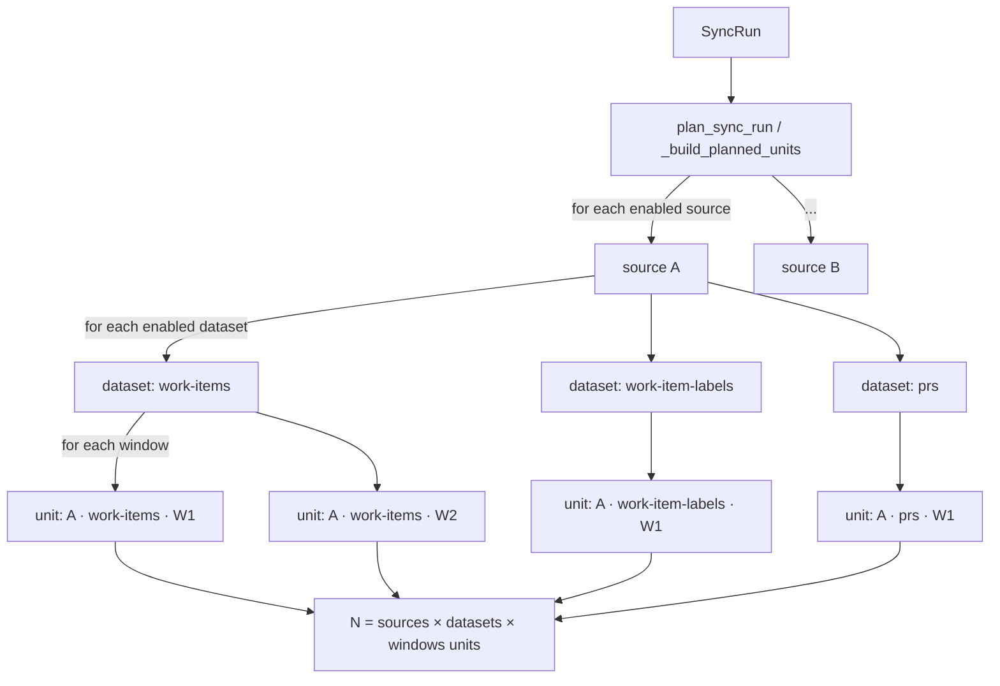
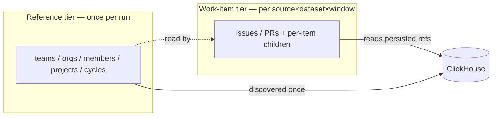

# Sync Unit Model (dev-health-ops)

How a sync is **decomposed into units**, where each kind of data sits relative to that decomposition, and why putting reference data on the wrong axis causes provider-request amplification.

This is the conceptual companion to the execution-lifecycle docs ([Durable Dispatch Outbox](dispatch-outbox.md), [Data Pipeline → Backfill](data-pipeline.md#backfill-pipeline)) and the operational knobs ([Workers](../ops/workers.md)). Where those describe *how a sync runs*, this describes *how a sync is carved into work*.

All paths are relative to `src/dev_health_ops/`.

---

## 1. The decomposition: `source × dataset × window`

A sync is planned by `sync/planner.py` `plan_sync_run` → `_build_planned_units`, which expands one `SyncRun` into many `SyncRunUnit` rows along three axes:

- **source** — an enabled `IntegrationSource` (a GitHub/GitLab repo, a Jira project, a Linear team).
- **dataset** — an enabled `IntegrationDataset` (e.g. `commits`, `prs`, `work-items`, `work-item-labels`). The registry of provider × dataset, cost class, and watermark behavior lives in `sync/datasets.py`.
- **window** — a time slice. Incremental resolves `[watermark, now]`; backfill chunks `[since, before]` via `backfill/chunker.py` (`_backfill_windows` in `planner.py`).



Each `SyncRunUnit` is dispatched as an **independent Celery task** (`workers/sync_units.py` `run_sync_unit` → `processors/dataset_adapters.py` `run_dataset_unit`). Units do **not** share process state beyond a process-local `ProviderRuntimeCache`; there is no SyncRun-scoped scratch store. The dispatch/finalize lifecycle that wraps this fan-out is in [Durable Dispatch Outbox](dispatch-outbox.md).

> **Key consequence:** the cost of anything fetched *inside* a unit is multiplied by `sources × datasets × windows`.

---

## 2. Two data tiers — and why the axis matters

Not all data has the same natural cardinality.

| Tier | Examples | Natural cardinality | Correct axis |
| --- | --- | --- | --- |
| **Work-item tier** | issues / PRs / MRs and their per-item children (comments, history, reviews) | per-source, time-sliced | `source × dataset × window` ✅ matches the unit axis |
| **Reference tier** | teams, orgs, members, projects, boards/cycles/sprints, workflow states | **once per integration** (source-independent, time-independent) | NOT the unit axis |

A team is not "updated in a 3-day window," and an org's member list is not per-repo. When a provider fetches **reference-tier** data from *inside* a work-item unit, it pays `sources × datasets × windows` times for data whose true cardinality is **one**. That mismatch — not any single provider bug — is the root of the request amplification described in §4.



---

## 3. Where reference data is fetched today (per-provider)

Verified across providers. The pattern is **inconsistent** — GitHub/GitLab already separate the reference tier; Linear and Jira fetch it inside the unit.

| Provider | Work-item routing | Unit scoped to its source? | Crawl date-bounded? | Reference tier location |
| --- | --- | --- | --- | --- |
| **GitHub** | code → `process_github_repo`; work-items → `run_work_items_sync_job` | code: ✅ per repo; **work-items: ❌** `_discover_repos` enumerates all org repos when no `repo_id` | ✅ `since`/`until` | ✅ org/team/member discovery is a **separate once-per-run** post-sync relay |
| **GitLab** | code → `process_gitlab_project`; work-items → `run_work_items_sync_job` | ✅ per project id | ✅ `updated_after`/`until` | ✅ group/member discovery **separate, once-per-run** |
| **Jira** | `run_work_items_sync_job` | ✅ `jira_project_keys=[source]` | ✅ honors `active_until` → JQL `<=` (`providers/jira/client.py`) | ⚠️ re-fetches sprints/worklogs/changelog **per unit** |
| **Linear** | `run_work_items_sync_job` | ❌ `IngestionContext(repo=None)` → all teams (`metrics/job_work_items.py`) | ✅ since CHAOS-2717 (`updatedAt` gte/lte) | ❌ teams + cycles fetched **inside the unit** (`providers/linear/provider.py`) |

Two **unscoped fan-out** bugs share a shape: Linear's `repo=None` and GitHub work-items' `_discover_repos`-without-`repo_id` both fetch *more than the unit's own source*.

---

## 4. The amplification (cost model)

For a backfill of `D` days with window size `w`, `K` enabled work-item-family datasets, `T` teams/sources:

```
units            ≈ ceil(D / w) × K          (per source)
reference fetches ≈ units × (1 + T)          when refs are fetched in-unit
                  ≈ 1 + T                     when refs are a once-per-run tier
```

Worked example — a 90-day Linear backfill, all 5 work-item-family datasets:

| Window | Units | In-unit reference re-fetches (teams+cycles) |
| --- | --- | --- |
| 3-day (pre-CHAOS-2717) | 30 × 5 = 150 | 150 × (1 + T) |
| 14-day (current) | 7 × 5 = 35 | 35 × (1 + T) |
| once-per-run tier (target) | 35 | **1 + T** |

CHAOS-2717 separately removed an O(n²) issue re-scan by bounding the crawl to its window (`updatedAt` gte/lte). The **reference-tier** multiplier above is still open (see §7).

---

## 5. The correct pattern already in the tree: the discovery tier

GitHub and GitLab already pull reference discovery **out of the unit** into a post-sync relay that runs **once per terminal SyncRun**:

- `workers/post_sync_dispatch.py` dispatches `run_post_sync_team_autoimport(sync_run_id=...)` once, gated on the config's `auto_import_teams`, after finalize.
- `workers/team_autoimport.py` `run_post_sync_team_autoimport` — "the post-sync relay dispatches this once per terminal SyncRun"; discovers teams/members/projects and persists them.
- Teams land in ClickHouse (`storage/clickhouse.py insert_teams` / `get_all_teams`) and can be hydrated via `providers/teams.py load_team_resolver_from_store`. `metrics/job_work_items.py` already reads `SELECT id, name, project_keys FROM teams FINAL` for its project-key resolver.

Generalizing this tier to the Linear/Jira work-item path (read persisted refs, or fetch once per run) is the permanent fix tracked by the epic in §9.

---

## 6. Window bounding & watermark behavior per tier

- **Work-item crawl bounds** are carried on `IngestionWindow(updated_since, active_until)` (`providers/base.py`). The job sets both (`metrics/job_work_items.py`); a provider that ignores `active_until` re-scans to *now* (the Linear pre-CHAOS-2717 bug). All providers must honor both bounds.
- **Watermarks** advance on successful incremental/full-resync units (`workers/sync_units.py`); **backfill never writes watermarks** (CHAOS-2514). Per-dataset behavior is registry-driven: `sync/datasets.py` `_NO_WATERMARK_DATASETS` is `{repo-metadata}` only — derivative work-item datasets (`work-item-labels`, `work-item-projects`) are incremental and watermark-tracked (reclassified per `work-item-derivative-watermarks` so they stop replanning a `NULL` lower bound → current-day re-expansion).
- A reference tier, once introduced, is **time-independent** and must not be on the watermark axis at all.

---

## 7. Budgeting & rate-limiting (how requests are governed)

Four layers, only the first is real-time protection (details in [Workers](../ops/workers.md)):

1. **Reactive gate** — `connectors/utils/rate_limit_queue.py` backs off only *after* HTTP 429.
2. **Concurrency cap** — `sync/guard.py` `SYNC_UNIT_CONCURRENCY_PER_BUCKET` per `(org, provider, cost_class)`; backfill + incremental share it.
3. **Budget guard** — `sync/budget_guard.py` (dry-run `observe_run` + `enforce_run`) admits/defers against per-unit estimates from `providers/<p>/budget.py`. **Estimates are static** (volume-blind), so the guard cannot currently distinguish a wide-window unit from a narrow one — it cannot gate the §4 amplification.
4. **Planner chunking** — window size (`LINEAR_BACKFILL_MAX_WINDOW_DAYS`, others 7d).

Removing the reference-tier multiplier (§5) reduces the request volume these layers must absorb; making estimates volume-aware lets the guard actually gate it.

---

## 8. Invariants (contracts for any change here)

- A unit fetches only **its own source** (no all-teams / all-repos scans).
- Reference-tier data is fetched **at most once per run** (or read from the persisted store), never on the `source × dataset × window` axis.
- A work-item-family **fan-in** must preserve per-dataset finalize/checkpoint/watermark semantics and ClickHouse idempotency; **backfill never writes watermarks**.
- Providers honor **both** window bounds (`updated_since` and `active_until`).
- Attribution stays green across the full provider × entity matrix `{jira, gitlab, github, linear} × {teams, projects, members, issues}` (see [Team Attribution](team-attribution.md) §0.4).

---

## 9. Known gaps & in-flight work

Tracked under epic **CHAOS-2719 — Sync unit model: reference/discovery tier + work-item-family fan-in (cross-provider)**:

- **CHAOS-2718** — Linear reference fetch once-per-run + `repo=None` source scoping.
- **CHAOS-2720** — GitHub work-item units fan out org-wide (`_discover_repos` ignores source).
- **CHAOS-2721** — work-item-family path re-runs the full ingest 5× per source/window (provider-agnostic fan-in).
- **CHAOS-2722** — budget estimates are static and cannot gate amplification (scale by window/page/volume).
- Related: CHAOS-2717 (shipped: Linear `gte/lte` bound + 14-day window), CHAOS-2661/2666/2688 (budget rollout).

---

## References

Code: `sync/planner.py`, `sync/datasets.py`, `processors/dataset_adapters.py`, `metrics/job_work_items.py`, `workers/sync_units.py`, `workers/post_sync_dispatch.py`, `workers/team_autoimport.py`, `providers/*/provider.py`, `providers/base.py`, `sync/budget_guard.py`, `storage/clickhouse.py`, `providers/teams.py`.
Docs: [Data Pipeline](data-pipeline.md), [Durable Dispatch Outbox](dispatch-outbox.md), [Workers](../ops/workers.md), [Connector Inventory](../ops/connector-inventory.md), [Team Attribution](team-attribution.md).
