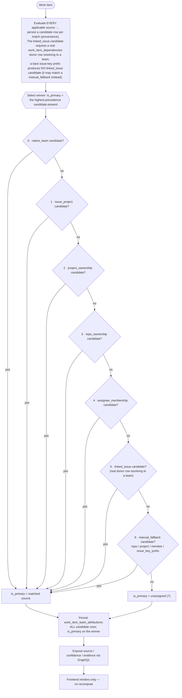
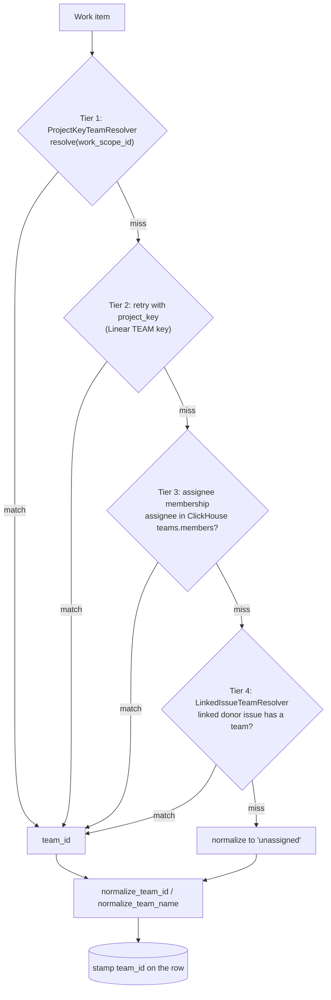
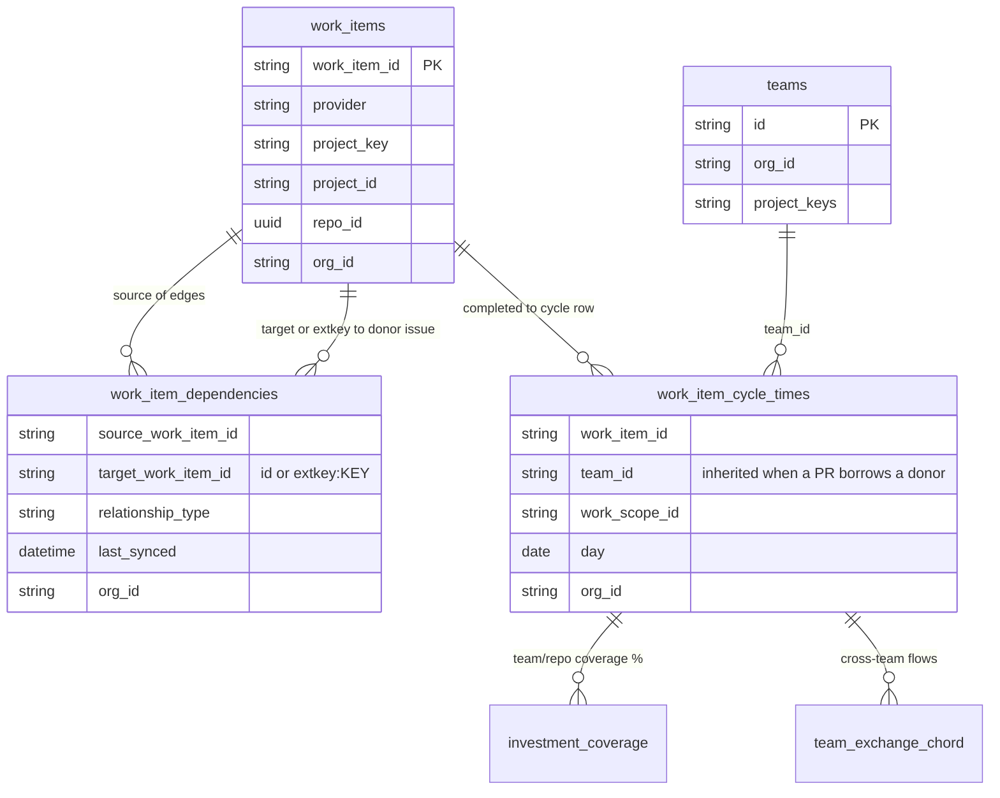
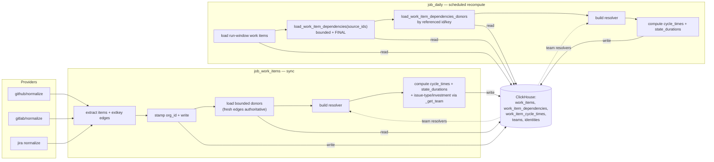
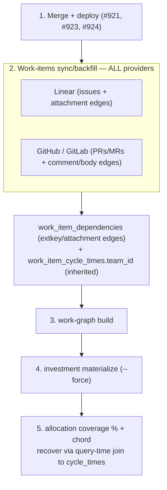

# Architecture: Work-Item Team Attribution & Linked-Issue Inheritance

**Status:** Authoritative
**Scope:** dev-health-ops (metrics/compute, sync, loaders, providers)
**Related:** [data-pipeline.md](data-pipeline.md) (§4 Metrics → Work-item team attribution),
[investment-data-model.md](investment-data-model.md),
[team-catalog-source-of-truth.md](../api/team-catalog-source-of-truth.md)

> First slice of the system-wide architecture-documentation epic. Documents how
> every work item (issue, PR, MR) is stamped with a `team_id`, why PRs used to
> land as `unassigned`, and how cross-provider linked-issue inheritance recovers
> team attribution for the investment **allocation-coverage** and
> **team-exchange chord** views.

## Why this exists

Team resolution historically used three signals — the provider work scope
(repo / project key), the Linear/Jira project key, and assignee membership.
**A GitHub/GitLab PR matches none of them**: its repo rarely maps 1:1 to a
team, it has no project key, and its author often isn't a team member. So PRs
were stamped `team_id = 'unassigned'` and never shared a team dimension with
the issue trackers — leaving TEAM COVERAGE at 0% and the team-exchange chord
empty (no two teams ever co-occur on a work scope).

The fix adds a fourth, **provider-agnostic** tier: a work item with no team of
its own inherits the team of an issue it links to via `work_item_dependencies`.
A GitHub PR closing Linear `CHAOS-2400` borrows that issue's `CHAOS` team.

---

## 0. Target state (CHAOS-2600) — ClickHouse-only team attribution

> **Governing target contract.** This §0 is the source of truth for the intended model and the
> debugging navigation aid; **new code must follow it.** It is implemented across CHAOS-2600
> CS1–CS7 — the ClickHouse enum widening lands in **CS1** (see *Schema prerequisite* below), the
> precedence tests are inverted in **CS2**, and the legacy Postgres bridge path is removed in
> **CS5/CS6**. Until then, §1 below still describes the live (pre-CHAOS-2600) cascade and the
> existing tests still encode the old precedence.

> **CS5 reality (CHAOS-2606).** As of CS5, ClickHouse is the system of record for **both** the team
> catalog **and** identity→team membership. No live scheduled beat or admin/inference path writes
> Postgres `TeamMapping` or `IdentityMapping` anymore: the Postgres→ClickHouse team bridge
> (`providers/team_bridge.py`) and `providers/team_reconcile.py` are **deleted**; the `sync-team-drift`
> and `reconcile-team-members` beats are **removed** and their Celery tasks are fail-closed no-ops
> (returning a `deprecated` status without touching Postgres). Admin team/identity CRUD now goes
> through `ClickHouseTeamAdminService` + the new `ClickHouseIdentityStore`, writing the ClickHouse
> `teams` and `identities` tables directly (the CH identity table is `identities`, not
> `identity_mappings` — that name belongs to the unchanged Postgres table, kept distinct per layer
> for org-deletion purge). Identity membership uses **surgical replacement**
> semantics: updating an identity removes its facets from teams it left and replaces changed facets in
> teams it stayed in, editing `teams.members` add/remove-by-facet (never a full recompute) so Auto
> Import / catalog members are preserved. See *CS5 status / deferred to CS6* at the end of §4.

**ClickHouse is the only source used for analytics attribution. Postgres does not store or resolve
team attribution mappings.** Manual mappings are ClickHouse fallback records only — never overrides,
never outranking WTI-native facts. PR/MR attribution comes from an **actual linked issue donor**; an
external issue-key *prefix* alone is not linked-issue inheritance.

Every final attribution carries provenance: `org_id, work_item_id, provider, team_id, team_name,
source, confidence, evidence, is_primary, computed_at`.
`source ∈ {native_team, issue_project, project_ownership, repo_ownership, assignee_membership,
linked_issue, manual_fallback, unassigned}`; `confidence ∈ {high, medium, low, manual, none}`.

> **Schema prerequisite (CS1).** The `issue_project` / `manual_fallback` sources and the `manual` /
> `none` confidence values require the ClickHouse `Enum8` widening on `work_item_team_attributions`
> (migration 053) to land **before** any resolver emits them — emitting an unknown enum value fails
> the insert. This is CHAOS-2600 ordering rule §4.1: migrate enums (CS1) → then emit (CS2/CS3).

### 0.1 Resolution decision tree

Resolution is **staged by precedence**. The resolver evaluates the applicable sources and persists
**all** matching ones as candidates; the *winner* (`is_primary`) is the highest-precedence source
present. "Wins" means *primary selection* — it does not mean lower-precedence sources go
unevaluated or unrecorded. **To debug:** read `team_attribution_source` (the winner) from
provenance, jump to that node, and verify no higher-precedence stage matched.



**Invariants:** the **winner is the highest-precedence matching source** (all matching sources are
still persisted as candidates — precedence decides `is_primary`, not which sources are computed);
`linked_issue` (5) requires a real `work_item_dependencies` donor row resolving to a `work_items`
row whose **own team came from a first-class fact (sources 0–4)** — a donor resolved only by
`manual_fallback` is NOT a valid donor, so a bare prefix can never be laundered into rank-5
inheritance (it falls through to 6); `manual_fallback` (6) can only beat `unassigned`; a whole org
at `unassigned` usually means the ClickHouse `teams` dimension is empty.

### 0.2 Source reference matrix

| # | `source` | Resolves from (ClickHouse) | Confidence | Beats | Never overrides | Evidence keys |
|--:|---|---|---|---|---|---|
| 0 | `native_team` | `WorkItem.native_team_key` → `teams` | high | all below | — (top) | `native_team_key` |
| 1 | `issue_project` | native issue project → owning team | high | 2–7 | 0 | `project_id, owner_team` |
| 2 | `project_ownership` | `team_project_ownership` | high | 3–7 | 0–1 | `project_id, provider` |
| 3 | `repo_ownership` | `team_repo_ownership` | medium | 4–7 | 0–2 | `repo_full_name` |
| 4 | `assignee_membership` | `team_memberships` (assignee identity) | medium | 5–7 | 0–3 | `member_id, identity` |
| 5 | `linked_issue` | `work_item_dependencies` donor → donor's team | medium | 6–7 | 0–4 | `dependency_type, donor_work_item_id, donor_provider` |
| 6 | `manual_fallback` | `manual_attribution_fallbacks` (repo/project/member/issue_key_prefix) | manual\|low | 7 only | 0–5 | `scope_type, scope_id, reason` |
| 7 | `unassigned` | — (nothing matched) | none | — (floor) | — | `reason` |

### 0.3 Off-the-rails matrix (symptom → diagnosis → fix)

| Symptom | Likely stage | Diagnose | Fix |
|---|---|---|---|
| A whole org is `unassigned` | 7 (floor) | `get_all_teams()` empty? CH `teams` populated for `org_id`? | re-home teams population; verify daily-chain order |
| PR attributed to a surprising team via `linked_issue` | 5 | which `work_item_dependencies` edge? donor's own team? extkey ambiguous? | confirm donor row + `_canonical_target`; check `_INHERITABLE_RELATIONSHIP_TYPES` |
| `manual_fallback` beats a real team | precedence | `_SOURCE_ORDER` has `manual_fallback=6`? loader merging manual at the wrong rank? | restore rank — manual is the lowest non-unassigned tier |
| A bare prefix (e.g. `CHAOS`) attributes as `linked_issue` | 5 vs 6 | did a full key resolve to a real `work_items` row, or did a prefix shortcut leak in? | no prefix→team in `linked_issue`; route to manual `issue_key_prefix` |
| A PR inherits via `linked_issue` from a donor that only has a `manual_fallback` (e.g. `issue_key_prefix`) rule | 5 (donor) | is the donor's *primary* source in 0–4? a rank-6 fallback must never be relabeled rank-5 | donors gated to `_DONOR_SOURCES` (0–4) in `build_linked_issue_team_resolver`; a manual-only donor is never a linked_issue donor (done CS3) |
| Same scope shows duplicate ownership candidates / bloats over time | RMT read | `valid_from` is in the ownership tables' `ORDER BY`, so `FINAL` cannot collapse re-imports (each daily run is a new sort key) | reads dedup per *logical* scope via `argMax((updated_at, valid_from))`, NOT `FINAL` (done CS3, `load_team_attribution_context`); manual-fallback read keeps `FINAL` (its sort key has no `valid_from`) |
| Team flips / stale team lingers after a re-org | write side | ownership writers set `valid_from=now` but never `valid_to`, so a reassigned scope keeps the old-team row active; readers can't tell stale from co-ownership | needs writer-side `valid_to` expiry on re-derivation — tracked **CHAOS-2610** (read-side `argMax` already makes the newest the primary by recency tiebreak) |
| `manual_fallback` resolves the wrong team | scope match | which `manual_attribution_fallbacks` row matched (repo/project/member/issue_key_prefix)? | check `_manual_fallback_candidates` scope match + rule `priority`; manual is rank 6 (done CS3) |
| Provenance absent in the API | GraphQL | resolver SELECTs the provenance columns? SDL has the fields? | expose `source/confidence/evidence` |
| Web shows a different team than the backend | client recompute | any client-side mapping derived from `evidence`? | render-only; delete client derivation |

> Full data-flow and data-object-hierarchy diagrams: see the CHAOS-2600 plan §1.6–1.7 / `team-flow.md`.

### 0.4 Provider coverage contract (attribution is provider-agnostic)

Attribution is **provider-agnostic** — the resolver and precedence (§0.1) never branch on provider.
That is a **testable contract**: every WTI provider × every normalized entity must be covered, not
just Linear. **Attribution changes MUST keep this matrix green; never add Linear-only coverage.**

| provider \ entity | teams | projects | members | issues |
|---|---|---|---|---|
| jira   | partial | partial | partial | yes |
| gitlab | partial | yes     | **no**  | yes |
| github | yes     | n/a¹    | yes     | yes |
| linear | yes     | partial | yes     | yes |

`yes` = normalized in src AND asserted in tests · `partial` = only sink/integration assertion (no
unit test of the normalizer) · `no` = normalized but output never asserted · `n/a` = provider does
not natively produce this entity. ¹ GitHub has no native Project entity (the repo is the scope).

- **Resolver row (CS2):** the precedence resolver (`resolve_team_attribution`) is exercised for all
  four providers — Linear (`test_issue_project_wins_over_linked_issue`,
  `test_assignee_membership_wins_over_linked_issue`), GitHub (`gh:` items in
  `test_project_ownership_wins_over_linked_issue` / `test_repo_ownership_wins_over_linked_issue`),
  GitLab (`test_gitlab_mr_resolver_precedence_with_gitlab_donor` — MR as item + GitLab issue as
  same-provider donor), Jira (`test_jira_issue_project_wins_over_linked_issue`,
  `test_assignee_membership_wins_over_jira_linked_donor`). (Provider *link-capture* — distinct from
  the resolver — is also tested per provider, e.g. `test_gitlab_captures_external_key_*`.)
- **Why it matters:** the team/project/member **dimension** is populated by the per-provider
  team/project/member sync. **"Auto Import" is a UX option** (checkboxes to import teams, projects,
  and members from an integration → `run_team_autoimport`, writing ClickHouse directly); manual
  fallback is the separate explicit-override option. Because jira/github/gitlab work items carry
  `native_team_key = None` (only Linear sets it real), non-Linear attribution depends *entirely* on
  this dimension — so its coverage cells are the highest-risk. (CHAOS-2600 does not change these
  sync ops; CS5 removes only the Postgres bridge.)
- **Open gaps → CHAOS-2609 (CS-COV):** the dimension has holes — **gitlab/members normalized but
  never asserted (high)**, gitlab epics untested (high), jira team/project/member sink-only
  (medium), linear native projects not ingested (medium). Until those land, do **not** assume
  non-Linear dimension coverage. The matrix above is the source of truth for what is/ isn't proven.

---

## 1. Attribution cascade (decision flow)

> **Implemented model: see §0 (CHAOS-2600).** As of CS2 the resolver applies the 8-source staged
> precedence in §0 (`native_team > issue_project > project_ownership > repo_ownership >
> assignee_membership > linked_issue > manual_fallback > unassigned`) — `linked_issue` is now a true
> fallback below ownership/assignee, and the issue's own project key resolves as `issue_project`.
> The 4-tier cascade below predates that change and is kept for historical context; where they
> differ, **§0 governs**.

`resolve_base_team()` runs tiers 1–3; the linked-issue resolver is tier 4. The
first match wins and nothing ever overrides a real team.



**Inheritance is gated**, so it never imports a wrong team:
- only **inheritance-safe** relationship types transfer a team
  (`relates_to`, `relates`, `duplicates`, `external_issue_key`); blocking links
  (`blocks` / `blocked_by`) routinely span teams and are ignored;
- a cross-provider `extkey:KEY` that exists in **both** Linear and Jira is
  ambiguous and dropped;
- multiple donors → the lexicographically smallest canonical target wins
  (stable, since ClickHouse rows are unordered);
- per `(source,target)` the **latest** edge by `last_synced` wins, so a flip
  from `relates_to` to `blocked_by` stops inheriting.

---

## 2. Cross-provider link capture & inheritance (sequence)

Edges are captured during sync; the resolver is built once per run and applied
to every work-item metric family.

```mermaid
sequenceDiagram
    autonumber
    participant Prov as Provider API (GitHub/GitLab/Jira)
    participant Norm as Normalizer (providers normalize)
    participant Job as job_work_items (sync)
    participant CH as ClickHouse
    participant Build as build_linked_issue_team_resolver
    participant Comp as compute_work_item_metrics_daily

    Prov->>Norm: issues / PRs / MRs
    Norm->>Norm: extract WorkItems + WorkItemDependency edges
    Note over Norm: PR body magic-words + head branch to extkey:KEY;<br/>keyword sets relationship_type (blocking stays non-inheritable)
    Norm-->>Job: work_items, dependencies
    Job->>Job: stamp org_id on items, transitions AND dependencies
    Job->>CH: write_work_items / write_work_item_dependencies
    Job->>CH: load donor items for fresh-edge targets (bounded, FINAL, org-scoped)
    Job->>Build: work_items (synced plus donors), fresh edges
    Build->>Build: resolve_base_team per item to donor_team map + key_index
    Build->>Build: collapse edges by source,target latest; apply relationship allowlist
    Build-->>Job: LinkedIssueTeamResolver
    loop each day in window
        Job->>Comp: work_items, transitions, linked_issue_resolver
        Comp->>CH: write work_item_cycle_times (team_id stamped)
    end
```

`job_daily` (the scheduled recompute) follows the same build → compute path but
**reads** persisted edges instead of extracting them — see §4.

### Link capture sources & precedence

A PR/MR only inherits a team if an edge to its issue exists. The link is
captured from where it actually lives, in descending order of authority (PR
#924 — the primary/secondary sources; #921 added the tertiary):

| Tier | Source | Trust gate | Edge |
|---|---|---|---|
| Primary | **Linear issue attachment** (the integration's PR/MR link) | integration `sourceType` **AND** allowlisted host (public SaaS + `LINEAR_TRUSTED_SCM_HOSTS`) | `ghpr:…`/`gitlab:… → linear:KEY` (direct id) |
| Secondary | **GitHub PR comment** (the Linear bot's linkback) | exact `linear[bot]` actor (`GITHUB_LINEAR_LINKBACK_BOTS`) + `linear.app` URL | `ghpr:… → extkey:KEY` |
| Tertiary | **PR body / head branch** (the author's own ref) | magic-word / Linear branch convention | `ghpr:… → extkey:KEY` |

The authoritative link runs **Linear → source control** (the issue's attachment
points at the PR/MR), so the edge is emitted with the PR/MR as the *source* and
the team-bearing issue as the *target* — fitting the source-inherits-from-target
resolver unchanged. **Accepted residual:** a trusted org member linking a real
PR to their own issue drives that PR's attribution — the feature working as
intended on collaborative data, not a forgery (same-org analytics, not an authz
boundary).

---

## 3. Data flow & relationships (ER)



The chord and coverage both read `work_item_cycle_times.team_id`. Before
inheritance, PR rows carried `unassigned`, so they never bridged to the issue
trackers' teams; after, a PR's row carries the donor issue's team and the two
providers finally co-occur on a team dimension.

---

## 4. Component & job map (who reads/writes what)

Two jobs build the resolver. Both are **tenant-scoped** (org-wide reads only
under an explicit `org_id`) and **bounded** (never a full-history scan).



> **CS5 (CHAOS-2606): no Postgres in the team/identity path.** The team resolvers read ClickHouse
> `teams` / `identities` (and the ownership dimensions) — **not** Postgres `TeamMapping` /
> `IdentityMapping`. (The CH identity table is `identities`; `identity_mappings` is the unchanged
> Postgres table.) The Postgres→ClickHouse bridge (`team_bridge.py`) and `team_reconcile.py` are
> deleted; the `sync-team-drift` and `reconcile-team-members` beats are removed and their tasks
> no-op. Admin team/identity CRUD writes ClickHouse via `ClickHouseTeamAdminService` /
> `ClickHouseIdentityStore`; identity membership is edited surgically (add/remove-by-facet) so
> Auto Import members are preserved.

**Key boundary differences**

### Manual QA: auto-imported ownership coverage

Use this check when validating CHAOS-2401/2547 against a real tenant. It proves
the sync surface fills the ClickHouse ownership dimensions that the attribution
resolver reads, then verifies the user-visible Investment → Allocation coverage
does not collapse to `unassigned`.

1. In Admin → Sync, create or edit a real Linear work-items sync and enable
   **Auto-import teams, projects & members** (`sync_options.auto_import_teams=true`).
2. Trigger the sync through the sync-config UI or worker-backed trigger endpoint
   so the configured worker credentials are used.
3. After the sync succeeds, run daily metrics with the same analytics database:

   ```bash
   CLICKHOUSE_URI=clickhouse://... dev-hops metrics daily
   ```

4. Open `dev-health-web` in a real browser (Playwright is preferred for evidence)
   and navigate to **Investment → Allocation**.
5. Verify team coverage is greater than 0% and the allocation view includes named
   teams from the Linear import, not only `unassigned`.
6. Optional SQL spot-checks against ClickHouse before opening the browser
   (replace `<org_id>` with the tenant being verified):

   ```sql
   SELECT count() FROM projects WHERE org_id = '<org_id>' AND provider = 'linear';
   SELECT count() FROM members WHERE org_id = '<org_id>';
   SELECT count() FROM team_memberships WHERE org_id = '<org_id>' AND provider = 'linear';
   SELECT count() FROM team_project_ownership WHERE org_id = '<org_id>' AND provider = 'linear';
   SELECT team_id, count() FROM work_item_cycle_times WHERE org_id = '<org_id>' GROUP BY team_id;
   ```

| Aspect | `job_work_items` (sync) | `job_daily` (recompute) |
|---|---|---|
| Edge source | freshly extracted (authoritative) | persisted, `FINAL`, bounded by run-window source ids |
| Removed link | absent on re-extract → stops inheriting | persists until next sync re-stamps (see limitation) |
| Donor items | bounded to fresh-edge targets | bounded to referenced targets |
| Tenant scope | reads only when `org_id` set | reads only when `org_id` set |

> **Known limitation.** `work_item_dependencies` is an append-only
> `ReplacingMergeTree` with no tombstone, so a *removed* link is not deleted. A
> standalone `job_daily` recompute between syncs can keep honoring it until the
> next sync re-extracts the source. A link-lifecycle/tombstone (which also
> affects the work-graph) is a tracked follow-up.

### CS5 status / deferred to CS6

- **Drift review is off.** The admin drift-review endpoints (`GET /teams/pending-changes`,
  `POST /teams/{id}/approve-changes`, `/dismiss-changes`, `/teams/trigger-drift-sync`) return
  **HTTP 501**. They were built on the Postgres `TeamMapping` flagged-changes machinery, which CS5
  removes; the ClickHouse-backed rebuild is **CS6**.
- **Postgres mapping deletion is CS6.** The `TeamMappingService` / `TeamDriftSyncService` classes,
  the dead `JiraActivityInferenceService.match_and_confirm` / `TeamMembershipService.confirm_links`
  paths (no live caller after CS5), and the Postgres `TeamMapping` / `IdentityMapping` models + tables
  are deleted in **CS6** (plus the Alembic drop). CS5 only stops reading/writing them from live paths.
- **Known limitations.** (1) `ClickHouseTeamAdminService.add_members` has a read-modify-write
  lost-update window under concurrent admin edits (deferred — admin surface is low-concurrency).
  (2) The surgical facet remove can rarely over-remove a **shared facet** when two distinct
  identities share a facet value and one is updated — for a shared **`email`** (the common case,
  e.g. two records carrying the same address) or, for email-less identities, a shared
  **`display_name`**; provider-ids (which are unique per identity, enforced by the confirm-path
  409 check) are unaffected. Same CS6 bucket as the lost-update.
  (3) Confirm-path membership writes are **non-transactional across teams**: ClickHouse has no
  multi-statement transactions, so the two-pass design makes only the **validation** all-or-nothing
  (a 409/404 leaves zero mutations). A ClickHouse error *mid-apply* (PASS 2) returns 500 with a
  possible partial `team.members` / identity-record update; re-running the confirm is idempotent.

---

## 5. Recovery / backfill runbook

After deploying the inheritance + capture changes, existing orgs need a
**recompute** to populate `team_id` on historical rows — there is **no schema
migration**, only a data replay.

### Why a plain backfill is not enough

The investment **allocation** views derive team at *query time*: the coverage %
and team-exchange chord read `work_unit_investments` and **LEFT JOIN**
`work_item_cycle_times` for `argMax(team_id, …)`. So three things must be true,
and the backfill **runner only re-runs `run_work_items_sync_job` — it does NOT
fan out** to the work-graph or investment jobs (only the live sync path chains
those). They must be triggered explicitly.



### Ordered steps (per affected org)

1. **Merge + deploy** #921 (mechanism), #923 (backfill CLI), #924 (capture).
2. **Backfill all providers** — Linear **and** GitHub/GitLab. Linear-only does
   nothing: the PR/MR rows and their edges come from the git providers, and the
   donor issues come from Linear. A single `--provider all` run (or per-provider
   with Linear synced so its issues are present) writes the edges and recomputes
   `work_item_cycle_times.team_id`. The org is derived from the sync config
   (#923), so `--org` is optional.
3. **Work-graph build**, then
4. **Investment materialize (`--force`)** — these rebuild `work_unit_investments`
   + its `structural_evidence_json.issues` (the coverage join keys); the backfill
   does not trigger them.
5. **Verify & recover** — the coverage % and chord recover automatically via the
   query-time join. Confirm the links were captured:

   ```sql
   SELECT relationship_type_raw, count()
   FROM work_item_dependencies FINAL
   WHERE org_id = {org}
     AND relationship_type_raw IN
         ('linear_attachment', 'github_comment_linear_url', 'external_issue_key')
   GROUP BY relationship_type_raw
   ```

   Zero `linear_attachment` rows after a Linear backfill means the org's issues
   carry no integration PR/MR attachments — there is then no link to inherit
   from, and an empty chord is **correct** (data-driven), not a bug.

> Exact CLI flags vary per command — confirm with `<cmd> --help`. The relevant
> entry points: `sync work-items` / `backfill run` → `run_work_items_sync_job`;
> `work-graph build` → `run_work_graph_build`; `investment materialize` →
> `run_investment_materialize`; `metrics daily` → `run_daily_metrics`.

---

## Source map

| Concern | Location |
|---|---|
| Attribution cascade + resolver builder | `metrics/compute_work_items.py` (`resolve_base_team`, `build_linked_issue_team_resolver`) |
| Resolver type | `providers/teams.py` (`LinkedIssueTeamResolver`, `ProjectKeyTeamResolver`, `TeamResolver`) |
| State-duration parity | `metrics/compute_work_item_state_durations.py` |
| Sync wiring | `metrics/job_work_items.py` |
| Scheduled recompute wiring | `metrics/job_daily.py` |
| Bounded donor/edge loads | `metrics/loaders/clickhouse.py` (`load_work_item_dependencies`, `load_work_item_dependencies_donors`) |
| Linear attachment capture (primary) | `providers/linear/normalize.py` (`extract_linear_dependencies`, `_is_scm_attachment`), `providers/linear/client.py` (`get_issue_attachments`) |
| GitHub comment / body capture | `providers/github/normalize.py` (`extract_github_comment_dependencies`, `extract_github_dependencies`) |
| GitLab capture | `providers/gitlab/normalize.py` |
| Recovery runbook | §5 above; backfill `backfill/runner.py`, investment `workers/work_graph_tasks.py` |
| Tests | `tests/test_linked_issue_team_inheritance.py`, `tests/test_pr_issue_link_capture.py` |
