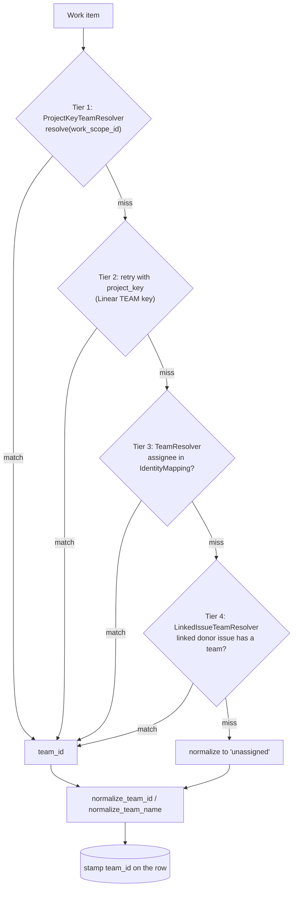
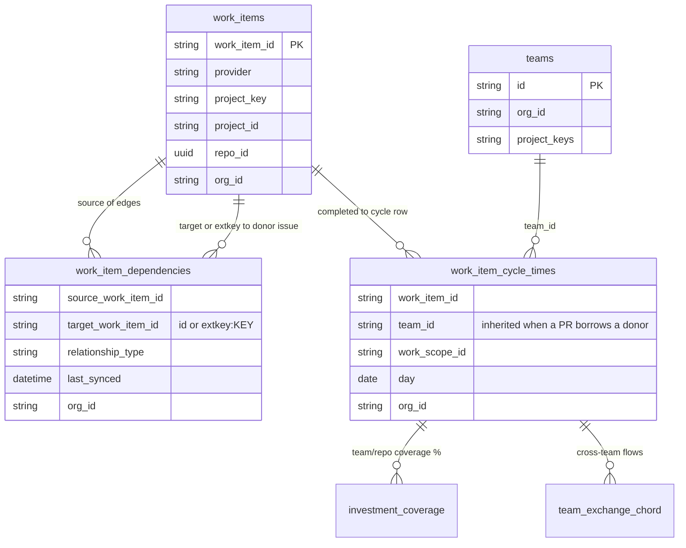
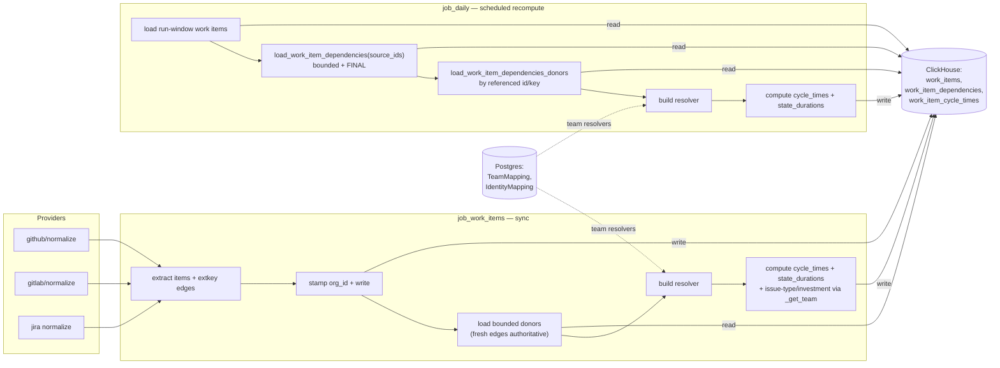

# Architecture: Work-Item Team Attribution & Linked-Issue Inheritance

**Status:** Authoritative
**Scope:** dev-health-ops (metrics/compute, sync, loaders, providers)
**Related:** [data-pipeline.md](data-pipeline.md) (§4 Metrics → Work-item team attribution),
[investment-data-model.md](investment-data-model.md),
[team-catalog-source-of-truth.md](../api/team-catalog-source-of-truth.md)

> First slice of the system-wide architecture-documentation epic. Documents how
> every work item (issue, PR, MR) is stamped with a `team_id`, why PRs used to
> land as `unassigned`, and how cross-provider linked-issue inheritance recovers
> team attribution for the investment **allocation-coverage** and
> **team-exchange chord** views.

## Why this exists

Team resolution historically used three signals — the provider work scope
(repo / project key), the Linear/Jira project key, and assignee membership.
**A GitHub/GitLab PR matches none of them**: its repo rarely maps 1:1 to a
team, it has no project key, and its author often isn't a team member. So PRs
were stamped `team_id = 'unassigned'` and never shared a team dimension with
the issue trackers — leaving TEAM COVERAGE at 0% and the team-exchange chord
empty (no two teams ever co-occur on a work scope).

The fix adds a fourth, **provider-agnostic** tier: a work item with no team of
its own inherits the team of an issue it links to via `work_item_dependencies`.
A GitHub PR closing Linear `CHAOS-2400` borrows that issue's `CHAOS` team.

---

## 1. Attribution cascade (decision flow)

`resolve_base_team()` runs tiers 1–3; the linked-issue resolver is tier 4. The
first match wins and nothing ever overrides a real team.



**Inheritance is gated**, so it never imports a wrong team:
- only **inheritance-safe** relationship types transfer a team
  (`relates_to`, `relates`, `duplicates`, `external_issue_key`); blocking links
  (`blocks` / `blocked_by`) routinely span teams and are ignored;
- a cross-provider `extkey:KEY` that exists in **both** Linear and Jira is
  ambiguous and dropped;
- multiple donors → the lexicographically smallest canonical target wins
  (stable, since ClickHouse rows are unordered);
- per `(source,target)` the **latest** edge by `last_synced` wins, so a flip
  from `relates_to` to `blocked_by` stops inheriting.

---

## 2. Cross-provider link capture & inheritance (sequence)

Edges are captured during sync; the resolver is built once per run and applied
to every work-item metric family.

```mermaid
sequenceDiagram
    autonumber
    participant Prov as Provider API (GitHub/GitLab/Jira)
    participant Norm as Normalizer (providers normalize)
    participant Job as job_work_items (sync)
    participant CH as ClickHouse
    participant Build as build_linked_issue_team_resolver
    participant Comp as compute_work_item_metrics_daily

    Prov->>Norm: issues / PRs / MRs
    Norm->>Norm: extract WorkItems + WorkItemDependency edges
    Note over Norm: PR body magic-words + head branch to extkey:KEY;<br/>keyword sets relationship_type (blocking stays non-inheritable)
    Norm-->>Job: work_items, dependencies
    Job->>Job: stamp org_id on items, transitions AND dependencies
    Job->>CH: write_work_items / write_work_item_dependencies
    Job->>CH: load donor items for fresh-edge targets (bounded, FINAL, org-scoped)
    Job->>Build: work_items (synced plus donors), fresh edges
    Build->>Build: resolve_base_team per item to donor_team map + key_index
    Build->>Build: collapse edges by source,target latest; apply relationship allowlist
    Build-->>Job: LinkedIssueTeamResolver
    loop each day in window
        Job->>Comp: work_items, transitions, linked_issue_resolver
        Comp->>CH: write work_item_cycle_times (team_id stamped)
    end
```

`job_daily` (the scheduled recompute) follows the same build → compute path but
**reads** persisted edges instead of extracting them — see §4.

---

## 3. Data flow & relationships (ER)



The chord and coverage both read `work_item_cycle_times.team_id`. Before
inheritance, PR rows carried `unassigned`, so they never bridged to the issue
trackers' teams; after, a PR's row carries the donor issue's team and the two
providers finally co-occur on a team dimension.

---

## 4. Component & job map (who reads/writes what)

Two jobs build the resolver. Both are **tenant-scoped** (org-wide reads only
under an explicit `org_id`) and **bounded** (never a full-history scan).



**Key boundary differences**

| Aspect | `job_work_items` (sync) | `job_daily` (recompute) |
|---|---|---|
| Edge source | freshly extracted (authoritative) | persisted, `FINAL`, bounded by run-window source ids |
| Removed link | absent on re-extract → stops inheriting | persists until next sync re-stamps (see limitation) |
| Donor items | bounded to fresh-edge targets | bounded to referenced targets |
| Tenant scope | reads only when `org_id` set | reads only when `org_id` set |

> **Known limitation.** `work_item_dependencies` is an append-only
> `ReplacingMergeTree` with no tombstone, so a *removed* link is not deleted. A
> standalone `job_daily` recompute between syncs can keep honoring it until the
> next sync re-extracts the source. A link-lifecycle/tombstone (which also
> affects the work-graph) is a tracked follow-up.

---

## Source map

| Concern | Location |
|---|---|
| Attribution cascade + resolver builder | `metrics/compute_work_items.py` (`resolve_base_team`, `build_linked_issue_team_resolver`) |
| Resolver type | `providers/teams.py` (`LinkedIssueTeamResolver`, `ProjectKeyTeamResolver`, `TeamResolver`) |
| State-duration parity | `metrics/compute_work_item_state_durations.py` |
| Sync wiring | `metrics/job_work_items.py` |
| Scheduled recompute wiring | `metrics/job_daily.py` |
| Bounded donor/edge loads | `metrics/loaders/clickhouse.py` (`load_work_item_dependencies`, `load_work_item_dependencies_donors`) |
| extkey capture | `providers/github/normalize.py`, `providers/gitlab/normalize.py` |
| Tests | `tests/test_linked_issue_team_inheritance.py` |
