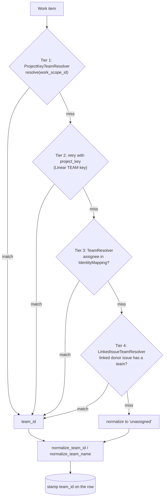
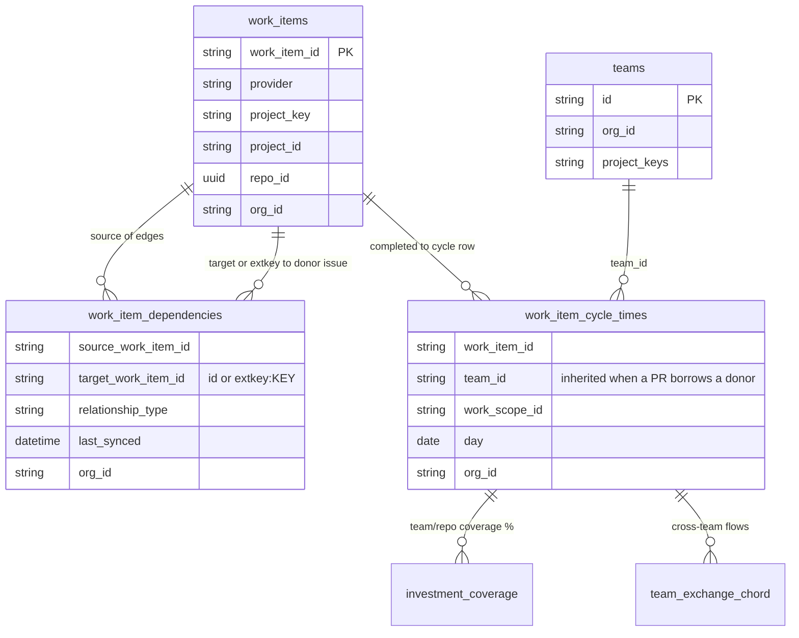
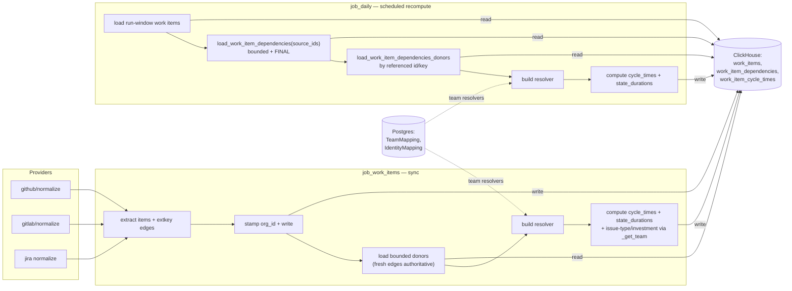
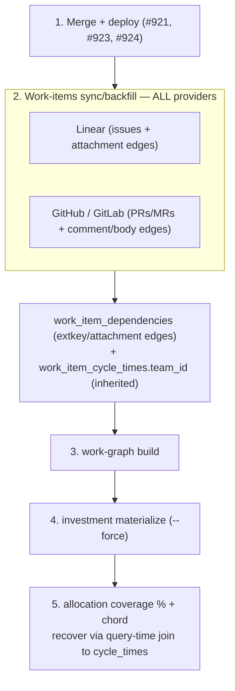

# Architecture: Work-Item Team Attribution & Linked-Issue Inheritance

**Status:** Authoritative
**Scope:** dev-health-ops (metrics/compute, sync, loaders, providers)
**Related:** [data-pipeline.md](data-pipeline.md) (§4 Metrics → Work-item team attribution),
[investment-data-model.md](investment-data-model.md),
[team-catalog-source-of-truth.md](../api/team-catalog-source-of-truth.md)

> First slice of the system-wide architecture-documentation epic. Documents how
> every work item (issue, PR, MR) is stamped with a `team_id`, why PRs used to
> land as `unassigned`, and how cross-provider linked-issue inheritance recovers
> team attribution for the investment **allocation-coverage** and
> **team-exchange chord** views.

## Why this exists

Team resolution historically used three signals — the provider work scope
(repo / project key), the Linear/Jira project key, and assignee membership.
**A GitHub/GitLab PR matches none of them**: its repo rarely maps 1:1 to a
team, it has no project key, and its author often isn't a team member. So PRs
were stamped `team_id = 'unassigned'` and never shared a team dimension with
the issue trackers — leaving TEAM COVERAGE at 0% and the team-exchange chord
empty (no two teams ever co-occur on a work scope).

The fix adds a fourth, **provider-agnostic** tier: a work item with no team of
its own inherits the team of an issue it links to via `work_item_dependencies`.
A GitHub PR closing Linear `CHAOS-2400` borrows that issue's `CHAOS` team.

---

## 1. Attribution cascade (decision flow)

`resolve_base_team()` runs tiers 1–3; the linked-issue resolver is tier 4. The
first match wins and nothing ever overrides a real team.



**Inheritance is gated**, so it never imports a wrong team:
- only **inheritance-safe** relationship types transfer a team
  (`relates_to`, `relates`, `duplicates`, `external_issue_key`); blocking links
  (`blocks` / `blocked_by`) routinely span teams and are ignored;
- a cross-provider `extkey:KEY` that exists in **both** Linear and Jira is
  ambiguous and dropped;
- multiple donors → the lexicographically smallest canonical target wins
  (stable, since ClickHouse rows are unordered);
- per `(source,target)` the **latest** edge by `last_synced` wins, so a flip
  from `relates_to` to `blocked_by` stops inheriting.

---

## 2. Cross-provider link capture & inheritance (sequence)

Edges are captured during sync; the resolver is built once per run and applied
to every work-item metric family.

```mermaid
sequenceDiagram
    autonumber
    participant Prov as Provider API (GitHub/GitLab/Jira)
    participant Norm as Normalizer (providers normalize)
    participant Job as job_work_items (sync)
    participant CH as ClickHouse
    participant Build as build_linked_issue_team_resolver
    participant Comp as compute_work_item_metrics_daily

    Prov->>Norm: issues / PRs / MRs
    Norm->>Norm: extract WorkItems + WorkItemDependency edges
    Note over Norm: PR body magic-words + head branch to extkey:KEY;<br/>keyword sets relationship_type (blocking stays non-inheritable)
    Norm-->>Job: work_items, dependencies
    Job->>Job: stamp org_id on items, transitions AND dependencies
    Job->>CH: write_work_items / write_work_item_dependencies
    Job->>CH: load donor items for fresh-edge targets (bounded, FINAL, org-scoped)
    Job->>Build: work_items (synced plus donors), fresh edges
    Build->>Build: resolve_base_team per item to donor_team map + key_index
    Build->>Build: collapse edges by source,target latest; apply relationship allowlist
    Build-->>Job: LinkedIssueTeamResolver
    loop each day in window
        Job->>Comp: work_items, transitions, linked_issue_resolver
        Comp->>CH: write work_item_cycle_times (team_id stamped)
    end
```

`job_daily` (the scheduled recompute) follows the same build → compute path but
**reads** persisted edges instead of extracting them — see §4.

### Link capture sources & precedence

A PR/MR only inherits a team if an edge to its issue exists. The link is
captured from where it actually lives, in descending order of authority (PR
#924 — the primary/secondary sources; #921 added the tertiary):

| Tier | Source | Trust gate | Edge |
|---|---|---|---|
| Primary | **Linear issue attachment** (the integration's PR/MR link) | integration `sourceType` **AND** allowlisted host (public SaaS + `LINEAR_TRUSTED_SCM_HOSTS`) | `ghpr:…`/`gitlab:… → linear:KEY` (direct id) |
| Secondary | **GitHub PR comment** (the Linear bot's linkback) | exact `linear[bot]` actor (`GITHUB_LINEAR_LINKBACK_BOTS`) + `linear.app` URL | `ghpr:… → extkey:KEY` |
| Tertiary | **PR body / head branch** (the author's own ref) | magic-word / Linear branch convention | `ghpr:… → extkey:KEY` |

The authoritative link runs **Linear → source control** (the issue's attachment
points at the PR/MR), so the edge is emitted with the PR/MR as the *source* and
the team-bearing issue as the *target* — fitting the source-inherits-from-target
resolver unchanged. **Accepted residual:** a trusted org member linking a real
PR to their own issue drives that PR's attribution — the feature working as
intended on collaborative data, not a forgery (same-org analytics, not an authz
boundary).

---

## 3. Data flow & relationships (ER)



The chord and coverage both read `work_item_cycle_times.team_id`. Before
inheritance, PR rows carried `unassigned`, so they never bridged to the issue
trackers' teams; after, a PR's row carries the donor issue's team and the two
providers finally co-occur on a team dimension.

---

## 4. Component & job map (who reads/writes what)

Two jobs build the resolver. Both are **tenant-scoped** (org-wide reads only
under an explicit `org_id`) and **bounded** (never a full-history scan).



**Key boundary differences**

### Manual QA: auto-imported ownership coverage

Use this check when validating CHAOS-2401/2547 against a real tenant. It proves
the sync surface fills the ClickHouse ownership dimensions that the attribution
resolver reads, then verifies the user-visible Investment → Allocation coverage
does not collapse to `unassigned`.

1. In Admin → Sync, create or edit a real Linear work-items sync and enable
   **Auto-import teams, projects & members** (`sync_options.auto_import_teams=true`).
2. Trigger the sync through the sync-config UI or worker-backed trigger endpoint
   so the configured worker credentials are used.
3. After the sync succeeds, run daily metrics with the same analytics database:

   ```bash
   CLICKHOUSE_URI=clickhouse://... dev-hops metrics daily
   ```

4. Open `dev-health-web` in a real browser (Playwright is preferred for evidence)
   and navigate to **Investment → Allocation**.
5. Verify team coverage is greater than 0% and the allocation view includes named
   teams from the Linear import, not only `unassigned`.
6. Optional SQL spot-checks against ClickHouse before opening the browser
   (replace `<org_id>` with the tenant being verified):

   ```sql
   SELECT count() FROM projects WHERE org_id = '<org_id>' AND provider = 'linear';
   SELECT count() FROM members WHERE org_id = '<org_id>';
   SELECT count() FROM team_memberships WHERE org_id = '<org_id>' AND provider = 'linear';
   SELECT count() FROM team_project_ownership WHERE org_id = '<org_id>' AND provider = 'linear';
   SELECT team_id, count() FROM work_item_cycle_times WHERE org_id = '<org_id>' GROUP BY team_id;
   ```

| Aspect | `job_work_items` (sync) | `job_daily` (recompute) |
|---|---|---|
| Edge source | freshly extracted (authoritative) | persisted, `FINAL`, bounded by run-window source ids |
| Removed link | absent on re-extract → stops inheriting | persists until next sync re-stamps (see limitation) |
| Donor items | bounded to fresh-edge targets | bounded to referenced targets |
| Tenant scope | reads only when `org_id` set | reads only when `org_id` set |

> **Known limitation.** `work_item_dependencies` is an append-only
> `ReplacingMergeTree` with no tombstone, so a *removed* link is not deleted. A
> standalone `job_daily` recompute between syncs can keep honoring it until the
> next sync re-extracts the source. A link-lifecycle/tombstone (which also
> affects the work-graph) is a tracked follow-up.

---

## 5. Recovery / backfill runbook

After deploying the inheritance + capture changes, existing orgs need a
**recompute** to populate `team_id` on historical rows — there is **no schema
migration**, only a data replay.

### Why a plain backfill is not enough

The investment **allocation** views derive team at *query time*: the coverage %
and team-exchange chord read `work_unit_investments` and **LEFT JOIN**
`work_item_cycle_times` for `argMax(team_id, …)`. So three things must be true,
and the backfill **runner only re-runs `run_work_items_sync_job` — it does NOT
fan out** to the work-graph or investment jobs (only the live sync path chains
those). They must be triggered explicitly.



### Ordered steps (per affected org)

1. **Merge + deploy** #921 (mechanism), #923 (backfill CLI), #924 (capture).
2. **Backfill all providers** — Linear **and** GitHub/GitLab. Linear-only does
   nothing: the PR/MR rows and their edges come from the git providers, and the
   donor issues come from Linear. A single `--provider all` run (or per-provider
   with Linear synced so its issues are present) writes the edges and recomputes
   `work_item_cycle_times.team_id`. The org is derived from the sync config
   (#923), so `--org` is optional.
3. **Work-graph build**, then
4. **Investment materialize (`--force`)** — these rebuild `work_unit_investments`
   + its `structural_evidence_json.issues` (the coverage join keys); the backfill
   does not trigger them.
5. **Verify & recover** — the coverage % and chord recover automatically via the
   query-time join. Confirm the links were captured:

   ```sql
   SELECT relationship_type_raw, count()
   FROM work_item_dependencies FINAL
   WHERE org_id = {org}
     AND relationship_type_raw IN
         ('linear_attachment', 'github_comment_linear_url', 'external_issue_key')
   GROUP BY relationship_type_raw
   ```

   Zero `linear_attachment` rows after a Linear backfill means the org's issues
   carry no integration PR/MR attachments — there is then no link to inherit
   from, and an empty chord is **correct** (data-driven), not a bug.

> Exact CLI flags vary per command — confirm with `<cmd> --help`. The relevant
> entry points: `sync work-items` / `backfill run` → `run_work_items_sync_job`;
> `work-graph build` → `run_work_graph_build`; `investment materialize` →
> `run_investment_materialize`; `metrics daily` → `run_daily_metrics`.

---

## Source map

| Concern | Location |
|---|---|
| Attribution cascade + resolver builder | `metrics/compute_work_items.py` (`resolve_base_team`, `build_linked_issue_team_resolver`) |
| Resolver type | `providers/teams.py` (`LinkedIssueTeamResolver`, `ProjectKeyTeamResolver`, `TeamResolver`) |
| State-duration parity | `metrics/compute_work_item_state_durations.py` |
| Sync wiring | `metrics/job_work_items.py` |
| Scheduled recompute wiring | `metrics/job_daily.py` |
| Bounded donor/edge loads | `metrics/loaders/clickhouse.py` (`load_work_item_dependencies`, `load_work_item_dependencies_donors`) |
| Linear attachment capture (primary) | `providers/linear/normalize.py` (`extract_linear_dependencies`, `_is_scm_attachment`), `providers/linear/client.py` (`get_issue_attachments`) |
| GitHub comment / body capture | `providers/github/normalize.py` (`extract_github_comment_dependencies`, `extract_github_dependencies`) |
| GitLab capture | `providers/gitlab/normalize.py` |
| Recovery runbook | §5 above; backfill `backfill/runner.py`, investment `workers/work_graph_tasks.py` |
| Tests | `tests/test_linked_issue_team_inheritance.py`, `tests/test_pr_issue_link_capture.py` |
