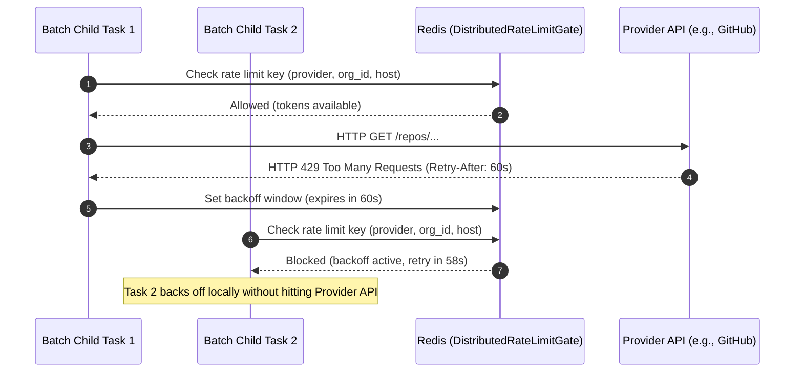
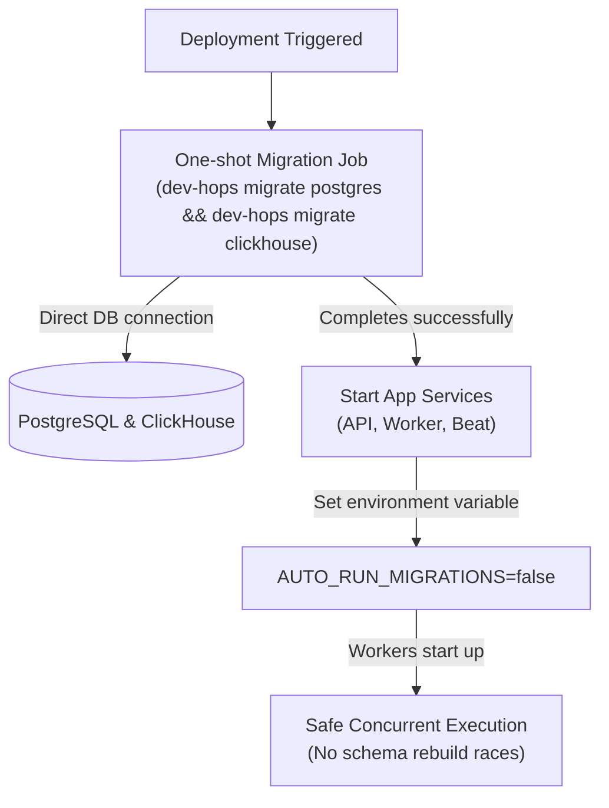
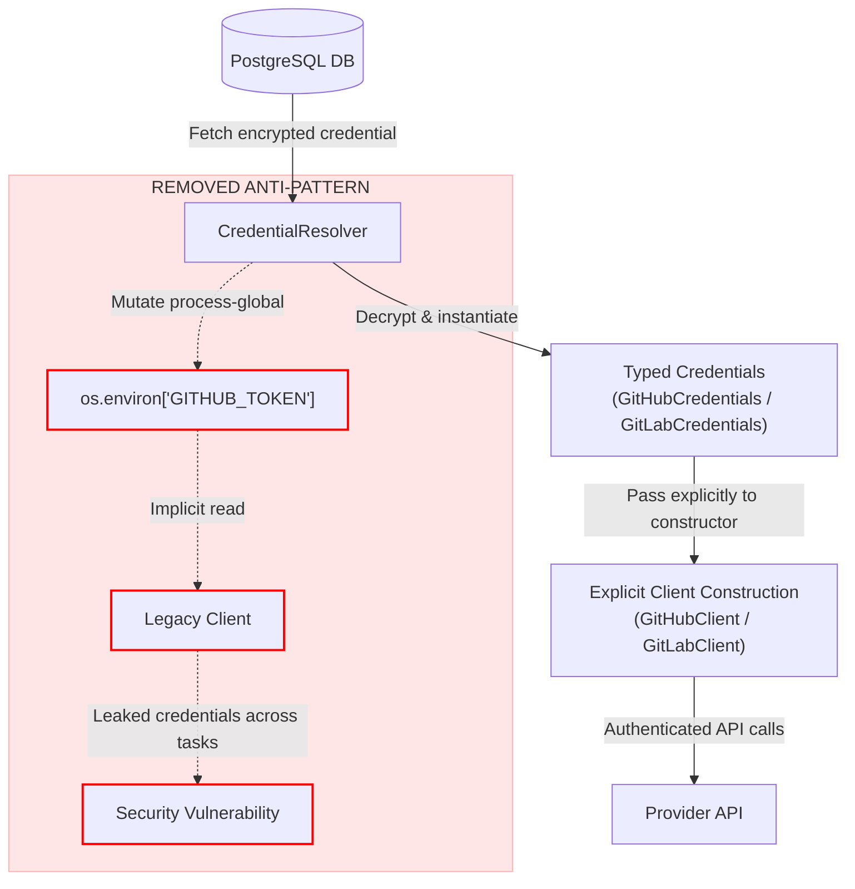
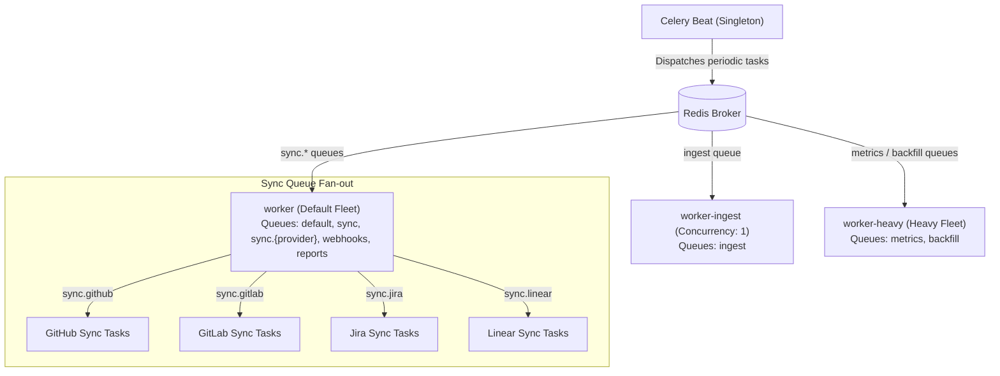

# Architecture: Worker Horizontal-Scaling Readiness

**Status:** Authoritative  
**Scope:** dev-health-ops (workers, deployment, metrics)  
**Related:** [data-pipeline.md](data-pipeline.md), [database-architecture.md](database-architecture.md)

> This document explains the architectural design that makes the Celery worker fleet safe to scale horizontally. It details the four correctness gates preventing race conditions, rate limit exhaustion, schema corruption, and credential leaks when running multiple worker replicas. This work implements the scaling readiness requirements of CHAOS-2305.

---

## Overview of the Four Gates

To run more than one worker replica safely, the system must guarantee that concurrent processes do not conflict. The table below summarizes the risks and the corresponding mechanisms.

| Gate | Risk if Absent | Mechanism |
| :--- | :--- | :--- |
| **1. Dispatch Concurrency** | Double-dispatching sync tasks, leading to duplicate API calls and database writes. | Singleton Celery beat scheduler combined with `SELECT ... FOR UPDATE SKIP LOCKED` row locking. |
| **2. Distributed Rate Limiting** | Rapid rate limit exhaustion across parallel worker processes. | Shared Redis-backed rate limit gate tracking backoff windows per provider and organization. |
| **3. No Ambient Migrations** | Concurrent schema updates causing database corruption or lockups. | One-shot migration job at deploy time, with app services disabling auto-migrations. |
| **4. Explicit Credential Threading** | Credential leakage across sequential tasks in prefork worker processes. | Threading typed credential objects explicitly to clients instead of mutating global environment variables. |

---

## 1. Dispatch Concurrency

### The Risk
If multiple scheduler instances or concurrent worker ticks evaluate the same sync schedule, they might dispatch duplicate sync tasks for the same organization. This double-dispatching wastes API quota, causes database write conflicts, and degrades performance.

### The Mechanism
The system enforces a singleton Celery beat scheduler (exactly one replica) to enqueue the periodic `dispatch_scheduled_syncs` task every 300 seconds. When a worker picks up this task, it queries due jobs using a database transaction. The query selects due `ScheduledJob` rows using `SELECT ... FOR UPDATE SKIP LOCKED`. 

Inside the locked transaction, the worker stamps the `next_run_at` column with the next cron occurrence. If another worker replica attempts to run the dispatch task concurrently, the `SKIP LOCKED` clause ensures it skips the already-locked rows, preventing duplicate dispatches.

```mermaid
sequenceDiagram
    autonumber
    participant Beat as Celery Beat (Singleton)
    participant W1 as Worker Replica 1
    participant W2 as Worker Replica 2
    participant DB as PostgreSQL DB
    participant Broker as Redis Broker

    Beat->>Broker: Enqueue dispatch_scheduled_syncs
    Broker->>W1: Pick up dispatch task
    W1->>DB: SELECT ... FOR UPDATE SKIP LOCKED (due jobs)
    Note over W1,DB: Lock acquired on due ScheduledJob rows
    W1->>Broker: Enqueue run_sync_config / dispatch_batch_sync
    W1->>DB: Update next_run_at & release lock
    
    Note over W2: Concurrent or subsequent tick
    W2->>DB: SELECT ... FOR UPDATE SKIP LOCKED (due jobs)
    Note over W2,DB: Rows already updated or locked; returns empty set
    Note over W2: No tasks enqueued (deduplicated)
```

### Code and Configuration Pointers
* **Scheduler Logic:** `src/dev_health_ops/workers/sync_scheduler.py`
* **Task Definition:** `src/dev_health_ops/workers/tasks.py`
* **Beat Configuration:** `src/dev_health_ops/workers/config.py`
* **Deployment Stacks:** Helm values enforce `beat-deployment` replicas to 1.

---

## 2. Distributed Rate Limiting

### The Risk
When scaling workers horizontally, multiple replicas execute sync tasks in parallel. If each worker tracks rate limits independently, the fleet will quickly exhaust provider API quotas, triggering HTTP 429 responses and blocking syncs.

### The Mechanism
The system routes all provider HTTP requests through a Redis-backed `DistributedRateLimitGate`. This gate uses a shared Redis key structured as `(provider, org_id, host)`. 

When a task encounters an HTTP 429 response, it extracts the `Retry-After` header and records a shared backoff window in Redis. All worker replicas check this gate before making API calls. If a backoff window is active, other workers delay their requests locally without hitting the provider API.



### Code and Configuration Pointers
* **Rate Limit Gate:** `src/dev_health_ops/connectors/utils/rate_limit_queue.py`
* **Provider Clients:** `src/dev_health_ops/providers/*/client.py`
* **Redis Configuration:** `REDIS_URL` environment variable.

---

## 3. No Ambient Migrations

### The Risk
If workers automatically apply database migrations on startup, multiple replicas starting concurrently will attempt to run migrations at the same time. This concurrency leads to schema lockups, duplicate migration attempts, and database corruption.

### The Mechanism
The system separates database migrations from application startup. A one-shot migration job runs `dev-hops migrate postgres && dev-hops migrate clickhouse` before any application services start. 

All long-running application pods (API, workers, beat) run with the environment variable `AUTO_RUN_MIGRATIONS=false`. This setting ensures that workers never attempt to run migrations or modify the database schema during startup.



### Code and Configuration Pointers
* **Migration Command:** `src/dev_health_ops/migrate.py`
* **ClickHouse Sink:** `src/dev_health_ops/metrics/sinks/clickhouse/core.py`
* **Kubernetes Config:** `deploy/kubernetes/configmap.yaml` sets `AUTO_RUN_MIGRATIONS: "false"`
* **Docker Compose:** `deploy/docker-compose/compose.production.yml` sets `AUTO_RUN_MIGRATIONS: "false"`

---

## 4. Explicit Credential Threading

### The Risk
In a prefork worker model, Celery forks worker processes that persist across multiple tasks. If a task mutates the global process environment (e.g., `os.environ["GITHUB_TOKEN"]`), subsequent tasks running in the same process will inherit those credentials. This leakage allows tasks from one organization to access resources belonging to another.

### The Mechanism
The system uses explicit credential threading. Credentials are fetched from the database, decrypted, and instantiated as typed credential objects (e.g., `GitHubCredentials` or `GitLabCredentials`). 

These objects are passed explicitly to the provider client constructors. The clients use the credentials locally without modifying the global process environment. The legacy anti-pattern of injecting tokens into `os.environ` has been removed.



### Code and Configuration Pointers
* **Credential Types:** `src/dev_health_ops/credentials/types.py`
* **Credential Resolver:** `src/dev_health_ops/credentials/resolver.py`
* **Work Items Job:** `src/dev_health_ops/metrics/job_work_items.py`

---

## Payoff: Horizontal Pod Autoscaling (HPA)

Once all four gates are enforced, the worker fleet can scale dynamically. Instead of scaling the entire fleet, Kubernetes Horizontal Pod Autoscalers (HPA) scale specific worker deployments based on queue-depth telemetry.

The system partitions workers into three distinct fleets:
1. **worker (Default Fleet):** Handles general tasks, webhooks, reports, and provider-specific sync queues (e.g., `sync.github`, `sync.gitlab`). HPAs scale this fleet based on the depth of individual provider queues.
2. **worker-ingest:** Dedicated to stream ingestion with a concurrency limit of 1 to preserve message ordering.
3. **worker-heavy:** Handles resource-intensive metrics computation and historical backfills.



---

## See Also

* [Data Pipeline Architecture](data-pipeline.md)
* [Database Architecture](database-architecture.md)
* [Workers & Celery Operations](../ops/workers.md)
* [Deployment Guide](../ops/deployment-guide.md)

