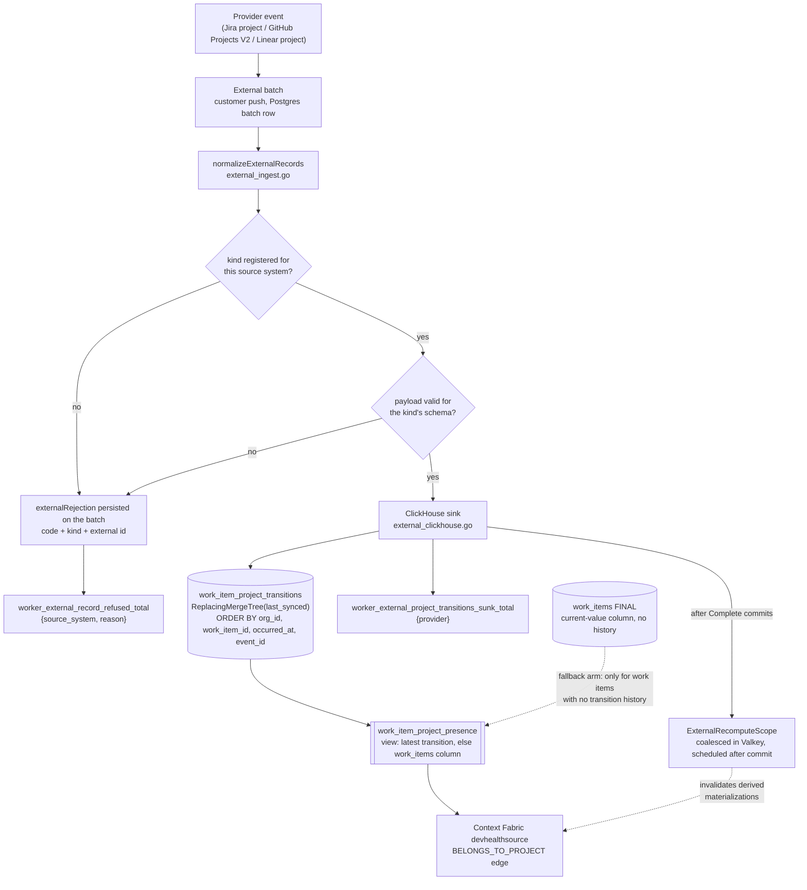
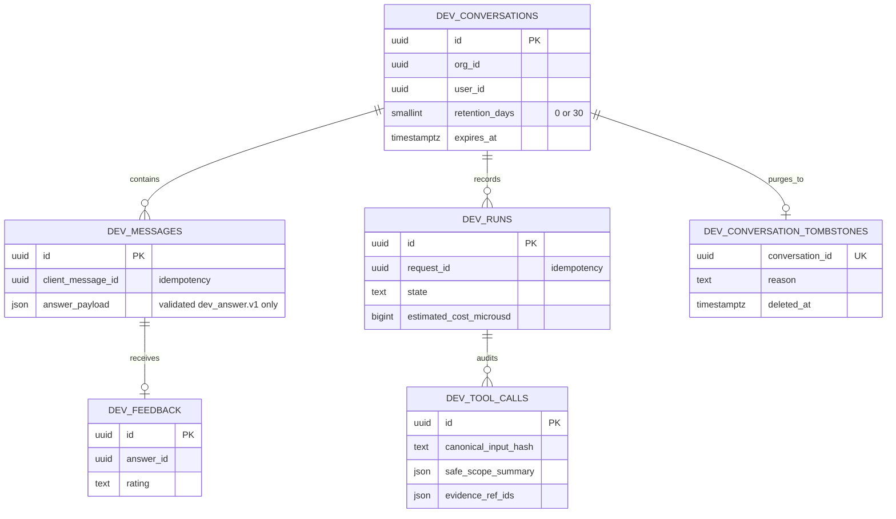

# Data and storage boundaries

Dev Health separates semantic authority, analytics, asynchronous coordination, and execution state. Contributors must preserve those boundaries when adding a provider, job, metric, webhook, or migration.
{: .fc-page-lede }

## Store ownership

- **PostgreSQL** stores organizations, users, settings, encrypted credentials, integration sources, webhook bindings, job/run control state, licensing decisions, operational authority, audit intents, and River execution state.
- **ClickHouse** stores high-volume provider facts, canonical operational events, work items, commits, analytics, and derived materializations.
- **Valkey/Redis** backs Celery queues/results, provider budget coordination, selected streams, and bounded claims.
- **River** is a PostgreSQL-backed execution queue for the additive Go foundation; it is not yet the production owner of current jobs.
- **Domain run tables** remain product-visible execution history. Bounded queue rows are not a replacement for durable domain evidence.

## Python and Go PostgreSQL access

The Python API and Celery runtime use semantic PostgreSQL access. Transaction-mode PgBouncer is supported when prepared-statement behavior is disabled through the configured engine path.

The Go coexistence foundation splits database responsibilities:

- `POSTGRES_URI` — semantic/domain access; transaction-mode PgBouncer is supported;
- `WORKER_DATABASE_URI` — direct PostgreSQL River queue control;
- `MIGRATION_DATABASE_URI` — direct elevated one-shot migration access.

The domain, queue, and migration identities must be distinct. Runtime usernames must match the declared role names. Long-running processes never receive the migration DSN.

## Role boundaries

The domain role can read and write semantic state but cannot administer River or Alembic metadata. The queue role can operate River and relay-owned outbox state but cannot access unrelated semantic tables. The migration role creates and upgrades schema and refreshes grants but is not used by a long-running process.

Readiness checks effective privileges, not merely successful login. A role that can inherit broader authority, create schema objects, or cross the domain/queue boundary fails closed.

## Durable outbox paths

A durable outbox separates a committed domain decision from asynchronous publication.

The generic `worker_job_outbox` path is route-safe:

1. the producer commits a job intent with its domain state;
2. the producer refuses to enqueue unless the checked-in migration route is executable;
3. the Go reconciler claims eligible rows;
4. the relay rechecks route ownership before inserting River work;
5. known Celery-routed rows remain untouched;
6. unknown or invalid kinds terminalize with bounded evidence rather than disappearing.

The domain role can insert and inspect producer-owned rows but cannot forge relay state. The queue role can claim and retire relay-owned state but cannot create producer intent.

Terminal retention treats delivery success and delivery abandonment differently. A delivered row can leave the outbox at the configured horizon. Before a dead row leaves, the same PostgreSQL statement appends a write-once `worker_job_delivery_abandonments` fact containing only the dedupe key, job kind, terminal time, attempt count, and bounded error code. Payload arguments and error detail are not copied. The queue role can append and read these facts but cannot update or delete them; the coordinator can only read them. Domain replay therefore distinguishes a handoff that was never published from one that exhausted its budget even after the full outbox row has expired.

## Canonical incident ordering

PagerDuty REST and webhook events, Customer Push, and future verified providers must use the shared canonical operational identity and ordering contract. A source-specific writer cannot create a parallel correctness protocol.

Webhook authority comes from the persisted binding. Durable deduplication uses bounded source/event identity and raw-body identity. Out-of-order events use the canonical ordering builder and current-row reader.

After the canonical incident contract cutover is admitted, production rollback cannot reintroduce a legacy writer or reader that does not understand the current ordering schema.

## ClickHouse writes

ClickHouse writes must preserve:

- organization and provider-instance scope;
- canonical external identity;
- source and observation timestamps;
- idempotent or replacement semantics appropriate to the table engine;
- raw provider context required for audit without leaking secrets;
- compatibility with current materializations and readers.

A missing provider transition or absent bounded-page result is unknown, not automatically a tombstone.

## Work item to project: provider event to graph edge

A work item's project used to be a plain overwrite column on `work_items`. That
table is a `ReplacingMergeTree` keyed on the work item, so a reassignment
overwrote `project_id` and the previous value was unrecoverable after
compaction: presence was queryable, history never existed. CHAOS-4194 and
CHAOS-4193 replace that with one representation -- an append-only event stream
that presence projects from and validity intervals derive from -- rather than
two parallel stores.

Read this diagram for where a value can be LOST rather than only where it
flows. Three edges below are refusals, and each one exists because the silent
version of it was the actual defect.

Load-bearing properties, and why each is where it is:

- **Refusal, not a silent drop.** An unregistered kind is rejected with
  `unsupported_kind_for_system` and the rejection is persisted on the batch. A
  silent drop and a refusal look identical from the sink side -- zero rows
  either way -- so a producer shipping against an unregistered kind would
  otherwise see a clean successful sync and no data. Registration is per
  `(source_system, kind)`, not global: a kind registered for github and not for
  jira is refused for jira.
- **Dedupe is the engine's job.** `event_id` is in the sorting key, so a
  re-synced provider event collapses under `FINAL` instead of accumulating one
  row per sync. Reads must use `SELECT ... FINAL`.
- **`occurred_at` falls back to `last_synced`,** never to the zero time. It is
  in the sorting key, so a zero would sort every timeless event ahead of all
  real history and the presence projection -- latest transition wins -- would
  answer with the oldest row.
- **The presence fallback is a view arm, not a backfill.** Synthesising
  transition rows for pre-CDC work items would put events into the history
  table that no provider emitted, with a fabricated `event_id` and an
  `occurred_at` that is really just "whenever we happened to sync". CHAOS-4193
  derives validity intervals from that stream, so those rows would become
  invented `ValidFrom` boundaries presented as observed fact. The `source`
  column keeps the two provenances separable.
- **Project is not team.** "Project" here means the provider PROJECT entity
  only. Legacy Jira treated projects as teams; `work_items.native_team_key` is
  a separate axis and no project transition may be derived from, or read as, a
  team transition.
- **Pull requests are refused at the schema boundary.** The table keys on
  `work_item_id` and a PR has no `work_items` row to join. PR-to-project is an
  open shape (CHAOS-4194), not an omission to paper over.

The only cache hop is `ExternalRecomputeScope`: after `Complete` commits the
batch outcome, the scope is handed to the recompute controller, which coalesces
it in Valkey and dispatches downstream recomputation. It is best-effort by
design -- a crash is recovered by the scheduler's pending-scope scan rather
than by replaying already-terminal sink writes -- so a missed schedule delays
derived materializations but never loses a transition row.

## Migration rules

Every migration needs:

- forward schema and data behavior;
- mixed-version compatibility where a rolling deployment requires it;
- an explicit writer/read barrier for incompatible cutovers;
- bounded backfill or copy behavior;
- resumable checkpoints and idempotency evidence;
- role/grant updates;
- health/readiness impact;
- rollback or an explicit no-downgrade decision.

Migrations run through one controlled process. Workers, APIs, and schedulers do not ambient-migrate.

## Tenant isolation

Every identity, dedupe key, outbox row, queue admission, query, and canonical write must preserve organization authority before aggregation. Provider payloads, URL parameters, or guessed namespace names cannot override server-owned organization and source bindings.

## Ask Dev persistence boundary

The `/dev` page and `/dev` application window use one canonical PostgreSQL
conversation service. Every read and write is scoped by server-owned
`org_id + user_id`; clients and model output cannot choose those values.

Retention admission has two independent inputs: the canonical Ask Dev feature
decision controls a never-used installation, while the existence of persisted
conversation state preserves lifecycle cleanup after feature rollback. Contract
route compatibility is a separate gate: a v3 cleanup envelope cannot be
constructed while the active migration producer version is still v2.

Only the validated structured answer crosses the answer persistence seam.
Prompts, provider payloads, chain-of-thought, raw tool results, copied source
evidence, and secrets are forbidden. Retention and explicit deletion cascade
from the conversation; the tombstone is deliberately outside the user and
organization foreign-key graph so account deletion can retain content-free
proof that the purge completed.

Use [Databases and storage](../../operate/configure/databases-and-storage.md) for operator configuration and [Platform architecture](platform.md) for the end-to-end execution path.
