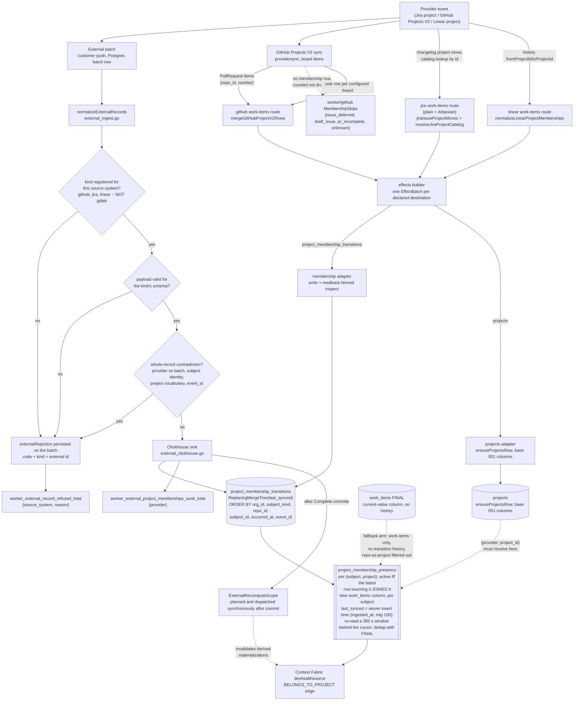
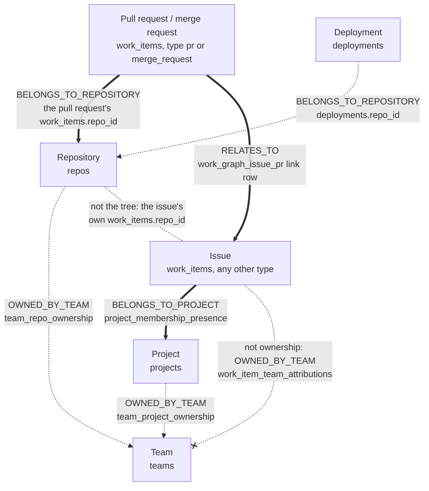
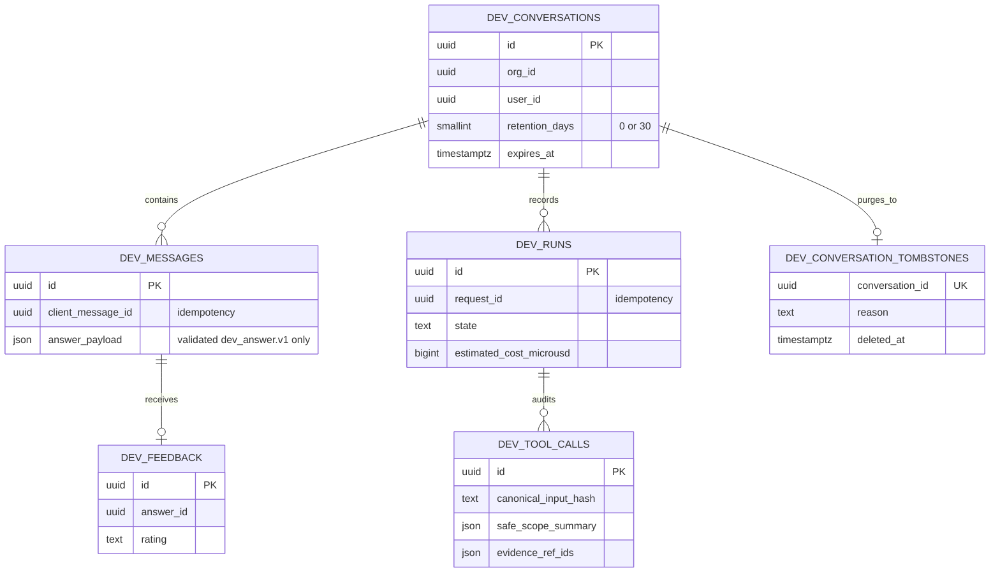

# Data and storage boundaries

Dev Health separates semantic authority, analytics, asynchronous coordination, and execution state. Contributors must preserve those boundaries when adding a provider, job, metric, webhook, or migration.
{: .fc-page-lede }

## Store ownership

- **PostgreSQL** stores organizations, users, settings, encrypted credentials, integration sources, webhook bindings, job/run control state, licensing decisions, operational authority, audit intents, and River execution state.
- **ClickHouse** stores high-volume provider facts, canonical operational events, work items, commits, analytics, and derived materializations.
- **Valkey/Redis** backs provider budget coordination, selected streams, and bounded claims.
- **River** is the PostgreSQL-backed execution queue the Go worker fleet uses for production jobs.
- **Domain run tables** remain product-visible execution history. Bounded queue rows are not a replacement for durable domain evidence.

## PostgreSQL access

The Go api uses semantic PostgreSQL access. Transaction-mode PgBouncer is supported when `PGBOUNCER_TRANSACTION_MODE=true`, which the Go runtime reads as its domain-transaction-pooler setting.

The Go coexistence foundation splits database responsibilities:

- `POSTGRES_URI` — semantic/domain access; transaction-mode PgBouncer is supported;
- `WORKER_DATABASE_URI` — direct PostgreSQL River queue control;
- `MIGRATION_DATABASE_URI` — direct elevated one-shot migration access.

The domain, queue, and migration identities must be distinct. Runtime usernames must match the declared role names. Long-running processes never receive the migration DSN.

## Role boundaries

The domain role can read and write semantic state but cannot administer River or Alembic metadata. The queue role can operate River and relay-owned outbox state but cannot access unrelated semantic tables. The migration role creates and upgrades schema and refreshes grants but is not used by a long-running process.

Readiness checks effective privileges, not merely successful login. A role that can inherit broader authority, create schema objects, or cross the domain/queue boundary fails closed.

## Durable outbox paths

A durable outbox separates a committed domain decision from asynchronous publication.

The generic `worker_job_outbox` path is route-safe:

1. the producer commits a job intent with its domain state;
2. the producer refuses to enqueue unless the checked-in migration route is executable;
3. the Go reconciler claims eligible rows;
4. the relay rechecks route ownership before inserting River work;
5. rows whose route is not executable remain untouched;
6. unknown or invalid kinds terminalize with bounded evidence rather than disappearing.

The domain role can insert and inspect producer-owned rows but cannot forge relay state. The queue role can claim and retire relay-owned state but cannot create producer intent.

Terminal retention treats delivery success and delivery abandonment differently. A delivered row can leave the outbox at the configured horizon. Before a dead row leaves, the same PostgreSQL statement appends a write-once `worker_job_delivery_abandonments` fact containing only the dedupe key, job kind, terminal time, attempt count, and bounded error code. Payload arguments and error detail are not copied. The queue role can append and read these facts but cannot update or delete them; the coordinator can only read them. Domain replay therefore distinguishes a handoff that was never published from one that exhausted its budget even after the full outbox row has expired.

## Canonical incident ordering

PagerDuty REST and webhook events, Customer Push, and future verified providers must use the shared canonical operational identity and ordering contract. A source-specific writer cannot create a parallel correctness protocol.

Webhook authority comes from the persisted binding. Durable deduplication uses bounded source/event identity and raw-body identity. Out-of-order events use the canonical ordering builder and current-row reader.

After the canonical incident contract cutover is admitted, production rollback cannot reintroduce a legacy writer or reader that does not understand the current ordering schema.

## ClickHouse writes

ClickHouse writes must preserve:

- organization and provider-instance scope;
- canonical external identity;
- source and observation timestamps;
- idempotent or replacement semantics appropriate to the table engine;
- raw provider context required for audit without leaking secrets;
- compatibility with current materializations and readers.

A missing provider transition or absent bounded-page result is unknown, not automatically a tombstone.

### Work item comments: `work_item_interactions`

The sorting key is `(org_id, work_item_id, occurred_at, interaction_type, interaction_id)`. `interaction_id` is the provider's own comment id (Jira, GitHub, GitLab and Linear all write it), so two comments of one work item in the same millisecond are two rows. A comment the provider sends without an id is skipped and counted (`providersync.interaction.comment_missing_id`, a class label and no body); it is never written with an empty id.

An empty `interaction_id` marks a **legacy row**, written before the key carried the id, and nothing else. The legacy row of a comment and the keyed row of the same comment have different keys and are never merged. So a reader never counts comments from the table: it reads the view `work_item_interactions_current`, which is the documented reader contract. The view applies `FINAL`, and hides a legacy row once any keyed row exists in its slot `(org_id, work_item_id, occurred_at, interaction_type)`. A legacy row with no keyed row in its slot stays visible, and `is_legacy_id` marks it. A slot that held several comments and was only partly re-fetched shows only the re-fetched ones: the rest is missing, not invented.

The old collapse lost comments for good: the second of two same-millisecond comments was never stored. Only fetching that comment from the provider again, with the new writer, brings it back, as a keyed row. This change fetches nothing by itself and makes no promise that any sync mode finds old comments: which comments a sync fetches depends on its window, and a window that does not reach the comment's work item does not fetch it. Repairing old data is an operator task, one backfill per integration over the window to repair, run after the migration and the release are on every pod. It is tracked apart from this change, with its own proof.

Migration `107_work_item_interactions_comment_id.sql` is one `ALTER` and the view. The column is added with no `DEFAULT` (ClickHouse refuses a column with a default expression in the sorting key) and the key is extended in the same statement. It must be applied before a pod that writes `interaction_id` runs; an old pod's insert (no `interaction_id` in its column list) still works and writes a legacy row. A prepared snapshot stored by the previous release has interaction rows without an id: a new pod that replays one refuses it with `ErrPreviousReleaseSnapshot`, and the unit fails on its first attempt as `previous_release_snapshot` (no retry); the scope's next run is a new unit with a new snapshot. If the old pod had already written those rows (as legacy rows), the replay reads them back as exact and the unit succeeds.

### Measure capability: `work_item_measure_capability`

`work_item_metrics_daily` stores `bug_completed_ratio` and `story_points_completed` as non-null numbers, so a stored `0` cannot say whether the work was measured and came to zero or the provider does not track the measure. `work_item_measure_capability` (migration `111_work_item_measure_capability.sql`) holds that answer apart, for each organization, provider and measure, so a reader can answer "not applicable" instead of `0`.

- **Writer.** The daily metrics job, finalize family `work_item_measure_capability` (`internal/jobs/metrics/daily/work_item_measure_capability.go`): once for each daily run, after every partition, because the answer is the organization's and not a partition's. The rule is one function, `workitemmetrics.DeriveMeasureCapability`, beside the daily triplet's `ComputeDailyTriplet`. The sync writes no row: since CHAOS-8811 the daily job is the one writer of the derived work-item tables, and a sync unit holds only the items of its own window, which cannot show that a provider does *not* track a measure.
- **Observation, not configuration.** The family reads every work item of the organization, from every repository, in a 90-day window that ends on the run's target day: an item created before the window ends that is not done, or was completed in the window, each item counted once. `story_points_completed` is tracked (`tracked = 1`) when one of the provider's items there has story points (Jira's configured story-points field, GitLab's weight, Linear's estimate, a number field of a GitHub Projects v2 board); `bug_completed_ratio` is tracked when one of them has the type `bug`. Otherwise `tracked = 0`. `evidence_count` is the number of items that carry the measure and `item_count` the number of the provider's items in the window.
- **Missing is unknown.** A provider with no item in the window gets no row. A reader reads a missing row as unknown, never as `0` and never as "not tracked".
- **Reader contract.** The sorting key is `(org_id, provider, measure, window_end)`: a run for an old day adds the answer of its own window and never replaces a newer one. The reader contract is **exact day**: the answer for day D is the row with `window_end = D`, deduplicated with `argMax` on `computed_at` (merges are eventual). No row with `window_end = D` means unknown for D; a reader never falls back to an earlier window's row, because that would present "no items in D's window" as an old answer.

The acr reader that turns this into "not applicable" is CHAOS-7505.

### Change-failure counts: `repo_change_failure_daily`

Change failure rate is the share of deployments linked to an incident, and it needs incident evidence: a repository that deploys and has no incident tied to it is **unknown**, not `0%`. `repo_change_failure_daily` (migration `112_change_failure_rate_incident_basis.sql`) stores the inputs for each repository and day, and one rule, `internal/jobs/metrics/changefailure`, turns summed inputs into a rate.

- **Columns.** `deployments_count`; `failed_deployments_native` and `failed_deployments_heuristic` (deployments with at least one deployment-incident link, by the best tier of their links); `incidents_direct` and `incidents_via_deployment` (incidents that started on the day, by how they tie to the repository).
- **Writer.** The daily metrics job, family `repo_user_commit` (`internal/jobs/metrics/daily/change_failure_native_clickhouse.go`). It loads the day's deployments and the incidents that started on the day with the loaders of the `work_graph_edges` family, and derives the links with that family's own extraction function. It does not read `work_graph_deployment_incident_edges` for the same day, because `work_graph_edges` runs after `repo_user_commit`. Today the extraction is heuristic only: an incident links to every deployment of its repository on its day.
- **Incident ties.** Direct: a current, active `operational_service_repository_mappings` row for the incident's service. Via deployment: only for an incident with no direct tie, a stored link row with no `repo_id` ties the incident to the repository of its deployment. A deployment id that names more than one repository of the organization ties nothing; the writer counts and logs it.
- **Missing is not zero.** A repository and day with no deployment and no incident gets no row. A repository with counts but no commit or pull-request activity gets a row here and none in `repo_metrics_daily`.
- **Reader contract.** Keep the newest `computed_at` per `(org_id, repo_id, day)`, sum the counts over the view's window and repositories (a team is its owned repositories), then apply the rule. A reader that serves the rate reads the sums and the number of stored rows (`changefailure.ViewSumsSQL`) and calls `changefailure.Evaluate`, which returns the value, its state and the weakest contributing link tier together: no stored row is no state, no deployments is not applicable, no incident is unknown, else failed / deployments. `/explain` (`rate_state`, `link_tier`), Home and the operating review (`rateState`) serve the state, so the three empty answers stay apart at the surface. A reader that only ranks or draws (contributors, drivers, the Home series, flow opportunities, report charts) uses `changefailure.WindowRateSQL`, which is `NULL` for every state that is not measured, and leaves such a group or bucket out. Never average daily rates.
- **Retraction.** The table keeps the newest row per key and cannot drop one. A run therefore writes, for its partition and day, a row for every repository with something to count and a row of zeros for every repository that already has a stored row for the day and has nothing to count now (a deleted incident, a service mapping that moved, a deployment that is gone). Zeros read as not applicable, the same as no row. A repository that never had a row and has nothing to count gets none.
- **`repo_metrics_daily`, expand step.** Migration 112 only adds. `change_failure_rate_incident` (`Nullable(Float64)`) holds the incident-based one-day value. `revert_rate` (`Nullable(Float64)`) is reverted / merged pull requests; it is `NULL` on every row until a revert detector exists (nothing measures it yet). A reader of either deduplicates with `(argMax(tuple(col), computed_at)).1` or `LIMIT 1 BY`; a bare `argMax` skips a `NULL` and returns an older value.
- **DEPRECATED: `repo_metrics_daily.change_failure_rate`** (CHAOS-9017 drops it). It stays `Float64`, not nullable, with its old meaning: the legacy revert ratio, denominator forced to 1. The writer keeps writing it, so a pod of the release before this change, and a rollback to it, read the same type and the same values as before. No reader of this release takes change failure rate from it. No reader of this release takes revert rate from it either: the reverted count behind it was always 0.
- **Deployment failure rate.** The DORA writer names the deployment-status ratio (failed runs / deployments) `deployment_failure_rate` in `dora_metrics_daily`; a job scope that still names `change_failure_rate` selects it. **DEPRECATED: the stored rows with `metric_name = 'change_failure_rate'`** (CHAOS-9017 renames or deletes them). Migration 112 does not touch them, and no reader of this release selects a DORA row by that name.
- **Report charts.** A chart of `change_failure_rate` is `changefailure.WindowRateSQL` over the newest counts of each bucket (`internal/jobs/report`, `chartRules`): the same number the other surfaces give for that window, never the deprecated column and never an average of stored one-day values. The exported metric registry still names `repo_metrics_daily` for the metric; the chart result names the table it reads.
- **No ops reader of `change_failure_rate_incident`.** The one-day column is written for readers outside this repository (acr); every reader here uses the counts table.

### Pull request rework counts on `repo_metrics_daily`

The pull request rework ratio counts reviewed pull requests only: a pull request with no review data is not a "no rework" pull request. Migration `114_pr_rework_ratio_review_basis.sql` adds the inputs to `repo_metrics_daily` as counts, and one rule (`internal/jobs/metrics/prrework`) turns the counts of a view into a value and a state. Definition: [metric definitions](../../reference/metrics/definitions.md#pull-request-rework-ratio).

- **Columns.** `prs_merged_reviewed` (merged pull requests of the day with review evidence, of a provider that has a changes-requested event), `prs_merged_rework` (of those, with a changes-requested review), `prs_merged_no_rework_signal` (merged pull requests of a provider with no such event), all `Nullable(UInt32)`; `pr_rework_ratio_reviewed` (`Nullable(Float64)`), the one-day value. `prs_merged` is the count the table always had.
- **Writer.** The daily metrics job, family `repo_user_commit`: `repouser.ApplyPRRework` after the ported compute. The provider of each repository is read from `repos` (`internal/jobs/metrics/daily/pr_rework_native_clickhouse.go`), and whether that provider can store a changes-requested review is asked of the provider layer's declaration (`providerfoundation.EmitsPullRequestReviewState`); the metric names no provider. A repository with no `repos` row has no known provider and counts as "no rework signal".
- **Expand step only.** The migration only adds columns and rewrites no stored row. A row written before it, or by a pod of the release before it, holds `NULL` in every new column: not measured, never a measured `0`.
- **Reader contract.** Keep the newest `computed_at` per `(org_id, repo_id, day)` as a WHOLE row, sum the counts over the view's window and repositories, then apply the rule (`prrework.ViewSumsSQL` and `prrework.Evaluate`, or `prrework.WindowRateSQL`). The counts are Nullable and `argMax` skips a `NULL` argument, so a reader that takes each column with its own `argMax` would mix the counts of two versions of a day: take the row with `LIMIT 1 BY`, or `argMax(tuple(column), computed_at)`.
- **DEPRECATED: `repo_metrics_daily.pr_rework_ratio`.** It stays `Float64`, not nullable, with its old meaning (changes requested / ALL merged pull requests, `0` when nothing merged). The writer keeps writing it. No reader of this release reads it.

## Project membership: provider event to graph edge

A work item's project used to be a plain overwrite column on `work_items`. That
table is a `ReplacingMergeTree` keyed on the work item, so a reassignment
overwrote `project_id` and the previous value was unrecoverable after
compaction: presence was queryable, history never existed. A pull request had
it worse -- `git_pull_requests` carries no project columns at all, so a PR's
board membership was nowhere in the graph even as a current value. CHAOS-4194
and CHAOS-4193 replace both with one representation -- an append-only event
stream that presence projects from and validity intervals derive from -- rather
than parallel stores per subject.

Read this diagram for where a value can be LOST rather than only where it
flows. Five edges below are refusals, and each one exists because the silent
version of it was the actual defect. The reachability of the whole path is
CHAOS-4222.

```mermaid
flowchart TD
    P["Provider event<br/>(Jira project / GitHub Projects V2 / Linear project)"]
    G["GitHub Projects V2 sync<br/>providersync, board items"]
    RE["github work-items route<br/>mergeGitHubProjectV2Rows"]
    JI["jira work-items route<br/>(plain + Atlassian)<br/>jiraIssueProjectMoves + resolveJiraProjectCatalog"]
    LI["linear work-items route<br/>normalizeLinearProjectMemberships"]
    EB["effects builder<br/>one EffectBatch per declared destination"]
    AD["membership adapter<br/>write + readback-fenced inspect"]
    AC["projects adapter<br/>ensureProjectsRow, base 051 columns"]
    GS["worker/github MembershipSkips<br/>{issue_deferred, draft_issue, pr_incomplete, unknown}"]
    PJ[("projects<br/>ensureProjectsRow, base 051 columns")]
    B["External batch<br/>customer push, Postgres batch row"]
    N["normalizeExternalRecords<br/>external_ingest.go"]
    K{"kind registered for<br/>this source system?<br/>github, jira, linear -- NOT gitlab"}
    V{"payload valid for<br/>the kind's schema?"}
    C{"whole-record contradiction?<br/>provider vs batch, subject identity,<br/>project vocabulary, event_id"}
    R["externalRejection persisted on the batch<br/>code + kind + external id"]
    M["worker_external_record_refused_total<br/>{source_system, reason}"]
    S["ClickHouse sink<br/>external_clickhouse.go"]
    T[("project_membership_transitions<br/>ReplacingMergeTree(last_synced)<br/>ORDER BY org_id, subject_kind, repo_id,<br/>subject_id, occurred_at, event_id")]
    MS["worker_external_project_memberships_sunk_total<br/>{provider}"]
    PR[["project_membership_presence<br/>per (subject, project): active iff the latest<br/>row touching it JOINED it<br/>else work_items column, per subject<br/>last_synced = server insert time (ingested_at, mig 100):<br/>re-read a 300 s window behind the cursor, dedup with FINAL"]]
    W[("work_items FINAL<br/>current-value column, no history")]
    CF["Context Fabric devhealthsource<br/>BELONGS_TO_PROJECT edge"]
    RC["ExternalRecomputeScope<br/>planned and dispatched synchronously after commit"]

    P --> B --> N
    P --> G
    P -- "changelog project move,<br/>catalog lookup by id" --> JI
    P -- "history fromProjectId/toProjectId" --> LI
    G -- "PullRequest items<br/>(repo_id, number)" --> RE
    G -. "no membership row,<br/>counted not dropped" .-> GS
    G -- "one row per configured board" --> RE
    RE --> EB
    JI --> EB
    LI --> EB
    EB -- "project_membership_transitions" --> AD
    EB -- "projects" --> AC
    AD --> T
    AC --> PJ
    N --> K
    K -- "no" --> R
    K -- "yes" --> V
    V -- "no" --> R
    V -- "yes" --> C
    C -- "yes" --> R
    C -- "no" --> S
    R --> M
    S --> T
    S --> MS
    T --> PR
    W -. "fallback arm: work items only,<br/>no transition history,<br/>repo-as-project filtered out" .-> PR
    PJ -. "(provider, project_id)<br/>must resolve here" .-> PR
    PR --> CF
    S -- "after Complete commits" --> RC
    RC -. "invalidates derived<br/>materializations" .-> CF
```

Load-bearing properties, and why each is where it is:

- **Refusal, not a silent drop.** An unregistered kind is rejected with
  `unsupported_kind_for_system` and the rejection is persisted on the batch. A
  silent drop and a refusal look identical from the sink side -- zero rows
  either way -- so a producer shipping against an unregistered kind would
  otherwise see a clean successful sync and no data. Registration is per
  `(source_system, kind)`, not global: a kind registered for github and not for
  jira is refused for jira.
- **Dedupe is the engine's job.** `event_id` is in the sorting key, so a
  re-synced provider event collapses under `FINAL` instead of accumulating one
  row per sync. Reads must use `SELECT ... FINAL`. It is content-determined --
  a native provider id where one exists, else a hash of the identity and
  destination tuple plus `occurred_at` -- so a re-sync recomputes the same value
  and two distinct events cannot share one. Two records asserting one `event_id`
  with different content are refused within a batch rather than left for `FINAL`
  to choose between arbitrarily.
- **`occurred_at` must come from the provider.** It is in the sorting key, so a
  sink-supplied timestamp differs on every re-sync of the same event: the keys
  differ, `FINAL` keeps both, and the table accumulates one row per sync of a
  single reassignment. The sink cannot invent a value stable across re-syncs;
  only the producer can, so an event without one is refused. This deviates from
  CHAOS-4194's provisional "else `last_synced`" default, which was written
  before the interaction with the sorting key was noticed, and Context Fabric
  ratified the deviation on 2026-08-24. The github board producer satisfies it
  with the board item's own `createdAt` -- the time the subject was added to the
  board -- which is both the real membership event time and stable across
  re-syncs.
- **The presence fallback is a view arm, not a backfill.** Synthesising
  transition rows for pre-CDC work items would put events into the history
  table that no provider emitted, with a fabricated `event_id` and an
  `occurred_at` that is really just "whenever we happened to sync". CHAOS-4193
  derives validity intervals from that stream, so those rows would become
  invented `ValidFrom` boundaries presented as observed fact. The `source`
  column keeps the two provenances separable.
- **Project is not team.** "Project" here means the provider PROJECT entity
  only. Legacy Jira treated projects as teams; `work_items.native_team_key` is
  a separate axis and no project transition may be derived from, or read as, a
  team transition.
- **Pull requests are a first-class subject, and were the missing half.** A PR
  board item was fetched fully hydrated and then discarded by the normalizer
  with no counter and no log, so PR-to-project existed nowhere. `subject_kind`
  now carries the shape: a work item keys on `(repo_id, work_item_id)`, a pull
  request on `(repo_id, number)`, mirroring the fabric identity registry's own
  natural keys. A PR still never becomes a `work_items` row -- only its
  membership is recorded. Its `changes` history inside a board remains
  discarded; that is CHAOS-4221.
- **The subject declaration must be POSITIVE.** `subjectKind` is required with a
  closed enum because the sink branches its entire identity derivation on it. An
  earlier build refused PRs by rejecting the value `"pr"`, and a PR payload need
  only omit the field to fall through to the issue-shaped derivation and be
  accepted.
- **gitlab is deliberately unregistered.** GitLab's own "project" concept IS
  this schema's `repo_id`, so a gitlab producer could only ever write a
  repo-derived id, which resolves to no `projects` row. There is no correct
  gitlab row to admit, so the registry refusal is the fail-closed guard and the
  refusal is recorded rather than discovered later as edges that join to
  nothing.
- **Three things are called "project" and only one belongs here.** The external
  ingest path writes the REPOSITORY full name into `work_items.project_id` for
  github and gitlab; the Projects V2 route mints the real entity
  `ghprojv2:<org>#<n>`; legacy Jira treated projects as teams. The sink refuses
  the repo-as-project value with `unresolvable_project_entity`, and the presence
  view's column arm filters it out again on the read side -- that arm reads rows
  written long before this kind existed, which never passed the sink's check.
- **Presence is keyed per (subject, PROJECT), not one project per subject.** A
  subject holds several memberships at once -- a GitHub pull request sits on as
  many boards as someone adds it to -- so each transition row names the project
  LEFT in `from_project_id` and the project JOINED in `to_project_id`, and
  TOUCHES up to two memberships. A membership is active when the last thing that
  happened to it was joining it. An earlier shape `argMax`'d one project per
  subject and failed in the direction that hurts: removing the subject from its
  latest board made the transition arm yield nothing and the column arm's
  anti-join suppress the fallback, so a PR still on board A vanished entirely
  because it had left board B. One incomplete answer became no answer, and a
  missing edge reads as "not a member" rather than "ask again".
- **A removal must name the board it left.** `(P, "")` retires membership P;
  `(P, Q)` is a move carried in ONE row, which is what lets the view retire P
  and create Q from a single observed event instead of making a consumer pair up
  two rows and guess whether a missing partner means "not synced yet" or "never
  happened". `("", "")` is REFUSED -- under the older per-subject keying it meant
  "removed from everything", but per-project it names nothing, so it could not
  retire or create any membership and would sit in the history looking like a
  removal that silently did nothing. A destination key with NO id is refused
  too; an id with no key is normal, since a GitHub board has a number and a
  title and no key at all.
- **The column arm stays per SUBJECT and is excluded on ANY transition row.**
  `work_items.project_id` holds one current value with no history, so it can
  only ever describe a single membership. Mixing that history-less value into a
  per-project answer would invent a membership nobody observed, so a subject
  with any observed history is answered by that history, whole.
- **The effects hop is where the rows were lost the SECOND time,** and it is
  drawn because a diagram that stops at the fetch result would have hidden it
  exactly as the tests did. The route merges the producer's rows, the effects
  builder serializes one `EffectBatch` per DECLARED destination, and each
  destination has a ClickHouse adapter that both writes and reads its row back.
  A family with no declared destination is not a degraded write — it is silence:
  the rows are built, merged, and never serialized. That is what happened to
  both families here until this change, one layer past the normalizer that used
  to drop them. The declaration list is owned by `workitemcontract`, and the
  sink refuses to write anything at all while any destination lacks an adapter,
  so a half-wired family fails closed instead of quietly writing fifteen of
  seventeen tables.
- **The destination list is per-consumer, and gitlab is excluded, not
  everyone else.** The published capability matrix advertises a destination
  set per provider, so adding these to the shared list would have told other
  teams that gitlab writes project memberships — a provider whose "project"
  concept IS `repo_id` and which is refused for the kind by construction.
  github, jira, and linear each advertise two more than the shared
  work-item family (CHAOS-4194 for github; CHAOS-4193 for jira and linear,
  producing directly from Jira's own project-move changelog and Linear's own
  issue history — not through the `External batch` path above); the Linear
  expired-lease retry policy still advertises two fewer, because no
  retry-safety proof exists for it yet.
- **Linear and Jira write a creation-time ADD (CHAOS-7361).** The history
  must be complete from the item's creation: the acr touch reader skips a
  first touch that is a REMOVE or a move P→Q as an orphan (CHAOS-7349). The
  producer therefore writes one `("", P)` row at the provider's creation time
  when the project history does not already begin with the add. P is the
  FIRST project of the history (a first move P→Q means P, not the current
  project), the item's current project when the history has no project row,
  and no row at all when the first row is `("", P)` (created without a
  project, added later). `occurred_at` is the provider creation time at
  millisecond precision (equal to `work_items.created_at`); `event_id` is the
  content hash, so a re-sync writes the same sorting key and
  `ReplacingMergeTree` collapses it. Skipped, each counted and logged with its
  reason: history not fetched (Linear), creation time unparseable (never the
  sync clock), creation time not before the first history row. The sync
  result also counts items whose history ends in a project other than
  `work_items.project_id`. GitHub is unchanged (its ADD is written at
  first-seen sync time by the snapshot diff); GitLab is not registered for
  this kind. Only the wired Jira route (`JiraAtlassianRouteHandler`, full
  paged changelog) writes the row. There is no backfill: an item gets its ADD
  the next time it is re-fetched. **Behaviour change in
  `project_membership_presence`:** the column arm is excluded for any subject
  with a transition row, so an item that gains its ADD moves from
  `source = 'work_item_column'` to `'transition'`; project_id and project_key
  stay the same, `observed_at` becomes the creation time and `last_synced`
  the new ingest time.
- **`projects` rows are ensured by the producer.** GitHub Projects V2 wrote no
  `projects` row anywhere before CHAOS-4194 -- the fetcher stamped the id onto
  work items and the entity it named was never created -- so every github
  membership would have been filtered out by the vocabulary constraint.
  `ensureProjectsRow` writes the base 051 columns and converges on re-sync,
  because `projects` is a `ReplacingMergeTree` keyed `(org_id, provider, id)`.
- **The subject id is derived from the record's own `repositoryExternalId`,**
  matching `work_item.v1`. Deriving from the batch pointer alone -- which is
  what the older `work_item_transition.v1` does -- gives a different id whenever
  the source instance is an org and the records name org/repo, producing a
  well-formed row that joins to nothing.
- **A record may not claim a provider its batch did not come from.** Project
  ids are provider-scoped, so a jira project id inside a github batch resolves
  against the wrong catalogue. The schema enum cannot see this: it validates the
  field in isolation, and the contradiction exists only relative to the pointer.

`ExternalRecomputeScope` has no cache hop: after `Complete` commits the
batch outcome, the scope is handed to the recompute controller, which plans
and dispatches downstream recomputation synchronously, in the same call. It
is best-effort by design -- a dispatch failure is logged, never raised, and
a crash before that point is recovered by the scheduler's pending-scope scan
rather than by replaying already-terminal sink writes -- so a missed
dispatch delays derived materializations but never loses a transition row.

## Entity tree: repositories, pull requests, issues, projects

Every integration places delivery work in one tree: **Repository <> Pull
request <> Issue <> Project**. A pull request or merge request is itself a
work item (type `pr` or `merge_request`); an issue is a work item of any other
type. Teams and deployments hang off the tree. Each edge below is the
relationship name the graph uses, with the table that supplies it.

```mermaid
flowchart TB
    REPO["Repository<br/>repos"]
    PR["Pull request / merge request<br/>work_items, type pr or merge_request"]
    ISSUE["Issue<br/>work_items, any other type"]
    PROJ["Project<br/>projects"]
    TEAM["Team<br/>teams"]
    DEP["Deployment<br/>deployments"]

    PR ==>|"BELONGS_TO_REPOSITORY<br/>the pull request's work_items.repo_id"| REPO
    PR ==>|"RELATES_TO<br/>work_graph_issue_pr link row"| ISSUE
    ISSUE ==>|"BELONGS_TO_PROJECT<br/>project_membership_presence"| PROJ
    REPO -.->|"OWNED_BY_TEAM<br/>team_repo_ownership"| TEAM
    PROJ -.->|"OWNED_BY_TEAM<br/>team_project_ownership"| TEAM
    DEP -.->|"BELONGS_TO_REPOSITORY<br/>deployments.repo_id"| REPO
    REPO x-.-|"not the tree: the issue's<br/>own work_items.repo_id"| ISSUE
    ISSUE -.-x|"not ownership: OWNED_BY_TEAM<br/>work_item_team_attributions"| TEAM
```

Every issue tracker and every code host writes these same rows; no edge is
specific to one provider.

- **Thick edges** are the tree. A repository's issues are the issues linked to
  its pull requests; a project's repositories are reached through its issues'
  linked pull requests.
- **Dotted edges** hang off the tree: a team owns a repository or a project,
  and a deployment belongs to a repository.
- **Crossed edges** exist but are never tree membership.

Two rules hold for every read of the tree:

1. The issue <> pull request link of record is the table
   `work_graph_issue_pr`. Each row carries a `provenance` tier, ranked
   **native > explicit_text > heuristic**. All three tiers count as links.
   A consumer names the tier it read and never presents a lower tier as
   native. An issue-key prefix by itself, an unresolved external key, an
   issue's own repository column, or a team's repositories is never the
   relation.
2. A team is reached through ownership only (`team_repo_ownership`,
   `team_project_ownership`), never through person membership or a computed
   attribution.

3. A project has one id. The catalog row (`projects.id`), the ownership row
   (`team_project_ownership.project_id`) and the issue (`work_items.project_id`)
   name the same project by the same value, so ownership reaches a project's
   issues by `(provider, project_id)` with no join on the project key. The id
   is the provider's own stable id, never a value built from the project key:
   a key can be renamed, and a key-built id names a project no issue points
   to. The id each provider writes, and the one provider that does not hold
   the rule yet, are listed in
   [Work-item team attribution](team-attribution.md), section 0.4b.

How each provider captures the pull request ↔ issue link is described in
[Work-item team attribution](team-attribution.md), section 2.

## Migration rules

Every migration needs:

- forward schema and data behavior;
- mixed-version compatibility where a rolling deployment requires it;
- an explicit writer/read barrier for incompatible cutovers;
- bounded backfill or copy behavior;
- resumable checkpoints and idempotency evidence;
- role/grant updates;
- health/readiness impact;
- rollback or an explicit no-downgrade decision.

Migrations run through one controlled process. Workers, APIs, and schedulers do not ambient-migrate.

## Tenant isolation

Every identity, dedupe key, outbox row, queue admission, query, and canonical write must preserve organization authority before aggregation. Provider payloads, URL parameters, or guessed namespace names cannot override server-owned organization and source bindings.

## Ask Dev persistence boundary

The `/dev` page and `/dev` application window use one canonical PostgreSQL
conversation service. Every read and write is scoped by server-owned
`org_id + user_id`; clients and model output cannot choose those values.

Retention admission has two independent inputs: the canonical Ask Dev feature
decision controls a never-used installation, while the existence of persisted
conversation state preserves lifecycle cleanup after feature rollback. Contract
route compatibility is a separate gate: a v3 cleanup envelope cannot be
constructed while the active migration producer version is still v2.

```mermaid
erDiagram
    DEV_CONVERSATIONS ||--o{ DEV_MESSAGES : contains
    DEV_CONVERSATIONS ||--o{ DEV_RUNS : records
    DEV_RUNS ||--o{ DEV_TOOL_CALLS : audits
    DEV_MESSAGES ||--o| DEV_FEEDBACK : receives
    DEV_CONVERSATIONS ||--o| DEV_CONVERSATION_TOMBSTONES : purges_to

    DEV_CONVERSATIONS {
        uuid id PK
        uuid org_id
        uuid user_id
        smallint retention_days "0 or 30"
        timestamptz expires_at
    }
    DEV_MESSAGES {
        uuid id PK
        uuid client_message_id "idempotency"
        json answer_payload "validated dev_answer.v1 only"
    }
    DEV_RUNS {
        uuid id PK
        uuid request_id "idempotency"
        text state
        bigint estimated_cost_microusd
    }
    DEV_TOOL_CALLS {
        uuid id PK
        text canonical_input_hash
        json safe_scope_summary
        json evidence_ref_ids
    }
    DEV_FEEDBACK {
        uuid id PK
        uuid answer_id
        text rating
    }
    DEV_CONVERSATION_TOMBSTONES {
        uuid conversation_id UK
        text reason
        timestamptz deleted_at
    }
```

Only the validated structured answer crosses the answer persistence seam.
Prompts, provider payloads, chain-of-thought, raw tool results, copied source
evidence, and secrets are forbidden. Retention and explicit deletion cascade
from the conversation; the tombstone is deliberately outside the user and
organization foreign-key graph so account deletion can retain content-free
proof that the purge completed.

Use [Databases and storage](../../operate/configure/databases-and-storage.md) for operator configuration and [Platform architecture](platform.md) for the end-to-end execution path.
