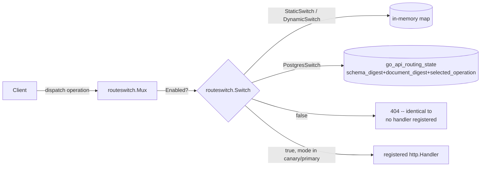

# Go API Wave 0: proof infrastructure

No GraphQL resolver moves from Python to Go until this exists (plan §5,
§6). Wave 0 builds two pieces of durable infrastructure covered here: the
signed effective-principal envelope the Python edge issues to `query-api`,
and the operation rollout registry + proof ledger that will gate every
future cutover. It does not port any resolver, and nothing on a live
request path calls either piece yet.
{: .fc-page-lede }

## Effective-principal envelope

`query-api` (Go) does not independently re-derive auth state from
Postgres/Valkey. chris's ruling (CHAOS-4379, 2026-08-27): the Python edge
issues a short-lived, audience-bound, SIGNED envelope that reproduces the
`graphql/authz.py` + `graphql/app.py` + `services/auth.py` contract —
disabled-user and token-version revocation, org-switch membership, active
impersonation, and tier fallback are all part of it, not a bare JWT
signature check.

```mermaid
sequenceDiagram
    participant Client
    participant Edge as Python edge (FastAPI)
    participant Auth as AuthService.authenticate_access_token<br/>(DB-backed: disabled, token_version)
    participant Envelope as principal_envelope.issue_effective_principal_envelope
    participant QueryAPI as query-api (Go)

    Client->>Edge: request + user access JWT
    Edge->>Auth: authenticate_access_token(token)
    Auth-->>Edge: AuthenticatedUser (or None: reject)
    Edge->>Envelope: issue_effective_principal_envelope(user, tier, licensed_features)
    Envelope-->>Edge: signed envelope (EdDSA/Ed25519, TTL default 60s, aud=query-api)
    Edge->>QueryAPI: proxied/compared request + envelope
    QueryAPI->>QueryAPI: principal.Verifier.Verify(token)
    Note over QueryAPI: keyFunc looks up kid in JWKS via<br/>dev-health-go authverify.Ed25519JWKSVerifier;<br/>jwt.WithValidMethods(["EdDSA"]) blocks alg confusion
    QueryAPI->>QueryAPI: check iss, aud, exp (WithExpirationRequired), v (schema version)
```

`cmd/query-api/internal/principal` (`Verifier`, `Claims`) is this diagram's
Go half — verified end-to-end against a real Python-issued envelope, not
just self-consistent Go-only fixtures. It rejects: wrong audience, wrong
issuer, an expired or `exp`-less envelope, an unknown `kid`, a signature
from any key not in the JWKS, `alg` other than `EdDSA` (alg-confusion), and
a `v` this verifier was not written to handle (`ErrUnsupportedSchemaVersion`).

### Claim schema (versioned, `v`)

The envelope's `v` claim is bumped whenever a claim is added, removed, or
its meaning changes. A verifier must reject an envelope whose `v` it was
not written to handle — the semantics above are expected to evolve before
`query-api` ever verifies a real request.

**v1** (current):

| Claim | Type | Meaning |
|---|---|---|
| `v` | int | Claim schema version (`1`) |
| `sub` | string | User id |
| `org_id` | string | Active org for this request |
| `role` | string | User's role in `org_id` |
| `is_superuser` | bool | Platform superuser flag |
| `is_superuser_verified` | bool | Superuser bit re-verified against the DB this request (mirrors `AuthenticatedUser.is_superuser_verified`) |
| `permissions` | string[] | Full resolved permission set (`services.permissions.get_user_permissions` — impersonation-aware: if impersonating, this is the TARGET role's permissions, not the real user's) |
| `token_version` | int | The token-version value that passed revocation check this request |
| `tier` | string | Resolved license tier (`services.licensing.resolve_org_tier` — `OrgLicense.tier` wins, else `Organization.tier`, else community) |
| `licensed_features` | string[] | Feature keys the org currently has access to |
| `impersonated_by` | string \| null | Real user id, when an admin/superuser is impersonating |
| `impersonation_active` | bool | Whether impersonation is active for this request |
| `iss` | string | `dev-health-ops-edge` (env-overridable) |
| `aud` | string | `query-api` (env-overridable per verifier) |
| `iat` / `exp` | int (unix) | Issued-at / expiry — default TTL 60s |
| `jti` | string | Unique per envelope |

There is deliberately **no `disabled` claim**. A disabled/deactivated user
never reaches the issuer: `authenticate_access_token` already treats a
deactivated user as unauthenticated (returns `None`), so no envelope is
minted for them at all. Absence of a valid envelope IS the disabled
signal — the same shape the existing Python-only contract already uses.

### Key management

EdDSA/Ed25519, asymmetric, and **separate from** the user-facing
access-token HS256 secret (`JWT_SECRET_KEY`). The envelope crosses a
process and language boundary (Python edge → Go `query-api`), so it uses
the same JWKS-based verification shape `acr/internal/auth` already uses for
its own web-assertion verification — `query-api` never holds a secret
capable of forging a user session token, only the public key needed to
verify an envelope. `build_envelope_jwks()` returns the public JWKS
document; the private key is `GO_API_ENVELOPE_PRIVATE_KEY` (PEM, Ed25519),
required at issuance time. Ed25519, not RS256 (reconciled 2026-08-27 per
CHAOS-4377): the dev-health-go `authverify` package's JWKS verifier
(`Ed25519JWKSVerifier`) is Ed25519-only by design.

## Operation rollout registry + proof ledger

Three Postgres tables (alembic `0114`), keyed by
`(schema_digest, document_digest, selected_operation)`:


`CANDIDATE_BUILD` is immutable and append-only. `ROUTING_STATE` is the one
mutable row per operation triple a future request router reads on every
call — a rollback mutates `current_candidate_build` in place, never an
image rollback (plan §5). `PROOF_RUN` is pinned to the *exact* candidate
build it proved via a full 4-column composite foreign key, never a bare
`candidate_build` string match, so a proof can never be silently
reattributed to a later build (plan §8.3).

Python access layer: `src/dev_health_ops/api/graphql/go_api_registry.py`
(`lookup_routing_state`, `register_candidate_build`, `record_proof_run`),
instrumented in `go_api_registry_telemetry.py`
(`devhealth_go_api_registry_lookup_total`,
`devhealth_go_api_candidate_build_registered_total`,
`devhealth_go_api_proof_run_recorded_total`).

## Route switch (reachability gate)

Plan §6's "cited constructor is not proof of capability" lesson, applied
to route reachability: a registered handler in `query-api`'s `Mux` is not
proof an operation is reachable. Only `Switch.Enabled(operation)` being
true, checked on every dispatch, makes it reachable.



`PostgresSwitch` (`cmd/query-api/internal/routeswitch/postgres_switch.go`)
is the `go_api_registry`-backed `Switch` plan §6 forward-declared —
implementing the same interface `StaticSwitch`/`DynamicSwitch` already do,
not a redesign of it. It treats only `mode IN ('canary', 'primary')` as
reachable: `shadow` deliberately does NOT count (the client still gets
Python's response in shadow mode, plan §5 stage 4), and a missing row, a
query error, or an operation with no registered document digest all
resolve to the same safe default as an unregistered operation —
unreachable. Proven against a real Postgres testcontainer
(`postgres_switch_integration_test.go`, `go test -tags integration`),
including the rollback direction: flipping `mode` away from
`canary`/`primary` revokes reachability on the very next read, with no
separate deploy (plan §5: "rollback is a registry change, not an image
rollback").

## Canonical SDL pin

`contracts/graphql/v1/schema.graphql` is the CI-checked export of the
Strawberry schema — see `contracts/graphql/v1/README.md` for how web
codegen and `query-api`'s gqlgen consume it, and the drift gate
(`tests/api/graphql/test_schema_sdl_pinned.py`) that fails on any
divergence.

## When the schema digest moves

Every `go_api_routing_state` row is keyed by `schema_digest`. Change
`contracts/graphql/v1/schema.graphql` by one byte and the digest changes,
which means **every existing routing row instantly stops matching** — the
Python dispatcher's `lookup_routing_state` misses, `PostgresSwitch.Enabled`
returns false, and every request is served by Python.

That behaviour is correct: a missing row is the documented safe default.
The danger is that it is also **silent**, and indistinguishable from "no
operation has been enabled yet".

### What this cost, once

On 2026-09-01, twelve routing rows were seeded by hand between 12:26Z and
14:39Z — all `mode=canary`, `rollout_percentage=100`, `owner=go`, pointing
at candidate build `78fc68815` — at digest
`sha256:67b87d38…`. At 13:39Z that same day, PR #2065 (`33b3f3f21d`,
"Widen TimeseriesBucket.value SDL nullability to match Go's `*float64`")
changed the SDL, moving the digest to `sha256:29d509cd…`.

All twelve rows died at that moment. Zero operations were served by Go.
Nothing logged it, nothing counted it, no test covered it, and the rows
still looked perfectly healthy in `psql`. It was found six days later, by
hand.

### The rule

**Routing rows follow the deployed image, not your checkout.** `query-api`
embeds its own copy of the SDL (`go:embed`) and computes
`digest.Schema(schemav1.SDL)` from it; the Python edge reads
`contracts/graphql/v1/schema.graphql` from disk. They agree only while the
running image and the checkout carry the same SDL. Writing rows from a
checkout that has moved ahead of the deployed image produces rows the
running binary can never read — exactly the failure above.

So: **rebuild and deploy `query-api` first, re-enable second.** Never the
other way round.

### Recovery procedure

```bash
# 1. What does each plane think the digest is, and which rows are alive?
dev-hops go-api routing status --query-api-url http://query-api:8080

# 2. If the planes disagree, STOP: rebuild/redeploy the query-api image
#    from this SDL. `enable` will refuse until they agree, by design.

# 3. Re-enable against the deployed build. --candidate-build is the ops
#    commit sha the running image was built from.
dev-hops go-api routing enable \
  --operations all-registered \
  --candidate-build <ops-sha-the-image-was-built-from> \
  --mode canary

# 4. Confirm every operation reads MATCH, and none reads UNPROVEN
#    unless you deliberately acknowledged that.
dev-hops go-api routing status
```

`enable` refuses (exit 2, writing nothing) when query-api is unreachable,
when the two planes' digests disagree, when the running binary does not
register an operation or registers it under a different document digest,
or when no admissible proof run exists for the candidate build: a
`deployed_executed` run bound to the serving build per request that ended
in `match`, or in a `mismatch` whose every difference is cited against a
declared Python baseline defect (primary also requires the edge route).
The last of these is waivable with `--acknowledge-unproven`, which logs
one warning per row and makes `status` report those rows as `UNPROVEN` for
as long as they are in force.

On success `enable` names, for every proven row, the receipt that
authorized it -- its id, terminal state, citations (for a cited mismatch),
route, binding and what the citation covered by finding shape
(`covered[null=7 value=384] outside[]`, as `go-api-prove` records it in the
receipt's provenance) -- on stdout (and in `--json`), on an
`INFO: go_api_routing.enabled` line on stderr, and in the routing row's
`review_evidence` (`proof_receipt=<id> ...`). A `match` admission and a
cited-`mismatch` admission print different lines.

### After alembic 0129: every earlier proof reads UNPROVEN until re-proven

The enablement rule requires `build_binding = 'per_request'` on every
receipt, and rows written before 0129 carry `build_binding` NULL. So the
moment 0129 is applied, **every operation proven before it reads UNPROVEN**
on `dev-hops go-api routing status` and on the migration-status page, and
`routing enable` refuses it -- including operations whose old receipt was a
sound `match`. Nothing is lost from the table; the old receipts stay as
history. Re-run `go-api-prove` at the deployed build (JOB 6's re-prove step
does exactly this) and the new receipts, bound per request, restore the
proofs. Do not `--acknowledge-unproven` around it.

### The same procedure with the Go verbs (CHAOS-5486)

`cmd/go-api-routing` is the Go implementation of the same contract, built
because the cutover rule forbids new Python compute on the critical path
of a rollout operation. The Python verbs above are UNTOUCHED and still
work; these are the ones to reach for on a Go-only fleet, and they are the
only ones that can re-point a `shadow` row.

```bash
# A typed -postgres-uri flag value reaches /proc/<pid>/cmdline and shell
# history, the same leak class this package's own bindPostgresURI guard
# closes for the usage TEXT -- so this recipe, the operator's document of
# record, follows the same rule. The binary already falls back to the
# POSTGRES_URI environment variable on its own (main.go) -- set it in the
# environment and omit the flag entirely.
export POSTGRES_URI=<dsn>

# 1. Same question. Never refuses, works with query-api down.
go-api-routing status -registry-url http://query-api:8090/registry

# 2. Re-enable. NOTE the difference that matters: there is no
#    -candidate-build to type. The build is READ from the deployed
#    process's authenticated /buildinfo; -expect-build is a cross-check
#    that can only FAIL a run, never the source of what is written. The
#    credential is the effective-principal ENVELOPE in
#    GO_API_ROUTING_BEARER -- an env var, not a flag, because a flag value
#    reaches `ps` and shell history.
GO_API_ROUTING_BEARER=<envelope> go-api-routing enable \
  -registry-url  http://query-api:8090/registry \
  -buildinfo-url http://query-api:8090/buildinfo \
  -operations    all-registered \
  -mode          canary \
  -recorded-by   <who> \
  -review-evidence '<why>'

# 3. Roll back. Contacts NOTHING -- no registry, no buildinfo, no
#    credential -- because it has to work when the planes disagree and the
#    deployed process is down. -candidate-build here is a GUARD ("refuse
#    if somebody repointed this since I looked"), never written.
go-api-routing disable \
  -operations all-registered -mode python        # dry run, writes nothing
go-api-routing disable \
  -operations all-registered -mode python -apply \
  -recorded-by <who> -review-evidence '<why>'

# 4. Provenance only: point rows at the running build without touching a
#    single column that decides reachability. This is the verb the Python
#    pair cannot express -- `enable --mode` accepts only canary|primary,
#    and `disable` never writes the build -- so a shadow row could not be
#    re-pointed at all before it existed.
GO_API_ROUTING_BEARER=<envelope> go-api-routing repoint ... -dry-run
```

This is every point where the Go verbs deliberately behave differently
from the Python ones. Every one is a tightening or an observability
improvement, never a silent behaviour change, and the rule stands:
anything else that differs from the Python verbs is a defect, not a
decision.

* **The candidate build cannot be typed.** `enable --candidate-build` in
  Python is documented "by CONVENTION, unverified"; the fifteen live rows
  carry a sha nothing ever checked. The Go verb reads it from
  `/buildinfo` and refuses when the process cannot identify its build.
* **`disable` keys its UPDATE on the row's OWN document digest**, not the
  catalog's. A row whose document digest has drifted from the catalog is
  still turned off; in Python that write silently matches nothing. An
  off-ramp that stops working precisely when something has drifted is an
  off-ramp with a hole in it.
* **`-recorded-by` and `-review-evidence` are required on every write.**
  Python derives `recorded_by` from `$DEV_HOPS_OPERATOR` / `$SUDO_USER` /
  `$USER` and falls back to the literal `unknown`, and it permits an
  absent reason for a proven enablement. A rollout decision attributed to
  `unknown` with no reason is the state this whole surface exists to end.
  This PR writes both durably on the current row's own provenance
  columns; an append-only audit row carrying the same two fields on every
  write, independent of the current row, arrives with CHAOS-5505 (the
  audit PR that follows this one).
* **`disable` never refuses the WHOLE run over one operation's per-row
  guard state -- a stale schema digest, or a `-candidate-build` guard
  named against an operation whose only live-digest rows are DEAD (no
  catalog document digest)** -- refusing here would contradict this
  verb's own documented contract of working when the planes disagree.
  Either state is SKIPPED for that operation alone, reported on its own
  plan line, so the documented rollback recipe (`-operations
  all-registered -mode python`) can still turn everything else off when
  one operation's rows are stale or dead to this checkout. Because
  something was still skipped, the run exits non-zero (2) even though
  the healthy operations were disabled -- an operator sees both facts:
  what moved, and what needed a second look. **This is a declared
  divergence from Python, in the STRONGER direction**: on the identical
  fixture, Python's guarded `-operations all-registered` also exits 2,
  but its plan LISTS the dead-only operation as if it would move, then
  silently leaves it untouched at apply time and blames a misattributed
  cause ("their candidate build moved between the plan and the write").
  Go never lists a row it will not touch as moving, and names the real
  reason (no catalog row to check the guard against) instead of a
  generic race that did not happen.
* **`-candidate-build` passed as an explicitly empty value is refused**,
  not silently treated as "no guard" -- an empty value reads identically
  to the flag never being passed at all otherwise, which would apply an
  unguarded write when an operator's script meant to guard it (e.g. an
  interpolated but unset shell variable).
* **The write verbs' `-registry-url`/`-buildinfo-url` pair is resolved
  TOGETHER, not independently.** Naming one explicitly while the other
  falls back to `GO_API_QUERY_API_URL` (or nothing) can silently split a
  single preflight across two different processes; only both-explicit or
  neither is accepted.
* **`status`'s `reachable` field is tri-state (`true`/`false`/`null`, not
  a plain bool) and carries a `reachable_reason` naming the actual cause**
  -- the row's own mode, the row's own digest_state, a schema-level
  mismatch, a per-operation document-digest mismatch, or "the go plane
  could not be reached" -- rather than requiring a JSON consumer to
  cross-reference several other fields by hand to learn why.
* **`status` never refuses**, even on an UNUSABLE (not merely unset)
  `GO_API_QUERY_API_URL` inherited from the environment: it reports
  `go_plane_error` and still prints everything that needed no registry
  call (the local schema digest, the database census).
* **`<verb> -h`/`-help` exits 0**, printing that verb's usage text, the
  same as this binary's own top-level `-h` and Python's argparse --  not a
  refusal (exit 2).
* **A dead database exits 1, matching Python.** Python's
  `disable`/`enable`/`repoint` against a dead database crash with an
  unhandled `ConnectionRefusedError`, exit 1; `connectPostgres`'s
  dial-failure path classifies the same way. A malformed DSN (a
  parse-time failure, the operator's own typo) is unaffected and stays
  exit 2.
* **`status -json`'s key names match Python's exactly**:
  `python_plane_schema_digest` and
  `python_plane_digest_error` (always `null` -- computing this value has
  no runtime failure mode in Go, present for key-set parity only), not
  the earlier `local_schema_digest` with no digest-error key at all.
  `catalog_error` and `classification_error` remain Go-only additions
  Python has no equivalent read for.

`disable` also turns off **every** row an operation has at the live
digest, not one of them. The routing primary key is `(schema_digest,
document_digest, selected_operation)`, so one operation can have several
rows under different document digests; leaving one behind would report
success while the operation stayed reachable.

**Only one of those rows is ever reachable**, and `status` says which. The
edge resolves a request to an operation through the catalog and then looks
the row up by the *catalog's* document digest — so a row at the live
schema digest under any other document digest is dead in exactly the way a
row at a stale schema digest is dead. `status` reports it as `STALE`,
never `MATCH`, never reachable, and names its digest under
`unreachable_document_digests`. A row that is present in `psql` and can
never be consulted is the CHAOS-5416 shape; only the column that moved is
different.

**Endpoint URLs are refused if they carry userinfo, a query or a fragment,
and what the command actually uses is rebuilt from scheme, host and path.**
`GET /registry` and `GET /buildinfo` are two fixed routes authenticated by
a header, so none of those components has a legitimate use — and
`goapiproof.FetchRegistry` interpolates the URL it is handed into its
error text, so anything carried in one is printed verbatim on a transport
failure. Three variants of that leak exist: userinfo; the no-`//` form,
where Go parses the *username* as the scheme and `url.Redacted()` returns
the password unchanged; and a query string -- so the check is an
allowlist over URL components rather than a list of shapes to reject.

The residual, stated rather than left implicit: **a credential placed in a
path segment is not distinguishable from the route itself** and would
still reach that error text. Do not put one there. It closes fully when
`internal/goapiproof` stops interpolating raw URLs, which is tracked
against the lane that owns that file.

`status` also keeps the per-digest **census** and the per-operation
**classification** as separate failures. They are separate reads, and
collapsing them meant a classification error printed "registry database
UNREACHABLE" and suppressed a census that had already succeeded — hiding
the one number that says whether anything is enabled at all.

The refusal exit code is 2 (a state the operator must resolve), on both
planes, with one exception. `classifyWriteError` in `main.go`
distinguishes a genuine, server-raised failure from a hand-authored
refusal at the one place `enable`/`repoint`/`disable` reach the database
write: a `*pgconn.PgError` -- a deadlock abort (SQLSTATE 40P01), a
trigger's `RAISE EXCEPTION`, any other
error the POSTGRES SERVER itself raised inside an already-open
transaction -- now exits **1**, via `errInternal`/`internal()`. Everything
else the binary can produce (a missing flag, a malformed DSN, a guard
mismatch, an unproven operation, `connectPostgres`'s own dial/auth
failures) is still an operator-actionable refusal and stays **2**. An
unrecovered Go panic still exits 2 by the runtime's own default, not 1 --
that gap is real and unclosed. A script written to "1 means the server
itself broke, 2 means fix your input" now reads a genuine deadlock
correctly; one written to "1 means crashed" still needs to know a panic is
the one exception.

Every Go routing write also appends to `go_api_routing_audits`
(CHAOS-5505, alembic 0129), in the SAME transaction as the routing write:
one row per operation, sharing a `correlation_id` per invocation. The
routing row's own `recorded_by` / `review_evidence` is overwritten by the
next write; this table is append-only, so it is where "who moved this, and
when" survives.

It is a dedicated table rather than a widening of `worker_operator_audits`.
chris ruled that one belongs to the sync → worker operator plane
("this column is definitely for syncs to pass to workers"), and its
`principal_type` is pinned to a credential class issued and validated
there. Borrowing a table because its column names happen to fit is how two
unrelated things become impossible to aggregate separately later.

| verb | `action` | `credential_class` | `principal_id` |
|---|---|---|---|
| `enable` | `enable` | `effective_principal_envelope` | the envelope's `sub` |
| `repoint` | `repoint` | `effective_principal_envelope` | the envelope's `sub` |
| `disable` | `disable` | `operator_direct` | NULL |
| `status` | — writes no row — | | |

`credential_class` uses the **Auth Control Plane's** vocabulary
(`contracts/auth/v1/credential-classes.schema.json` is the closed
registry). `effective_principal_envelope` is the class_id that project's
Wave 0 threat model proposes for the envelope; registering it in that
contract is tracked separately, against the paused Auth Control Plane
project. `disable` is `operator_direct` because it verifies no credential —
it contacts nothing by design — and recording a weaker claim accurately
beats recording a stronger one nothing checked.

`principal_id` and `recorded_by` answer **different questions** and both
are recorded. `principal_id` is who the *credential* says is acting: the
envelope's `sub`, a user id, read only after `/buildinfo` has answered 200
— which is the deployed verifier accepting that exact token. This command
never verifies the envelope itself; one validator per credential class is
the Auth Control Plane's rule, and `cmd/query-api/internal/principal` is
that validator. `recorded_by` is what the operator typed about themselves,
verified by nothing, and required on every row. The pairing CHECK makes the
distinction structural: an envelope-class row MUST name a subject, an
`operator_direct` row MUST NOT.

Each row also carries the routing key (`schema_digest`, `document_digest`,
`selected_operation`) and the **before and after** of both
`candidate_build` and `mode`. That last pair is what turns two contracts
into something a reader can check rather than take on trust: a `repoint`
row shows the same mode on both sides (it never touches reachability), and
a `disable` row shows the same candidate build on both sides (it changes
mode only).

Only rows that ACTUALLY moved are audited: a `repoint` that finds every row
already naming the running build writes no audit rows, and a `disable`
naming an operation with no row audits nothing for it. An entry for an
unchanged row would record a change that did not happen, in a table nothing
can later correct.

There is deliberately **no foreign key** to `go_api_routing_state`: the
audit table must outlive the row it describes.

### How this is now detected

| Signal | Where | Fires when |
|---|---|---|
| `go_api_routing.rows_stale` (ERROR log) | Python edge startup (`api/_lifespan.py`) | Rows exist, none at the live digest |
| `devhealth_go_api_routing_digest_drift_total{result="stale"}` | Python edge startup | Same condition, as a scrapeable counter |
| `query-api: ROUTING ROWS STALE` (log) | `query-api` route construction | Same condition, on the Go plane |
| `devhealth_go_api_dispatch_fallback_total{reason="no_routing_row"}` | Python edge, per request | A dispatch-eligible request found no row |
| `ci/check_go_api_routing_digest.py` | CI | The SDL moved without updating the pin and this table |

`empty` (nothing enabled) is deliberately reported as a *different* result
from `stale` (everything enabled is dead). The two look identical from
outside — no traffic reaches Go either way — and mean opposite things.

### Schema-digest history

Update this table in the SAME change that moves the SDL.
`ci/check_go_api_routing_digest.py` fails if
`contracts/graphql/v1/schema-digest.json` names a digest that does not
appear here.

| Digest | In force from | Moved by | Notes |
|---|---|---|---|
| `sha256:67b87d38e46f767511b5d8435ffbfdd7dbe8aeab9dbe4073c7d7706de572f706` | before 2026-09-01 | superseded by `33b3f3f21d` | The twelve 2026-09-01 rows were seeded here and died the same day |
| `sha256:29d509cd414cd957a7bcd73a1c0e78a07f17dd8a8794893233954aaa87241b88` | 2026-09-01 | `33b3f3f21d` (#2065, widen `TimeseriesBucket.value` nullability) | Current |

## Float comparison: engine nondeterminism and the Tier-B rule

ClickHouse merges partial aggregate states in thread-completion order and
float addition is non-associative, so the same aggregate over the same
rows returns different last-bit values run to run — on BOTH planes. Over
5,000,000 `Float64` rows (CH 26.7.6.57): 20 identical `stddevPop` runs gave
9 distinct values, `avg` gave 4, `max_threads=1` gave 1. Evidence:
`lane-scratch/lane-goapi-parity/5451/ch-float-aggregate-nondeterminism.txt`.
Comparing such a field exactly manufactures a mismatch on a correct pair of
planes — which the 2026-09-07 enablement harness did — and is not a flake.

CHAOS-4381 parity rule 3 is therefore a committed per-operation Tier-B
table (`internal/goapiproof/operations.go`, beside `volatile_fields`): a
leaf deriving from a ClickHouse FLOAT aggregate compares at 1e-9 relative;
integer aggregates, constants and stored columns stay Tier A (exact); an
entry matching no compared field **fails the run**.

## Status

As of 2026-08-27, every Wave 0 deliverable exists and is tested: the
envelope issuer and its Go verifier (`principal.Verifier`, cross-checked
against a real Python-issued envelope), the registry/ledger schema and its
`PostgresSwitch` reader, the SDL pin, the switch-gated-reachability empty
scaffold, and the comparator (CHAOS-4366 deliverable 5, CHAOS-4381 signed
off 2026-08-27 19:44 PT). None of these is wired into a live request
path yet — that is a later wave, per plan §6's Wave-0 scope ("no
user-facing porting").
