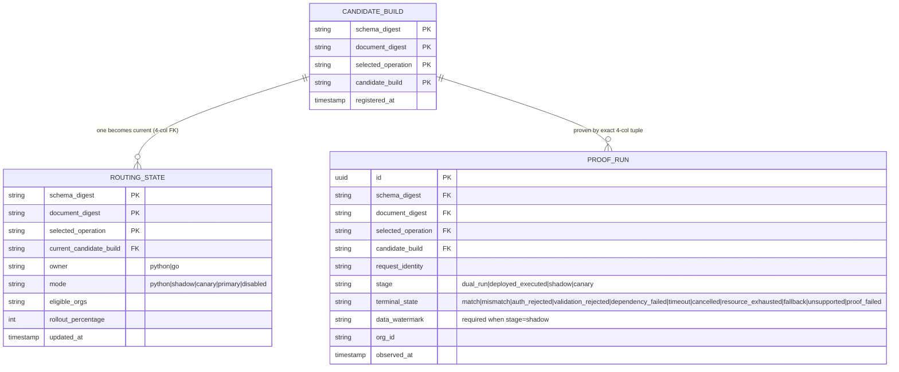
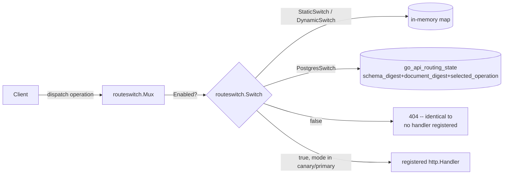

# Go API Wave 0: proof infrastructure

No GraphQL resolver moves from Python to Go until this exists (plan §5,
§6). Wave 0 builds two pieces of durable infrastructure covered here: the
signed effective-principal envelope the Python edge issues to `query-api`,
and the operation rollout registry + proof ledger that will gate every
future cutover. It does not port any resolver, and nothing on a live
request path calls either piece yet.
{: .fc-page-lede }

## Effective-principal envelope

`query-api` (Go) does not independently re-derive auth state from
Postgres/Valkey. chris's ruling (CHAOS-4379, 2026-08-27): the Python edge
issues a short-lived, audience-bound, SIGNED envelope that reproduces the
`graphql/authz.py` + `graphql/app.py` + `services/auth.py` contract —
disabled-user and token-version revocation, org-switch membership, active
impersonation, and tier fallback are all part of it, not a bare JWT
signature check.

```mermaid
sequenceDiagram
    participant Client
    participant Edge as Python edge (FastAPI)
    participant Auth as AuthService.authenticate_access_token<br/>(DB-backed: disabled, token_version)
    participant Envelope as principal_envelope.issue_effective_principal_envelope
    participant QueryAPI as query-api (Go)

    Client->>Edge: request + user access JWT
    Edge->>Auth: authenticate_access_token(token)
    Auth-->>Edge: AuthenticatedUser (or None: reject)
    Edge->>Envelope: issue_effective_principal_envelope(user, tier, licensed_features)
    Envelope-->>Edge: signed envelope (EdDSA/Ed25519, TTL default 60s, aud=query-api)
    Edge->>QueryAPI: proxied/compared request + envelope
    QueryAPI->>QueryAPI: principal.Verifier.Verify(token)
    Note over QueryAPI: keyFunc looks up kid in JWKS via<br/>dev-health-go authverify.Ed25519JWKSVerifier;<br/>jwt.WithValidMethods(["EdDSA"]) blocks alg confusion
    QueryAPI->>QueryAPI: check iss, aud, exp (WithExpirationRequired), v (schema version)
```

`cmd/query-api/internal/principal` (`Verifier`, `Claims`) is this diagram's
Go half — verified end-to-end against a real Python-issued envelope, not
just self-consistent Go-only fixtures. It rejects: wrong audience, wrong
issuer, an expired or `exp`-less envelope, an unknown `kid`, a signature
from any key not in the JWKS, `alg` other than `EdDSA` (alg-confusion), and
a `v` this verifier was not written to handle (`ErrUnsupportedSchemaVersion`).

### Claim schema (versioned, `v`)

The envelope's `v` claim is bumped whenever a claim is added, removed, or
its meaning changes. A verifier must reject an envelope whose `v` it was
not written to handle — the semantics above are expected to evolve before
`query-api` ever verifies a real request.

**v1** (current):

| Claim | Type | Meaning |
|---|---|---|
| `v` | int | Claim schema version (`1`) |
| `sub` | string | User id |
| `org_id` | string | Active org for this request |
| `role` | string | User's role in `org_id` |
| `is_superuser` | bool | Platform superuser flag |
| `is_superuser_verified` | bool | Superuser bit re-verified against the DB this request (mirrors `AuthenticatedUser.is_superuser_verified`) |
| `permissions` | string[] | Full resolved permission set (`services.permissions.get_user_permissions` — impersonation-aware: if impersonating, this is the TARGET role's permissions, not the real user's) |
| `token_version` | int | The token-version value that passed revocation check this request |
| `tier` | string | Resolved license tier (`services.licensing.resolve_org_tier` — `OrgLicense.tier` wins, else `Organization.tier`, else community) |
| `licensed_features` | string[] | Feature keys the org currently has access to |
| `impersonated_by` | string \| null | Real user id, when an admin/superuser is impersonating |
| `impersonation_active` | bool | Whether impersonation is active for this request |
| `iss` | string | `dev-health-ops-edge` (env-overridable) |
| `aud` | string | `query-api` (env-overridable per verifier) |
| `iat` / `exp` | int (unix) | Issued-at / expiry — default TTL 60s |
| `jti` | string | Unique per envelope |

There is deliberately **no `disabled` claim**. A disabled/deactivated user
never reaches the issuer: `authenticate_access_token` already treats a
deactivated user as unauthenticated (returns `None`), so no envelope is
minted for them at all. Absence of a valid envelope IS the disabled
signal — the same shape the existing Python-only contract already uses.

### Key management

EdDSA/Ed25519, asymmetric, and **separate from** the user-facing
access-token HS256 secret (`JWT_SECRET_KEY`). The envelope crosses a
process and language boundary (Python edge → Go `query-api`), so it uses
the same JWKS-based verification shape `acr/internal/auth` already uses for
its own web-assertion verification — `query-api` never holds a secret
capable of forging a user session token, only the public key needed to
verify an envelope. `build_envelope_jwks()` returns the public JWKS
document; the private key is `GO_API_ENVELOPE_PRIVATE_KEY` (PEM, Ed25519),
required at issuance time. Ed25519, not RS256 (reconciled 2026-08-27 per
CHAOS-4377): the dev-health-go `authverify` package's JWKS verifier
(`Ed25519JWKSVerifier`) is Ed25519-only by design.

## Operation rollout registry + proof ledger

Three Postgres tables (alembic `0114`), keyed by
`(schema_digest, document_digest, selected_operation)`:



`CANDIDATE_BUILD` is immutable and append-only. `ROUTING_STATE` is the one
mutable row per operation triple a future request router reads on every
call — a rollback mutates `current_candidate_build` in place, never an
image rollback (plan §5). `PROOF_RUN` is pinned to the *exact* candidate
build it proved via a full 4-column composite foreign key, never a bare
`candidate_build` string match, so a proof can never be silently
reattributed to a later build (plan §8.3).

Python access layer: `src/dev_health_ops/api/graphql/go_api_registry.py`
(`lookup_routing_state`, `register_candidate_build`, `record_proof_run`),
instrumented in `go_api_registry_telemetry.py`
(`devhealth_go_api_registry_lookup_total`,
`devhealth_go_api_candidate_build_registered_total`,
`devhealth_go_api_proof_run_recorded_total`).

## Route switch (reachability gate)

Plan §6's "cited constructor is not proof of capability" lesson, applied
to route reachability: a registered handler in `query-api`'s `Mux` is not
proof an operation is reachable. Only `Switch.Enabled(operation)` being
true, checked on every dispatch, makes it reachable.



`PostgresSwitch` (`cmd/query-api/internal/routeswitch/postgres_switch.go`)
is the `go_api_registry`-backed `Switch` plan §6 forward-declared —
implementing the same interface `StaticSwitch`/`DynamicSwitch` already do,
not a redesign of it. It treats only `mode IN ('canary', 'primary')` as
reachable: `shadow` deliberately does NOT count (the client still gets
Python's response in shadow mode, plan §5 stage 4), and a missing row, a
query error, or an operation with no registered document digest all
resolve to the same safe default as an unregistered operation —
unreachable. Proven against a real Postgres testcontainer
(`postgres_switch_integration_test.go`, `go test -tags integration`),
including the rollback direction: flipping `mode` away from
`canary`/`primary` revokes reachability on the very next read, with no
separate deploy (plan §5: "rollback is a registry change, not an image
rollback").

## Canonical SDL pin

`contracts/graphql/v1/schema.graphql` is the CI-checked export of the
Strawberry schema — see `contracts/graphql/v1/README.md` for how web
codegen and `query-api`'s gqlgen consume it, and the drift gate
(`tests/api/graphql/test_schema_sdl_pinned.py`) that fails on any
divergence.

## Status

As of 2026-08-27, every Wave 0 deliverable exists and is tested: the
envelope issuer and its Go verifier (`principal.Verifier`, cross-checked
against a real Python-issued envelope), the registry/ledger schema and its
`PostgresSwitch` reader, the SDL pin, the switch-gated-reachability empty
scaffold, and the comparator (CHAOS-4366 deliverable 5, CHAOS-4381 signed
off 2026-08-27 19:44 PT). None of these is wired into a live request
path yet — that is a later wave, per plan §6's Wave-0 scope ("no
user-facing porting").
