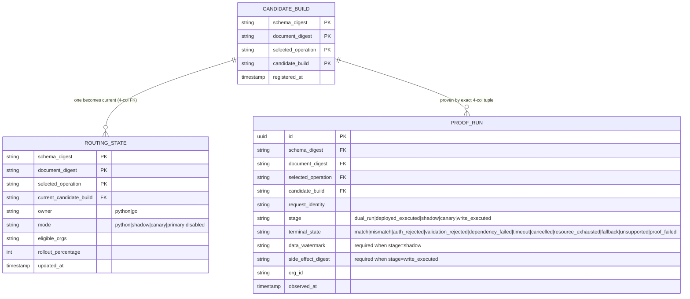
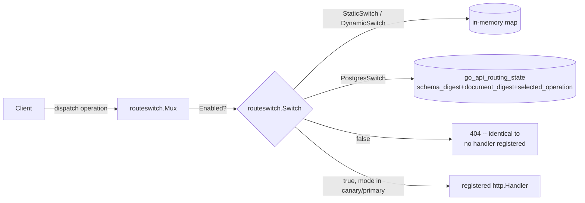

# Go API Wave 0: proof infrastructure

No GraphQL resolver moves from Python to Go until this exists (plan §5,
§6). Wave 0 builds two pieces of durable infrastructure covered here: the
signed effective-principal envelope the Python edge issues to `query-api`,
and the operation rollout registry + proof ledger that will gate every
future cutover. It does not port any resolver, and nothing on a live
request path calls either piece yet.
{: .fc-page-lede }

> **Note:** The Python edge and the Python-reference mode that this page describes were removed with the Python api. This page is a record of that surface.

## Effective-principal envelope

`query-api` (Go) does not independently re-derive auth state from
Postgres/Valkey. chris's ruling (CHAOS-4379, 2026-08-27): the Python edge
issues a short-lived, audience-bound, SIGNED envelope that reproduces the
`graphql/authz.py` + `graphql/app.py` + `services/auth.py` contract —
disabled-user and token-version revocation, org-switch membership, active
impersonation, and tier fallback are all part of it, not a bare JWT
signature check.

```mermaid
sequenceDiagram
    participant Client
    participant Edge as Python edge (FastAPI)
    participant Auth as AuthService.authenticate_access_token<br/>(DB-backed: disabled, token_version)
    participant Envelope as principal_envelope.issue_effective_principal_envelope
    participant QueryAPI as query-api (Go)

    Client->>Edge: request + user access JWT
    Edge->>Auth: authenticate_access_token(token)
    Auth-->>Edge: AuthenticatedUser (or None: reject)
    Edge->>Envelope: issue_effective_principal_envelope(user, tier, licensed_features)
    Envelope-->>Edge: signed envelope (EdDSA/Ed25519, TTL default 60s, aud=query-api)
    Edge->>QueryAPI: proxied/compared request + envelope
    QueryAPI->>QueryAPI: principal.Verifier.Verify(token)
    Note over QueryAPI: keyFunc looks up kid in JWKS via<br/>dev-health-go authverify.Ed25519JWKSVerifier;<br/>jwt.WithValidMethods(["EdDSA"]) blocks alg confusion
    QueryAPI->>QueryAPI: check iss, aud, exp (WithExpirationRequired), v (schema version)
```

`internal/queryapi/principal` (`Verifier`, `Claims`) is this diagram's
Go half — verified end-to-end against a real Python-issued envelope, not
just self-consistent Go-only fixtures. It rejects: wrong audience, wrong
issuer, an expired or `exp`-less envelope, an unknown `kid`, a signature
from any key not in the JWKS, `alg` other than `EdDSA` (alg-confusion), and
a `v` this verifier was not written to handle (`ErrUnsupportedSchemaVersion`).

### Claim schema (versioned, `v`)

The envelope's `v` claim is bumped whenever a claim is added, removed, or
its meaning changes. A verifier must reject an envelope whose `v` it was
not written to handle — the semantics above are expected to evolve before
`query-api` ever verifies a real request.

**v1** (current):

| Claim | Type | Meaning |
|---|---|---|
| `v` | int | Claim schema version (`1`) |
| `sub` | string | User id |
| `org_id` | string | Active org for this request |
| `role` | string | User's role in `org_id` |
| `is_superuser` | bool | Platform superuser flag |
| `is_superuser_verified` | bool | Superuser bit re-verified against the DB this request (mirrors `AuthenticatedUser.is_superuser_verified`) |
| `permissions` | string[] | Full resolved permission set (`services.permissions.get_user_permissions` — impersonation-aware: if impersonating, this is the TARGET role's permissions, not the real user's) |
| `token_version` | int | The token-version value that passed revocation check this request |
| `tier` | string | Resolved license tier (`services.licensing.resolve_org_tier` — `OrgLicense.tier` wins, else `Organization.tier`, else community) |
| `licensed_features` | string[] | Feature keys the org currently has access to |
| `impersonated_by` | string \| null | Real user id, when an admin/superuser is impersonating |
| `impersonation_active` | bool | Whether impersonation is active for this request |
| `iss` | string | `dev-health-ops-edge` (env-overridable) |
| `aud` | string | `query-api` (env-overridable per verifier) |
| `iat` / `exp` | int (unix) | Issued-at / expiry — default TTL 60s |
| `jti` | string | Unique per envelope |

There is deliberately **no `disabled` claim**. A disabled/deactivated user
never reaches the issuer: `authenticate_access_token` already treats a
deactivated user as unauthenticated (returns `None`), so no envelope is
minted for them at all. Absence of a valid envelope IS the disabled
signal — the same shape the existing Python-only contract already uses.

### Key management

EdDSA/Ed25519, asymmetric, and **separate from** the user-facing
access-token HS256 secret (`JWT_SECRET_KEY`). The envelope crosses a
process and language boundary (Python edge → Go `query-api`), so it uses
the same JWKS-based verification shape `acr/internal/auth` already uses for
its own web-assertion verification — `query-api` never holds a secret
capable of forging a user session token, only the public key needed to
verify an envelope. `build_envelope_jwks()` returns the public JWKS
document; the private key is `GO_API_ENVELOPE_PRIVATE_KEY` (PEM, Ed25519),
required at issuance time. Ed25519, not RS256 (reconciled 2026-08-27 per
CHAOS-4377): the dev-health-go `authverify` package's JWKS verifier
(`Ed25519JWKSVerifier`) is Ed25519-only by design.

## Operation rollout registry + proof ledger

Three Postgres tables (alembic `0114`), keyed by
`(schema_digest, document_digest, selected_operation)`:


```mermaid
erDiagram
    CANDIDATE_BUILD {
        string schema_digest PK
        string document_digest PK
        string selected_operation PK
        string candidate_build PK
        timestamp registered_at
    }
    ROUTING_STATE {
        string schema_digest PK
        string document_digest PK
        string selected_operation PK
        string current_candidate_build FK
        string owner "python|go"
        string mode "python|shadow|canary|primary|disabled"
        string eligible_orgs
        int rollout_percentage
        timestamp updated_at
    }
    PROOF_RUN {
        uuid id PK
        string schema_digest FK
        string document_digest FK
        string selected_operation FK
        string candidate_build FK
        string request_identity
        string stage "dual_run|deployed_executed|shadow|canary|write_executed"
        string terminal_state "match|mismatch|auth_rejected|validation_rejected|dependency_failed|timeout|cancelled|resource_exhausted|fallback|unsupported|proof_failed"
        string data_watermark "required when stage=shadow"
        string side_effect_digest "required when stage=write_executed"
        string org_id
        timestamp observed_at
    }
    CANDIDATE_BUILD ||--o{ ROUTING_STATE : "one becomes current (4-col FK)"
    CANDIDATE_BUILD ||--o{ PROOF_RUN : "proven by exact 4-col tuple"
```

`CANDIDATE_BUILD` is immutable and append-only. `ROUTING_STATE` is the one
mutable row per operation triple a future request router reads on every
call — a rollback mutates `current_candidate_build` in place, never an
image rollback (plan §5). `PROOF_RUN` is pinned to the *exact* candidate
build it proved via a full 4-column composite foreign key, never a bare
`candidate_build` string match, so a proof can never be silently
reattributed to a later build (plan §8.3).

Python access layer: `src/dev_health_ops/api/graphql/go_api_registry.py`
(`lookup_routing_state`, `register_candidate_build`, `record_proof_run`),
instrumented in `go_api_registry_telemetry.py`
(`devhealth_go_api_registry_lookup_total`,
`devhealth_go_api_candidate_build_registered_total`,
`devhealth_go_api_proof_run_recorded_total`).

### The two edge modes of `dho goapi prove`

`dho goapi prove` measures through the product GraphQL edge (`-edge-url`), and
it has two modes. The mode is a flag, never detected: each mode refuses the
other mode's edge by name, so a run always says which proof it is. The line
`go-api-prove: edge_mode=...` and `edge_mode` on the report summary are written
on every exit, including a run that is refused before it measures anything. A
Go-edge run also carries `edge_mode` on every outcome and in each receipt's
`review_evidence`. A command line that does not parse selected no mode, and
says `edge_mode=undetermined`.

**Python-reference mode (the default).** The edge has a Python plane behind it.
The run first asks the Python app who the credential is (`/api/v1/auth/me`),
and for every case it sends a control document, the registered text plus an
inert comment, which misses the document digest and is answered by the Python
plane. That answer is the reference: a real Python result is compared with the
Go result, and for an operation whose Python body is deleted (the go-only
class) it is the deletion error, so the candidate stands alone.

**Go-edge mode (`-go-edge`).** The edge is query-api itself, which answers
`/graphql` with no Python plane behind it (CHAOS-6263). There is no Python app
to ask and no Python answer to read.

What Go-edge mode proves:

- The edge is query-api alone. Before any case, and again for every case, the
  control document must be refused the way query-api refuses an unregistered
  document: HTTP 404, the `UNREGISTERED_DOCUMENT` error, `x-dev-health-plane:
  go`, and the serving build equal to the build the receipt names.
- The operation works on that build through that edge: the candidate answered
  2xx from plane go, with the serving build on the response, a JSON content
  type, no GraphQL error, and its own root present and non-empty.
- The caller is the org the run names, with no impersonation: every credential
  value is checked for its `org_id` claim before it is sent, and no leg may
  carry the `X-Impersonating` header.

What it does NOT prove: that the answer equals what the Python implementation
answered. No Python comparison happens in this mode. That comparison is the
frozen two-plane record each go-served ledger entry cites (its two-plane sha)
and the frozen venue oracles. So a Go-edge proof is always the go-only class:
the verdict is `PROVEN_GO_ONLY (go-edge mode: ...)`, the receipt is the
cited-mismatch arm with the ledger's own citation, and an operation the
go-served ledger does not name is refused, never proven by its candidate alone.

Go-edge mode refuses, each by its own name:

| Refusal | What the edge showed |
| -- | -- |
| `go_edge_control_answered_by_another_plane` | the control document was answered by plane python: a Python plane is behind the edge (run the Python-reference mode) |
| `go_edge_control_plane_unidentified` | the control answer carried no plane header |
| `go_edge_control_document_was_served` | the edge answered 2xx to the control document: something serves or forwards an unregistered document |
| `go_edge_control_not_refused_as_unregistered` | the control answer is not the 404 `UNREGISTERED_DOCUMENT` refusal |
| `go_edge_control_build_unbound`, `serving_build_is_not_the_named_build` | the refusal carried no serving build, or another build |
| `response_carried_no_plane_evidence`, `served_by_the_wrong_plane` | the candidate carried no plane header, or was not served by plane go |
| `go_edge_candidate_build_unbound`, `serving_build_is_not_the_named_build` | the candidate carried no serving build, or another build |
| `go_edge_candidate_content_type` | the candidate's content type is not a GraphQL JSON type (`application/json` or `application/graphql-response+json`) |
| `leg_was_served_under_an_impersonation_session` | a leg carried the impersonation stamp |
| `go_edge_operation_not_in_the_go_served_ledger` | the ledger names no two-plane record for the operation |
| `go_edge_mode_refused` (the run does not start) | the pre-run control probe was refused as above, or a credential is not bound to the run's org |

The Python-reference mode stays until the Python GraphQL path is deleted
(CHAOS-7300).

## Route switch (reachability gate)

Plan §6's "cited constructor is not proof of capability" lesson, applied
to route reachability: a registered handler in `query-api`'s `Mux` is not
proof an operation is reachable. Only `Switch.Enabled(operation)` being
true, checked on every dispatch, makes it reachable.


```mermaid
flowchart LR
    Client -->|dispatch operation| Mux[routeswitch.Mux]
    Mux -->|Enabled?| Switch{routeswitch.Switch}
    Switch -->|StaticSwitch / DynamicSwitch| Memory[(in-memory map)]
    Switch -->|PostgresSwitch| Registry[(go_api_routing_state<br/>schema_digest+document_digest+selected_operation)]
    Switch -->|false| NotFound[404 -- identical to<br/>no handler registered]
    Switch -->|true, mode in canary/primary| Handler[registered http.Handler]
```

`PostgresSwitch` (`internal/queryapi/routeswitch/postgres_switch.go`)
is the `go_api_registry`-backed `Switch` plan §6 forward-declared —
implementing the same interface `StaticSwitch`/`DynamicSwitch` already do,
not a redesign of it. It treats only `mode IN ('canary', 'primary')` as
reachable: `shadow` deliberately does NOT count (the client still gets
Python's response in shadow mode, plan §5 stage 4), and a missing row, a
query error, or an operation with no registered document digest all
resolve to the same safe default as an unregistered operation —
unreachable. One switch has an exception to the missing-row rule: the switch that
`/query` and `/graphql` serve registered documents through
(`NewCatalogSwitchWithLegacy`, `catalog_switch.go`) serves an operation that
has no routing row at any schema digest. An operation that has a row
anywhere keeps the rule above (a row in a non-served mode, or left at
another digest, holds it dark), and the class-row and proof switches have no
exception. Proven against a real Postgres testcontainer
(`postgres_switch_integration_test.go`, `catalog_switch_integration_test.go`,
`go test -tags integration`),
including the rollback direction: flipping `mode` away from
`canary`/`primary` revokes reachability on the very next read, with no
separate deploy (plan §5: "rollback is a registry change, not an image
rollback").

### `canary` and `primary` are the same reachability

`eligible_orgs` and `rollout_percentage` on a routing row are inert: no plane
reads them. `Enabled(operation)` takes no organisation, the Python edge
dispatcher that decides delegation does not enforce them either, and the
delegated operations have no Python resolver for an organisation outside a
cohort to fall back to (that organisation would get an error, not Python's
answer). So `canary` and `primary` both mean *on for every authenticated
organisation, revocable only by mode* (`python` or `disabled` turn an
operation off; `shadow` is not reachable). `dho goapi routing enable`
refuses any `-rollout` other than 100, and `dho goapi routing status`
names a reachable row that still records a partial rollout or a non-empty
`eligible_orgs` (`not_enforced` in the JSON, `!! NOT ENFORCED` in the text).
A real staged rollout would need the organisation threaded through
`Enabled` and a served answer for the organisations outside the cohort; that
is a new design, not a flag.

## Canonical SDL pin

`contracts/graphql/v1/schema.graphql` is the Go plane's schema (gqlgen
generates `query-api` from it) and is never regenerated from Python — see
`contracts/graphql/v1/README.md` for how to change it and for how web
codegen consumes it. Two gates: the Python schema must be a subset of it
(`tests/api/graphql/test_schema_sdl_pinned.py`), and the schema baked into
the generated Go code must equal it byte for byte
(`TestGeneratedSchemaSourceIsTheCheckedInPin`). Its sha256 digest is
unchanged by which plane a member came from, so the routing key, the
pin and the history table below work exactly as before.

## When the schema digest moves

Every `go_api_routing_state` row is keyed by `schema_digest`. Change
`contracts/graphql/v1/schema.graphql` by one byte and the digest changes,
which means **every existing routing row instantly stops matching** — the
Python dispatcher's `lookup_routing_state` misses, `PostgresSwitch.Enabled`
returns false, and every request is served by Python.

That behaviour is correct: a missing row is the documented safe default.
The danger is that it is also **silent**, and indistinguishable from "no
operation has been enabled yet".

### What this cost, once

On 2026-09-01, twelve routing rows were seeded by hand between 12:26Z and
14:39Z — all `mode=canary`, `rollout_percentage=100`, `owner=go`, pointing
at candidate build `78fc68815` — at digest
`sha256:67b87d38…`. At 13:39Z that same day, PR #2065 (`33b3f3f21d`,
"Widen TimeseriesBucket.value SDL nullability to match Go's `*float64`")
changed the SDL, moving the digest to `sha256:29d509cd…`.

All twelve rows died at that moment. Zero operations were served by Go.
Nothing logged it, nothing counted it, no test covered it, and the rows
still looked perfectly healthy in `psql`. It was found six days later, by
hand.

### The rule

**Routing rows follow the deployed image, not your checkout.** `query-api`
embeds its own copy of the SDL (`go:embed`) and computes
`digest.Schema(schemav1.SDL)` from it; the Python edge reads
`contracts/graphql/v1/schema.graphql` from disk. They agree only while the
running image and the checkout carry the same SDL. Writing rows from a
checkout that has moved ahead of the deployed image produces rows the
running binary can never read — exactly the failure above.

So: **rebuild and deploy `query-api` first, re-enable second.** Never the
other way round.

That ordering leaves a window, and `dho goapi routing carry` (CHAOS-6107) is
what closes it: between the first new pod starting and the re-enable, every
enabled operation is un-routed — requests fall back to Python, and an
operation whose Python execution path has been deleted (the go-only class)
answers its deletion error to real clients instead. `carry` runs BEFORE the
roll, from a tools image built at the sha about to roll, and copies every
reachable row to the schema digest that image computes: mode,
rollout_percentage, eligible_orgs and the candidate build verbatim, the rows
at the live digest untouched. The new rows are inert until a process that
computes that digest starts, so a rolling update finds rows at whichever
digest each pod computes and a rollback finds its own rows exactly where it
left them. It refuses — writing nothing at all — when the two digests are
already equal, when a row's registered document is changed or absent in the
image being rolled to (named operation by operation, with a DO NOT ROLL line
for any go-only one), when this image's document dump and edge catalog
disagree, when a row still names a build the deployed process is not running
(run `repoint` first), or when the target digest already holds a different
row for that operation.

A routing table with no row at any schema digest is a valid state (query-api
serves every catalog operation that has no routing row). On it `carry` and
`repoint` are a no-op: exit 0, one `NO-OP` line, nothing written, and
`"empty_table":true` on the `-json` line beside the usual success `reason`,
so the chart's pre-upgrade and post-upgrade hooks pass. Every other preflight
still runs (the `-expect-build` cross-check included). When rows exist and
none of them is at the live schema digest, both verbs refuse as before: a row
left at another digest holds its operation dark, and an upgrade must not hide
that.

A registered document that was **swapped with dual accept** is not a changed
document for `carry`. When an operation gets a new text, the old text stays
accepted as a legacy one (`legacyDigestsByOperation`, the `"legacy": true`
entries of the document dump and of the catalog), and query-api reads a
routing row under any accepted digest. So a row keyed to a digest the image
being rolled to lists as a legacy text of the same operation is carried
verbatim, under its own digest, and both texts are served from it; the plan
names it `carried (legacy digest)`. The row is not re-keyed to the new
digest. `carry` still refuses a row whose digest is neither the image's
current digest nor one of its legacy digests for that operation, and it
refuses when the document dump accepts a legacy digest that the catalog does
not list. Two limits follow from `/registry` reporting each operation's
current digest only: `carry` treats a row keyed to a target-legacy digest as
reachable now without asking the deployed process, and it cannot see that a
legacy text was **retired** — a row still keyed to a retired digest reads as
already unreachable and is skipped, not refused. Re-key such rows (`enable`
at the current digest) before the image that retires the legacy text rolls.

A carried row claims NO proof: receipts are keyed by `schema_digest`, so
`status` reports every carried row UNPROVEN at the new digest until
`go-api-prove` runs against the new build, and its `review_evidence` says so
durably, opening with `CARRIED-FROM <live digest> build=<sha> at=<ts>:` in
front of the source row's own reason. In `go_api_routing_audits` a carry is
recorded with `action = 'enable'` — alembic 0130's CHECK admits only
enable/disable/repoint — so that evidence prefix is what distinguishes a
carried row from a fresh enablement for a reader of that table.

A carry also refuses, rolling the whole run back and writing nothing, when
a row it was copying **moves at the live digest while it runs**. The survey
that decides what to copy is an unlocked read under READ COMMITTED, so an
operator who changes or removes a live row between that read and the commit
would otherwise have the superseded decision written to the new digest —
and the roll would then serve Go for something that had just been turned
off. Before committing, `carry` re-reads the rows it copied `FOR SHARE` and
compares them; a difference names the operation and both readings, and the
answer is simply to run `carry` again. The share lock blocks other routing
WRITERS for the rest of that transaction and no readers at all: neither
plane's dispatch path takes a lock, so production traffic never waits on a
carry.

**During this window, read the census, and mind which digest a write verb
writes at.** `status` classifies rows against the digest the DEPLOYED
process reports at `/registry`, never against the digest of the binary
running the command, so rows carrying production traffic read `MATCH` and
the freshly carried rows read `PENDING` — "nothing reads these yet", which
is a different fact from `STALE`, "nothing will ever read these". With
`/registry` unreachable there is no authority on what is live and `status`
says so rather than presenting this binary's own digest as a reading.
`enable` and `disable`, however, write at the digest THEIR OWN binary
computes: run from the tools image built for the commit about to roll, a
`disable` lands at the digest nothing is reading yet, reports success, and
stops nothing. `disable` cannot detect this itself (it makes no HTTP call
by design, so it works when query-api is down), but it now prints the other
digests holding rows and points at `status`. **To stop live traffic during
the window, run `disable` from the image that is actually deployed.**

Every verb's `-timeout` bounds each HTTP request, the Postgres dial **and
each database statement** — `statement_timeout` and `lock_timeout` are set
on the connection from that flag. The bound is server-side on purpose: a
client-side cancel landing during `COMMIT` would leave the operator unable
to say whether the transaction committed, where a statement timeout aborts
the statement, rolls the transaction back whole, and the command says so.
It bounds each statement individually, never the run as a whole.

### Recovery procedure

```bash
# 1. What does each plane think the digest is, and which rows are alive?
dho goapi routing status --registry-url http://query-api:8080/registry

# 2. If the planes disagree, STOP: rebuild/redeploy the query-api image
#    from this SDL. `enable` will refuse until they agree, by design.

# 3. Re-enable against the deployed build with the Go verb
#    (`dho goapi routing enable`, next section). It reads the candidate build
#    from the running query-api's /buildinfo; there is no Python enable.

# 4. Confirm every operation reads MATCH, and none reads UNPROVEN
#    unless the go-served ledger names a written limit for it.
dho goapi routing status
```

`enable` refuses (exit 2, writing nothing) when query-api is unreachable,
when the two planes' digests disagree, when the running binary does not
register an operation or registers it under a different document digest,
or when no admissible proof run exists for the candidate build: a
`deployed_executed` run bound to the serving build per request that ended
in `match`, or in a `mismatch` whose every difference is cited against a
declared Python baseline defect (primary also requires the edge route).
Nothing waives the last of these on the command line. `enable` admits an
operation without a proof run only through a written limit in the go-served
ledger.

On success `enable` names, for every proven row, the receipt that
authorized it -- its id, terminal state, citations (for a cited mismatch),
route, binding and what the citation covered by finding shape
(`covered[null=7 value=384] outside[]`, as `go-api-prove` records it in the
receipt's provenance) -- on stdout (and in `--json`), on an
`INFO: go_api_routing.enabled` line on stderr, and in the routing row's
`review_evidence` (`proof_receipt=<id> ...`). A `match` admission and a
cited-`mismatch` admission print different lines.

### After alembic 0129: every earlier proof reads UNPROVEN until re-proven

The enablement rule requires `build_binding = 'per_request'` on every
receipt, and rows written before 0129 carry `build_binding` NULL. So the
moment 0129 is applied, **every operation proven before it reads UNPROVEN**
on `dho goapi routing status` and on the migration-status page, and
`dho goapi routing enable` refuses it -- including operations whose old receipt was a
sound `match`. Nothing is lost from the table; the old receipts stay as
history. Re-run `go-api-prove` at the deployed build (JOB 6's re-prove step
does exactly this) and the new receipts, bound per request, restore the
proofs.

### The same procedure with the Go verbs (CHAOS-5486)

`dho goapi routing` (spec S1, CHAOS-6280 folded the standalone
`cmd/go-api-routing` binary into the `dho` operator binary's `goapi
routing` verb) is the Go implementation of the same contract, built
because the cutover rule forbids new Python compute on the critical path
of a rollout operation. The Python `status` and `disable` verbs still
work. `enable` exists only in Go, and the Go verbs are the only ones that can
re-point a `shadow` row.

```bash
# A typed -postgres-uri flag value reaches /proc/<pid>/cmdline and shell
# history, the same leak class this package's own bindPostgresURI guard
# closes for the usage TEXT -- so this recipe, the operator's document of
# record, follows the same rule. The binary already falls back to the
# POSTGRES_URI environment variable on its own (main.go) -- set it in the
# environment and omit the flag entirely.
export POSTGRES_URI=<dsn>

# 0. BEFORE the roll, from a tools image built at the sha about to roll:
#    copy every reachable row to the digest that image computes, so the
#    roll does not un-route what is already enabled. Writes nothing at the
#    live digest, so a rollback still finds its own rows. -dry-run first.
GO_API_ROUTING_BEARER=<envelope> dho goapi routing carry \
  -registry-url  http://query-api:8090/registry \
  -buildinfo-url http://query-api:8090/buildinfo \
  -recorded-by   <who> \
  -review-evidence '<why>' \
  -dry-run
# then the same command without -dry-run. After the roll: `repoint` (the
# carried rows still name the pre-roll build), then re-prove.

# 1. Same question. Never refuses, works with query-api down.
dho goapi routing status -registry-url http://query-api:8090/registry

# 2. Re-enable. NOTE the difference that matters: there is no
#    -candidate-build to type. The build is READ from the deployed
#    process's authenticated /buildinfo; -expect-build is a cross-check
#    that can only FAIL a run, never the source of what is written. The
#    credential is the effective-principal ENVELOPE in
#    GO_API_ROUTING_BEARER -- an env var, not a flag, because a flag value
#    reaches `ps` and shell history.
GO_API_ROUTING_BEARER=<envelope> dho goapi routing enable \
  -registry-url  http://query-api:8090/registry \
  -buildinfo-url http://query-api:8090/buildinfo \
  -operations    all-registered \
  -mode          canary \
  -recorded-by   <who> \
  -review-evidence '<why>'

# 3. Roll back. Contacts NOTHING -- no registry, no buildinfo, no
#    credential -- because it has to work when the planes disagree and the
#    deployed process is down. -candidate-build here is a GUARD ("refuse
#    if somebody repointed this since I looked"), never written.
dho goapi routing disable \
  -operations all-registered -mode python        # dry run, writes nothing
dho goapi routing disable \
  -operations all-registered -mode python -apply \
  -recorded-by <who> -review-evidence '<why>'

# 4. Provenance only: point rows at the running build without touching a
#    single column that decides reachability. This is the verb the Python
#    pair cannot express -- `enable --mode` accepts only canary|primary,
#    and `disable` never writes the build -- so a shadow row could not be
#    re-pointed at all before it existed.
GO_API_ROUTING_BEARER=<envelope> dho goapi routing repoint ... -dry-run
```

This is every point where the Go verbs deliberately behave differently
from the Python ones. Every one is a tightening or an observability
improvement, never a silent behaviour change, and the rule stands:
anything else that differs from the Python verbs is a defect, not a
decision.

* **The candidate build cannot be typed.** `enable --candidate-build` in
  Python is documented "by CONVENTION, unverified"; the fifteen live rows
  carry a sha nothing ever checked. The Go verb reads it from
  `/buildinfo` and refuses when the process cannot identify its build.
* **`disable` keys its UPDATE on the row's OWN document digest**, not the
  catalog's. A row whose document digest has drifted from the catalog is
  still turned off; in Python that write silently matches nothing. An
  off-ramp that stops working precisely when something has drifted is an
  off-ramp with a hole in it.
* **`disable -document <digest>` (and `repoint -document <digest>`) select
  the live row by that exact digest instead of the catalog's**, which is
  the only way to guard-check `-candidate-build` against a DOCUMENT_DRIFT
  row (the catalog-driven path has no catalog digest of its own to
  compare the guard against, so it skips such a row rather than checking
  it) or to act on one specific row of several an operation has, without
  touching the others; it refuses outright when no live row for the
  named operation carries that digest.
* **`-recorded-by` and `-review-evidence` are required on every write.**
  Python derives `recorded_by` from `$DEV_HOPS_OPERATOR` / `$SUDO_USER` /
  `$USER` and falls back to the literal `unknown`, and it permits an
  absent reason for a proven enablement. A rollout decision attributed to
  `unknown` with no reason is the state this whole surface exists to end.
  This PR writes both durably on the current row's own provenance
  columns; an append-only audit row carrying the same two fields on every
  write, independent of the current row, arrives with CHAOS-5505 (the
  audit PR that follows this one).
* **`disable` never refuses the WHOLE run over one operation's per-row
  guard state -- a stale schema digest, or a `-candidate-build` guard
  named against an operation whose only live-digest rows are DEAD (no
  catalog document digest)** -- refusing here would contradict this
  verb's own documented contract of working when the planes disagree.
  Either state is SKIPPED for that operation alone, reported on its own
  plan line, so the documented rollback recipe (`-operations
  all-registered -mode python`) can still turn everything else off when
  one operation's rows are stale or dead to this checkout. Because
  something was still skipped, the run exits non-zero (2) even though
  the healthy operations were disabled -- an operator sees both facts:
  what moved, and what needed a second look. **This is a declared
  divergence from Python, in the STRONGER direction**: on the identical
  fixture, Python's guarded `-operations all-registered` also exits 2,
  but its plan LISTS the dead-only operation as if it would move, then
  silently leaves it untouched at apply time and blames a misattributed
  cause ("their candidate build moved between the plan and the write").
  Go never lists a row it will not touch as moving, and names the real
  reason (no catalog row to check the guard against) instead of a
  generic race that did not happen.
* **`-candidate-build` passed as an explicitly empty value is refused**,
  not silently treated as "no guard" -- an empty value reads identically
  to the flag never being passed at all otherwise, which would apply an
  unguarded write when an operator's script meant to guard it (e.g. an
  interpolated but unset shell variable).
* **The write verbs' `-registry-url`/`-buildinfo-url` pair is resolved
  TOGETHER, not independently.** Naming one explicitly while the other
  falls back to `GO_API_QUERY_API_URL` (or nothing) can silently split a
  single preflight across two different processes; only both-explicit or
  neither is accepted.
* **`status`'s `reachable` field is tri-state (`true`/`false`/`null`, not
  a plain bool) and carries a `reachable_reason` naming the actual cause**
  -- the row's own mode, the row's own digest_state, a schema-level
  mismatch, a per-operation document-digest mismatch, or "the go plane
  could not be reached" -- rather than requiring a JSON consumer to
  cross-reference several other fields by hand to learn why.
* **`status` never refuses**, even on an UNUSABLE (not merely unset)
  `GO_API_QUERY_API_URL` inherited from the environment: it reports
  `go_plane_error` and still prints everything that needed no registry
  call (the local schema digest, the database census).
* **`<verb> -h`/`-help` exits 0**, printing that verb's usage text, the
  same as this binary's own top-level `-h` and Python's argparse --  not a
  refusal (exit 2).
* **A dead database exits 1, matching Python.** Python's
  `disable`/`enable`/`repoint` against a dead database crash with an
  unhandled `ConnectionRefusedError`, exit 1; `connectPostgres`'s
  dial-failure path classifies the same way. A malformed DSN (a
  parse-time failure, the operator's own typo) is unaffected and stays
  exit 2.
* **`status -json`'s key names match Python's exactly**:
  `python_plane_schema_digest` and
  `python_plane_digest_error` (always `null` -- computing this value has
  no runtime failure mode in Go, present for key-set parity only), not
  the earlier `local_schema_digest` with no digest-error key at all.
  `catalog_error` and `classification_error` remain Go-only additions
  Python has no equivalent read for.

`disable` also turns off **every** row an operation has at the live
digest, not one of them. The routing primary key is `(schema_digest,
document_digest, selected_operation)`, so one operation can have several
rows under different document digests; leaving one behind would report
success while the operation stayed reachable.

**Only one of those rows is ever reachable**, and `status` says which. The
edge resolves a request to an operation through the catalog and then looks
the row up by the *catalog's* document digest — so a row at the live
schema digest under any other document digest is dead in exactly the way a
row at a stale schema digest is dead. `status` reports it as `STALE`,
never `MATCH`, never reachable, and names its digest under
`unreachable_document_digests`. A row that is present in `psql` and can
never be consulted is the CHAOS-5416 shape; only the column that moved is
different.

**Endpoint URLs are refused if they carry userinfo, a query or a fragment,
and what the command actually uses is rebuilt from scheme, host and path.**
`GET /registry` and `GET /buildinfo` are two fixed routes authenticated by
a header, so none of those components has a legitimate use — and
`goapiproof.FetchRegistry` interpolates the URL it is handed into its
error text, so anything carried in one is printed verbatim on a transport
failure. Three variants of that leak exist: userinfo; the no-`//` form,
where Go parses the *username* as the scheme and `url.Redacted()` returns
the password unchanged; and a query string -- so the check is an
allowlist over URL components rather than a list of shapes to reject.

The residual, stated rather than left implicit: **a credential placed in a
path segment is not distinguishable from the route itself** and would
still reach that error text. Do not put one there. It closes fully when
`internal/goapiproof` stops interpolating raw URLs, which is tracked
against the lane that owns that file.

`status` also keeps the per-digest **census** and the per-operation
**classification** as separate failures. They are separate reads, and
collapsing them meant a classification error printed "registry database
UNREACHABLE" and suppressed a census that had already succeeded — hiding
the one number that says whether anything is enabled at all.

The refusal exit code is 2 (a state the operator must resolve), on both
planes, with one exception. `classifyWriteError` in `main.go`
distinguishes a genuine, server-raised failure from a hand-authored
refusal at the one place `enable`/`repoint`/`disable` reach the database
write: a `*pgconn.PgError` -- a deadlock abort (SQLSTATE 40P01), a
trigger's `RAISE EXCEPTION`, any other
error the POSTGRES SERVER itself raised inside an already-open
transaction -- now exits **1**, via `errInternal`/`internal()`. Everything
else the binary can produce (a missing flag, a malformed DSN, a guard
mismatch, an unproven operation, `connectPostgres`'s own dial/auth
failures) is still an operator-actionable refusal and stays **2**. An
unrecovered Go panic still exits 2 by the runtime's own default, not 1 --
that gap is real and unclosed. A script written to "1 means the server
itself broke, 2 means fix your input" now reads a genuine deadlock
correctly; one written to "1 means crashed" still needs to know a panic is
the one exception.

Every Go routing write also appends to `go_api_routing_audits`
(CHAOS-5505, alembic 0130), in the SAME transaction as the routing write:
one row per operation, sharing a `correlation_id` per invocation. The
routing row's own `recorded_by` / `review_evidence` is overwritten by the
next write; this table is append-only, so it is where "who moved this, and
when" survives.

It is a dedicated table rather than a widening of `worker_operator_audits`.
chris ruled that one belongs to the sync → worker operator plane
("this column is definitely for syncs to pass to workers"), and its
`principal_type` is pinned to a credential class issued and validated
there. Borrowing a table because its column names happen to fit is how two
unrelated things become impossible to aggregate separately later.

| verb | `action` | `credential_class` | `principal_id` |
|---|---|---|---|
| `enable` | `enable` | `effective_principal_envelope` | the envelope's `sub` |
| `repoint` | `repoint` | `effective_principal_envelope` | the envelope's `sub` |
| `disable` | `disable` | `operator_direct` | NULL |
| `status` | — writes no row — | | |

`credential_class` uses the **Auth Control Plane's** vocabulary
(`contracts/auth/v1/credential-classes.schema.json` is the closed
registry). `effective_principal_envelope` is the class_id that project's
Wave 0 threat model proposes for the envelope; registering it in that
contract is tracked separately, against the paused Auth Control Plane
project. `disable` is `operator_direct` because it verifies no credential —
it contacts nothing by design — and recording a weaker claim accurately
beats recording a stronger one nothing checked.

`principal_id` and `recorded_by` answer **different questions** and both
are recorded. `principal_id` is who the *credential* says is acting: the
envelope's `sub`, a user id, read only after `/buildinfo` has answered 200
— which is the deployed verifier accepting that exact token. This command
never verifies the envelope itself; one validator per credential class is
the Auth Control Plane's rule, and `internal/queryapi/principal` is
that validator. `recorded_by` is what the operator typed about themselves,
verified by nothing, and required on every row. The pairing CHECK makes the
distinction structural: an envelope-class row MUST name a subject, an
`operator_direct` row MUST NOT.

Each row also carries the routing key (`schema_digest`, `document_digest`,
`selected_operation`) and the **before and after** of both
`candidate_build` and `mode`. That last pair is what turns two contracts
into something a reader can check rather than take on trust: a `repoint`
row shows the same mode on both sides (it never touches reachability), and
a `disable` row shows the same candidate build on both sides (it changes
mode only).

Only rows that ACTUALLY moved are audited: a `repoint` that finds every row
already naming the running build writes no audit rows, and a `disable`
naming an operation with no row audits nothing for it. An entry for an
unchanged row would record a change that did not happen, in a table nothing
can later correct.

There is deliberately **no foreign key** to `go_api_routing_state`: the
audit table must outlive the row it describes.

### How this is now detected

| Signal | Where | Fires when |
|---|---|---|
| `go_api_routing.rows_stale` (ERROR log) | Python edge startup (`api/_lifespan.py`) | Rows exist, none at the live digest |
| `devhealth_go_api_routing_digest_drift_total{result="stale"}` | Python edge startup | Same condition, as a scrapeable counter |
| `query-api: ROUTING ROWS STALE` (log) | `query-api` route construction | Same condition, on the Go plane |
| structured ERROR-level record (`slog`, no fixed line text) | `query-api` route construction (`registry_drift_telemetry.go`) | Same condition, leveled so a log-level alert rule fires on it -- the plain-text line above carries no level at all |
| `devhealth_query_api_routing_rows_for_digest` (gauge, `schema_digest` attr) | `query-api` route construction | Rows keyed to the digest THIS process computed; 0 with the total gauge below `>0` is the DEAD-fleet condition, on every startup, not only at read time |
| `devhealth_query_api_routing_rows_total` (gauge, `schema_digest` attr) | `query-api` route construction | Disambiguates the gauge above from the legitimate `total == 0` posture, where no row decides anything and the catalog rule serves every registered operation |
| `devhealth_go_api_dispatch_fallback_total{reason="no_routing_row"}` | Python edge, per request | A dispatch-eligible request found no row |
| `devhealth_query_api_routeswitch_digest_miss_total{operation}` (and its WARN record) | `query-api`, per request | An operation has no row at the live key and is refused: on the serving route, an operation whose rows are all elsewhere |
| `devhealth_query_api_routeswitch_served_without_row_total{operation, reason="catalog_no_row"}` (and one INFO record per operation per process) | `query-api`, per request | A registered operation with no routing row at any schema digest was served (the catalog rule). Zero on a stack where every operation has a row |
| `ci/check_go_api_routing_digest.py` | CI | The SDL moved without updating the pin and this table |

`empty` (no row decides anything) is deliberately reported as a *different*
result from `stale` (everything enabled is dead), and the two mean opposite
things: on an empty table query-api serves every registered operation by the
catalog rule, and on a stale one it serves no operation that has a row.

None of the above shortcuts the recovery procedure. In particular, a schema digest that happens to match a
previously-proven build is NOT grounds to re-point a DEAD row's `candidate_build` onto a new image without a
fresh `go-api-prove` run: see "Per Go-API operation" in `docs/go-migration-matrix.md` ("The condition is now
observable, not just render-visible") for why that specific shortcut was considered and rejected.

### Schema-digest history

Update this table in the SAME change that moves the SDL.
`ci/check_go_api_routing_digest.py` fails if
`contracts/graphql/v1/schema-digest.json` names a digest that does not
appear here.

| Digest | In force from | Moved by | Notes |
|---|---|---|---|
| `sha256:67b87d38e46f767511b5d8435ffbfdd7dbe8aeab9dbe4073c7d7706de572f706` | before 2026-09-01 | superseded by `33b3f3f21d` | The twelve 2026-09-01 rows were seeded here and died the same day |
| `sha256:29d509cd414cd957a7bcd73a1c0e78a07f17dd8a8794893233954aaa87241b88` | 2026-09-01 | `33b3f3f21d` (#2065, widen `TimeseriesBucket.value` nullability) | superseded |
| `sha256:19485ec136d04de0935717dca8b4f5fd27dd0351fe96b854d40f433229468fd0` | 2026-09-11 | declaring the coverage split's three nullable fields on the Strawberry type, which regenerates this SDL | superseded |
| `sha256:898250a995e65f792e0383a07d7a683251894cbe51f426a4dcf520bcd82bf91e` | 2026-09-27 | removing the `Subscription` root type and the `MetricsUpdate`, `TaskStatus` and `SyncProgress` types from the SDL | superseded |
| `sha256:d5ba09b1f460953482518ae4f5653ba6350b085bdc39621c5888756741118117` | 2026-09-28 | CHAOS-6262, deleting the 8 `dev*` Ask Dev V1 GraphQL fields and their input/result types from the SDL | superseded |
| `sha256:c210117e47812bc75fbd11a88aa38ff6eaf63887ea13d9324335e913898d84c9` | 2026-09-29 | CHAOS-7070, growing `HomeResult` to the full home payload (freshness sources, constraint cards, events, scope entity refs, health state) and adding the `window` argument (`HomeWindowInput`: rangeDays, compareDays, startDate, endDate) to `home` in the Go-owned SDL; Python's `home` field is deleted | superseded |
| `sha256:dd83956f18b52a3acf89e73e1f25b0dcf25df706d90eca49c5b66f8b8994f779` | 2026-09-29 | CHAOS-7092, adding `degradedReason` to `FlowMatrixResult` in the Go-owned SDL | superseded |
| `sha256:330d0ebf0ea59fce8d0b1bb14887cad8e5b3f6971ad02618afa9844b6fac7a50` | 2026-10-02 | CHAOS-7624, adding `completionDistribution` (types `CapacityDistribution`, `CapacityDistributionBin`) to `CapacityForecast` in the Go-owned SDL | superseded |
| `sha256:c8f6a75c3c2ac376b292dc5a7f9182c36111f3bad47dd65e4a41a0353cef639e` | 2026-10-03 | CHAOS-7964, adding `teamIds: [String!]` to `CapacityForecastInput` in the Go-owned SDL (`teamId` stays identical to the Python schema; its deprecation waits for Python's removal) | superseded |
| `sha256:f71aa1d9a9dfc367910cc7f29f98508fca63f08a54ca2ad1e2b39bfd8b2e3888` | 2026-10-03 | CHAOS-7773, adding nullable `repoName` and `teamName` to `AiAttributedPr` in the Go-owned SDL (additive; Python never had them) | superseded |
| `sha256:fff119c64988e2f76442f2b41229a665a2bc6e32cac92e1dd125cf6c07728dab` | 2026-10-03 | CHAOS-7774, adding `day: Date!` to `AIImpactBucketRow` in the Go-owned SDL (additive; Python never had it) | superseded |
| `sha256:f12739c7f2b04df329e29404e80aae93308553b82fe3f35010e97ed8aa147ddc` | 2026-10-03 | CHAOS-7785, adding the optional `teamIds` argument to `ReviewEdgesInput` (team scope by repository ownership) in the Go-owned SDL | superseded |
| `sha256:09db2fee13f48e36a1d95bb5d77fb74d327aad851319843b473077891e4c71f4` | 2026-10-03 | CHAOS-7786, adding `truncated` and a real `totalCount` (the deduplicated row count before the cut) to `ReviewEdgesResult` in the Go-owned SDL | superseded |
| `sha256:af68e95261c6b9750aa3f9c15734c363797ea005eb2da1784806456aa2518ca5` | 2026-10-03 | CHAOS-7626, adding `value`, `threshold`, `unit` and `thresholdDirection` to `ImproveOpportunity` and the `ImproveOpportunityUnit` and `ThresholdDirection` enums in the Go-owned SDL (additive; Python does not declare them) | superseded |
| `sha256:c71f3c428b0de016a80cc8a40003a04d1b452d85f616ff31e1ff73dbec294cd6` | 2026-10-03 | CHAOS-8477, adding `runs: Int!`, `unfinishedRuns: Int` and `horizonDays: Int!` to `CapacityDistribution` and `cumulativeShare: Float!` to `CapacityDistributionBin` (the run total, the runs that did not finish inside the simulated horizon, the horizon in days, and the share of the simulation runs that finished on or before each value, from the same Monte Carlo distribution as the percentile days) in the Go-owned SDL (additive; Python never had the types) | superseded |
| `sha256:6e53d73cc690622e183d24c4024ca38ee508803c4fd250616e88a7d7ae3a21f4` | 2026-10-03 | CHAOS-8485, adding nullable `reviewerName` and `authorName` and the opaque `reviewerKey` and `authorKey` to `ReviewEdgeRow`, and deprecation notes on `reviewer` and `author`, in the Go-owned SDL (additive; Python never had them) | superseded |
| `sha256:2d5839ecc2f1352f4b64f812fc4a503976b36deafc5b89058080345a13437dd0` | 2026-10-03 | CHAOS-8114, adding nullable `repoName` and `teamName` to `AIOpportunity` (the catalogue names of the repository and the team an opportunity carries, never the id) in the Go-owned SDL (additive; Python never had them) | superseded |
| `sha256:b91a544c7a7bb1ca09f11ca568cb255dba7f1a2ea36d4d58322cfceb10ef0892` | 2026-10-03 | CHAOS-8113, adding nullable `displayName` and `nameExpected: Boolean!` to `AIWorkflowGraphNodeOut` (a pull request title, a deployment environment, an incident title and status, or a readable issue key, never an id that holds a UUID or an opaque hash; and whether the node type carries a name at all) in the Go-owned SDL (additive; Python never had them) | superseded |
| `sha256:fdff794c3fa3de956e07061645b7494cca33ed760f9405d405c912ae01d3e34b` | 2026-10-03 | CHAOS-8115, adding `hasData: Boolean!` to `OperatingReviewMetric` and `hasPriorData: Boolean!` to `OperatingReviewDelta` (whether each week holds a stored value for the metric, so a stored zero and a missing week differ) in the Go-owned SDL (additive; Python never had them) | superseded |
| `sha256:17ee55f4bbc25e2457d30871714eb8221028eec1f4c22b0a2a3d23187e2f5ebc` | 2026-10-03 | CHAOS-8513, adding the root field `testopsJobFailures` with `TestOpsJobFailuresInput`, `TestOpsJobFailuresResult` and `TestOpsJobFailureGroup` (CI job names that failed in a window, by workflow and job name, with runs, failed runs and the failure rate as a share) in the Go-owned SDL (additive; Python never had it) | superseded |
| `sha256:eedd1cd00de75fd9bab0e82248261ec10ad219be9b9156359f9af4131eaf140a` | 2026-10-03 | CHAOS-8111, adding the root field `coverageBaselines` and `RepoCoverageBaseline` (each repository mean line and branch coverage over the 30 days before a day, null below 7 days with a value, with the number of days used) in the Go-owned SDL (additive; Python never had it) | superseded |
| `sha256:f06d06c0882b90d27a4d8c16dd0f62754d68c8689c3263671a31d346be611f62` | this revision | CHAOS-8541, adding the root field `coverageScopeBaseline` and `ScopeCoverageBaseline` (the coverage baseline of a whole scope: the mean over the 30 days before a day of the mean coverage of the scope repositories of each day, null below 7 days with a value, with the number of days used) in the Go-owned SDL (additive; Python never had it) | Current. Every routing row written at the digest above stops matching the moment this lands: rebuild and deploy query-api from this SDL FIRST, then re-enable, per the recovery procedure above. |

### Where `bigboy-cut.sh` finds its tools and its tree (CHAOS-7135)

`ci/bigboy/bigboy-cut.sh` separates the two: `BIGBOY_ROOT` (default `/home/ubuntu/devhealth`) is the
running tree the cut acts on (`compose/compose.bigboy.images.yml`, `_records/`, `ops/.env`), and the
tools (the sibling `bigboy-repin.sh`, `bigboy-repin-web.sh`, the check scripts) come from
`BIGBOY_TOOLS_DIR`, which defaults to the directory the script itself runs from. A cut launched from
a git worktree therefore needs no `ci/bigboy` symlink under the root; set `BIGBOY_TOOLS_DIR` only to
run the tools from a different checkout. The first log line prints both (`root=... tools=...`), and
the cut refuses a tools directory that is not one (`is not a directory`, or no `bigboy-repin.sh`).

### go-api's ClickHouse login on bigboy (CHAOS-7162)

`dho_api_ch` is declared to ClickHouse as a `users.d` file, not created inside the running container: the
compose overlay `ci/bigboy/compose.bigboy.clickhouse-users.yml` mounts the host file `DHO_API_CH_USERS_XML`
(default `$BIGBOY_ROOT/.go-api-dev/dho_api_ch.xml`) read-only at
`/etc/clickhouse-server/users.d/dho_api_ch.xml`, so recreating the ClickHouse container no longer loses the
user (a recreate that did, after the login was `docker cp`ed in, is what made go-api fail every ClickHouse call
with code 516). `ci/bigboy/render-dho-api-ch-users.py <authorization.go> <out>` writes the file. It takes no XML: it builds a fixed
element table (`networks/ip`, `profile`, `quota`, `access_management`, `password_sha256_hex`, `grants/query`) whose only
variable parts are the SHA-256 of the password in `API_CH_PASSWORD` (environment only, never printed) and the grants,
read from the `APIPosture` manifest in the given `authorization.go` (the file at the ops sha being cut). No attribute,
comment or text from any input reaches the output.

The file must be world-readable (0644): it holds only the password hash and grants, and clickhouse-server runs as
uid 101 in the container and **exits** on a mounted file it cannot read, so a 0600 file owned by the host user
takes ClickHouse down. `ci/bigboy/check-dho-api-ch-user.sh` refuses such a file (or a missing one, which Docker
would turn into a directory), and then requires the file to EQUAL the canonical render byte for byte: it re-renders
from the posture manifest (this checkout's `authorization.go`, or `DHO_API_CH_POSTURE_GO`) and the API password in
process and compares (CHAOS-8382: the password is read by pipe from the 0600 credentials file passed as arg 2, never sourced; the renderer runs with a placeholder and its hash is swapped for the real one; the login proof sends a clickhouse-client config on stdin; no credential is in any host argv or child env, and scratch lives under a private `TMPDIR`, never `/tmp`). The file is valid if and only if it is that render, so a comment, an edit, a malformed grant or
a hash for another password is refused (rc 4, `CH_API_USER_FILE_MISMATCH`) without printing any content. After that it
checks `dho_api_ch` is in `system.users` and that it logs in with the API password; `bigboy-cut.sh` runs it as the
STEP `ch-api-user` and aborts before go-api is recreated when it fails. Do not hand-edit the file; regenerate it. Run the check by hand before recreating ClickHouse as `TMPDIR=<0700 dir outside /tmp> ci/bigboy/check-dho-api-ch-user.sh <users.xml> <go-api.creds>`. The renderer itself still takes `API_CH_PASSWORD` in its environment when an operator regenerates the file (tracked on CHAOS-8382, not on the cut path).

### Automated in `bigboy-cut.sh` (CHAOS-7022): digest change = carry before swap; repoint after

The rule above -- **carry BEFORE the roll, re-enable after** -- was, until CHAOS-7022, something
an operator had to remember and run by hand. `ci/bigboy/bigboy-cut.sh` now has two STEPs that
make it structural:

- **`routing-carry`**, right after `repin` (so `venue-tools` already resolves to the round's NEW
  tools image and computes the NEW schema digest from its own embedded SDL) and BEFORE
  `migrate`/`up`/`up-workers` recreate `api`/`query-api`/`go-api` -- `query-api` at this point is
  still the OLD, pre-roll, live process, exactly the source `carry` is designed to read from.
  `carry` itself refuses (exit 2) when the live and target schema digests already agree -- the
  expected shape for an ordinary, non-schema-changing roll, not a failure. The STEP does not
  branch on refusal prose (D2828/D2829: text differs between the CLI's own preflight and
  goapiproof's sentinel errors for the same condition, so branching on it was wrong twice).
  `carry -json` instead prints one `GOAPI_ROUTING_JSON {...}` line with a `reason` field from a
  small, closed vocabulary set at the Go call site that knows why: `carried` (success),
  `digest_unchanged` (the expected no-op -- read as a pass), `stale_build` (rows lag the
  actually-running build, no schema change -- the STEP repoints then retries carry once), or
  `refused`/`error` (anything else -- always aborts). `bigboy-cut.sh`'s `carry_reason()` extracts
  the field with `jq`, host-side, after `docker compose run` returns. Any reason other than
  `digest_unchanged` or a successfully-retried `stale_build` aborts the cut before `migrate`/`up`
  ever runs: **refuse-not-skip**, never a silent no-op.
- **`routing-repoint`**, after the roll (against the newly-running
  build), unconditionally on every cut, schema-change or not. Provenance-only -- it never touches
  mode/reachability -- so it is safe to run every time, and it closes the OTHER gap this ticket
  found: routing rows can lag the actually-running build after an ORDINARY roll too, with no
  schema-digest change involved at all.

**Worked example (rev196, the incident that opened this ticket, D2811):** bigboy's own re-cut
(`_records/bigboy-1b05473e/graphql-prove-20260928T044400Z/`) and the real prod roll
(`_records/deploy-196/README.md`) both hit the SAME shape at STEP 1.5/`routing-carry`:

1. **Attempt 1 refused.** The live routing rows still named an OLDER build than what was
   actually running (`4f014a9d9b`, from TWO rolls back -- rev195's own roll had never repointed
   them, with no schema-digest change involved at all). `carry`'s refusal named it directly: the
   deployed process is not running the build the rows claim.
2. **Repoint, then retry.** A `repoint` against the same pre-roll live process corrected the
   stale provenance (50/50 rows on prod) without touching reachability.
3. **Attempt 2 carried cleanly.** `carried=50 unchanged=0 skipped=0 refused=0` -- readback at the
   new digest confirmed all 50 rows present and UNPROVEN (as designed; `go-api-prove` re-proves
   them against the new build after the roll).

Full guarded lines: `_records/bigboy-1b05473e/prod-rev196-step1.5-carry-lines.md`. This is exactly
the class of gap `routing-carry`'s "any other refusal aborts" branch and the unconditional
`routing-repoint` STEP now cover automatically, on every cut.

## Tools pod (operator image)

`ghcr.io/full-chaos/dev-health-go-api-tools` (`docker/go-api-tools.Dockerfile`)
carries the `dho` operator binary on `PATH` (spec S1, CHAOS-6280 folded
`go-api-routing`, `go-api-prove`, `go-api-rest-prove`, `mint-envelope` and
`mint-edge-token` into its `goapi` and `mint` verbs), the registrydump
documents dump generated from the SAME commit at build time
(`/app/go-api/documents.json`), and the checked-in operation catalog at its
`DefaultCatalogPath` relative to the image's working directory
(`/app/go-api/contracts/graphql/v1/go_api_operations.json`) --
`dho goapi routing`'s `-catalog` flag needs no override, and neither does
`carry`'s `-documents` flag, whose default is that same baked-in dump,
**when run from the image's own WORKDIR (`/app/go-api`)**. `bigboy-cut.sh`
runs the tools image through `venue-tools`, whose compose service
overrides `working_dir` to `/work` (a host-mounted scratch dir, always
empty), so those relative defaults never resolve there -- `CARRY_ARGS`
points `-catalog`/`-documents` at the same files by their absolute,
image-baked path instead (still the tools image's own catalog/documents,
never a separately fetched copy). `repoint` has no `-catalog`/`-documents`
flags at all, so callers running under an overridden `working_dir` are
unaffected for that verb. Either way, the image's own binary is what says
which documents the deployment it was built from will register.

The runtime base is a small Debian, not distroless: this image doubles as
the operator's one-off Pod for running both binaries by hand, and a
distroless runtime has no shell to `kubectl exec` into. The image sets no
`ENTRYPOINT` and defaults `CMD` to `sleep infinity`, so a plain
`kubectl run` keeps the Pod alive and a command after `--` replaces `CMD`
outright instead of trailing a fixed entrypoint binary:

```bash
kubectl run dev-health-go-api-tools-oneoff \
  --image=ghcr.io/full-chaos/dev-health-go-api-tools:sha-<COMMIT> \
  --restart=Never \
  --overrides='{"spec":{"containers":[{"name":"dev-health-go-api-tools-oneoff","image":"ghcr.io/full-chaos/dev-health-go-api-tools:sha-<COMMIT>","command":["sleep","86400"],"env":[{"name":"GO_API_ENVELOPE_PRIVATE_KEY","valueFrom":{"secretKeyRef":{"name":"dev-health-ops","key":"GO_API_ENVELOPE_PRIVATE_KEY"}}},{"name":"JWT_SECRET_KEY","valueFrom":{"secretKeyRef":{"name":"dev-health-ops","key":"JWT_SECRET_KEY"}}},{"name":"POSTGRES_URI","valueFrom":{"secretKeyRef":{"name":"dev-health-ops","key":"POSTGRES_URI"}}}]}]}}'

kubectl exec dev-health-go-api-tools-oneoff -- \
  dho goapi routing status -registry-url http://query-api:8090/registry

kubectl exec dev-health-go-api-tools-oneoff -- \
  dho goapi prove -documents /app/go-api/documents.json -org <org> \
  -recorded-by <who> -review-evidence '<why>' -artifact-dir /tmp/proof

kubectl delete pod dev-health-go-api-tools-oneoff
```

`dho goapi prove` mints its own proof-plane credential -- the
effective-principal envelope -- directly, calling
`internal/mintcli/envelope` (the same package `dho mint envelope` calls
for outside callers) in process: no subprocess, no flag naming a helper
or a path. It mints the envelope **locally, in this Pod** -- it does not
call `principal_envelope.issue_effective_principal_envelope` over the
network or exec into a running api Pod. It needs the same Ed25519 signing
key the api Pod's own environment already holds
(`GO_API_ENVELOPE_PRIVATE_KEY`), reached the identical way: a Secret key
mounted into this Pod's environment via `secretKeyRef`, as the
`--overrides` above shows (the SAME Secret name and key the api
Deployment's `envFrom` pulls the value from -- see
`_records/job7/go-api-tools-pod.yaml`'s R167 note for the shape this was
proven against on prod). The key is never copied into the image and never
passed as a flag value (which would land on argv/`/proc/<pid>/cmdline`);
`internal/mintcli/envelope` reads it by env var name only. Claim shape,
algorithm (EdDSA/Ed25519), key id, TTL (60s) and issuer/audience all
mirror `principal_envelope.py` exactly -- `internal/queryapi/principal`'s
own test suite proves the two stay byte-compatible by signing with
`internal/envelopemint` and verifying with the real `Verifier`. `dho goapi
routing` still takes a pre-minted `GO_API_ROUTING_BEARER` the same way it
always has. The standalone `dho mint envelope` verb still exists (and
still execs nothing itself) for a caller outside `goapi prove` that needs
the raw credential printed to stdout.

`dho goapi prove` mints its edge-plane credential the same way, calling
`internal/mintcli/edgetoken` (the same package `dho mint edge-token`
calls for outside callers) in process. It mints the other bearer, the
edge **access token** the Python edge checks on every request, the same
way the envelope is minted: locally, in this Pod, from the key the api
Pod's environment already holds (`JWT_SECRET_KEY`, by `secretKeyRef`, as
the `--overrides` above shows). The edge bearer check is unchanged; there
is no in-cluster trust bypass.

The token is for a **dedicated proof service principal**, never a human
user: the `users` row with the fixed id `00000000-0000-4000-8000-00000000e0e1`,
created by the application schema migration (alembic `0133`) with
`auth_provider = 'service'`, no password, active, not a superuser, and **no
membership**. Until an operator grants it a read-role membership in the
org being proven, `dho mint edge-token` refuses by name. The grant is one
idempotent statement per org, kept in the prod-proof step of the
[query-api bootstrap runbook](../../operate/runbooks/query-api-bootstrap.md)
rather than in the migration.

Before signing, `dho mint edge-token` reads that row and its membership
through `POSTGRES_URI` and refuses unless the row is a service identity
(`auth_provider = 'service'`, no password hash), is active, is not a
superuser, and holds a `viewer` or `member` membership in the requested
org. The token carries the row's current `token_version`, lives 10 minutes
by default (30 at most), and `dho goapi prove` re-mints in process every
four minutes, so no token outlives one run by more than its TTL. Revoke
with `is_active = false` on the row; bumping `token_version` ends every
token already minted. `internal/mintcli/edgetoken` reads the key and the
DSN by env var name only, never from a flag. In-process minting is the
only source for `dho goapi prove`'s edge credential; the earlier
hand-minted static bearer, and the older subprocess-exec path before it,
are both retired.

### The org-admin proof principal

Proofs of org-admin routes need a principal with the `admin` membership, and
the principal above is read-level on purpose: every existing proof depends
on it. So there is a **second** dedicated service principal, never a
promotion of the first: the `users` row with the fixed id
`00000000-0000-4000-8000-00000000e0e2`, selected with `dho mint edge-token
-principal admin-proof` (the default, `-principal proof`, is the read-level
principal, so every current caller is unchanged). It is a service identity
under the same rules (`auth_provider = 'service'`, no password, active, not a
superuser) and must hold **exactly the `admin` role** in the requested org;
a `viewer`, `member` or `owner` row for it is refused. The minter's role
check is per principal: `admin` can be minted for that one id only, so the
read-level principal and every other user id are refused it. The row and its
one Admin membership are not created by a migration: an operator bootstraps
them per environment (values never recorded), and the proof org's read-back
shows ids only. Platform superadmin proofs are a different principal and are
not covered here.

## Float comparison: engine nondeterminism and the Tier-B rule

ClickHouse merges partial aggregate states in thread-completion order and
float addition is non-associative, so the same aggregate over the same
rows returns different last-bit values run to run — on BOTH planes. Over
5,000,000 `Float64` rows (CH 26.7.6.57): 20 identical `stddevPop` runs gave
9 distinct values, `avg` gave 4, `max_threads=1` gave 1. Evidence:
`lane-scratch/lane-goapi-parity/5451/ch-float-aggregate-nondeterminism.txt`.
Comparing such a field exactly manufactures a mismatch on a correct pair of
planes — which the 2026-09-07 enablement harness did — and is not a flake.

CHAOS-4381 parity rule 3 is therefore a committed per-operation Tier-B
table (`internal/goapiproof/operations.go`, beside `volatile_fields`): a
leaf deriving from a ClickHouse FLOAT aggregate compares at 1e-9 relative;
integer aggregates, constants and stored columns stay Tier A (exact); an
entry matching no compared field **fails the run**.

## Status

As of 2026-08-27, every Wave 0 deliverable exists and is tested: the
envelope issuer and its Go verifier (`principal.Verifier`, cross-checked
against a real Python-issued envelope), the registry/ledger schema and its
`PostgresSwitch` reader, the SDL pin, the switch-gated-reachability empty
scaffold, and the comparator (CHAOS-4366 deliverable 5, CHAOS-4381 signed
off 2026-08-27 19:44 PT). None of these is wired into a live request
path yet — that is a later wave, per plan §6's Wave-0 scope ("no
user-facing porting").
