# Go worker runtime architecture

The Go fleet executes bounded jobs on [River](https://riverqueue.com/) over the
same PostgreSQL database that holds product state. River owns job availability
and attempt execution. Domain tables own product state and idempotency. That
division is the single decision most of this page follows from.
{: .fc-page-lede }

This page describes the boundaries an implementer has to respect: which
database role may touch which table, which of the two lease layers a claim is
held under, what identifies one delivery attempt, and which loop repairs what.
Each boundary here has already been crossed at least once in production, and
every one of them failed quietly rather than loudly.

For what to do when work looks stuck, read
[Job recovery lifecycle](../../operate/run/job-recovery-lifecycle.md) — it owns
the rescue horizon, the four liveness states, and the diagnosis queries, and
this page does not restate them. For starting and configuring a worker, read
[Run workers and jobs](../../operate/run/workers-and-jobs.md).

## Process roles

Nine long-running processes across four binaries, plus three run-once steps and
an operator CLI. `deploy/go-workers/deployment.json` is the manifest; the table
below is derived from it.

| Process | Binary | Runtime | Queues | Shutdown grace |
| --- | --- | --- | --- | --- |
| `heavy` | `dev-health-worker` | River | `investment`, `metrics`, `reports`, `workgraph` | 7260s |
| `ops` | `dev-health-worker` | River | `coverage`, `heartbeat`, `retention`, `webhooks` | 960s |
| `sync` | `dev-health-worker` | River | `sync` | 960s |
| `sync-provider` | `dev-health-worker` | River | `sync_provider` | 960s |
| `reconciler` | `dev-health-reconciler` | control loop | none | 60s |
| `scheduler` | `dev-health-scheduler` | control loop | none | 60s |
| `stream-ingest` | `dev-health-stream-runner` | Valkey streams | none | 60s |
| `stream-external` | `dev-health-stream-runner` | Valkey streams | none | 60s |
| `stream-pagerduty` | `dev-health-stream-runner` | Valkey streams | none | 60s |

The run-once steps are `go-river-provision`, `go-river-migrate`, and
`go-contractcheck`; the operator CLI is `dev-health-workerctl`. Their ordering
is a hard dependency chain — see [Deployment couplings](#deployment-couplings).

A worker consumes exactly the queues it is given and constructs exactly the
handlers for the kinds on those queues. Startup validation requires the
**selected** queue set to equal the **constructed** handler set, so naming a
queue the binary cannot serve fails readiness rather than starting a process
that silently consumes nothing.

## Three database roles, and pool-per-query

Every Go process connects as one or more of three PostgreSQL login roles. They
are not tiers of the same privilege; they are disjoint jurisdictions.

| Role | Owns | Declared in |
| --- | --- | --- |
| `devhealth_domain` | Product state: sync runs and units, metrics runs and partitions, work-graph requests, provider credentials, retention targets | `domainPosture()`, `internal/storage/postgres/domain_authorization.go:555` |
| `devhealth_queue` | The River schema, `worker_job_outbox`, completion fences, and read-only `sync_runs`/`sync_run_units` for bounding repair | `queueAuthorizationQuery`, `internal/storage/postgres/queue_authorization.go:15` |
| `devhealth_coordinator` | Planning and operator state: `worker_job_routes`, schedule occurrences, operator credentials and audits | `coordinatorPosture()`, `internal/storage/postgres/domain_authorization.go:763` |

### The posture assertion is exact-match, in both directions

`CheckRolePosture`
(`internal/storage/postgres/domain_authorization.go:895`) is a startup
readiness check proving the active login holds *exactly* the declared
posture — "no more, no less, by any route". Two consequences that catch people
in opposite directions:

* A **missing** grant fails readiness, which is the expected direction.
* An **extra** grant also fails readiness. Fixing a permission error with a bare
  `GRANT` and nothing else makes the role's own startup check refuse. A grant
  and its posture declaration must ship in the same changeset.

A table declared by two roles is not a leak, as long as each role's manifest
states its own flags accurately. Six tables are legitimately dual-role, among
them `organizations`, `sync_run_units`, `sync_dispatch_outbox`, and
`worker_job_runs`.

Privileges are checked at table *and* column granularity.
`worker_job_completion_fences` is deliberately column-scoped for the domain
role rather than table-scoped: `completed_at` is server-owned, and a table-wide
privilege would let the domain role forge a fence that retention never reaps.

### The grants authority chain

Two files grant privileges, and they run in an order that makes only one of
them authoritative.

1. `scripts/worker/provision_river_roles.sql` creates the roles and issues a
   first set of grants. It runs as the `go-river-provision` step.
2. `internal/storage/river/migrate.go` then **REVOKEs ALL** privileges on the
   public schema from the domain role
   (`internal/storage/river/migrate.go:381-382`) and re-grants an explicit list
   (`:384` onward). It runs as `go-river-migrate`, **after** provisioning.

**A grant that exists only in the provisioning script is erased before any
worker starts.** Tables that need to survive appear in both files —
`sync_runs` and `sync_run_units` are in both for exactly this reason. When you
add a grant, add it to the migration; the migration is the authority.

### Pool-per-query, and the wrong-pool failure class

A component that spans jurisdictions holds more than one pool and runs each
statement on the pool whose role owns that statement's tables. The reconciler's
mutation pipeline documents its own split at
`cmd/dev-health-reconciler/dependencies.go:217-223`: the Materializer takes the
coordinator pool because it reads coordinator-exclusive tables, while lease
repair, the kernel's observe side, and the observer stay on the domain pool.

Getting this wrong produces SQLSTATE **42501**, and it produces it *only* under
the production role split:

* The CHAOS-4005 unreclaimable sweep was constructed on the domain pool but
  read `worker_job_routes`, which is coordinator-exclusive. Every pass returned
  42501 from the moment it deployed, at the reconciler's one-second poll
  cadence — roughly 86,400 aborted transactions a day (CHAOS-4035).
* It shipped because its tests ran as a superuser. A superuser connection holds
  every privilege, so a wrong-pool statement succeeds in the test and fails in
  production. **Integration tests for a pool-sensitive path must use real,
  separately granted roles.**

When one pool cannot serve the whole component, the pattern is to move the
foreign read *out of* the other pool's transaction rather than to widen a role.
That costs the same-snapshot read of both tables, which is an acceptable
trade — Python resolves `worker_job_routes` separately and has the same
property — but it is a deliberate exception and belongs in a comment at the
split.

### Which pool every component is constructed on

Check this table before wiring anything new. It is grouped by binary, and each
row names the construction site so the claim can be re-derived rather than
trusted.

**`dev-health-worker`** — a domain process that reaches the queue only through
River and the outbox.

| Component | Constructed at | Pool |
| --- | --- | --- |
| River client | `river_process.go:63` | queue-control |
| Queue telemetry sampler | `dependencies.go:181` | queue-control |
| Queue authorization check | `dependencies.go:157` | queue-control |
| River schema check | `dependencies.go:164` | queue-control |
| Outbox repository | `operational.go:78` | queue-control |
| Domain authorization check | `dependencies.go:126` | domain |
| Worker presence | `dependencies.go:92` | domain |
| Idempotency store | `daily.go:80`, `operational.go:109`, `reports.go:75`, `workgraph.go:64` | domain |
| Concurrency budget | `daily.go:86`, `operational.go:115`, `reports.go:86`, `workgraph.go:68` (helper at `operational.go:214`) | domain |
| Daily store + publisher | `daily.go:98-99`, `sync_dispatch.go:284-285` | domain |
| Remaining store + publisher | `daily.go:175`, `sync_dispatch.go:286-287` | domain |
| Work-graph store | `workgraph.go:49` | domain |
| Sync-coverage projector | `operational.go:169` | domain |
| Outbox **producer** | `sync_dispatch.go:288` | domain |
| Provider sync routes | `provider_sync.go:730,765,777-778` | domain |

The producer and the repository are the pair worth reading twice: producing an
outbox row is a **domain** write in the same transaction as the domain change,
while consuming one is a **queue-control** operation. The queue role holds no
INSERT on `worker_job_outbox` at all.

**`dev-health-reconciler`** — `cmd/dev-health-reconciler/dependencies.go`. All
three pools, which is why its composition comment at `:217-223` exists.

| Component | Constructed at | Pool |
| --- | --- | --- |
| Lease repair | `:232` | domain |
| Observer | `:273` | domain |
| Unreclaimable sweep | `:848` | domain — **see below** |
| Materializer | `:244` | coordinator |
| Route controller | `:382` | coordinator |
| River client (sync-dispatch inserts) | `:248` | queue-control |
| Terminal delivery repair (sync) | `:240` | queue-control |
| Terminal delivery repair (outbox) | `:386` | queue-control |
| Outbox repository | `:370` | queue-control |
| River inserter | `:374` | queue-control |
| River quiescer | `:378` | queue-control |

The sweep is the row that has already gone wrong: it is built on the domain
pool while its first statement reads coordinator-exclusive
`worker_job_routes` (CHAOS-4035). Until that is fixed, this row is a known
defect rather than a pattern to copy.

**`dev-health-scheduler`** — the contrast with the worker is the point.

| Component | Constructed at | Pool |
| --- | --- | --- |
| Domain readiness | `dependencies.go:73` | domain |
| Native materializer | `dependencies.go:278` | domain |
| Queue readiness | `dependencies.go:85` | queue-control |
| Coordinator readiness | `dependencies.go:101` | coordinator |
| Occurrence reconciler | `dependencies.go:282` | coordinator |
| Fixed-schedule daily store + publisher | `fixed.go:61-65` | coordinator |
| Fixed-schedule remaining store + publisher | `fixed.go:53-57` | coordinator |

`daily.NewPostgresStore` and `remaining.NewPostgresStore` appear in **both**
this table and the worker's, on **different pools** — coordinator here, domain
there. The constructor does not decide the pool; the caller's role does. A
constructor being "already used somewhere" is therefore no evidence at all
about which pool it belongs on in a new caller.

**`dev-health-workerctl`** — `cmd/dev-health-workerctl/main.go`.

| Component | Constructed at | Pool |
| --- | --- | --- |
| Operator authenticator | `:354` | coordinator |
| Route controller | `:415` | coordinator |
| Operator auditor | `:444` | coordinator |
| Direct Postgres backend | `:438` | queue-control |
| River quiescer | `:513` | queue-control |
| Domain guard | `:450` | domain |
| Celery quiescer | `:517` | domain |
| Worker presence read | `:472` | domain |

Three readiness checks, not one: each role's posture can only be proven by a
connection authenticated **as that role**, so a binary using all three pools
runs all three checks (`dev-health-scheduler/dependencies.go:91-94` explains
why cross-role attribution makes this non-optional).

#### Components that hold more than one pool

| Component | Coordinator | Domain | Queue-control |
| --- | --- | --- | --- |
| Route controller (`workerctl/main.go:496-506`) | drives the controller: reads and updates the route rows | Celery quiescer: reads `sync_run_units` | River quiescer: River schema only |
| Reconciler mutation pipeline (`dependencies.go:217-223`) | Materializer | lease repair, kernel observe, observer | terminal delivery repair, River client |

**The rule this table enforces: a component's first statement determines the
pool it must be constructed on. Check this table before wiring any new
stepper.** If the component's statements span two jurisdictions, it takes two
pools and the foreign read moves out of the other pool's transaction — it does
not get a widened role.

## Two lease layers

A claim is held under two independent leases that answer different questions.
[Job recovery lifecycle](../../operate/run/job-recovery-lifecycle.md#two-lease-layers-not-one)
covers what an operator sees. What an implementer needs is that **the two do
not expire together**.

| Layer | Row | Lease | Renewed by |
| --- | --- | --- | --- |
| Idempotency | `worker_job_runs` | `lease_expires_at`, 10 minutes | `internal/jobruntime/idempotency_postgres.go:185` |
| Domain | `daily_metrics_*`, `work_graph_execution_requests`, `remaining_metric_*` | per-table lease column, 10 minutes | e.g. `internal/jobs/metrics/daily/daily.go:334` |

Both renew every `lease/3`. Both are ten minutes. Both are driven by the same
worker process. Those four facts once supported an inference that turned out to
be false.

### A renewer that gives up says so

Neither renewer surrenders on a single failed tick -- cancelling a handler on
the first database blip terminalized two-hour jobs (CHAOS-3866). But when
renewal does stop for good, it must be loud, because a handler still working
under a lapsed lease is exactly the window in which `Begin`'s
running-with-expired-lease branch hands the same job to a duplicate.

Both lease layers therefore close a `lost` channel when renewal retires, and
the adapter cancels the handler context from it
(`withBudgetLeaseLoss` and `withIdempotencyClaimLoss`, `internal/jobruntime/adapter.go`).
Idempotency retirement is counted by `worker_idempotency_renewal_retired_total{reason}`:

| `reason` | Means | Operator response |
| --- | --- | --- |
| `fenced` | The renewal UPDATE matched zero rows: another claimant owns the run. | Expected during takeover. Investigate only if the rate is unusual. |
| `transient_exhausted` | Renewal failed for longer than a whole lease. | The domain database was unreachable for minutes. A handler was stopped mid-flight; check worker and database health. |

Both series are pre-seeded to zero, so an alert can bind to them before the
first retirement rather than after the incident starts.

### An expired domain lease does not imply an expired idempotency lease

The two renewers have different cancellation semantics:

* The idempotency renewer runs its `UPDATE` on `context.Background()`
  (`internal/jobruntime/idempotency_postgres.go:200`). It keeps renewing for as
  long as the row is `running` with its token, and stops only at `Finish()` or
  process death.
* The domain renewer cancels the work context and returns when a renewal fails
  (`internal/jobs/metrics/daily/daily.go:356-362`), letting the domain lease
  lapse.

So two reachable states break the proxy:

1. A domain-renewal failure, plus a handler that does not promptly return on
   context cancellation, leaves the domain lease **expired** while the
   idempotency lease is **live and still renewing**.
2. A worker that stalls between `idempotency.Begin` and the domain claim inside
   the handler has a live idempotency lease and **no domain lease at all**.
   River's rescuer then discards the still-running job and stamps
   `finalized_at`, so "the job is terminal" does not bound the idempotency lease
   either.

Any repair that infers execution state from a domain lease will, in both cases,
re-arm work that is then ACKed as a duplicate — manufacturing a fresh strand
instead of clearing one. **Read `worker_job_runs`; do not infer it.** The read
needs no new privilege: the domain role already holds SELECT on that table
through the migration.

### Duplicate success is reported before the handler runs

`Begin` returns `ClaimAlreadyComplete` when the row is `running` with a lease
still in the future (`internal/jobruntime/idempotency_postgres.go:121,132`),
and the adapter turns that into a duplicate success with no error
(`internal/jobruntime/adapter.go:403`) — **before** the handler is invoked. If
the previous attempt died without releasing the lease, the next retry is ACKed
as already-done and the job is deleted (CHAOS-3998).

That is why re-arming an outbox row alone is not enough: the re-armed job hits
this short-circuit unless the `worker_job_runs` row is reconciled in the same
work. The settled constraint, from CHAOS-3991, is one sentence: **success may
never be recorded on a claim conflict.**

## Chunked provider walks: continuations and resume cursors

A provider unit too large for one attempt is walked in chunks. Each committed
chunk advances a durable checkpoint (`sync_run_unit_chunk_checkpoints`), and
the walk yields a **continuation** — `ChunkContinuationError`
(`internal/providersync/chunked_persistence.go`), translated to River's snooze
path so it is **attempt-neutral**: the domain row compensates with
`attempts = GREATEST(attempts - 1, 0)`
(`internal/providersync/repository_postgres.go`). A unit may continue any number
of times without spending its bounded failure budget.

That budget is the thing to protect. Attempts are counted **per unit**, while
anything that consumes one is encountered **per chunk**, so a unit's exposure
grows with the number of chunks — which is to say with the size of the
repository. A defect that costs one attempt per resume is therefore invisible on
small sources and fatal on large ones.

### A resume cursor is a position, and positions move

A resume cursor stores an **ordinal index into a provider-ordered page**,
identified by that page's URL. On resume the page is re-fetched and the index is
applied to whatever came back.

Providers do not guarantee stable pagination. GitHub serves Actions runs
newest-first, so every new run shifts the contents of every page. After any gap —
and a deploy is a gap — the page a cursor named can come back holding fewer items
than the index recorded against it.

**A positional mismatch is a RE-ANCHOR, never corruption.** The unit's durable
state is intact and every prepared chunk is still committed; only the provider
moved. The walk restarts at the top of that page, attempt-neutral, and records
`dev_health_provider_resume_reanchor_total{provider,dataset,phase}`.

Re-walking is safe **for row identity**: every cicd destination is a
`ReplacingMergeTree` whose final sort key is org, repository and run
(`src/dev_health_ops/migrations/clickhouse/027_add_org_id_to_sorting_keys.py`
and `042_rmt_org_id_dedup_keys.py` — the keys the initial DDL declares are not
the ones in force), so
re-processing an item replaces its row rather than duplicating it under
`FINAL`. Note the sort keys do **not** include the provider, so two
same-slug repositories on different providers in one tenant can collide —
a pre-existing latent defect, tracked with the accounting one below.

Re-walking is **not** accounting-safe. A **fresh re-walk** — one that collects
from the provider again and so prepares NEW chunks, which is what a re-anchor
does — increments the recovery layer's totals again: `committed_rows`,
`Evidence.Records`, the shadow-comparison counts and the effect-ledger
cardinality are all increment-only, and a freshly prepared chunk is written
without passing the readback guard.

This is narrower than "any replay". Recovery from an ALREADY-PREPARED chunk
does not inflate: committed effects are skipped and a `writing` effect is
inspected by readback first (`internal/providersync/effect_committer.go`). The
exposure is specific to re-collection, which re-anchoring makes more frequent.
Pre-existing either way; tracked as CHAOS-4187.

Two alternatives are ruled out. **Clamping** the index to the end of the page
silently drops whatever moved off it — data loss reported as progress.
**Failing** costs the unit one of its five attempts, which is what made busy
repositories terminalize after a deploy while quiet ones completed (CHAOS-4177).

`ErrChunkCheckpointConflict` stays, and is reserved for state that really is
corrupt or impossible: a cursor that does not decode, a checkpoint that fails
its own validation, an inventory marked complete with no chunks. A provider
whose pages moved is none of those.

### Partial degradation is tolerated; total degradation is not

The same judgement governs unreadable provider payloads. **Partial**
unreadability — one artifact whose archive will not open, whose bytes could
never be downloaded at all (the artifact-download redirect carried no
Location header, CHAOS-4191), or whose body exceeds the download size bound
(`artifact_oversized`, CHAOS-4315) — is skipped and recorded; the rest of the
walk is real data and nothing is lost. The size-bound case stays a
**chunked-route-only** skip: the non-chunked oracle route (production-dead
for cicd/tests, kept only as the comparison implementation) still treats a
size-bound breach as terminal, the same as the in-archive `archive_bounds` /
`report_cap` bounds below; only the chunked production path changed.

Whether that skip also **withholds the watermark** was reclassified twice.
CHAOS-4315 first split it on a DETERMINISTIC vs TRANSIENT theory — the same
rule CHAOS-4142 established for the per-run item cap (see "Two alternatives
are ruled out" above), reapplied one level down at artifact granularity:
`artifact_oversized` advances (the same bytes are the same size on every
future re-walk, so withholding recovers nothing and only pins the window
forever); `artifact_unavailable` (no Location header) and `unreadable_archive`
(bytes obtained, container would not open) were left withholding, on the
theory that each is a property of ONE download ATTEMPT — a redirect, a
connection, the bytes actually received THIS time — so a later re-walk might
genuinely observe the same artifact differently.

**CHAOS-4394 (2026-08-28) found that theory does not survive its own prod
evidence.** Nine days after CHAOS-4315 shipped, `sync_watermarks` for
ops/acr/web was STILL pinned at 2026-08-19 — the SAME artifacts recurring as
`artifact_unavailable` and `unreadable_archive` on every hourly attempt,
identically, not intermittently. Whatever theoretical transience the
redirect/connection mechanism has, these particular failures behave exactly
like the oversized case in practice: the provider answers the same way every
time. All three whole-artifact `report_member` skip causes now advance the
watermark alike: skip the one artifact, keep walking, record a durable marker,
advance. `reports_complete` still reports `false` regardless — coverage
honesty is unaffected; only the permanent-stall consequence of withholding is
removed. A genuine I/O failure reading the artifact body (a dropped
connection) is a different case and stays fully terminal rather than even a
withholding skip: unlike a fixed artifact size or a provider-answered
redirect/parse outcome, silently skipping it would risk losing data a retry
would have recovered in full.

Because a watermark-advancing window still permanently loses that one
artifact's reports, every `report_member` skip (all three causes, extended
from `artifact_oversized`-only by CHAOS-4394) gets a durable per-artifact
marker (`GitHubTestsSkippedArtifact`: run id, artifact id, cause, and —
for `artifact_oversized` only — observed size and cap) alongside the
closed-vocabulary count — bounded at `githubTestsMaxSkippedArtifactRecords`
per unit, with an overflow counter past the cap, so a source with heavy skip
volume cannot push the resumable chunk cursor over its own byte budget. Run id
and artifact id are provider-supplied and unbounded, which is why they live on
this separate bounded record rather than on `GitHubTestsIncomplete` itself. An
operator can find the run/artifact behind a recurring skip from this marker
and retry it with a bounded backfill (`POST
/api/v1/admin/sync-configs/{config_id}/backfill` — never touches
`sync_watermarks`, see [ingestion-and-backfills](../../operate/run/ingestion-and-backfills.md))
scoped to the affected repo and the marker's run window.

`dev_health_cicd_partial_success_total{reason}` (CHAOS-4394) counts, at
unit-completion time, every cicd/tests unit that advanced its watermark while
still carrying incomplete evidence — the UNIT-level view of "success, but with
a durable, recorded gap", distinct from the per-artifact
`dev_health_provider_artifact_skipped_total` and the per-run
`dev_health_provider_per_run_truncation_total`. `repo` is deliberately NOT a
label (codex review round 1 caught the cardinality risk: a long-lived worker
would accumulate one series per repository ever added or renamed, never
evicted) — it is logged in the structured `slog.Info` line
`internal/jobs/providerunit.Handler.observeCicdPartialSuccess` emits
alongside the counter, the same run-id/artifact-id-in-logs-not-labels
precedent this file already follows elsewhere.

**Total** unreadability — every artifact the walk observed failing to read —
is a systematic route condition, such as a proxy or auth edge answering every
request with an error document. It cannot improve by being retried, so it
fails the unit with its own durable cause rather than report a success that
ingested nothing (CHAOS-4185).

The gate has three deliberate guards against turning it into a new false
failure, closing the three defects an earlier, reverted CHAOS-4177 attempt
shipped:

- **A sample floor.** Totality only fires once the walk has observed at
  least two archives (`githubTestsAllArtifactsUnreadableFloor`). One
  workflow run with one corrupt archive is ordinary item noise, not evidence
  of a systematic condition, and satisfies `unreadable == seen` trivially at
  1/1.
- **Absent counters mean UNKNOWN, never zero.** The two counters
  (`ArchivesSeen`/`ArchivesUnreadable`) are cursor pointer fields, so a
  cursor written before they existed decodes them as `nil`, and the gate
  skips whenever either is unknown. A walk spanning the deploy that reads
  several good archives on the old binary and then resumes on the new one
  is therefore bounded and self-healing rather than failed on the strength
  of only the post-deploy tail.
- **Terminal on the first attempt.** `ErrGitHubTestsAllArtifactsUnreadable`
  maps to its own `deterministicTerminalCategory` entry
  (`all_artifacts_unreadable`), so the unit fails once rather than burning
  its retry budget re-observing the identical total failure and then
  recording the generic `provider_unit_exhausted` category over the real
  cause.

Partial degradation's existing signals
(`dev_health_provider_artifact_skipped_total`, `dev_health_cicd_partial_success_total`,
the per-skip warning log, and a watermark that advances on all three
`report_member` skip causes — see above) are unchanged and still fire
underneath total unreadability up to the point it terminalizes;
`dev_health_provider_all_artifacts_unreadable_total` is the new, separate
signal for the terminal condition itself.

The general rule this expresses: degrade quietly where the data still worth
having outweighs what was lost, and fail loudly where it does not. A condition
that cannot improve by being retried should never be reported as success.

### What a re-anchor cannot see

The gate fires when the stored index no longer **addresses** an item — the page
came back shorter than the index, so walking from there would process nothing.
A page RESHUFFLED to the same length still satisfies the index and is walked
from it: an ordinal cursor cannot distinguish "same items, moved" from
"different items, same count". That case is silent and undetectable here, and
is closed only by anchoring on item identity (CHAOS-4182).

The re-anchor counter is therefore a **lower bound** on page movement, not a
measure of it.

The residue is bounded by the direction pages move. GitHub inserts newest-first,
so an item displaced off the page the cursor named moves to a LATER page — one
the walk has not reached yet — and is still collected as the walk continues.
What is genuinely lost is an item displaced EARLIER, which requires deletion or
expiry rather than insertion. (The watermark does not close this: the next
incremental window subtracts only the configured overlap,
`internal/scheduler/sync/planner.go:383-385`, whose default is zero,
`internal/scheduler/sync/materializer.go:88`.)

### Deploys must not cost units attempts

This is the standing requirement the rule above serves. A deploy stops workers
mid-walk and restarts them against checkpoints written by the previous binary.
Every resume that follows is a normal, expected operation. Any behaviour that
turns "the world moved while we were away" into a failure will burn attempts in
proportion to how long the deploy took and how busy the source is, and will look
like an ingestion fault rather than a deploy artifact.

The end-state is a cursor anchored on the provider's own stable identity for an
item — a workflow run id rather than its position — so a resume is exact whenever
the anchor is still on the page, and degrades to the re-anchor above when it is
not. Tracked as CHAOS-4182.

## Outbox rows and delivery generations

`worker_job_outbox` is the transactional handoff between a domain write and a
River job: the producer writes the domain row and the outbox row in one
transaction, and the relay later mints the River job and marks the row
delivered.

### `dedupe_key` is identity, not an attempt counter

The producer inserts `ON CONFLICT (dedupe_key) DO NOTHING`
(`internal/joboutbox/producer.go:146`) and treats an existing delivered row as
success. The dedupe key is also the envelope's idempotency key, which is what
`worker_job_runs` is unique on together with the job kind.

The consequence is sharp: **re-publishing a stranded row is a silent no-op.** It
reports success and creates nothing executable. Recovery has to reset the
existing row rather than insert a new one.

### The delivery generation is the pair

One outbox row can carry several delivery attempts over its life. What
identifies *one* of them is the pair **(outbox id, `river_job_id`)**, not the
outbox id alone.

Any repair that surveys candidates and then acts on them under a lock must
match on the pair. Matching on the id alone is an ABA hole: between the survey
and the lock, another replica can re-arm the row and the relay can mint a
replacement delivery in the same pass, so an id-only match would delete a
delivery that was never surveyed. Requiring the pair makes the locked phase a
true compare-and-swap.

The same reasoning applies to the domain side. Healthy work renews every
`lease/3`, so selection and re-arm must be one transaction keyed on the current
status, claim token, and expired lease. A read-then-act pass can otherwise
re-arm a row whose owner successfully renewed a moment earlier.

`internal/joboutbox/strand_repair.go` implements this re-arm — see the strand
repair row under [Rescue and repair seams](#rescue-and-repair-seams).

## Rescue and repair seams

Five independent mechanisms recover work, and each covers a different failure.
None covers another's ground.

| Seam | Where | Recovers |
| --- | --- | --- |
| River rescuer | River maintenance, on the elected leader | A job still present in `running` past `max(RescueStuckJobsAfter, kind timeout)` |
| Lease repair | `internal/syncreconciler/lease_repair.go` | A sync unit `running` with an expired lease |
| Terminal delivery repair | `internal/joboutbox/terminal_delivery_repair.go` | A `sync.provider_unit` delivery that ended terminal with work unfinished |
| Unreclaimable sweep | `internal/syncreconciler/unreclaimable_sweep.go` | A sync unit stuck in `dispatching` with no lease, no heartbeat and no attempts, whose pair the capability matrix declines (no outbox row) **or** whose River delivery is provably dead (CHAOS-4097) |
| Strand repair | `internal/joboutbox/strand_repair.go` | A daily-metrics or work-graph outbox row whose delivery ended terminal while the domain row proves the work never finished (CHAOS-3997) |

Two of those four can select the same provider unit, so their predicates are
disjoint **by construction** rather than by ordering — they run in different
reconcile loops, and a timing argument is exactly what stops being true during
an incident. The outbox terminal-delivery repair takes a `discarded` job with
`attempt < max_attempts`; the unreclaimable sweep takes `cancelled` at any
attempt count, or `discarded` only once `attempt >= max_attempts`. A discarded
job with attempts remaining therefore belongs to the repair, which can still
mint a replacement delivery, and the sweep must not terminalize it out from
under that recovery (CHAOS-4097). The general rule when adding a fifth seam:
state its population as a predicate that is provably disjoint from the other
four, not as a claim about which loop runs first.

The strand repair performs the pair-matched CAS described above, reads
`worker_job_runs` on the domain pool rather than inferring the claim from a
lease, and counts every refusal in a `SkippedClaim*` counter family. It is why
the queue role's posture includes read-only access to the daily-metrics and
work-graph tables, granted through the migration authority. One schema fact its
predicates rest on: `daily_metrics_partitions` carries **no** `org_id` column —
a partition's organization is reachable only through its `run_id` foreign key,
so the partition shape binds the envelope's organization against `run.org_id`
on the run join. The first cut invented that column in its test DDL and shipped
a query production could not parse (CHAOS-4041).

The horizon and the liveness taxonomy live in
[Job recovery lifecycle](../../operate/run/job-recovery-lifecycle.md#recovery-is-gated-twice-not-once).
Three seam-level nuances belong here instead.

### Rescue coverage is a property of the leader's registry

River elects **one** maintenance leader across every client sharing a schema,
and its rescuer consults only *that* leader's worker registry. Because the Go
fleet deliberately consumes disjoint queues, a leader elected inside the `ops`
worker holds no registration for a `heavy` kind — and an unregistered kind is
discarded as unhandled rather than rescued.

`jobrescue.RegisterMissingWorkers`
(`internal/jobrescue/registry.go:48`) closes that by registering a type-only
worker for every kind this client does *not* execute, so the elected leader can
apply the real kind's timeout and retry policy. Those placeholder workers
cancel rather than execute if a kind ever lands on the wrong queue
(`internal/jobrescue/registry.go:40-46`), so a mis-routed job is refused instead
of producing a domain effect in the wrong worker family.

**Adding a job kind therefore changes the rescue behaviour of every worker
group, not only the one that executes it.**

### A safety net has an off state, and the off state is invisible

The unreclaimable sweep runs in one of three modes — `off`, `shadow`
(default), or `active` — set by `--unreclaimable-sweep` with
`SYNC_UNRECLAIMABLE_SWEEP` as the environment fallback. An unrecognised value
is rejected rather than defaulted, because `active` is an assertion about the
deployment and a typo must not quietly become one.

`off` returns a nil sweep, so the pipeline never calls it. That is the correct
mitigation for a broken sweep and it is also a trap: a merged fix looks deployed
while the override is still in place. **Reactivating is a deploy step, not a
merge step** — remove the override and confirm the sweep reports its
would-terminalize selection before considering `active` (CHAOS-4035).

### One deadline per stage, not one deadline for the whole pipeline

The reconciler mutation pipeline (`internal/syncreconciler.MutationPipeline.Step`,
composed at `dependencies.go:250-323`) runs six stages every tick — lease
repair, the unreclaimable sweep, terminal delivery repair, the materializer,
the kernel (which also runs the publish closure inline), and the observer.
Before CHAOS-4239 all six shared **one** flat `context.WithTimeout` applied to
the whole `Step` call (`syncreconciler.Loop.step`'s `ObservationTimeout`,
2s by default) — so any one stage running long starved its siblings of
whatever time it left, and `Loop`'s `Errors()` channel treated the resulting
deadline as fatal to the **whole process**: `internal/platform/lifecycle`'s
component model tears every other running component down with it. A slow
terminal-delivery-repair join (CHAOS-4092) or cold-start latency in any other
stage reliably crash-looped the reconciler and, worse, re-relayed outbox work
on every restart cycle.

The fix is structural, not a bigger number:

* Each stage now runs under its **own** bounded sub-context, sized from what
  that stage actually does (`syncreconciler.DefaultStageBudgets`,
  `stage_budget.go`) — not a shared guess. The outer `Loop.step` envelope
  (`dependencies.go`'s `syncLoopConfig.ObservationTimeout`) is computed as the
  **sum** of those budgets plus a fixed scheduling margin, so the two cannot
  drift the way the flat-2s comment already had; it is a pure last-resort
  backstop now, not the primary bound.
* A stage classification decides what a failure does to the rest of the tick.
  Lease repair and the kernel abort the tick's remaining mutation work on
  failure (matching the pre-fix ordering exactly — a repair failure already
  skipped everything after it); the sweep, terminal delivery repair, and the
  materializer are continue-safe, since they operate on largely disjoint
  tables and a stall in one buys nothing by blocking the others. The observer
  always runs last regardless, because it is read-only and independent.
* Every stage's own failure is logged (`syncreconciler.stage_failed`) and
  counted (`sync_reconciler_stage_failures_total{stage}`,
  `sync_reconciler_stage_duration_seconds{stage}`) — visible on its own,
  whether or not it changes the tick's overall outcome.
* Critically, **the process no longer dies for this**. `Loop.run` only tears
  the process down for an error class it cannot self-heal from; a stage
  degrading (wrapped in `syncreconciler.ErrDegradedStage`, produced only when
  the observer itself fails — see the doc comment on that sentinel for why
  the observer is the one stage whose own failure still has to be reported as
  a `Step` error) logs, keeps the loop ticking, and self-heals on the next
  successful tick instead.

Pathway note: this changed error/deadline handling only. It did not change
which pool any stage runs on, which tables it reads or writes, or the lock
ordering the kernel mermaid diagram later in this document describes — that
diagram and the "Components that hold more than one pool" table above remain
accurate as-is.

### Repair failures must name themselves

`internal/syncreconciler` returns one package-wide sentinel, `ErrUnavailable`,
from 61 lines across 8 files, with the text "sync dispatch observer database
unavailable" (`internal/syncreconciler/observer.go:41`). The observer is often
uninvolved; the message names it because every stepper shares the error.

That collapse hid the 42501 above for the whole window between deploy and
diagnosis, and root-causing it required correlating Go logs against the
PostgreSQL server log by hand (CHAOS-4036). The same shape exists one layer
down, where `errIdempotencyUnavailable`
(`internal/jobruntime/idempotency_postgres.go:30`) covers at least nine
distinct conditions and surfaces as `dev-health job failed [idempotency]`
(CHAOS-4028).

Keeping connection material out of an error is correct. Discarding the SQLSTATE
and the statement identity is not: a 42501 is a provisioning defect an operator
can fix, and a connection refusal is a wait. Collapsed into one string, they are
indistinguishable, and they demand opposite responses.
`internal/storage/postgres/posture_diagnostics.go` is the precedent for naming a
privilege gap without leaking a DSN.

### What no seam covers

A unit that was never published has no lease to expire, no delivery to repair,
and no job to rescue. Nothing reaches it. That is the class CHAOS-3990
named — units claimed, flipped to `dispatching`, and then never published
because the runtime had the dataset disabled — and it is why the unreclaimable
sweep exists as a distinct seam rather than an extension of lease repair.

The general rule: **a recovery loop can only reach work that left a durable
trace it knows how to read.** When adding a state transition, check which seam
would find a process that died immediately after it.

## Worker-group semantics: identity only, never routing

`WorkerGroup` (`internal/platform/config/config.go:112-114`) is the whole
contract, verbatim: "WorkerGroup is an observability identity only. It never
selects queues or changes handler construction." A worker's `--worker-group`
flag is a label. A worker's `--queues`/`-Q` flags are what it executes.
Nothing else reads `--worker-group` to decide behavior — routing is queues,
full stop.

That distinction has exactly four consumers, and none of them route:

| Consumer | What it does with the group label |
| --- | --- |
| `worker_instances` presence / `EXPECTED_WORKER_GROUPS` health (CHAOS-3942) | `deploy/kubernetes/go-workers.yaml`'s `EXPECTED_WORKER_GROUPS` ConfigMap key (`heavy,ops,sync,sync-provider`) tells `/health/workers` which presence rows to expect before it flips from Celery-authoritative to Go-authoritative. It deliberately excludes `reconciler`/`scheduler`/`stream-*`: those run a separate role with their own `/healthz` and never register `worker_instances` presence. An earlier reconciler cut misread this variable as a *rollback-safety* declaration (`cmd/dev-health-reconciler/dependencies.go`, the `buildUnreclaimableSweep` doc comment) — wrong, because the variable's own contract excludes the reconciler and because rollback safety already rests on the durable `worker_job_routes` row, not on an env list. |
| `workerctl workers status` grouping | `cmd/dev-health-workerctl/main.go`'s `manifestQueueStatusSource.Status` keys live presence rows by `WorkerPresenceSummary.WorkerGroup` and cross-checks each group's queue set against the deployment manifest (`slices.Equal(summary.Queues, queues)`) — a display and consistency check, not a dispatch decision. |
| `joboperator` drain-and-mutation targeting | `internal/joboperator/service.go`'s `Queues`, `Drain`, and `Undrain` all take a `group string` and validate it with `isValidWorkerGroup` before acting. An operator drains *a group* (a named, deployed set of replicas) — the group answers "which replicas do I signal," never "which queue does this job kind go to." |
| Log labels | `Config.LogAttrs` (`internal/platform/config/config.go:764-767`) emits `worker_group` as a `slog` attribute alongside `queue_workers`, purely so a log line can be filtered to one deployed group. |

A worker-group name (`heavy`, `ops`, `sync`, `sync-provider`, and the
non-queued `reconciler`/`scheduler`/`stream-*` roles) is therefore a
deployment-chosen label with no effect on what code runs. The compose
invariant this rests on is stated once and enforced at startup: **the
selected queue set must equal the constructed handler set**
(`Registry.ValidateStartup`, also stated above under
[Process roles](#process-roles)) — naming a queue the binary cannot serve
fails readiness rather than starting a process that silently consumes
nothing, and the reverse (a binary that could serve a kind but wasn't given
its queue) simply never sees that work. Group names could be renamed,
merged, or split without touching a single handler; only a `--queues` change
does that.

This is the exact confusion CHAOS-4044 exists to close: a worker-group name
carries no routing information whatsoever, in either direction. If you need
to know what a group *runs*, read its `--queues`/`--queue-concurrency` flags
(`deploy/go-workers/deployment.json`, or the rendered `args:` in
`deploy/kubernetes/go-workers.yaml` / `compose.go-workers.yml` / the Helm
template), never its name.

## Two planes, not a route-flag plane: what runs vs. where it's served

**RATIFIED 2026-08-21** (CHAOS-4054 decision record, *Go Worker Runtime
Migration* project): there are exactly two planes, and a route env-var plane
is not one of them.

| Plane | Answers | Authority |
| --- | --- | --- |
| Intent ("what should run") | Did the user turn this dataset on? | `IntegrationDataset.is_enabled` — the sync config, and nothing else |
| Serving ("where/whether it can run") | Does any deployed worker consume this queue? | `-Q`/`--queues` topology in tracked service definitions (compose/k8s/Helm) |

**Capability is always-on.** A route that shipped — code merged, reviewed,
registered — is executable; there is no third, invisible plane that hides
shipped functionality behind an environment flag. The ~40
`WORKER_*_ENABLED` provider-route switches are **deleted** — not migrated to
a database table, not kept as a break-glass switch. They no longer exist on
any surface: not in the Go binary's config, not in the Python producer, not
in `compose.yml`, `.env.example`, the go-workers overlay, or Helm. Two Go
tests enforce that and will fail CI if any of it comes back:
`TestNoRouteEnablementVariableIsReadAnywhere` walks `internal/`, `cmd/` and
`src/dev_health_ops/` for a `WORKER_*_ENABLED` read, and
`TestNoRouteEnablementSurfaceExists` proves the names are inert.

**The durable lever is `-Q`, and it is the only one.** A route that is not
running has exactly two visible explanations — the user disabled the dataset
in their own sync config, or no deployed worker consumes that route's queue
in a tracked service file. Do not document any third.

## Queue topology

The Go fleet serves **10** River queues, listed in the process table above.
The Celery fleet declared **23** — Redis lists, not PostgreSQL rows, a
different transport entirely. **Every Python celery worker service has been
stopped in production since 2026-08-19** (CHAOS-4026); the definitions below
survive only in `compose.yml`/`deploy/docker-compose/compose.production.yml`
as dormant/historical service definitions, kept for local dev parity and for
the `route`/`rollback_route` values still recorded per kind in
`contracts/jobs/v1/migration-state.json`. Nothing in this section describes a
currently-running Celery consumer. The Go/River plane is the live system.

**One exception, stated explicitly rather than glossed over:**
`sync.provider_unit` is not yet promoted — `migration-state.json` records it
as `state: canary`, `route: river_canary`, `rollback_route: celery`, and
[`deploy/go-workers/CUTOVER-RUNBOOK.md`](https://github.com/full-chaos/dev-health-ops/blob/main/deploy/go-workers/CUTOVER-RUNBOOK.md)
says so in its own words: "`sync.provider_unit`. Migration `0066` deliberately
leaves it on the `river_canary` route seeded by `0061`. Promoting it is its
own reviewed change." Every other registered kind shows `state: go_default`
in the same file (`system.sync_coverage_refresh` shows `celery_removed`,
meaning it never had a Celery queue to roll back to at all). The generated
table below carries this per-kind state for every row, flagged with ⚠ where
it isn't `go_default`, so a reader does not have to infer canary-ness from
the fleet-wide retirement date.

**A second known gap, not fixed by this page:** `deploy/go-workers/README.md`'s
"CHAOS-3052 deployment runbook" section and `deploy/go-workers/deployment.json`'s
checked-in `deployment_state: coexistence_disabled` / zero-`desired_replicas`
defaults describe the pre-cutover additive coexistence procedure (the state
before `CUTOVER-RUNBOOK.md`'s Phase 1 runs) and have not been updated to
reflect the completed 2026-08-19 cutover. A reader who opens that README
first will see "Go-only is not production-authorized" and "both queues and
all provider routes remain Celery-owned," which reads as a flat contradiction
of this page. It is a documentation-currency gap in that file, not a
disagreement about what actually happened — this page and `AGENTS.md`'s CLI
quickref both already treat CHAOS-4026 (2026-08-21) as settled. Fixing that
README/manifest staleness is tracked as follow-up in CHAOS-4075, not done in
this change.

The two vocabularies share only four names — `metrics`, `reports`, `sync`,
`webhooks` — and the overlap is coincidental, not a contract. `-Q` on a Go
binary names **Go River queue names only**; passing a Celery-only name such
as `backfill` fails startup validation, because the selected queue set must
equal the constructed handler set.

Queue names are validated as a character set, not as a shape, so dotted
subpath names such as `sync.github.heavy` already parse. That is deliberate
forward-compatibility; a future tightening to flat names would break it.

Queue selection and concurrency are per-process flags. What a worker
*executes* follows from the queues it consumes, and nothing else. There is no
longer a second, environment-only surface alongside it: the 40
`WORKER_*_ENABLED` provider route switches — which the Python planner also
read, so that producer and consumer could disagree about what to plan versus
what to serve — are deleted (CHAOS-4054). Two hand-maintained copies of that
mapping is what stranded 54 units in production; the replacement is not a
better-shared mapping but the removal of the second plane entirely. What a
pair is *capable* of is the checked-in capability matrix
(`contracts/provider-matrix/v1/matrix.json`, `route_ready` and `plannable`);
what *should* run is `IntegrationDataset.is_enabled`; where it *can* run is
`-Q`.

### The Celery-to-River queue mapping (generated)

**Source of truth:** `deploy/go-workers/deployment.json` (Go process/queue
manifest), `contracts/jobs/v1/registry.json` (kind → queue, timeout,
attempts), and `contracts/jobs/v1/migration-state.json` (per-kind rollout
`state`/`route`/`rollback_route` — the actual authority on whether a given
*kind*, not just its queue, has cleared canary) are the live producers;
`compose.yml` and `deploy/docker-compose/compose.production.yml`'s dormant
`-Q` service definitions are the historical Celery producer, cross-checked
against each other. The table below is rendered by
`scripts/gen_queue_mapping_docs.py` from those files; the only hand-curated
part is the Celery-queue-to-Go-successor correspondence itself (cited
inline), because that correspondence predates any single machine-readable
file and isn't otherwise derivable. The generator asserts every Go process,
every registered kind, and every Celery `-Q` queue name it finds is
accounted for — including that dev and production compose declare the same
queues per service — and fails the build rather than silently dropping or
mislabeling a row when a producer changes. `docs:check-fast` /
`tests/docs/test_queue_mapping_drift.py` fail if this block is stale — run
`python scripts/gen_queue_mapping_docs.py` and commit the result after
changing any of the source files.

<!-- BEGIN GENERATED QUEUE MAP -->
| Go process (binary) | Go queue | Job kind(s) | Timeout(s) | Max attempts | Historical Celery queue(s) | Historical Celery consumer(s) | Plane / route status |
| --- | --- | --- | --- | --- | --- | --- | --- |
| `heavy` (`dev-health-worker`) | `investment` | `investment.chunk`<br>`investment.dispatch`<br>`investment.finalize`<br>`investment.materialize` | 900-7200 | 3 | — | — | Go-native -- no Celery predecessor<br>`investment.chunk`: state=`go_default`, route=`river`, rollback_route=`celery` (migration-state.json)<br>`investment.dispatch`: state=`go_default`, route=`river`, rollback_route=`celery` (migration-state.json)<br>`investment.finalize`: state=`go_default`, route=`river`, rollback_route=`celery` (migration-state.json)<br>`investment.materialize`: state=`go_default`, route=`river`, rollback_route=`celery` (migration-state.json) |
| `heavy` (`dev-health-worker`) | `metrics` | `metrics.daily_dispatch`<br>`metrics.daily_finalize`<br>`metrics.daily_partition`<br>`metrics.remaining.capacity`<br>`metrics.remaining.complexity`<br>`metrics.remaining.dora`<br>`metrics.remaining.membership_backfill`<br>`metrics.remaining.recommendations`<br>`metrics.remaining.release_impact` | 300-7200 | 3-5 | `metrics`, `backfill` | `worker-heavy` | Celery dormant since 2026-08-19 (CHAOS-4026); Go/River live<br>backfill's family (metrics.remaining.membership_backfill) rides this queue, not a dedicated Go 'backfill' queue.<br>`metrics.daily_dispatch`: state=`go_default`, route=`river`, rollback_route=`celery` (migration-state.json)<br>`metrics.daily_finalize`: state=`go_default`, route=`river`, rollback_route=`celery` (migration-state.json)<br>`metrics.daily_partition`: state=`go_default`, route=`river`, rollback_route=`celery` (migration-state.json)<br>`metrics.remaining.capacity`: state=`go_default`, route=`river`, rollback_route=`celery` (migration-state.json)<br>`metrics.remaining.complexity`: state=`go_default`, route=`river`, rollback_route=`celery` (migration-state.json)<br>`metrics.remaining.dora`: state=`go_default`, route=`river`, rollback_route=`celery` (migration-state.json)<br>`metrics.remaining.membership_backfill`: state=`go_default`, route=`river`, rollback_route=`celery` (migration-state.json)<br>`metrics.remaining.recommendations`: state=`go_default`, route=`river`, rollback_route=`celery` (migration-state.json)<br>`metrics.remaining.release_impact`: state=`go_default`, route=`river`, rollback_route=`celery` (migration-state.json) |
| `heavy` (`dev-health-worker`) | `reports` | `report.execute_on_demand`<br>`report.execute_scheduled` | 900 | 3 | `reports` | `worker` | Celery dormant since 2026-08-19 (CHAOS-4026); Go/River live<br>`report.execute_on_demand`: state=`go_default`, route=`river`, rollback_route=`celery` (migration-state.json)<br>`report.execute_scheduled`: state=`go_default`, route=`river`, rollback_route=`celery` (migration-state.json) |
| `heavy` (`dev-health-worker`) | `workgraph` | `workgraph.build` | 3600 | 4 | `default` | `worker` | Celery dormant since 2026-08-19 (CHAOS-4026); Go/River live<br>work_graph_tasks.py routed through the shared 'default' catch-all, not a dedicated queue.<br>`workgraph.build`: state=`go_default`, route=`river`, rollback_route=`celery` (migration-state.json) |
| `ops` (`dev-health-worker`) | `coverage` | `system.sync_coverage_refresh` | 900 | 3 | — | — | Go-native -- no Celery predecessor<br>`system.sync_coverage_refresh`: state=`celery_removed` ⚠, route=`river`, rollback_route=`none` (migration-state.json) |
| `ops` (`dev-health-worker`) | `heartbeat` | `system.heartbeat` | 30 | 1 | `default` | `worker` | Celery dormant since 2026-08-19 (CHAOS-4026); Go/River live<br>system_ops.phone_home_heartbeat routed through 'default', not a dedicated queue.<br>`system.heartbeat`: state=`go_default`, route=`river`, rollback_route=`celery` (migration-state.json) |
| `ops` (`dev-health-worker`) | `retention` | `system.retention_cleanup` | 300 | 3 | — | `beat` | Go-native consolidated sweep; historical retention work was several discrete Beat-scheduled tasks (retired under CHAOS-4026, e.g. ask-dev-retention-sweep)<br>`system.retention_cleanup`: state=`go_default`, route=`river`, rollback_route=`celery` (migration-state.json) |
| `ops` (`dev-health-worker`) | `webhooks` | `operational.billing_notification`<br>`operational.webhook_delivery` | 120-900 | 4 | `webhooks` | `worker` | Celery dormant since 2026-08-19 (CHAOS-4026); Go/River live<br>`operational.billing_notification`: state=`go_default`, route=`river`, rollback_route=`celery` (migration-state.json)<br>`operational.webhook_delivery`: state=`go_default`, route=`river`, rollback_route=`celery` (migration-state.json) |
| `reconciler` (`dev-health-reconciler`) | `—` | — | — | — | — | — | Go-native -- no Celery predecessor<br>Control loop, not a River queue -- no -Q for this process. |
| `scheduler` (`dev-health-scheduler`) | `—` | — | — | — | `scheduler` | `beat` | Celery Beat retired 2026-08-21 (CHAOS-4026); Go scheduler is sole production owner<br>Control loop, not a River queue -- no -Q for this process. |
| `stream-external` (`dev-health-stream-runner`) | `—` | — | — | — | `external-ingest` | `worker-external-ingest` | Celery dormant since 2026-08-19 (CHAOS-4026); Go stream runner live<br>Valkey stream consumer, not a River queue -- no -Q for this process. |
| `stream-ingest` (`dev-health-stream-runner`) | `—` | — | — | — | `ingest` | `worker-ingest` | Celery dormant since 2026-08-19 (CHAOS-4026); Go stream runner live<br>Valkey stream consumer, not a River queue -- no -Q for this process. |
| `stream-pagerduty` (`dev-health-stream-runner`) | `—` | — | — | — | — | — | Go-native -- no Celery predecessor<br>Valkey stream consumer, not a River queue -- no -Q for this process. |
| `sync` (`dev-health-worker`) | `sync` | `sync.team_autoimport`<br>`sync.team_repo_ownership_derivation` | 900 | 3 | `sync` | `worker` | Celery dormant since 2026-08-19 (CHAOS-4026); Go/River live. Historically also the shared fallback queue for all providers with PROVIDER_SYNC_QUEUES_ENABLED off.<br>`sync.team_autoimport`: state=`go_default`, route=`river`, rollback_route=`celery` (migration-state.json)<br>`sync.team_repo_ownership_derivation`: state=`celery_removed` ⚠, route=`river`, rollback_route=`none` (migration-state.json) |
| `sync-provider` (`dev-health-worker`) | `sync_provider` | `sync.provider_unit` | 900 | 5 | `sync.github`, `sync.gitlab`, `sync.linear`, `sync.jira`, `sync.launchdarkly`, `sync.github.light`, `sync.github.medium`, `sync.github.heavy`, `sync.gitlab.light`, `sync.gitlab.medium`, `sync.gitlab.heavy`, `sync.jira.medium`, `sync.linear.medium` | `worker`, `worker-heavy` | Celery fleet-wide dormant since 2026-08-19 (CHAOS-4026). This queue's one kind is still `canary` per-kind (see below) -- do not read the fleet-wide Celery retirement as proof this specific route has cleared rollout. Enablement is -Q topology plus the user's own sync config: CHAOS-4054 deleted the provider/dataset WORKER_*_ENABLED switch plane outright, so a shipped route is always executable and nothing hides it behind an environment flag.<br>The per-provider cost-class split (light/medium/heavy) has no Go equivalent yet -- CHAOS-4027, parked. All cost classes collapse onto the single sync_provider queue in Go.<br>`sync.provider_unit`: state=`canary` ⚠, route=`river_canary`, rollback_route=`celery` (migration-state.json) |

Celery queues carrying no work reachable through a Go queue at all (telemetry, not routed work):

| Celery queue | Why it has no Go queue |
| --- | --- |
| `monitoring` | queue-depth telemetry; superseded by native worker_jobs_available / worker_job_oldest_age_seconds / worker_execution_saturation_ratio metrics, not a queue |
<!-- END GENERATED QUEUE MAP -->

### `metrics.remaining.extra_metrics` / `metrics.remaining.team_metrics`: retired, not fixed (CHAOS-4243)

Both kinds were registered handlers (`cmd/dev-health-worker/daily.go`) with
zero producer anywhere — the fixed-schedule fanout (`internal/scheduler/fixed
/producers.go`'s `RemainingMetricsFanoutProducer.byScheduleID`) and the
post-sync scope switch (`cmd/dev-health-worker/sync_dispatch.go`'s
`postSyncRemainingScope`) both skipped them, so no partition was ever
enqueued in either environment.

CHAOS-4243 investigated wiring a fixed-schedule entry for each (matching
`complexity_daily_fanout`/`release_impact_daily_fanout`/
`recommendations_daily_fanout`/`membership_backfill_daily_fanout`'s pattern)
and rejected it: `daily_metrics_fanout`'s existing Python compatibility
bridge (`daily.HTTPCompatibilityExecutor` →
`/internal/worker/daily-metrics/v1/execute` → `_run_daily_direct` →
`run_daily_metrics_job`,
`ops/src/dev_health_ops/metrics/job_daily.py:729-1446`) already computes and
writes every table both families targeted — `compute_team_wellbeing_metrics_daily`
(team_metrics_daily), `_write_compounding_risk_for_day` (compounding_risk_daily),
`compute_release_confidence`/`quality_drag`/`pipeline_stability`, and
`run_benchmarking_for_day` (benchmarking_rollups) unconditionally on every
partition call, plus `compute_ic_metrics_daily`/`compute_ic_landscape_rolling`
on the paired finalize call. Wiring a second schedule that called
`metrics.remaining.extra_metrics`/`team_metrics` (whose own handlers called
the SAME `run_daily_metrics_job` a second time,
`worker_metrics.py`'s now-deleted `_run_extra_metrics`/`_run_team_metrics`)
would have double-computed and double-written against the same ClickHouse
tables every night rather than closed a coverage gap.

**These inline call sites in `job_daily.py`, driven by
`daily_metrics_fanout`, are the producer of record for every table either
retired family would have written** — nothing else covers them, and nothing
needs to: `compute_team_wellbeing_metrics_daily` (team_metrics_daily),
`_write_compounding_risk_for_day` (compounding_risk_daily),
`compute_release_confidence`/`quality_drag`/`pipeline_stability`,
`run_benchmarking_for_day` (benchmarking_rollups), and, on the finalize call,
`compute_ic_metrics_daily`/`compute_ic_landscape_rolling`.

Leaving the two kinds registered-but-unreachable was judged itself the
broken state the audit exists to catch, so the orchestrator ruled retirement
must mean full removal, not a dormant registration: the `Kind*` constants,
their contract definitions, their `RemainingMetricsPartitionPayload`-typed
Go args, the `cmd/dev-health-worker/daily.go` handler bindings, the
`contracts/jobs/v1/registry.json`/`migration-state.json` rows, the
`internal/jobs/metrics/remaining/families.json` family entries, the
`worker_metrics.py` HTTP-bridge handlers and their scope-contract classes,
and the `deploy/go-workers/deployment.json` kind list were all deleted in
the same change. This means there is no new pathway to diagram: nothing
changed in how `daily_metrics_fanout` reaches those tables — the two
`metrics.remaining.*` kinds simply no longer exist, guarded by
`TestExtraMetricsAndTeamMetricsWereFullyRetired` in
`internal/scheduler/fixed/producers_test.go`.

## The native sync-dispatch coordinator pathway

CHAOS-4175 ported the last of three sync-dispatch families
(`finalize_sync_run`, `run_sync_reference_discovery`, `dispatch_sync_run`) off
the HTTP compatibility bridge onto native Go. This is the full pathway a
scheduled sync now runs end to end, one hop per process/pool boundary. Every
node is tagged with the database role it actually executes as — **domain**,
**queue** (queue-control), or **coordinator** — using the same three-role
vocabulary as [Three database roles, and pool-per-query](#three-database-roles-and-pool-per-query).
A hop with no Postgres role at all (an HTTP call, a cache read) is tagged
**external**.

```mermaid
flowchart TD
  subgraph SCHED["dev-health-scheduler — OccurrenceReconciler.Materialize, one call, three sub-steps"]
    MATREAD["Loads the plan, resolves the credential stamp<br/>(reads feature_flags/org_feature_overrides FOR UPDATE)<br/>[coordinator — coordinatorTx]"]
    MATDOMAIN["Writes sync_runs / sync_run_units<br/>(its own transaction, commits first)<br/>[domain — materializer.domainPool.Begin]"]
    MATOUTBOX["Inserts sync_dispatch_outbox(kind=dispatch)<br/>(same coordinatorTx as the read above)<br/>[coordinator]"]
  end

  subgraph RECON1["dev-health-reconciler — dispatch wakeup drain"]
    KDISP["MutationPipeline kernel claims the outbox row<br/>[queue — queueControlPool.Begin]"]
    PUBDISP["Resolves the domain reference, then publisher.Publish<br/>inserts the River dispatch_sync_run job<br/>[domain read + queue write]"]
  end

  subgraph WDISPATCH["dev-health-worker — NativeDispatchSyncRunService.Dispatch"]
    GATE["Gate chain: stale-reference / missing-run / feature gate<br/>(CanonicalIncidentDecision, non-locking) / reference-discovery /<br/>DispatchGuard total-cap (tier_limits + organizations + org_licenses)<br/>[domain]"]
    BUDGET["BudgetGuard: observe / enforce / cooldowns,<br/>chunked estimate-bridge call to the Python HTTP bridge<br/>[domain, plus external HTTP to Python]"]
    CLAIM["Atomic claim + ValidateClaim +<br/>providersync route-ready/plannable check<br/>[domain]"]
    PUB["producer.Publish inserts worker_job_outbox<br/>[domain]"]
  end

  subgraph RECON2["dev-health-reconciler — joboutbox.Relay.Step"]
    RESOLVE["routes.Resolve(kind) per claim<br/>(jobroute.Controller on coordinatorPool)<br/>[coordinator]"]
    HOLD["celery / paused route: releaseClaim, hold — no River insert<br/>[queue]"]
    INSERTUNIT["river-routed: RiverInserter inserts the provider-unit job<br/>[queue]"]
  end

  subgraph WUNIT["dev-health-worker — provider-unit job execution"]
    JIRA["Jira incidents: PostgresIncidentEntitlement.Require re-check<br/>before fetch + at the ClickHouse write boundary<br/>[domain]"]
    PD["PagerDuty (every dataset): the SAME PostgresIncidentEntitlement.Require<br/>re-check at the same two seams (CHAOS-4219)<br/>[domain]"]
    ARMFIN["Unit terminal path arms the finalize wakeup:<br/>sync_dispatch_outbox(kind=finalize_sync_run)<br/>[domain]"]
  end

  subgraph RECON3["dev-health-reconciler — finalize wakeup drain"]
    KFIN["kernel claims the outbox row [queue]"]
    PUBFIN["resolves the domain reference, then publisher.Publish<br/>inserts the River finalize_sync_run job [domain read + queue write]"]
  end

  subgraph WFIN["dev-health-worker — NativeFinalizeSyncRunService"]
    TERM["Terminalize sync_runs / sync_run_units;<br/>observeTerminalSyncRun updates backfill_jobs / job_runs<br/>[domain]"]
    COV["invalidateSyncCoverageForIntegration: advisory xact lock,<br/>then UPDATE sync_coverage_projections SET invalidated_at<br/>(once-only branch, inside the finalizing tx)<br/>[domain]"]
    COMMIT["tx.Commit"]
    EPOCH["invalidateCoverageCache (CHAOS-4226): INCR + EXPIRE<br/>cache_epoch:org:{org_id} via VALKEY_URI (DB 1), 5s bound,<br/>AFTER commit, once-only branch only; failure is logged +<br/>counted, never fails the committed finalize<br/>[external — Valkey, no Postgres role]"]
    CNT["emitted_total{provider}++ always;<br/>consumed_total{provider}++ only on Valkey ACK<br/>(devhealth_sync_coverage_cache_invalidations_*)"]
  end

  subgraph CACHEHOP["Python API — home / explain read path"]
    EPOCHREAD["epoch_cache_key: ONE GET of cache_epoch:org:{org_id}<br/>via REDIS_URL (same Valkey, DB 1); absent / memory fallback = 0<br/>[external — Valkey, no Postgres role]"]
    VALKEY["TTLCache entry home:{filters, _org_id, _cache_epoch}.<br/>Epoch changed ⇒ miss ⇒ recompute from ClickHouse +<br/>sync_coverage_projections; old entries age out by TTL (60s/120s)<br/>[external — Valkey; recompute reads ClickHouse + domain]"]
  end

  MATREAD --> MATDOMAIN --> MATOUTBOX --> KDISP --> PUBDISP --> GATE --> BUDGET --> CLAIM --> PUB --> RESOLVE
  RESOLVE -->|route ready| INSERTUNIT
  RESOLVE -->|celery or paused| HOLD
  HOLD -.->|route resumes, next Step| RESOLVE
  INSERTUNIT --> JIRA
  INSERTUNIT --> PD
  JIRA --> ARMFIN
  PD --> ARMFIN
  ARMFIN --> KFIN --> PUBFIN --> TERM --> COV --> COMMIT --> EPOCH --> CNT
  EPOCH -.->|"INCR lands in the shared keyspace"| EPOCHREAD --> VALKEY
```



**Reading the pathway by role, not by process:** the same three-role split
this page documents everywhere else holds here too, and it is more layered
than a single label per hop. `Materialize` is not coordinator-only: it reads
and locks on the caller's `coordinatorTx` (`OccurrenceReconciler`'s own pool,
`cmd/dev-health-scheduler/dependencies.go`'s `NewOccurrenceReconciler(
coordinatorPool, ...)`), but the domain-owned write
(`sync_runs`/`sync_run_units`) runs in a SEPARATE transaction the
materializer opens on its own `domainPool` and commits BEFORE the
coordinator side writes the `sync_dispatch_outbox` wakeup in the original
`coordinatorTx` — this is the one place Option B deliberately widens the
coordinator role to also read/lock feature entitlement in the same pass as
its own domain-shaped work (see the `daily_metrics_runs`/`organizations`
dual-role reasoning in `internal/storage/postgres/domain_authorization.go`'s
`coordinatorPosture()` doc comment — Celery Beat, which this replaces,
already spanned both table sets under one identity).

Every outbox **drain** (`MutationPipeline`'s kernel) claims the row on the
**queue-control** pool (`internal/syncreconciler/kernel.go`'s
`NewKernel` doc comment: "mutation begins only on the least-privilege
queue-control pool") — not domain, despite the SAME-named
`worker_job_outbox`/`joboutbox.Producer` pattern elsewhere on this page
putting the claim on domain; the two outbox implementations disagree on this
by design (`sync_dispatch_outbox` is coordinator-owned control-plane data,
`worker_job_outbox` is domain-owned). The claim step also resolves the
domain reference (a domain-pool read) before the queue-pool `River` insert.

Route resolution in the relay (`routes.Resolve(kind)`, `joboutbox.Relay.Step`)
runs on the **coordinator** pool too:
`cmd/dev-health-reconciler/dependencies.go`'s `jobroute.NewController(
coordinatorPool, ...)` is the exact controller instance threaded into
`joboutbox.NewRelayWithRoutesRecoveryAndStrandRepair`. An earlier draft of
this page (and of this PR's own doc comments) stated this ran "under the
queue role" — wrong, caught by codex round 3, corrected here and at its
other two sites in `internal/syncdispatchruntime/native_dispatch_sync_run_service.go`.

`NativeDispatchSyncRunService` and `NativeFinalizeSyncRunService` DO run
entirely on the **domain** pool — `dev-health-worker` never opens a
coordinator pool at all, which is exactly why `DispatchGuard`'s `tier_limits`
read had to be dual-granted rather than left coordinator-only (CHAOS-4175;
see the dual-grant table list in `domainPosture()`'s doc comment).

**Two former gaps this diagram once stated explicitly rather than glossing
over, both kept here as their closure records, matching
this page's own convention of naming a known gap in place rather than
smoothing it into the happy path (see, elsewhere on this page, the
`worker_job_routes`/sweep defect under [Which pool every component is
constructed on](#which-pool-every-component-is-constructed-on) and the
CHAOS-4054/CHAOS-4075 documentation-currency gap under [Queue
topology](#queue-topology)):**

- **PagerDuty execution-time canonical-incident re-check (closed, CHAOS-4219).**
  Jira's unit execution re-verifies entitlement at two points before trusting
  the feature gate Dispatch read earlier in the same pass; PagerDuty units
  formerly had no equivalent call, an asymmetry that mattered once CHAOS-4209
  ruled the Dispatch gate non-locking. Both providers now share ONE
  implementation, `internal/providersync/incident_entitlement.go`
  (`PostgresIncidentEntitlement.Require`, non-locking, called through
  `requireIncidentEntitlement`), at the same two seams: every PagerDuty route
  handler's `Collect` before the first provider request, and every PagerDuty
  ClickHouse sink's `WriteEffect` before the connection is touched. A refusal
  is counted on the single shared series
  `dev_health_provider_incident_entitlement_refused_total{provider,dataset,seam}`
  and terminalizes the unit as `feature_disabled`
  (`internal/jobs/providerunit/providerunit.go`, `FeatureDisabledCategory`),
  the category Python's `_classify_error` stamps for the same refusal. The
  worker refuses to construct any PagerDuty executor without the entitlement
  (`cmd/dev-health-worker/provider_sync.go`, `errWorkerDependencyUnavailable`),
  the same fail-closed posture Jira incidents already had.
- **The finalize → cache hop (CHAOS-4226, closed).** Before CHAOS-4226 the
  native finalize's only invalidation was the Postgres one
  (`invalidateSyncCoverageForIntegration`, `native_finalize_sync_run.go`),
  so the home dashboard's Valkey-backed `TTLCache` served pre-finalize
  coverage until TTL; the hop cost three investigation rounds on
  2026-08-22. Worse than the ticket recorded: the wrappers that looked
  like the cache's invalidation path (`invalidate_on_sync_complete` from
  `workers/system_webhooks.py`, `invalidate_on_metrics_update` from
  `workers/metrics_daily.py`) invalidate by `gql_tag:` index, and
  `GraphQLCacheManager.set_query_result` — the only writer of that index —
  has no caller in `src/`, so both had always invalidated zero keys.
  The fix is a per-org **cache epoch**: the home/explain keys embed the
  full filter payload and cannot be enumerated, so instead every org has
  one key `cache_epoch:org:{org_id}` (contract:
  `contracts/cache-invalidation/v1/org_cache_epoch_key.json`, regenerated
  from the Python producer `core.cache.org_cache_epoch_key` and asserted by
  `internal/cacheinvalidation/contract_test.go`). Readers fold its value
  into the key (`api/services/filtering.py::epoch_cache_key`, one GET per
  request; absent = 0, UNREADABLE = bypass the cache for that request rather
  than guess 0); the Go finalize INCR+EXPIREs it **after**
  `tx.Commit` on the once-only branch (the `already_dispatched` re-finalize
  skips it, exactly like the Postgres invalidation), bounded to 5s, and a
  failure is logged (`finalize_sync_run.coverage_cache_invalidation_failed`
  with `sync_run_id`/`org_id`/`integration_id`/`provider`) and counted but
  never fails the committed finalize. Telemetry pair:
  `devhealth_sync_coverage_cache_invalidations_emitted_total{provider}` and
  `..._consumed_total{provider}`; `emitted - consumed > 0` is the alert.
  `invalidate_cache_for_event` now bumps the same epoch, so the webhook
  producer clears the home cache too. **Deployment coupling:** the Python
  API reads `REDIS_URL`, the Go worker reads `VALKEY_URI`; both must name
  the SAME Valkey and DB — every checked-in deployment uses
  `redis://valkey:6379/1`, and `internal/storage/valkey/factory.go`'s
  `Validate` refuses any DB but 1 (pinned by
  `TestValkeyFactoryPinsTheSharedKeyspace`). `buildSyncCoordinatorWorker`
  refuses to build without `VALKEY_URI`, the same way it refuses without
  ClickHouse. The epoch key's expiry (30 days, refreshed on every bump)
  exceeds the longest epoch-scoped entry TTL Python allows (3600s) by a
  factor of 100 so an expired epoch can never resurrect live entries.
  **Scope:** only the epoch-scoped caches (`HOME_CACHE`, `EXPLAIN_CACHE`)
  react; the GraphQL `CachedDataLoader` entries
  (`api/graphql/loaders/base.py`, `make_cache_key` + `mget`, 300 s TTL) are
  not epoch-aware and stay TTL-only — a follow-up, not part of CHAOS-4226.

## Deployment couplings

### Ordering is a dependency chain, not a convention

```text
migrate                (Alembic + ClickHouse, Python image)
  └─ go-river-provision   (creates roles, first grants)
      └─ go-river-migrate     (River bundle; REVOKE + authoritative re-grant)
          └─ go-contractcheck     (validates registry + deployment manifest)
              └─ workers / reconciler / scheduler / stream runners
```

Each step is gated on the previous completing successfully
(`deploy/docker-compose/compose.go-workers.yml`). Role provisioning runs
*after* the Python migration so that guarded grants see every current semantic
table, including on an already-initialised volume.

### Two images have to move together

Provisioning runs from the **ops runtime image** (`DEV_HEALTH_IMAGE`) — it
carries both `psql` and `provision_river_roles.sql`
(`docker/Dockerfile:98`). The posture assertions that check those grants ship in
the **Go worker image** (`DEV_HEALTH_GO_WORKER_IMAGE`).

**A posture change requires both images to be bumped in the same deploy.** Bump
only the worker image and the new assertion checks grants the old provisioning
never made; bump only the ops image and the new grants fail an old assertion
that does not declare them. Either way the fleet refuses to start, which is the
safe direction — but it is a deploy-time cause with a startup-time symptom, and
the two look unrelated.

### An `.env` edit can move a pool out from under a running worker

Compose derives a config hash from the environment. Editing `.env` therefore
recreates dependent containers, and a recreated `postgres` or pooler comes back
on a **new IP**. Workers that already started hold pools and cached DNS against
the old one.

Both 2026-08-20 production incidents ran through this path. In one, a pooler
recreate seventeen seconds after the last successful claim left every worker
unable to claim for two hours (CHAOS-4029). In the other, two pgbouncers served
a cached negative lookup for about three minutes, which was long enough to burn
a `max_attempts = 3` job's entire retry budget and discard it permanently
(CHAOS-4023).

Two structural facts follow, and both are open:

* **Readiness is evaluated at startup only.** `preclaim-readiness`
  (`cmd/dev-health-worker/dependencies.go:309`) correctly refuses to start a
  worker whose pools are unreachable, and it fails closed. But it is never
  re-evaluated, so a dependency that leaves *after* admission is invisible: the
  containers stayed `Up (healthy)` with no restarts through the whole two-hour
  window.
* **Queue depth reads as idle, not stalled**, when jobs are minted and
  discarded at the same rate. Depth stays at zero either way.

Plan an environment edit as a fleet event: restart the workers after the pooler
settles rather than trusting them to reconnect.

### Runtime containers are distroless

Worker containers run as `65532:65532`, read-only, with all capabilities
dropped and no shell. `docker exec … sh` does not work on them. Diagnostics
have to come from logs, metrics, or a separate container on the same network.
Note also that compose stacks on a shared host may attach to more than one
network; a lookup that works from one stack can fail from another.

## Operator surface

`dev-health-workerctl` is a coordinator binary: its first database action —
authenticating the operator token against `internal_service_credentials` — is a
coordinator-exclusive read. It needs `COORDINATOR_DATABASE_URI`, and **not every
worker image carries it**; `go-worker-heavy` does not, while `go-reconciler`
does. Reaching for the nearest worker container returns `configuration_error`
with no indication that a different container would work.

`jobs retry` and `jobs cancel` are advertised and **cannot succeed in Phase 1**.
`PostgresDomainGuard.Check`
(`internal/joboperator/domain_guard.go:27-43`) returns
`ErrDomainPreconditionUnsupported` from every branch, including `default`, and
ignores the requested action entirely. It is the only implementation of the
`DomainGuard` interface in the repository — there is no richer guard sitting
unwired.

The refusal is deliberate and correct: the frozen contracts name
`schedule_occurrence` and `maintenance_run` domain links, neither has an
authoritative semantic table yet, and treating the envelope UUID as domain truth
would make retry unsafe. What is not correct is that an operator learns it only
after configuring a DSN, minting a credential, and getting the flag order right
(CHAOS-4030).

**There is currently no supported path to re-drive a stranded job**, which is
why a repair loop cannot delegate to the operator retry path and has to own its
re-arm.

The invocation details — minting a credential, the required environment, and
the flags-before-positional rule — are in the
[CLI reference](../../reference/cli/index.md#worker-operator-cli).

## Contract and registry

`contracts/jobs/v1/registry.json` declares each kind's queue, timeout, attempt
limit, delivery semantics, idempotency policy, and domain link. It is validated
by `go-contractcheck` before any long-running process starts, and it is the
source for startup validation, Python enqueue options, deployment queue-coverage
tests, and operator redaction.

Job arguments carry a versioned envelope
(`contracts/jobs/v1/envelope.schema.json`). Credentials, source records, SQL,
report text, and raw webhook bodies are referenced by identifier, never copied
into the queue. Removing, renaming, or changing the meaning of a field requires
a new contract version; adding an optional field does not.

## Sources

- CHAOS-3990 — planner dispatches units the runtime has disabled; they strand
  with no lease, no job, and no reaper
- CHAOS-3991 — a claim conflict reported as success deleted the job that would
  have reclaimed the lease
- CHAOS-3997 — reclaim sweep for runs stranded with an expired lease and no live
  job; its review established the delivery generation and the disproven lease
  proxy
- CHAOS-3998 — a live idempotency lease is ACKed as duplicate success without
  running the handler
- CHAOS-4005 / PR #1830 — unreclaimable-dispatching sweep, its guards, and its
  mode as the deployment declaration
- CHAOS-4020 / PR #1832 — worker CLI, flag-over-environment precedence, and the
  two fleets' queue vocabularies
- CHAOS-4023 — infrastructure unavailability consuming a job's retry budget
- CHAOS-4025 — a dead worker's in-flight job is invisible until the rescue
  horizon
- CHAOS-4028 — nine distinct idempotency failures collapsed into one error
- CHAOS-4029 — workers reported healthy for two hours while unable to execute
- CHAOS-4030 — `workerctl` advertises verbs that are unconditionally refused
- CHAOS-4035 — the sweep read a coordinator-exclusive table on the domain pool
- CHAOS-4036 — one package-wide error string hiding the actual SQLSTATE
- CHAOS-4041 / PR #1836 — the strand repair queried a partitions column that
  exists only in its hand-written test schema, not in production
- CHAOS-4026 (2026-08-21) — Celery retired fleet-wide; every Python celery
  worker/beat service stopped in production, Go-owned cadences proven to be
  the sole executor
- CHAOS-4044 — worker-group semantics and the Celery-to-River queue mapping
  documented for the first time; see [Worker-group semantics](#worker-group-semantics-identity-only-never-routing)
  and [the generated queue mapping](#the-celery-to-river-queue-mapping-generated)
- CHAOS-4054 — two-plane route architecture ratified and implemented: intent
  (sync config) and serving (`-Q` topology) are the only two planes. Steps 1-3
  deleted the `WORKER_*_ENABLED` route env-var surface end to end and made
  capability always-on; step 4 deleted the Celery-presence dispatch plane that
  sat underneath it (`provider_unit_transport.py`, `celery_consumers.py`, and
  the `UnitTransport.{CELERY,UNROUTABLE,DEFER}` vocabulary), so a provider unit
  is either staged in the durable `sync.provider_unit` outbox for River or
  terminalized as `feature_disabled` — there is no second runtime to fall
  through to. See [Two planes, not a route-flag plane](#two-planes-not-a-route-flag-plane-what-runs-vs-where-its-served)
- CHAOS-4175 — the last of the three sync-dispatch families
  (`dispatch_sync_run`) ported off the HTTP compatibility bridge to native Go;
  the fold-in of its own domain-role privilege proof found `tier_limits` was
  never granted to the domain role at all, the fifth such gap this family of
  ports has surfaced. See [The native sync-dispatch coordinator
  pathway](#the-native-sync-dispatch-coordinator-pathway)
- CHAOS-4219 — PagerDuty units have no execution-time canonical-incident
  re-check, unlike Jira's two-site re-verification; a bounded, accepted
  staleness window with no backstop today. See [The native sync-dispatch
  coordinator pathway](#the-native-sync-dispatch-coordinator-pathway)
- CHAOS-4226 (closed) — the native finalize now bumps the per-org cache
  epoch in Valkey after commit and the home/explain read path folds it
  into its key; `emitted - consumed` on
  `devhealth_sync_coverage_cache_invalidations_*_total` is the alert. Left
  as ticket candidates, not changed here: `workers/metrics_daily.py`
  passes `org_id=""` to `_invalidate_metrics_cache` (no org to bump), and
  `core/cache_invalidation.py`'s `publish_invalidation_event` /
  `subscribe_to_invalidation_events` pub/sub pair has no caller. See [The
  native sync-dispatch coordinator
  pathway](#the-native-sync-dispatch-coordinator-pathway)
