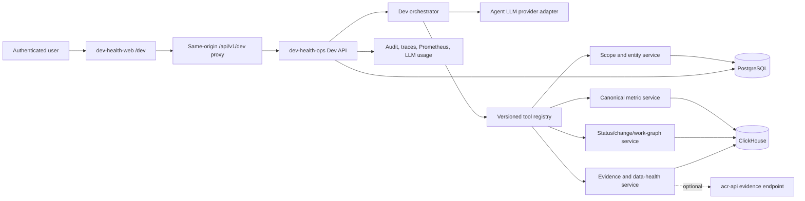
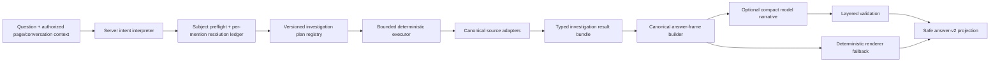

# Platform architecture

Dev Health has a Python product and data platform with additive Go worker foundations. The coexistence boundary is deliberate: Python still owns API, GraphQL, providers, processors, domain behavior, Celery jobs, and every current production route. Go components add versioned job contracts, process foundations, River compatibility, health, operator controls, and migration evidence without silently taking ownership.
{: .fc-page-lede }

## Primary request and data paths

```text
web route
  → FastAPI / GraphQL
  → service or query layer
  → PostgreSQL semantic state or ClickHouse analytics

provider REST / webhook / Customer Push
  → provider or ingest boundary
  → normalization and canonical identity
  → sync plan, queue, or durable outbox
  → Celery execution
  → PostgreSQL / ClickHouse domain writes
  → metrics and product views
```

The Go coexistence path is separate:

```text
versioned job contract + checked-in route
  → producer-owned worker_job_outbox
  → Go reconciler / River insertion
  → compiled handler
  → domain effect and audit
```

Current checked-in routes still point to Celery and no production domain producer routes work to River.

## Ask Dev and Context Fabric runtime

Ask Dev remains part of the existing Python application and API. It is not a browser-side agent, a new generic agent service, or an MCP-driven web chatbot. The authoritative Ask Dev runtime path is:



The app-wide Ask Dev window and `/dev` workspace share this same backend, conversation identity, scope, streaming run, answer contract, evidence authorization, and retention policy.

Wave 3.1 makes the investigation lifecycle server-owned. Mandatory retrieval and canonical synthesis happen before optional model narration:



The model may help present the result. It does not own subject resolution, mandatory source selection, canonical facts, metrics, health states, evidence, or the final safe outcome. See [Ask Dev subject preflight](ask-dev-subject-preflight.md) and [Ask Dev v2 contracts](ask-dev-contracts-v2.md) for the runtime and wire invariants.

ACR is a separate Go service family for agent-facing Context Fabric access:

```text
compatible agent client
  → STDIO MCP
  → acr-mcp
  → HTTPS with scoped ACR credential
  → acr-api
  → authorized Dev Health evidence and operational stores
```

`acr-api` may enrich Ask Dev evidence through an approved adapter, but Ask Dev does not invoke the MCP sidecar. The hosted ACR packet remains authoritative for ACR clients; optional local CodeGraph evidence is supplemental and read-only.

## Ownership boundaries

- **dev-health-web** owns product routes, navigation, UI state, charts, browser interactions, Ask Dev window/workspace composition, and client-side GraphQL behavior.
- **FastAPI and GraphQL** own public request authentication, authorization, schema, and response contracts.
- **Ask Dev orchestration in dev-health-ops** owns server intent interpretation, subject preflight, investigation planning, deterministic source execution, canonical answer frames, optional narrative, and safe outcomes.
- **dev-health-acr** owns hosted context-packet assembly, authorized evidence expansion, ACR credentials, and the local MCP adapter.
- **Services** own business orchestration and domain decisions.
- **Queries and compilers** own bounded storage access and calculation contracts.
- **Providers** own source-specific authentication, pagination, retry, discovery, and normalization.
- **Celery workers and Beat** own current asynchronous execution and schedules.
- **Go worker foundations** own versioned job/runtime contracts, River compatibility, process health, operator controls, and future route migration scaffolding.
- **PostgreSQL** owns semantic/control state and operational authority.
- **ClickHouse** owns source facts, analytics, and materializations.
- **Valkey/Redis** coordinates Celery delivery, rate/budget state, and selected streams.
- **Deployment artifacts** own process composition, routes, secrets, health, migrations, and rollback.

## Canonical operational model

Incidents from supported sources are normalized into one canonical operational model. Provider-native payloads do not become product truth without explicit normalization and identity rules.

PagerDuty has two distinct ingestion interfaces:

- REST API reads for bounded synchronization and backfill;
- Webhooks V3 for signed event delivery.

Both converge on canonical incident identity and ordering. The webhook route resolves organization, source, credential, and signing authority from a persisted opaque binding—not from URL query values or payload fields.

Jira Service Management incident code exists behind a stricter provider contract, but it is not release-ready without live tenant proof. Ordinary Jira issues and alert-like text must not be inferred into canonical incidents.

## Go coexistence components

The foundation provides:

- `dev-health-worker` — future River job execution process;
- `dev-health-scheduler` — bounded schedule-evaluation foundation;
- `dev-health-reconciler` — route-safe outbox and River reconciliation loop;
- `dev-health-stream-runner` — stream-oriented process foundation;
- `dev-health-workerctl` — payload-redacted operator CLI;
- `worker-contractcheck` — job registry, route, profile, capability, and migration-state validation.

Shared packages under `internal/` cover configuration, health, lifecycle, logging, secrets, PostgreSQL, ClickHouse, Valkey, River, job contracts, operator controls, outbox, scheduler, reconciler, and test harnesses.

A process can be live and healthy while its profile is disabled. Production admission requires the route, job version, handler, deployment profile, role authorization, schema, parity, and canary gates to agree.

## Contract rules

- A frontend label is not a backend enum unless the contract maps it.
- A provider field is not a canonical entity or relationship without an approved normalization rule.
- A queue or cache is not the system of record unless the contract says so.
- A job route is owned by the checked-in migration state, not by whichever worker happens to be running.
- A webhook payload cannot choose organization or credential authority.
- An unavailable sample must not be emitted as zero.
- A successful process health check is not domain completion evidence.
- Generated narrative is not canonical evidence or authorization.
- An unresolved subject cannot silently widen to organization data.

## Contributor navigation

Use [Data and storage boundaries](data-and-storage.md) for database, River, outbox, and migration responsibilities. Use [Stable contracts](contracts.md) for public and internal contract changes. Use [Ask Dev subject preflight](ask-dev-subject-preflight.md) and [Ask Dev v2 contracts](ask-dev-contracts-v2.md) for the deterministic investigation boundary. Use [Workers, schedules, and queues](../../operate/configure/workers-and-schedules.md) for deployment ownership and migration gates.
