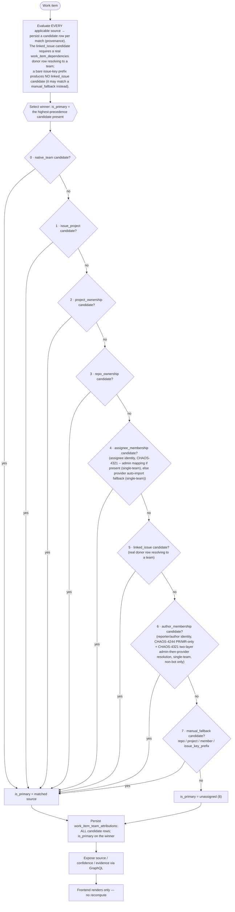
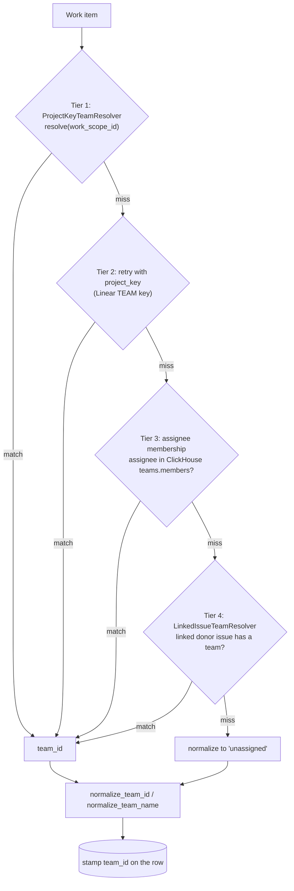
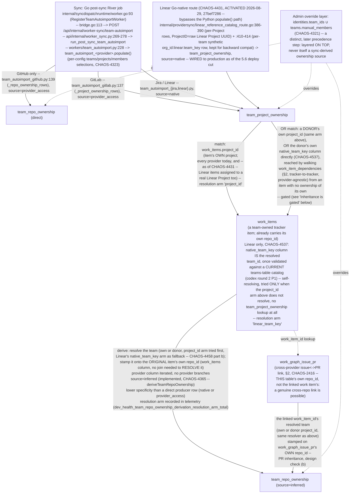
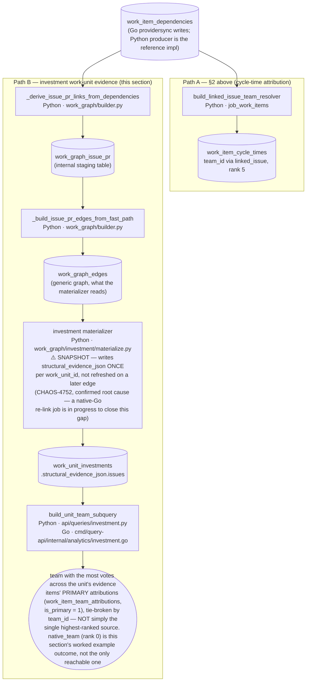
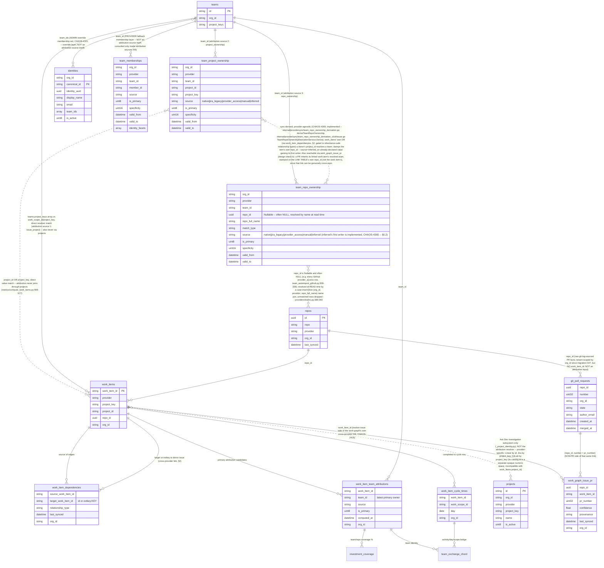
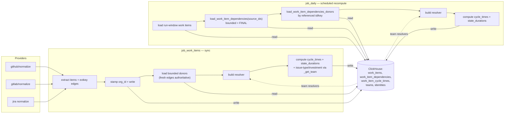
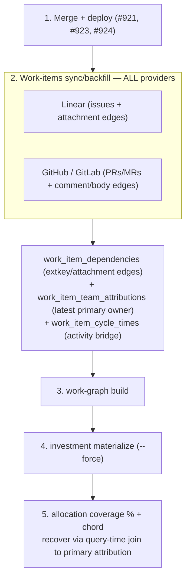
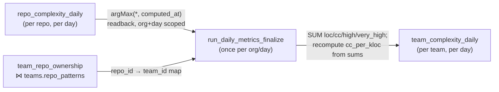

# Architecture: Work-Item Team Attribution & Linked-Issue Inheritance

**Status:** Authoritative
**Scope:** dev-health-ops (metrics/compute, sync, loaders, providers) and the Go worker transport that dispatches it
**Related:** [Platform architecture](platform.md), [Data and storage boundaries](data-and-storage.md),
[Work Graph reference](../../reference/data-models/work-graph.md), [Work Graph guide](../../use/code-and-relationships/work-graph.md)

> **Restoration note (2026-08-19, CHAOS-3968).** This page was deleted on 2026-07-27 when
> `.github/docs-legacy/` was removed, with no replacement of equivalent scope. It is restored here
> substantially verbatim from git history (`git show e23ede618^:.github/docs-legacy/architecture/team-attribution.md`).
> Two things changed since it was first written and are marked inline where they matter: the original
> `Related` list pointed at sibling `docs-legacy/architecture/` pages that no longer exist under the
> current documentation IA (replaced above), and a new **§0.6** was added to reconcile this doc with the
> Celery-to-Go worker cutover, which happened after the original was written. Everything else is the
> original text, checked against current code during restoration and corrected only where noted.
>
> A second verification pass the same day confirmed the §0.1 precedence ladder is **implemented
> exactly as written, not merely a superseded target state** (`_SOURCE_ORDER` /
> `compute_work_items.py:136-144,456`), added several facts not present in the original recovered
> text (marked "Added at restoration" inline: the `Enum8`-codes-are-not-precedence warning, the
> provider-disjoint ownership ranks, the bitemporal/immortal ownership rows, three documented
> exceptions to §5's query-time-join claim, and a pre-replay-snapshot prerequisite for the backfill
> runbook), and named the shared read contract (`PRIMARY_WORK_ITEM_TEAM_ATTRIBUTION_SOURCE`) so
> future readers can cite it directly instead of re-deriving it. See "Stale references to this
> document" near the end for a swept list of other places still citing this page's dead
> pre-migration path.

> First slice of the system-wide architecture-documentation epic. Documents how
> every work item (issue, PR, MR) is stamped with a `team_id`, why PRs used to
> land as `unassigned`, and how cross-provider linked-issue inheritance recovers
> team attribution for the investment **allocation-coverage** and
> **team-exchange chord** views.

## Why this exists

Team resolution historically used three signals — the provider work scope
(repo / project key), the Linear/Jira project key, and assignee membership.
**A GitHub/GitLab PR matches none of them**: its repo rarely maps 1:1 to a
team, it has no project key, and its author often isn't a team member. So PRs
were stamped `team_id = 'unassigned'` and never shared a team dimension with
the issue trackers — leaving TEAM COVERAGE at 0% and the team-exchange chord
empty (no two teams ever co-occur on a work scope).

The fix adds a fourth, **provider-agnostic** tier: a work item with no team of
its own inherits the team of an issue it links to via `work_item_dependencies`.
A GitHub PR closing Linear `CHAOS-2400` borrows that issue's `CHAOS` team.

> **CHAOS-4244 (2026-08-24).** "Author often isn't a team member" was true but
> incomplete: `assignee_membership` (rank 4) only ever read the item's
> **assignee** — GitHub's assignee field, distinct from and far less commonly
> set than the PR's **author**. A PR opened by a team member with no assignee,
> no repo_patterns row, and no linked issue fell all the way through to
> `unassigned` even though the author WAS resolvable — 18.47% of local work
> units, all PR-only evidence against this project's own repos, no linked
> issue. The fix adds the item's reporter (author) as a membership candidate,
> resolved through the same org-scoped identity lookup as the assignee. No
> pathway change: GitHub PRs were already modeled as `WorkItem`s and already
> flowed into this resolver (`providers/github/normalize.py:541` /
> `internal/providersync/github_work_items_rows.go:517`).
>
> **Ruling superseding the first cut (chris, 2026-08-24): author is its OWN
> rank 6, NOT `assignee_membership`'s rank 4.** The initial implementation
> folded the author candidate into `assignee_membership` (still rank 4, no
> new precedence tier) — codex adversarial review flagged that this let a
> person-shaped signal beat a real `linked_issue` donor (rank 5) far more
> often than the pre-existing assignee mechanism ever did, since an author is
> set on nearly every PR while an assignee rarely is. Chris's ruling: an
> author is a PERSON signal, "at best a low-precedence fallback" — it must
> NOT beat a real linked_issue donor. The fix gives the author candidate its
> own source, `author_membership`, ranked BELOW `linked_issue` (5) and ABOVE
> `manual_fallback` (now 7) — this widens the `Enum8` (migration 078; CS1's
> own migrate-before-emit rule) and adds a 9th precedence stage. See
> `metrics/compute_work_items.py:405-642` and
> `internal/providersync/github_work_items_derivation_context.go:605-754`.

> **CHAOS-4321 (chris's ruling, 2026-08-26, final form 08:30 PT).** Plain
> wording (chris-approved, quoted verbatim wherever this rule is described —
> ticket, PR, docs, evidence strings): *"A work item gets a team from the
> project/repo it lives in. That is team attribution. If that finds nothing,
> we look at the person on the item (assignee, or PR author). If that person
> is mapped to one team, the item goes to that team. If the person is mapped
> to two or more teams, we do not guess — the item stays unassigned."*
> "Mapped" means the ClickHouse team mappings — an admin-authored override
> when one exists, provider-imported membership otherwise.
>
> `assignee_membership` (rank 4) and `author_membership` (rank 6) are
> membership-shaped signals, resolved by a shared TWO-LAYER lookup
> (`_resolve_membership` / `resolveMembership`, one exactly-one-team gate,
> applied identically to both layers):
>
> 1. **Admin layer (the override, authoritative).** `identities`
>    (canonical_id → team_ids, provider_identities — written by
>    `/org/admin/identities`) ∪ `teams.manual_members` (a facet roster —
>    written ONLY by `ClickHouseTeamAdminService.add_members`/
>    `remove_members`/`set_members`, the admin Identities screen and the
>    drift-approval flow; provider-untagged: a bare `manual_members` entry
>    with no backing `identities` row still resolves, matched by normalized
>    equality with no provider tag). An identity's admin-authorized team set
>    is `identities.team_ids` ∪ every active team whose `teams.manual_members`
>    contains one of the identity's facets — the union matters because the
>    drift-approval admin action (`apply_identity_membership_change`,
>    `api/services/configuration/clickhouse_identity_drift.py`) writes
>    `teams.manual_members` directly without updating `identities.team_ids`.
>    If this layer has ANY candidate for the identity, it decides outright —
>    1 team attributes, 2+ teams is `unassigned` (`ambiguous_admin_membership`,
>    evidence lists the colliding team ids) and does **not** fall through to
>    layer 2: an ambiguous admin mapping is a data problem to fix, not to
>    route around.
>
>    `teams.manual_members` (migration `079_teams_manual_members.py` -- a
>    Python migration, not pure DDL, since it also backfills from
>    `identities.team_ids` for pre-existing admin-mapped identities) is a
>    CHAOS-4321 fix, not the original design: an earlier revision of this
>    ticket treated ALL of `teams.members` as the override, but a codex
>    adversarial review (HIGH, both languages) found provider auto-import
>    writes UNREVIEWED roster rows straight into `teams.members` too
>    (`ClickHouseTeamDriftProjector.project_team`'s `AUTO_APPLY_POLICY`
>    branch, for any identity that doesn't conflict with an existing manual
>    override) — so a roster entry imported from ONE provider could become
>    the authoritative, ambiguity-suppressing answer for a DIFFERENT
>    provider's work item sharing the same identity string. `manual_members`
>    is the admin-EXCLUSIVE subset (confirmed by tracing every write site);
>    provider auto-import carries it forward unchanged on every sync write
>    and never sets or clears it. Pre-existing `teams.members` entries have
>    no way to prove their provenance and fall into the provider layer below
>    until re-saved from the admin panel.
> 2. **Provider layer (the fallback).** `team_memberships`, populated
>    exclusively by the four auto-import workers
>    (`workers/team_autoimport_{github,gitlab,jira,linear}.py`) ∪
>    `teams.members` (the mixed-provenance roster the fix above demoted out
>    of the admin layer). Consulted ONLY when layer 1 has zero candidates for
>    that identity (chris, 08:30 PT: *"manual is override — if the override
>    exists, use it, else use attribution from providers"*; refined
>    2026-08-26 10:39 PT: *"admin is an override, not a default — it's the
>    sync config mapping, but admin can override it in the panel"*). Same
>    one-team gate: ambiguous here is `ambiguous_provider_membership`;
>    nothing in either layer is `no_membership`.
>
> `team_memberships` keeps its other consumer (drift/conflict review, §0.5)
> untouched — this ticket only changes which candidate source(s) attribution
> reads and in what order, not what writes `team_memberships` or how drift
> review reconciles it.
>
> The pre-existing single-team ambiguity gate (CHAOS-4110, previously
> author-only, provider-layer-only) now applies to BOTH assignee and author,
> and to BOTH layers (assignee previously had no gate at all — an ambiguous
> member's ranking by specificity/priority silently picked an arbitrary
> winner, the exact defect this ticket removes). Telemetry rides the
> existing `no_candidate:<reason>` evidence mechanism (already generalized by
> `work_item_team_attribution_metric_source` /
> `githubWorkItemTeamAttributionMetricSource` — those mappers strip any
> `:<team ids>` suffix before it becomes a Prometheus label, a cardinality
> guard, while the full reason + team ids stay in the persisted `evidence`
> column for an admin to act on): `no_membership` (neither layer has any
> mapping), `ambiguous_admin_membership:<ids>`, `ambiguous_provider_membership:<ids>`
> (precedence in that order when more than one applies), `bot_author`
> (author path only, unchanged).
>
> Net effect: the precedence ladder, its ranks, its Enum8 codes and its
> donor-eligibility set are **unchanged by this ticket** — only HOW
> `assignee_membership`/`author_membership` resolve changed (a two-layer
> lookup replacing a single flat one). See
> `metrics/compute_work_items.py::_resolve_membership`/`resolve_team_attribution`
> and
> `internal/providersync/github_work_items_derivation_context.go::resolveMembership`/`resolve`.
>
> **Regression, not new design.** This override existed before: the
> ClickHouse-backed roster resolver (`providers/teams.py::_build_member_to_team`,
> reachable via `load_team_resolver_from_store` reading `teams.members`) is
> the ancestor this ticket restores as the admin layer's manual-facet half —
> now via the narrower, provably admin-exclusive `teams.manual_members`
> column rather than the mixed-provenance `teams.members` an earlier
> revision used, per the fix above — see "Stale references to this
> document" / the CHAOS-4321 PR body for the file:line history of where the
> override stopped being wired into `resolve_team_attribution`'s default
> call path.

---

## 0. Target state (CHAOS-2600) — ClickHouse-only team attribution

> **Governing target contract.** This §0 is the source of truth for the intended model and the
> debugging navigation aid; **new code must follow it.** It is implemented across CHAOS-2600
> CS1–CS7 — the ClickHouse enum widening lands in **CS1** (see *Schema prerequisite* below), the
> precedence tests are inverted in **CS2**, and the legacy Postgres bridge path is removed in
> **CS5/CS6**. Until then, §1 below still describes the live (pre-CHAOS-2600) cascade and the
> existing tests still encode the old precedence.

> **CS6 reality (CHAOS-2607).** ClickHouse is the system of record for **both** the team
> catalog **and** identity→team membership. As of CS6 the Postgres `team_mappings` / `identity_mappings`
> tables and models are **deleted** (Alembic `0020`), along with the `TeamMappingService` /
> `IdentityMappingService` / `TeamDriftSyncService` classes, the `sync-team-drift` /
> `reconcile-team-members` tasks, and the Postgres-backed drift engine. (The four admin drift-review
> endpoints currently stand as HTTP 501 stubs and are being **rebuilt natively on ClickHouse — not
> deleted — under CHAOS-2622**; see §0.5. The earlier "removed in CS7 with the web caller —
> CHAOS-2608" intent is superseded — CHAOS-2608 is an unrelated Done web ticket.) (CS5 had already deleted the
> Postgres→ClickHouse team bridge `providers/team_bridge.py` and `providers/team_reconcile.py`.) Admin
> team/identity CRUD goes through `ClickHouseTeamAdminService` + `ClickHouseIdentityStore`, writing the
> ClickHouse `teams` and `identities` tables directly. Identity membership uses **surgical replacement**
> semantics: updating an identity removes its facets from teams it left and replaces changed facets in
> teams it stayed in, editing `teams.members` **and** `teams.manual_members` (CHAOS-4321) add/remove-by-facet
> (never a full recompute) so Auto Import / catalog members are preserved. See *CS6 status (CHAOS-2607)*
> at the end of §4.

**ClickHouse is the only source used for analytics attribution. Postgres does not store or resolve
team attribution mappings.** Manual mappings are ClickHouse fallback records only — never overrides,
never outranking WTI-native facts. PR/MR attribution comes from an **actual linked issue donor**; an
external issue-key *prefix* alone is not linked-issue inheritance.

Every final attribution carries provenance: `org_id, work_item_id, provider, team_id, team_name,
source, confidence, evidence, is_primary, computed_at`.
`source ∈ {native_team, issue_project, project_ownership, repo_ownership, assignee_membership,
linked_issue, author_membership, manual_fallback, unassigned}`; `confidence ∈ {high, medium, low, manual, none}`.

> **Schema prerequisite (CS1).** The `issue_project` / `manual_fallback` sources and the `manual` /
> `none` confidence values require the ClickHouse `Enum8` widening on `work_item_team_attributions`
> (migration 053) to land **before** any resolver emits them — emitting an unknown enum value fails
> the insert. This is CHAOS-2600 ordering rule §4.1: migrate enums (CS1) → then emit (CS2/CS3).
> `author_membership` followed the same rule under **CHAOS-4244** (migration 078).
>
> **Restoration check (2026-08-19):** confirmed current. Migration `053_manual_attribution_fallbacks.sql`
> widens `work_item_team_attributions.source` to an 8-value enum
> (`native_team=1, linked_issue=2, project_ownership=3, repo_ownership=4, assignee_membership=5,
> unassigned=6, issue_project=7, manual_fallback=8`) and `confidence` to 5 values, on top of the base
> table created by migration 051. **CHAOS-4244 (2026-08-24)** appended a 9th code, migration
> `078_author_membership_source.sql`: `author_membership=9`. All three migrations are still applied
> and the enum still matches this section exactly.
>
> **These `Enum8` codes are storage identifiers, not precedence — do not read them as the ladder.**
> `Enum8` can only be *appended* to (a code, once assigned, is never renumbered), so the codes are
> insertion order across three migrations, nothing more. Proof by contradiction: `issue_project` is
> stored as `7` above, but it ranks **1** in the actual precedence (`_SOURCE_ORDER` below) — second
> only to `native_team`; `author_membership` is stored as `9` (the highest code) but ranks **6**, well
> above `manual_fallback` and `unassigned`. The one and only precedence order is `_SOURCE_ORDER` in
> `metrics/compute_work_items.py`, cited in §0.1 below; the storage codes exist so ClickHouse has a
> compact column type, and that is all they exist for.

### 0.1 Resolution decision tree

Resolution is **staged by precedence**. The resolver evaluates the applicable sources and persists
**all** matching ones as candidates; the *winner* (`is_primary`) is the highest-precedence source
present. "Wins" means *primary selection* — it does not mean lower-precedence sources go
unevaluated or unrecorded. **To debug:** read `team_attribution_source` (the winner) from
provenance, jump to that node, and verify no higher-precedence stage matched.



**Invariants:** the **winner is the highest-precedence matching source** (all matching sources are
still persisted as candidates — precedence decides `is_primary`, not which sources are computed);
`linked_issue` (5) requires a real `work_item_dependencies` donor row resolving to a `work_items`
row whose **own team came from a first-class fact (sources 0–4)** — a donor resolved only by
`author_membership` or `manual_fallback` is NOT a valid donor, so neither a person-shaped author
signal nor a bare prefix can ever be laundered into rank-5 inheritance (both fall through to 6/7);
`author_membership` (6) can beat `manual_fallback` and `unassigned` but never a real linked_issue,
ownership, or membership fact — a PERSON signal, "at best a low-precedence fallback" (chris,
CHAOS-4244); `manual_fallback` (7) can only beat `unassigned`; a whole org at `unassigned` usually
means the ClickHouse `teams` dimension is empty.

> **Restoration verification (2026-08-19, updated 2026-08-24 for CHAOS-4244): this ladder is
> implemented, not just intended.** A prior reading of this repository, using the `Enum8` storage
> codes instead of the precedence order, reported a *different* six-member ladder missing
> `issue_project` and `manual_fallback`. That reading was wrong (see the Enum8 warning in §0 above) —
> the ladder above is exactly what runs. Verbatim, `metrics/compute_work_items.py:143-153`:
> ```python
> _SOURCE_ORDER: dict[TeamAttributionSource, int] = {
>     "native_team": 0, "issue_project": 1, "project_ownership": 2,
>     "repo_ownership": 3, "assignee_membership": 4, "linked_issue": 5,
>     "author_membership": 6, "manual_fallback": 7, "unassigned": 8,
> }
> ```
> Applied at `compute_work_items.py:587` — `for source in sorted(candidates_by_source, key=lambda s: _SOURCE_ORDER[s]):`,
> first non-empty group in that order is primary. An independent second implementation of the same
> 9-value, same-order ladder exists SQL-side as `_SOURCE_RANK_SQL` in
> `api/graphql/resolvers/team_attribution.py:142-154` (a `multiIf` chain), with a comment there
> instructing it be kept in lockstep with this dict.
>
> The `manual_fallback` donor guard the doc describes below is also real, not aspirational —
> `_DONOR_SOURCES` at `compute_work_items.py:164-172`, used at `:727` to gate which sources a
> `linked_issue` donor may pass on: `{native_team, issue_project, project_ownership, repo_ownership,
> assignee_membership}` — ranks 0–4 only, UNCHANGED by CHAOS-4244. `author_membership`,
> `manual_fallback` and `unassigned` are excluded by construction, so neither a person-shaped author
> signal nor a fallback rule (especially the provider-neutral `issue_key_prefix` scope) can ever be
> laundered into rank-5 `linked_issue` provenance on a dependent item, exactly as this page already
> said — and a required test (`test_author_never_outranks_a_linked_issue_donor` /
> `TestGitHubWorkItemDerivationAuthorNeverOutranksALinkedIssueDonor`) pins a PR with a team-mapped
> author AND a linked_issue donor for a DIFFERENT team resolving to the **linked issue's** team.

### 0.2 Source reference matrix

| # | `source` | Resolves from (ClickHouse) | Confidence | Beats | Never overrides | Evidence keys |
|--:|---|---|---|---|---|---|
| 0 | `native_team` | `WorkItem.native_team_key` → `teams` | high | all below | — (top) | `native_team_key` |
| 1 | `issue_project` | native issue project → owning team | high | 2–8 | 0 | `project_id, owner_team` |
| 2 | `project_ownership` | `team_project_ownership` | high | 3–8 | 0–1 | `project_id, provider` |
| 3 | `repo_ownership` | `team_repo_ownership` | medium | 4–8 | 0–2 | `repo_full_name` |
| 4 | `assignee_membership` | CHAOS-4321 two-layer: `identities`/`teams` (admin override, single-team) else `team_memberships` (provider fallback, single-team) | high (admin) / medium (provider) | 5–8 | 0–3 | `canonical_id, identity` (evidence text: `assignee_membership=<id>`) |
| 5 | `linked_issue` | `work_item_dependencies` donor → donor's team | medium | 6–8 | 0–4 | `dependency_type, donor_work_item_id, donor_provider` |
| 6 | `author_membership` | CHAOS-4244 PR/MR-only + CHAOS-4321 two-layer (same as row 4), non-bot | high (admin) / medium (provider) | 7–8 | 0–5 | `canonical_id, identity` (evidence text: `reporter=<id>`) |
| 7 | `manual_fallback` | `manual_attribution_fallbacks` (repo/project/member/issue_key_prefix) | manual\|low | 8 only | 0–6 | `scope_type, scope_id, reason` |
| 8 | `unassigned` | — (nothing matched) | none | — (floor) | — | `reason` |

> **Added at restoration (2026-08-19): ranks 2 and 3 are provider-disjoint, not overlapping tiers.**
> This is not in the original recovered text and is easy to misread as damage. GitHub writes
> `team_repo_ownership` (rank 3, `repo_ownership`) and never `team_project_ownership` — GitHub has no
> native Project entity. GitLab, Jira, and Linear write `team_project_ownership` (rank 2,
> `project_ownership`) and never `team_repo_ownership`. So `team_repo_ownership` being empty for a
> non-GitHub org, or `team_project_ownership` being empty for a GitHub-only org, is the **designed
> state**, not a coverage gap. Writers: `workers/team_autoimport_github.py:142` calls
> `sink.write_team_repo_ownership`; `workers/team_autoimport_gitlab.py:209` calls
> `sink.write_team_project_ownership` (Jira/Linear autoimporters write the same table).

> **CHAOS-4365 `inferred`: an already-declared `team_repo_ownership.source` value gets its first
> writer -- not the 9-value ladder above, and not a schema change.** Ruling (chris, 2026-08-28
> 07:58-08:04 PT): "the repo should still have a team as well as the PR through the linear
> connection," amended 08:07 PT to be provider-agnostic: "the graph associated VIA ANY TOOL THAT CAN
> MAP to github/gitlab objects. The SOURCE github/gitlab/bitbucket ARE irrelevant." Coordinated
> producer design (CHAOS-4365 lane): edge-walk `work_items` -- either the item's **own** `project_id`,
> or, when that has no ownership row, a **donor's** `project_id` reached by walking
> `work_item_dependencies` (§2, tracker-to-tracker, provider-agnostic) -- into `team_project_ownership`
> to resolve a team, then stamp that team onto the **original** item's own `repo_id` (already a
> `work_items` column; no join to `repos` needed to get it). The provider column is iterated
> generically -- no provider branches. Rows land with **`source = 'inferred'`, at lower
> `specificity` than a direct producer row**, so a GitHub-team-owned repo's own row (`source =
> 'provider_access'`, §0.4a) still wins the `is_primary` tie-break for that repo. `inferred` is
> already a live value in
> `team_repo_ownership.source`'s `Enum8('native'=1, 'jira_legacy'=2, 'provider_access'=3,
> 'manual'=4, 'inferred'=5)` (migration `051`) -- this producer is its **first writer**, not a new
> enum value, and needs **no migration**. It is **not** a new row 2.5 in `_SOURCE_ORDER` above:
> attribution rank 3 (`repo_ownership`) is unchanged, reading `team_repo_ownership` uniformly
> regardless of which sub-source produced the winning row. **Status: IMPLEMENTED**
> (`internal/providersync/team_repo_ownership_derivation.go`'s `deriveTeamRepoOwnership` -- the pure
> resolution logic -- plus `internal/providersync/team_repo_ownership_derivation_clickhouse.go`'s
> `TeamRepoOwnershipDerivationService.Derive`, the ClickHouse read/write glue). The donor walk reuses
> the EXISTING linked-issue resolver's gating verbatim (`compute_work_items.py`'s
> `_INHERITABLE_RELATIONSHIP_TYPES`/latest-edge-per-pair/extkey-ambiguity rules, see the "Inheritance
> is gated" bullets in §1.1) rather than a looser first-donor walk, and additionally resolves PRs
> through `work_graph_issue_pr` (§1.1's new PR-inheritance branch) that the original summary above
> did not cover. See the ownership-derivation diagram in §1.1 and the ER callouts in §3.

> **CHAOS-4458 part (b) (fixed): the derivation's Linear arm never resolved, because
> `team_project_ownership`'s Linear rows and `work_items.project_id` for a Linear item were two
> DISJOINT id spaces AT THE TIME OF DIAGNOSIS** (`"{org_id}:linear:{team_key}"` vs. the raw Linear
> Project UUID). CHAOS-4431 (merged after this diagnosis) now ALSO writes `team_project_ownership`
> rows keyed by the raw Linear Project UUID for every org this route has synced — the two id spaces
> now co-exist rather than staying permanently disjoint; see the "Two Linear id spaces, one resolver"
> callout in §1.1 for the full trace, the fix, and the post-CHAOS-4431 update.
> Prod symptom (CHAOS-4458): `team_repo_ownership` derivation `outcome=no_signal`, 0 rows, every org
> — the GitLab/Jira arms of this same join were unaffected (their ownership writers and work-item
> normalizers agree on what `project_id` means), so this was a Linear-specific gap, not a general
> failure of the CHAOS-4365 item 1b producer.

> **CHAOS-4365: a second `team_repo_ownership` consumer, and the operator path to populate it for a
> real org.** `metrics/job_daily.py::_write_compounding_risk_for_day` (and the standalone
> `metrics/job_compounding_risk.py` CLI job) resolves one team per repo for
> `compounding_risk_daily`'s `scope='team'` rows. Before CHAOS-4365 that resolution read ONLY
> `teams.repo_patterns` (glob strings, `providers/teams.py::build_repo_pattern_resolver`) — CHAOS-4276
> seeds patterns for a repo's primary owner in **fixtures** data, but no native auto-importer (GitHub,
> GitLab, Jira, Linear) ever writes `repo_patterns`, so a real org's compounding-risk team rows were
> silently empty even when GitHub auto-import HAD populated `team_repo_ownership` correctly. The fix
> (`providers/teams.py::load_team_repo_ownership_map`) reads `team_repo_ownership` directly
> (repo_id-keyed, `is_primary`/`specificity`-ranked) and merges it OVER the pattern resolver, so a
> GitHub-owned repo resolves to its team even with `repo_patterns=[]`. **Operator path for a real
> org with zero `team_repo_ownership` rows:** trigger `run_team_autoimport` for that org with GitHub
> selected as a source (sync-config / the team auto-import job — see
> `docs/operate/run/workers-and-jobs.md`) — `team_autoimport_github.populate()` is the only writer.
> GitLab/Jira/Linear-only orgs have no `team_repo_ownership` writer by design (§0.2 above); their
> repos resolve to a team only via `teams.repo_patterns` (manually configured, or fixtures).

> **CHAOS-4365 item 2 (merged, `dev-health-ops#1963`, squash `017f964b2`): `team_cognitive_load_daily` — an
> append-only, ownership-scoped table.** The `resolveCognitiveLoad` GraphQL resolver's single-team
> path (`teamId` set, `repoId` NOT set) reads this table directly instead of the org-wide
> user_metrics_daily`/`team_metrics_daily` merge (`dev-health-ops#1970`) — that merge filtered on
> those tables' own `team_id` column, which is exactly the membership-fallback-tainted column this
> table exists to avoid; a single-team query on a real org returned zero rows via that path even
> though the org-wide query worked. Team-keyed cognitive load
> (interruption load, context spread, review-request load, after-hours/weekend commit ratios) does
> not exist today — `user_metrics_daily` (migration `016`) carries these signals per person/repo
> only, and its own `team_id` column falls back to membership resolution (CHAOS-4396), which
> CHAOS-4321 forbids as a team key. `team_cognitive_load_daily` (migration
> `081_team_cognitive_load_daily.sql`) will be written by aggregating
> `user_metrics_daily`/`team_metrics_daily` rows **by `repo_id`**, then mapping `repo_id → team`
> through the same `team_repo_ownership` (merged over `teams.repo_patterns`) resolution CHAOS-4365
> item 1 wired into `providers/teams.py::load_team_repo_ownership_map` — never through either
> source table's own `team_id` column.
>
> | Column | Type | Notes |
> |---|---|---|
> | `org_id`, `team_id` | `String` | |
> | `day` | `Date` | |
> | `pr_interruption_load`, `review_request_load` | `Float64` | Summed across every author on every repo the team owns |
> | `context_spread_count` | `Float64` | **Not** a sum: `user_metrics_daily`'s `context_spread_count` is already one author's total distinct-repo count for the day, copied identically onto every one of that author's per-repo rows. Summing it across a team's owned repos would multiply, not count. The producer instead counts distinct `(author_email, repo_id)` pairs across the team's owned repos |
> | `after_hours_commit_ratio`, `weekend_commit_ratio` | `Nullable(Float64)` | Recomputed from summed after-hours/weekend commit counts across owned repos — never averaged directly (a ratio is not additive); `NULL` when no source row exists for any owned repo that day, distinct from a measured `0.0` |
> | `contributing_repo_count`, `sample_author_count` | `UInt32` | Diagnosability: how many owned repos and distinct authors rolled up into the row |
> | `computed_at` | `DateTime64(6, 'UTC')` | |
>
> `ENGINE = MergeTree PARTITION BY toYYYYMM(day) ORDER BY (org_id, team_id, day)` — **append-only**,
> matching every other daily rollup in this schema (`compounding_risk_daily` included): a
> re-computation inserts a new row with a later `computed_at`, it never updates in place, and
> readers dedup per `(org_id, team_id, day)` via `argMax(<col>, computed_at)`. Never
> `ReplacingMergeTree`.
>
> **Producer runs in the finalize step, once per org/day** — `run_daily_metrics_finalize`
> (`metrics/job_daily.py`), the same once-per-org/day stage CHAOS-4399 moved
> `compounding_risk_daily`'s team-scope aggregation into. Unlike `compounding_risk_daily` (which
> CHAOS-4399 fixed to read that day's per-repo rows back from ClickHouse, `argMax`-deduped), the
> cognitive-load producer aggregates THIS RUN's already-computed in-memory
> `user_metrics_daily`/`team_metrics_daily` rows directly and deliberately never re-queries
> ClickHouse for them — either way, it writes exactly one row per `(org_id, team_id, day)`. A
> per-repo write inside the daily partition loop was the CHAOS-4399 bug class (a multi-repo team
> silently kept only the last-processed repo's numbers) and must never be reintroduced here.
>
> **Schema pin:** column types and the `ORDER BY`/engine clause are pinned byte-for-byte in
> `full-chaos/dev-health-go`'s `schema.go` (`ProductionColumns["team_cognitive_load_daily"]` /
> `EngineFull`, tagged `v0.2.0`, merged ahead of this ops PR per the agreed sequencing) with a test
> asserting they match an **embedded copy** of this migration's DDL exactly. That Go test has no
> access to this repository, so the copy is a manually-synchronized pin, not automatic cross-repo
> enforcement: a column added, renamed, or retyped here is only caught once someone updates the
> embedded copy in `dev-health-go` and reruns its test — editing only this migration does not, by
> itself, break `dev-health-go` CI.

> **CHAOS-4406 (fixed): the team+repo COMBINED `resolveCognitiveLoad` path also stopped trusting the
> tainted `team_id` column.** `team_cognitive_load_daily` carries no `repo_id` dimension, so it
> cannot serve a query where BOTH `teamId` and `repoId` are set — that combined path used to fall
> through to the pre-CHAOS-4365 two-query merge over `user_metrics_daily`/`team_metrics_daily`,
> filtered on those tables' own `team_id` column (the same CHAOS-4396 taint). The fix,
> `_resolve_owned_repo_id` (`resolvers/cognitive_load.py`), reuses the SAME two-source,
> ownership-wins-over-pattern merge every other ownership-scoped reader in this codebase applies
> (`providers/teams.py::load_team_repo_ownership_map`; `job_daily.py`'s
> `_repo_to_team_map_for_compounding_risk`; `metrics/team_cognitive_load.py`'s own write-time
> resolution) — an early version of this fix (codex R1) reinvented a narrower, incorrect version
> that filtered `team_repo_ownership` on a bare `argMax(repo_id, …) IS NOT NULL`, which silently
> rejected **every** native GitHub ownership row (§0.2's `repo_id is Nullable and often NULL`
> note): (1) native `team_repo_ownership` wins where it resolves the repo, via the SAME
> `coalesce(repo_id, name-joined id)` + `matched` sentinel join `load_team_repo_ownership_map`
> uses; (2) ranked by `(is_primary DESC, specificity DESC, updated_at DESC)` so a non-primary
> co-owner is never mistaken for the canonical owner; (3) falls back to the requesting team's
> `teams.repo_patterns` glob strings ONLY when native ownership resolves nothing for the candidate
> repo — the path GitLab/Jira/Linear auto-imports rely on entirely, since none of them write
> `team_repo_ownership`. An unowned/nonexistent repo, or one owned by a different team, returns an
> explicit empty result, never the wrong team's data. Once ownership is confirmed, both data
> queries filter by the resolved `repo_id` ALONE: `user_metrics_daily` via its existing repo
> predicate, and a new `_fetch_repo_scoped_team_metrics` for `team_metrics_daily` that sums the
> additive counts across **every** `team_id` label attached to that repo's rows before
> recomputing the ratio (mirroring `_fetch_team_metrics`'s SUM-then-recompute discipline for a
> team's several repos, transposed: here several `team_id` labels collapse onto one repo, since
> one repo's commits can be split across per-commit membership-fallback team_id fragments —
> CHAOS-4396). Known residual gap: if the org has the same repo slug under two providers and the
> requesting team owns both, only one is served (matches `_fetch_user_metrics`'s own pre-existing
> slug-resolution shape for the org-wide path) — tracked as a follow-up, not closed here.

### 0.3 Off-the-rails matrix (symptom → diagnosis → fix)

| Symptom | Likely stage | Diagnose | Fix |
|---|---|---|---|
| A whole org is `unassigned` | 7 (floor) | `get_all_teams()` empty? CH `teams` populated for `org_id`? | re-home teams population; verify daily-chain order |
| PR attributed to a surprising team via `linked_issue` | 5 | which `work_item_dependencies` edge? donor's own team? extkey ambiguous? | confirm donor row + `_canonical_target`; check `_INHERITABLE_RELATIONSHIP_TYPES` |
| A PR that WAS attributed via `linked_issue` silently becomes `unassigned` on a later run | 5 → 7 | is the donor edge older than the sync window? compare the edge's `last_synced` against the run window — donor and dependent stamped minutes apart rules staleness out | **fixed CHAOS-4112**: the donor preload unions the STORED inheritable edges for the items being recomputed with the fresh ones (`_merge_stored_inheritable_edges`), so an edge aging out of the window no longer un-attributes the PR. Watch `devhealth_work_item_team_attribution_downgrades_total` — a teamed→`unassigned` transition is always a bug |
| `manual_fallback` beats a real team | precedence | `_SOURCE_ORDER` has `manual_fallback=7`? loader merging manual at the wrong rank? | restore rank — manual is the lowest non-unassigned tier |
| An author beats a real `linked_issue` donor | precedence | `_SOURCE_ORDER` has `author_membership=6` (below `linked_issue=5`)? did a fix accidentally fold it back into `assignee_membership=4`? | restore rank — author is a PERSON signal, never above a real linked_issue donor (CHAOS-4244, chris's 2026-08-24 ruling) |
| A bare prefix (e.g. `CHAOS`) attributes as `linked_issue` | 5 vs 7 | did a full key resolve to a real `work_items` row, or did a prefix shortcut leak in? | no prefix→team in `linked_issue`; route to manual `issue_key_prefix` |
| A PR inherits via `linked_issue` from a donor that only has an `author_membership` or `manual_fallback` rule | 5 (donor) | is the donor's *primary* source in 0–4? a rank-6/7 fallback must never be relabeled rank-5 | donors gated to `_DONOR_SOURCES` (0–4) in `build_linked_issue_team_resolver`; an author-only or manual-only donor is never a linked_issue donor (done CS3; author exclusion CHAOS-4244) |
| Same scope shows duplicate ownership candidates / bloats over time | RMT read | `valid_from` is in the ownership tables' `ORDER BY`, so `FINAL` cannot collapse re-imports (each daily run is a new sort key) | reads dedup per *logical* scope via `argMax((updated_at, valid_from))`, NOT `FINAL` (done CS3, `load_team_attribution_context`); manual-fallback read keeps `FINAL` (its sort key has no `valid_from`) |
| Team flips / stale team lingers after a re-org | write side | ownership writers set `valid_from=now` but never `valid_to`, so a reassigned scope keeps the old-team row active; readers can't tell stale from co-ownership | needs writer-side `valid_to` expiry on re-derivation — tracked **CHAOS-2610** (read-side `argMax` already makes the newest the primary by recency tiebreak) |
| `manual_fallback` resolves the wrong team | scope match | which `manual_attribution_fallbacks` row matched (repo/project/member/issue_key_prefix)? | check `_manual_fallback_candidates` scope match + rule `priority`; manual is rank 7 (done CS3; renumbered from 6 by CHAOS-4244) |
| Provenance absent in the API | GraphQL | resolver SELECTs the provenance columns? SDL has the fields? | expose `source/confidence/evidence` |
| Web shows a different team than the backend | client recompute | any client-side mapping derived from `evidence`? | render-only; delete client derivation |

> Full data-flow and data-object-hierarchy diagrams: see the CHAOS-2600 plan §1.6–1.7 / `team-flow.md`.

> **Restoration verification (2026-08-19): ownership rows are bitemporal but effectively immortal —
> a missed sync does not degrade attribution.** The "Team flips / stale team lingers" row above
> already flagged that writers never set `valid_to`; confirmed still true and worth stating plainly.
> The rank-2/rank-3 loader reads (`metrics/loaders/clickhouse.py:417-418` for `project_ownership`,
> `:459-460` for `repo_ownership`) filter only on
> `valid_from <= as_of AND (valid_to IS NULL OR valid_to > as_of)` — there is **no freshness
> cutoff**, so an ownership row from months ago is exactly as eligible as one from today. `valid_to`
> is never written by any writer of `team_project_ownership` / `team_repo_ownership` in `src/`
> (`workers/team_autoimport_{github,gitlab,jira,linear}.py`) — every autoimport run is a pure
> `INSERT`, never an `UPDATE`. Reads then dedup per logical scope via
> `argMax(..., (updated_at, valid_from))`, so the newest generation always wins on a tie. The
> practical consequence: **if a scheduled team-autoimport run is skipped or fails, ownership
> attribution does not go stale or empty — the previous generation's rows are still `valid_from`-
> eligible and still the `argMax` winner.** This is a resilience property, not a bug, but it also
> means a *removed* ownership mapping (a repo reassigned away from a team) has no clean way to
> retire the old row short of CHAOS-2610's tracked writer-side `valid_to` expiry.

### 0.4 Provider coverage contract (attribution is provider-agnostic)

Attribution is **provider-agnostic** — the resolver and precedence (§0.1) never branch on provider.
That is a **testable contract**: every WTI provider × every normalized entity must be covered, not
just Linear. **Attribution changes MUST keep this matrix green; never add Linear-only coverage.**

| provider \ entity | teams | projects | members | issues |
|---|---|---|---|---|
| jira   | yes | yes | yes | yes |
| gitlab | yes | yes     | yes  | yes |
| github | yes     | n/a¹    | yes     | yes |
| linear | yes     | yes | yes     | yes |

`yes` = normalized in src AND asserted in tests · `partial` = only sink/integration assertion (no
unit test of the normalizer) · `no` = normalized but output never asserted · `n/a` = provider does
not natively produce this entity. ¹ GitHub has no native Project entity (the repo is the scope).

> **The matrix above tracks TEST coverage, not whether the data is pulled.** Functionally we ingest teams, projects, and members for *every* provider that supports them (auto-import, when the option is selected). Don't read a `partial`/`no` cell as "not consumed" — it means "not yet asserted."

#### 0.4a Provider × entity **consumption** (functional — what `run_team_autoimport` actually pulls)

| provider | teams | projects | members | repo ownership | member store written |
|---|---|---|---|---|---|
| linear | ✓ `discover_linear` | ✓ `associations.project_keys` | ✓ `discover_members_linear` | — | edges **+ roster** |
| jira   | ✓ `discover_jira` | ✓ `associations.project_keys` | ✓ `discover_members_jira_bulk` | — | edges **+ roster** |
| github | ✓ `discover_github` | n/a (repo = scope) | ✓ `discover_members_github` | ✓ `team_repo_ownership` | edges **+ roster** (this CS) |
| gitlab | ✓ `discover_gitlab` | ✓ (GitLab project paths) | ✓ `discover_members_gitlab` | — | edges **+ roster** (this CS) |

One path: `run_team_autoimport` → `team_autoimport_<provider>.populate()` → `discover_*` → ClickHouse. (`LinearClient.iter_projects` is vestigial dead code, never a path.)

> **Three (legacy bridge) + three (native, CHAOS-4431/4434/4432) chains reach `team_autoimport_<provider>.
> populate()` or bypass it entirely — status as of CHAOS-4431's base branch (`team-catalog-native-dispatch`,
> stacked PRs #1989/#1984/#1985, NOT YET MERGED — main is under deploy-freeze).**
>
> | Producer | Chain | Honours the 3 flags? | Providers |
> |---|---|---|---|
> | Go post-sync River job → HTTP bridge → Python `populate()` | `internal/syncdispatchruntime/worker.go:93` (`RegisterTeamAutoimportWorker`, the one bounded-registry River kind this runtime hosts) → `internal/syncdispatchruntime/bridge.go:113` (`POST /api/internal/worker-sync/team-autoimport`) → `src/dev_health_ops/api/internal/worker_sync.py:269-278` (`team_autoimport_reference`) → `workers/team_autoimport.py:228` (`run_post_sync_team_autoimport`) → `team_autoimport_<provider>.populate()` (file:line above) | **Yes** — reads `sync_options`' three independent booleans | jira always; github/gitlab/linear only when their native collector degrades (resolver/collector error, or no registered native collector) — see `teamCatalogAutoimportBridge` below |
> | Go reference-discovery River job → HTTP bridge → `run_team_autoimport_strict` | `internal/syncdispatchruntime/worker.go:83` (`referenceDiscoveryWorker`, registered unconditionally, unlike the gated team-autoimport kind above) → `internal/syncdispatchruntime/bridge.go:137` (`POST /api/internal/worker-sync/reference-discovery-populate`) → `src/dev_health_ops/api/internal/worker_sync.py:287` (`reference_discovery_populate_reference`) → `workers/reference_discovery.py:226,217` (`run_reference_discovery_populate_for_sync_run` calling `run_team_autoimport_strict`) → `team_autoimport_<provider>.populate()` | **Yes, as of CHAOS-4437** — `run_team_autoimport_strict` now threads `import_categories` from the canonical `SyncConfiguration.sync_options` the same way the post-sync path does (`workers/team_autoimport_categories.py`'s module docstring). Dispatch-blocking sprint/cycle discovery (Jira, Linear) stays unconditional regardless of category selection — dispatch itself only checks the `SyncRunReferenceDiscovery.status` column, never CH team/sprint rows directly, so gating the team/project/member WRITE is safe. Also used by backfill. | jira always; github/gitlab/linear only when their native collector degrades, same fallback as above |
> | Linear Go-native route — `internal/providersync` (CHAOS-4431, PR #1989) | `LinearTeamCatalogCollector` behind the SAME claim-free `TeamCatalogCollector` seam as github/gitlab below (`TeamCatalogDiscoveryExecutor` for reference-discovery, `teamCatalogAutoimportBridge` for post-sync) → `LinearReferenceCatalogRouteHandler.CollectReferenceCatalog` (GraphQL walk: teams, members, projects, cycles/sprints) → `LinearReferenceCatalogClickHouseEffects`, `source='native'` | **Yes**, plus the CHAOS-4444 drift-review engine (`team_drift_review.go`/`identity_drift_review.go`, shared by all three native routes): every observed team ALWAYS records a `team_provider_observations` row; `applyTeamSyncPolicyGuard` excludes a non-auto-apply-`sync_policy` team from the write and (policy 1 only — policy 2 stages nothing) diffs it against the persisted row, staging/superseding/resolving `team_drift_changes` rows; `applyTeamMembershipConflictGuard` excludes a membership conflicting with an active manual membership/fallback to a different team AND stages the conflict as an identity `team_drift_changes` row, resolving/superseding stale pending rows for members no longer observed. Sprints/cycles stay unconditional, same rule as the bridge row above. | linear, when its native collector is reached (built + unit-tested on `team-catalog-native-dispatch`; **not yet merged to main** — main deploy-frozen) |
> | GitHub Go-native route — `internal/providersync` (CHAOS-4434, PR #1984, stacked on #1989) | native via #1984 (`TeamCatalogCollector`, both guards — sync_policy + membership-conflict, same shapes as Linear's, both now backed by the CHAOS-4444 staged-review engine — plus `team_repo_ownership` via `provider_access`) | **Yes**, same staged-review behavior as Linear | github, when its native collector is reached (stacked on the shared base, **not yet merged to main**) |
> | GitLab Go-native route — `internal/providersync` (CHAOS-4432, PR #1985, stacked on #1989) | `GitLabTeamCatalogCollector` (registered `Native["gitlab"]` + `case "gitlab":` in `ResolveClient`, same shape as Linear/GitHub) walks root/subgroups/per-group-projects/native-projects in `discover_gitlab`'s ONE unified walk → writes `teams`/`team_project_ownership`/`team_memberships` (`source='provider_access'`) + native `projects`, same tables Linear's native route uses. `applyGitLabTeamSyncPolicyGuard`/`gitlabMembershipConflictsWithManualState` mirror Linear's corrected any-other-team-differs guards, both backed by the CHAOS-4444 staged-review engine. **Non-strict walk failure ≠ Linear's partial-prefix preservation**: Python's `_populate_async` has no inner per-stage catch (`team_discovery.py:225-278`), so a non-strict failure anywhere in the walk returns a clean `TeamCatalogResult{Skipped: true, SkipReason: "<stage>_fetch_failed"}` -- no writes, no partial rows -- reported as `TeamCatalogOutcomeSkipped`, never a silent zero-row "native" success. Strict re-raises unchanged. | **Yes** | gitlab, when its native collector is reached (stacked on the shared base, **not yet merged to main**) |
>
> **CHAOS-4444 (this ticket) closed the drift-review parity gap** the three rows above used to describe as "interim fail-safe guards ahead of the CHAOS-2622/CHAOS-4444 drift-aware projector" — that projector is now ported (`team_drift_review.go`, `identity_drift_review.go`), shared by all three native collectors via the same guard wrapper seam, canonical-JSON-encoding and change-id-hashing byte-parity with `clickhouse_team_drift_projector.py`/`clickhouse_identity_drift.py` proven by 4 live-python-oracle pairs (`team-catalog/drift/*`, `identity-drift/review/*`). Not yet ported: `resolve_missing_provider_changes` (no native call site ever passes it `True`, confirmed by reading every `team_autoimport_<provider>.py` call site — genuinely out of scope, not a gap).
>
> ```mermaid
> flowchart LR
>     subgraph bridge["Legacy bridge (unchanged)"]
>         PS["Go post-sync River job"] -->|"HTTP"| PYPOP["team_autoimport_&lt;provider&gt;.populate()"]
>         RD["Go reference-discovery River job"] -->|"HTTP"| PYPOP
>     end
>     subgraph native["Native (CHAOS-4431/4434/4432, stacked, unmerged)"]
>         TCDE["TeamCatalogDiscoveryExecutor<br/>(reference-discovery)"] --> COLL{"registered native<br/>collector?"}
>         TCAB["teamCatalogAutoimportBridge<br/>(post-sync)"] --> COLL
>         COLL -->|"linear"| LTCC["LinearTeamCatalogCollector (#1989)"]
>         COLL -->|"github"| GTCC["GitHub collector (#1984)"]
>         COLL -->|"gitlab"| GLTCC["GitLab collector (#1985)"]
>         COLL -->|"no / degraded"| PYPOP
>         LTCC --> GUARDS1["sync_policy + membership-conflict guards"] --> CH[("ClickHouse: teams,<br/>team_memberships,<br/>team_project_ownership,<br/>members, projects, sprints")]
>         GTCC --> GUARDS2["sync_policy + membership-conflict guards<br/>+ team_repo_ownership"] --> CH
>         GLTCC --> GUARDS3["walk-parity skipped outcome"] --> CH
>     end
>     PYPOP -.->|"source='native' rows stop<br/>once a provider's bridge<br/>fallback never fires"| CH
> ```
>
> **CHAOS-4323 (`alembic/versions/0112_split_auto_import_teams_into_three_categories.py`)** replaced
> the single "Auto-import teams, projects & members" checkbox with three independently-selectable
> `sync_options` keys (`auto_import_teams`/`auto_import_projects`/`auto_import_members`, each off by
> default). As of CHAOS-4437 both chains that reach `populate()` honour that selection for the
> WRITE side (teams/team_memberships/team_project_ownership rows); only the always-on reference-data
> paths (Jira/Linear sprint and cycle discovery) run unconditionally, because dispatch depends on
> the `SyncRunReferenceDiscovery` ledger status, never on those CH rows existing. See the Manual QA
> walkthrough in §4 for the sync-config UI path.
>
> **A fourth, architecturally SEPARATE `team_repo_ownership` producer (CHAOS-4365 item 1b,
> implemented): the sync-derived `inferred` row, never routed through `team_autoimport_<provider>.populate()`
> at all.** Triggered as a sibling writer in `NativePostSyncService.Fanout`
> (`internal/syncdispatchruntime/native_post_sync.go`'s `publishTeamRepoOwnershipDerivation`,
> pattern = `publishTeamAutoimport` just above), publishing a new bounded-registry River kind
> (`sync.team_repo_ownership_derivation`, `internal/jobcontract/types.go`) consumed by a Go worker
> (`internal/syncdispatchruntime/worker.go`) that calls
> `internal/providersync/team_repo_ownership_derivation_clickhouse.go`'s
> `TeamRepoOwnershipDerivationService.Derive` -- pure ClickHouse read + derive + write, no provider
> fetch, fires on every sync (see §1.1's diagram for the resolution logic). Unlike every row in the
> table above, this producer never calls `populate()` and is not gated by the three `sync_options`
> flags: it derives from already-synced `team_project_ownership` (however THAT got populated -- any
> row of the table above, or the Linear-native route, ACTIVE since CHAOS-4431, §1.1) joined against `work_items`/
> `work_item_dependencies`/`work_graph_issue_pr`, so it runs for every provider combination, not just
> GitHub. It also carries no prerequisite completion key against those OTHER producers (team-lead
> ruling, codex adversarial-review finding #4, 2026-08-28): a brand-new org's first qualifying sync
> can run this producer before team-autoimport's async Python bridge or the workgraph builder have
> landed their own writes, observed as the `inputs_not_ready` telemetry outcome rather than an
> error -- it converges on that org's next qualifying sync, since this producer is idempotent and
> re-triggered by every sync with git-or-work-items data.
>
> **Deploy 5.5 ordering (team-lead ruling, 2026-08-28, "non-fatal != silent"):** this producer's
> `worker_job_routes` route row (alembic migration seeding `sync.team_repo_ownership_derivation`,
> river/unconditional/no Celery rollback) must land in Postgres BEFORE or WITH the worker image that
> carries this code -- if the worker image ships first, every publish attempt hits a deterministic
> outbox rejection (`publish_not_permitted_for_route`) that `publishTeamRepoOwnershipDerivation`
> swallows by design (non-fatal, same as team-autoimport, CHAOS-3946), so the fanout's OTHER
> handoffs keep succeeding while this one silently never queues. Confirmed live on the local compose
> stack, 2026-08-28: the worker image was rebuilt and running before the Postgres migration had been
> applied, and this exact rejection fired on the very next fanout cycle. "Non-fatal" was never meant
> to mean "silent," so the swallow now also records the `route_missing` telemetry outcome (ERROR-level
> slog too) -- but the deploy-ordering requirement itself does not go away: land the migration
> first or with the image, every time.

**Three member representations — do not conflate:** `team_memberships` (edges) — auto-import's own record of provider-observed membership, all 4 providers — feeds drift/conflict review (§0.5) **and** is (with `teams.members`, next) the CHAOS-4321 PROVIDER (fallback) attribution layer: consulted only when an identity has no admin mapping at all (see the CHAOS-4321 callout under "Why this exists"). `teams.members` (roster) = a MIXED-provenance facet roster — this CS populates it for github/gitlab too via `AUTO_APPLY_POLICY`, UNREVIEWED, and drift-approval (§0.5) also writes it directly — which is exactly why a codex adversarial review (2026-08-26) found it unsafe as the override source and CHAOS-4321 demoted it to the provider (fallback) layer. `teams.manual_members` (roster, CHAOS-4321-only) = the genuinely admin-EXCLUSIVE facet roster, written only by `ClickHouseTeamAdminService.add_members`/`remove_members`/`set_members` (the admin Identities screen and drift-approval); together with `identities.team_ids` it forms the CHAOS-4321 ADMIN (override) layer the ladder tries FIRST. **Chain:** members → assignee identity → issues → PRs/MRs → (maybe) commits; commit authors are a separate git-side source, member↔author reconciliation deferred (not CHAOS-2600).

> **Identity must match what the assignee path produces — UNDER THE ORG ALIAS MAP (CHAOS-2609).**
> Both consumers key on the *resolver-consumed* identity. Auto-import resolves each member through the
> **same** `IdentityResolver` the assignee path uses — `load_identity_resolver()` (the global
> `identity_mapping.yaml` / `IDENTITY_MAPPING_PATH`) — via `IdentityResolver.membership_facets`, so an
> **aliased** member resolves to the **same canonical identity** an aliased assignee does (e.g.
> `github:lead` → `lead@example.com`), and a non-aliased member stays `github:<login>` /
> `gitlab:<username>` / `jira:accountid:<account_id>`. Deriving the identity directly (bypassing the
> alias map) is the bug that broke aliased orgs. `membership_facets` returns *every* identity an
> assignee for this member could resolve to — the no-email identity, the provider-qualified id, AND
> (when the member has an email) the resolver-mapped canonical + normalized **email**. ALL of them are
> persisted to the `team_memberships.identity_facets` `Array(String)` column (migration **060**); the
> loader `argMax`-reads it and fans **every** facet into the ladder's `member_by_identity` (alongside
> the legacy `raw_provider_user_id` = `facets[0]` + `raw_email` slots), **and** writes them to the
> `teams.members` roster (read by `TeamResolver`). This closes the deferred
> **email-alias-distinct-canonical** edge (**CHAOS-2625**): when an org maps a member's provider id and
> email to *different* canonicals (`github:lead` → canonicalA, `personal@…` → canonicalB), an assignee
> resolving to canonicalB now hits the canonical ladder directly with `assignee_membership` provenance
> instead of the weaker roster fallback. The `member_id` **primary** keeps its `gh:`/`gl:`/`jira:<id>`
> form (untouched — it is the ReplacingMergeTree dedup key). A `members` cell is `yes` only when this
> end-to-end resolution is **proven** (a no-email assignee — aliased AND non-aliased — resolves to the
> auto-imported team via *both* paths —
> `tests/workers/test_team_autoimport_e2e_sync_surface.py`), not when a row is merely written.

- **Resolver row (CS2):** the precedence resolver (`resolve_team_attribution`) is exercised for all
  four providers — Linear (`test_issue_project_wins_over_linked_issue`,
  `test_assignee_membership_wins_over_linked_issue`), GitHub (`gh:` items in
  `test_project_ownership_wins_over_linked_issue` / `test_repo_ownership_wins_over_linked_issue`),
  GitLab (`test_gitlab_mr_resolver_precedence_with_gitlab_donor` — MR as item + GitLab issue as
  same-provider donor), Jira (`test_jira_issue_project_wins_over_linked_issue`,
  `test_assignee_membership_wins_over_jira_linked_donor`). (Provider *link-capture* — distinct from
  the resolver — is also tested per provider, e.g. `test_gitlab_captures_external_key_*`.)
- **Chart and drilldown team attribution:** Investment Sankey, GraphQL TEAM
  flow-matrix/chord, GraphQL REPO flow-matrix's cross-repo team bridge, team
  Cycle Time × Throughput quadrant axes, work-unit investment team evidence,
  issue drilldowns, and flame issue details read the primary
  `work_item_team_attributions` snapshot before rolling up or displaying team
  identity. Cycle-time rows can still provide activity windows, durations,
  work-scope/repo/type bridges, and unassigned/no-WITA detail rows, but not the
  owning team identity.
- **Which edges linked-issue inheritance considers (CHAOS-4112):** the donor
  preload in `metrics/job_work_items.py` unions the **stored** inheritable
  edges for the items being recomputed with this run's **fresh** ones. Fresh
  edges remain authoritative for their own
  `(source, target, relationship_type)` key, and
  `build_linked_issue_team_resolver`'s `latest_edge` collapse settles any
  conflict by `last_synced`, so a relationship retyped `relates_to` →
  `blocked_by` still supersedes the stored inheritable row. Before this,
  only the fresh edges were considered: because attribution rows are
  re-stamped on every run, a PR whose edge had aged out of the sync window
  was rebuilt as `unassigned`, superseding its own earlier correct
  `linked_issue` attribution (69 items org-wide at the time of the fix).
  Removed links do NOT resurrect, even though `work_item_dependencies` is
  insert-only and carries no tombstone. The providers re-extract an item's
  links on every sync and stamp them `last_synced=now`, so a link still
  present upstream reappears among this run's fresh edges. A stored edge is
  therefore discarded when the same item produced a fresh edge with the **same
  `relationship_type_raw`** this run — positive evidence that *that* extractor
  ran and simply did not re-emit the link. The proof is per provenance, not
  per item, and the distinction is load-bearing: GitHub edges come from the PR
  body (always parsed) and from Linear linkback comments (gated by
  `GITHUB_FETCH_COMMENTS`, capped by `GITHUB_COMMENTS_LIMIT`), so a fresh body
  edge is no evidence about comment extraction — treating it as such would
  delete stored `github_comment_linear_url` edges and decay precisely the
  linkback population this fix protects (`linear_attachment` is the dominant
  edge kind in the store). Where that per-extractor evidence is absent,
  "removed" and "that extractor did not run" are indistinguishable, so the
  stored edge is kept rather than risk re-introducing the decay. A retype
  changes the raw value, so `latest_edge`'s recency collapse remains the
  backstop there.
  (Verified in the dev store: 1,263 edges are stamped in the same pass as
  their source item, and all 25 that lag their item belong to items that also
  have fresh edges — i.e. the extractor ran and those links were genuinely
  dropped upstream.) Residual: removals are detected per provenance, so an
  item that loses its LAST edge of a given kind emits no fresh edge of that
  kind and its stored one keeps donating until another appears. Closing that
  needs a sync-layer "this extractor ran and found nothing" marker (an
  empty-snapshot tombstone), tracked in **CHAOS-4129**. The residual errs
  toward *preserving* a team — the opposite failure direction from the decay
  this fix removes.
  A teamed → `unassigned` transition across recomputes is counted by
  `devhealth_work_item_team_attribution_downgrades_total` and logged at WARN
  — it is always a bug, never a precedence change.
- **Cross-provider donor edges (CHAOS-3978):** the same union now exists in the
  Go work-item writer (`internal/providersync`), which had never read
  `work_item_dependencies` at all — original design (#921), not a regression.
  Per-provider fresh-edges-only was sound *within* a provider and wrong across
  providers: `ghpr:…#1794 --relates_to--> linear:CHAOS-3914`
  (`relationship_type_raw = linear_attachment`) is minted **exclusively by the
  Linear sync** from a Linear attachment, and the GitHub writer never mints a
  `linear:` target, so the edge was structurally invisible to the side that
  would inherit from it. Because every sync run re-stamps a row per item,
  `unassigned` included, and a sync row always outranks the daily on
  `max(computed_at)`, the last writer to touch the item was always the one
  incapable of seeing the edge — deterministic, not a race. 85 prod items on
  2026-08-23 (82 on 2026-08-20; the population was growing).
  The Go loader now reads the stored inheritable edges for the items being
  recomputed **before** it resolves donor targets, so the donor item is loaded
  too, and prunes them on the same
  `(source_work_item_id, relationship_type_raw)` provenance key Python uses.
  That key shape is pinned by test on BOTH sides
  (`work_item_cross_provider_donor_test.go`,
  `tests/metrics/test_cross_provider_donor_edges.py`): both runtimes write
  `work_item_team_attributions` for the same items, so a divergence in it
  would undo CHAOS-4112 from whichever side drifted.
  **Failure policy differs from Python deliberately:** the Go read retries once
  and then FAILS THE UNIT (D17). Degrading would re-stamp `unassigned` over
  correct rows with nothing in the row saying the run was blind; Python's
  degrade-and-continue at the equivalent site is catalogued as a
  silent-degradation defect (CHAOS-4150), not a precedent.
  **Observability:** providersync carries no logger and no metrics registry, so
  each unit's result payload records
  `observations.team_inheritance = {stored_edges_merged, donor_rescues,
  cross_provider_rescues}`. `cross_provider_rescues` is decided by the DONOR's
  provider differing from the claim's — the structure, not one extractor's
  name — and is emitted even when zero, so "nothing to rescue" stays
  distinguishable from "this build cannot see stored edges".
- **Which evidence refs bridge a work unit to a team (CHAOS-2416):** the
  Investment `unit_team` resolution reads **both** the `issues` **and** the
  `prs` arrays of `work_unit_investments.structural_evidence_json`. A `prs`
  entry is a work-graph node id (`{repo_uuid}#pr{number}`, minted by
  `work_graph/ids.py:generate_pr_id`), a different id space from
  `work_items.work_item_id`; it is resolved through the `repos` table into the
  provider's work-item namespace (`ghpr:{owner}/{repo}#{n}` for GitHub,
  `gitlab:{group}/{project}!{n}` for GitLab MRs) and then joined against the
  same primary `work_item_team_attributions` snapshot. A repo UUID that
  resolves to more than one provider fails closed and bridges nothing, since
  electing one by `argMax` could attach the other provider's team; that guard
  only covers the window before the two `repos` rows merge, and making the id
  seed provider-aware is tracked in **CHAOS-4122**. This adds no attribution
  logic of its own — it reuses the team the resolver already computed for the
  PR/MR work item, with that resolver's precedence and provenance — so a unit
  whose PR has no primary attribution row still resolves `unassigned`. Before
  this, `issues` was the only bridge and a unit with an empty `issues` array
  collapsed to a false `TEAM:unassigned` even when its PR was already
  attributed (49.6% of the unassigned effort in the 2026-08-22 prod probe).
  The CTE has exactly one definition —
  `api/queries/investment.py:build_unit_team_subquery` — rendered by the five
  investment fetchers, `fetch_investment_quality_stats`' team-scope join, the
  GraphQL Sankey compiler and the analytics coverage resolver; it was
  previously copy-pasted into all eight, where a partial edit made the views
  disagree about which units have a team. Person cohort selection reads ClickHouse `identities`
  membership (`team_ids`) instead of metric rollup team snapshots so a person's
  current team comparison does not lag behind admin/team-autoimport membership.
- **Why it matters:** the team/project/member **dimension** is populated by the per-provider
  team/project/member sync. **"Auto Import" is a UX option** (checkboxes to import teams, projects,
  and members from an integration → `run_team_autoimport`, writing ClickHouse directly); manual
  fallback is the separate explicit-override option. Because jira/github/gitlab work items carry
  `native_team_key = None` (only Linear sets it real), non-Linear attribution depends *entirely* on
  this dimension — so its coverage cells are the highest-risk. (CHAOS-2600 does not change these
  sync ops; CS5 removes only the Postgres bridge.)
- **Open gaps → CLOSED by CHAOS-2609 (CS-COV):** the dimension's test holes are now asserted —
  gitlab/members (was normalized but never asserted), gitlab epics (`gitlab_epic_to_work_item`), jira
  team/member coverage (403-skip + member de-dupe), linear **and** jira native `ProjectRecord` fields
  (linear native projects ARE ingested via `team.associations.project_keys` — the prior "not ingested"
  note was wrong; it was only a *test* gap, now closed), and gitlab nested-subgroup specificity.
  **Plus an attribution-correctness fix:** github/gitlab/jira auto-import now write the
  *resolver-consumed* member identity (see the §0.4a identity callout), so a no-email assignee actually
  resolves to its team via both the canonical ladder and the roster — previously the roster stored a
  bare login the resolver never matched, so member attribution silently missed for no-email
  github/gitlab/jira assignees. The matrix above is the source of truth for what is/ isn't proven.
- **Email-alias-distinct-canonical edge → CLOSED by CHAOS-2625:** the canonical ladder now indexes
  *every* facet a member resolves to via the `team_memberships.identity_facets` `Array(String)` column
  (migration 060) + loader fan-out, so a member mapped to *two different* canonicals (provider id →
  canonicalA, email → canonicalB) attributes via the ladder on **either** canonical — previously only
  `facets[0]` + `raw_email` were indexed, so an assignee resolving to canonicalB missed the ladder and
  fell back to the weaker roster path. Proven in `tests/test_team_autoimport_executor.py` (canonicalB
  ladder hit) + the provider×entity writer assertions in
  `tests/workers/test_team_autoimport_{github_gitlab,jira,linear}.py`.

### 0.5 Drift-review reconciliation (CHAOS-2622) — rebuilt on ClickHouse

The CHAOS-2600 migration dropped the Postgres-backed **drift-review** surface as collateral: the
admin workflow that detects when provider discovery disagrees with the curated/manual config and
lets an admin approve or dismiss each change. It was built on Postgres `TeamMapping` columns
(`flagged_changes` / `sync_policy` / `managed_fields`) + `TeamDriftSyncService`, all deleted in CS6,
leaving the four admin endpoints as HTTP 501 stubs. **CHAOS-2622 rebuilds it natively on ClickHouse
— the four endpoints and the web `PendingChangesPanel` are NOT deleted.** (The earlier "removed in
CS7 with the web caller — CHAOS-2608" intent is superseded; CHAOS-2608 is an unrelated Done web
ticket that never touched these endpoints.)

**Provider-observed vs curated split.** A faithful rebuild re-separates the two layers that Postgres
held in `TeamMapping` and that the CH `teams` `ReplacingMergeTree` collapsed into a single curated
row. Three sidecar `ReplacingMergeTree` tables hold the review state, while `teams FINAL` stays the
resolved catalog every reader (§0.1–0.2) keeps using:

| Table | Role |
|---|---|
| `team_sync_policies` | per-team drift policy sidecar (`sync_policy`, `managed_fields`); kept off `teams` because `ClickHouseTeamAdminService.create_or_update` rewrites the whole team row (`provider=""`, `native_team_key=None`) on every update and would clobber any policy stored there |
| `team_provider_observations` | provider-observed truth layer — what discovery last saw, keyed `(org_id, provider, native_team_key)` |
| `team_drift_changes` | pending-review read model (decision table) keyed `(org_id, change_id)`; `status ∈ pending / approved / dismissed / resolved / superseded` |

**Policy (low-cardinality, default-safe).** `sync_policy = 0` (auto-apply) is the default, so
existing orgs see **no behavior change** — discovery writes straight to `teams`. Only `policy 1`
(flag-for-review) routes managed-field changes (`name`, `description`, `project_keys`,
`repo_patterns`) into the pending lane instead of clobbering the catalog. Provider membership
imports also gate attribution-impacting `team_memberships` rows when they conflict with a manual
membership or `manual_attribution_fallbacks(scope_type='member')`; the `teams.members` **and**
`teams.manual_members` (CHAOS-4321) rosters are then updated surgically on approval. `policy 2` is
manual/none. `status` / `change_type` are
low-cardinality strings, not `Enum8`, to avoid enum-widening migration ordering before new values
can be emitted.

**Drift-aware projector.** The final team write in the four auto-importers
(`workers/team_autoimport_{github,gitlab,jira,linear}.py`) **and**
`ClickHouseTeamAdminService.import_teams` route through one projector instead of scattering policy
logic: it always records the latest `team_provider_observations` row, reads the team's policy, then
either applies observed values into `teams` (policy 0, current behavior) or emits/refreshes a
`team_drift_changes` pending row per changed managed field (policy 1).

**`change_id` value-fingerprint + lifecycle (correctness-critical).** `change_id =
hash(org_id, entity_type, entity_id, change_type, field, old_value_json, new_value_json)` —
it fingerprints the *values*, not just `(team, field)`, so a dismissed `A→B` does not wrongly
suppress a later `A→C`. The projector enforces:

- **No resurrection** — if a `change_id` already exists as `dismissed` or `approved`, do NOT
  re-insert a `pending` row for the same value pair; only a *different* fingerprint creates new
  pending drift.
- **Supersede** — a provider value change for the same `(team, field)` marks the prior `pending`
  row `superseded` and inserts a new `pending` row.
- **Resolve** — drift that disappears from discovery marks stale `pending` rows `resolved`.

**Endpoints repointed by `change_id`.** `ClickHouseTeamDriftService` backs the four endpoints over
`team_drift_changes FINAL`: `GET /admin/teams/pending-changes` lists flagged drift; approve/dismiss
act **by `change_id`** (`{change_ids: [...], approve_all|dismiss_all}`, replacing the old racy
index-based wire) — approve applies the observed value into `teams` via `create_or_update` and marks
the change `approved`, dismiss marks it `dismissed` (catalog unchanged); `POST
/admin/teams/trigger-drift-sync` dispatches the `sync_team_drift` Celery task on the `sync` queue
(worker-supplied provider credentials). The web side adds `FlaggedChange.change_id` and sends
`change_ids`. All three tables join the org-deletion purge path.

> **Identities/members slice (implemented by CHAOS-2656).** Member/identity drift +
> `manual_attribution_fallbacks(scope_type='member')` reconciliation reuses `team_drift_changes` via
> `entity_type='identity'`, `change_type='membership_changed'`, and `field ∈ {'team_memberships',
> 'manual_attribution_fallbacks.member'}`. Provider auto-import gates the `team_memberships`
> attribution dimension before write-through — not just the `teams.members` roster — whenever the
> provider row would replace a manual membership or member fallback. Approving inserts the provider
> membership, expires the conflicting manual row/fallback, and adds the incoming member facets to
> `teams.members` **and** `teams.manual_members` (CHAOS-4321, via
> `ClickHouseTeamAdminService.add_members` — see below); dismissing leaves both the catalog and
> attribution dimensions unchanged.
>
> **CHAOS-4321 cross-reference.** `team_memberships` is the PROVIDER (fallback) attribution layer as
> of this ticket (see the CHAOS-4321 callout in "Why this exists" above and §0.2 rows 4/6) — read
> only when an identity has no ADMIN mapping (`identities`/`teams.manual_members`) at all. Approving a
> pending identity change here inserts the provider's row into `team_memberships` under ITS OWN
> auto-import `source` (`provider_access`/`native`/`jira_legacy`) — it does not relabel the row
> `manual` and does not touch `identities.team_ids`. **This is one of the two genuinely
> admin-exclusive writers of `teams.manual_members`** (the admin Identities screen is the other;
> `/org/admin/teams` itself has no member-editing endpoint at all — confirmed by tracing every write
> site during CHAOS-4321): `apply_identity_membership_change` calls
> `team_admin.add_members`/`remove_members` directly, which now writes `teams.manual_members` (not
> just `teams.members`) as of CHAOS-4321. So approving a drift change here DOES mint an admin
> (override) mapping — a human clicking "approve" is itself the admin action that earns override
> status, even though the underlying data originated from provider auto-import. (Before CHAOS-4321's
> provenance fix, this was NOT true: `add_members` wrote only `teams.members`, and this section
> claimed approval could "never mint an admin mapping" — that claim is now stale and corrected here.)

### 0.6 Current execution transport (Go worker cutover) — added at restoration

> **Added 2026-08-19 (CHAOS-3968).** Everything above predates a Celery-to-Go worker migration.
> This section states what changed in *how the computation is invoked*; it does not change what §0.1
> and §0.2 say about *how a team is resolved* — that logic has not moved.

**Python was the source of truth for the attribution computation when this section was first
written (2026-08-19); that has since changed for GitHub/GitLab/Jira/Linear work items.**
`resolve_team_attribution` / `compute_work_item_team_attributions` /
`write_work_item_team_attributions` remain the ORACLE — Python is still authoritative for the
precedence ladder's *correctness* (the Go port below is verified against it, not the other way
around) — but a full independent Go REIMPLEMENTATION now exists:
`internal/providersync/github_work_items_derivation_context.go`'s `resolve()`, shared across
GitHub/GitLab/Jira/Linear via `loadWorkItemDerivationContextForProvider`, with its own
`work_item_team_attributions` writer (`github_work_item_derived_effects_clickhouse.go`) and a
row-vs-row compute-parity oracle (`internal/testsupport/oraclecompare`,
`github_work_items_derivation_context_oracle_test.go`, run via `ci/check_go.sh live-python-oracles`
or `fast`/`ci`/`all` — see `ops/.claude/skills/go-checks/SKILL.md`). Any change to the precedence
ladder or its source tables — CHAOS-4321 included — must land in BOTH `compute_work_items.py` and
`github_work_items_derivation_context.go` in the same PR, or the oracle gate fails: confirmed
directly during CHAOS-4321, where an interim Go-only change (a telemetry evidence string, then a
`team_memberships`-vs-`identities`/`teams` query mismatch) failed dozens of oracle cases under
`ci/check_go.sh fast` while plain `go test` stayed green — see AGENTS.md "Anything
cross-implementation needs a differential oracle."

What moved is dispatch. The daily chain is now:

```text
metrics.daily_dispatch (Go, go_default/river)
  → Go orchestrates run and partition state (internal/jobs/metrics/daily)
  → HTTP compatibility bridge: POST /internal/worker/daily-metrics/v1/execute
    (cmd/dev-health-worker/daily.go:97, daily.NewHTTPCompatibilityExecutor)
  → Python compute_work_item_team_attributions / write_work_item_team_attributions
```

`HTTPCompatibilityExecutor` (`internal/jobs/metrics/daily/compatibility_http.go`) is a thin, fixed
bridge: it posts `{operation, run_id, partition_id}` to one hardcoded internal path and treats
anything other than an HTTP 2xx with `{"status": "success"|"skipped"}` as a failure. It carries no
executable, command, or credential — the server side decides which reviewed Python computation runs.

**`internal/jobs/metrics/daily/families.json` is a planning document, not executable config.**
It lists `work_item_attribution` with `"port": "pending"`, which reads as if the attribution family
still runs the old way and Go dispatch has not picked it up. That is not what `port` tracks, and the
file is not even wired into the running binary: grep confirms `internal/jobs/metrics/daily/families.json`
is read only by its own test (`internal/jobs/metrics/daily/families_test.go`); the only production
`//go:embed families.json` in this tree is in `internal/jobs/metrics/remaining/families.go`, and it
embeds a *different* file (`internal/jobs/metrics/remaining/families.json`, a different job family
list entirely). Do not treat `daily/families.json`'s `port` field as evidence of what actually runs —
the compatibility-bridge chain above is verified in `cmd/dev-health-worker/daily.go` and is what
executes. Two prior investigations were misled by this file; if you are deciding whether attribution
runs through Go, read the wiring in `daily.go`, not this JSON file.

**The table has no writer/origin column.** `work_item_team_attributions` is
`ReplacingMergeTree(computed_at)` (migrations 051, widened by 053) with no column recording which
transport or code path wrote a given row. A row written by a future non-authoritative path (a stray
direct Go write, a manual backfill script, a different environment) is indistinguishable from an
authoritative Python-computed row after the fact — there is nothing in the schema to tell them apart.
Anyone adding a second writer to this table must either add a provenance column first or accept that
divergence will be silent.

---

## 1. Attribution cascade (decision flow)

> **Implemented model: see §0 (CHAOS-2600).** As of CS2 the resolver applies the (now 9-source,
> CHAOS-4244) staged precedence in §0 (`native_team > issue_project > project_ownership >
> repo_ownership > assignee_membership > linked_issue > author_membership > manual_fallback >
> unassigned`) — `linked_issue` is now a true fallback below ownership/assignee, the issue's own
> project key resolves as `issue_project`, and a PR/MR author resolves as its own `author_membership`
> tier, below `linked_issue` and above `manual_fallback`. The 4-tier cascade below predates that
> change and is kept for historical context; where they differ, **§0 governs**.

`resolve_base_team()` runs tiers 1–3; the linked-issue resolver is tier 4. The
first match wins and nothing ever overrides a real team.



### 1.1 Ownership derivation (current, §0 — added for CHAOS-4365)

The 4-tier cascade above predates ownership derivation entirely. `team_project_ownership` and
`team_repo_ownership` are not admin-authored — they are written by the sync, and the admin
override layer (`identities`/`teams.manual_members`, CHAOS-4321) sits **on top of**, not inside,
that derivation:



`work_items.repo_id` (and, for the PR-inheritance branch, `work_graph_issue_pr.repo_id`) is the
derivation's output column, not resolved by a join through `repos` — though the WRITE side does
join `repos` once, by `repo_id`, to stamp `repo_full_name`/`provider` onto the row it writes, since
`team_repo_ownership.repo_full_name` is part of that table's `ORDER BY` key
(`team_repo_ownership_derivation_clickhouse.go`). Attribution source 3 (`repo_ownership`,
§0.1/§0.2) reads whichever `team_repo_ownership` row wins the `is_primary`/`specificity` tie-break
for that repo — direct (`native`)/(`provider_access`) or derived (`inferred`) alike.

**Two Linear id spaces, one resolver (CHAOS-4458 part (b)).** `team_project_ownership`'s Linear rows
and `work_items.project_id` for a Linear item are written by two DIFFERENT normalizers that disagree
on what `project_id` means:
- `team_autoimport_linear.py`'s ownership writer stamps `project_id = "{org_id}:linear:{team_key}"`
  (`_project_id(org_id, "linear", project_key)`, falling back to the team's own key —
  `_team_id(team) = team.provider_team_id` — when the team has no explicit Linear Project
  associations: `team_autoimport_linear.py:454-456,472,487`).
- The Linear work-item normalizer stamps a Linear item's OWN `project_id` with the raw Linear
  Project UUID — the SAME id space `projects.id` carries — which the writer's own docstring calls a
  "SEPARATE id space" from the team-derived rows (`team_autoimport_linear.py:309-314`).

At the time this was diagnosed, these two values never intersected for a Linear-only org: confirmed
locally (org `70d529e0`, real synced data) at 0 of 3168 project-id-bearing Linear work items matching
their org's ownership row, and on prod (org `c6a38355`, 2809 Linear ownership rows) at
`outcome=no_signal`, 0 rows written. The fix (`resolveWorkItemProjectRef` in
`team_repo_ownership_derivation.go`) tries the direct `project_id` match first (unchanged — covers
every other provider today, and a future project-UUID-keyed Linear ownership row per CHAOS-4108's
dual-arm precedent), and only when that does not resolve, for a Linear item carrying
`work_items.native_team_key` (migration `050`, the raw `issue.team.key`), retries against the
reconstructed team-key-shaped identity `"{org_id}:linear:{native_team_key}"`. Applied identically to
the own-resolution path and the dependency-donor walk (a bare GitHub PR's donor Linear issue resolves
the same way) AND the PR-inheritance branch (`work_graph_issue_pr`-linked items, same resolver, same
priority). Never guesses between the two arms: the moment one resolves, the other is not consulted,
and a genuine ownership conflict on either identity is still dropped by the existing never-guess
`assign()` rule. Which arm produced each run's rows is visible in
`dev_health_team_repo_ownership_derivation_resolution_arm_total{arm="project_id"|"linear_team_key"}`.

**Post-CHAOS-4431 update: the two id spaces now co-exist, not just the team-key one.** CHAOS-4431's
Linear native team-catalog collector (`linear_reference_catalog_route.go`) writes TWO ownership rows
per synced Linear team, not one: a raw-Linear-Project-UUID-keyed row for each of the team's actual
Linear Projects (`:386-390`, `ProjectID: project.ID`) AND the pre-existing synthetic
`"{org_id}:linear:{team_key}"` row for backward compatibility (`:410-414`, unchanged shape/writer
intent). So for any org this route has synced since CHAOS-4431 activated, `team_project_ownership`
holds BOTH shapes simultaneously — the "never intersect" finding above describes the pre-CHAOS-4431
state, not a permanent invariant. Practical consequence, confirmed live (lane-4458b-live, org
`70d529e0`, 2026-08-29): a Linear work item that IS assigned to a real Linear Project now resolves
via the direct `project_id` arm (first priority, unchanged); the `linear_team_key` arm remains the
correct fallback for a Linear item that was never assigned to any Project (`project_id=""` —
confirmed as the actual live-data shape, not merely an id-space mismatch) and reaches a repo no
`project_id`-arm donor also reaches. On an org where every Linear-donor-reachable repo happens to
ALSO be reachable via a `project_id`-arm donor (true of org `70d529e0` today — every repo the 264
fallback-eligible items' 148 donors can reach is also reached by ≥152 of the 3,733 direct-match
items), `assign()`'s existing `project_id > linear_team_key` priority means the fallback arm is
correctly present and load-bearing for other data, but never the WINNING arm observed on THIS org's
current topology — not a defect, a consequence of the two features interacting as designed.

**CHAOS-4530 update: the team-key-shaped `projects` row is gone; the matching `team_project_ownership`
row is not.** CHAOS is a Linear TEAM, not a project. Until CHAOS-4530, `linear_reference_catalog_route.go`
wrote the `"{org_id}:linear:{team_key}"` identity to BOTH `projects` (an un-typed, team-shaped catalog
row -- `id`/`project_key` = the team's own key, `name` = the team's display name) AND
`team_project_ownership` (this section's `linear_team_key` fallback arm). Because
`acr`'s `projectOwnershipJoinSQL` resolves a project's facts only through `projects.project_key`, and
that synthetic row was the ONLY non-empty `project_key` this collector ever wrote for Linear, every
project fact resolved to "team CHAOS" and no real Linear project was ever reachable (CHAOS-4530's own
finding). CHAOS-4530 removed ONLY the `projects` write -- CHAOS is typed as a team again, nowhere in
`projects`. The `team_project_ownership` write (formerly `:410-414`, now the loop right after the
native-projects block) is UNCHANGED: this section's `linear_team_key` arm
(`team_repo_ownership_derivation.go`'s `linearTeamKeyProjectID`) reads only `team_project_ownership`,
never `projects`, so it is unaffected and remains the correct fallback described above. Also as of
CHAOS-4530, a REAL project's `team_project_ownership` row (the `ProjectID: project.ID`-keyed row from
the paragraph above) never carries the owning team's key as its `project_key` any more -- that value
was always the TEAM's key, never a genuine per-project key, and stamping it there was the same defect.
Real Linear projects still have no genuine per-project key source, so `projects.project_key` and this
ownership row's `project_key` both stay `NULL`/nil for them; making a real project's facts reachable by
key is CHAOS-4521b's (acr-side) job, tracked separately and not blocked on this collector.

An intermediate revision of this fix (also shipped as part of CHAOS-4530) briefly wrote a soft-delete
TOMBSTONE version of the `projects` row (`is_active=0`, `project_key=nil`) instead of omitting the write
outright, on the theory that a still-present but inactive row would read as retired. CF (acr owner)
found that wrong: acr's identity resolution does not filter `projects.is_active` at all, and
`is_active=0` already legitimately marks two REAL completed Linear projects for an unrelated reason, so
it could never be a reader-recognizable "retired" signal for anyone. The collector now NEVER writes this
identity to `projects`, active or tombstoned; already-synced orgs' stale rows (either shape) are retired
by a separate, one-time operator action -- `dev-health-workerctl providersync
retire-linear-pseudo-projects` (`internal/providersync/linear_pseudo_project_cleanup.go`), a physical
`ALTER TABLE projects DELETE`, never a per-sync write.

**CHAOS-4548 (hygiene, not a behavior change): a sibling one-time verb for the `team_project_ownership`
side.** Every sync cycle before CHAOS-4530's writer fix also stamped the owning team's key onto a REAL
project's `team_project_ownership.project_key` (not just the `{org_id}:linear:{team_key}` pseudo-identity
row above) -- those stale rows were never reachable by any reader (this section's `project_id`-keyed
`linear_team_key`/`project_id` arms never select `project_key`; the acr project-fact join only ever
matches through `projects.project_key`, which is `NULL` for every real Linear project since CHAOS-4530),
so this is pure hygiene, confirmed empirically on local org `70d529e0` (every stale row's `team_id` agreed
with its NULL-keyed replacement before deletion). `dev-health-workerctl providersync
retire-stale-linear-project-ownership` (`internal/providersync/linear_stale_project_ownership_cleanup.go`)
deletes them via the same synchronous `ALTER TABLE ... DELETE` pattern, and explicitly excludes any
`project_id` shaped like the `{org_id}:linear:{team_key}` pseudo-identity -- that row is CHAOS-4560's
separate, still-open concern, not this verb's.

**Deployment ordering (codex review, PR #2012 round 3):** the cleanup verb has no fence against a
still-running writer. The go-workers Helm chart rolls with `start-first`, so an old pod running the
prior (tombstone-writing) collector revision can still be up when the verb runs, and can write a
tombstone row moments after the verb's `DELETE` reports success -- the row would then reappear.
Run the cleanup only once the rollout of the collector fix is 100% complete (no old-revision pods
left), and re-run it if that is in doubt: the verb is idempotent (its `SELECT` and `DELETE` share
the identical predicate), so a clean second pass finds nothing and is a safe way to confirm no
straggler wrote the row back.

**CHAOS-4537 update: the `linear_team_key` arm no longer reads `team_project_ownership` at all.**
CHAOS-4530 deliberately KEPT the team-key-shaped `team_project_ownership` row (the paragraph above,
"the matching `team_project_ownership` row is not") because `resolveWorkItemProjectRef`
(as it was then named) still reconstructed the `"{org_id}:linear:{team_key}"` identity and looked it
up there. CHAOS-4537 removed that indirection: the renamed `resolveWorkItemTeamID`
(`team_repo_ownership_derivation.go`) trusts a Linear work item's own `work_items.native_team_key`
column **as the resolved `team_id` directly, once validated against the org's current team catalog**
(see the codex round 2 paragraph below) — no `teamRepoOwnershipProjectRef` construction, no
`team_project_ownership` lookup, for this arm. This was always a safe, value-preserving change: the
ownership writer's team-key-shaped row's `team_id` column was always stamped to the team's own key
(`linear_reference_catalog_route.go`'s "The MATCHING team_project_ownership row below" block,
`teamID := team.ID` where `team.ID` is itself the team key —
`linear_reference_catalog.go`'s `normalizeLinearReferenceTeam`), the exact same string
`work_items.native_team_key` already carries. The `project_id` arm (this section's main narrative,
above) is completely unaffected — still tried first, still the same `team_project_ownership` lookup,
still outranks `linear_team_key` via `teamRepoOwnershipResolutionArmPriority` on a conflict. The
mermaid diagram above reflects this: the `linear_team_key` edge no longer originates from `TPO`.

Two correctness fixes rode along, both early-return short-circuits that assumed every resolution
path required a `team_project_ownership` row — sound before CHAOS-4537, no longer true after.
`deriveTeamRepoOwnership` used to return early with zero rows whenever `team_project_ownership`
produced no `project_id`-arm links at all (`len(projectToTeam) == 0`); removed. One layer up, the
ClickHouse-loading `Derive` had its OWN early return on `len(projectLinks) == 0`, *before even
loading `work_items`* — also removed, so an org with real, already-synced Linear work items but a
`team_project_ownership` table that has not synced yet no longer reports `inputsReady=false` and
skips resolution.

Codex review on the CHAOS-4537 PR (P1, confirmed real) caught that this removal was too broad: `Derive`
has a SEPARATE guard — `len(workItems) == 0 && len(dependencyEdges) == 0 && len(issuePRLinks) == 0` —
that protects every provider, not just Linear, from a different failure mode: if none of the linkage
tables have synced yet REGARDLESS of `team_project_ownership`'s state (the opposite ordering — ownership
synced, work-items not yet, a plausible transient partial-sync snapshot), proceeding anyway would read
as a genuine `inputsReady=true`, `derived=[]` evaluation and retract every previously-derived row for
the org. That guard is unchanged, still in place; only the `projectLinks`-only guard above it was
removed.

**Codex review, round 2 (P1, confirmed real): `native_team_key` must be validated against the org's
CURRENT team catalog, never trusted unconditionally.** The first version of this redirect trusted
`item.NativeTeamKey` straight through with no check at all — a divergence from the established
"native_team" resolution contract every OTHER native-team lookup in this codebase follows: this
section's own §0.2 table (rank 0, `native_team`: `WorkItem.native_team_key -> teams`),
`compute_work_items.py`'s `_native_team_candidate`/`build_project_key_resolver`, and this repo's own
Go port for GitHub work items, `github_work_items_derivation_context.go`'s
`nativeTeamCandidate`/`projectKeyTeams` — all validate a native-team-key column against a resolver
built from the org's CURRENT `teams` rows before trusting it, precisely because `work_items` reflects
whatever was true AT SYNC TIME, not necessarily the team catalog's current state (a team can be
renamed or deleted in Linear without every work item that once carried its old key being re-synced).
Without validation, a stale, renamed, or garbage `native_team_key` would mint phantom
`team_repo_ownership` for a team that no longer exists. Fixed: `deriveTeamRepoOwnership` now takes a
`knownTeams []TeamRepoOwnershipKnownTeam` parameter (loaded by
`loadTeamRepoOwnershipKnownTeams`, `GROUP BY provider, id` + `argMax` on `is_active` — `teams`'
`ReplacingMergeTree` `ORDER BY` is `(id)` alone, no `org_id`, so a plain `FINAL` is not itself a safe
per-org collapse; this mirrors `github_work_items_derivation_context.go`'s `loadTeams`, the
established convention for reading this table), and `resolveWorkItemTeamID`'s linear_team_key branch
only trusts `NativeTeamKey` when it is a member of that set. Loading zero known teams is never itself
an unconditional `inputsReady=false` signal on its own (unlike the linkage-empty guard above) — it just
means the arm resolves nothing that cycle, same as an org with no `team_project_ownership` rows leaves
the `project_id` arm resolving nothing. It DOES factor into the combined readiness guard the next
paragraph describes, though — see there for why "zero known teams" alone is not sufficient reasoning.

**Codex review, round 3 (final; P1, confirmed real): the `projectLinks`-empty guard's removal was too
unconditional.** Round 1's fix removed that guard outright so the `linear_team_key` arm could resolve
with zero `team_project_ownership` rows. Round 3 caught that this reopened the SAME retraction hazard
round 1 itself had just fixed, mirrored onto the opposite input combination: `team_project_ownership`
transiently empty (the exact gap this ticket targets) for a **non-Linear org, or a Linear org with no
`native_team_key` signal at all**. In that case `workItems`/`dependencyEdges`/`issuePRLinks` are
non-empty (the linkage-empty guard does not fire), but with `projectLinks` empty and no Linear-native
signal, NEITHER arm can resolve anything — `derived` comes back empty, and the retraction diff would
wipe every previously-derived row for the org. Fixed with a new pure helper,
`hasResolvableLinearNativeTeamKey(workItems, knownTeams)` (true iff at least one Linear work item
carries a `NativeTeamKey` that is a member of `knownTeams`): `Derive` now skips the `projectLinks`-empty
guard (treats it as ready despite `len(projectLinks) == 0`) ONLY when that helper reports a genuine
Linear-native signal is present — the one case the guard's removal was meant to unblock. This requires
loading `knownTeams` BEFORE this guard runs, not after (its call site moved earlier in `Derive`).

**Codex review, round 3 (final; P2 raised, verified NOT applicable to this codebase): native keys are
not resolved to a separately-looked-up canonical team id.** `resolveWorkItemTeamID` validates
`NativeTeamKey` against `TeamRepoOwnershipKnownTeam.ID` (`teams.id`) and then returns `NativeTeamKey`
itself as the resolved `team_id` — never a distinct `teams.id` value looked up via an alias. Codex
raised this as a P1 (a hypothetical `teams.id != teams.native_team_key` shape); executed-read
verification (not assumed) found it is NOT reachable in this codebase: EVERY Linear team row ever
written — the live Go writer, `linear_reference_catalog.go`'s `normalizeLinearReferenceTeam`
(`nativeTeamKey := teamKey; ...; ID: teamKey, ..., NativeTeamKey: &nativeTeamKey`), and the retired
Python writer, `team_autoimport_linear.py`'s `_linear_team_row` (`"id": team_id, ...,
"native_team_key": team_id`) — stamps both columns from the exact same source value, always. No
alias-resolution machinery was added for a case that cannot occur; instead,
`TestLinearReferenceCatalogTeamRowIDMatchesNativeTeamKey` pins the invariant directly (reusing
`linear_reference_catalog_test.go`'s existing `chaos4530CollectReferenceCatalog` harness) so a FUTURE
change that lets the two columns diverge fails loudly here, not silently in production.

**Delta-only re-review of round 3's own fix (the final allowed codex pass per the round cap — minimal
fix only, no further round): P1 confirmed real, the readiness guard fixed above was still retraction-
unsafe for a MIXED org.** `diffTeamRepoOwnershipRetractions` is a single GLOBAL diff over the whole
org's active rows vs. `derived`, not scoped per resolution arm. The `hasResolvableLinearNativeTeamKey`
guard above correctly lets a cycle proceed (`inputsReady=true`) when `projectLinks` is empty but ONE
Linear item has a validly-known native key — but `derived` can never reproduce a `project_id`-arm pair
in that state (the arm has no `projectToTeam` entries to resolve from at all with `projectLinks` empty).
Diffing anyway would treat "this cycle cannot reconfirm them" as "they're no longer true" and retract
every previously-good `project_id`-arm row for the org, including repos the single Linear item never
touches. Fixed: skip the retraction diff entirely whenever `projectLinks` is empty (still derive and
write any newly-resolvable `linear_team_key` rows); a later cycle that re-syncs `team_project_ownership`
resumes normal retraction. `TestTeamRepoOwnershipDerivationSkipsRetractionWhenProjectOwnershipIsTransientlyEmptyForAMixedOrg`
pins both halves: the new row is written, and the pre-existing `project_id`-arm row for the other repo
survives untouched.

The team-key-shaped `team_project_ownership` row itself is **still written** today
(`linear_reference_catalog_route.go`, unchanged, out of CHAOS-4537's scope) — it is now vestigial
from this reader's point of view, kept only as a still-open fast-follow: once this redirect is proven
live, the collector can stop writing it entirely, closing the last trace of the
`"{org_id}:linear:{team_key}"` identity out of this schema. `linearTeamKeyProjectID` (still present in
`team_repo_ownership_derivation.go`) is kept only so `linear_reference_catalog_test.go`'s
`TestLinearReferenceCatalogTeamKeyOwnershipRowMatchesItsOneReader` can still name that row's shape by
construction — it has no other caller.

**Inheritance is gated**, so it never imports a wrong team. This governs BOTH the work-item-level
`LinkedIssueTeamResolver` (attribution source 5, `linked_issue`) AND item 1b's `team_repo_ownership`
donor walk above — the latter (`internal/providersync/team_repo_ownership_derivation.go`'s
`buildDonorTeamIDResolver`, renamed from `buildDonorProjectIDResolver` by CHAOS-4537) reuses these
exact rules rather than a looser first-donor walk:
- only **inheritance-safe** relationship types transfer a team
  (`relates_to`, `relates`, `duplicates`, `external_issue_key`); blocking links
  (`blocks` / `blocked_by`) routinely span teams and are ignored;
- a cross-provider `extkey:KEY` that exists in **both** Linear and Jira is
  ambiguous and dropped;
- multiple donors → the lexicographically smallest canonical target wins
  (stable, since ClickHouse rows are unordered);
- per `(source,target)` the **latest** edge by `last_synced` wins, so a flip
  from `relates_to` to `blocked_by` stops inheriting.

---

## 2. Cross-provider link capture & inheritance (sequence)

Edges are captured during sync; the resolver is built once per run and applied
to every work-item metric family.

```mermaid
sequenceDiagram
    autonumber
    participant Prov as Provider API (GitHub/GitLab/Jira)
    participant Norm as Normalizer (providers normalize)
    participant Job as job_work_items (sync)
    participant CH as ClickHouse
    participant Build as build_linked_issue_team_resolver
    participant Comp as compute_work_item_metrics_daily

    Prov->>Norm: issues / PRs / MRs
    Norm->>Norm: extract WorkItems + WorkItemDependency edges
    Note over Norm: PR body magic-words + head branch to extkey:KEY;<br/>keyword sets relationship_type (blocking stays non-inheritable)
    Norm-->>Job: work_items, dependencies
    Job->>Job: stamp org_id on items, transitions AND dependencies
    Job->>CH: write_work_items / write_work_item_dependencies
    Job->>CH: load donor items for fresh-edge targets (bounded, FINAL, org-scoped)
    Job->>Build: work_items (synced plus donors), fresh edges
    Build->>Build: resolve_base_team per item to donor_team map + key_index
    Build->>Build: collapse edges by source,target latest; apply relationship allowlist
    Build-->>Job: LinkedIssueTeamResolver
    loop each day in window
        Job->>Comp: work_items, transitions, linked_issue_resolver
        Comp->>CH: write work_item_cycle_times (team_id stamped)
    end
```

`job_daily` (the scheduled recompute) follows the same build → compute path but
**reads** persisted edges instead of extracting them — see §4. As of §0.6, `job_daily`'s dispatch is
now orchestrated by the Go worker and invoked through the HTTP compatibility bridge; the diagram
above describes the sync-time (`job_work_items`) path, which is unchanged.

### Link capture sources & precedence

A PR/MR only inherits a team if an edge to its issue exists. The link is captured from where it actually lives, in descending order of authority (PR #924 — the primary/secondary sources; #921 added the tertiary):

| Tier | Source | Trust gate | Edge |
|---|---|---|---|
| Primary | **Linear issue attachment** (the integration's PR/MR link) | integration `sourceType` **AND** allowlisted host (public SaaS + `LINEAR_TRUSTED_SCM_HOSTS`) | `ghpr:…`/`gitlab:… → linear:KEY` (direct id) |
| Secondary | **GitHub PR comment** (the Linear bot's linkback) | exact `linear[bot]` actor (`GITHUB_LINEAR_LINKBACK_BOTS`) + `linear.app` URL | `ghpr:… → extkey:KEY` |
| Tertiary | **PR body / head branch** (the author's own ref) | magic-word / Linear branch convention | `ghpr:… → extkey:KEY` |

The authoritative link runs **Linear → source control** (the issue's attachment
points at the PR/MR), so the edge is emitted with the PR/MR as the *source* and
the team-bearing issue as the *target* — fitting the source-inherits-from-target
resolver unchanged. **Accepted residual:** a trusted org member linking a real
PR to their own issue drives that PR's attribution — the feature working as
intended on collaborative data, not a forgery (same-org analytics, not an authz
boundary).

**This tier table is a per-provider PRIMARY/FALLBACK rule, not a Linear-only rule** (chris,
CHAOS-4752 investigation, 2026-09-01): the intended design for *every* PM provider is PRIMARY =
the provider's own attached-PR mapping (Linear's issue-attachment integration, Jira's
dev-status/GitHub-for-Jira panel, GitHub's own linked-PR/closing-reference tracking), preferred at
*resolution* time whenever it is present — FALLBACK = text parsing (magic-word/branch-convention).
This is a design *intent*, not a literal capture-time gate or a tier-ranked resolver: the
Secondary/Tertiary rows above are captured unconditionally alongside Primary (neither is gated on
the other's presence — `providers/github/normalize.py:954,1023` emit `extkey` dependencies
regardless of whether an attachment link already exists for the same PR), and the resolver that
picks a winner among several candidate edges from one PR (`build_linked_issue_team_resolver`,
`metrics/compute_work_items.py:895-952`) does **not** rank by capture tier at all — it collapses to
one edge per `(source, target)` by recency, then tie-breaks multiple *distinct* targets
lexicographically by canonical target id. A conflicting text-parse edge to a different target can
therefore outrank an attachment edge to the intended one. In practice Primary usually wins because
it is the only edge for a well-configured PR, not because the resolver privileges it structurally.

**The table below is about a DIFFERENT, Path-B-specific fallback** — `work_graph/builder.py`'s
`extract_jira_keys`/`extract_github_issue_refs`/`jira_key_lookup`/`gh_issue_lookup` text-parse (used by the investment work-graph consumer
this section covers), not the §2 Secondary/Tertiary mechanism above (which serves Path A, the
cycle-time consumer, and DOES apply to Linear). Today:

| Provider | PRIMARY (provider-attached PR mapping) | Go port (`internal/providersync`) | Path-B fallback (`work_graph/builder.py` text-parse) |
|---|---|---|---|
| Linear | `extract_linear_dependencies` (`providers/linear/normalize.py`) — issue attachments, sourceType + trusted-host gated | `normalizeLinearDependencies`/`linearAttachmentWorkItemID` (`linear_work_items_route.go`) — **ported with equivalent trust-gate semantics (sourceType + host allowlist), no loss.** One minor divergence: Python's PR/MR-number match requires digits (`\d+`, `normalize.py:77`); Go accepts any final path segment (`linear_work_items_route.go:890`) — functionally inert (a non-numeric segment can't match a real `git_pull_requests.number`), not literally byte-for-byte. | Excluded from THIS Path-B fallback by design (`builder.py:1112-1114` — Linear's links arrive as attachments via the dependency pass above, not via text parsing here). §2's Secondary/Tertiary above is Linear's own (Path A) fallback and is very much used. |
| Jira | **Not built** — `extract_jira_issue_dependencies` (`providers/jira/normalize.py`) covers issue↔issue `issuelinks` only, no dev-status/PR ingestion | N/A (nothing to port) | Only mechanism today (`jira_key_lookup`, `work_graph/builder.py`) |
| GitHub Issues | **Not built** — both planes fetch `timelineItems` (`internal/providersync/github_work_items_social_fetch.go`, `providers/github/client.py`) for social/review signals, but neither parses them for `closingIssuesReferences`/closing-reference links, so there is no *link-bearing* timeline ingestion | N/A | Only mechanism today (`gh_issue_lookup`, `work_graph/builder.py`); the GitHub `work-items` native route's planner-level veto was lifted (CHAOS-4731), but this org had **zero** `work_items` rows for `provider = 'github'` as of the CHAOS-4752 investigation (2026-09-01) — an operator/sync-config fact for THIS org, not a code-level gate; a different org with that dataset enabled would have rows to look up against. |

A PR whose PM-provider integration was never configured for that issue (chris: *"if it's not
setup to attach github ↔ project management that's the user's problem"*) legitimately falls
through to fallback or stays unlinked — that is not a defect. A PR whose provider mapping DOES
exist but never reaches evidence IS a defect; see the investment-materializer path below, which is
exactly this failure mode (CHAOS-4752).

### Investment work-graph consumption (structural evidence bridge, CHAOS-4752)

§2 above documents one consumer of `work_item_dependencies`: `job_work_items` →
`build_linked_issue_team_resolver` → `work_item_cycle_times` (rank-5 `linked_issue`, per-metric
attribution). A **second, independent consumer** reads the same captured edges into the
*investment* work-graph — the path that feeds `work_unit_investments.structural_evidence_json`
and, through it, a per-unit team vote across its evidence items' PRIMARY attributions via
`build_unit_team_subquery` (often resolving to `native_team`, rank 0, for a Linear-primary org like
this ticket's — but not the only reachable outcome; see the diagram). The two paths share only
`work_item_dependencies`; everything downstream of it is separate code, separate tables, and (per
CHAOS-4752) a separate defect the §2 diagram does not cover:



**Ownership:** the graph-construction and materializer nodes (`_derive_issue_pr_links_from_dependencies`
through `structural_evidence_json`) are Python-only — no Go port exists for them. `build_unit_team_subquery`,
the READ side that turns that evidence into a team vote, IS ported to Go
(`cmd/query-api/internal/analytics/investment.go`, serving the GraphQL `analytics` root) — only the
WRITE side (the materializer that produces `structural_evidence_json` in the first place) has no Go
equivalent; Go's role there stops at writing `work_item_dependencies` (verified correct for Linear,
see the table above). The materializer node is marked as the confirmed CHAOS-4752 defect: `work_unit_id`
is a content hash of the connected
component's node membership, so a `work_graph_edges` row that arrives *after* a unit is
materialized is never picked up — nothing re-triggers recomputation, and the stale row is never
tombstoned even once a later run produces a correct, merged replacement under a different
`work_unit_id`. Fix in progress: chris ruled the fix lands as a **native-Go re-link job**
(`internal/jobs/workgraph`, a new `Kind`, no LLM required) rather than a Python patch — see
CHAOS-4752 for the fix-shape writeup (kept there as the reference the Go port implements against)
and its scoping comment for the package/wiring plan.

---

## 3. Data flow & relationships (ER)

> **Provider-agnostic, by ruling (chris, 2026-08-28 08:07 PT, CHAOS-4365 amendment):** *"It's not
> just linear to be clear, the graph associated VIA ANY TOOL THAT CAN MAP to github/gitlab objects.
> The SOURCE github/gitlab/bitbucket ARE irrelevant."* Every edge below that crosses from a tracker
> (Linear/Jira/GitLab issues/…) to an SCM object (GitHub/GitLab/Bitbucket repo or PR) is drawn
> generically — no provider-named node or edge — even where today's only *implemented* producer
> happens to be Linear→GitHub. Do not read a generic label as a claim that every provider pair is
> wired; §0.4/§0.4a track what is actually implemented per provider.



Coverage and team-identity hydration read latest primary rows from
`work_item_team_attributions`. Cycle-time rows can still provide activity dates,
durations, and co-occurrence bridges, but they are not the owning team source.

**Reading the new edges:**

- **Ownership dimensions are themselves derived, not hand-authored.** `team_project_ownership` /
  `team_repo_ownership` are written by the sync (§0.4a), not by an admin — `teams` ⇄ `identities` /
  `team_memberships` is the separate override/fallback membership layer (below), never an ownership
  source.
- **The attribution resolver never joins `work_items` to `projects` — two of its ranks match
  directly instead.** Rank 1 `issue_project` resolves via `ProjectKeyTeamResolver` against
  `teams.project_keys` (`work_scope_id`/`project_key`, no `projects` row involved at all). Rank 2
  `project_ownership` matches `team_project_ownership.project_id`/`.project_key` directly against
  `work_items`' own columns (`attribution_context.project_by_id`/`project_by_key`,
  `metrics/compute_work_items.py:559-577`) — again never through `projects`. The `projects` table
  is real and sync-written (§0.4a), but its only consumer that actually JOINS `work_items` to it is
  a **different** subsystem: Ask Dev's investigation/evidence queries
  (`api/dev/_project_identity.py`), and even there the join is provider-specific, not a uniform
  `project_id = id` — Linear matches by raw id, Jira by `project_key`, and GitLab by `project_key`
  too (GitLab's catalog id is a separate, opaque, prefixed numeric space that never equals
  `work_items.project_id`).
- **Two different "cross-provider link" tables exist for two different consumers — do not conflate
  them.** (1) `work_item_dependencies` (already in this diagram) is what the **attribution ladder's**
  `linked_issue` source (rank 5, §0.1/§0.2) reads — a GitHub/GitLab PR is itself normalized as a
  `work_items` row (`provider='github'`, id `ghpr:{owner}/{repo}#{n}`), so that "link" is a
  `work_items`⇄`work_items` self-edge, captured per §2. (2) `work_graph_issue_pr` is a **separate**
  real table the work-graph build writes (`work_graph_edges`' fast-path sibling, migration
  `014_work_graph.sql`) feeding `work_unit_investments.structural_evidence_json`'s `prs` array
  (§0.4 CHAOS-2416 bullet) — it is not read by the team-attribution resolver at all. Both answer
  "which table carries the cross-provider link," for different readers.
- **`git_pull_requests` is not a work item and carries no `work_item_id`.** It is the raw
  git-log-sourced PR fact table (`000_raw_tables.sql`, tenant-scoped by `org_id` since migration
  `027`) used for git-side PR metrics (review load, cycle time from the git side) — with no
  `work_item_id` column it cannot itself be an attribution input; `work_graph_issue_pr.pr_number`
  is the only column that ties a `git_pull_requests` row back to a tracker work item.
- **The `inferred` `team_repo_ownership.source` derivation (CHAOS-4365) is NOT a new
  attribution-ladder rank, and NOT a schema change.** `inferred` is already one of the five values
  ClickHouse accepts for this column (migration `051`) — this producer is its first writer, so a
  repo can get a team from ANY tracker's project ownership, reached by walking a work item's own or
  a donor's `project_id` (provider-agnostic per chris's 08:07 PT amendment, quoted above), when no
  direct producer row (`native` for Jira/Linear, `provider_access` for GitHub/GitLab team
  auto-import — §0.4a) exists for that repo. The attribution resolver's rank-3 `repo_ownership`
  source (§0.1) reads `team_repo_ownership` uniformly regardless of which sub-source populated the
  winning row — see the §0.2 callout below for how `is_primary` (checked FIRST) then `specificity`
  keep an `inferred` row from ever beating a direct one for the same repo: this producer writes
  every row `is_primary=0`, same as GitHub's own `provider_access` writer, so a real GitHub-team
  grant for that repo ties on `is_primary` and wins on `specificity` alone; a Jira/Linear/GitLab
  `native`/`provider_access` row that happens to carry `is_primary=1` wins outright regardless of
  specificity. **Status: implemented** —
  `internal/providersync/team_repo_ownership_derivation.go`'s `deriveTeamRepoOwnership` (pure
  resolution) and `team_repo_ownership_derivation_clickhouse.go`'s
  `TeamRepoOwnershipDerivationService.Derive` (ClickHouse read/write glue); see the
  ownership-derivation diagram in §1.1.
- **Admin override vs. provider fallback are two different roster layers, neither is an
  `work_item_team_attributions.source` value.** `identities.team_ids` ∪ `teams.manual_members` is the
  CHAOS-4321 admin (override) layer; `team_memberships` ∪ `teams.members` is the provider (fallback)
  layer. Both are consulted only *inside* the `assignee_membership` (rank 4) / `author_membership`
  (rank 6) resolution step (§0 "Why this exists") — they never appear as their own row in
  `work_item_team_attributions.source`.

---

## 4. Component & job map (who reads/writes what)

Two jobs build the resolver. Both are **tenant-scoped** (org-wide reads only
under an explicit `org_id`) and **bounded** (never a full-history scan).



> **No Postgres in the team/identity path (CHAOS-2600).** The team resolvers read ClickHouse
> `teams` / `identities` (and the ownership dimensions). The Postgres `team_mappings` /
> `identity_mappings` tables and their models/services were dropped in CS6 (CHAOS-2607); the
> Postgres→ClickHouse bridge (`team_bridge.py`), `team_reconcile.py`, the `sync-team-drift` /
> `reconcile-team-members` tasks are all deleted; the four admin drift-review endpoints remain as HTTP
> 501 stubs until CS7 (CHAOS-2608). Admin
> team/identity CRUD writes ClickHouse via `ClickHouseTeamAdminService` / `ClickHouseIdentityStore`;
> identity membership is edited surgically (add/remove-by-facet) so Auto Import members are preserved.

**Key boundary differences**

### Manual QA: auto-imported ownership coverage

Use this check when validating CHAOS-2401/2547 against a real tenant. It proves
the sync surface fills the ClickHouse ownership dimensions that the attribution
resolver reads, then verifies the user-visible Investment → Allocation coverage
does not collapse to `unassigned`.

1. In Admin → Sync, create or edit a real Linear work-items sync and enable
   **Import teams**, **Import projects**, and **Import members** (`sync_options`
   keys `auto_import_teams`/`auto_import_projects`/`auto_import_members`, each
   independently selectable and off by default; CHAOS-4323 replaced the single
   "Auto-import teams, projects & members" checkbox with these three).
2. Trigger the sync through the sync-config UI or worker-backed trigger endpoint
   so the configured worker credentials are used.
3. After the sync succeeds, run daily metrics with the same analytics database:

   ```bash
   CLICKHOUSE_URI=clickhouse://... dev-hops metrics daily
   ```

4. Open `dev-health-web` in a real browser (Playwright is preferred for evidence)
   and navigate to **Investment → Allocation**.
5. Verify team coverage is greater than 0% and the allocation view includes named
   teams from the Linear import, not only `unassigned`.
6. Optional SQL spot-checks against ClickHouse before opening the browser
   (replace `<org_id>` with the tenant being verified):

   ```sql
   SELECT count() FROM projects WHERE org_id = '<org_id>' AND provider = 'linear';
   SELECT count() FROM members WHERE org_id = '<org_id>';
   SELECT count() FROM team_memberships WHERE org_id = '<org_id>' AND provider = 'linear';
   SELECT count() FROM team_project_ownership WHERE org_id = '<org_id>' AND provider = 'linear';
   SELECT team_id, count() FROM work_item_team_attributions FINAL
   WHERE org_id = '<org_id>'
     AND is_primary = 1
     AND (work_item_id, computed_at) IN (
       SELECT work_item_id, max(computed_at)
       FROM work_item_team_attributions
       WHERE org_id = '<org_id>'
       GROUP BY work_item_id
     )
   GROUP BY team_id;
   ```

| Aspect | `job_work_items` (sync) | `job_daily` (recompute) |
|---|---|---|
| Edge source | freshly extracted (authoritative) | persisted, `FINAL`, bounded by run-window source ids |
| Removed link | absent on re-extract → stops inheriting | persists until next sync re-stamps (see limitation) |
| Donor items | bounded to fresh-edge targets | bounded to referenced targets |
| Tenant scope | reads only when `org_id` set | reads only when `org_id` set |

> **Known limitation.** `work_item_dependencies` is an append-only
> `ReplacingMergeTree` with no tombstone, so a *removed* link is not deleted. A
> standalone `job_daily` recompute between syncs can keep honoring it until the
> next sync re-extracts the source. A link-lifecycle/tombstone (which also
> affects the work-graph) is a tracked follow-up.

### CS6 status (CHAOS-2607)

- **Drift-review implementation is removed; endpoints kept as 501 stubs.** The Postgres-backed drift
  engine (`TeamDriftSyncService` + the `TeamMapping` flagged-changes substrate) is **deleted** in CS6.
  The four admin drift-review endpoints (`GET /teams/pending-changes`,
  `POST /teams/{id}/approve-changes`, `/dismiss-changes`, `POST /teams/trigger-drift-sync`) **remain as
  HTTP 501 compatibility stubs** so the web admin keeps getting a clean 501; they are removed together
  with the web caller (`PendingChangesPanel`) in CS7 — see **CHAOS-2608**. A ClickHouse-backed
  drift-review rebuild is tracked separately by **CHAOS-2622**.
- **Postgres mapping deletion is done.** The `TeamMappingService` / `IdentityMappingService` /
  `TeamDriftSyncService` classes, the dead `JiraActivityInferenceService.match_and_confirm` /
  `TeamMembershipService.confirm_links` paths, the `sync-team-drift` / `reconcile-team-members` tasks,
  and the Postgres `TeamMapping` / `IdentityMapping` models + tables are all **deleted in CS6** (Alembic
  `0020` drops the tables).
- **Known limitations.** (1) `ClickHouseTeamAdminService.add_members` has a read-modify-write
  lost-update window under concurrent admin edits (deferred — admin surface is low-concurrency).
  (2) The surgical facet remove can rarely over-remove a **shared facet** when two distinct
  identities share a facet value and one is updated — for a shared **`email`** (the common case,
  e.g. two records carrying the same address) or, for email-less identities, a shared
  **`display_name`**; provider-ids (which are unique per identity, enforced by the confirm-path
  409 check) are unaffected. Deferred — same low-concurrency bucket as the lost-update.
  (3) Confirm-path membership writes are **non-transactional across teams**: ClickHouse has no
  multi-statement transactions, so the two-pass design makes only the **validation** all-or-nothing
  (a 409/404 leaves zero mutations). A ClickHouse error *mid-apply* (PASS 2) returns 500 with a
  possible partial `team.members` / identity-record update; re-running the confirm is idempotent.

---

## 5. Recovery / backfill runbook

After deploying the inheritance + capture changes, existing orgs need a
**recompute** to populate `team_id` on historical rows — there is **no schema
migration**, only a data replay.

### Why a plain backfill is not enough

The investment **allocation** views derive team at *query time*: the coverage %,
team-exchange chord, team Cycle Time × Throughput quadrant, and work-unit
investment evidence read `work_unit_investments` / cycle-time activity and join
latest primary `work_item_team_attributions` rows for team identity. So three
things must be true, and the backfill **runner only re-runs
`run_work_items_sync_job` — it does NOT fan out** to the work-graph or investment
jobs (only the live sync path chains those). They must be triggered explicitly.

> **Restoration check (2026-08-19):** confirmed still true, with named citation and documented
> exceptions. The reader contract has a name: `PRIMARY_WORK_ITEM_TEAM_ATTRIBUTION_SOURCE`, defined
> once at `api/queries/investment.py:271-285` and `LEFT JOIN`ed at query time by 19 of 24 identified
> read sites (six of them in `api/queries/investment.py` alone, lines 494/560/628/696/768/912; more
> in `api/graphql/sql/compiler.py` and `api/graphql/sql/templates.py`) — team identity is not
> denormalized onto `work_unit_investments` for these paths. It carries `FINAL` **plus** an
> `(work_item_id, computed_at) IN (SELECT ... max(computed_at) ...)` fence, `is_primary = 1`, and
> `org_id` filtered at both the inner and outer level. The fence is load-bearing, not defensive
> boilerplate: §0's `ORDER BY (org_id, repo_id, work_item_id, ifNull(team_id, ''), source)` puts
> `team_id` and `source` **inside** the ReplacingMergeTree key, so a re-attribution event (a scope
> reassigned to a different team) inserts a *new* candidate row rather than replacing the old one —
> `FINAL` alone cannot retire a superseded candidate because its key differs. This is asserted in
> `tests/test_team_attribution_provenance_live.py` (CHAOS-2605) and explained in a comment at
> `api/graphql/resolvers/team_attribution.py:99-107`. Any new caller that reads
> `work_item_team_attributions` without both `FINAL` and the fence will silently see stale
> candidates. A code comment at `investment_flow.py:259-267` documents this pattern as the single
> source every Investment Sankey/coverage team join must read from, and (as of this restoration)
> still cites this document by its pre-migration path (`docs/architecture/team-attribution.md §0`) —
> see the stale-reference sweep at the end of this page.
>
> **Three documented exceptions where team identity does *not* come from a query-time join to
> `work_item_team_attributions`** — found during this restoration, not in the original text. §5's
> claim holds for the read paths above but not universally:
>
> | Path | What it does instead | Where |
> |---|---|---|
> | Cycle Time × Throughput quadrant, non-team-scoped metrics | Only `throughput` and `cycle_time` (2 of 6 `team`-group metrics) route through attribution at all, via `spec.use_primary_team_attribution`; the other four never join it | `api/services/quadrant.py:546-551` (routing check), `:92,104` (the two metrics with the flag set) |
> | Non-investment SQL-compiled queries (`use_investment=False`) | TEAM dimension maps straight to a stored `team_id` column on the source metrics table — no attribution join is added at all | `api/graphql/sql/compiler.py:243-256` (empty `extra_clauses` when `use_investment` is false), `api/graphql/sql/validate.py:61-68` (`TEAM: "team_id"` mapping in the non-investment branch) |
> | REPO×WORK_TYPE flow-matrix CTE specifically (the general REPO flow matrix is not an exception — it still joins) | Selects `wct.team_id` directly off `work_item_cycle_times` (the denormalized cycle-time stamp) with no join to `work_item_team_attributions` and no `FINAL` | `api/graphql/sql/templates.py:296` (`_FLOW_MATRIX_WORK_TYPE_ENRICHED_CTE`); contrast with `_FLOW_MATRIX_REPO_ENRICHED_CTE` at `:276`, which does `INNER JOIN {PRIMARY_WORK_ITEM_TEAM_ATTRIBUTION_SOURCE}` |
>
> None of these are necessarily bugs — they may be deliberate scope decisions — but a reader relying
> on "team is always derived at query time" to reason about a stale-team symptom in the quadrant or a
> non-investment view will be wrong. This table is not exhaustive; it is what this restoration
> verified, not a completeness claim.



### Ordered steps (per affected org)

> **Added at restoration (2026-08-19): snapshot BEFORE you replay, not after.** You cannot verify a
> backfill's effect from the table after the fact. `work_item_team_attributions` is
> `ReplacingMergeTree(computed_at)`; ClickHouse's background merges physically collapse each
> `ORDER BY` key to its newest version over time, so on a table that has had time to merge, a plain
> (non-`FINAL`) row count already equals the `FINAL` count — the pre-replay candidate rows are gone
> from disk, not just hidden. There is no way to reconstruct "what did attribution look like before
> this backfill" from the table alone once merges have run. **Before step 2, snapshot the per-org
> primary-source distribution** (`SELECT source, count() FROM work_item_team_attributions FINAL
> WHERE org_id = {org} AND is_primary = 1 GROUP BY source`) and diff it against the same query after
> step 5. This is a prerequisite, not an optional nicety.

1. **Merge + deploy** #921 (mechanism), #923 (backfill CLI), #924 (capture).
2. **Backfill all providers** — Linear **and** GitHub/GitLab. Linear-only does
   nothing: the PR/MR rows and their edges come from the git providers, and the
   donor issues come from Linear. A single `--provider all` run (or per-provider
   with Linear synced so its issues are present) writes the edges and recomputes
   `work_item_team_attributions`. The org is derived from the sync config
   (#923), so `--org` is optional.
3. **Work-graph build**, then
4. **Investment materialize (`--force`)** — these rebuild `work_unit_investments`
   + its `structural_evidence_json` `issues` **and** `prs` arrays (the coverage
   join keys — see the CHAOS-2416 bullet in §0); the backfill does not trigger
   them.
5. **Verify & recover** — the coverage %, chord, team Cycle Time × Throughput
   quadrant, and work-unit investment evidence recover automatically via the
   query-time join to primary attribution. Confirm the links were captured:

   ```sql
   SELECT relationship_type_raw, count()
   FROM work_item_dependencies FINAL
   WHERE org_id = {org}
     AND relationship_type_raw IN
         ('linear_attachment', 'github_comment_linear_url', 'external_issue_key')
   GROUP BY relationship_type_raw
   ```

   Zero `linear_attachment` rows after a Linear backfill means the org's issues
   carry no integration PR/MR attachments — there is then no link to inherit
   from, and an empty chord is **correct** (data-driven), not a bug.

> Exact CLI flags vary per command — confirm with `<cmd> --help`. The relevant
> entry points: `sync work-items` / `backfill run` → `run_work_items_sync_job`;
> `work-graph build` → `run_work_graph_build`; `investment materialize` →
> `run_investment_materialize`; `metrics daily` → `run_daily_metrics`.

---

## 6. Team complexity rollup (CHAOS-4365 item 3 / 4347-C)

`team_complexity_daily` (ops migration `082_team_complexity_daily.sql`) is a
new, append-only, ownership-scoped table: team-keyed cyclomatic complexity,
rolled up from the repo-level `repo_complexity_daily` (already productionized
— `job_complexity.py`/`job_complexity_db.py`, `metrics complexity` CLI). Only
the team rollup was greenfield; repo-level complexity compute is unchanged.

Same CHAOS-4321 hard rule as items 1-2: team = project/repo **ownership**
only. `repo_complexity_daily` carries no `team_id` column of its own (unlike
`user_metrics_daily`/`team_metrics_daily`, CHAOS-4396's taint source), so
there is nothing to route around here — the resolution path
(`team_repo_ownership` merged over `teams.repo_patterns`, §0.2/§1.1) is
reused purely for consistency with items 1-2, not to avoid a tainted column.



| Column | Type | Notes |
|---|---|---|
| `org_id`, `team_id` | `String` | |
| `day` | `Date` | |
| `loc_total`, `cyclomatic_total`, `high_complexity_functions`, `very_high_complexity_functions` | `UInt64` | Summed across every `repo_complexity_daily` row the team owns this day (absolute counts, additive) |
| `cyclomatic_per_kloc` | `Float64` | Recomputed from the summed totals (`cyclomatic_total / (loc_total / 1000)`, `0.0` when `loc_total` is `0`) — **never** a naive average of each owned repo's own ratio. A ratio is not additive: averaging a 1-repo team's noisy 50.0 cc/kloc with a 9x-larger repo's 10.0 cc/kloc would give 30.0, when the loc-weighted true value is 14.0 |
| `contributing_repo_count` | `UInt32` | Diagnosability: how many distinct owned repos contributed a `repo_complexity_daily` row this day |
| `computed_at` | `DateTime64(6, 'UTC')` | |

`ENGINE = MergeTree PARTITION BY toYYYYMM(day) ORDER BY (org_id, team_id, day)`
— append-only, matching every other daily rollup in this schema
(`compounding_risk_daily`, `team_cognitive_load_daily` included): a
re-computation inserts a new row with a later `computed_at`; readers dedup
per `(org_id, team_id, day)` via `argMax(<col>, computed_at)`. Never
`ReplacingMergeTree`.

**Producer runs in the finalize step, once per org/day** —
`run_daily_metrics_finalize` (`metrics/job_daily.py`,
`_write_team_complexity_for_day`), the same once-per-org/day stage
CHAOS-4399 established for `compounding_risk_daily`'s team-scope rows and
`team_cognitive_load_daily`. Unlike `team_cognitive_load_daily` (which
aggregates the current run's already-computed in-memory rows directly),
`team_complexity_daily` reads `repo_complexity_daily` back from ClickHouse
via `argMax(*, computed_at)` for the org/day
(`_fetch_repo_complexity_for_day`) — `repo_complexity_daily` is written by a
separate job (`metrics complexity`) on its own cadence, not inside the daily
partition loop, so there is no in-memory copy to reuse. A day with no
`repo_complexity_daily` rows yet degrades to zero team rows, logged and
counted (never raised) — same CHAOS-4246 contract every finalize family
follows.

**Fixtures finding (CHAOS-4365 item 3):** `dev-hops fixtures generate
--with-metrics` never called `run_daily_metrics_finalize` before this
change — it only ran `run_daily_metrics_job`'s own older, narrower inline
finalize block (IC metrics/landscape only). Every `--with-metrics` fixtures
run therefore produced REPO-scope rows only for `compounding_risk_daily`,
and **zero** rows for `compounding_risk_daily` scope=team and
`team_cognitive_load_daily` — silently, with no exception or warning,
since `run_daily_metrics_job` never invoked the code path that would have
logged the zero-rows warning either. Fixed in `fixtures/runner.py`: the
`--with-metrics` path now also calls `run_daily_metrics_finalize` once per
generated day, mirroring `_cmd_metrics_daily`'s CLI pattern. This closes a
test-coverage gap for items 1-2 as well as item 3 — see the ops PR body for
before/after readback counts.

**Schema pin:** column types and the `ORDER BY`/engine clause are pinned
byte-for-byte in `full-chaos/dev-health-go`'s `schema.go`
(`ProductionColumns["team_complexity_daily"]` / `EngineFull`, tagged
`v0.4.0`) with a test asserting they match an **embedded copy** of this
migration's DDL exactly — same manually-synchronized pin as
`team_cognitive_load_daily` (§0.2), not automatic cross-repo enforcement.

---

## Stale references to this document (swept 2026-08-19, CHAOS-3968)

This page's old pre-migration path, `docs/architecture/team-attribution.md`, is still cited in
several places found by a repo-wide sweep. This restoration is docs-only and does not touch code, so
only the two doc references were fixed here; the rest are reported for a follow-up code change.

**Fixed in this restoration:**
- `AGENTS.md:38` and `:40` — now point at `docs/contribute/architecture/team-attribution.md`.

**Still stale — code comments, out of scope for a docs-only change:**
- `src/dev_health_ops/metrics/compute_work_items.py:135` (on `_SOURCE_ORDER`) and `:154` (on
  `_DONOR_SOURCES`) — two citations in this one file, not one.
- `src/dev_health_ops/api/queries/investment.py:267` (on `PRIMARY_WORK_ITEM_TEAM_ATTRIBUTION_SOURCE`).
- `src/dev_health_ops/external_ingest/sinks.py:514`.

**Planning records — now honoured, not just flagged:**
- `docs-data/redirects.tsv:50`, `docs-data/inventory/disposition-matrix.tsv:118`, and
  `docs-data/inventory/ops-reference.tsv:25` record a ratified `documentation-remediation-audit`
  disposition for `docs/architecture/team-attribution.md`: `move-and-rewrite` into
  `/reference/data-models/work-graph/`, publishing only the durable supported contract while
  "implementation history stays internal." That disposition was never executed — the source file was
  deleted instead, and the redirect it produced pointed at a page that never received the content.
  This restoration resolves that in two parts: the precedence model, source reference matrix, and
  provider coverage contract (the durable supported contract) are now summarized on
  [`reference/data-models/work-graph.md`](../../reference/data-models/work-graph.md), so the existing
  redirect resolves to real content; the implementation detail this page's §0.3, §1-4, and §5 carry
  (debugging matrices, job/component maps, the recovery runbook, the source map) is published here
  instead of being dropped a second time, on the reading that `contribute/architecture/` — which
  already publishes comparably deep detail in `platform.md`/`contracts.md`/`data-and-storage.md` — is
  what "stays internal" meant relative to the customer-facing `use/`/`reference/` tier the disposition
  was written against, not "does not get published at all."

**A caveat for the code comments above:** they cite the raw repo path `docs/architecture/team-attribution.md`,
which does not exist under any name after the original deletion — neither this page nor
`work-graph.md` share that literal path, and the mkdocs redirect only rewrites published site URLs,
not GitHub file links in source comments. Fixing those four comments needs a code change; whoever
makes it should point at `docs/contribute/architecture/team-attribution.md` for the implementation
detail the comments actually reference (the resolver internals), not at `work-graph.md`.

---

## Source map

| Concern | Location |
|---|---|
| Attribution cascade + resolver builder | `metrics/compute_work_items.py` (`resolve_base_team`, `build_linked_issue_team_resolver`) |
| Resolver type | `providers/teams.py` (`LinkedIssueTeamResolver`, `ProjectKeyTeamResolver`, `TeamResolver`) |
| State-duration parity | `metrics/compute_work_item_state_durations.py` |
| Sync wiring | `metrics/job_work_items.py` |
| Scheduled recompute wiring | `metrics/job_daily.py` |
| Bounded donor/edge loads | `metrics/loaders/clickhouse.py` (`load_work_item_dependencies`, `load_work_item_dependencies_donors`) |
| Linear attachment capture (primary) | `providers/linear/normalize.py` (`extract_linear_dependencies`, `_is_scm_attachment`), `providers/linear/client.py` (`get_issue_attachments`) |
| GitHub comment / body capture | `providers/github/normalize.py` (`extract_github_comment_dependencies`, `extract_github_dependencies`) |
| GitLab capture | `providers/gitlab/normalize.py` |
| Recovery runbook | §5 above; backfill `backfill/runner.py`, investment `workers/work_graph_tasks.py` |
| Tests | `tests/test_linked_issue_team_inheritance.py`, `tests/test_pr_issue_link_capture.py` |
| Schema (base + widened) | `migrations/clickhouse/051_team_attribution_dimensions.sql`, `migrations/clickhouse/053_manual_attribution_fallbacks.sql` — see §0.6 |
| Go dispatch → Python compatibility bridge (added §0.6) | `cmd/dev-health-worker/daily.go` (`NewHTTPCompatibilityExecutor`), `internal/jobs/metrics/daily/compatibility_http.go` |

> All Python paths above are repo-relative to `src/dev_health_ops/` (e.g. `metrics/compute_work_items.py`
> is `src/dev_health_ops/metrics/compute_work_items.py`). All Go paths are repo-relative to `ops/`.
> Every path in this table was verified to still exist during the 2026-08-19 restoration (CHAOS-3968).
