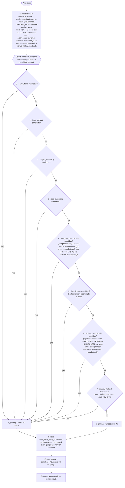
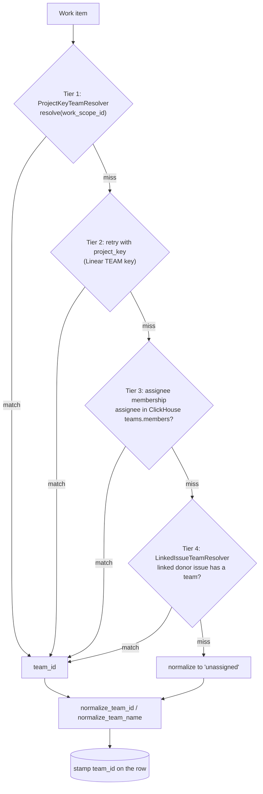
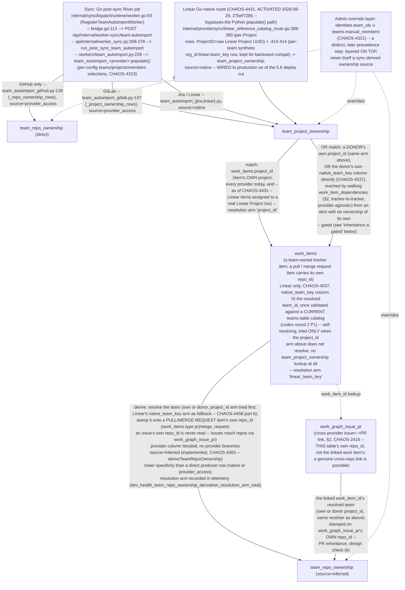
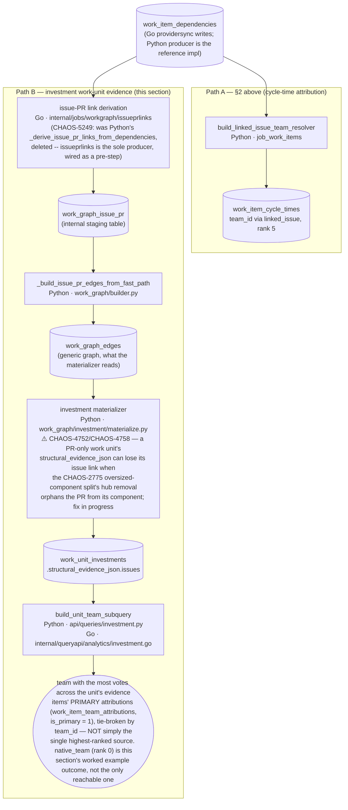
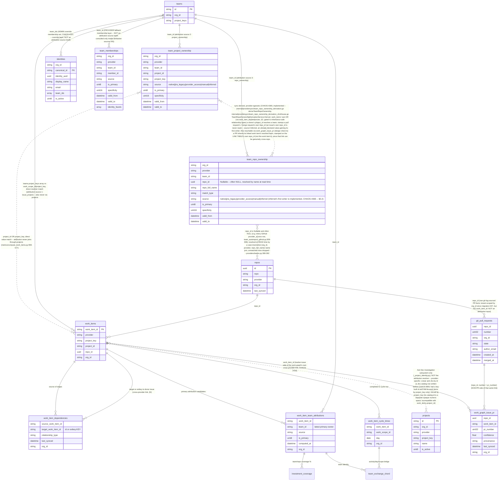
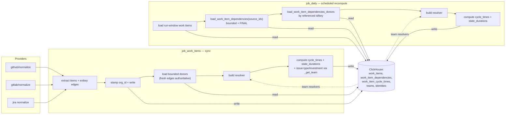
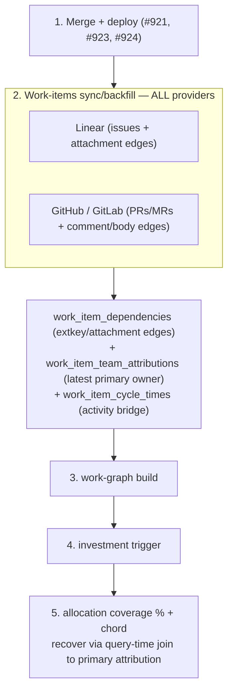
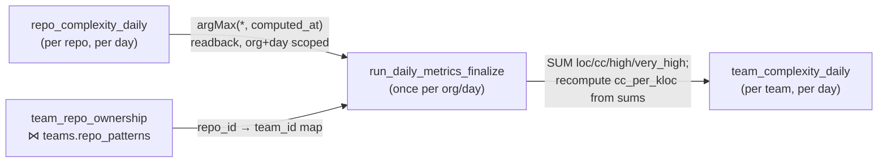

# Architecture: Work-Item Team Attribution & Linked-Issue Inheritance

**Status:** Authoritative
**Scope:** dev-health-ops (metrics/compute, sync, loaders, providers) and the Go worker transport that dispatches it
**Related:** [Platform architecture](platform.md), [Data and storage boundaries](data-and-storage.md),
[Work Graph reference](../../reference/data-models/work-graph.md), [Work Graph guide](../../use/code-and-relationships/work-graph.md)

Investment work units can also inherit a repository through issue ancestry or
children after direct repository evidence. That compute-time repository cascade
is separate from the work-item team precedence below. Its multi-pass behavior,
ambiguity rules, and persisted provenance are defined in
[Investment repository inheritance](../../reference/data-models/investment.md#repository-inheritance).
The final [team ownership fallback](../../reference/data-models/investment.md#team-ownership-fallback)
uses only the latest primary ownership-based issue attribution and live,
non-manual repository ownership. It unions all eligible repositories across the
member issues' teams and assigns equal shares; it does not use person membership
or change this page's primary attribution precedence.

That fallback is bound by the §0.4 provider coverage contract below and is
tested across the whole `{jira, gitlab, github, linear}` x
`{teams, projects, members, issues}` matrix, never Linear-only. Two of those
cells are negative by contract and are asserted as negatives, not skipped:
**members** -- `assignee_membership` and `author_membership` attributions, and
`team_memberships` rows, never donate a repository share even when their team
owns live repositories -- and **manual** ownership, which stays a fallback
record and never a donor. GitHub's `projects` cell is n/a because the repository
is the scope there. The precedence table and the per-cell coverage are in
[Investment: team ownership fallback](../../reference/data-models/investment.md#team-ownership-fallback).

> **Restoration note (2026-08-19, CHAOS-3968).** This page was deleted on 2026-07-27 when
> `.github/docs-legacy/` was removed, with no replacement of equivalent scope. It is restored here
> substantially verbatim from git history (`git show e23ede618^:.github/docs-legacy/architecture/team-attribution.md`).
> Two things changed since it was first written and are marked inline where they matter: the original
> `Related` list pointed at sibling `docs-legacy/architecture/` pages that no longer exist under the
> current documentation IA (replaced above), and a new **§0.6** was added to reconcile this doc with the
> Celery-to-Go worker cutover, which happened after the original was written. Everything else is the
> original text, checked against current code during restoration and corrected only where noted.
>
> A second verification pass the same day confirmed the §0.1 precedence ladder is **implemented
> exactly as written, not merely a superseded target state** (`_SOURCE_ORDER` /
> `compute_work_items.py:136-144,456`), added several facts not present in the original recovered
> text (marked "Added at restoration" inline: the `Enum8`-codes-are-not-precedence warning, the
> provider-disjoint ownership ranks, the bitemporal/immortal ownership rows, three documented
> exceptions to §5's query-time-join claim, and a pre-replay-snapshot prerequisite for the backfill
> runbook), and named the shared read contract (`PRIMARY_WORK_ITEM_TEAM_ATTRIBUTION_SOURCE`) so
> future readers can cite it directly instead of re-deriving it. See "Stale references to this
> document" near the end for a swept list of other places still citing this page's dead
> pre-migration path.

> First slice of the system-wide architecture-documentation epic. Documents how
> every work item (issue, PR, MR) is stamped with a `team_id`, why PRs used to
> land as `unassigned`, and how cross-provider linked-issue inheritance recovers
> team attribution for the investment **allocation-coverage** and
> **team-exchange chord** views.

## Why this exists

Team resolution historically used three signals — the provider work scope
(repo / project key), the Linear/Jira project key, and assignee membership.
**A GitHub/GitLab PR matches none of them**: its repo rarely maps 1:1 to a
team, it has no project key, and its author often isn't a team member. So PRs
were stamped `team_id = 'unassigned'` and never shared a team dimension with
the issue trackers — leaving TEAM COVERAGE at 0% and the team-exchange chord
empty (no two teams ever co-occur on a work scope).

The fix adds a fourth, **provider-agnostic** tier: a work item with no team of
its own inherits the team of an issue it links to via `work_item_dependencies`.
A GitHub PR closing Linear `CHAOS-2400` borrows that issue's `CHAOS` team.

> **CHAOS-4244 (2026-08-24).** "Author often isn't a team member" was true but
> incomplete: `assignee_membership` (rank 4) only ever read the item's
> **assignee** — GitHub's assignee field, distinct from and far less commonly
> set than the PR's **author**. A PR opened by a team member with no assignee,
> no repo_patterns row, and no linked issue fell all the way through to
> `unassigned` even though the author WAS resolvable — 18.47% of local work
> units, all PR-only evidence against this project's own repos, no linked
> issue. The fix adds the item's reporter (author) as a membership candidate,
> resolved through the same org-scoped identity lookup as the assignee. No
> pathway change: GitHub PRs were already modeled as `WorkItem`s and already
> flowed into this resolver (`providers/github/normalize.py:541` /
> `internal/providersync/github_work_items_rows.go:517`).
>
> **Ruling superseding the first cut (chris, 2026-08-24): author is its OWN
> rank 6, NOT `assignee_membership`'s rank 4.** The initial implementation
> folded the author candidate into `assignee_membership` (still rank 4, no
> new precedence tier) — codex adversarial review flagged that this let a
> person-shaped signal beat a real `linked_issue` donor (rank 5) far more
> often than the pre-existing assignee mechanism ever did, since an author is
> set on nearly every PR while an assignee rarely is. Chris's ruling: an
> author is a PERSON signal, "at best a low-precedence fallback" — it must
> NOT beat a real linked_issue donor. The fix gives the author candidate its
> own source, `author_membership`, ranked BELOW `linked_issue` (5) and ABOVE
> `manual_fallback` (now 7) — this widens the `Enum8` (migration 078; CS1's
> own migrate-before-emit rule) and adds a 9th precedence stage. See
> `metrics/compute_work_items.py:405-642` and
> `internal/providersync/github_work_items_derivation_context.go:605-754`.

> **CHAOS-4321 (chris's ruling, 2026-08-26, final form 08:30 PT).** Plain
> wording (chris-approved, quoted verbatim wherever this rule is described —
> ticket, PR, docs, evidence strings): *"A work item gets a team from the
> project/repo it lives in. That is team attribution. If that finds nothing,
> we look at the person on the item (assignee, or PR author). If that person
> is mapped to one team, the item goes to that team. If the person is mapped
> to two or more teams, we do not guess — the item stays unassigned."*
> "Mapped" means the ClickHouse team mappings — an admin-authored override
> when one exists, provider-imported membership otherwise.
>
> `assignee_membership` (rank 4) and `author_membership` (rank 6) are
> membership-shaped signals, resolved by a shared TWO-LAYER lookup
> (`_resolve_membership` / `resolveMembership`, one exactly-one-team gate,
> applied identically to both layers):
>
> 1. **Admin layer (the override, authoritative).** `identities`
>    (canonical_id → team_ids, provider_identities — written by
>    `/org/admin/identities`) ∪ `teams.manual_members` (a facet roster —
>    written ONLY by `ClickHouseTeamAdminService.add_members`/
>    `remove_members`/`set_members`, the admin Identities screen and the
>    drift-approval flow; provider-untagged: a bare `manual_members` entry
>    with no backing `identities` row still resolves, matched by normalized
>    equality with no provider tag). An identity's admin-authorized team set
>    is `identities.team_ids` ∪ every active team whose `teams.manual_members`
>    contains one of the identity's facets — the union matters because the
>    drift-approval admin action (`apply_identity_membership_change`,
>    `api/services/configuration/clickhouse_identity_drift.py`) writes
>    `teams.manual_members` directly without updating `identities.team_ids`.
>    If this layer has ANY candidate for the identity, it decides outright —
>    1 team attributes, 2+ teams is `unassigned` (`ambiguous_admin_membership`,
>    evidence lists the colliding team ids) and does **not** fall through to
>    layer 2: an ambiguous admin mapping is a data problem to fix, not to
>    route around.
>
>    `teams.manual_members` (migration `079_teams_manual_members.py` -- a
>    Python migration, not pure DDL, since it also backfills from
>    `identities.team_ids` for pre-existing admin-mapped identities) is a
>    CHAOS-4321 fix, not the original design: an earlier revision of this
>    ticket treated ALL of `teams.members` as the override, but a codex
>    adversarial review (HIGH, both languages) found provider auto-import
>    writes UNREVIEWED roster rows straight into `teams.members` too
>    (`ClickHouseTeamDriftProjector.project_team`'s `AUTO_APPLY_POLICY`
>    branch, for any identity that doesn't conflict with an existing manual
>    override) — so a roster entry imported from ONE provider could become
>    the authoritative, ambiguity-suppressing answer for a DIFFERENT
>    provider's work item sharing the same identity string. `manual_members`
>    is the admin-EXCLUSIVE subset (confirmed by tracing every write site);
>    provider auto-import carries it forward unchanged on every sync write
>    and never sets or clears it. Pre-existing `teams.members` entries have
>    no way to prove their provenance and fall into the provider layer below
>    until re-saved from the admin panel.
> 2. **Provider layer (the fallback).** `team_memberships`, populated
>    exclusively by the four auto-import workers
>    (`workers/team_autoimport_{github,gitlab,jira,linear}.py`) ∪
>    `teams.members` (the mixed-provenance roster the fix above demoted out
>    of the admin layer). Consulted ONLY when layer 1 has zero candidates for
>    that identity (chris, 08:30 PT: *"manual is override — if the override
>    exists, use it, else use attribution from providers"*; refined
>    2026-08-26 10:39 PT: *"admin is an override, not a default — it's the
>    sync config mapping, but admin can override it in the panel"*). Same
>    one-team gate: ambiguous here is `ambiguous_provider_membership`;
>    nothing in either layer is `no_membership`.
>
>    **Inactive teams (CHAOS-8938).** An inactive team takes no work item
>    (`dropInactiveTeamCandidates`), so the gate also drops inactive teams
>    BEFORE it counts teams, in both layers, with the same test
>    (`candidateNamesInactiveTeam`): a person of inactive T1 and active T2
>    attributes to T2 (not `ambiguous_*_membership`); a person of inactive teams
>    only is `no_membership`; an admin layer whose teams are all inactive has
>    no candidate and falls through to the provider layer; two ACTIVE teams stay
>    ambiguous. Python never filtered inactive teams; Go drops them before the
>    gate counts. For inactive-team cases, both the winner and the reason can
>    differ from the Python answer. Asserted by `TestMembershipGateCountsOnlyActiveTeams`,
>    `TestAnInactiveOnlyAdminLayerFallsThroughToTheProviderLayer` and
>    `TestAMemberOfAnInactiveAndAnActiveTeamResolvesToTheActiveTeam`.
>
> `team_memberships` keeps its other consumer (drift/conflict review, §0.5)
> untouched — this ticket only changes which candidate source(s) attribution
> reads and in what order, not what writes `team_memberships` or how drift
> review reconciles it.
>
> The pre-existing single-team ambiguity gate (CHAOS-4110, previously
> author-only, provider-layer-only) now applies to BOTH assignee and author,
> and to BOTH layers (assignee previously had no gate at all — an ambiguous
> member's ranking by specificity/priority silently picked an arbitrary
> winner, the exact defect this ticket removes). Telemetry rides the
> existing `no_candidate:<reason>` evidence mechanism (already generalized by
> `work_item_team_attribution_metric_source` /
> `githubWorkItemTeamAttributionMetricSource` — those mappers strip any
> `:<team ids>` suffix before it becomes a Prometheus label, a cardinality
> guard, while the full reason + team ids stay in the persisted `evidence`
> column for an admin to act on): `no_membership` (neither layer has any
> mapping), `ambiguous_admin_membership:<ids>`, `ambiguous_provider_membership:<ids>`
> (precedence in that order when more than one applies), `bot_author`
> (author path only, unchanged).
>
> Net effect: the precedence ladder, its ranks, its Enum8 codes and its
> donor-eligibility set are **unchanged by this ticket** — only HOW
> `assignee_membership`/`author_membership` resolve changed (a two-layer
> lookup replacing a single flat one). See
> `metrics/compute_work_items.py::_resolve_membership`/`resolve_team_attribution`
> and
> `internal/providersync/github_work_items_derivation_context.go::resolveMembership`/`resolve`.
>
> **Regression, not new design.** This override existed before: the
> ClickHouse-backed roster resolver (`providers/teams.py::_build_member_to_team`,
> reachable via `load_team_resolver_from_store` reading `teams.members`) is
> the ancestor this ticket restores as the admin layer's manual-facet half —
> now via the narrower, provably admin-exclusive `teams.manual_members`
> column rather than the mixed-provenance `teams.members` an earlier
> revision used, per the fix above — see "Stale references to this
> document" / the CHAOS-4321 PR body for the file:line history of where the
> override stopped being wired into `resolve_team_attribution`'s default
> call path.

---

## 0. Target state (CHAOS-2600) — ClickHouse-only team attribution

> **Governing target contract.** This §0 is the source of truth for the intended model and the
> debugging navigation aid; **new code must follow it.** It is implemented across CHAOS-2600
> CS1–CS7 — the ClickHouse enum widening lands in **CS1** (see *Schema prerequisite* below), the
> precedence tests are inverted in **CS2**, and the legacy Postgres bridge path is removed in
> **CS5/CS6**. Until then, §1 below still describes the live (pre-CHAOS-2600) cascade and the
> existing tests still encode the old precedence.

> **CS6 reality (CHAOS-2607).** ClickHouse is the system of record for **both** the team
> catalog **and** identity→team membership. As of CS6 the Postgres `team_mappings` / `identity_mappings`
> tables and models are **deleted** (Alembic `0020`), along with the `TeamMappingService` /
> `IdentityMappingService` / `TeamDriftSyncService` classes, the `sync-team-drift` /
> `reconcile-team-members` tasks, and the Postgres-backed drift engine. (The four admin drift-review
> endpoints currently stand as HTTP 501 stubs and are being **rebuilt natively on ClickHouse — not
> deleted — under CHAOS-2622**; see §0.5. The earlier "removed in CS7 with the web caller —
> CHAOS-2608" intent is superseded — CHAOS-2608 is an unrelated Done web ticket.) (CS5 had already deleted the
> Postgres→ClickHouse team bridge `providers/team_bridge.py` and `providers/team_reconcile.py`.) Admin
> team/identity CRUD goes through `ClickHouseTeamAdminService` + `ClickHouseIdentityStore`, writing the
> ClickHouse `teams` and `identities` tables directly. Identity membership uses **surgical replacement**
> semantics: updating an identity removes its facets from teams it left and replaces changed facets in
> teams it stayed in, editing `teams.members` **and** `teams.manual_members` (CHAOS-4321) add/remove-by-facet
> (never a full recompute) so Auto Import / catalog members are preserved. See *CS6 status (CHAOS-2607)*
> at the end of §4.

**ClickHouse is the only source used for analytics attribution. Postgres does not store or resolve
team attribution mappings.** Manual mappings are ClickHouse fallback records only — never overrides,
never outranking WTI-native facts. PR/MR attribution comes from an **actual linked issue donor**; an
external issue-key *prefix* alone is not linked-issue inheritance.

Every final attribution carries provenance: `org_id, work_item_id, provider, team_id, team_name,
source, confidence, evidence, is_primary, computed_at`.
`source ∈ {native_team, issue_project, project_ownership, repo_ownership, assignee_membership,
linked_issue, author_membership, manual_fallback, unassigned}`; `confidence ∈ {high, medium, low, manual, none}`.

> **Schema prerequisite (CS1).** The `issue_project` / `manual_fallback` sources and the `manual` /
> `none` confidence values require the ClickHouse `Enum8` widening on `work_item_team_attributions`
> (migration 053) to land **before** any resolver emits them — emitting an unknown enum value fails
> the insert. This is CHAOS-2600 ordering rule §4.1: migrate enums (CS1) → then emit (CS2/CS3).
> `author_membership` followed the same rule under **CHAOS-4244** (migration 078).
>
> **Restoration check (2026-08-19):** confirmed current. Migration `053_manual_attribution_fallbacks.sql`
> widens `work_item_team_attributions.source` to an 8-value enum
> (`native_team=1, linked_issue=2, project_ownership=3, repo_ownership=4, assignee_membership=5,
> unassigned=6, issue_project=7, manual_fallback=8`) and `confidence` to 5 values, on top of the base
> table created by migration 051. **CHAOS-4244 (2026-08-24)** appended a 9th code, migration
> `078_author_membership_source.sql`: `author_membership=9`. All three migrations are still applied
> and the enum still matches this section exactly.
>
> **These `Enum8` codes are storage identifiers, not precedence — do not read them as the ladder.**
> `Enum8` can only be *appended* to (a code, once assigned, is never renumbered), so the codes are
> insertion order across three migrations, nothing more. Proof by contradiction: `issue_project` is
> stored as `7` above, but it ranks **1** in the actual precedence (`_SOURCE_ORDER` below) — second
> only to `native_team`; `author_membership` is stored as `9` (the highest code) but ranks **6**, well
> above `manual_fallback` and `unassigned`. The one and only precedence order is `_SOURCE_ORDER` in
> `metrics/compute_work_items.py`, cited in §0.1 below; the storage codes exist so ClickHouse has a
> compact column type, and that is all they exist for.

### 0.1 Resolution decision tree

Resolution is **staged by precedence**. The resolver evaluates the applicable sources and persists
**all** matching ones as candidates; the *winner* (`is_primary`) is the highest-precedence source
present. "Wins" means *primary selection* — it does not mean lower-precedence sources go
unevaluated or unrecorded. **To debug:** read `team_attribution_source` (the winner) from
provenance, jump to that node, and verify no higher-precedence stage matched. An item of a
project with several owning teams has one primary row (`is_primary = 1`) and a co-owner row
(`is_primary = 2`) for each other active team of the project at the winner's rank (section 0.4d).


```mermaid
flowchart TD
    Start(["Work item"]) --> COLLECT["Evaluate EVERY applicable source → persist a candidate row per match (provenance).<br/>The linked_issue candidate requires a real work_item_dependencies donor row resolving to a team;<br/>a bare issue-key prefix produces NO linked_issue candidate (it may match a manual_fallback instead)."]
    COLLECT --> SEL{{"Select winner: is_primary = the highest-precedence candidate present"}}
    SEL --> NT{"0 · native_team candidate?"}
    NT -->|"yes"| Win["is_primary = matched source"]
    NT -->|"no"| IP{"1 · issue_project candidate?"}
    IP -->|"yes"| Win
    IP -->|"no"| PO{"2 · project_ownership candidate?"}
    PO -->|"yes"| Win
    PO -->|"no"| RO{"3 · repo_ownership candidate?"}
    RO -->|"yes"| Win
    RO -->|"no"| AM{"4 · assignee_membership candidate?<br/>(assignee identity, CHAOS-4321 -- admin mapping if present (single-team), else provider auto-import fallback (single-team))"}
    AM -->|"yes"| Win
    AM -->|"no"| LK{"5 · linked_issue candidate?<br/>(real donor row resolving to a team)"}
    LK -->|"yes"| Win
    LK -->|"no"| AU{"6 · author_membership candidate?<br/>(reporter/author identity, CHAOS-4244 PR/MR-only + CHAOS-4321 two-layer admin-then-provider resolution, single-team, non-bot only)"}
    AU -->|"yes"| Win
    AU -->|"no"| MF{"7 · manual_fallback candidate?<br/>repo / project / member / issue_key_prefix"}
    MF -->|"yes"| Win
    MF -->|"no"| UN["is_primary = unassigned (8)"]
    Win --> P["Persist work_item_team_attributions:<br/>candidate rows that passed every gate; is_primary on the winner"]
    UN --> P
    P --> API["Expose source / confidence / evidence via GraphQL"]
    API --> UI["Frontend renders only — no recompute"]
```

**Invariants:** the **winner is the highest-precedence matching source** (every matching source that
passes its own gate is still persisted as a candidate — precedence decides `is_primary`, not which
sources are computed); `assignee_membership` (4) and `author_membership` (6) additionally require
the resolved team to **own the item's repo per `team_repo_ownership`** (CHAOS-4320) — a repo with an
explicit owner other than the resolved team drops the candidate entirely (falls through the cascade
exactly like a non-member would, not merely loses precedence); a repo with **no** ownership row at
all is `ownership_unknown` and the gate does not apply (R74, 2026-09-09: an absent ownership row is
treated as missing data, not as "not owned" — two orgs with old fixture data and no ownership rows
at all pass membership through unchanged); `linked_issue` (5) requires a real `work_item_dependencies`
donor row resolving to a `work_items`
row whose **own team came from a first-class fact (sources 0–4)** — a donor resolved only by
`author_membership` or `manual_fallback` is NOT a valid donor, so neither a person-shaped author
signal nor a bare prefix can ever be laundered into rank-5 inheritance (both fall through to 6/7);
`author_membership` (6) can beat `manual_fallback` and `unassigned` but never a real linked_issue,
ownership, or membership fact — a PERSON signal, "at best a low-precedence fallback" (chris,
CHAOS-4244); `manual_fallback` (7) can only beat `unassigned`; a whole org at `unassigned` usually
means the ClickHouse `teams` dimension is empty.

> **CHAOS-5649 (R179, chris 2026-09-12) — two more `author_membership`/membership rules, on top of
> the CHAOS-4320 ownership gate above.** Evidence record:
> `.remember/lanes/lane-team-attribution/handoff-2026-09-02.md` plus memory
> `project_ops_team_null_carrying.md`; prod measurement 2026-09-12 (gh:ops-team, one member
> `github:chrisgeo`): 232 primary `author_membership` rows and 834 non-primary ones, all belonging
> to a team chris never attached to any repo or project.
>
> 1. **`author_membership` never stacks a SECOND (different) team onto an item that already has a
>    higher-ranked primary attribution.** Before this rule, the `order` loop in `Resolve()`
>    (`internal/teamattribution/cascade.go`) recorded every source's non-primary candidates
>    unconditionally, `author_membership` included — so a PR whose `linked_issue` donor (or any
>    higher rank) already won primary for team A still got a **second, non-primary row for team B**
>    whenever the reporter resolved to team B. That is a straight double count of team B's row
>    count in `work_item_team_attributions`, not a precedence bug (team A still won `is_primary`
>    correctly) — the row simply should never have existed. A candidate naming the **same** team as
>    the existing primary is unaffected (kept, for provenance — see
>    `TestGitHubWorkItemDerivationReporterAndAssigneeSamePersonSameTeamStayDistinctProvenance`,
>    CHAOS-4244): only a genuinely *second* team is suppressed. No other source in the `order` list
>    gets this treatment — every other source keeps recording its non-primary candidates exactly as
>    before (the "no team_id collapse here, deliberately" contract, same function).
> 2. **A provider-synced team with NO ownership signal anywhere — no `team_repo_ownership`, no
>    `team_project_ownership`/`project_keys`, and (transitively, since GitHub has no native Project
>    entity) no issue ownership — is NULL-CARRYING and excluded from the cascade entirely.** This is
>    a **team-level** gate, distinct from CHAOS-4320/R74's **repo-level** gate above: R74 says "this
>    ONE repo has no ownership row, treat that as unknown, pass membership through"; rule 2 says
>    "this TEAM has zero ownership signal anywhere in the org (and a `teams` catalog row proves it —
>    the team is not merely absent from data we happened to load), never let it resolve via
>    `assignee_membership`/`author_membership` regardless of what any one repo's ownership looks
>    like." The two do not conflict: a team this run's context has **no `teams` catalog row for at
>    all** stays on R74's unknown-pass-through (unproven, not gated); only a team with a **real**
>    catalog row and **zero** ownership facts is gated. Implemented as `teamOwnsSubjectRepo`'s first
>    check (`teamIsNullCarrying`, same file) — a null-carrying team fails the SAME CHAOS-4320
>    ownership gate assignee/author membership already goes through, so its member's unclaimed PRs
>    fall to `unassigned` exactly like a non-member would, with evidence
>    `no_candidate:team_null_carrying`.
>
> Both rules landed together in the CHAOS-5649 PR; neither changes the 9-value `_SOURCE_ORDER`
> ladder or any rank — they change what gets *recorded* (rule 1) and what gets *resolved at all*
> (rule 2), not precedence. Confirmed serving-path scope while implementing: both the flow-matrix
> Team node (`primaryWorkItemTeamAttributionSource`, `internal/queryapi/analytics/flowmatrix.go`)
> and the Investment Evidence drilldown's per-unit team vote (`buildUnitTeamSubquery`,
> `internal/queryapi/analytics/investment.go`, §"Investment work-graph consumption" below) read
> the SAME `is_primary = 1`, latest-`computed_at` source — there is no separate path joining
> membership or non-primary rows on either page, so an `Ops Team` node/drilldown entry with units on
> it was rule 2's 232 PRIMARY rows, never rule 1's 834 non-primary ones (which were already inert
> for both serving paths).

> **Restoration verification (2026-08-19, updated 2026-08-24 for CHAOS-4244): this ladder is
> implemented, not just intended.** A prior reading of this repository, using the `Enum8` storage
> codes instead of the precedence order, reported a *different* six-member ladder missing
> `issue_project` and `manual_fallback`. That reading was wrong (see the Enum8 warning in §0 above) —
> the ladder above is exactly what runs. Verbatim, `metrics/compute_work_items.py:143-153`:
> ```python
> _SOURCE_ORDER: dict[TeamAttributionSource, int] = {
>     "native_team": 0, "issue_project": 1, "project_ownership": 2,
>     "repo_ownership": 3, "assignee_membership": 4, "linked_issue": 5,
>     "author_membership": 6, "manual_fallback": 7, "unassigned": 8,
> }
> ```
> Applied at `compute_work_items.py:587` — `for source in sorted(candidates_by_source, key=lambda s: _SOURCE_ORDER[s]):`,
> first non-empty group in that order is primary. An independent second implementation of the same
> 9-value, same-order ladder exists SQL-side as `_SOURCE_RANK_SQL` in
> `api/graphql/resolvers/team_attribution.py:142-154` (a `multiIf` chain), with a comment there
> instructing it be kept in lockstep with this dict.
>
> The `manual_fallback` donor guard the doc describes below is also real, not aspirational —
> `_DONOR_SOURCES` at `compute_work_items.py:164-172`, used at `:727` to gate which sources a
> `linked_issue` donor may pass on: `{native_team, issue_project, project_ownership, repo_ownership,
> assignee_membership}` — ranks 0–4 only, UNCHANGED by CHAOS-4244. `author_membership`,
> `manual_fallback` and `unassigned` are excluded by construction, so neither a person-shaped author
> signal nor a fallback rule (especially the provider-neutral `issue_key_prefix` scope) can ever be
> laundered into rank-5 `linked_issue` provenance on a dependent item, exactly as this page already
> said — and a required test (`test_author_never_outranks_a_linked_issue_donor` /
> `TestGitHubWorkItemDerivationAuthorNeverOutranksALinkedIssueDonor`) pins a PR with a team-mapped
> author AND a linked_issue donor for a DIFFERENT team resolving to the **linked issue's** team.

### 0.2 Source reference matrix

| # | `source` | Resolves from (ClickHouse) | Confidence | Beats | Never overrides | Evidence keys |
|--:|---|---|---|---|---|---|
| 0 | `native_team` | `WorkItem.native_team_key` → `teams` of the item's provider, else admin teams (section 0.4e) | high | all below | — (top) | `native_team_key` |
| 1 | `issue_project` | native issue project key → `teams` of the item's provider that hold it, else admin teams (section 0.4e) | high | 2–8 | 0 | `project_id, owner_team` |
| 2 | `project_ownership` | `team_project_ownership` | high | 3–8 | 0–1 | `project_id, provider` |
| 3 | `repo_ownership` | `team_repo_ownership` | medium | 4–8 | 0–2 | `repo_full_name` |
| 4 | `assignee_membership` | CHAOS-4321 two-layer: `identities`/`teams` (admin override, single-team) else `team_memberships` (provider fallback, single-team) | high (admin) / medium (provider) | 5–8 | 0–3 | `canonical_id, identity` (evidence text: `assignee_membership=<id>`) |
| 5 | `linked_issue` | `work_item_dependencies` donor → donor's team | medium | 6–8 | 0–4 | `dependency_type, donor_work_item_id, donor_provider` |
| 6 | `author_membership` | CHAOS-4244 PR/MR-only + CHAOS-4321 two-layer (same as row 4), non-bot | high (admin) / medium (provider) | 7–8 | 0–5 | `canonical_id, identity` (evidence text: `reporter=<id>`) |
| 7 | `manual_fallback` | `manual_attribution_fallbacks` (repo/project/member/issue_key_prefix) | manual\|low | 8 only | 0–6 | `scope_type, scope_id, reason` |
| 8 | `unassigned` | — (nothing matched) | none | — (floor) | — | `reason` |

> **Added at restoration (2026-08-19): ranks 2 and 3 are provider-disjoint, not overlapping tiers.**
> This is not in the original recovered text and is easy to misread as damage. GitHub writes
> `team_repo_ownership` (rank 3, `repo_ownership`) and never `team_project_ownership` — GitHub has no
> native Project entity. GitLab, Jira, and Linear write `team_project_ownership` (rank 2,
> `project_ownership`) and never `team_repo_ownership`. So `team_repo_ownership` being empty for a
> non-GitHub org, or `team_project_ownership` being empty for a GitHub-only org, is the **designed
> state**, not a coverage gap. Writers: `workers/team_autoimport_github.py:142` calls
> `sink.write_team_repo_ownership`; `workers/team_autoimport_gitlab.py:209` calls
> `sink.write_team_project_ownership` (Jira/Linear autoimporters write the same table).

> **CHAOS-4365 `inferred`: an already-declared `team_repo_ownership.source` value gets its first
> writer -- not the 9-value ladder above, and not a schema change.** Ruling (chris, 2026-08-28
> 07:58-08:04 PT): "the repo should still have a team as well as the PR through the linear
> connection," amended 08:07 PT to be provider-agnostic: "the graph associated VIA ANY TOOL THAT CAN
> MAP to github/gitlab objects. The SOURCE github/gitlab/bitbucket ARE irrelevant." Coordinated
> producer design (CHAOS-4365 lane): edge-walk `work_items` -- either the item's **own** `project_id`,
> or, when that has no ownership row, a **donor's** `project_id` reached by walking
> `work_item_dependencies` (§2, tracker-to-tracker, provider-agnostic) -- into `team_project_ownership`
> to resolve a team, then stamp that team onto the **original** pull request's / merge request's own `repo_id` (already a
> `work_items` column; no join to `repos` needed to get it; an issue's own `repo_id` is never read). The provider column is iterated
> generically -- no provider branches. Rows land with **`source = 'inferred'`, at lower
> `specificity` than a direct producer row**, so a GitHub-team-owned repo's own row (`source =
> 'provider_access'`, §0.4a) still wins the `is_primary` tie-break for that repo. `inferred` is
> already a live value in
> `team_repo_ownership.source`'s `Enum8('native'=1, 'jira_legacy'=2, 'provider_access'=3,
> 'manual'=4, 'inferred'=5)` (migration `051`) -- this producer is its **first writer**, not a new
> enum value, and needs **no migration**. It is **not** a new row 2.5 in `_SOURCE_ORDER` above:
> attribution rank 3 (`repo_ownership`) is unchanged, reading `team_repo_ownership` uniformly
> regardless of which sub-source produced the winning row. **Status: IMPLEMENTED**
> (`internal/providersync/team_repo_ownership_derivation.go`'s `deriveTeamRepoOwnership` -- the pure
> resolution logic -- plus `internal/providersync/team_repo_ownership_derivation_clickhouse.go`'s
> `TeamRepoOwnershipDerivationService.Derive`, the ClickHouse read/write glue). The donor walk reuses
> the EXISTING linked-issue resolver's gating verbatim (`compute_work_items.py`'s
> `_INHERITABLE_RELATIONSHIP_TYPES`/latest-edge-per-pair/extkey-ambiguity rules, see the "Inheritance
> is gated" bullets in §1.1) rather than a looser first-donor walk, and additionally resolves PRs
> through `work_graph_issue_pr` (§1.1's new PR-inheritance branch) that the original summary above
> did not cover. See the ownership-derivation diagram in §1.1 and the ER callouts in §3.

> **CHAOS-4458 part (b) (fixed): the derivation's Linear arm never resolved, because
> `team_project_ownership`'s Linear rows and `work_items.project_id` for a Linear item were two
> DISJOINT id spaces AT THE TIME OF DIAGNOSIS** (`"{org_id}:linear:{team_key}"` vs. the raw Linear
> Project UUID). CHAOS-4431 (merged after this diagnosis) now ALSO writes `team_project_ownership`
> rows keyed by the raw Linear Project UUID for every org this route has synced — the two id spaces
> now co-exist rather than staying permanently disjoint; see the "Two Linear id spaces, one resolver"
> callout in §1.1 for the full trace, the fix, and the post-CHAOS-4431 update.
> Prod symptom (CHAOS-4458): `team_repo_ownership` derivation `outcome=no_signal`, 0 rows, every org
> — the GitLab/Jira arms of this same join were unaffected (their ownership writers and work-item
> normalizers agree on what `project_id` means), so this was a Linear-specific gap, not a general
> failure of the CHAOS-4365 item 1b producer.

> **CHAOS-4365: a second `team_repo_ownership` consumer, and the operator path to populate it for a
> real org.** `metrics/job_daily.py::_write_compounding_risk_for_day` (and the standalone
> `metrics/job_compounding_risk.py` CLI job) resolves one team per repo for
> `compounding_risk_daily`'s `scope='team'` rows. Before CHAOS-4365 that resolution read ONLY
> `teams.repo_patterns` (glob strings, `providers/teams.py::build_repo_pattern_resolver`) — CHAOS-4276
> seeds patterns for a repo's primary owner in **fixtures** data, but no native auto-importer (GitHub,
> GitLab, Jira, Linear) ever writes `repo_patterns`, so a real org's compounding-risk team rows were
> silently empty even when GitHub auto-import HAD populated `team_repo_ownership` correctly. The fix
> (`providers/teams.py::load_team_repo_ownership_map`) reads `team_repo_ownership` directly
> (repo_id-keyed, `is_primary`/`specificity`-ranked) and merges it OVER the pattern resolver, so a
> GitHub-owned repo resolves to its team even with `repo_patterns=[]`. **Operator path for a real
> org with zero `team_repo_ownership` rows:** trigger `run_team_autoimport` for that org with GitHub
> selected as a source (sync-config / the team auto-import job — see
> `docs/operate/run/workers-and-jobs.md`) — `team_autoimport_github.populate()` is the only writer.
> GitLab/Jira/Linear-only orgs have no `team_repo_ownership` writer by design (§0.2 above); their
> repos resolve to a team only via `teams.repo_patterns` (manually configured, or fixtures).

> **CHAOS-8512: TestOps daily rows use repository ownership, not patterns.** The native
> `testops_pipeline`, `testops_test`, `testops_coverage`, and `testops_risk` families retain a
> non-empty source-row `team_id` when one exists. Otherwise, they use the single authoritative
> `team_repo_ownership` owner for the repository at the **end of the target day**, ranked by
> `is_primary DESC, specificity DESC, updated_at DESC, team_id ASC`. An unowned repository stays
> NULL: these families do not fall back to `teams.repo_patterns` or person membership. The shared
> ownership reader resolves direct and provider-access ownership rows by repository identity before
> it applies that ranking, so the TestOps consumer has no provider-specific branch. Real-ClickHouse
> integration tests seed an in-day multi-claim and require the primary owner on all six TestOps
> output tables.

> **CHAOS-4365 item 2 (merged, `dev-health-ops#1963`, squash `017f964b2`): `team_cognitive_load_daily` — an
> append-only, ownership-scoped table.** The `resolveCognitiveLoad` GraphQL resolver's single-team
> path (`teamId` set, `repoId` NOT set) reads this table directly instead of the org-wide
> user_metrics_daily`/`team_metrics_daily` merge (`dev-health-ops#1970`) — that merge filtered on
> those tables' own `team_id` column, which is exactly the membership-fallback-tainted column this
> table exists to avoid; a single-team query on a real org returned zero rows via that path even
> though the org-wide query worked. Team-keyed cognitive load
> (interruption load, context spread, review-request load, after-hours/weekend commit ratios) does
> not exist today — `user_metrics_daily` (migration `016`) carries these signals per person/repo
> only, and its own `team_id` column falls back to membership resolution (CHAOS-4396), which
> CHAOS-4321 forbids as a team key. `team_cognitive_load_daily` (migration
> `081_team_cognitive_load_daily.sql`) will be written by aggregating
> `user_metrics_daily`/`team_metrics_daily` rows **by `repo_id`**, then mapping `repo_id → team`
> through the same `team_repo_ownership` (merged over `teams.repo_patterns`) resolution CHAOS-4365
> item 1 wired into `providers/teams.py::load_team_repo_ownership_map` — never through either
> source table's own `team_id` column.
>
> | Column | Type | Notes |
> |---|---|---|
> | `org_id`, `team_id` | `String` | |
> | `day` | `Date` | |
> | `pr_interruption_load`, `review_request_load` | `Float64` | Summed across every author on every repo the team owns |
> | `context_spread_count` | `Float64` | **Not** a sum: `user_metrics_daily`'s `context_spread_count` is already one author's total distinct-repo count for the day, copied identically onto every one of that author's per-repo rows. Summing it across a team's owned repos would multiply, not count. The producer instead counts distinct `(author_email, repo_id)` pairs across the team's owned repos |
> | `after_hours_commit_ratio`, `weekend_commit_ratio` | `Nullable(Float64)` | Recomputed from summed after-hours/weekend commit counts across owned repos — never averaged directly (a ratio is not additive); `NULL` when no source row exists for any owned repo that day, distinct from a measured `0.0` |
> | `contributing_repo_count`, `sample_author_count` | `UInt32` | Diagnosability: how many owned repos and distinct authors rolled up into the row |
> | `computed_at` | `DateTime64(6, 'UTC')` | |
>
> `ENGINE = ReplacingMergeTree(computed_at) PARTITION BY toYYYYMM(day) ORDER BY (org_id, team_id, day)`
> (created as plain `MergeTree` by migration 081, converted by 096, like every other daily rollup
> in this schema): a re-computation inserts a new row with a later `computed_at`, a background
> merge later keeps only the newest row per key, and readers still dedup per
> `(org_id, team_id, day)` via `argMax(tuple(...), computed_at)` because merges are eventual. The
> sorting key must stay the reader key: a narrower key would merge rows the readers keep apart.
>
> **Producer runs in the finalize step, once per org/day** — `run_daily_metrics_finalize`
> (`metrics/job_daily.py`), the same once-per-org/day stage CHAOS-4399 moved
> `compounding_risk_daily`'s team-scope aggregation into. Unlike `compounding_risk_daily` (which
> CHAOS-4399 fixed to read that day's per-repo rows back from ClickHouse, `argMax`-deduped), the
> cognitive-load producer aggregates THIS RUN's already-computed in-memory
> `user_metrics_daily`/`team_metrics_daily` rows directly and deliberately never re-queries
> ClickHouse for them — either way, it writes exactly one row per `(org_id, team_id, day)`. A
> per-repo write inside the daily partition loop was the CHAOS-4399 bug class (a multi-repo team
> silently kept only the last-processed repo's numbers) and must never be reintroduced here.
>
> **Schema pin:** column types and the `ORDER BY`/engine clause are pinned byte-for-byte in
> `full-chaos/dev-health-go`'s `schema.go` (`ProductionColumns["team_cognitive_load_daily"]` /
> `EngineFull`, tagged `v0.2.0`, merged ahead of this ops PR per the agreed sequencing) with a test
> asserting they match an **embedded copy** of this migration's DDL exactly. That Go test has no
> access to this repository, so the copy is a manually-synchronized pin, not automatic cross-repo
> enforcement: a column added, renamed, or retyped here is only caught once someone updates the
> embedded copy in `dev-health-go` and reruns its test — editing only this migration does not, by
> itself, break `dev-health-go` CI.

> **CHAOS-4406 (fixed): the team+repo COMBINED `resolveCognitiveLoad` path also stopped trusting the
> tainted `team_id` column.** `team_cognitive_load_daily` carries no `repo_id` dimension, so it
> cannot serve a query where BOTH `teamId` and `repoId` are set — that combined path used to fall
> through to the pre-CHAOS-4365 two-query merge over `user_metrics_daily`/`team_metrics_daily`,
> filtered on those tables' own `team_id` column (the same CHAOS-4396 taint). The fix,
> `_resolve_owned_repo_id` (`resolvers/cognitive_load.py`), reuses the SAME two-source,
> ownership-wins-over-pattern merge every other ownership-scoped reader in this codebase applies
> (`providers/teams.py::load_team_repo_ownership_map`; `job_daily.py`'s
> `_repo_to_team_map_for_compounding_risk`; `metrics/team_cognitive_load.py`'s own write-time
> resolution) — an early version of this fix (codex R1) reinvented a narrower, incorrect version
> that filtered `team_repo_ownership` on a bare `argMax(repo_id, …) IS NOT NULL`, which silently
> rejected **every** native GitHub ownership row (§0.2's `repo_id is Nullable and often NULL`
> note): (1) native `team_repo_ownership` wins where it resolves the repo, via the SAME
> `coalesce(repo_id, name-joined id)` + `matched` sentinel join `load_team_repo_ownership_map`
> uses; (2) ranked by `(is_primary DESC, specificity DESC, updated_at DESC)` so a non-primary
> co-owner is never mistaken for the canonical owner; (3) falls back to the requesting team's
> `teams.repo_patterns` glob strings ONLY when native ownership resolves nothing for the candidate
> repo — the path GitLab/Jira/Linear auto-imports rely on entirely, since none of them write
> `team_repo_ownership`. An unowned/nonexistent repo, or one owned by a different team, returns an
> explicit empty result, never the wrong team's data. Once ownership is confirmed, both data
> queries filter by the resolved `repo_id` ALONE: `user_metrics_daily` via its existing repo
> predicate, and a new `_fetch_repo_scoped_team_metrics` for `team_metrics_daily` that sums the
> additive counts across **every** `team_id` label attached to that repo's rows before
> recomputing the ratio (mirroring `_fetch_team_metrics`'s SUM-then-recompute discipline for a
> team's several repos, transposed: here several `team_id` labels collapse onto one repo, since
> one repo's commits can be split across per-commit membership-fallback team_id fragments —
> CHAOS-4396). Known residual gap: if the org has the same repo slug under two providers and the
> requesting team owns both, only one is served (matches `_fetch_user_metrics`'s own pre-existing
> slug-resolution shape for the org-wide path) — tracked as a follow-up, not closed here.

### 0.3 Off-the-rails matrix (symptom → diagnosis → fix)

| Symptom | Likely stage | Diagnose | Fix |
|---|---|---|---|
| A whole org is `unassigned` | 7 (floor) | `get_all_teams()` empty? CH `teams` populated for `org_id`? | re-home teams population; verify daily-chain order |
| PR attributed to a surprising team via `linked_issue` | 5 | which `work_item_dependencies` edge? donor's own team? extkey ambiguous? | confirm donor row + `_canonical_target`; check `_INHERITABLE_RELATIONSHIP_TYPES` |
| A PR that WAS attributed via `linked_issue` silently becomes `unassigned` on a later run | 5 → 7 | is the donor edge older than the sync window? compare the edge's `last_synced` against the run window — donor and dependent stamped minutes apart rules staleness out | **fixed CHAOS-4112**: the donor preload unions the STORED inheritable edges for the items being recomputed with the fresh ones (`_merge_stored_inheritable_edges`), so an edge aging out of the window no longer un-attributes the PR. Watch `devhealth_work_item_team_attribution_downgrades_total` — a teamed→`unassigned` transition is always a bug |
| `manual_fallback` beats a real team | precedence | `_SOURCE_ORDER` has `manual_fallback=7`? loader merging manual at the wrong rank? | restore rank — manual is the lowest non-unassigned tier |
| An author beats a real `linked_issue` donor | precedence | `_SOURCE_ORDER` has `author_membership=6` (below `linked_issue=5`)? did a fix accidentally fold it back into `assignee_membership=4`? | restore rank — author is a PERSON signal, never above a real linked_issue donor (CHAOS-4244, chris's 2026-08-24 ruling) |
| A bare prefix (e.g. `CHAOS`) attributes as `linked_issue` | 5 vs 7 | did a full key resolve to a real `work_items` row, or did a prefix shortcut leak in? | no prefix→team in `linked_issue`; route to manual `issue_key_prefix` |
| A PR inherits via `linked_issue` from a donor that only has an `author_membership` or `manual_fallback` rule | 5 (donor) | is the donor's *primary* source in 0–4? a rank-6/7 fallback must never be relabeled rank-5 | donors gated to `_DONOR_SOURCES` (0–4) in `build_linked_issue_team_resolver`; an author-only or manual-only donor is never a linked_issue donor (done CS3; author exclusion CHAOS-4244) |
| Same scope shows duplicate ownership candidates / bloats over time | RMT read | `valid_from` is in the ownership tables' `ORDER BY`, so `FINAL` cannot collapse re-imports (each daily run is a new sort key) | reads dedup per *logical* scope via `argMax((updated_at, valid_from))`, NOT `FINAL` (done CS3, `load_team_attribution_context`); manual-fallback read keeps `FINAL` (its sort key has no `valid_from`) |
| A retracted ownership/membership (a new row, same sort key, `valid_to` set) still attributes until the RMT pair merges | RMT read | the retraction is a second physical row under the same sort key until a merge; a loader that filtered `valid_to` first dropped it and kept the older open row | the three Go loaders (`LoadProjects`, `LoadRepos`, `LoadProviderMembers`) resolve the newest row per full sort key first (`argMax` by `updated_at`), THEN apply `valid_from`/`valid_to`, then dedup per logical scope; asserted by `TestLoadersHonorARetractionBeforeTheRowPairMerges` (CHAOS-6637). Readers that already use `FINAL` before the window (`teamownership`, `teamscope`) are correct for this class |
| Team flips / stale team lingers after a re-org | write side | ownership writers set `valid_from=now` but never `valid_to`, so a reassigned scope keeps the old-team row active; readers can't tell stale from co-ownership | needs writer-side `valid_to` expiry on re-derivation — tracked **CHAOS-2610** (read-side `argMax` already makes the newest the primary by recency tiebreak) |
| `manual_fallback` resolves the wrong team | scope match | which `manual_attribution_fallbacks` row matched (repo/project/member/issue_key_prefix)? | check `_manual_fallback_candidates` scope match + rule `priority`; manual is rank 7 (done CS3; renumbered from 6 by CHAOS-4244) |
| Provenance absent in the API | GraphQL | resolver SELECTs the provenance columns? SDL has the fields? | expose `source/confidence/evidence` |
| Web shows a different team than the backend | client recompute | any client-side mapping derived from `evidence`? | render-only; delete client derivation |
| A team's row count in `work_item_team_attributions` looks inflated vs. its `is_primary=1` count | 6 (author_membership) | are the extra rows non-primary `author_membership`, on items that already had a higher-ranked primary? | **fixed CHAOS-5649 (R179 rule 1)**: `author_membership` no longer records a SECOND (different) team once a higher-ranked source already set primary for that item |
| A team with no `team_repo_ownership`/`team_project_ownership` row anywhere still gets `is_primary=1` attributions via a member's PRs | 4/6 (membership) | is the team's ONLY signal `assignee_membership`/`author_membership`, with zero rows in either ownership table for it? | **fixed CHAOS-5649 (R179 rule 2)**: a catalogued team with zero ownership signal anywhere is null-carrying and excluded from both membership sources; its members' unclaimed PRs fall to `unassigned` |

> Full data-flow and data-object-hierarchy diagrams: see the CHAOS-2600 plan §1.6–1.7 / `team-flow.md`.

> **Restoration verification (2026-08-19): ownership rows are bitemporal but effectively immortal —
> a missed sync does not degrade attribution.** The "Team flips / stale team lingers" row above
> already flagged that writers never set `valid_to`; confirmed still true and worth stating plainly.
> The rank-2/rank-3 loader reads (`metrics/loaders/clickhouse.py:417-418` for `project_ownership`,
> `:459-460` for `repo_ownership`) filter only on
> `valid_from <= as_of AND (valid_to IS NULL OR valid_to > as_of)` — there is **no freshness
> cutoff**, so an ownership row from months ago is exactly as eligible as one from today. `valid_to`
> is never written by any writer of `team_project_ownership` / `team_repo_ownership` in `src/`
> (`workers/team_autoimport_{github,gitlab,jira,linear}.py`) — every autoimport run is a pure
> `INSERT`, never an `UPDATE`. Reads then dedup per logical scope via
> `argMax(..., (updated_at, valid_from))`, so the newest generation always wins on a tie. The
> practical consequence: **if a scheduled team-autoimport run is skipped or fails, ownership
> attribution does not go stale or empty — the previous generation's rows are still `valid_from`-
> eligible and still the `argMax` winner.** This is a resilience property, not a bug, but it also
> means a *removed* ownership mapping (a repo reassigned away from a team) has no clean way to
> retire the old row short of CHAOS-2610's tracked writer-side `valid_to` expiry.

### 0.4 Provider coverage contract (attribution is provider-agnostic)

Attribution is **provider-agnostic** — the resolver and precedence (§0.1) never branch on provider.
That is a **testable contract**: every WTI provider × every normalized entity must be covered, not
just Linear. **Attribution changes MUST keep this matrix green; never add Linear-only coverage.**

| provider \ entity | teams | projects | members | issues |
|---|---|---|---|---|
| jira   | yes | yes | yes | yes |
| gitlab | yes | yes     | yes  | yes |
| github | yes     | n/a¹    | yes     | yes |
| linear | yes     | yes | yes     | yes |

`yes` = normalized in src AND asserted in tests · `partial` = only sink/integration assertion (no
unit test of the normalizer) · `no` = normalized but output never asserted · `n/a` = provider does
not natively produce this entity. ¹ GitHub has no native Project entity (the repo is the scope).

> **The matrix above tracks TEST coverage, not whether the data is pulled.** Functionally we ingest teams, projects, and members for *every* provider that supports them (auto-import, when the option is selected). Don't read a `partial`/`no` cell as "not consumed" — it means "not yet asserted."

#### 0.4b Project identity: one project, one id (CHAOS-8851)

A project is named by ONE id in the three tables that hold it. The team that owns a project reaches the
project's work items by `(provider, project_id)`; no reader has to join on `project_key`.

| provider | `projects.id` | `team_project_ownership.project_id` | `work_items.project_id` | state |
|---|---|---|---|---|
| jira | native project id (`10001`) | the same id | the same id | one id |
| linear | raw project UUID | the same UUID | the same UUID | one id |
| github | Projects V2 board id (`ghprojv2:{login}#{n}`) | none: a team owns repositories (`team_repo_ownership`) | the same board id | one id |
| gitlab | `{org_id}:gitlab:{native id}` | the project PATH | none: a GitLab project is this schema's repository | **known gap** (CHAOS-8883): ownership and catalog meet only through `project_key` |

Jira before this change: the three team-catalog writers (project-as-team, the legacy
`jira_project_ops_team_links` carry-forward, Atlassian Teams) built the id from the project KEY
(`{org_id}:jira:{KEY}`), while the work-items route wrote the native id. One project was two `projects`
rows with one key, ownership pointed at the row no work item used, and a team reached none of its
project's items by id. Now:

- The Jira team catalog reads `id` from the project search answer (it writes `projects` rows and legacy
  links; since CHAOS-8888 it writes no team from a project, section 0.4c); Atlassian Teams takes it from the
  last segment of the project ARI of the team's connected-space link (section 0.4c); a legacy link takes it
  from the same run's search answer for its key.
- A project with no usable native id gets NO ownership row and NO `projects` row. It is counted and logged
  (`jira_team_catalog_project_without_native_id`, `jira_team_catalog_legacy_link_without_native_id`,
  `jira_atlassian_teams_project_link_skipped`). An id is never built from the key as a fallback, and the
  sink refuses an open row that carries one.
- `project_key` stays on the row as a label. Team ids do not change.
- **Memberships keep their first-seen `valid_from` too** (CHAOS-9007; `providersync.ReuseFirstSeenMembershipValidFrom`):
  `team_memberships` is keyed by `(org_id, provider, team_id, member_id, source, valid_from)`, so a stamp of the
  run time at each sync added one open row per fact. The four catalog writers take the `valid_from` of a
  membership the run holds again from the EARLIEST open row of the same org, provider, source, team and member,
  through the one snapshot rule with no kind: the rule adds no row and closes none. The Atlassian Teams writer
  plans its own memberships. A census finds every writer of the table by what the code builds (a literal, a
  concatenation, a constant, a table named by a variable) and names its class. Surplus open rows that exist
  before the fix are retired by a separate cleanup step, not by the writers.
- **One snapshot rule for ownership rows** (`providersync.PlanOwnershipSnapshot`): a fact the run still
  finds keeps the `valid_from` it was first seen with (`valid_from` is a key column: a new stamp at each
  sync added one more open row per fact), and every other open row of the same writer is written again
  with `valid_to` set. Both Jira writers go through this one function; each reads only its own open rows
  (Atlassian Teams: `source = 'native'` rows of teams whose catalog row carries a team ARI; the catalog:
  `source = 'jira_legacy'` rows only). So the first sync on this version closes the open rows on the
  key-built id. The `source = 'native'` rows with `team_id = project_key` (the project-as-team class) are
  not given to the snapshot rule: every catalog run retires them as a class (section 0.4c). The catalog closes nothing when its
  project search returned no project.
- **A row is closed only through its fact kind, on that kind's own proof** (`providersync.PlanSnapshot`,
  `ownership_snapshot.go`; CHAOS-8886). A writer gives the rule one typed snapshot for each kind of fact its
  table holds (`KindSnapshot`): the kind (`snapshot_kinds.go`: a name, the rows it holds, and what an empty
  answer of the kind means) and a proof made only from named terms (`ProveSnapshot`; the zero value and a
  term with no reason are not proven). There is no completeness bool and no count argument: the rule sorts
  the fresh and the open rows by kind and counts them itself. A kind closes its open rows only when its
  scope proof holds (see below), its walk proof holds (every read of ITS walk reached a stated end) and
  the run holds at least one row of THAT kind. A row of another kind never makes a kind "not empty", an open row that no kind holds is never
  closed, and a kind that is read per team with its own proven end per team declares an empty answer to be
  an answer (`EmptyIsAnAnswer`). The kinds:

  | Kind | Writer | Walk behind the proof | Scope proof | Empty answer |
  | --- | --- | --- | --- | --- |
  | `linear_project_ownership` | Linear catalog | every project page, node and project-team page; no link without a key | sole integration | closes nothing |
  | `linear_team_key_ownership` | Linear catalog | the team walk | sole integration | closes nothing |
  | `jira_legacy_ownership` | Jira catalog | the project search (live, archived, live again) and the legacy links read | sole integration | closes nothing |
  | `atlassian_team_catalog` | Atlassian Teams | the team search | sole integration | closes nothing: no team is deactivated or put in scope |
  | `atlassian_team_memberships` | Atlassian Teams | one member read per active team | sole integration | is an answer (per team) |
  | `atlassian_team_project_links` | Atlassian Teams | one link read per active team | sole integration | is an answer (per team) |
  | `gitlab_group_project_grants` | GitLab catalog | one listing per closable group (section 0.4a) | sole integration | is an answer (per group) |
  | `github_team_repo_grants` | GitHub catalog | one listing per closable team | sole integration | is an answer (per team) |
  | `linear_team_memberships` | Linear catalog | every team's member list to its end (the run fails before any write when one does not end) | sole integration | is an answer (per team) |
  | `github_team_memberships` | GitHub catalog | one member read per team, to the provider's end-of-list signal | sole integration | is an answer (per team) |
  | `gitlab_team_memberships` | GitLab catalog | one member read per group, to the provider's end-of-list signal | sole integration | is an answer (per group) |

  **Team membership kinds** (CHAOS-9079). A member is closed (`valid_to` = the run time) only when ALL of these
  hold, per team for every provider:
  1. the member is absent from the COMPLETE member read of ITS team, in a scope no other integration reads
     (with another active integration of the provider in the organization the kind closes nothing).
     "Complete" is the read's own end-of-list signal; a read cut by a bound, a failed read, and a read that held
     a member node the collector cannot use (no login, no username, a node the normalizer rejects, neither an
     id nor an email, or `nodes: null`) close nothing for that team, and the unusable nodes are logged with a
     count (`*_member_unusable`: provider, team, count, no member value). Absence is judged against the members
     the provider returned, never against the part the membership-conflict guard keeps.
  2. absence from an offset-paged list is a CANDIDATE only. Two providers page by offset, and a member who
     leaves between two page requests moves every later member one place up, so one of them is on no page. The
     close needs the provider's direct lookup for that member in that team to say "not a member": the team
     membership endpoint answers 404, or the group member search finds no member of that username (compared
     without regard to case) and carries its end signal. Any other answer (a member, a pending invitation,
     403, 429, 5xx, a timeout, a body that is no answer) leaves the member open. A candidate is a fact (a team
     and a member), however many open rows it holds: it is asked about once and one answer closes every open
     row of it. The lookups of one run are bounded (100 facts); a fact past the budget stays open. The provider
     that pages by cursor cannot be shifted by a departure between two requests, so its list rule stands.
  3. no open row of the fact is newer than the time the run read the provider: a run whose list is older than a
     row never closes it (two overlapping runs of one integration).
  4. a member whose id is made from an email is NOT closed by the list rule, because the provider's user id is
     not stored (`raw_provider_user_id` holds the first identity facet, not the provider's user id): a changed
     or hidden email would read as a departure and a join. A login rename of a provider that keys by login
     reads as a departure and a join with a new `valid_from`; both are named limits.
  A member returned with `active: false` is a deactivated user: the provider says so, and it is closed (an
  email-keyed member too). A member who comes back is a new fact with a new `valid_from`. Every close is logged
  once per team (`team_membership_closed`: provider, team, closed, duplicates_retired) and every candidate left
  open once per team (`team_membership_close_skipped`: provider, team, and a count of facts for each reason:
  `row_newer_than_read`, `no_stable_user_id`, `provider_says_member`, `lookup_not_proven`,
  `lookup_budget_ended`). The team in a log line is its slug or path without the provider prefix.

  **Scope proof, for every kind** (`providersync.ProveSoleScope`, the one scope gate; `ScopeProof` is an
  argument of every kind snapshot, so no kind can be stated without it). Ownership, membership and catalog
  rows carry no integration key, and an organization can hold two integrations of one provider, so a walk
  proves its own scope only. A kind closes only when the run's integration is the ONLY ACTIVE integration of
  its provider in the organization (the census reads `public.integrations.is_active`, the run's own row
  left out). With another active integration, with no census or no integration id (the `dho sync teams`
  CLI verb), or when the census read fails, the run writes what it found, keeps first-seen `valid_from`,
  closes nothing, and says so with the reason `scope_shared`, `scope_census_unavailable` or
  `scope_census_failed` (the same WARN line and counter as below). An integration that is not active does
  not block the close. GitHub and GitLab had this gate since section 0.4a; Linear, the Jira catalog and
  the three Atlassian Teams kinds are behind the same one
  (`TestTwoLinearIntegrationsOfOneOrganization`, `TestTwoJiraIntegrationsOfOneOrganization`,
  `TestTwoJiraIntegrationsOfOneOrganizationKeepEachOthersAtlassianTeams`). No kind is exempt: no provider
  here makes a second integration impossible.

  A kind that closes nothing while it holds open rows is loud: one `team_catalog_snapshot_close_abandoned`
  WARN line (`kind`, `reasons`, `open_rows_kept`) and one count of
  `team_catalog_snapshot_close_abandoned_total{provider, kind, reason}` per reason (`empty_answer`, or the
  reason of each term that did not hold). Census: `TestSnapshotKindCensus` (the kinds and their empty-answer
  policy are a named table) and `TestEveryCloseSiteTakesTheTypedSnapshot` (every function that turns a
  plan's retractions into rows is named, calls the rule itself and takes the typed snapshot, never a bool;
  a proof term made from a constant fails).
- **Only a proven snapshot closes a row.** A row that is missing from a part of the provider's answer is
  not a fact the provider dropped. A run that did not read its source to the end writes what it found,
  keeps first-seen `valid_from`, closes nothing, and says so:
  - Jira team catalog (legacy links): the Jira project search is read page by page (`startAt`) to the provider's
    end-of-data signal: `isLast` when the page has it, else `total`, else a page that has entries and is
    shorter than the page size. A page with no entries and no signal (an empty object or an error body
    under HTTP 200) is not the end: not complete. Bound: 50 pages of 100 projects. A later page that fails, the bound, or an empty page before
    the end = not complete (`jira_team_catalog_project_search_incomplete`). A failed read of the legacy
    links table = not complete (`jira_team_catalog_legacy_links_read_failed`). Either one gives
    `jira_team_catalog_ownership_snapshot_incomplete` and `OwnershipSnapshotIncomplete` in the result.
    An organization with more than 5,000 Jira projects never closes a catalog ownership row.
  - Archived Jira projects: the project search returns live projects only (the provider's default for
    its `status` filter), so the walk reads the archived projects with a second search
    (`status=archived`, the same paging and bound). The archived answer is an identity set (native id
    and key of each project). Every open ownership row of this writer whose project is in that set, by
    the native id OR by the id built from the key (`{org_id}:jira:{KEY}`, rows written before the one-id
    rule), is left as it is: it is not given to the snapshot rule, and nothing is written or re-keyed
    for an archived project (`jira_team_catalog_archived_ownership_held`). This read failing at any
    page, the first one included, does not fail the walk: the snapshot is not complete
    (`jira_team_catalog_archived_project_search_incomplete`) and nothing is closed. A project in
    neither answer (deleted, or no longer visible to the credential) loses its rows on a complete run.
  - No live ownership row closes nothing: when the live answer gives no ownership row and the writer has
    open rows, the snapshot is not complete (`no_live_ownership` in the warning), whatever the archived
    read holds.
  - Atlassian Teams: `Rows.ProjectLinksComplete` is set only by a collection that read the connected
    spaces of every active team to the last page and met no link type it does not know (section 0.4c).
    Per team: when a Jira project link came back and got no row (no readable Jira project ARI, two ids,
    no key), the team is named in `Rows.UnreadableProjectLinkTeams`, no open link of that team is closed
    (its writable links are still written), the run logs `jira_atlassian_teams_project_links_unreadable`
    with the count, and the link leg is degraded (`project_link_not_written`). One writable link beside
    it does not change that.
  - The census test also fails when a proof term is made from a constant.
- **A closed row is not owned before a merge.** A row is closed by writing its key again with `valid_to`
  set, so until a merge both versions are stored. The ownership reader of the repository derivation
  (`loadTeamRepoOwnershipProjectLinks`) takes the newest version of each row key first and filters
  `valid_to` after, the same two-level `argMax` form as the attribution cascade (`LoadProjects`).
  Test: `TestTeamRepoOwnershipProjectLinksLeaveOutAClosedRowBeforeAMerge`.
- Linear plans its ownership rows through the same function since CHAOS-8886
  (`LinearReferenceCatalogClickHouseEffects.SnapshotOwnership`; open rows read are `provider = 'linear'`,
  `source = 'native'`). Those rows are two fact kinds, each closed on its own walk: the ownership of real
  projects (every project page and project-team page reached a stated end and no project-team link was
  without a key) and the `{org}:linear:{team key}` row of each team (the team walk reached its end). An
  empty answer of a kind closes no row of that kind: zero project nodes with a team present keeps every
  open project row, and zero teams with a project present keeps every open team-key row
  (`TestLinearCollectorEmptyAnswerOfAKindClosesNoRowOfThatKind`).
  GitLab plans its rows through the same function since CHAOS-8952
  (section 0.4a); a
  census test (`TestJiraOwnershipWriterCensus`) names every writer of the table and fails for a new Jira
  writer that does not plan its rows through the shared function.
- **One typed project id** (`providersync.ProjectID`, `project_id.go`, CHAOS-8886): the field is unexported
  and every row type that persists a project id (`projects.id`, `team_project_ownership.project_id`) holds the
  type, so a bare string does not compile into a sink row and a zero id is refused at the write. One
  constructor per form: `JiraProjectID` and `LinearProjectID` (the native id, bare), `GitLabCatalogProjectID`
  (`{org_id}:gitlab:{native id}`). Three NAMED exceptions, each with its reason in `projectIDNamedExceptions`:
  `GitLabPathOwnershipProjectID` (the project path, until CHAOS-8883), `GitHubRepoProjectID` (GitHub has no
  project; ownership names the repository full name), `LinearTeamKeyProjectID` (`{org_id}:linear:{team key}`,
  CHAOS-4458). The stored strings are the same as before. Tests:
  `TestProjectIDConstructorsAreByteEqualToTheHandBuiltForms`, `TestProjectIDCannotBeBuiltFromAString` (real
  compile failures, with a control that must compile), `TestProjectIDConstructionCensus` (no literal, no
  hand-built `{org}:{provider}:` string, exception callers pinned, sink field types pinned).
- The key-built `projects` rows written earlier are removed by a one-time operator verb, see section 1.1.
- Known limit: a native Jira project id is unique per Jira site. One organization with two Jira sites
  could give two projects the same id. The work-item rows had this limit before this change.

Tests: `TestTeamReachesItsJiraProjectsWorkItemsThroughOwnership` (real producers, real ClickHouse: the
team reaches its project's work items through ownership by id; one `projects` row per project),
`TestProjectIdentityIsOneIDAcrossCatalogOwnershipAndWorkItems` (the same rule for linear and github; the
GitLab gap pinned as a known red), `TestAnAtlassianTeamsRunClosesTheKeyBuiltProjectLinks`,
`TestAPartialJiraSnapshotClosesNoOwnership` (a search that stops after a page, and a legacy links table
that cannot be read, close nothing; the complete run after them closes the lost project),
`TestATeamWithNoReadableProjectLinkKeepsItsOpenLinks`, `TestALinkTheProviderStillReturnsIsNeverClosed`,
`TestAnArchivedJiraProjectKeepsItsOwnership`,
`TestAnArchivedJiraProjectKeepsItsKeyBuiltOwnership` (a store with key-built rows only, a store with both
id forms, an empty live answer).

#### 0.4c Jira teams × projects: the Atlassian team's connected space (CHAOS-8887)

The Atlassian Teams of a Jira site ARE the Jira teams. A team owns a Jira project (the product calls it a
"space") only when the provider returns a link row that carries the team id and the project id.

- **Source.** The GraphQL relation `graphStore_teamConnectedToContainer` (one read per active team, opt-in
  `GraphStoreTeamConnectedToContainer`, `X-Query-Context` = the platform site ARI). Its node is a union
  `JiraProject | ConfluenceSpace | LoomSpace`. `teamworkGraph_teamActiveProjects` (the projects a team is
  ACTIVE on) is an activity relation and is NOT an ownership source: nothing reads it for ownership.
- **Many-to-many.** One team can hold several projects and one project several teams. Every link is one
  `team_project_ownership` row (`source = 'native'`, specificity 110, priority 10). A team with no link owns
  nothing. A project with no connected team is unassigned.
- **No name matching.** A row is written only from a `JiraProject` node. The project id is the native numeric
  id of the node's project ARI (section 0.4b); the node's `projectId` must agree with it when present. A team
  name, a project name or a key by itself is never a link.
- **Teams with no member.** The team search sends `showEmptyTeams: true`: the provider leaves a team with no
  member out of the search otherwise, and such a team can hold a project.
- **Complete or nothing closes.** The link rows go through the shared snapshot rule
  (`providersync.PlanOwnershipSnapshot`). The snapshot is complete only when the team search ended, every
  active team's link read reached the provider's last page, and every link was of a known type. A failed
  page, a refused opt-in (HTTP 200 with a GraphQL error), the page bound (200 pages for one team) or a link
  type this code does not know makes the snapshot NOT complete: the links that were read are written, no row
  is closed, and each team's catalog `project_keys` keeps what it had. Zero links for a team on a complete
  read is a valid answer.
- **A team search that answers no team closes nothing.** The teams of the catalog are a fact kind of
  their own (`atlassian_team_catalog`): a team already in the catalog and not in the answer is treated as
  deleted upstream (deactivated, its memberships and links in scope of the close) only when the search
  reached its end AND answered at least one team. A search with no team is far more often an access change
  than an organization that deleted every team: no team is deactivated, no membership and no link is
  closed, and the run logs `team_catalog_snapshot_close_abandoned` with `reasons=empty_answer`
  (`TestATeamSearchThatAnswersNoTeamClosesNothing`). Memberships go through the same rule
  (`atlassian_team_memberships`, proof `Rows.MembershipsComplete`: one finished member read for every
  active team); a later open duplicate of a membership the run still holds is closed, as for the links.
  A member read finishes only on a stated page end: an answer with a missing or null `pageInfo` or
  `hasNextPage` is an error of the member read, which fails the collection, so nothing is written and
  nothing is closed on it (vendored patch 0008; `TestAMemberReadWithoutAProvenEndClosesNoMembership`).
  Limit, not decided: a missing or null `edges` list on a STATED last page is still read as "no member";
  no recorded real answer of an empty roster says whether the provider sends an empty list or null for it.
- **A row is closed only when every Jira project link the provider returned for its team was written.**
  One rule, per team, in one place (`teamLinkLedger` in `internal/atlassianteams/collect.go`): the
  `JiraProject` links the provider returned for the team are counted, and so are the ones behind an
  ownership row of this run (a second link to the same project is behind the row of the first). When the
  two counts differ, for ANY reason (no readable project ARI, a `projectId` that disagrees with the ARI, no
  key, or a skip reason added later), the team is named in `Rows.UnreadableProjectLinkTeams`: no row of
  that team is closed in this run, its catalog `project_keys` keeps what it had, and the links of the team
  that can be written are still written with their first-seen `valid_from`. The other teams of the run
  are judged by themselves. A `ConfluenceSpace` or `LoomSpace` link is not a project link and is not in
  this count; a link of an unknown type makes the whole snapshot not complete, as above. The older rule
  "a team with one readable link is not unreadable" is gone: one link that got no row is enough.
- **An answer with a missing part is a refused answer, never an empty last page.** In the link read: a
  missing or null relation, `pageInfo`, `hasNextPage` or `edges`, and a null edge, are an error of that
  team's read (a failed team read: nothing is closed). In the team search: a missing or null `pageInfo`,
  `hasNextPage` or `nodes`, a null node, a node with a null `team`, and a page that promises a next page
  with no cursor, are an error of the search (the Atlassian Teams step fails as a degraded leg: nothing is
  written, no team is deactivated, nothing is closed). An explicit empty list with `pageInfo` present
  (`edges: []`, `nodes: []`, `hasNextPage: false`) is a true empty state and stays valid: a team with no
  space is a true state. The refusals are in the vendored client (patches 0006 and 0007).
- **Separate legs.** A failed link read does not fail the team and member legs of the same run. The worker
  step reports the degraded leg `jira_atlassian_team_project_links` (reason `project_link_read_failed`,
  `project_link_page_bound`, `project_link_unknown_type` or `project_link_not_written`; the first that
  applies, in that order) with the Warn line `jira_atlassian_teams_project_links_degraded`; the run's
  outcome is `native_degraded`. `project_link_not_written` is the leg of a run in which every read ended
  and a Jira project link of at least one team got no row: the snapshot is complete for the other teams,
  and the named teams keep their rows. The reason is one of four fixed values and carries no team or
  project value; the Warn line carries counts only (`no_native_id`, `no_project_key`,
  `teams_with_unwritten_links`). No metric label is added: the two skip counts below already exist. A team search with
  no team is the degraded leg `jira_atlassian_teams` with reason `empty_team_search`; nothing is written and
  nothing is closed. The relation is EXPERIMENTAL at the provider, so a provider-side change shows as a
  degraded leg, never as "zero links, all closed".
- **Counts.** Every link of a read that ended is seen, and is either an ownership row or skipped for a
  counted reason. The step result, the discovery ledger (`rows_written`) and the metric
  `dev_health_team_catalog_rows_written_total` carry `team_project_links_seen`,
  `team_project_links_skipped_not_project` (a Confluence or Loom space),
  `team_project_links_skipped_no_native_id`, `team_project_links_skipped_no_project_key` and
  `team_project_links_skipped_unknown_type`, next to `team_project_ownership` (the rows written). The Info
  line `jira_atlassian_teams_project_links` gives seen / written / skipped / closed for each run.
- **Precedence.** An Atlassian team's link is source `native` at 110/10. Since CHAOS-8888 there is no
  project-as-team owner left to rank against: the Atlassian Teams are the only Jira teams.
- **The project-as-team rows are retired (CHAOS-8888).** Earlier catalogs made one team per Jira project
  (`teams.id` = the project key = `native_team_key`), owning that project (`source = 'native'`, 100/10) with
  the project lead as its member. A Jira project is not a team. The catalog now writes no team, ownership or
  membership row from a project, and every Jira team-catalog run retires the stored ones of its organization
  (`providersync.RetireJiraProjectAsTeamRows`, `internal/providersync/jira_project_as_team_retire.go`):
  - **One step, unconditional, before the walk.** It reads no provider answer, so a failed, partial or
    skipped walk, an archived project or an empty project search does not hold it back. Nothing is deleted:
    each team row is written again with `is_active = 0`; its open ownership and membership rows, and the open
    `team_repo_ownership` rows derived from that ownership (`source = 'inferred'`), are written again with
    `valid_to` set and their first-seen `valid_from`. With nothing left it is one count read, so a second run
    retires zero.
  - **The class.** A team row with `provider = 'jira'`, a non-empty `id`, `native_team_key = id`, and a native
    key that does not start with the team ARI prefix `ari:cloud:identity::team/`. Ownership: `provider =
    'jira'`, `source = 'native'`, open, `team_id = project_key`, and the team is not an Atlassian team.
    Membership: `provider = 'jira'`, `source = 'native'`, open, team id in the class. Derived repository
    ownership: `source = 'inferred'`, open, team id in the class. A team id is in the class when its current
    team row has the shape above, **or** when a `source = 'native'` Jira ownership row with `team_id =
    project_key` (open or closed, not an Atlassian team) names it. The second test is what closes the lead and
    the derived repository rows of a team whose row was written again after the catalog wrote it: an admin
    edit (`provider = ''`) or a team of another provider with the same key (`teams` holds one row per id).
    The membership is matched through the Jira provider, so another provider's membership of the same id
    stays; a derived repository row of an id whose current team row belongs to another provider (not `''`,
    not `'jira'`) stays, because that row's provider is the repository's and cannot say whose it is. The
    admin's team row itself stays active: only its Jira rows retire. A row with admin members or a sync policy is
    retired too and counted (`teams_with_manual_members`, `teams_with_sync_policy`). Kept: Atlassian team
    rows, `jira_legacy` links, the other providers, other organizations, `projects` rows. An admin team
    (an admin import writes `provider = ''` and no native key) is not made inactive and still takes items by
    key; its Jira lead, its Jira native project link and the derived repository rows of that link retire
    when its id has a Jira native link of the shape above. **Derived repository rows are closed only when the
    team keeps no other open project link** (any provider, any source): the derivation reads every link and
    would open such a row again at its next run, so the retire leaves the rows to the derivation, which
    recomputes the full set and retracts the rows only the retired link supported.
  - **Attribution reads active teams only, one rule for every provider.** `teamattribution.LoadTeams`
    (`internal/teamattribution/cascade.go`) flags a team whose newest `is_active` is 0 as inactive. The team
    stays known to the cascade (the null-carrying rule treats it as any team), and
    `dropInactiveTeamCandidates` drops every candidate that names it, once, after all paths have produced
    theirs. Teams are (provider, id) here too: every candidate carries the identity (provider, id) of the team
    it names, bound where the candidate is made (`bindCandidateTeam`; a key holder is its own identity), and
    the team name and this rule read that identity, never the id alone. The bound team is the ACTIVE team of the
    item's provider with that id, else the ACTIVE admin team with that id (section 0.4e); when neither is
    active, the id means the inactive one and the candidate is dropped. A fact whose id only teams of other
    providers have binds to one of those. A `manual_fallback` rule (its row stores a bare `team_id`) that no
    active team of the item's provider and no active admin team holds binds to no team: it stays as the rule
    names it, as on main, and is dropped when any team with the id, of any provider, is inactive (section
    0.4e). An id that no catalog row has stays as named (unknown, not inactive). An inactive team of
    another provider with the same id (a retired Jira project-as-team row `ENG` and a Linear team `ENG`) does
    not drop the item's own active team, and an inactive admin team `ENG` never takes an item through a rule
    that names `ENG` while the item's provider has an active team `ENG`. The `teams` sorting key is (org_id, id), without `provider`; provider team ids are
    unique by construction because each carries its provider's prefix (section 0.4f). An admin team that
    shares a provider team's id is that team, by design. A retired, archived or never-active team of any provider takes no work item by project key, team
    id, native team key, ownership, membership, linked issue or manual fallback. A Jira project that no Atlassian team is connected to is unassigned. A recompute of an
    old day leaves the items of a now-inactive team unassigned.
  - **Counts.** The result field `ProjectAsTeamRetired`; the metric `dev_health_team_catalog_rows_written_total`
    with the table label `project_as_team_retired` (observed only when a run retired rows, next to the
    `team_project_links_*` labels above); the Info line `jira_project_as_team_retired` (counts only:
    `teams`, `ownership`, `memberships`, `repo_ownership`, `teams_with_manual_members`,
    `teams_with_sync_policy`).
  - **Operator verb.** `dho workers providersync retire-jira-project-as-team --org-stdin` runs the same
    function for one organization now (section 1.1, operator cleanups).
  - **Team discovery.** `GET /api/v1/admin/teams/discover?provider=jira` lists the active Atlassian teams the
    catalog stored (no provider call); it never lists the Jira projects as teams, so an import of its list
    cannot write a project-as-team row again.

  Tests: `TestRetireJiraProjectAsTeamRowsClosesOnlyThatClass`,
  `TestRetireJiraProjectAsTeamRowsClosesTheDerivedRepoOwnershipOfARetiredTeam`,
  `TestTeamReachesItsJiraProjectsWorkItemsThroughOwnership`, `TestAPartialJiraSnapshotClosesNoOwnership`,
  `TestAnArchivedJiraProjectKeepsItsOwnership`, `TestAnInactiveTeamTakesNoWorkItemForEveryProvider`
  ({jira, gitlab, github, linear} × active / inactive / never active / active again × project key, team id,
  native team key), `TestRetireJiraProjectAsTeamVerbDryRunThenRetireThenZero`,
  `TestDiscoverJiraListsOnlyStoredActiveAtlassianTeams` (all real ClickHouse).

Tests: `TestConnectedContainersReadThroughTheRealClient` (the real vendored client against a fake gateway
that serves the measured answer shape: 11 teams, 10 links, one team with none),
`TestTheTeamSearchAsksForEmptyTeams`, `TestATeamToProjectLinkIsManyToMany`,
`TestConnectedContainersFollowEveryPage`, `TestAFailedLinkReadOfOneTeamDegradesOnlyTheLinkLeg`,
`TestARefusedOptInIsAFailedReadNotZeroLinks`, `TestEveryLinkTypeIsWrittenSkippedOrMakesTheSnapshotIncomplete`,
`TestALinkAnswerInAnUnknownShapeDoesNotFailTeamsAndMembers`, `TestALinkReadThatNeverEndsStopsAtItsBound`,
`TestALostLinkIsClosedOnlyByACompleteSync` and `TestTheConnectedSpacesOfASiteBecomeOwnershipRows` (real
ClickHouse), `TestTheWorkerStepCountsLinksAndDegradesAnIncompleteLinkLeg`,
`TestAnEmptyAtlassianTeamSearchIsADegradedLegNotSilence`, `TestAJiraProjectLinkThatIsNotWrittenNamesItsTeam`,
`TestATeamWithAProjectLinkThatGotNoRowIsNamedUnreadable`, `TestALinkAnswerWithNoListOfLinksIsAFailedRead`,
`TestATeamSearchAnswerWithAMissingPartIsAFailedSearch`, `TestTheLinkDecoderRefusesAnAnswerWithAMissingPart`,
`TestTheTeamSearchDecoderRefusesAnAnswerWithAMissingPart`, `TestTheProjectLinkLegNamesWhyItIsNotComplete`
and `TestALinkTheProviderStillReturnsIsNeverClosed` (real ClickHouse: a link with no key, an ARI this code
does not read beside one it reads, two ids, no `edges`, null `edges`, a team search with no `pageInfo`;
controls: a link that is gone and an explicit empty list are closed).

#### 0.4d A project of several teams: every active team takes the item (CHAOS-8905)

A project (a Jira space connected to several Atlassian teams, a Linear or GitLab project with several owning
teams, any provider) can belong to more than one team. An item of such a project is the work of EACH active
team that owns the project, not of the first team by id. The item's own native team still wins over its
project (section 0.1): a native team key gives one team.

- **Where it is decided.** One shared seam in `internal/teamattribution/cascade.go`, the same for every
  provider: a project key maps to every ACTIVE team that holds it (`projectKeyTeams`, catalog order
  (provider, id)). `IssueProjectCandidates` gives an `issue_project` candidate for each holder of the key for
  the item (section 0.4e): the first is the primary, the others are co-owners. A key string held by a team of
  another provider does not make that team an owner of the item's project (a team reaches an item only through
  ownership of its project), so it takes no row. `project_ownership` facts are
  looked up by the item's provider. When the winning source of an item is
  `issue_project` or `project_ownership`, every other team of that source at the SAME rank as the winner
  (`is_primary`, `specificity`, `priority` of the ownership fact) is a co-owner (`projectCoOwners`). A lower
  rank, an empty team id, `repo_ownership`, a membership source and `native_team` give no co-owner. An
  inactive team takes no row (section 0.4c).
- **The values of `work_item_team_attributions.is_primary`** (`AttributionNotPrimary`, `AttributionPrimary`,
  `AttributionCoOwner`; the column is `UInt8`, no migration):

  | value | meaning | who reads it |
  |---|---|---|
  | `0` | a candidate the cascade found and did not choose (provenance only) | the provenance list |
  | `1` | the ONE primary row of the item: the winner by rank, the same team as before this change | every organization-level reader, the daily rollups and their inputs, the one-team-per-work-unit votes (`is_primary = 1`) |
  | `2` | a co-owner: another active team that owns the item's project at the winner's rank, with its own source and evidence | team-scoped and team-grouped reads only (`is_primary IN (1, 2)` with a team filter, or a query that gives each team its own row, point or node) |

  An item has exactly one `1` row, so an organization total counts it once. A team view (a filter on one team)
  and a team(s) view (a filter on several teams) read `IN (1, 2)` and show the item under each of their teams
  that owns it. A team-grouped view (one row, point or node per team, not summed into an organization total)
  also reads `IN (1, 2)`. Team-scoped and team-grouped readers today: the issues drilldown with a team scope
  (`internal/queryapi/drilldown/issues.go`), the aggregated-flame throughput with a team
  (`internal/queryapi/aggflame/clickhouse.go`), the team cycle/throughput quadrant
  (`internal/queryapi/quadrant/quadrant.go`, one point per team) and the TEAM and REPO flow-matrix dimensions
  (`internal/queryapi/analytics/flowmatrix.go`: a node per team; repository pairs joined through the team).
  Readers that stay on `= 1` although they name a team: the organization flame (a breakdown of the
  organization total by primary team), the daily rollup inputs and the investment team-repository donors
  (one team per item, section "Known limit" below), and the one-team-per-work-unit votes
  (`internal/queryapi/workgraph/teamattribution.go`, the investment views' `BuildUnitTeamSubquery`, the
  investment explanation's majority team). GraphQL `isPrimary` is `true` for `1` only.
- **The census.** `TestWorkItemTeamAttributionIsPrimaryPredicateCensus` reads every production Go file that
  names this table and fails on any `is_primary` form other than `= 1` and `IN (1, 2)`: `!= 0`, `> 0`, a bare
  truthy flag, an aggregate over it, or Go code that reads a scanned flag as not-zero. `IN (1, 2)` is accepted
  only in a package-level const. Per package (`go/ast`), the census then follows every use of a source: a
  template const that reaches a source is checked as one query (a team-scoped source needs a team grouping
  or a team filter; a primary source with either fails); in a function, a team-scoped source is named in
  the then branch of `if <team> != ""` / `if len(<team>) > 0` (a team variable, or the result of a package
  function that returns a team filter), or the function's query always groups by team and reads no primary
  source; a primary source in a query that groups or filters by team needs that bound team branch (it is
  then the organization path). The two work-unit votes are an allowlist with a reason; a stale entry fails. A primary source const whose
  own query groups or filters by team fails too.
  "Groups by team" is read from the SQL text: a `GROUP BY` and a joined team column (`t.team_id`) or
  `toString(team_id)`, outside the newest-`computed_at` fence. A new reader must take one of the two forms. The census reads SQL text in Go files; it does
  not see an `is_primary` alias read later in the query or a Go `bool` scan of the column.
- **The write dedupe.** Each producer collapses rows that share the sort key `(repo, item, team, source)` before
  the insert (`workItemAttributionSortingKeyDedupe` in `internal/jobs/metrics/remaining`,
  `githubWorkItemDerivedSortingKeyDedupe` in `internal/providersync`, also for the readback expectation). The
  newest `computed_at` wins; at one version both break the tie with ONE shared function,
  `teamattribution.AttributionRowPreference`: `1`, then `2`, then `0`. A team that owns the project through
  two ownership facts at the top rank gets one `2` row and one `0` row under one key; the preference keeps
  the `2` row.
- **A team that moves between 1 and 2.** The table is `ReplacingMergeTree(computed_at)` ordered by
  `(org_id, repo_id, work_item_id, ifNull(team_id, ''), source)`; `is_primary` is not in the key. A team whose
  row goes from `1` to `2` (a new team ranks first) keeps the same key, and the newer `computed_at` replaces the
  row. The readers in this repository also fence the item to its newest `computed_at`; the context-fabric
  readers read `FINAL` with `is_primary = 1` and rely on that key replacement only (a `2` row never reaches
  them). Before a merge both versions are stored; `FINAL` and the fence read the new one.
- **A team that leaves the project.** Its old co-owner row keeps its own key `(…, team, source)`, so no newer
  row replaces it and it stays stored. The next attribution run of the item (the daily run, or the remaining
  backstop that re-attributes the scope on a `team_project_ownership` change and the organization on a
  `teams` change) writes the item's rows with a newer `computed_at` and without that team. The team-scoped
  readers fence the item to its newest `computed_at`, so from that run on the old row is not read. Until that
  run the team still shows the item; the organization total is not changed at any time (the old row is a `2`).
- **Known limit: the daily rollups show the item under one team.** The rollup tables
  (`work_item_metrics_daily`, `work_item_state_durations_daily`, `work_item_cycle_times`,
  `issue_type_metrics_daily`, `investment_metrics_daily`, `work_item_user_metrics_daily`) are sums keyed by one
  `team_id`. Their writers keep the primary team (`Resolve()` and the `is_primary = 1` loaders
  `LoadWorkItemPrimaryTeamAttributions` / `loadWorkItemScopeAttributions`), so organization totals do not
  change. A rollup-based team view shows a co-owned item under its primary team only, until the rollup rows
  carry the team set with one organization-counted row per set. Linked-issue inheritance (section 2) also
  passes the primary team only.
- **Known limit: investment and work-unit views follow one team per work unit.** A co-owner team sees the
  item in the item views (the issues drilldown, the aggregated flame, the team quadrant, the flow-matrix
  TEAM and REPO activity). The investment views (breakdown, catalog, sankey, grouped sankey, time series, the
  flow matrix with investment, sankey coverage, investment quality, the investment flow) and the GraphQL
  work-unit team list (`workUnitTeamAttributions`) take a work unit's team from the work-unit vote over the
  items' primary rows (`BuildUnitTeamSubquery`, `resolveWorkUnitTeamAttributions`): one team per work unit,
  also when the view is scoped to a team or grouped by team. So a co-owner team's investment view and work-unit
  list do not show a work unit whose items its team co-owns, until the team-set rollup contract (the same
  follow-up as the daily rollups). The census holds every reader of the vote's team to a named list
  (`workUnitVoteConsumers`); a new reader must be classified there, and a stale entry fails.
Tests: `TestAProjectOfSeveralTeamsAttributesTheItemToEveryActiveTeam` and
`TestOnlyOwnersAtThePrimaryRankAreCoOwners` and `TestRepositoryAndNativeTeamHaveNoCoOwners` and
the section 0.4e tests (the cascade, every provider);
`TestAnItemOfAProjectOfSeveralTeamsIsWrittenForEveryActiveTeam` (real loaders, real writer, real
ClickHouse, every provider; a team that moves from 1 to 2 with merges stopped);
`TestACoOwnerWithTwoOwnershipFactsIsStoredAsACoOwner`, `TestAKeyOfAnotherProvidersTeamIsNeverStoredAsACoOwner`
and `TestATeamThatLeavesTheProjectHasNoCoOwnerRowAfterTheNextRun` (the same real path);
`TestTheAttributionWriteDedupeKeepsACoOwnerRowOverAProvenanceRow` and
`TestTheWriteDedupeKeepsACoOwnerRowOverAProvenanceRowOfTheSameKey` (both write dedupes, both batch orders);
`TestAStaleCoOwnerRowIsNotInTheTeamView` and `TestAStaleCoOwnerRowIsNotInTheTeamFlame` (the fence of the two
team-scoped readers);
`TestTheTeamQuadrantCountsAnItemOfAProjectOfTwoTeamsForEachTeam` and
`TestTheTeamFlowMatrixCountsAnItemOfAProjectOfTwoTeamsInEachTeamNode` (the team-grouped readers, rows from the
real producer, every provider);
`TestAnIssueOfAProjectOfTwoTeamsIsInEachTeamsViewAndOnceInTheOrgView` and
`TestThroughputOfAProjectOfTwoTeamsCountsInEachTeamAndOnceInTheOrg` (team A, team B, team(s), inactive team C,
organization once and equal to the store without co-owner rows);
`TestTheDailyAttributionReadersIgnoreACoOwnerRow`; `TestWorkItemTeamAttributionCoOwnerRowIsNotPrimary`.

#### 0.4e A key string is not a link across providers (CHAOS-8924)

`native_team` and `issue_project` resolve a key string (the item's native team key; its scope and project keys)
to the teams that hold it, as their id, their `native_team_key` (section 0.4f) or in `project_keys`. A team reaches an item only through ownership of
the item's project, and a key string held by a team of another provider is not that ownership. So both tiers
read the holders of a key through ONE shared function, `keyHoldersOfProvider` in
`internal/teamattribution/cascade.go` (it applies `teamsForItemProvider`), the same for every provider:

- The holders of a key for an item are the ACTIVE teams that hold it whose `provider` equals the item's
  `provider` (both trimmed, as `AttributionMapKey` compares them). When no such team holds the key, the holders
  are the ACTIVE admin teams that hold it: teams with an empty `provider`. Admin create
  (`teamsidentity.Store.CreateOrUpdateTeam`) and admin import (`teamsidentity.Store.projectTeam`, which copies
  the discovered provider team's `associations.project_keys`, section 0.4a) write `provider = ""`. A team of
  another provider is never a holder. An item with an empty `provider` takes the admin teams only.
- The admin fallback is per key, and it is a key tier: an admin holder takes `issue_project` (rank 1) or
  `native_team` (rank 0), so it outranks a `project_ownership` fact of a team of the item's provider when no
  team of the item's provider holds the key. This is as on main, where the first holder of any provider took
  the row.
- `native_team`: the first holder in catalog order (provider, id). When the key has no holder, there is no
  `native_team` candidate.
- `issue_project`: the item looks up its scope key, then its project key; the first of these keys that has a
  holder decides (an admin holder of the scope key decides before a team of the item's provider that holds
  only the project key). Each holder of that key gives a candidate: the first is the primary, the others are
  co-owners (section 0.4d). When neither key has a holder, the tier gives no candidate and the cascade goes on
  to its next source (`project_ownership`, then the sources below it), as it does when no team holds the key
  at all.
- Teams are (provider, id): a team of another provider with the same id that holds the same key does not hide
  the item's own team from the key, and an inactive team of another provider with the same id does not drop
  it (`dropInactiveTeamCandidates` picks the team a candidate id means with the same `teamsForItemProvider`).

**Every tier that reads a key string.** The cascade tiers that pick a TEAM by a key string held in `teams`
(its id or `project_keys`) are exactly `native_team` and `issue_project`; both read `keyHoldersOfProvider` and
nothing else reads `projectKeyTeams`. The other key lookups of the cascade are not key-string holders:

- `project_ownership`, `repo_ownership`, `assignee_membership` and `author_membership` read ownership and
  membership facts keyed by `AttributionMapKey(provider, key)`: the fact's provider is part of the key, so
  they are same-provider by construction.
- `linked_issue` resolves an `extkey:` dependency target (a real `work_item_dependencies` row) to the one
  linear or jira work item with that key (a key held by two items is ambiguous and dropped) and inherits that
  item's primary team. It links an issue, not a team, and crosses providers on purpose (section 2).
- `manual_fallback` with scope `issue_key_prefix` is an explicit admin record and is provider-neutral by
  contract: a rule matches the item's issue-key prefix whatever the rule's `provider` (the other scopes need
  the rule's provider to be empty or the item's). The row stores a bare `team_id` (its `provider` column is
  the scope's provider, part of the row's replacement identity). The team it names is decided for the item in
  this order:
  - (a) an ACTIVE team of the item's provider has the id: the row binds to that team and takes its name;
  - (b) else an ACTIVE admin team (empty `provider`) has the id: the row binds to that team and takes its name;
  - (c) else the row stays provider-neutral, exactly as on main: the rule's `team_id` and the rule's
    `team_name` (the id when the name is empty), kept only when no team of ANY provider with the id is
    inactive, else the rule gives no candidate. A team of another provider never gives the row its name, also
    when it is the only active team with the id. `TestAManualFallbackThatNoActiveOwnOrAdminTeamHoldsIsServedAsOnMain`
    enumerates every catalog of case (c) for the four providers and asserts main's rows; it passes on main's
    code unchanged.
  An id that no catalog row has stays as the rule names it (unknown, not inactive). Rows that differ from main:
  an inactive admin team and an active team of the item's provider with the same id give the item's team
  (main gave no candidate); an inactive team of the item's provider and an active admin team with the same id
  give the admin team (main gave no candidate); a row bound by (a) or (b) carries the bound team's name (main
  carried the rule's name).

**Effect on stored rows.** Before this change, the first active holder of a key by (provider, id), of any
provider, took the row. An item whose key a team of another provider (or an admin team) also held could
therefore have that team as its primary (`is_primary = 1`). From the first attribution run after this change,
such an item has its primary on a team of its own provider; when no team of its provider holds the key, on an
admin team that holds it; else on the next source. An item of a team whose id an inactive team of another
provider shares is attributed to its team again (before, it was dropped). Each item still has exactly one primary row, so organization totals do
not change. Per-team totals move: the daily rollups keyed by the primary team (`work_item_metrics_daily`,
`work_item_state_durations_daily`, `work_item_cycle_times`, `issue_type_metrics_daily`,
`investment_metrics_daily`, `work_item_user_metrics_daily`), the primary-team views and the one-team-per-work-unit
votes move such items from the other provider's team (or an admin team that a team of the item's provider
outranks) to the team of the item's provider, to an admin team, to a `project_ownership` or lower source, or
to `unassigned`.

Tests: `TestIssueProjectPrimaryIsATeamOfTheItemsProvider`,
`TestAKeyHeldOnlyByOtherProvidersGivesNoKeyTierRow`,
`TestAnAdminTeamHoldsTheKeyOnlyWhenNoTeamOfTheItemsProviderDoes`,
`TestTheProviderMatchIsTrimmedAndAnItemWithNoProviderTakesAnAdminTeam`,
`TestTheFirstKeyHeldByATeamOfTheItemsProviderDecides`, `TestAnAdminHolderOfTheFirstKeyDecides`,
`TestATeamIDOfAnotherProviderDoesNotHideTheItemsTeam`, `TestNativeTeamIsATeamOfTheItemsProvider`,
`TestAnInactiveTeamOfAnotherProviderWithTheSameIDDoesNotDropTheItemsTeam`,
`TestAnIDOfOnlyOtherProvidersFollowsTheirActiveFlag`,
`TestAnInactiveAdminTeamIsDroppedWhenNoTeamOfTheItemsProviderHasItsID`,
`TestAManualFallbackIsBoundToAnActiveTeamOfTheItemsProvider` (the cascade, every provider against every other provider
and the empty provider); `TestProjectAndNativeKeysAttributeOnlyToTeamsOfTheItemsProvider` (real loaders, real
cascade, real writer, real ClickHouse, every provider, the admin cases included);
`TestAnInactiveTeamDropsOnlyTheTeamOfItsOwnProviderWithTheSameID` (real loader, every pair of providers);
`TestProviderTaggedTeamTwinsMatchTheFrozenAnswersForEveryProvider` (the frozen answers, written for admin teams,
also hold for a team of the item's provider).

#### 0.4f Team ids carry a provider prefix (CHAOS-8939)

A team is its id, and the id is unique in an organization because it carries its provider's prefix. The
`teams` sorting key is (org_id, id), without `provider`, and every reader that uses `FINAL`, `GROUP BY id` or
a bare `team_id` key treats one id as one team; so two providers must never write the same id. ONE function
builds every provider team id: `teamid.Of(provider, key)` in `internal/teamid`. It is idempotent: an id that
already carries ANY known provider key (`gh:`, `gl:`, `linear:`, `jira:`, `ms-teams:` and every `team.v1`
system prefix) keeps it, whatever system writes it, and gets no second one. A custom id with no known key gets
`<system>:`. The `atlassian:` form folds into `jira:`.

**Custom teams (chris D5685).** A team the web admin writes and a team the `team.v1` system `custom` pushes are
the same kind of team (an override), in ONE namespace, `custom:<id>` (`teamid.Custom`): an admin team `eng` and a
pushed `custom` team `eng` are one team, `custom:eng`, and a push and an admin write of it address that team; the
last write wins, as for any team. Both writers store a custom team with provider `""` (`teamid.StoredProvider`):
that is the provider-neutral layer of the attribution cascade (`teamsForItemProvider`, an item takes the teams of
its own provider, else the teams with no provider), so a custom team holds its project keys and its id for the
work items of every provider, as an admin team always did. A pushed custom team written before this rule has
provider `custom` until its next push.

**Origin of a team row (chris D5682/D5683).** Every writer names its integration (its origin), and the seam keys
a bare id by it the same way for every integration (`linear:`, `gl:`, `custom:`); nothing infers an origin from
provider `""`. `teams.provider`, `native_team_key`, `parent_team_id` and `source_id` are the row's origin. An
admin write of an EXISTING team (create-or-update, update, member writes, a drift approval, an import) addresses
that team's id and keeps its origin: an admin edit of `linear:ENG` stays provider `linear` with its native key.
Only a NEW team takes the writer's origin: a custom team for an admin create, the `provider_type` for an import
(a custom import is a custom team; native key NULL on the `teams` row, the observation row carries it).

| Writer | `provider` | `id` | `native_team_key` |
|---|---|---|---|
| GitHub team catalog | `github` | `gh:<slug>` | the slug |
| GitLab team catalog | `gitlab` | `gl:<full_path>` | the full path |
| Linear reference catalog (team row, memberships, project ownership) | `linear` | `linear:<team key>` | the team key |
| Atlassian Teams (`dho sync teams --provider jira`, the automatic Jira team import) | `jira` | `jira:<team uuid>` | the team ARI |
| External ingest `team.v1` | the source system; `""` for the system `custom` (a custom team) | `gh:`/`gl:` for github/gitlab, `jira:` for jira and atlassian (the pushed team is the native Atlassian team), `<system>:` for every other system, then the pushed `id`; an id that carries a known key stays | the pushed `nativeTeamKey`, else the pushed `id` without its prefix (`teamid.NativeKey`); NULL when the id holds another provider's key |
| Jira ops-team links (`jira_legacy` rows of `team_project_ownership`) | `jira` | `jira:<ops team id>` | n/a |
| Admin import (`POST /teams/import`) | a new team: the `provider_type` (`""` for `custom`); an existing team: its own | `teamid.Of(provider_type, provider_team_id)`: the same id as the provider's catalog; a `provider_team_id` with another provider's prefix is refused (422) | a new team: NULL (observation: `provider_team_id`); an existing team: its own |
| Admin create, update, delete, identity `team_ids` | a new team: `""` (a custom team); an existing team: its own | the write seam (`providersync.ResolveTeamID`, integration `custom`): a prefixed id as given; a bare id the one active prefixed team that holds it, else a new `custom:<id>` (409 when two hold it; an update of an id no team holds is 404) | a new team: NULL; an existing team: its own |

- `team.v1` also prefixes `parentTeamId`, and `identity.v1` prefixes its `teamIds`, with the record's system.
- The Linear team-key ownership row keeps `project_key` = the team key and `project_id` =
  `<org>:linear:<team key>`; only its `team_id` is the prefixed id. A Linear project whose owning team node has
  no key gives no ownership row (the result counts it as `ownership_teams_without_key`): the team's Linear
  uuid never named a stored team.
- A `team.v1` default `native_team_key` is the id WITHOUT its prefix: the Jira project-as-team retire treats a
  Jira team whose `native_team_key` equals its `id` as a retired project, so a pushed `jira:platform` must not
  store `jira:platform` there. An id that holds ANOTHER provider's key (for example `linear:ENG` pushed by
  `jira`) stores NULL, also when the record pushes a `nativeTeamKey`. A pushed id that is only a known prefix (`jira:`, `atlassian:`, `gh:`) is refused (`TestAPushedJiraTeamSurvivesTheJiraProjectAsTeamRetire`).
- The `jira_legacy` ops-team links are written as `jira:<ops team id>`. The first complete snapshot after the
  deploy closes the unprefixed link and writes the prefixed one (the carry moves the first-seen `valid_from`).
- Jira team discovery (`GET /teams/discover?provider=jira`) returns `provider_team_id` without the prefix, as
  before; the import adds it again.
- **Write-time refusal.** The Linear effect validators (team, membership and ownership rows) and the Atlassian
  `Write` (before any read or write) refuse a provider team id without its prefix (`teamid.Check`). The
  `team.v1` writer first prefixes a pushed id with its system (`teamid.Of`), so a bare id such as `ENG` from
  `linear` is written as `linear:ENG`; it then refuses only an id that is empty or is only a known prefix
  (`teamid.CheckPushed`).
- **One owner test for a native key.** `teamid.NativeKey(provider, id)` is the one function that tells
  whether a team id belongs to a provider and gives its native key: the key after the provider's own prefix,
  or the id itself for a bare id written before the prefix. An id with ANOTHER provider's key is refused. Every
  reader and writer that takes a native key from a team id uses it: the `team.v1` writer (NULL
  `native_team_key` for a foreign id), the cascade key index (a foreign id's `native_team_key` indexes
  nothing), the repository-ownership derivation (a `linear` row with a foreign id is not a Linear team), and
  Jira team discovery (a `jira` row with a foreign id is not listed).
- **Readers of a native key.** The cascade loads `native_team_key` (`LoadTeams`) and indexes it with the id and
  the `project_keys`, so a work item's native team key (`native_team`) and scope key (`issue_project`) reach
  the team by its native key, not by its id (section 0.4e). The repository-ownership derivation
  (`resolveWorkItemTeamID`) maps a Linear item's `native_team_key` to the id of the known Linear team with that
  native key; when two teams hold one key, the prefixed id wins.
- **Old rows.** Rows written before this change hold bare ids. The carry (below, CHAOS-8940) moves them to the
  prefixed form. It runs before every write path of a prefixed team id reads or writes one (the seam below),
  and the two changes reach a deploy together, so no prefixed row is written beside an active bare row of the
  same team.

**The carry (CHAOS-8940).** `providersync.CarryTeamIDs` (`internal/providersync/team_id_carry.go`) moves one
organization's bare team ids to the prefixed form. `providersync.CarryTeamIDsBeforeWrite` calls it with the
time of the call. It runs at ONE seam per write path, before the path reads or writes a team id; an error stops
the path before it writes:

- **Team catalog sync.** `providersync.CarryFirstTeamCatalogCollector` (`team_id_carry_seam.go`) runs it before
  the collector it wraps starts. Every registered collector is wrapped: the worker registry
  (`newNativeTeamCatalogCollectors`, `internal/workerservice/sync_dispatch.go`; Linear, GitHub, GitLab, and Jira =
  the project-as-team leg then the Atlassian Teams leg) that both the reference discovery and the post-sync
  team auto-import run, and the `dho sync teams` catalog verb (`buildCatalogCollector`,
  `internal/synccli/teamscatalog.go`). Both worker dispatch sites (reference discovery and post-sync team auto-import)
  refuse an unwrapped collector entry with `providersync.ErrTeamCatalogCollectorNotCarried` before they call it, so a
  collector type registered outside the registry function fails loud and does not run. A collector reads sync policies, manual memberships, fallbacks and drift
  rows by the prefixed id in its guards, and closes and opens links by it, before its first team write; a carry
  inside a writer would run after those reads and lose the bare rows' policy, members and first-seen dates.
- **Writes outside a collector**, at their entry: the external ingest sink when a batch holds `team.v1` or
  `identity.v1` records, the admin import (`POST /teams/import`), and the Atlassian Teams verb
  (`dho sync teams --provider jira`) before `atlassianteams.Write`.

`TestEveryTeamIDWriteSiteRunsBehindTheCarryCensus` (`internal/providersync`) lists every production line that runs
or builds a team catalog collector or writes Atlassian team ids, and fails on a new one. The operator verb
`dho workers providersync carry-team-ids` runs the same function (section 1.1).

**One resolver (CHAOS-8940).** `providersync.ResolveTeamID` (`internal/providersync/team_id_resolve.go`) is the one
rule that turns a team id into the id a writer writes, given the integration of the caller (never inferred: a
bare id with no integration is `ErrTeamIDNoOrigin`): the carry (a team's own id, an admin team, an admin edit, a
parent) and the write seam call it. A prefixed id keeps its canonical form; an owner's (`TeamIDOwner`: a
provider's team, an import, an admin's own team the carry moves) is refused when its prefix is not the owner's.
A bare id goes, for an owner, to its integration's id; for an address (`TeamIDAddress`: the web admin) to the one
active holder, a conflict when two hold it, else a new team of the writer's integration (`custom:<id>`). A
parent resolves against the teams its id moves to, narrowed to
the child's provider when the id is not one team.

**The write seam (CHAOS-8940).** A writer that takes a team id from outside, not from a provider's own key, writes
only what `providersync.KeyTeamIDsForWrite` (`internal/providersync/team_id_write_seam.go`) returns. It runs the
carry first, on the writer's own ClickHouse login: for the api that is `dho_api_ch`, whose manifest
(`clickhouse.APIPosture`) grants select and insert on every table the carry reads and writes (CHAOS-9005; a
missing grant made every admin team write a 500). It then keeps a prefixed id in its canonical form and resolves a bare id to the ONE active prefixed team
of the organization that holds it (`teamid.Candidates`: every known prefix plus the id). A bare id that no
active prefixed team holds is a new custom team, `custom:<id>` (chris D5631/D5685), the id the carry gives an
admin's bare team: `POST /teams` with `team_id: "eng"` writes and answers `team_id: "custom:eng"`, and a later
write that names `eng` lands on it, also when a push of the `custom` system wrote `custom:eng` (one team). A
plain id that one active team holds is an edit of that team, which keeps its origin (an update of an id that no
team holds is 404). A Jira project-as-team row holds a bare id, which is no prefixed team, so an admin write that
names that id is a new `custom:<id>` team, not an edit of the row; the retire of that class (section 0.4c)
retires the row and leaves the custom team. It refuses, before any write but the carry:

- a malformed id (`teamid.Malformed`: empty, only a prefix such as `gh:` or `atlassian:`, or a prefix followed by
  only another one such as `linear:gh:`): HTTP 422;
- a bare id that more than one active prefixed team holds (for example `linear:eng` and `custom:eng`): HTTP 409;
- an import `provider_team_id` that carries another provider's prefix (`provider_type: jira`, `linear:ENG`): HTTP 422.

An admin edit of a pushed `custom:<id>` does not stop the next push of its source, which writes the team and
keeps the admin's manual members.

A read that names one team (`GET /teams/{team_id}`, `GET /teams/{team_id}/discover-members`,
`GET /teams/{team_id}/infer-members`) resolves its id with the same rule and lookup
(`providersync.ResolveTeamIDForRead`, chris D5711/D5712), without the carry: a prefixed id is read as given, a
bare id reads the one active prefixed team that holds it (HTTP 409 when two do), and a bare id that no prefixed
team holds is read as given, so a row the carry has not moved yet is still found and no row is a 404.

**Team uuid (chris D5714).** `teams.team_uuid` derives from the team id: every provider writer and the
`team.v1` sink write `uuid5(URL, "team:" + id)` at every write, the admin store gives a new team
`uuid5(URL, "team:" + org_id + ":" + id)` and keeps the stored value on an edit, and the carry writes the
writer's rule for the new id. It is not a stable identity across an id change: the admin REST `id` field
(`GET/POST/PATCH /api/v1/admin/teams*`), its only reader, changes when the team id changes. The team id is the
identity; the web admin addresses teams by `team_id`.

So a bare id never reaches a write, and a bare id of a carried team lands on the prefixed team, not on the
inactive bare row (which a write would make active again). The admin writers (`internal/api/teamsidentity`) all
call it through `keyTeamIDs` before their first read or write of a team: team create (`POST /teams`) and update
(`PATCH /teams/{team_id}`), team delete (`DELETE /teams/{team_id}`, so a bare id of a carried team deletes the
prefixed team), identity create or update (`team_ids`), the two member confirmations
(`/teams/{team_id}/confirm-members`, `/confirm-inferred-members`), the import (`POST /teams/import`, over
`teamid.Of(provider_type, provider_team_id)`), and a drift decision (`/teams/{team_id}/approve-changes`,
`/dismiss-changes`). The store refuses a bare or malformed id at its own writes too (`insertTeamRow`, and an OPEN
`team_memberships` or manual fallback row; closing a stored row is allowed). An identity that leaves a team it
names by a stored bare id (an ambiguous id the carry leaves) skips that team and logs `team_id_write_skipped`.
A refusal logs `team_id_write_refused` with the writer and the reason, never the id. The writers that build an
id from a provider's own key do not take an outside id and stay on `teamid.Of`: the native catalogs and the
Atlassian Teams write behind the carry, and the external sink (`team.v1` and `identity.v1` ids go through
`teamid.CheckPushed`, so a prefix-only `identity.v1` team id is refused as a `team.v1` id is). No team id writer
is on Postgres. `TestEveryTeamIDWriterGoesThroughTheWriteSeamCensus` (`internal/api/teamsidentity`) lists every
production line that writes a team-keyed table with its route (plain or backquoted table name, or an INSERT built
from a table variable), and every function of the admin package that writes or deletes a team id; the one listed
exception is `dho fixtures generate` (`internal/fixturescli`), which writes the frozen fixture world's rows as they
are (contrived CI data) into an organization that holds no synced data; it fails on a new writer, on an admin writer that does not run the seam before its first
write, and on a store write that does not refuse a bare id before its batch.

- **Source.** The raw `teams` rows, not `FINAL`: the newest row of each (provider, id) whose id is not empty
  and holds no known key (`teamid.HasKey`), and whose newest row is active. `teams` holds one row per id after
  a merge, so only the raw rows tell two providers' rows of one id apart.
  - A provider's team moves to `teamid.Of(provider, id)`: `linear:<key>`, `jira:<uuid>`, `<system>:<id>` for a
    pushed team.
  - A Jira project-as-team row (provider `jira`, `native_team_key` = id, not a team ARI) does not move:
    `RetireJiraProjectAsTeamRows` retires it (section 0.4c).
  - An admin team (provider `""`) moves to `teamid.Of(provider, id)` when exactly one provider's observation
    names its id (it came from that provider's import; it keeps provider `""` and its `native_team_key`). Any
    other admin team is a custom team and moves to `custom:<id>` (chris D5631/D5685; counted as
    `admin_teams_to_custom`), the id the write seam gives a plain admin id; when a pushed `custom` team already
    holds `custom:<id>`, that row stays (`teams_already_keyed`), takes the admin row's manual members it does not
    hold yet, and the bare admin row goes inactive: one team.
    An admin row counts only while it is the team's current row (`teams FINAL` of that id is an active admin row): an older admin edit of a team whose
    newer row is inactive is not carried, so the inactive team does not come back as `custom:<id>`. An admin
    edit of a Jira project-as-team row (the same id) stays (counted as `admin_teams_not_carried`): it is that
    row, not a Jira team, and `RetireJiraProjectAsTeamRows` owns it.
  - A new id that already has a row (`teams_already_keyed`): that row is not written again, but when the moved
    row holds manual members the kept row does not, a new version of the kept row takes them
    (`manual_members_folded`), written at the stored version (ReplacingMergeTree keeps the last inserted row
    of an equal version), so a later write of its own writer stamped at or after that version still wins. Manual members are an admin's statement that no other writer restores; the kept row and
    the moved team are one team.
  - An admin edit of a provider team (the same id, provider `""`) moves with that team; the newer of the two
    rows gives the new row's values, and the team's origin (provider, native key, parent, source) stays the
    provider row's (chris D5682). An admin edit of an id that two providers' teams hold is neither team: it
    moves to `custom:<id>` with its members (the providers' teams move to their own ids).
  - A custom team the carry writes is stored with provider `""` (`teamid.StoredProvider`), also a bare team an
    older push of the `custom` system wrote with provider `custom`.
  - A parent (`parent_team_id` of a team row or an observation) moves with the same rule as the row that names
    it: to the parent's team of the row's provider; for a parent id that is one team, to that team; else it
    keeps its id.
  - An id that two providers' teams hold (or a provider's team and an active Jira project-as-team row) is
    `ambiguous`: each provider's rows move to that provider's id, and the rows that name the id without a
    provider (sync policy, drift changes, `identities.team_ids`, manual fallbacks) stay.
  - An id that already holds a key is never rewritten (chris D5427). When the new id already has a row (a
    prefixed writer wrote it), that row is kept and the old row goes inactive; the kept row only takes the old
    row's manual members it does not hold yet (lead D5698, see `manual_members_folded` above), so an admin's
    members are not lost.
  - An id that is only a provider prefix (`gh:`, `linear: `, `atlassian:`) is no team of any provider:
    `teamid.Of` would give it a second prefix (`linear:gh:`). The carry leaves it, counts it as
    `malformed_team_ids` (the team rows and observations of such an id) and logs `team_ids_malformed_skipped`
    with the count on every run; the guard refuses a planned malformed id.
- **Writes.** Append-only: no `DELETE` and no `ALTER UPDATE`. Every read runs before the first write, so a
  failed read fails the carry with nothing written. The carry inserts with `optimize_on_insert = 0`: with it, an
  insert block that holds two rows of one `(org_id, id)` (the old rows of two providers' teams of one bare id,
  or of a team and its admin edit) is collapsed to one, the other provider's older active row stays the newest
  raw row of its group, and every later carry would move it again.
  - `teams`: the new row (the old row's values; `team_uuid` = the writer's rule for the new id, see "Team uuid"
    below;
    `native_team_key` = the old id when it was empty; `parent_team_id` mapped), then the old row again with
    `is_active = 0`.
  - `team_memberships`, `team_project_ownership`, `team_repo_ownership`: each OPEN row is written again under
    the new id with the FIRST `valid_from` the old id ever had for that link (closed rows included), and the
    old row is closed at the carry time, truncated to the second (a reader that keeps a row while
    `valid_to > now()`, second precision, sees it closed at once; a later `valid_from` closes it there). A row whose provider has its own bare team of that id that does not
    move (an inactive team, a Jira project-as-team row) stays. When the prefixed twin is already open, the
    old row is closed and no second open row is written.
  - `team_provider_observations`: every observation with a bare team id is written again with
    `teamid.Of(provider, team_id)` (same key, so it replaces the row).
  - `team_sync_policies`: copied to the new id unless the new id has one. The old row stays.
  - `team_drift_changes`: every field change of the old id is written again under the new id with the change
    id the drift review computes for it, keeping its status (a dismissed change stays dismissed); a pending
    change of the old id is superseded. A pending identity membership change (`entity_type = 'identity'`) of a
    team that moves is superseded and not written again: the review resolves only the changes of the teams it
    observes (the prefixed id), and its change id holds the membership row with its `updated_at`, so no later
    review could match a copy. The next review of that provider stages the conflict again under the new id if
    it is still there; in a catalog sync that is the same run, as the carry runs before the collector.
  - `identities.team_ids` and `manual_attribution_fallbacks.team_id`: the old id is replaced.
  - The team rows and then the observations are written last, so after a failure part way the old team is
    still found and a re-run moves what is left.
- **Idempotence.** No marker table (lead D5468). With nothing to carry, the carry is one count read and no
  write; a second run reports zero.
- **Not rewritten: computed rows.** Attribution and metric rows (`work_item_team_attributions`,
  `team_metrics_daily` and the other daily tables keyed by `team_id`) keep the old id. The full-history
  recompute that writes them under the new id is a separate step after the carry (CHAOS-8941). Until it runs,
  team trend lines break at the carry.
- **Counts only.** The outcome and the log line `team_ids_carried` hold counts, never an id or a name.

Tests (`internal/providersync`): `TestCarryTeamIDsMovesEveryBareProviderTeamID` (every row class; bare count 0;
first `valid_from` kept; keyed ids and another organization untouched; a second run is zero),
`TestCarryTeamIDsMovesDriftChangesWithTheirDecision`, `TestCarryTeamIDsKeepsRowsAKeyedWriterWrote`,
`TestCarryTeamIDsSplitsAnIDTwoProvidersHold`, `TestCarryTeamIDsDryRunWritesNothing`,
`TestCarryTeamIDsFailedReadWritesNothing`, `TestTheBareIDConditionMatchesHasKey`,
`TestTeamIDCarryGuardRefusesAnUnkeyedID`, `TestCarryTeamIDsMovesAnObservationWithoutABareTeam`,
`TestCarryTeamIDsKeepsTheDecisionOfAnOldDecidedChange`, `TestCarryTeamIDsNamesATeamOnceInAnIdentity`,
`TestCarryTeamIDsMovesTheParentOfAnObservation`, `TestCarryTeamIDsClosesAFutureLinkAtItsStart`,
`TestCarryTeamIDsLeavesAnAdminEditOfAProjectAsTeamRow`, `TestCarryTeamIDsSupersedesAPendingIdentityChangeOfAMovedTeam`,
`TestCarryTeamIDsClosesALinkForAReaderOfNow`, `TestCarryTeamIDsSkipsAPrefixOnlyID`,
`TestCarryTeamIDsMovesAnAdminsOwnTeamToCustom`, `TestCarryTeamIDsLeavesAnAdminRowOlderThanItsInactiveTeam`,
`TestCarryTeamIDsResolvesAnAmbiguousParentInTheChildsProvider`, `TestCarryTeamIDsKeepsAnAmbiguousAdminEditAsTheAdminsTeam`,
`TestCarryTeamIDsMovesAnAdminTeamOntoThePushedCustomTeamOfItsID`, `TestCarryTeamIDsFoldsAnAdminEditIntoTheKeptProviderTeam`, `TestCarryTeamIDsKeepsAParentThatIsNotOneTeamOutsideItsProvider`
(`TestCarryTeamIDsSplitsAnIDTwoProvidersHold` and `TestCarryTeamIDsMovesEveryBareProviderTeamID` also assert a
second run writes nothing).
The seam: `TestTheCarryRunsBeforeTheCollectorAndAFailureStopsIt`, `TestEveryTeamIDWriteSiteRunsBehindTheCarryCensus`;
through the real collectors, `TestTheLinearCatalogReadsTheBareTeamsPolicyAndManualMembersAfterTheCarry`,
`TestTheLinearCatalogKeepsOneTeamForAnAdminTeamItNames`, `TestTheJiraProjectAsTeamCatalogKeepsTheFirstSeenOfALink`;
every registered collector (`TestEveryRegisteredTeamCatalogCollectorCarriesFirstCensus`, `internal/workerservice`;
`TestEveryCLITeamCatalogCollectorCarriesFirstCensus` and `TestTheAtlassianTeamsVerbCarriesBeforeItWrites`,
`internal/synccli`); the entries outside a collector: `TestATeamV1PushCarriesTheBareTeamFirst` and
`TestTeamIDCarryRunsBeforeAnIdentityOnlyPush`, `TestAdminImportCarriesTheBareTeamFirst`. The write seam
(`internal/api/teamsidentity`): `TestAnIdentityAssignOfACarriedBareTeamIDWritesTheKeyedTeam` (jira, github, gitlab,
linear), `TestAnAdminTeamCreateCarriesTheBareTeamFirst`, `TestAnAdminTeamWriteOfABareIDWritesTheKeyedTeam`,
`TestAnAdminTeamWriteRefusesAnAmbiguousOrMalformedID`, `TestAnAdminTeamCreateOfAPlainIDWritesTheCustomTeam`,
`TestTheMemberAndDecisionWritersKeyTheirPathTeamID`, `TestTheAdminImportRefusesAPrefixOnlyTeamID`,
`TestTheStoreRefusesABareTeamIDWrite`, `TestAnIdentityLeavingAStoredBareTeamSkipsIt`,
`TestTheWriteSeamResolvesOnlyToAnActiveTeamAndKeysAMixedRequest`, `TestADriftDecisionByABareIDDecidesTheKeyedTeamsChange`,
`TestADeleteByABareIDDeletesTheKeyedTeam`, `TestTheAdminImportRefusesAnotherProvidersPrefixedID`,
`TestAnAdminWriteOfAPushedCustomTeamsIDAddressesThatTeam`, `TestAnAdminEditOfAProviderTeamKeepsItsOrigin`,
`TestANewAdminTeamIsACustomTeam`, `TestAnAdminCustomTeamHoldsAProjectKeyForEveryProvider`, `TestAnAdminReferenceByABareIDResolvesToTheOneExistingTeam`,
`TestAnAdminWriteNamingAProjectAsTeamIDIsANewAdminTeam`, `TestAnImportedTeamHasItsProviderOrigin`, `TestResolveTeamIDDecidesEveryCase` (`internal/providersync`),
`TestAPushAfterAnAdminEditOfAPushedCustomTeamUpdatesIt`, `TestAnAdminTeamAndAPushedCustomTeamOfOneIDAreOneTeam`, `TestAPushAfterAnAdminTeamBesideAKeyedCustomTeamKeepsTheAdminsMember`,
`TestAPushedCustomTeamHoldsAProjectKeyForEveryProvider` (`internal/streamhandlers`),
`TestStoredProviderIsEmptyOnlyForACustomTeam` (`internal/teamid`),
`TestEveryTeamIDWriterGoesThroughTheWriteSeamCensus`; `TestIdentityV1RefusesAPrefixOnlyTeamID`
(`internal/streamhandlers`); `TestMalformedNamesNoTeamOfAnyProvider`, `TestCandidatesAreEveryPrefixOfABareID`
(`internal/teamid`).

Tests: `TestOfPrefixesEveryProviderOnce`, `TestCheckRefusesABareOrEmptyProviderTeamID` (`internal/teamid`);
`TestEveryLinearTeamIDWriteSiteWritesAPrefixedID` (the route, one row class per write site);
`TestTheLinearEffectsRefuseABareTeamID`; `TestAtlassianWriteRefusesABareTeamID`;
`TestTeamV1WritesTheSystemPrefixedTeamID`; `TestAPushedJiraTeamSurvivesTheJiraProjectAsTeamRetire`; `TestCheckPushedAcceptsAnyKnownKeyAndRefusesAnEmptyOne`; `TestIdentityV1KeepsAKnownKeyAndLeavesBlanksAlone`; `TestImportedTeamIDPrefixesEveryProvider`;
`TestNativeTeamResolvesThroughTheNativeTeamKey` (the cascade); `TestLinearTeamKeyArmResolvesToThePrefixedTeamID`
(the ownership derivation).

#### 0.4g A stored day after a team id changes (CHAOS-9026)

A daily table whose sorting key holds a team id keeps one row for each team id. The tables are append only and a
reader takes the newest row of each KEY. So when a later compute of a stored day gives the day's work to another team
id, the row under the old id is another key and stays the newest row of that key. A read with no team filter then
counts the day under both ids. A team id changes for a stored day when a team is set inactive (a carry of a bare id to
a provider-keyed id, section 0.4f; a retired project-as-team row, section 0.4c; an admin delete) and when an item or a
repository moves to another team.

Two rules keep a recomputed day right. Each is held by a census, not by a list someone must remember: a new
team-keyed table with no decision fails `stale_team_keys_census_test.go`, and a new read of the `teams` table in the
daily job that does not apply `internal/teamactive` fails `team_active_census_test.go`. A resolver that takes a team id
from another source (an ownership row; a stored row of an earlier day, as `ic_finalize` does, see the limits) is held
by its own test, not by a census.

**1. No resolver resolves to an inactive team.** A team whose newest `teams` row has `is_active = 0` takes no work
item (`dropInactiveTeamCandidates`, section 0.2) and, with the same test of the newest row
(`internal/teamactive`, `NewestRowInactive`), gives no repository, no repository pattern and no member to a daily
metric family:

- `teamownership.AuthoritativeOwnerByRepo` skips an ownership row of an inactive team. A lower-ranked row of an active
  team for the same repository then wins; a repository with no active owner goes to the caller's pattern fallback.
  Callers: testops, `ai_impact`, `team_cognitive_load`, `team_complexity`, `compounding_risk_team`.
- `LoadWellbeingTeams` (`team_wellbeing`, `ic_finalize`, and the pattern fallback of the three finalize families) and
  `LoadAIImpactTeams` (`ai_impact`) drop the inactive teams after their read.

The SQL text of these reads is the Python reference's and is not changed: the inactive ids are a second read
(`teamactive.LoadInactive`) and are applied in Go. With no inactive team the result of every resolver is the
reference's. A failed read of the inactive ids fails the family; it is never taken as "no inactive team".
Asserted on real ClickHouse by `TestNoTeamResolverResolvesToAnInactiveTeam`.

**2. A run writes a row of zeros over each key it no longer produces.** The rule reads the live keys of a scope and
day (a key is live while its newest row holds a measure), takes away the keys the run produces, and writes one row
over each key that is left: the key, `computed_at`, 0 in every count and value, NULL in every Nullable measure. It
writes nothing for a day or a team with no data, and a second run writes nothing.

WHERE the rule runs depends on who can write a key:

- **A table whose keys two partitions of one run can write is decided once for the run**, at the finalize, after
  every partition is done and before the finalize families (`RunStaleKeyRetractor`,
  `internal/jobs/metrics/daily/stale_team_keys_run.go`; the step is `FinalizeHandler.retractStaleKeys`). A partition
  computes every work scope that its repositories have an item in, from the items of every repository, with the
  attributions that are stored when it reads. So two partitions that share a work scope both write the rows of that
  scope, and the read of one can be older than the attribution write of the other. A partition that decided "the keys
  I did not produce" from its own read wrote a row of zeros over the row the other partition had just written. The
  run-level step reads the live keys FIRST, THEN computes the keys of the day from the stored inputs with the same
  compute the family runs, and supersedes live minus computed. A key that is right holds its inputs before its row is
  written, so it is in the computed set whatever wrote it and whenever: no clock and no insert order decides which
  key is superseded. For the three work-item tables the step also STORES the rows it computed: two partitions that
  share a work scope both write the real rows of the scope, each from the attributions stored at its read, and the
  rows of the step are computed once, after every partition wrote its attributions, so they are the rows of the day.
  Every row the step writes is strictly newer than every stored row of the day in that table: its version is the
  clock of the host, or one unit of the table's `computed_at` column after the newest stored row when the clock is not
  later (a partition can run on a host whose clock is ahead, and several tables keep `computed_at` to the second).
  The step reads the work scopes of the run's repositories in chunks of the repository list (`internal/jobs/metrics/
  querybound`): the list of a run has no bound, and the driver writes a list into the statement text.
- **A table whose key scope is the partition's own repository keeps the rule in its family**: a repository is in one
  partition of a run.
- **A table that a finalize family writes** is written once for a run already; the family applies the rule after its
  write.

A row of zeros is strictly newer than the row it supersedes, never of the same `computed_at`: with an equal
`computed_at` only a FINAL read follows the order of the inserts, and a reader that takes the newest row by `argMax`
or by `LIMIT 1 BY` may take either row. A family's row of zeros gets the family's `computed_at`, or one unit of the
table's `computed_at` column (a second, a millisecond or a microsecond; `staleKeyVersionSteps`, checked against the
schema by a test) after the newest stored row of its key when that is not earlier. The step is the smallest one that
is strictly newer: a larger step would put the row of zeros ahead of the clock. One table is different: in `team_metrics_daily` the row of
zeros carries exactly the `computed_at` of the rows the family wrote for the same repository, because two readers of
that table keep only the newest generation of a repository and would lose the live rows behind a newer row of zeros.

| Table | Family | Where the rule runs | Scope |
| --- | --- | --- | --- |
| `work_item_metrics_daily` | `work_item` | once for the run | the work scopes of the run's repositories |
| `work_item_state_durations_daily` | `work_item_state` | once for the run | the work scopes of the run's repositories |
| `estimate_coverage_metrics_daily` | `work_item_estimate` | once for the run | the work scopes of the run's repositories |
| `ai_governance_coverage_daily` | `ai_governance` (every partition computes the organization's day) | once for the run | the organization's day |
| `team_metrics_daily` | `team_wellbeing` | in the family, for its partition | the repositories of the partition |
| `ai_impact_metrics_daily` | `ai_impact` | in the family, for its partition | the repositories of the partition |
| `team_cognitive_load_daily` | `team_cognitive_load` | in the finalize family | the organization's day |
| `team_complexity_daily` | `team_complexity` | in the finalize family | the organization's day |
| `ic_landscape_rolling_30d` | `ic_finalize` | in the finalize family | the organization's day |
| `compounding_risk_daily` (rows of scope `team`) | `compounding_risk_team` | in the finalize family | the organization's day |

`issue_type_metrics_daily` and `investment_metrics_daily` hold the same rule in their own writers
(`withIssueTypeMetricsZeroRows`, `withInvestmentMetricsZeroRows`). They are plain `MergeTree` tables: a row of zeros
replaces nothing there, so the rule holds only for a reader that takes the newest row of a key by `computed_at`.

The tables are declared once, in `internal/teamkeytables`. The writer (`supersedeStaleTeamKeys`,
`internal/jobs/metrics/daily/stale_team_keys.go`) builds its read and its row from the declaration, and so does the
predicate for readers: `Table.LiveRow` (one newest row) and `Table.LiveHaving` (a `GROUP BY` over the key). A reader
that sums is right with a row of zeros. A reader that takes an average over rows of a NOT NULL column, counts rows or
lists the team ids of a table must leave the superseded keys out with that predicate, or it takes a row of zeros as a
sample of 0.

The census (`stale_team_keys_census_test.go`) reads the schema and the source and fails when a table with a
`team_id` or a `scope_id` in its sorting key has no decision (the shared rule, its own rule, or a written exemption),
when a declaration does not agree with the table's columns, when a declared table has no call of the rule, when a
file that is not a declared writer holds an INSERT of one of the tables, and when a partition family calls the rule
for a table whose key scope is not the repository (such a table is decided once for the run).

Limits:

- `estimate_coverage_metrics_daily` and the `unknown` bucket of `ai_impact_metrics_daily` hold real rows with every
  count 0 (a group whose items are all closed; a group with no pull request of unknown origin). Such a row and a row
  of zeros are equal.
- A reader with no FINAL and no `argMax` sees the old row and the row of zeros until a merge.
- `ic_landscape_rolling_30d`: the team of a person's point is the team id stored in the person's `user_metrics_daily`
  rows of the 30-day window; the active resolver is asked only when that is blank. So for up to 30 days after a team id
  changed, a person with no row on the day gets the point of the day under the old id, and the key is produced, not
  stale. A history recompute must go from the oldest day to the newest, or run twice. (Not changed here; the same on
  the code before this change.)
- A family writes its real rows at its own clock. A real row of a key that an EARLIER row of zeros superseded (the key
  comes back) is the newest row of its key only when the family's clock, cut to the unit of the table's `computed_at`
  column, is later than that row of zeros. The row of zeros is at the later of its family's clock and one unit after
  the row it superseded. So the real row loses when the key comes back inside one unit of the row of zeros (a second
  in `ic_landscape_rolling_30d` and `compounding_risk_daily`, a millisecond or a microsecond in the other tables), or
  on a host whose clock is behind the row of zeros, or after a row from a host whose clock was ahead. The next run of
  the day settles it. This does not apply to the three work-item tables: the end of a run stores their rows strictly
  newer than every stored row of the day.
- Two runs of one day that end at the same time and do NOT read the same inputs (two runs with different repository
  lists that share a work scope; the "change" is the other run's own attribution write) can leave the rows of the run
  whose rows are on the later version, and for equal versions the rows of the later insert. Seen in a test of this
  shape: one key of an inactive team stays counted beside the right keys (an over-count, no key lost). The next run of
  the day settles it. Two runs of the whole organization read the same inputs and leave the day right.
- The end of a run computes the three work-item tables once more in one process, over every work scope the run's
  repositories have an item in, with no row cap: about 1.5 MiB of heap for each 1,000 open or day-completed items of
  those scopes, for each table in turn.
- A worker of an older version that computes a stored day again writes under the old id once more. The next run of a
  current worker for that day supersedes the key again.
- Between the last partition and the end of a run, a shared work scope can hold the rows of a partition whose read
  was older than another partition's attribution write. The end of the run replaces them. A run whose finalize does
  not complete leaves them until its retry or the next run of the day.
- `work_item_user_metrics_daily` and `work_item_cycle_times` (not team-keyed) are written by the partitions only.
- Two runs of one day that are in progress at the same time each settle the day from the inputs stored when they end.
  When the inputs change between the two ends, the rows of the run that ended on the later version stay.
- `team_metrics_daily`: a row of zeros has the `computed_at` of its batch. When another run wrote the superseded key
  at that same microsecond or later, the old row stays the newest row of its key until the next run of the day.
- The run-level step reads the items of every work scope of the run once more and writes their rows once more. Its
  cost is about one more read and write of the work-item families for each run.

#### 0.4i A push batch: the team rows before the identities that name them (CHAOS-9125)

- **Order.** A push batch (`internal/streamhandlers`) writes its kinds in the order of the Python sink
  (`write_batch`): repository, commit, pull request, review, team, identity, the operational kinds in the order of
  the sink's own list, then work item, work item transition, work item dependency. The kind of this port only
  (the project membership transition) is last. Before, the kinds were written in the order of their names, so the
  `identity.v1` records of a batch, which name team ids (`identities.team_ids`), were stored before the `team.v1`
  records of the same batch. Each kind is still written on its own: a failed kind is skipped whole, the others are
  written, and the batch fails and is retried whole. A test reads the order from the sink's source and fails when
  the two differ; a second test holds that every kind a source may push has one place in the order.
- **An identity can name a team the source never pushes.** The identity is stored as pushed, no team row is
  made up for it, and the record is not refused. After the batch the sink writes ONE WARN line, `external push:
  identities name team ids that have no team row`, with counts only: `identities` (identity records of the
  batch), `team_ids_named`, `team_ids_with_no_team_row`, the organization and the source system. It holds no
  team id and no identity id: either can be a person's own words. A failed count read is logged at WARN too
  and does not fail the write, because the rows of the batch are stored.
- **Not changed here.** What a reader makes of a team id with no team row (section 0.4c: the cascade keeps it
  as an unknown team).

#### 0.4a Provider × entity **consumption** (functional — what `run_team_autoimport` actually pulls)

| provider | teams | projects | members | repo ownership | member store written |
|---|---|---|---|---|---|
| linear | ✓ `discover_linear` | ✓ `associations.project_keys` | ✓ `discover_members_linear` | — | edges **+ roster** |
| jira   | ✓ `discover_jira` | ✓ `associations.project_keys` | ✓ `discover_members_jira_bulk` | — | edges **+ roster** |
| github | ✓ `discover_github` | n/a (repo = scope) | ✓ `discover_members_github` | ✓ `team_repo_ownership` | edges **+ roster** (this CS) |
| gitlab | ✓ `discover_gitlab` | ✓ (GitLab project paths) | ✓ `discover_members_gitlab` | — | edges **+ roster** (this CS) |

**GitHub `provider_access` repo ownership is a snapshot, not an append (CHAOS-8944).** Each GitHub team catalog run
(`GitHubTeamCatalogClickHouseEffects.SnapshotTeamRepoOwnership`, `internal/providersync/github_team_catalog_effects_clickhouse.go`)
writes the grants `GET /orgs/{org}/teams/{slug}/repos` returned and closes (writes the same sort key again with
`valid_to` set) every open `team_repo_ownership` row that GitHub no longer returns. It goes through the one snapshot
rule, `PlanOwnershipSnapshot` (a repo full name stands in for the project id). Scope of a close, all of it required:

- org = the run's org, `provider = 'github'`, `source = 'provider_access'`, and the run's GitHub org: only rows whose
  `repo_full_name` starts with `<github org>/` (the prefix `Collect` builds) are read or closed, because a team id
  `gh:<slug>` holds no GitHub org and one tenant can sync several GitHub orgs with the same slug. A row of another org,
  another GitHub org, another source (`inferred`, `manual`, `native`) or another provider is never read and never closed.
- only the teams whose repo listing reached a confirmed end in this run (`githubTeamCatalogRows.RepoListedTeamIDs`, less
  the close gate's exclusions below). A team whose
  listing failed fails the whole run (nothing is written, nothing is closed). A run that listed no team, and a run that
  did not select teams (members-only), closes nothing: "the measurement did not happen" is never read as "GitHub returned
  nothing". A team that is listed with an empty repo list is a real, complete answer, and its rows close.
- a failed read of the open rows fails the run before the ownership write. It does not fail the run before every write: the
  catalog collector writes the team rows (and the other rows it selected) earlier in the same run, and only the
  `team_repo_ownership` write waits for the read.
- a grant that is still returned keeps the `valid_from` of its earliest open row, so a repeat run replaces the row instead
  of adding one, and an older open duplicate of the same grant is closed.

**GitLab `provider_access` project ownership is a snapshot, not an append (CHAOS-8952).** GitLab writes
`team_project_ownership` (`source = 'provider_access'`), not `team_repo_ownership`. Each GitLab team catalog run that
selects projects (`GitLabTeamCatalogCollector.CollectTeamCatalog`, `internal/providersync/gitlab_team_catalog_route.go`)
asks `GitLabTeamCatalogClickHouseEffects.SnapshotOwnership` for the rows of the ownership write: the grants the group
`/projects` listings returned, plus a closing version (the same sort key written again with `valid_to` set) of every
open row GitLab no longer returns. It is the same one rule as GitHub and Jira, `PlanOwnershipSnapshot` (the project path
is the project id); only the open-row read and the listed-team set are GitLab's. Scope of a close, all of it required:

- org = the run's org, `provider = 'gitlab'`, `source = 'provider_access'`. A row of another org, another source
  (`manual`) or another provider (jira, linear, github) is never read and never closed, even with the same team id and
  project id.
- only the teams whose group `/projects` listing was read to a confirmed end in this run
  (`GitLabTeamCatalogRows.OwnershipListedTeamIDs`: the root group and every subgroup of the walk, less the close gate's
  exclusions below). A group that GitLab no longer lists (a deleted subgroup) is not listed,
  so its rows stay open: closing a deleted group is out of scope, as for GitHub. A group listed with no project is a
  real, complete answer, and its rows close. A project held by a group and by its subgroup is closed only where the
  listing dropped it.
- a failed listing closes nothing: under non-strict the whole walk is skipped (no write at all), under strict the run
  fails, and a listing that hit its page cap fails the collector (`ErrPaginationCapExceeded`) before any write. A run
  that did not select projects (teams-only, members-only) writes no ownership and closes nothing.
- a failed read of the open rows fails the run before the ownership write. The team, membership and project rows the
  run writes earlier are not undone.
- a grant that is still returned keeps the `valid_from` of its earliest open row: a repeat run replaces the row instead
  of adding one, and an older open duplicate (the writer before this change stamped each run's time) is closed. A closed
  row is not read as open, so a repeat run keeps its `valid_to` and a re-grant opens it again.

Tests (real ClickHouse, seeded through the real writers and the collector): `TestGitLabTeamCatalogClosesProviderAccessRowsGitLabNoLongerReturns`
(in `gitlab_team_catalog_ownership_snapshot_integration_test.go`); the census `TestJiraOwnershipWriterCensus`
names `SnapshotOwnership` and its planner `gitlabOwnershipSnapshot`.

**The close gate, GitHub and GitLab alike (CHAOS-8952).** Every `provider_access` close goes through ONE gate,
`decideOwnershipClose` (`internal/providersync/ownership_close_gate.go`), before the snapshot is planned. A close runs only
when both of these hold; otherwise that scope closes nothing (its grants are still written, on their first-seen
`valid_from`), and the skip is loud: one WARN line `ownership_close_skipped` (org, provider, reasons, counts), a
`DegradedLeg` (`leg = ownership_close`, `outcome = skipped`) on the run's result, which the post-sync dispatcher stores in
`sync_runs.result.degraded` and counts as `native_failed_nonfatal` on `dev_health_team_catalog_dispatch_total`.

- **The listing is proven complete** (`ownershipListingProvesEnd`): the walker stopped on the provider's own end-of-list
  signal and no bound stopped the walk (`PageCollection.EndProven`, `internal/providerfoundation/pagination.go`). ONE
  reading of the continuation headers per walker decides both "follow the next page" and "the end is proven", so the two
  can never disagree: `githubPageStep` / `linkHeaderNext` for GitHub, `gitLabPageStep` for GitLab. GitHub: the `Link`
  header is read over every field line, with `rel` tokens space-split and compared without case (`rel="next last"`,
  `rel=NEXT` and a `rel="next"` in a second `Link` line are all followed). The end is proven only when no entry is
  `rel="next"` and every entry is `<URL>` with a non-empty URL, followed only by `;` parameters whose `rel` names at least one relation (`rel=""` proves nothing); with no `Link` at all, only on a page shorter
  than `per_page`. GitLab: the end is proven only when `X-Next-Page` is sent once and empty and no well-formed `Link`
  announces a next page; a malformed or non-positive `X-Next-Page`, no header (an end inferred from a short page) or a
  `Link` with `rel="next"` leaves that group's listing unproven. A caller bound (`StopAt`, `StopAfter`, `MaxItems`) never
  proves an end. Every page must decode as a JSON array: a 200 body `null` or an object is an error
  (`decodePage`), never a page with zero items. A page error, a non-2xx page and a page cap still fail or skip the run as
  above. Reason `listing_incomplete`; only the unproven teams keep their rows.
- **No other integration of the provider in the org.** The rows carry no integration key, and two integrations'
  configured scopes cannot be compared safely (a subgroup of the other's group, a numeric group id, a trailing `/`, an
  escaped path, another case), so when the org has ANY other ACTIVE integration of the same provider, the run closes
  nothing (reason `scope_shared`), whatever scope that integration names. A per-integration key on the rows is CHAOS-8990.
  The census is `teamCatalogScopeCensus.CountActiveSiblingIntegrations` (`internal/workerservice/team_catalog_clients.go`):
  the count of the org's other active integrations whose provider matches without case or surrounding space. A failed
  census read (`scope_census_failed`), no census, or a run with no integration id (`scope_census_unavailable`: the
  `dho sync teams` CLI verb, whose collectors carry no census) closes nothing; the CLI shows only the WARN line.

Tests: `TestDecideOwnershipCloseClosesOnlyProvenListingsOfAnUnsharedScope` (the gate),
`TestGitLabPaginationEndProvenOnlyWhenXNextPageIsSentEmpty`,
`TestGitHubLinkPaginationEndProvenOnlyWhenTheWalkersLinkReadingFindsNoNext` and
`TestGitHubLinkPaginationEndNotProvenWhenACallerBoundStopsTheWalk` (the end signal and the page decode), the provider
subtests of `TestGitLabTeamCatalogClosesProviderAccessRowsGitLabNoLongerReturns` and
`TestGitHubTeamCatalogClosesProviderAccessRowsGitHubNoLongerReturns`, `TestGitHubOwnershipCloseFollowsEveryLinkFormItReadsAsNext`,
`TestOwnershipCloseNeverReadsANullOrObjectPageAsAnEmptyListing` and
`TestGitLabOwnershipCloseNeedsNoLinkNextBesideAnEmptyXNextPage` (real ClickHouse),
`TestTeamCatalogScopeCensusCountsTheOrgsOtherActiveIntegrationsOfOneProvider` (real Postgres, the migrated schema), and
`TestOwnershipCloseSkipsForAnyOtherActiveIntegrationEndToEnd` (real Postgres census into both collectors and real
ClickHouse).

One path: `run_team_autoimport` → `team_autoimport_<provider>.populate()` → `discover_*` → ClickHouse. (`LinearClient.iter_projects` is vestigial dead code, never a path.)

> **Three (legacy bridge) + three (native, CHAOS-4431/4434/4432) chains reach `team_autoimport_<provider>.
> populate()` or bypass it entirely — status as of CHAOS-4431's base branch (`team-catalog-native-dispatch`,
> stacked PRs #1989/#1984/#1985, NOT YET MERGED — main is under deploy-freeze).**
>
> The first two rows name `src/dev_health_ops/api/internal/worker_sync.py`, which was removed with the Python api.
>
> | Producer | Chain | Honours the 3 flags? | Providers |
> |---|---|---|---|
> | Go post-sync River job → HTTP bridge → Python `populate()` | `internal/syncdispatchruntime/worker.go:93` (`RegisterTeamAutoimportWorker`, the one bounded-registry River kind this runtime hosts) → `internal/syncdispatchruntime/bridge.go:113` (`POST /api/internal/worker-sync/team-autoimport`) → `src/dev_health_ops/api/internal/worker_sync.py:269-278` (`team_autoimport_reference`) → `workers/team_autoimport.py:228` (`run_post_sync_team_autoimport`) → `team_autoimport_<provider>.populate()` (file:line above) | **Yes** — reads `sync_options`' three independent booleans | jira always; github/gitlab/linear only when their native collector degrades (resolver/collector error, or no registered native collector) — see `teamCatalogAutoimportBridge` below |
> | Go reference-discovery River job → HTTP bridge → `run_team_autoimport_strict` | `internal/syncdispatchruntime/worker.go:83` (`referenceDiscoveryWorker`, registered unconditionally, unlike the gated team-autoimport kind above) → `internal/syncdispatchruntime/bridge.go:137` (`POST /api/internal/worker-sync/reference-discovery-populate`) → `src/dev_health_ops/api/internal/worker_sync.py:287` (`reference_discovery_populate_reference`) → `workers/reference_discovery.py:226,217` (`run_reference_discovery_populate_for_sync_run` calling `run_team_autoimport_strict`) → `team_autoimport_<provider>.populate()` | **Yes, as of CHAOS-4437** — `run_team_autoimport_strict` now threads `import_categories` from the canonical `SyncConfiguration.sync_options` the same way the post-sync path does (`workers/team_autoimport_categories.py`'s module docstring). Dispatch-blocking sprint/cycle discovery (Jira, Linear) stays unconditional regardless of category selection — dispatch itself only checks the `SyncRunReferenceDiscovery.status` column, never CH team/sprint rows directly, so gating the team/project/member WRITE is safe. Also used by backfill. | jira always; github/gitlab/linear only when their native collector degrades, same fallback as above |
> | Linear Go-native route — `internal/providersync` (CHAOS-4431, PR #1989) | `LinearTeamCatalogCollector` behind the SAME claim-free `TeamCatalogCollector` seam as github/gitlab below (`TeamCatalogDiscoveryExecutor` for reference-discovery, `teamCatalogAutoimportBridge` for post-sync) → `LinearReferenceCatalogRouteHandler.CollectReferenceCatalog` (GraphQL walk: teams, members, projects, cycles/sprints) → `LinearReferenceCatalogClickHouseEffects`, `source='native'` | **Yes**, plus the CHAOS-4444 drift-review engine (`team_drift_review.go`/`identity_drift_review.go`, shared by all three native routes): every observed team ALWAYS records a `team_provider_observations` row; `applyTeamSyncPolicyGuard` excludes a non-auto-apply-`sync_policy` team from the write and (policy 1 only — policy 2 stages nothing) diffs it against the persisted row, staging/superseding/resolving `team_drift_changes` rows; `applyTeamMembershipConflictGuard` excludes a membership conflicting with an active manual membership/fallback to a different team AND stages the conflict as an identity `team_drift_changes` row, resolving/superseding stale pending rows for members no longer observed. Sprints/cycles stay unconditional, same rule as the bridge row above. | linear, when its native collector is reached (built + unit-tested on `team-catalog-native-dispatch`; **not yet merged to main** — main deploy-frozen) |
> | GitHub Go-native route — `internal/providersync` (CHAOS-4434, PR #1984, stacked on #1989) | native via #1984 (`TeamCatalogCollector`, both guards — sync_policy + membership-conflict, same shapes as Linear's, both now backed by the CHAOS-4444 staged-review engine — plus `team_repo_ownership` via `provider_access`) | **Yes**, same staged-review behavior as Linear | github, when its native collector is reached (stacked on the shared base, **not yet merged to main**) |
> | GitLab Go-native route — `internal/providersync` (CHAOS-4432, PR #1985, stacked on #1989) | `GitLabTeamCatalogCollector` (registered `Native["gitlab"]` + `case "gitlab":` in `ResolveClient`, same shape as Linear/GitHub) walks root/subgroups/per-group-projects/native-projects in `discover_gitlab`'s ONE unified walk → writes `teams`/`team_project_ownership`/`team_memberships` (`source='provider_access'`) + native `projects`, same tables Linear's native route uses. `applyGitLabTeamSyncPolicyGuard`/`gitlabMembershipConflictsWithManualState` mirror Linear's corrected any-other-team-differs guards, both backed by the CHAOS-4444 staged-review engine. **Non-strict walk failure ≠ Linear's partial-prefix preservation**: Python's `_populate_async` has no inner per-stage catch (`team_discovery.py:225-278`), so a non-strict failure anywhere in the walk returns a clean `TeamCatalogResult{Skipped: true, SkipReason: "<stage>_fetch_failed"}` -- no writes, no partial rows -- reported as `TeamCatalogOutcomeSkipped`, never a silent zero-row "native" success. Strict re-raises unchanged. | **Yes** | gitlab, when its native collector is reached (stacked on the shared base, **not yet merged to main**) |
>
> **CHAOS-4444 (this ticket) closed the drift-review parity gap** the three rows above used to describe as "interim fail-safe guards ahead of the CHAOS-2622/CHAOS-4444 drift-aware projector" — that projector is now ported (`team_drift_review.go`, `identity_drift_review.go`), shared by all three native collectors via the same guard wrapper seam, canonical-JSON-encoding and change-id-hashing byte-parity with `clickhouse_team_drift_projector.py`/`clickhouse_identity_drift.py` proven by 4 live-python-oracle pairs (`team-catalog/drift/*`, `identity-drift/review/*`). Not yet ported: `resolve_missing_provider_changes` (no native call site ever passes it `True`, confirmed by reading every `team_autoimport_<provider>.py` call site — genuinely out of scope, not a gap).
>
> ```mermaid
> flowchart LR
>     subgraph bridge["Legacy bridge (unchanged)"]
>         PS["Go post-sync River job"] -->|"HTTP"| PYPOP["team_autoimport_&lt;provider&gt;.populate()"]
>         RD["Go reference-discovery River job"] -->|"HTTP"| PYPOP
>     end
>     subgraph native["Native (CHAOS-4431/4434/4432, stacked, unmerged)"]
>         TCDE["TeamCatalogDiscoveryExecutor<br/>(reference-discovery)"] --> COLL{"registered native<br/>collector?"}
>         TCAB["teamCatalogAutoimportBridge<br/>(post-sync)"] --> COLL
>         COLL -->|"linear"| LTCC["LinearTeamCatalogCollector (#1989)"]
>         COLL -->|"github"| GTCC["GitHub collector (#1984)"]
>         COLL -->|"gitlab"| GLTCC["GitLab collector (#1985)"]
>         COLL -->|"no / degraded"| PYPOP
>         LTCC --> GUARDS1["sync_policy + membership-conflict guards"] --> CH[("ClickHouse: teams,<br/>team_memberships,<br/>team_project_ownership,<br/>members, projects, sprints")]
>         GTCC --> GUARDS2["sync_policy + membership-conflict guards<br/>+ team_repo_ownership"] --> CH
>         GLTCC --> GUARDS3["walk-parity skipped outcome"] --> CH
>     end
>     PYPOP -.->|"source='native' rows stop<br/>once a provider's bridge<br/>fallback never fires"| CH
> ```
>
> **CHAOS-4323 (`alembic/versions/0112_split_auto_import_teams_into_three_categories.py`)** replaced
> the single "Auto-import teams, projects & members" checkbox with three independently-selectable
> `sync_options` keys (`auto_import_teams`/`auto_import_projects`/`auto_import_members`, each off by
> default). As of CHAOS-4437 both chains that reach `populate()` honour that selection for the
> WRITE side (teams/team_memberships/team_project_ownership rows); only the always-on reference-data
> paths (Jira/Linear sprint and cycle discovery) run unconditionally, because dispatch depends on
> the `SyncRunReferenceDiscovery` ledger status, never on those CH rows existing. See the Manual QA
> walkthrough in §4 for the sync-config UI path.
>
> **A fourth, architecturally SEPARATE `team_repo_ownership` producer (CHAOS-4365 item 1b,
> implemented): the sync-derived `inferred` row, never routed through `team_autoimport_<provider>.populate()`
> at all.** Triggered as a sibling writer in `NativePostSyncService.Fanout`
> (`internal/syncdispatchruntime/native_post_sync.go`'s `publishTeamRepoOwnershipDerivation`,
> pattern = `publishTeamAutoimport` just above), publishing a new bounded-registry River kind
> (`sync.team_repo_ownership_derivation`, `internal/jobcontract/types.go`) consumed by a Go worker
> (`internal/syncdispatchruntime/worker.go`) that calls
> `internal/providersync/team_repo_ownership_derivation_clickhouse.go`'s
> `TeamRepoOwnershipDerivationService.Derive` -- pure ClickHouse read + derive + write, no provider
> fetch, fires on every sync (see §1.1's diagram for the resolution logic). Unlike every row in the
> table above, this producer never calls `populate()` and is not gated by the three `sync_options`
> flags: it derives from already-synced `team_project_ownership` (however THAT got populated -- any
> row of the table above, or the Linear-native route, ACTIVE since CHAOS-4431, §1.1) joined against `work_items`/
> `work_item_dependencies`/`work_graph_issue_pr`, so it runs for every provider combination, not just
> GitHub. It also carries no prerequisite completion key against those OTHER producers (team-lead
> ruling, codex adversarial-review finding #4, 2026-08-28): a brand-new org's first qualifying sync
> can run this producer before team-autoimport's async Python bridge or the workgraph builder have
> landed their own writes, observed as the `inputs_not_ready` telemetry outcome rather than an
> error -- it converges on that org's next qualifying sync, since this producer is idempotent and
> re-triggered by every sync with git-or-work-items data.
>
> **Deploy 5.5 ordering (team-lead ruling, 2026-08-28, "non-fatal != silent"):** this producer's
> `worker_job_routes` route row (alembic migration seeding `sync.team_repo_ownership_derivation`,
> river/unconditional/no Celery rollback) must land in Postgres BEFORE or WITH the worker image that
> carries this code -- if the worker image ships first, every publish attempt hits a deterministic
> outbox rejection (`publish_not_permitted_for_route`) that `publishTeamRepoOwnershipDerivation`
> swallows by design (non-fatal, same as team-autoimport, CHAOS-3946), so the fanout's OTHER
> handoffs keep succeeding while this one silently never queues. Confirmed live on the local compose
> stack, 2026-08-28: the worker image was rebuilt and running before the Postgres migration had been
> applied, and this exact rejection fired on the very next fanout cycle. "Non-fatal" was never meant
> to mean "silent," so the swallow now also records the `route_missing` telemetry outcome (ERROR-level
> slog too) -- but the deploy-ordering requirement itself does not go away: land the migration
> first or with the image, every time.

**Three member representations — do not conflate:** `team_memberships` (edges) — auto-import's own record of provider-observed membership, all 4 providers — feeds drift/conflict review (§0.5) **and** is (with `teams.members`, next) the CHAOS-4321 PROVIDER (fallback) attribution layer: consulted only when an identity has no admin mapping at all (see the CHAOS-4321 callout under "Why this exists"). `teams.members` (roster) = a MIXED-provenance facet roster — this CS populates it for github/gitlab too via `AUTO_APPLY_POLICY`, UNREVIEWED, and drift-approval (§0.5) also writes it directly — which is exactly why a codex adversarial review (2026-08-26) found it unsafe as the override source and CHAOS-4321 demoted it to the provider (fallback) layer. `teams.manual_members` (roster, CHAOS-4321-only) = the genuinely admin-EXCLUSIVE facet roster, written only by `ClickHouseTeamAdminService.add_members`/`remove_members`/`set_members` (the admin Identities screen and drift-approval); together with `identities.team_ids` it forms the CHAOS-4321 ADMIN (override) layer the ladder tries FIRST. **Chain:** members → assignee identity → issues → PRs/MRs → (maybe) commits; commit authors are a separate git-side source, member↔author reconciliation deferred (not CHAOS-2600).

> **Identity must match what the assignee path produces — UNDER THE ORG ALIAS MAP (CHAOS-2609).**
> Both consumers key on the *resolver-consumed* identity. Auto-import resolves each member through the
> **same** `IdentityResolver` the assignee path uses — `load_identity_resolver()` (the global
> `identity_mapping.yaml` / `IDENTITY_MAPPING_PATH`) — via `IdentityResolver.membership_facets`, so an
> **aliased** member resolves to the **same canonical identity** an aliased assignee does (e.g.
> `github:lead` → `lead@example.com`), and a non-aliased member stays `github:<login>` /
> `gitlab:<username>` / `jira:accountid:<account_id>`. Deriving the identity directly (bypassing the
> alias map) is the bug that broke aliased orgs. `membership_facets` returns *every* identity an
> assignee for this member could resolve to — the no-email identity, the provider-qualified id, AND
> (when the member has an email) the resolver-mapped canonical + normalized **email**. ALL of them are
> persisted to the `team_memberships.identity_facets` `Array(String)` column (migration **060**); the
> loader `argMax`-reads it and fans **every** facet into the ladder's `member_by_identity` (alongside
> the legacy `raw_provider_user_id` = `facets[0]` + `raw_email` slots), **and** writes them to the
> `teams.members` roster (read by `TeamResolver`). This closes the deferred
> **email-alias-distinct-canonical** edge (**CHAOS-2625**): when an org maps a member's provider id and
> email to *different* canonicals (`github:lead` → canonicalA, `personal@…` → canonicalB), an assignee
> resolving to canonicalB now hits the canonical ladder directly with `assignee_membership` provenance
> instead of the weaker roster fallback. The `member_id` **primary** keeps its `gh:`/`gl:`/`jira:<id>`
> form (untouched — it is the ReplacingMergeTree dedup key). A `members` cell is `yes` only when this
> end-to-end resolution is **proven** (a no-email assignee — aliased AND non-aliased — resolves to the
> auto-imported team via *both* paths —
> `tests/workers/test_team_autoimport_e2e_sync_surface.py`), not when a row is merely written.

- **Resolver row (CS2):** the precedence resolver (`resolve_team_attribution`) is exercised for all
  four providers — Linear (`test_issue_project_wins_over_linked_issue`,
  `test_assignee_membership_wins_over_linked_issue`), GitHub (`gh:` items in
  `test_project_ownership_wins_over_linked_issue` / `test_repo_ownership_wins_over_linked_issue`),
  GitLab (`test_gitlab_mr_resolver_precedence_with_gitlab_donor` — MR as item + GitLab issue as
  same-provider donor), Jira (`test_jira_issue_project_wins_over_linked_issue`,
  `test_assignee_membership_wins_over_jira_linked_donor`). (Provider *link-capture* — distinct from
  the resolver — is also tested per provider, e.g. `test_gitlab_captures_external_key_*`.)
- **Chart and drilldown team attribution:** Investment Sankey, GraphQL TEAM
  flow-matrix/chord, GraphQL REPO flow-matrix's cross-repo team bridge, team
  Cycle Time × Throughput quadrant axes, work-unit investment team evidence,
  issue drilldowns, and flame issue details read the primary
  `work_item_team_attributions` snapshot before rolling up or displaying team
  identity. Cycle-time rows can still provide activity windows, durations,
  work-scope/repo/type bridges, and unassigned/no-WITA detail rows, but not the
  owning team identity.
- **Which edges linked-issue inheritance considers (CHAOS-4112):** the donor
  preload in `metrics/job_work_items.py` unions the **stored** inheritable
  edges for the items being recomputed with this run's **fresh** ones. Fresh
  edges remain authoritative for their own
  `(source, target, relationship_type)` key, and
  `build_linked_issue_team_resolver`'s `latest_edge` collapse settles any
  conflict by `last_synced`, so a relationship retyped `relates_to` →
  `blocked_by` still supersedes the stored inheritable row. Before this,
  only the fresh edges were considered: because attribution rows are
  re-stamped on every run, a PR whose edge had aged out of the sync window
  was rebuilt as `unassigned`, superseding its own earlier correct
  `linked_issue` attribution (69 items org-wide at the time of the fix).
  Removed links do NOT resurrect, even though `work_item_dependencies` is
  insert-only and carries no tombstone. The providers re-extract an item's
  links on every sync and stamp them `last_synced=now`, so a link still
  present upstream reappears among this run's fresh edges. A stored edge is
  therefore discarded when the same item produced a fresh edge with the **same
  `relationship_type_raw`** this run — positive evidence that *that* extractor
  ran and simply did not re-emit the link. The proof is per provenance, not
  per item, and the distinction is load-bearing: GitHub edges come from the PR
  body (always parsed) and from Linear linkback comments (gated by
  `GITHUB_FETCH_COMMENTS`, capped by `GITHUB_COMMENTS_LIMIT`), so a fresh body
  edge is no evidence about comment extraction — treating it as such would
  delete stored `github_comment_linear_url` edges and decay precisely the
  linkback population this fix protects (`linear_attachment` is the dominant
  edge kind in the store). Where that per-extractor evidence is absent,
  "removed" and "that extractor did not run" are indistinguishable, so the
  stored edge is kept rather than risk re-introducing the decay. A retype
  changes the raw value, so `latest_edge`'s recency collapse remains the
  backstop there.
  (Verified in the dev store: 1,263 edges are stamped in the same pass as
  their source item, and all 25 that lag their item belong to items that also
  have fresh edges — i.e. the extractor ran and those links were genuinely
  dropped upstream.) Residual: removals are detected per provenance, so an
  item that loses its LAST edge of a given kind emits no fresh edge of that
  kind and its stored one keeps donating until another appears. Closing that
  needs a sync-layer "this extractor ran and found nothing" marker (an
  empty-snapshot tombstone), tracked in **CHAOS-4129**. The residual errs
  toward *preserving* a team — the opposite failure direction from the decay
  this fix removes.
  A teamed → `unassigned` transition across recomputes is counted by
  `devhealth_work_item_team_attribution_downgrades_total` and logged at WARN
  — it is always a bug, never a precedence change.
- **Cross-provider donor edges (CHAOS-3978):** the same union now exists in the
  Go work-item writer (`internal/providersync`), which had never read
  `work_item_dependencies` at all — original design (#921), not a regression.
  Per-provider fresh-edges-only was sound *within* a provider and wrong across
  providers: `ghpr:…#1794 --relates_to--> linear:CHAOS-3914`
  (`relationship_type_raw = linear_attachment`) is minted **exclusively by the
  Linear sync** from a Linear attachment, and the GitHub writer never mints a
  `linear:` target, so the edge was structurally invisible to the side that
  would inherit from it. Because every sync run re-stamps a row per item,
  `unassigned` included, and a sync row always outranks the daily on
  `max(computed_at)`, the last writer to touch the item was always the one
  incapable of seeing the edge — deterministic, not a race. 85 prod items on
  2026-08-23 (82 on 2026-08-20; the population was growing).
  The Go loader now reads the stored inheritable edges for the items being
  recomputed **before** it resolves donor targets, so the donor item is loaded
  too, and prunes them on the same
  `(source_work_item_id, relationship_type_raw)` provenance key Python uses.
  That key shape is pinned by test on BOTH sides
  (`work_item_cross_provider_donor_test.go`,
  `tests/metrics/test_cross_provider_donor_edges.py`): both runtimes write
  `work_item_team_attributions` for the same items, so a divergence in it
  would undo CHAOS-4112 from whichever side drifted.
  **Failure policy differs from Python deliberately:** the Go read retries once
  and then FAILS THE UNIT (D17). Degrading would re-stamp `unassigned` over
  correct rows with nothing in the row saying the run was blind; Python's
  degrade-and-continue at the equivalent site is catalogued as a
  silent-degradation defect (CHAOS-4150), not a precedent.
  **The sync unit no longer runs this derivation (CHAOS-8811).** A work-items
  sync unit writes raw rows only. It writes no `work_item_team_attributions`
  row, and each provider's sync sink refuses one. The daily family
  `work_item_attribution` (`internal/jobs/metrics/daily`) is the one writer of
  the table, from stored rows. The unit result payload no longer carries
  `team_inheritance` (`{stored_edges_merged, donor_rescues,
  cross_provider_rescues}`), nor `team_attribution_written`,
  `derived_destinations_implemented`, `derived_destinations_unimplemented` and
  `watermark_held_for_derived_gap`. A unit logs
  `providersync.work_items.derived_tables_left_to_daily_job` and counts
  `dev_health_work_item_derived_tables_left_to_daily_job_total{provider}`.
- **Which evidence refs bridge a work unit to a team (CHAOS-2416):** the
  Investment `unit_team` resolution reads **both** the `issues` **and** the
  `prs` arrays of `work_unit_investments.structural_evidence_json`. A `prs`
  entry is a work-graph node id (`{repo_uuid}#pr{number}`, minted by
  `work_graph/ids.py:generate_pr_id`), a different id space from
  `work_items.work_item_id`; it is resolved through the `repos` table into the
  provider's work-item namespace (`ghpr:{owner}/{repo}#{n}` for GitHub,
  `gitlab:{group}/{project}!{n}` for GitLab MRs) and then joined against the
  same primary `work_item_team_attributions` snapshot. A repo UUID that
  resolves to more than one provider fails closed and bridges nothing, since
  electing one by `argMax` could attach the other provider's team; that guard
  only covers the window before the two `repos` rows merge, and making the id
  seed provider-aware is tracked in **CHAOS-4122**. This adds no attribution
  logic of its own — it reuses the team the resolver already computed for the
  PR/MR work item, with that resolver's precedence and provenance — so a unit
  whose PR has no primary attribution row still resolves `unassigned`. Before
  this, `issues` was the only bridge and a unit with an empty `issues` array
  collapsed to a false `TEAM:unassigned` even when its PR was already
  attributed (49.6% of the unassigned effort in the 2026-08-22 prod probe).
  The CTE has exactly one definition —
  `api/queries/investment.py:build_unit_team_subquery` — rendered by the five
  investment fetchers, `fetch_investment_quality_stats`' team-scope join, the
  GraphQL Sankey compiler and the analytics coverage resolver; it was
  previously copy-pasted into all eight, where a partial edit made the views
  disagree about which units have a team. Person cohort selection reads ClickHouse `identities`
  membership (`team_ids`) instead of metric rollup team snapshots so a person's
  current team comparison does not lag behind admin/team-autoimport membership.
- **Why it matters:** the team/project/member **dimension** is populated by the per-provider
  team/project/member sync. **"Auto Import" is a UX option** (checkboxes to import teams, projects,
  and members from an integration → `run_team_autoimport`, writing ClickHouse directly); manual
  fallback is the separate explicit-override option. Because jira/github/gitlab work items carry
  `native_team_key = None` (only Linear sets it real), non-Linear attribution depends *entirely* on
  this dimension — so its coverage cells are the highest-risk. (CHAOS-2600 does not change these
  sync ops; CS5 removes only the Postgres bridge.)
- **Open gaps → CLOSED by CHAOS-2609 (CS-COV):** the dimension's test holes are now asserted —
  gitlab/members (was normalized but never asserted), gitlab epics (`gitlab_epic_to_work_item`), jira
  team/member coverage (403-skip + member de-dupe), linear **and** jira native `ProjectRecord` fields
  (linear native projects ARE ingested via `team.associations.project_keys` — the prior "not ingested"
  note was wrong; it was only a *test* gap, now closed), and gitlab nested-subgroup specificity.
  **Plus an attribution-correctness fix:** github/gitlab/jira auto-import now write the
  *resolver-consumed* member identity (see the §0.4a identity callout), so a no-email assignee actually
  resolves to its team via both the canonical ladder and the roster — previously the roster stored a
  bare login the resolver never matched, so member attribution silently missed for no-email
  github/gitlab/jira assignees. The matrix above is the source of truth for what is/ isn't proven.
- **Email-alias-distinct-canonical edge → CLOSED by CHAOS-2625:** the canonical ladder now indexes
  *every* facet a member resolves to via the `team_memberships.identity_facets` `Array(String)` column
  (migration 060) + loader fan-out, so a member mapped to *two different* canonicals (provider id →
  canonicalA, email → canonicalB) attributes via the ladder on **either** canonical — previously only
  `facets[0]` + `raw_email` were indexed, so an assignee resolving to canonicalB missed the ladder and
  fell back to the weaker roster path. Proven in `tests/test_team_autoimport_executor.py` (canonicalB
  ladder hit) + the provider×entity writer assertions in
  `tests/workers/test_team_autoimport_{github_gitlab,jira,linear}.py`.

### 0.5 Drift-review reconciliation (CHAOS-2622) — rebuilt on ClickHouse

The CHAOS-2600 migration dropped the Postgres-backed **drift-review** surface as collateral: the
admin workflow that detects when provider discovery disagrees with the curated/manual config and
lets an admin approve or dismiss each change. It was built on Postgres `TeamMapping` columns
(`flagged_changes` / `sync_policy` / `managed_fields`) + `TeamDriftSyncService`, all deleted in CS6,
leaving the four admin endpoints as HTTP 501 stubs. **CHAOS-2622 rebuilds it natively on ClickHouse
— the four endpoints and the web `PendingChangesPanel` are NOT deleted.** (The earlier "removed in
CS7 with the web caller — CHAOS-2608" intent is superseded; CHAOS-2608 is an unrelated Done web
ticket that never touched these endpoints.)

**Provider-observed vs curated split.** A faithful rebuild re-separates the two layers that Postgres
held in `TeamMapping` and that the CH `teams` `ReplacingMergeTree` collapsed into a single curated
row. Three sidecar `ReplacingMergeTree` tables hold the review state, while `teams FINAL` stays the
resolved catalog every reader (§0.1–0.2) keeps using:

| Table | Role |
|---|---|
| `team_sync_policies` | per-team drift policy sidecar (`sync_policy`, `managed_fields`); kept off `teams` because `ClickHouseTeamAdminService.create_or_update` rewrites the whole team row (`provider=""`, `native_team_key=None`) on every update and would clobber any policy stored there |
| `team_provider_observations` | provider-observed truth layer — what discovery last saw, keyed `(org_id, provider, native_team_key)` |
| `team_drift_changes` | pending-review read model (decision table) keyed `(org_id, change_id)`; `status ∈ pending / approved / dismissed / resolved / superseded` |

**Policy (low-cardinality, default-safe).** `sync_policy = 0` (auto-apply) is the default, so
existing orgs see **no behavior change** — discovery writes straight to `teams`. Only `policy 1`
(flag-for-review) routes managed-field changes (`name`, `description`, `project_keys`,
`repo_patterns`) into the pending lane instead of clobbering the catalog. Provider membership
imports also gate attribution-impacting `team_memberships` rows when they conflict with a manual
membership or `manual_attribution_fallbacks(scope_type='member')`; the `teams.members` **and**
`teams.manual_members` (CHAOS-4321) rosters are then updated surgically on approval. `policy 2` is
manual/none. `status` / `change_type` are
low-cardinality strings, not `Enum8`, to avoid enum-widening migration ordering before new values
can be emitted.

**Drift-aware projector.** The final team write in the four auto-importers
(`workers/team_autoimport_{github,gitlab,jira,linear}.py`) **and**
`ClickHouseTeamAdminService.import_teams` route through one projector instead of scattering policy
logic: it always records the latest `team_provider_observations` row, reads the team's policy, then
either applies observed values into `teams` (policy 0, current behavior) or emits/refreshes a
`team_drift_changes` pending row per changed managed field (policy 1).

**`change_id` value-fingerprint + lifecycle (correctness-critical).** `change_id =
hash(org_id, entity_type, entity_id, change_type, field, old_value_json, new_value_json)` —
it fingerprints the *values*, not just `(team, field)`, so a dismissed `A→B` does not wrongly
suppress a later `A→C`. The projector enforces:

- **No resurrection** — if a `change_id` already exists as `dismissed` or `approved`, do NOT
  re-insert a `pending` row for the same value pair; only a *different* fingerprint creates new
  pending drift.
- **Supersede** — a provider value change for the same `(team, field)` marks the prior `pending`
  row `superseded` and inserts a new `pending` row.
- **Resolve** — drift that disappears from discovery marks stale `pending` rows `resolved`.

**Endpoints repointed by `change_id`.** `ClickHouseTeamDriftService` backs the four endpoints over
`team_drift_changes FINAL`: `GET /admin/teams/pending-changes` lists flagged drift; approve/dismiss
act **by `change_id`** (`{change_ids: [...], approve_all|dismiss_all}`, replacing the old racy
index-based wire) — approve applies the observed value into `teams` via `create_or_update` and marks
the change `approved`, dismiss marks it `dismissed` (catalog unchanged). `POST
/admin/teams/trigger-drift-sync` is removed: it dispatched a `sync_team_drift` Celery task that has
had no consumer since the task itself was deleted as dead code. The web side adds `FlaggedChange.change_id`
and sends `change_ids`. All three tables join the org-deletion purge path.

> **Identities/members slice (implemented by CHAOS-2656).** Member/identity drift +
> `manual_attribution_fallbacks(scope_type='member')` reconciliation reuses `team_drift_changes` via
> `entity_type='identity'`, `change_type='membership_changed'`, and `field ∈ {'team_memberships',
> 'manual_attribution_fallbacks.member'}`. Provider auto-import gates the `team_memberships`
> attribution dimension before write-through — not just the `teams.members` roster — whenever the
> provider row would replace a manual membership or member fallback. Approving inserts the provider
> membership, expires the conflicting manual row/fallback, and adds the incoming member facets to
> `teams.members` **and** `teams.manual_members` (CHAOS-4321, via
> `ClickHouseTeamAdminService.add_members` — see below); dismissing leaves both the catalog and
> attribution dimensions unchanged.
>
> **CHAOS-4321 cross-reference.** `team_memberships` is the PROVIDER (fallback) attribution layer as
> of this ticket (see the CHAOS-4321 callout in "Why this exists" above and §0.2 rows 4/6) — read
> only when an identity has no ADMIN mapping (`identities`/`teams.manual_members`) at all. Approving a
> pending identity change here inserts the provider's row into `team_memberships` under ITS OWN
> auto-import `source` (`provider_access`/`native`/`jira_legacy`) — it does not relabel the row
> `manual` and does not touch `identities.team_ids`. **This is one of the two genuinely
> admin-exclusive writers of `teams.manual_members`** (the admin Identities screen is the other;
> `/org/admin/teams` itself has no member-editing endpoint at all — confirmed by tracing every write
> site during CHAOS-4321): `apply_identity_membership_change` calls
> `team_admin.add_members`/`remove_members` directly, which now writes `teams.manual_members` (not
> just `teams.members`) as of CHAOS-4321. So approving a drift change here DOES mint an admin
> (override) mapping — a human clicking "approve" is itself the admin action that earns override
> status, even though the underlying data originated from provider auto-import. (Before CHAOS-4321's
> provenance fix, this was NOT true: `add_members` wrote only `teams.members`, and this section
> claimed approval could "never mint an admin mapping" — that claim is now stale and corrected here.)

### 0.6 Current execution transport (Go worker cutover) — added at restoration

> **Added 2026-08-19 (CHAOS-3968).** Everything above predates a Celery-to-Go worker migration.
> This section states what changed in *how the computation is invoked*; it does not change what §0.1
> and §0.2 say about *how a team is resolved* — that logic has not moved.

**Python was the source of truth for the attribution computation when this section was first
written (2026-08-19); that has since changed for GitHub/GitLab/Jira/Linear work items.**
`resolve_team_attribution` / `compute_work_item_team_attributions` /
`write_work_item_team_attributions` remain the ORACLE — Python is still authoritative for the
precedence ladder's *correctness* (the Go port below is verified against it, not the other way
around) — but a full independent Go REIMPLEMENTATION now exists:
`internal/providersync/github_work_items_derivation_context.go`'s `resolve()`, shared across
GitHub/GitLab/Jira/Linear via `loadWorkItemDerivationContextForProvider`, with its own
`work_item_team_attributions` writer (`github_work_item_derived_effects_clickhouse.go`) and a
row-vs-row compute-parity oracle (`internal/testsupport/oraclecompare`,
`github_work_items_derivation_context_oracle_test.go`, run via `ci/check_go.sh live-python-oracles`
or `fast`/`ci`/`all` — see `ops/.claude/skills/go-checks/SKILL.md`). Any change to the precedence
ladder or its source tables — CHAOS-4321 included — must land in BOTH `compute_work_items.py` and
`github_work_items_derivation_context.go` in the same PR, or the oracle gate fails: confirmed
directly during CHAOS-4321, where an interim Go-only change (a telemetry evidence string, then a
`team_memberships`-vs-`identities`/`teams` query mismatch) failed dozens of oracle cases under
`ci/check_go.sh fast` while plain `go test` stayed green — see AGENTS.md "Anything
cross-implementation needs a differential oracle."

What moved is dispatch. The daily chain is now:

```text
metrics.daily_dispatch (Go, go_default/river)
  → Go orchestrates run and partition state (internal/jobs/metrics/daily)
  → HTTP compatibility bridge: POST /internal/worker/daily-metrics/v1/execute
    (internal/workerservice/daily.go:97, daily.NewHTTPCompatibilityExecutor)
  → Python compute_work_item_team_attributions / write_work_item_team_attributions
```

`HTTPCompatibilityExecutor` (`internal/jobs/metrics/daily/compatibility_http.go`) was a thin, fixed
bridge: it posted `{operation, run_id, partition_id}` to one hardcoded internal path and treated
anything other than an HTTP 2xx with `{"status": "success"|"skipped"}` as a failure. It carried no
executable, command, or credential — the server side decided which reviewed Python computation ran.

> **Deleted 2026-09-07 (CHAOS-3092, PR-A).** The chain above no longer exists in any form:
> `compatibility_http.go`, the `daily.CompatibilityExecutor` interface, `NewHTTPCompatibilityExecutor`,
> the `ComputePartition` call in `PartitionHandler.Work`, and the Python route
> `POST /internal/worker/daily-metrics/v1/execute` are all removed. `daily.NewPartitionHandler` no
> longer takes a compatibility executor at all. Read §0.7 below for the current state; everything in
> §0.6 is retained only as the record of how it used to work.

**`internal/jobs/metrics/daily/families.json` is a planning document, not executable config.**
It lists `work_item_attribution` with `"port": "pending"`, which reads as if the attribution family
still runs the old way and Go dispatch has not picked it up. That is not what `port` tracks, and the
file is not even wired into the running binary: grep confirms `internal/jobs/metrics/daily/families.json`
is read only by its own test (`internal/jobs/metrics/daily/families_test.go`); the only production
`//go:embed families.json` in this tree is in `internal/jobs/metrics/remaining/families.go`, and it
embeds a *different* file (`internal/jobs/metrics/remaining/families.json`, a different job family
list entirely). Do not treat `daily/families.json`'s `port` field as evidence of what actually runs —
the compatibility-bridge chain above is verified in `internal/workerservice/daily.go` and is what
executes. Two prior investigations were misled by this file; if you are deciding whether attribution
runs through Go, read the wiring in `daily.go`, not this JSON file.

**The table has no writer/origin column.** `work_item_team_attributions` is
`ReplacingMergeTree(computed_at)` (migrations 051, widened by 053) with no column recording which
transport or code path wrote a given row. A row written by a future non-authoritative path (a stray
direct Go write, a manual backfill script, a different environment) is indistinguishable from an
authoritative Python-computed row after the fact — there is nothing in the schema to tell them apart.
Anyone adding a second writer to this table must either add a provenance column first or accept that
divergence will be silent.

### 0.7 Python compute deleted entirely (CHAOS-5310/CHAOS-5321/CHAOS-3092, R6) — added 2026-09-06

**Everything in §0.6 above is now HISTORICAL for the daily-partition path.** `compute_work_item_
team_attributions` (and its `work_item`/`work_item_state` siblings, `compute_work_item_metrics_
daily`/`compute_work_item_state_durations_daily`) is deleted from the codebase entirely —
`WorkItemAttributionExecutor`/`WorkItemExecutor`/`WorkItemStateExecutor` (native Go,
`internal/jobs/metrics/daily/`) are the only writers of `work_item_team_attributions`/`work_item_
metrics_daily`/`work_item_user_metrics_daily`/`work_item_cycle_times`/`work_item_state_durations_
daily` for the daily-partition path. The §0.6 HTTP compatibility bridge to Python no longer carries
these three families at all; `families.json`'s `python` field now reads `"DELETED (CHAOS-5310/5321)
-- ..."` for each.

Python was ALSO the oracle §0.6 describes ("Python is still authoritative for the precedence
ladder's correctness... the Go port... is verified against it") for the SEPARATE ingest-time
derivation this section does not cover (`internal/providersync`'s `resolve()`, run per-provider at
sync time, not at daily-partition time) — that oracle relationship is gone too, and since CHAOS-8811
the work-items sync unit no longer runs that derivation: it writes raw rows only. Prod Celery has
been stopped since 2026-08-19, so the Python callers that used to invoke `compute_work_item_team_
attributions` (`job_daily.py`'s daily job, `job_work_items.py`'s `run_work_items_sync_job` via
webhook/backfill Celery tasks) never execute in production regardless. The live-Python comparison
tests (`internal/providersync/*_oracle_test.go`'s `Test*MatchesLivePythonProduction` functions for
these three families) are converted to frozen-golden comparisons against a checked-in snapshot
(`internal/providersync/testdata/oracle_frozen/`, captured before deletion) instead — see that
directory's README.md. `resolve_team_attribution` itself (the precedence-ladder function §1 below
describes) is UNCHANGED and still Python — only the two wrapper functions that packaged its output
into `work_item_metrics_daily`/`work_item_team_attributions`/`work_item_state_durations_daily`
records are gone.

---

## 1. Attribution cascade (decision flow)

> **Implemented model: see §0 (CHAOS-2600).** As of CS2 the resolver applies the (now 9-source,
> CHAOS-4244) staged precedence in §0 (`native_team > issue_project > project_ownership >
> repo_ownership > assignee_membership > linked_issue > author_membership > manual_fallback >
> unassigned`) — `linked_issue` is now a true fallback below ownership/assignee, the issue's own
> project key resolves as `issue_project`, and a PR/MR author resolves as its own `author_membership`
> tier, below `linked_issue` and above `manual_fallback`. The 4-tier cascade below predates that
> change and is kept for historical context; where they differ, **§0 governs**.

`resolve_base_team()` runs tiers 1–3; the linked-issue resolver is tier 4. The
first match wins and nothing ever overrides a real team.


```mermaid
flowchart TD
    A["Work item"] --> B{"Tier 1: ProjectKeyTeamResolver<br/>resolve(work_scope_id)"}
    B -- match --> T["team_id"]
    B -- miss --> C{"Tier 2: retry with project_key<br/>(Linear TEAM key)"}
    C -- match --> T
    C -- miss --> D{"Tier 3: assignee membership<br/>assignee in ClickHouse teams.members?"}
    D -- match --> T
    D -- miss --> E{"Tier 4: LinkedIssueTeamResolver<br/>linked donor issue has a team?"}
    E -- match --> T
    E -- miss --> U["normalize to 'unassigned'"]

    T --> N["normalize_team_id / normalize_team_name"]
    U --> N
    N --> R[("stamp team_id on the row")]
```

### 1.1 Ownership derivation (current, §0 — added for CHAOS-4365)

The 4-tier cascade above predates ownership derivation entirely. `team_project_ownership` and
`team_repo_ownership` are not admin-authored — they are written by the sync, and the admin
override layer (`identities`/`teams.manual_members`, CHAOS-4321) sits **on top of**, not inside,
that derivation:


```mermaid
flowchart TD
    SYNC["Sync: Go post-sync River job<br/>internal/syncdispatchruntime/worker.go:93 (RegisterTeamAutoimportWorker)<br/>-- bridge.go:113 --&gt; POST /api/internal/worker-sync/team-autoimport<br/>-- api/internal/worker_sync.py:269-278 --&gt; run_post_sync_team_autoimport<br/>-- workers/team_autoimport.py:228 --&gt; team_autoimport_&lt;provider&gt;.populate()<br/>(per-config teams/projects/members selections, CHAOS-4323)"]
    SYNC -->|"GitHub only -- team_autoimport_github.py:139 (_repo_ownership_rows), source=provider_access"| TRO_direct["team_repo_ownership (direct)"]
    SYNC -->|"GitLab -- team_autoimport_gitlab.py:137 (_project_ownership_rows), source=provider_access"| TPO["team_project_ownership"]
    SYNC -->|"Jira / Linear -- team_autoimport_{jira,linear}.py, source=native"| TPO
    LGN["Linear Go-native route (CHAOS-4431, ACTIVATED 2026-08-29, 27bef7286 --<br/>bypasses the Python populate() path)<br/>internal/providersync/linear_reference_catalog_route.go:386-390 (per-Project<br/>rows, ProjectID=raw Linear Project UUID) + :410-414 (per-team synthetic<br/>org_id:linear:team_key row, kept for backward compat) -&gt; team_project_ownership,<br/>source=native -- WIRED to production as of the 5.6 deploy cut"] --> TPO

    TPO -->|"match: work_items.project_id (item's OWN project;<br/>every provider today, and -- as of CHAOS-4431 -- Linear items assigned to a<br/>real Linear Project too) -- resolution arm 'project_id'"| WI["work_items<br/>(a team-owned tracker item; a pull / merge request item carries its own repo_id)<br/>Linear only, CHAOS-4537: native_team_key column IS the resolved<br/>team_id, once validated against a CURRENT teams-table catalog<br/>(codex round 2 P1) -- self-resolving, tried ONLY when the project_id<br/>arm above does not resolve, no team_project_ownership lookup at all<br/>-- resolution arm 'linear_team_key'"]
    TPO -->|"OR match: a DONOR's own project_id (same arm above),<br/>OR the donor's own native_team_key column directly (CHAOS-4537),<br/>reached by walking work_item_dependencies (§2, tracker-to-tracker,<br/>provider-agnostic) from an item with no ownership of its own<br/>-- gated (see 'Inheritance is gated' below)"| WI

    WI -->|"derive: resolve the team (own or donor, project_id arm tried first,<br/>Linear's native_team_key arm as fallback -- CHAOS-4458 part b);<br/>stamp it onto a PULL/MERGE REQUEST item's own repo_id (work_items.type pr|merge_request;<br/>an issue's own repo_id is never read -- issues reach repos via work_graph_issue_pr)<br/>provider column iterated, no provider branches<br/>source=inferred (implemented, CHAOS-4365 -- deriveTeamRepoOwnership)<br/>lower specificity than a direct producer row (native or provider_access)<br/>resolution arm recorded in telemetry (dev_health_team_repo_ownership_derivation_resolution_arm_total)"| TRO_derived["team_repo_ownership (source=inferred)"]

    WGIP["work_graph_issue_pr<br/>(cross-provider issue&lt;-&gt;PR link, §2, CHAOS-2416 --<br/>THIS table's own repo_id, not the linked work item's:<br/>a genuine cross-repo link is possible)"] -->|"the linked work_item_id's resolved team<br/>(own or donor project_id, same resolver as above)<br/>stamped on work_graph_issue_pr's OWN repo_id --<br/>PR inheritance, design check (b)"| TRO_derived
    WI -. "work_item_id lookup" .-> WGIP

    ADMIN["Admin override layer: identities.team_ids ∪ teams.manual_members<br/>(CHAOS-4321) -- a distinct, later precedence step: layered ON TOP,<br/>never itself a sync-derived ownership source"]
    ADMIN -. overrides .-> TPO
    ADMIN -. overrides .-> TRO_direct
    ADMIN -. overrides .-> TRO_derived
```

**Reading the derivation job's outcome.** The `team_repo_ownership` derivation job records one outcome per run
(`dev_health_team_repo_ownership_derivation_total{outcome=...}` and the `team_repo_ownership_derivation` log line, which also
carries `facts_derived`, `facts_unchanged`, `rows_written`, `rows_retracted`): `rows_written` (at least one fact was new or
changed), `unchanged` (the run derived facts and an open row already carries every one of them, so nothing was written: the
steady state, and the reason `team_repo_ownership.updated_at` stays put while the inputs keep syncing; rows it retracted are
counted in `rows_retracted`), `no_signal` (the run wrote nothing and is not `unchanged`: it derived nothing at all, the
designed-empty case, which is not a failure by itself, or it derived facts it could not write or that were not all already
carried, so read `facts_derived` and `facts_unchanged` to tell them apart), `inputs_not_ready`, `error`. A quiet table with
`unchanged` runs is healthy; a quiet table with `no_signal` runs needs the two counts: `facts_derived=0` is the designed-empty
case, `facts_derived>0` with `facts_unchanged<facts_derived` is a derivation that did not write what it derived.
Beside the run's outcome, `owner_tie_unresolved` counts a run that left one or more repos on a full tie (next paragraph); the run
also writes a WARN `team_repo_ownership_derivation.owner_tie_unresolved` log line with `owner_ties` (the count) and `repo_ids`.

**One owner per repo, ranked by linked share (chris ruling D5432, CHAOS-8945).** When two or more teams reach the same
repo, the derivation counts each team's candidates per link tier and ranks the teams lexicographically: the most `native`
links first, then the most `explicit_text` links, then the most `heuristic` links, then links with any other recorded
provenance. The tier of a `work_graph_issue_pr` candidate is that row's `provenance`; a pull request's / merge request's
own `repo_id` (`work_items.type` `pr` or `merge_request`) and its `work_item_dependencies` donor edge are
provider-recorded facts and count as `native` (the issue<->PR link builder stamps the same dependency row `native`). An
issue's own `repo_id` is never a candidate (entity tree: Repository <> Pull request <> Issue <> Project): a GitHub or
GitLab issue reaches a repo only through its linked pull request rows in `work_graph_issue_pr`, with that link's tier.
A repo whose only evidence is an issue's own `repo_id` gets no inferred owner. The top team owns the repo; the other
teams get no row. A count in a lower tier never outweighs a higher tier: one `native` link beats fifty `explicit_text` links. The same ranking applies to every provider:
the team's provider is never an input. A repo is never dropped only because two teams have links to it. Only a **full
tie** (equal counts at every tier) names no owner (chris ruling D5432; lead ruling D5448): the run writes nothing for the repo,
keeps the open inferred rows of the **tied teams** (the existing owner stays when it is one of them), retracts an open
inferred row of any team that is **not** in the tie, and signals the tie (`owner_tie_unresolved` + the WARN line above).
A tie with no open row of a tied team leaves the repo without an inferred owner, signalled on every run while the tie
lasts. When
the ranked owner of a repo changes, the old owner's row is retracted and the new owner's row written, as before.
Before this rule, a single `explicit_text` link from a second team dropped the repo and retracted its owner. Pinned by
`internal/providersync/team_repo_ownership_ranked_owner_integration_test.go` (real ClickHouse, every provider pair) and
the `TestRankedOwner*`, `TestOnlyAPullOrMergeRequestsOwnRepoIsACandidate` and
`TestAnIssueReachesARepoOnlyThroughItsLinkedPRTier` tests in `team_repo_ownership_derivation_test.go`.

`work_items.repo_id` (and, for the PR-inheritance branch, `work_graph_issue_pr.repo_id`) is the
derivation's output column, not resolved by a join through `repos` — though the WRITE side does
join `repos` once, by `repo_id`, to stamp `repo_full_name`/`provider` onto the row it writes, since
`team_repo_ownership.repo_full_name` is part of that table's `ORDER BY` key
(`team_repo_ownership_derivation_clickhouse.go`). Attribution source 3 (`repo_ownership`,
§0.1/§0.2) reads whichever `team_repo_ownership` row wins the `is_primary`/`specificity` tie-break
for that repo — direct (`native`)/(`provider_access`) or derived (`inferred`) alike.

**Two Linear id spaces, one resolver (CHAOS-4458 part (b)).** `team_project_ownership`'s Linear rows
and `work_items.project_id` for a Linear item are written by two DIFFERENT normalizers that disagree
on what `project_id` means:
- `team_autoimport_linear.py`'s ownership writer stamps `project_id = "{org_id}:linear:{team_key}"`
  (`_project_id(org_id, "linear", project_key)`, falling back to the team's own key —
  `_team_id(team) = team.provider_team_id` — when the team has no explicit Linear Project
  associations: `team_autoimport_linear.py:454-456,472,487`).
- The Linear work-item normalizer stamps a Linear item's OWN `project_id` with the raw Linear
  Project UUID — the SAME id space `projects.id` carries — which the writer's own docstring calls a
  "SEPARATE id space" from the team-derived rows (`team_autoimport_linear.py:309-314`).

At the time this was diagnosed, these two values never intersected for a Linear-only org: confirmed
locally (org `70d529e0`, real synced data) at 0 of 3168 project-id-bearing Linear work items matching
their org's ownership row, and on prod (org `c6a38355`, 2809 Linear ownership rows) at
`outcome=no_signal`, 0 rows written. The fix (`resolveWorkItemProjectRef` in
`team_repo_ownership_derivation.go`) tries the direct `project_id` match first (unchanged — covers
every other provider today, and a future project-UUID-keyed Linear ownership row per CHAOS-4108's
dual-arm precedent), and only when that does not resolve, for a Linear item carrying
`work_items.native_team_key` (migration `050`, the raw `issue.team.key`), retries against the
reconstructed team-key-shaped identity `"{org_id}:linear:{native_team_key}"`. Applied identically to
the own-resolution path and the dependency-donor walk (a bare GitHub PR's donor Linear issue resolves
the same way) AND the PR-inheritance branch (`work_graph_issue_pr`-linked items, same resolver, same
priority). Never guesses between the two arms: the moment one resolves, the other is not consulted.
When two teams reach the same repo, the ranked-owner rule above picks the owner, whichever arm
resolved each team. Which arm produced each run's rows is visible in
`dev_health_team_repo_ownership_derivation_resolution_arm_total{arm="project_id"|"linear_team_key"}`.

**Post-CHAOS-4431 update: the two id spaces now co-exist, not just the team-key one.** CHAOS-4431's
Linear native team-catalog collector (`linear_reference_catalog_route.go`) writes TWO ownership rows
per synced Linear team, not one: a raw-Linear-Project-UUID-keyed row for each of the team's actual
Linear Projects (`:386-390`, `ProjectID: project.ID`) AND the pre-existing synthetic
`"{org_id}:linear:{team_key}"` row for backward compatibility (`:410-414`, unchanged shape/writer
intent). So for any org this route has synced since CHAOS-4431 activated, `team_project_ownership`
holds BOTH shapes simultaneously — the "never intersect" finding above describes the pre-CHAOS-4431
state, not a permanent invariant. Practical consequence, confirmed live (lane-4458b-live, org
`70d529e0`, 2026-08-29): a Linear work item that IS assigned to a real Linear Project now resolves
via the direct `project_id` arm (first priority, unchanged); the `linear_team_key` arm remains the
correct fallback for a Linear item that was never assigned to any Project (`project_id=""` —
confirmed as the actual live-data shape, not merely an id-space mismatch) and reaches a repo no
`project_id`-arm donor also reaches. On an org where every Linear-donor-reachable repo happens to
ALSO be reachable via a `project_id`-arm donor (true of org `70d529e0` today — every repo the 264
fallback-eligible items' 148 donors can reach is also reached by ≥152 of the 3,733 direct-match
items), `assign()`'s existing `project_id > linear_team_key` priority means the fallback arm is
correctly present and load-bearing for other data, but never the WINNING arm observed on THIS org's
current topology — not a defect, a consequence of the two features interacting as designed.

**CHAOS-4530 update: the team-key-shaped `projects` row is gone; the matching `team_project_ownership`
row is not.** CHAOS is a Linear TEAM, not a project. Until CHAOS-4530, `linear_reference_catalog_route.go`
wrote the `"{org_id}:linear:{team_key}"` identity to BOTH `projects` (an un-typed, team-shaped catalog
row -- `id`/`project_key` = the team's own key, `name` = the team's display name) AND
`team_project_ownership` (this section's `linear_team_key` fallback arm). Because
`acr`'s `projectOwnershipJoinSQL` resolves a project's facts only through `projects.project_key`, and
that synthetic row was the ONLY non-empty `project_key` this collector ever wrote for Linear, every
project fact resolved to "team CHAOS" and no real Linear project was ever reachable (CHAOS-4530's own
finding). CHAOS-4530 removed ONLY the `projects` write -- CHAOS is typed as a team again, nowhere in
`projects`. The `team_project_ownership` write (formerly `:410-414`, now the loop right after the
native-projects block) is UNCHANGED: this section's `linear_team_key` arm
(`team_repo_ownership_derivation.go`'s `linearTeamKeyProjectID`) reads only `team_project_ownership`,
never `projects`, so it is unaffected and remains the correct fallback described above. Also as of
CHAOS-4530, a REAL project's `team_project_ownership` row (the `ProjectID: project.ID`-keyed row from
the paragraph above) never carries the owning team's key as its `project_key` any more -- that value
was always the TEAM's key, never a genuine per-project key, and stamping it there was the same defect.
Real Linear projects still have no genuine per-project key source, so `projects.project_key` and this
ownership row's `project_key` both stay `NULL`/nil for them; making a real project's facts reachable by
key is CHAOS-4521b's (acr-side) job, tracked separately and not blocked on this collector.

An intermediate revision of this fix (also shipped as part of CHAOS-4530) briefly wrote a soft-delete
TOMBSTONE version of the `projects` row (`is_active=0`, `project_key=nil`) instead of omitting the write
outright, on the theory that a still-present but inactive row would read as retired. CF (acr owner)
found that wrong: acr's identity resolution does not filter `projects.is_active` at all, and
`is_active=0` already legitimately marks two REAL completed Linear projects for an unrelated reason, so
it could never be a reader-recognizable "retired" signal for anyone. The collector now NEVER writes this
identity to `projects`, active or tombstoned; already-synced orgs' stale rows (either shape) are retired
by a separate, one-time operator action -- `dho workers providersync
retire-linear-pseudo-projects` (`internal/providersync/linear_pseudo_project_cleanup.go`), a physical
`ALTER TABLE projects DELETE`, never a per-sync write.

**CHAOS-4548 (hygiene, not a behavior change): a sibling one-time verb for the `team_project_ownership`
side.** Every sync cycle before CHAOS-4530's writer fix also stamped the owning team's key onto a REAL
project's `team_project_ownership.project_key` (not just the `{org_id}:linear:{team_key}` pseudo-identity
row above) -- those stale rows were never reachable by any reader (this section's `project_id`-keyed
`linear_team_key`/`project_id` arms never select `project_key`; the acr project-fact join only ever
matches through `projects.project_key`, which is `NULL` for every real Linear project since CHAOS-4530),
so this is pure hygiene, confirmed empirically on local org `70d529e0` (every stale row's `team_id` agreed
with its NULL-keyed replacement before deletion). `dho workers providersync
retire-stale-linear-project-ownership` (`internal/providersync/linear_stale_project_ownership_cleanup.go`)
deletes them via the same synchronous `ALTER TABLE ... DELETE` pattern, and explicitly excludes any
`project_id` shaped like the `{org_id}:linear:{team_key}` pseudo-identity -- that row is CHAOS-4560's
separate, still-open concern, not this verb's.

**CHAOS-8851: the same one-time shape for the Jira key-built `projects` rows.** `dho workers providersync
retire-jira-key-projects` (`internal/providersync/jira_key_project_cleanup.go`) physically deletes the Jira
`projects` rows whose id is `{org_id}:jira:{KEY}` (section 0.4b), for the reason given above for Linear:
a reader of `projects` does not have to filter `is_active`, so the second row of a key must be absent.
A row is deleted only when the same organization has a native-id row with the same `project_key`, so a
project never loses its only row. The verb refuses with `no_native_jira_project_rows` when its scope
holds no native-id Jira row at all: that is the state before the first Jira team-autoimport sync on this
version. It prints counts only. It touches `projects` only; the ownership rows on the key-built id are
closed by the sync itself (the snapshot rule, section 0.4b). Order: deploy, wait for one Jira
team-autoimport sync, run with `--dry-run`, then run.

**CHAOS-8888: the Jira project-as-team rows.** `dho workers providersync retire-jira-project-as-team
--org-stdin [--dry-run]` retires them for one organization now, with the function every Jira team-catalog
run calls (section 0.4c): teams inactive, open ownership, membership and derived repository ownership closed,
nothing deleted. The organization comes from stdin only; the verb prints counts only and no organization
id. It is not required: the next Jira team-catalog run of the organization does the same.

**CHAOS-8940: bare team ids.** `dho workers providersync carry-team-ids --org-stdin [--dry-run]` moves the
bare team ids of one organization to the provider-prefixed form now, with the function that runs before every
write path of a prefixed team id (section 0.4f, "The carry"). The old team rows go inactive, their open links are
closed, nothing is deleted. The organization comes from stdin only; the verb prints counts only. A second run
reports zero. Computed attribution and metric rows are not rewritten: the full-history recompute (CHAOS-8941)
runs after the carry.

**Deployment ordering (codex review, PR #2012 round 3):** the cleanup verb has no fence against a
still-running writer. The go-workers Helm chart rolls with `start-first`, so an old pod running the
prior (tombstone-writing) collector revision can still be up when the verb runs, and can write a
tombstone row moments after the verb's `DELETE` reports success -- the row would then reappear.
Run the cleanup only once the rollout of the collector fix is 100% complete (no old-revision pods
left), and re-run it if that is in doubt: the verb is idempotent (its `SELECT` and `DELETE` share
the identical predicate), so a clean second pass finds nothing and is a safe way to confirm no
straggler wrote the row back.

**CHAOS-4537 update: the `linear_team_key` arm no longer reads `team_project_ownership` at all.**
CHAOS-4530 deliberately KEPT the team-key-shaped `team_project_ownership` row (the paragraph above,
"the matching `team_project_ownership` row is not") because `resolveWorkItemProjectRef`
(as it was then named) still reconstructed the `"{org_id}:linear:{team_key}"` identity and looked it
up there. CHAOS-4537 removed that indirection: the renamed `resolveWorkItemTeamID`
(`team_repo_ownership_derivation.go`) trusts a Linear work item's own `work_items.native_team_key`
column **as the resolved `team_id` directly, once validated against the org's current team catalog**
(see the codex round 2 paragraph below) — no `teamRepoOwnershipProjectRef` construction, no
`team_project_ownership` lookup, for this arm. This was always a safe, value-preserving change: the
ownership writer's team-key-shaped row's `team_id` column was always stamped to the team's own key
(`linear_reference_catalog_route.go`'s "The MATCHING team_project_ownership row below" block,
`teamID := team.ID` where `team.ID` is itself the team key —
`linear_reference_catalog.go`'s `normalizeLinearReferenceTeam`), the exact same string
`work_items.native_team_key` already carries. The `project_id` arm (this section's main narrative,
above) is completely unaffected — still tried first, still the same `team_project_ownership` lookup,
still outranks `linear_team_key` via `teamRepoOwnershipResolutionArmPriority` on a conflict. The
mermaid diagram above reflects this: the `linear_team_key` edge no longer originates from `TPO`.

Two correctness fixes rode along, both early-return short-circuits that assumed every resolution
path required a `team_project_ownership` row — sound before CHAOS-4537, no longer true after.
`deriveTeamRepoOwnership` used to return early with zero rows whenever `team_project_ownership`
produced no `project_id`-arm links at all (`len(projectToTeam) == 0`); removed. One layer up, the
ClickHouse-loading `Derive` had its OWN early return on `len(projectLinks) == 0`, *before even
loading `work_items`* — also removed, so an org with real, already-synced Linear work items but a
`team_project_ownership` table that has not synced yet no longer reports `inputsReady=false` and
skips resolution.

Codex review on the CHAOS-4537 PR (P1, confirmed real) caught that this removal was too broad: `Derive`
has a SEPARATE guard — `len(workItems) == 0 && len(dependencyEdges) == 0 && len(issuePRLinks) == 0` —
that protects every provider, not just Linear, from a different failure mode: if none of the linkage
tables have synced yet REGARDLESS of `team_project_ownership`'s state (the opposite ordering — ownership
synced, work-items not yet, a plausible transient partial-sync snapshot), proceeding anyway would read
as a genuine `inputsReady=true`, `derived=[]` evaluation and retract every previously-derived row for
the org. That guard is unchanged, still in place; only the `projectLinks`-only guard above it was
removed.

**Codex review, round 2 (P1, confirmed real): `native_team_key` must be validated against the org's
CURRENT team catalog, never trusted unconditionally.** The first version of this redirect trusted
`item.NativeTeamKey` straight through with no check at all — a divergence from the established
"native_team" resolution contract every OTHER native-team lookup in this codebase follows: this
section's own §0.2 table (rank 0, `native_team`: `WorkItem.native_team_key -> teams`),
`compute_work_items.py`'s `_native_team_candidate`/`build_project_key_resolver`, and this repo's own
Go port for GitHub work items, `github_work_items_derivation_context.go`'s
`nativeTeamCandidate`/`projectKeyTeams` — all validate a native-team-key column against a resolver
built from the org's CURRENT `teams` rows before trusting it, precisely because `work_items` reflects
whatever was true AT SYNC TIME, not necessarily the team catalog's current state (a team can be
renamed or deleted in Linear without every work item that once carried its old key being re-synced).
Without validation, a stale, renamed, or garbage `native_team_key` would mint phantom
`team_repo_ownership` for a team that no longer exists. Fixed: `deriveTeamRepoOwnership` now takes a
`knownTeams []TeamRepoOwnershipKnownTeam` parameter (loaded by
`loadTeamRepoOwnershipKnownTeams`, `GROUP BY provider, id` + `argMax` on `is_active` — `teams`'
`ReplacingMergeTree` `ORDER BY` is `(id)` alone, no `org_id`, so a plain `FINAL` is not itself a safe
per-org collapse; this mirrors `github_work_items_derivation_context.go`'s `loadTeams`, the
established convention for reading this table), and `resolveWorkItemTeamID`'s linear_team_key branch
only trusts `NativeTeamKey` when it is a member of that set. Loading zero known teams is never itself
an unconditional `inputsReady=false` signal on its own (unlike the linkage-empty guard above) — it just
means the arm resolves nothing that cycle, same as an org with no `team_project_ownership` rows leaves
the `project_id` arm resolving nothing. It DOES factor into the combined readiness guard the next
paragraph describes, though — see there for why "zero known teams" alone is not sufficient reasoning.

**Codex review, round 3 (final; P1, confirmed real): the `projectLinks`-empty guard's removal was too
unconditional.** Round 1's fix removed that guard outright so the `linear_team_key` arm could resolve
with zero `team_project_ownership` rows. Round 3 caught that this reopened the SAME retraction hazard
round 1 itself had just fixed, mirrored onto the opposite input combination: `team_project_ownership`
transiently empty (the exact gap this ticket targets) for a **non-Linear org, or a Linear org with no
`native_team_key` signal at all**. In that case `workItems`/`dependencyEdges`/`issuePRLinks` are
non-empty (the linkage-empty guard does not fire), but with `projectLinks` empty and no Linear-native
signal, NEITHER arm can resolve anything — `derived` comes back empty, and the retraction diff would
wipe every previously-derived row for the org. Fixed with a new pure helper,
`hasResolvableLinearNativeTeamKey(workItems, knownTeams)` (true iff at least one Linear work item
carries a `NativeTeamKey` that is a member of `knownTeams`): `Derive` now skips the `projectLinks`-empty
guard (treats it as ready despite `len(projectLinks) == 0`) ONLY when that helper reports a genuine
Linear-native signal is present — the one case the guard's removal was meant to unblock. This requires
loading `knownTeams` BEFORE this guard runs, not after (its call site moved earlier in `Derive`).

**Superseded by CHAOS-8939 (section 0.4f):** a Linear team id is now `linear:<key>`, so
`resolveWorkItemTeamID` maps `NativeTeamKey` to the known team with that `native_team_key` and returns that
team's id. The paragraph below is the record of the earlier design.

**Codex review, round 3 (final; P2 raised, verified NOT applicable to this codebase): native keys are
not resolved to a separately-looked-up canonical team id.** `resolveWorkItemTeamID` validates
`NativeTeamKey` against `TeamRepoOwnershipKnownTeam.ID` (`teams.id`) and then returns `NativeTeamKey`
itself as the resolved `team_id` — never a distinct `teams.id` value looked up via an alias. Codex
raised this as a P1 (a hypothetical `teams.id != teams.native_team_key` shape); executed-read
verification (not assumed) found it is NOT reachable in this codebase: EVERY Linear team row ever
written — the live Go writer, `linear_reference_catalog.go`'s `normalizeLinearReferenceTeam`
(`nativeTeamKey := teamKey; ...; ID: teamKey, ..., NativeTeamKey: &nativeTeamKey`), and the retired
Python writer, `team_autoimport_linear.py`'s `_linear_team_row` (`"id": team_id, ...,
"native_team_key": team_id`) — stamps both columns from the exact same source value, always. No
alias-resolution machinery was added for a case that cannot occur; instead,
`TestLinearReferenceCatalogTeamRowIDMatchesNativeTeamKey` pins the invariant directly (reusing
`linear_reference_catalog_test.go`'s existing `chaos4530CollectReferenceCatalog` harness) so a FUTURE
change that lets the two columns diverge fails loudly here, not silently in production.

**Delta-only re-review of round 3's own fix (the final allowed codex pass per the round cap — minimal
fix only, no further round): P1 confirmed real, the readiness guard fixed above was still retraction-
unsafe for a MIXED org.** `diffTeamRepoOwnershipRetractions` is a single GLOBAL diff over the whole
org's active rows vs. `derived`, not scoped per resolution arm. The `hasResolvableLinearNativeTeamKey`
guard above correctly lets a cycle proceed (`inputsReady=true`) when `projectLinks` is empty but ONE
Linear item has a validly-known native key — but `derived` can never reproduce a `project_id`-arm pair
in that state (the arm has no `projectToTeam` entries to resolve from at all with `projectLinks` empty).
Diffing anyway would treat "this cycle cannot reconfirm them" as "they're no longer true" and retract
every previously-good `project_id`-arm row for the org, including repos the single Linear item never
touches. Fixed: skip the retraction diff entirely whenever `projectLinks` is empty (still derive and
write any newly-resolvable `linear_team_key` rows); a later cycle that re-syncs `team_project_ownership`
resumes normal retraction. `TestTeamRepoOwnershipDerivationSkipsRetractionWhenProjectOwnershipIsTransientlyEmptyForAMixedOrg`
pins both halves: the new row is written, and the pre-existing `project_id`-arm row for the other repo
survives untouched.

The team-key-shaped `team_project_ownership` row itself is **still written** today
(`linear_reference_catalog_route.go`, unchanged, out of CHAOS-4537's scope) — it is now vestigial
from this reader's point of view, kept only as a still-open fast-follow: once this redirect is proven
live, the collector can stop writing it entirely, closing the last trace of the
`"{org_id}:linear:{team_key}"` identity out of this schema. `linearTeamKeyProjectID` (still present in
`team_repo_ownership_derivation.go`) is kept only so `linear_reference_catalog_test.go`'s
`TestLinearReferenceCatalogTeamKeyOwnershipRowMatchesItsOneReader` can still name that row's shape by
construction — it has no other caller.

**Inheritance is gated**, so it never imports a wrong team. This governs BOTH the work-item-level
`LinkedIssueTeamResolver` (attribution source 5, `linked_issue`) AND item 1b's `team_repo_ownership`
donor walk above — the latter (`internal/providersync/team_repo_ownership_derivation.go`'s
`buildDonorTeamIDResolver`, renamed from `buildDonorProjectIDResolver` by CHAOS-4537) reuses these
exact rules rather than a looser first-donor walk:
- only **inheritance-safe** relationship types transfer a team
  (`relates_to`, `relates`, `duplicates`, `external_issue_key`); blocking links
  (`blocks` / `blocked_by`) routinely span teams and are ignored;
- a cross-provider `extkey:KEY` that exists in **both** Linear and Jira is
  ambiguous and dropped;
- multiple donors → the lexicographically smallest canonical target wins
  (stable, since ClickHouse rows are unordered);
- per `(source,target)` the **latest** edge by `last_synced` wins, so a flip
  from `relates_to` to `blocked_by` stops inheriting.

---

## 2. Cross-provider link capture & inheritance (sequence)

Edges are captured during sync; the resolver is built once per run and applied
to every work-item metric family.

```mermaid
sequenceDiagram
    autonumber
    participant Prov as Provider API (GitHub/GitLab/Jira)
    participant Norm as Normalizer (providers normalize)
    participant Job as job_work_items (sync)
    participant CH as ClickHouse
    participant Build as build_linked_issue_team_resolver
    participant Comp as compute_work_item_metrics_daily

    Prov->>Norm: issues / PRs / MRs
    Norm->>Norm: extract WorkItems + WorkItemDependency edges
    Note over Norm: PR body magic-words + head branch to extkey:KEY;<br/>keyword sets relationship_type (blocking stays non-inheritable)
    Norm-->>Job: work_items, dependencies
    Job->>Job: stamp org_id on items, transitions AND dependencies
    Job->>CH: write_work_items / write_work_item_dependencies
    Job->>CH: load donor items for fresh-edge targets (bounded, FINAL, org-scoped)
    Job->>Build: work_items (synced plus donors), fresh edges
    Build->>Build: resolve_base_team per item to donor_team map + key_index
    Build->>Build: collapse edges by source,target latest; apply relationship allowlist
    Build-->>Job: LinkedIssueTeamResolver
    loop each day in window
        Job->>Comp: work_items, transitions, linked_issue_resolver
        Comp->>CH: write work_item_cycle_times (team_id stamped)
    end
```

`job_daily` (the scheduled recompute) follows the same build → compute path but
**reads** persisted edges instead of extracting them — see §4. As of §0.6, `job_daily`'s dispatch is
now orchestrated by the Go worker and invoked through the HTTP compatibility bridge; the diagram
above describes the sync-time (`job_work_items`) path, which is unchanged.

### Link capture sources & precedence

A PR/MR only inherits a team if an edge to its issue exists. The link is captured from where it actually lives, in descending order of authority (PR #924 — the primary/secondary sources; #921 added the tertiary):

| Tier | Source | Trust gate | Edge |
|---|---|---|---|
| Primary | **Linear issue attachment** (the integration's PR/MR link) | integration `sourceType` **AND** allowlisted host (public SaaS + `LINEAR_TRUSTED_SCM_HOSTS`; an entry may be `host/root` for a self-managed instance under a relative URL root, which is stripped before the project path) | `ghpr:…`/`gitlab:… → linear:KEY` (direct id) |
| Secondary | **GitHub PR comment** (the Linear bot's linkback) | exact `linear[bot]` actor (`GITHUB_LINEAR_LINKBACK_BOTS`) + `linear.app` URL | `ghpr:… → extkey:KEY` |
| Tertiary | **PR body / head branch** (the author's own ref) | magic-word / Linear branch convention | `ghpr:… → extkey:KEY` |

The authoritative link runs **Linear → source control** (the issue's attachment
points at the PR/MR), so the edge is emitted with the PR/MR as the *source* and
the team-bearing issue as the *target* — fitting the source-inherits-from-target
resolver unchanged. **Accepted residual:** a trusted org member linking a real
PR to their own issue drives that PR's attribution — the feature working as
intended on collaborative data, not a forgery (same-org analytics, not an authz
boundary).

**This tier table is a per-provider PRIMARY/FALLBACK rule, not a Linear-only rule** (chris,
CHAOS-4752 investigation, 2026-09-01): the intended design for *every* PM provider is PRIMARY =
the provider's own attached-PR mapping (Linear's issue-attachment integration, Jira's
dev-status/GitHub-for-Jira panel, GitHub's own linked-PR/closing-reference tracking), preferred at
*resolution* time whenever it is present — FALLBACK = text parsing (magic-word/branch-convention).
This is a design *intent*, not a literal capture-time gate or a tier-ranked resolver: the
Secondary/Tertiary rows above are captured unconditionally alongside Primary (neither is gated on
the other's presence — `providers/github/normalize.py:954,1023` emit `extkey` dependencies
regardless of whether an attachment link already exists for the same PR), and the resolver that
picks a winner among several candidate edges from one PR (`build_linked_issue_team_resolver`,
`metrics/compute_work_items.py:895-952`) does **not** rank by capture tier at all — it collapses to
one edge per `(source, target)` by recency, then tie-breaks multiple *distinct* targets
lexicographically by canonical target id. A conflicting text-parse edge to a different target can
therefore outrank an attachment edge to the intended one. In practice Primary usually wins because
it is the only edge for a well-configured PR, not because the resolver privileges it structurally.

**The table below is about a DIFFERENT, Path-B-specific fallback** — `work_graph/builder.py`'s
`extract_jira_keys`/`extract_github_issue_refs`/`jira_key_lookup`/`gh_issue_lookup` text-parse (used by the investment work-graph consumer
this section covers), not the §2 Secondary/Tertiary mechanism above (which serves Path A, the
cycle-time consumer, and DOES apply to Linear). Today:

| Provider | PRIMARY (provider-attached PR mapping) | Go port (`internal/providersync`) | Path-B fallback (`work_graph/builder.py` text-parse) |
|---|---|---|---|
| Linear | `extract_linear_dependencies` (`providers/linear/normalize.py`) — issue attachments, sourceType + trusted-host gated | `normalizeLinearDependencies`/`linearAttachmentWorkItemID` (`linear_work_items_route.go`) — **ported with equivalent trust-gate semantics (sourceType + host allowlist), no loss.** One minor divergence: Python's PR/MR-number match requires digits (`\d+`, `normalize.py:77`); Go accepts any final path segment (`linear_work_items_route.go:890`) — functionally inert (a non-numeric segment can't match a real `git_pull_requests.number`), not literally byte-for-byte. | Excluded from THIS Path-B fallback by design (`builder.py:1112-1114` — Linear's links arrive as attachments via the dependency pass above, not via text parsing here). §2's Secondary/Tertiary above is Linear's own (Path A) fallback and is very much used. |
| Jira | **Built, Go-only** (CHAOS-4757) — `fetchJiraDevStatusPullRequests`/`extractJiraDevStatusDependencies` (`internal/providersync/jira_dev_status.go`) call `GET /rest/dev-status/1.0/issue/detail` once per application type, `GitHub` then `GitLab` (CHAOS-8526; a GitLab merge-request URL becomes a `gitlab:<path>!<n>` source, a GitHub pull URL `ghpr:<owner>/<repo>#<n>`; both share the `dev_status_max_requests` budget; a failing type does not hide the links the other returned; each type's outcome — synced, empty, `dev_status_unavailable`, failed, `cap_skipped` — is logged per issue and counted as `dev_health_jira_dev_status_total{outcome="<type>_<outcome>"}`, so a wrong application-type value reads as a loud zero), gated behind a `fetch_dev_status` claim option (default false — an extra REST call per issue). A 400/404 (no app configured for this issue) is a ruled clean typed no-op (`dev_status_unavailable`, `dev_health_jira_dev_status_total` metric), never an error. `extract_jira_issue_dependencies` (`providers/jira/normalize.py`) remains issue↔issue `issuelinks` only — no Python dev-status ingestion exists or is planned | **No Python producer** — per the standing sync-ownership rule, this PRIMARY mechanism was implemented directly in Go with no Python side to "port" from. **Fixtures-only proof**: no local org has the GitHub-for-Jira app installed, so this has not been proven against real dev-status data; live proof awaits such an org | Still active alongside the new PRIMARY (not gated on its presence): `jira_key_lookup`'s text-parse continues to run unconditionally Hosts beyond public GitHub/GitLab.com are trusted through `JIRA_TRUSTED_SCM_HOSTS` (`host` or `host/root`; the root is the instance's relative URL root, stripped before the project path, case-sensitive). |
| GitLab | **Built, Go-only** (CHAOS-8526) — per issue, `GET /projects/:id/issues/:iid/closed_by` (`collectGitLabClosingMergeRequests`, under the `fetch_links` option) → `normalizeGitLabClosingMergeRequests` (`internal/providersync/gitlab_work_items_rows.go`) emits MR-source / issue-target rows of raw kind `gitlab_closing_reference`; the `issueprlinks` admission for it accepts only a well-formed `gitlab:<path>#<n>` issue target. **State rule (same as GitHub's `closingIssuesReferences`):** every MR `closed_by` returns links, open, merged or closed-unmerged; the MR's state is not a filter. A failing `closed_by` fetch is logged with the issue, counted (`dev_health_gitlab_closing_mr_fetch_total`, `closing_reference_fetch_failed`), listed under `incomplete`; the batch goes on. **Transient** failures (5xx, timeout, 429, network) hold the watermark so the next run asks again; **terminal** ones, which repeat on every run for the same issue, advance it: 404/403 (`terminal_unavailable`), page cap exceeded (`terminal_page_cap`), answer does not decode (`terminal_undecodable`) (D4771). A cancelled run stops (no test yet) | **No Python producer.** Fixtures-only proof: no live GitLab org read yet | The text-parse fallback stays; an `extkey:` prefix is never a donor row |
| GitHub Issues | **Built, Go-only** (CHAOS-4757) — `extractGitHubClosingIssueReferences` (`internal/providersync/github_work_items_rows.go`) parses `closingIssuesReferences` off the existing per-PR GraphQL social fetch (`gitHubWorkItemPRSocialFetcher`, `github_work_items_social_fetch.go`), requested unconditionally on the top-level (non-continuation) page and tolerated as absent rather than erroring — a deliberate leniency for a best-effort supplementary field, unlike the strict Comments/TimelineItems connections | **No Python producer** — per the standing sync-ownership rule (no Python sync changes for anything Go workers run), this PRIMARY mechanism was implemented directly in Go with no Python side to "port" from | Still active alongside the new PRIMARY (not gated on its presence, matching the Linear-vs-Secondary/Tertiary pattern above): `gh_issue_lookup`'s text-parse continues to run unconditionally. The GitHub `work-items` native route's planner-level veto was lifted (CHAOS-4731), but this org had **zero** `work_items` rows for `provider = 'github'` as of the CHAOS-4752 investigation (2026-09-01) — an operator/sync-config fact for THIS org, not a code-level gate; a different org with that dataset enabled would have rows to look up against. |

A PR whose PM-provider integration was never configured for that issue (chris: *"if it's not
setup to attach github ↔ project management that's the user's problem"*) legitimately falls
through to fallback or stays unlinked — that is not a defect. A PR whose provider mapping DOES
exist but never reaches evidence IS a defect; see the investment-materializer path below, which is
exactly this failure mode (CHAOS-4752).

### Investment work-graph consumption (structural evidence bridge, CHAOS-4752)

§2 above documents one consumer of `work_item_dependencies`: `job_work_items` →
`build_linked_issue_team_resolver` → `work_item_cycle_times` (rank-5 `linked_issue`, per-metric
attribution). A **second, independent consumer** reads the same captured edges into the
*investment* work-graph — the path that feeds `work_unit_investments.structural_evidence_json`
and, through it, a per-unit team vote across its evidence items' PRIMARY attributions via
`build_unit_team_subquery` (often resolving to `native_team`, rank 0, for a Linear-primary org like
this ticket's — but not the only reachable outcome; see the diagram). The two paths share only
`work_item_dependencies`; everything downstream of it is separate code, separate tables, and (per
CHAOS-4752) a separate defect the §2 diagram does not cover:


```mermaid
flowchart TD
    WID[("work_item_dependencies<br/>(Go providersync writes; Python producer is the reference impl)")]

    subgraph PathA["Path A — §2 above (cycle-time attribution)"]
        direction TB
        BuildResolver["build_linked_issue_team_resolver<br/>Python · job_work_items"]
        CycleTimes[("work_item_cycle_times<br/>team_id via linked_issue, rank 5")]
        BuildResolver --> CycleTimes
    end

    subgraph PathB["Path B — investment work-unit evidence (this section)"]
        direction TB
        Derive["issue-PR link derivation<br/>Go · internal/jobs/workgraph/issueprlinks<br/>(CHAOS-5249: was Python's _derive_issue_pr_links_from_dependencies,<br/>deleted -- issueprlinks is the sole producer, wired as a pre-step)"]
        WGIP[("work_graph_issue_pr<br/>(internal staging table)")]
        FastPath["_build_issue_pr_edges_from_fast_path<br/>Python · work_graph/builder.py"]
        WGE[("work_graph_edges<br/>(generic graph, what the materializer reads)")]
        Materialize["investment materializer<br/>Python · work_graph/investment/materialize.py<br/>⚠️ CHAOS-4752/CHAOS-4758 — a PR-only work unit's<br/>structural_evidence_json can lose its issue link when<br/>the CHAOS-2775 oversized-component split's hub removal<br/>orphans the PR from its component; fix in progress"]
        SEJ[("work_unit_investments<br/>.structural_evidence_json.issues")]
        UnitTeam["build_unit_team_subquery<br/>Python · api/queries/investment.py<br/>Go · internal/queryapi/analytics/investment.go"]
        Resolved(["team with the most votes across the unit's evidence<br/>items' PRIMARY attributions (work_item_team_attributions,<br/>is_primary = 1), tie-broken by team_id — NOT simply the<br/>single highest-ranked source. native_team (rank 0) is this<br/>section's worked example outcome, not the only reachable one"])
        Derive --> WGIP --> FastPath --> WGE --> Materialize --> SEJ --> UnitTeam --> Resolved
    end

    WID --> BuildResolver
    WID --> Derive
```

**Ownership:** the issue-PR link derivation node (`Derive` above, `work_graph_issue_pr`) is Go-native
(`internal/jobs/workgraph/issueprlinks`, CHAOS-5249) — Python's own producer was deleted, not merely
superseded. Every node from `_build_issue_pr_edges_from_fast_path` through `structural_evidence_json`
remains Python-only — no Go port exists for them. `build_unit_team_subquery`,
the READ side that turns that evidence into a team vote, IS ported to Go
(`internal/queryapi/analytics/investment.go`, serving the GraphQL `analytics` root) — only the
WRITE side (the materializer that produces `structural_evidence_json` in the first place) has no
Go-native COMPUTE — Go does own the execution orchestration (River job registration and the
HTTP compatibility bridge to Python, `internal/workerservice/workgraph.go:23-53`) and the
`work_item_dependencies` write (verified correct for Linear, see the table above); it just doesn't
run the graph/materialization logic itself. The materializer node is marked as the confirmed CHAOS-4752 defect, root-caused
as **CHAOS-4758**: Linear `relates`/`blocks` edges captured at confidence 1.0 (`work_graph/builder.py:905`)
fuse issues into an oversized connected component; the CHAOS-2775 size-cap split cannot drop edges to
stay under the cap, so its hub-removal step deletes issue nodes to shrink the component — orphaning
the PRs that reached their issue only through a removed hub. Fix in progress as a **native-Go job**
(`internal/jobs/workgraph`, a new `Kind`, no LLM required) rather than a Python patch — see CHAOS-4752
for the fix-shape writeup and CHAOS-4758 for the root-cause mechanism.

---

## 3. Data flow & relationships (ER)

> **Provider-agnostic, by ruling (chris, 2026-08-28 08:07 PT, CHAOS-4365 amendment):** *"It's not
> just linear to be clear, the graph associated VIA ANY TOOL THAT CAN MAP to github/gitlab objects.
> The SOURCE github/gitlab/bitbucket ARE irrelevant."* Every edge below that crosses from a tracker
> (Linear/Jira/GitLab issues/…) to an SCM object (GitHub/GitLab/Bitbucket repo or PR) is drawn
> generically — no provider-named node or edge — even where today's only *implemented* producer
> happens to be Linear→GitHub. Do not read a generic label as a claim that every provider pair is
> wired; §0.4/§0.4a track what is actually implemented per provider.


```mermaid
erDiagram
    work_items ||--o{ work_item_dependencies : "source of edges"
    work_item_dependencies }o--|| work_items : "target or extkey to donor issue (cross-provider link, §2)"
    work_items ||--o{ work_item_cycle_times : "completed to cycle row"
    work_items ||--o{ work_item_team_attributions : "primary attribution candidates"
    teams ||--o{ work_item_team_attributions : "team_id"
    work_item_team_attributions ||--o{ investment_coverage : "team/repo coverage %"
    work_item_team_attributions ||--o{ team_exchange_chord : "team identity"
    work_item_cycle_times ||--o{ team_exchange_chord : "activity/day/scope bridge"

    teams ||--o{ team_project_ownership : "team_id (attribution source 2: project_ownership)"
    team_project_ownership }o..o{ work_items : "project_id OR project_key, direct value match -- attribution never joins through projects (metrics/compute_work_items.py:559-577)"
    teams ||--o{ work_items : "teams.project_keys array vs work_scope_id/project_key, direct resolver match (attribution source 1: issue_project) -- also never via projects"
    work_items }o..o{ projects : "Ask Dev investigation subsystem only (_project_identity.py), NOT the attribution resolver -- provider-specific: Linear and Jira by id (a Jira catalog row written before CHAOS-8851 had a key-built id and met its work items by project_key only); GitLab by project_key (its catalog id is a separate opaque numeric space, incompatible with work_items.project_id)"

    teams ||--o{ team_repo_ownership : "team_id (attribution source 3: repo_ownership)"
    team_repo_ownership }o..o{ repos : "repo_id is Nullable and often NULL (e.g. every GitHub provider_access row, team_autoimport_github.py:308-338); resolved at READ time by a case-insensitive (org_id, provider, repo_full_name) name join, unmatched rows dropped -- providers/teams.py:380-392"
    repos ||--o{ work_items : "repo_id"
    team_project_ownership }o..o{ team_repo_ownership : "sync-derived, provider-agnostic (CHAOS-4365, implemented -- internal/providersync/team_repo_ownership_derivation.go deriveTeamRepoOwnership, internal/providersync/team_repo_ownership_derivation_clickhouse.go TeamRepoOwnershipDerivationService.Derive): work_items' own OR (via work_item_dependencies, §2, gated to inheritance-safe relationship types) a donor's project_id resolves a team; stamps a pull request's / merge request's own repo_id (an issue's own repo_id is never read) -- source=inferred, an already-declared value gaining its first writer. Also reachable via work_graph_issue_pr (design check b): a PR inherits its linked work item's resolved team, stamped on the LINK TABLE's own repo_id (not the work item's), since that link can be genuinely cross-repo."

    repos ||--o{ git_pull_requests : "repo_id (raw git-log-sourced PR facts; tenant-scoped by org_id since migration 027, but NO work_item_id: NOT an attribution input)"
    work_items ||--o{ work_graph_issue_pr : "work_item_id (tracker-issue side of the work-graph's own cross-provider link, CHAOS-2416)"
    git_pull_requests ||--o{ work_graph_issue_pr : "(repo_id, number = pr_number) (SCM-PR side of that same link)"

    teams }o--o{ identities : "team_ids (ADMIN override membership set, CHAOS-4321 -- override layer, NOT an attribution source itself)"
    teams ||--o{ team_memberships : "team_id (PROVIDER fallback membership layer -- NOT an attribution source itself; consulted only inside attribution sources 4/6)"

    work_items {
        string work_item_id PK
        string provider
        string project_key
        string project_id
        uuid   repo_id
        string org_id
    }
    work_item_dependencies {
        string source_work_item_id
        string target_work_item_id "id or extkey:KEY"
        string relationship_type
        datetime last_synced
        string org_id
    }
    work_item_cycle_times {
        string work_item_id
        string work_scope_id
        date   day
        string org_id
    }
    work_item_team_attributions {
        string work_item_id
        string team_id "latest primary owner"
        string source
        uint8  is_primary
        datetime computed_at
        string org_id
    }
    teams {
        string id PK
        string org_id
        string project_keys
    }
    projects {
        string id PK
        string org_id
        string provider
        string project_key
        string name
        uint8  is_active
    }
    team_project_ownership {
        string   org_id
        string   provider
        string   team_id
        string   project_id
        string   project_key
        string   source "native|jira_legacy|provider_access|manual|inferred"
        uint8    is_primary
        uint16   specificity
        datetime valid_from
        datetime valid_to
    }
    team_repo_ownership {
        string   org_id
        string   provider
        string   team_id
        uuid     repo_id "Nullable -- often NULL, resolved by name at read time"
        string   repo_full_name
        string   match_type
        string   source "native|jira_legacy|provider_access|manual|inferred (inferred's first writer is implemented, CHAOS-4365 -- §0.2)"
        uint8    is_primary
        uint16   specificity
        datetime valid_from
        datetime valid_to
    }
    repos {
        uuid     id PK
        string   repo
        string   provider
        string   org_id
        datetime last_synced
    }
    git_pull_requests {
        uuid     repo_id
        uint32   number
        string   org_id
        string   state
        string   author_email
        datetime created_at
        datetime merged_at
    }
    work_graph_issue_pr {
        uuid     repo_id
        string   work_item_id
        uint32   pr_number
        float    confidence
        string   provenance
        datetime last_synced
        string   org_id
    }
    team_memberships {
        string   org_id
        string   provider
        string   team_id
        string   member_id
        string   source
        uint8    is_primary
        uint16   specificity
        datetime valid_from
        datetime valid_to
        array    identity_facets
    }
    identities {
        string org_id
        string canonical_id PK
        uuid   identity_uuid
        string display_name
        string email
        array  team_ids
        uint8  is_active
    }
```

Coverage and team-identity hydration read latest primary rows from
`work_item_team_attributions`. Cycle-time rows can still provide activity dates,
durations, and co-occurrence bridges, but they are not the owning team source.

**Reading the new edges:**

- **Ownership dimensions are themselves derived, not hand-authored.** `team_project_ownership` /
  `team_repo_ownership` are written by the sync (§0.4a), not by an admin — `teams` ⇄ `identities` /
  `team_memberships` is the separate override/fallback membership layer (below), never an ownership
  source.
- **The attribution resolver never joins `work_items` to `projects` — two of its ranks match
  directly instead.** Rank 1 `issue_project` resolves via `ProjectKeyTeamResolver` against
  `teams.project_keys` (`work_scope_id`/`project_key`, no `projects` row involved at all). Rank 2
  `project_ownership` matches `team_project_ownership.project_id`/`.project_key` directly against
  `work_items`' own columns (`attribution_context.project_by_id`/`project_by_key`,
  `metrics/compute_work_items.py:559-577`) — again never through `projects`. The `projects` table
  is real and sync-written (§0.4a), but its only consumer that actually JOINS `work_items` to it is
  a **different** subsystem: Ask Dev's investigation/evidence queries
  (`api/dev/_project_identity.py`), and even there the join is provider-specific, not a uniform
  `project_id = id` — Linear and Jira match by raw id (section 0.4b; a Jira catalog row written before
  CHAOS-8851 had a key-built id and met its work items by `project_key` only), and GitLab by `project_key`
  only (GitLab's catalog id is a separate, opaque, prefixed numeric space that never equals
  `work_items.project_id`).
- **Two different "cross-provider link" tables exist for two different consumers — do not conflate
  them.** (1) `work_item_dependencies` (already in this diagram) is what the **attribution ladder's**
  `linked_issue` source (rank 5, §0.1/§0.2) reads — a GitHub/GitLab PR is itself normalized as a
  `work_items` row (`provider='github'`, id `ghpr:{owner}/{repo}#{n}`), so that "link" is a
  `work_items`⇄`work_items` self-edge, captured per §2. (2) `work_graph_issue_pr` is a **separate**
  real table the work-graph build writes (`work_graph_edges`' fast-path sibling, migration
  `014_work_graph.sql`) feeding `work_unit_investments.structural_evidence_json`'s `prs` array
  (§0.4 CHAOS-2416 bullet) — it is not read by the team-attribution resolver at all. Both answer
  "which table carries the cross-provider link," for different readers.
  For the entity tree, `work_graph_issue_pr` is the issue <> pull request link of record; its
  `provenance` tier ranks native > explicit_text > heuristic, and a consumer names the tier.
- **`git_pull_requests` is not a work item and carries no `work_item_id`.** It is the raw
  git-log-sourced PR fact table (`000_raw_tables.sql`, tenant-scoped by `org_id` since migration
  `027`) used for git-side PR metrics (review load, cycle time from the git side) — with no
  `work_item_id` column it cannot itself be an attribution input; `work_graph_issue_pr.pr_number`
  is the only column that ties a `git_pull_requests` row back to a tracker work item.
- **The `inferred` `team_repo_ownership.source` derivation (CHAOS-4365) is NOT a new
  attribution-ladder rank, and NOT a schema change.** `inferred` is already one of the five values
  ClickHouse accepts for this column (migration `051`) — this producer is its first writer, so a
  repo can get a team from ANY tracker's project ownership, reached by walking a work item's own or
  a donor's `project_id` (provider-agnostic per chris's 08:07 PT amendment, quoted above), when no
  direct producer row (`native` for Jira/Linear, `provider_access` for GitHub/GitLab team
  auto-import — §0.4a) exists for that repo. The attribution resolver's rank-3 `repo_ownership`
  source (§0.1) reads `team_repo_ownership` uniformly regardless of which sub-source populated the
  winning row — see the §0.2 callout below for how `is_primary` (checked FIRST) then `specificity`
  keep an `inferred` row from ever beating a direct one for the same repo: this producer writes
  every row `is_primary=0`, same as GitHub's own `provider_access` writer, so a real GitHub-team
  grant for that repo ties on `is_primary` and wins on `specificity` alone; a Jira/Linear/GitLab
  `native`/`provider_access` row that happens to carry `is_primary=1` wins outright regardless of
  specificity. **Status: implemented** —
  `internal/providersync/team_repo_ownership_derivation.go`'s `deriveTeamRepoOwnership` (pure
  resolution) and `team_repo_ownership_derivation_clickhouse.go`'s
  `TeamRepoOwnershipDerivationService.Derive` (ClickHouse read/write glue); see the
  ownership-derivation diagram in §1.1.
- **Admin override vs. provider fallback are two different roster layers, neither is an
  `work_item_team_attributions.source` value.** `identities.team_ids` ∪ `teams.manual_members` is the
  CHAOS-4321 admin (override) layer; `team_memberships` ∪ `teams.members` is the provider (fallback)
  layer. Both are consulted only *inside* the `assignee_membership` (rank 4) / `author_membership`
  (rank 6) resolution step (§0 "Why this exists") — they never appear as their own row in
  `work_item_team_attributions.source`.

---

## 4. Component & job map (who reads/writes what)

Two jobs build the resolver. Both are **tenant-scoped** (org-wide reads only
under an explicit `org_id`) and **bounded** (never a full-history scan).


```mermaid
flowchart LR
    subgraph providers ["Providers"]
        GH["github/normalize"]
        GL["gitlab/normalize"]
        JI["jira normalize"]
    end

    subgraph sync ["job_work_items — sync"]
        S1["extract items + extkey edges"]
        S2["stamp org_id + write"]
        S3["load bounded donors<br/>(fresh edges authoritative)"]
        S4["build resolver"]
        S5["compute cycle_times + state_durations<br/>+ issue-type/investment via _get_team"]
    end

    subgraph daily ["job_daily — scheduled recompute"]
        D1["load run-window work items"]
        D2["load_work_item_dependencies(source_ids)<br/>bounded + FINAL"]
        D3["load_work_item_dependencies_donors<br/>by referenced id/key"]
        D4["build resolver"]
        D5["compute cycle_times + state_durations"]
    end

    GH --> S1
    GL --> S1
    JI --> S1
    S1 --> S2 --> S3 --> S4 --> S5

    D1 --> D2 --> D3 --> D4 --> D5

    CH[("ClickHouse:<br/>work_items, work_item_dependencies,<br/>work_item_cycle_times,<br/>teams, identities")]

    S2 -->|write| CH
    S3 -->|read| CH
    S5 -->|write| CH
    D1 -->|read| CH
    D2 -->|read| CH
    D3 -->|read| CH
    D5 -->|write| CH
    CH -. team resolvers .-> S4
    CH -. team resolvers .-> D4
```

> **No Postgres in the team/identity path (CHAOS-2600).** The team resolvers read ClickHouse
> `teams` / `identities` (and the ownership dimensions). The Postgres `team_mappings` /
> `identity_mappings` tables and their models/services were dropped in CS6 (CHAOS-2607); the
> Postgres→ClickHouse bridge (`team_bridge.py`), `team_reconcile.py`, the `sync-team-drift` /
> `reconcile-team-members` tasks are all deleted; the four admin drift-review endpoints remain as HTTP
> 501 stubs until CS7 (CHAOS-2608). Admin
> team/identity CRUD writes ClickHouse via `ClickHouseTeamAdminService` / `ClickHouseIdentityStore`;
> identity membership is edited surgically (add/remove-by-facet) so Auto Import members are preserved.

**Key boundary differences**

### Manual QA: auto-imported ownership coverage

Use this check when validating CHAOS-2401/2547 against a real tenant. It proves
the sync surface fills the ClickHouse ownership dimensions that the attribution
resolver reads, then verifies the user-visible Investment → Allocation coverage
does not collapse to `unassigned`.

1. In Admin → Sync, create or edit a real Linear work-items sync and enable
   **Import teams**, **Import projects**, and **Import members** (`sync_options`
   keys `auto_import_teams`/`auto_import_projects`/`auto_import_members`, each
   independently selectable and off by default; CHAOS-4323 replaced the single
   "Auto-import teams, projects & members" checkbox with these three).
2. Trigger the sync through the sync-config UI or worker-backed trigger endpoint
   so the configured worker credentials are used.
3. After the sync succeeds, dispatch daily metrics for that day (the worker
   computes them into the same analytics database):

   ```bash
   dho workers metrics daily-start --org <org-id> --day <YYYY-MM-DD> --reason <code> --correlation-id <id>
   ```

4. Open `dev-health-web` in a real browser (Playwright is preferred for evidence)
   and navigate to **Investment → Allocation**.
5. Verify team coverage is greater than 0% and the allocation view includes named
   teams from the Linear import, not only `unassigned`.
6. Optional SQL spot-checks against ClickHouse before opening the browser
   (replace `<org_id>` with the tenant being verified):

   ```sql
   SELECT count() FROM projects WHERE org_id = '<org_id>' AND provider = 'linear';
   SELECT count() FROM members WHERE org_id = '<org_id>';
   SELECT count() FROM team_memberships WHERE org_id = '<org_id>' AND provider = 'linear';
   SELECT count() FROM team_project_ownership WHERE org_id = '<org_id>' AND provider = 'linear';
   SELECT team_id, count() FROM work_item_team_attributions FINAL
   WHERE org_id = '<org_id>'
     AND is_primary = 1
     AND (work_item_id, computed_at) IN (
       SELECT work_item_id, max(computed_at)
       FROM work_item_team_attributions
       WHERE org_id = '<org_id>'
       GROUP BY work_item_id
     )
   GROUP BY team_id;
   ```

| Aspect | `job_work_items` (sync) | `job_daily` (recompute) |
|---|---|---|
| Edge source | freshly extracted (authoritative) | persisted, `FINAL`, bounded by run-window source ids |
| Removed link | absent on re-extract → stops inheriting | persists until next sync re-stamps (see limitation) |
| Donor items | bounded to fresh-edge targets | bounded to referenced targets |
| Tenant scope | reads only when `org_id` set | reads only when `org_id` set |

> **Known limitation.** `work_item_dependencies` is an append-only
> `ReplacingMergeTree` with no tombstone, so a *removed* link is not deleted. A
> standalone `job_daily` recompute between syncs can keep honoring it until the
> next sync re-extracts the source. A link-lifecycle/tombstone (which also
> affects the work-graph) is a tracked follow-up.

### CS6 status (CHAOS-2607)

- **Drift-review implementation is removed; endpoints kept as 501 stubs.** The Postgres-backed drift
  engine (`TeamDriftSyncService` + the `TeamMapping` flagged-changes substrate) is **deleted** in CS6.
  The four admin drift-review endpoints (`GET /teams/pending-changes`,
  `POST /teams/{id}/approve-changes`, `/dismiss-changes`, `POST /teams/trigger-drift-sync`) **remain as
  HTTP 501 compatibility stubs** so the web admin keeps getting a clean 501; they are removed together
  with the web caller (`PendingChangesPanel`) in CS7 — see **CHAOS-2608**. A ClickHouse-backed
  drift-review rebuild is tracked separately by **CHAOS-2622**.
- **Postgres mapping deletion is done.** The `TeamMappingService` / `IdentityMappingService` /
  `TeamDriftSyncService` classes, the dead `JiraActivityInferenceService.match_and_confirm` /
  `TeamMembershipService.confirm_links` paths, the `sync-team-drift` / `reconcile-team-members` tasks,
  and the Postgres `TeamMapping` / `IdentityMapping` models + tables are all **deleted in CS6** (Alembic
  `0020` drops the tables).
- **Known limitations.** (1) `ClickHouseTeamAdminService.add_members` has a read-modify-write
  lost-update window under concurrent admin edits (deferred — admin surface is low-concurrency).
  (2) The surgical facet remove can rarely over-remove a **shared facet** when two distinct
  identities share a facet value and one is updated — for a shared **`email`** (the common case,
  e.g. two records carrying the same address) or, for email-less identities, a shared
  **`display_name`**; provider-ids (which are unique per identity, enforced by the confirm-path
  409 check) are unaffected. Deferred — same low-concurrency bucket as the lost-update.
  (3) Confirm-path membership writes are **non-transactional across teams**: ClickHouse has no
  multi-statement transactions, so the two-pass design makes only the **validation** all-or-nothing
  (a 409/404 leaves zero mutations). A ClickHouse error *mid-apply* (PASS 2) returns 500 with a
  possible partial `team.members` / identity-record update; re-running the confirm is idempotent.

---

## 5. Recovery / backfill runbook

After deploying the inheritance + capture changes, existing orgs need a
**recompute** to populate `team_id` on historical rows — there is **no schema
migration**, only a data replay.

### Why a plain backfill is not enough

The investment **allocation** views derive team at *query time*: the coverage %,
team-exchange chord, team Cycle Time × Throughput quadrant, and work-unit
investment evidence read `work_unit_investments` / cycle-time activity and join
latest primary `work_item_team_attributions` rows for team identity. So three
things must be true, and the backfill **runner (CHAOS-5351: `run_backfill_via_planner`,
the native provider-sync dispatch path -- `run_work_items_sync_job` and the
Python `run_backfill_for_config` that called it are deleted) only dispatches
a provider work-items backfill — it does NOT fan out** to the work-graph or
investment jobs (only the live sync path chains those). They must be
triggered explicitly.

> **Restoration check (2026-08-19):** confirmed still true, with named citation and documented
> exceptions. The reader contract has a name: `PRIMARY_WORK_ITEM_TEAM_ATTRIBUTION_SOURCE`, defined
> once at `api/queries/investment.py:271-285` and `LEFT JOIN`ed at query time by 19 of 24 identified
> read sites (six of them in `api/queries/investment.py` alone, lines 494/560/628/696/768/912; more
> in `api/graphql/sql/compiler.py` and `api/graphql/sql/templates.py`) — team identity is not
> denormalized onto `work_unit_investments` for these paths. It carries `FINAL` **plus** an
> `(work_item_id, computed_at) IN (SELECT ... max(computed_at) ...)` fence, `is_primary = 1`, and
> `org_id` filtered at both the inner and outer level. The fence is load-bearing, not defensive
> boilerplate: §0's `ORDER BY (org_id, repo_id, work_item_id, ifNull(team_id, ''), source)` puts
> `team_id` and `source` **inside** the ReplacingMergeTree key, so a re-attribution event (a scope
> reassigned to a different team) inserts a *new* candidate row rather than replacing the old one —
> `FINAL` alone cannot retire a superseded candidate because its key differs. This is asserted in
> `tests/test_team_attribution_provenance_live.py` (CHAOS-2605) and explained in a comment at
> `api/graphql/resolvers/team_attribution.py:99-107`. Any new caller that reads
> `work_item_team_attributions` without both `FINAL` and the fence will silently see stale
> candidates. A code comment at `investment_flow.py:259-267` documents this pattern as the single
> source every Investment Sankey/coverage team join must read from, and (as of this restoration)
> still cites this document by its pre-migration path (`docs/architecture/team-attribution.md §0`) —
> see the stale-reference sweep at the end of this page.
>
> **Three documented exceptions where team identity does *not* come from a query-time join to
> `work_item_team_attributions`** — found during this restoration, not in the original text. §5's
> claim holds for the read paths above but not universally:
>
> | Path | What it does instead | Where |
> |---|---|---|
> | Cycle Time × Throughput quadrant, non-team-scoped metrics | Only `throughput` and `cycle_time` (2 of 6 `team`-group metrics) route through attribution at all, via `spec.use_primary_team_attribution`; the other four never join it | `api/services/quadrant.py:546-551` (routing check), `:92,104` (the two metrics with the flag set) |
> | Non-investment SQL-compiled queries (`use_investment=False`) | TEAM dimension maps straight to a stored `team_id` column on the source metrics table — no attribution join is added at all | `api/graphql/sql/compiler.py:243-256` (empty `extra_clauses` when `use_investment` is false), `api/graphql/sql/validate.py:61-68` (`TEAM: "team_id"` mapping in the non-investment branch) |
> | REPO×WORK_TYPE flow-matrix CTE specifically (the general REPO flow matrix is not an exception — it still joins) | Selects `wct.team_id` directly off `work_item_cycle_times` (the denormalized cycle-time stamp) with no join to `work_item_team_attributions` and no `FINAL` | `api/graphql/sql/templates.py:296` (`_FLOW_MATRIX_WORK_TYPE_ENRICHED_CTE`); contrast with `_FLOW_MATRIX_REPO_ENRICHED_CTE` at `:276`, which does `INNER JOIN {PRIMARY_WORK_ITEM_TEAM_ATTRIBUTION_SOURCE}` |
>
> None of these are necessarily bugs — they may be deliberate scope decisions — but a reader relying
> on "team is always derived at query time" to reason about a stale-team symptom in the quadrant or a
> non-investment view will be wrong. This table is not exhaustive; it is what this restoration
> verified, not a completeness claim.


```mermaid
flowchart TD
    DEP["1. Merge + deploy (#921, #923, #924)"] --> SYNC
    subgraph SYNC ["2. Work-items sync/backfill — ALL providers"]
        L["Linear (issues + attachment edges)"]
        G["GitHub / GitLab (PRs/MRs + comment/body edges)"]
    end
    SYNC --> CT["work_item_dependencies (extkey/attachment edges)<br/>+ work_item_team_attributions (latest primary owner)<br/>+ work_item_cycle_times (activity bridge)"]
    CT --> WG["3. work-graph build"]
    WG --> IM["4. investment trigger"]
    IM --> Q["5. allocation coverage % + chord<br/>recover via query-time join to primary attribution"]
```

### Ordered steps (per affected org)

> **Added at restoration (2026-08-19): snapshot BEFORE you replay, not after.** You cannot verify a
> backfill's effect from the table after the fact. `work_item_team_attributions` is
> `ReplacingMergeTree(computed_at)`; ClickHouse's background merges physically collapse each
> `ORDER BY` key to its newest version over time, so on a table that has had time to merge, a plain
> (non-`FINAL`) row count already equals the `FINAL` count — the pre-replay candidate rows are gone
> from disk, not just hidden. There is no way to reconstruct "what did attribution look like before
> this backfill" from the table alone once merges have run. **Before step 2, snapshot the per-org
> primary-source distribution** (`SELECT source, count() FROM work_item_team_attributions FINAL
> WHERE org_id = {org} AND is_primary = 1 GROUP BY source`) and diff it against the same query after
> step 5. This is a prerequisite, not an optional nicety.

1. **Merge + deploy** #921 (mechanism), #923 (backfill CLI), #924 (capture).
2. **Backfill all providers** — Linear **and** GitHub/GitLab. Linear-only does
   nothing: the PR/MR rows and their edges come from the git providers, and the
   donor issues come from Linear. A single `--provider all` run (or per-provider
   with Linear synced so its issues are present) writes the edges and recomputes
   `work_item_team_attributions`. The org is derived from the sync config
   (#923), so `--org` is optional.
3. **Work-graph build**, then
4. **`dho workers investment trigger`** — these rebuild
   `work_unit_investments` + its `structural_evidence_json` `issues` **and**
   `prs` arrays (the coverage join keys — see the CHAOS-2416 bullet in §0);
   the backfill does not trigger them.
5. **Verify & recover** — the coverage %, chord, team Cycle Time × Throughput
   quadrant, and work-unit investment evidence recover automatically via the
   query-time join to primary attribution. Confirm the links were captured:

   ```sql
   SELECT relationship_type_raw, count()
   FROM work_item_dependencies FINAL
   WHERE org_id = {org}
     AND relationship_type_raw IN
         ('linear_attachment', 'github_comment_linear_url', 'external_issue_key')
   GROUP BY relationship_type_raw
   ```

   Zero `linear_attachment` rows after a Linear backfill means the org's issues
   carry no integration PR/MR attachments — there is then no link to inherit
   from, and an empty chord is **correct** (data-driven), not a bug.

> Exact CLI flags vary per command — confirm with `<cmd> --help`. The relevant
> entry points: work-items ingestion is automatic (native Go provider-sync
> route + webhooks, CHAOS-5351) -- `sync work-items` is deleted, `backfill
> run` → `run_backfill_via_planner` (dispatches the same native route, does
> not call Python compute); `work-graph build` → `run_work_graph_build`;
> `investment trigger` → the native `investment.materialize` River kind
> (`dev-hops investment materialize` was deleted, CHAOS-5173); `metrics
> daily` → `run_daily_metrics`.

---

## 6. Team complexity rollup (CHAOS-4365 item 3 / 4347-C)

`team_complexity_daily` (ops migration `082_team_complexity_daily.sql`) is a
new, append-only, ownership-scoped table: team-keyed cyclomatic complexity,
rolled up from the repo-level `repo_complexity_daily` (already productionized
— `job_complexity.py`/`job_complexity_db.py`, `metrics complexity` CLI). Only
the team rollup was greenfield; repo-level complexity compute is unchanged.

Same CHAOS-4321 hard rule as items 1-2: team = project/repo **ownership**
only. `repo_complexity_daily` carries no `team_id` column of its own (unlike
`user_metrics_daily`/`team_metrics_daily`, CHAOS-4396's taint source), so
there is nothing to route around here — the resolution path
(`team_repo_ownership` merged over `teams.repo_patterns`, §0.2/§1.1) is
reused purely for consistency with items 1-2, not to avoid a tainted column.


```mermaid
flowchart LR
    RCD["repo_complexity_daily\n(per repo, per day)"] -->|"argMax(*, computed_at)\nreadback, org+day scoped"| FIN
    TRO["team_repo_ownership\n⋈ teams.repo_patterns"] -->|"repo_id → team_id map"| FIN
    FIN["run_daily_metrics_finalize\n(once per org/day)"] -->|"SUM loc/cc/high/very_high;\nrecompute cc_per_kloc from sums"| TCD["team_complexity_daily\n(per team, per day)"]
```

| Column | Type | Notes |
|---|---|---|
| `org_id`, `team_id` | `String` | |
| `day` | `Date` | |
| `loc_total`, `cyclomatic_total`, `high_complexity_functions`, `very_high_complexity_functions` | `UInt64` | Summed across every `repo_complexity_daily` row the team owns this day (absolute counts, additive) |
| `cyclomatic_per_kloc` | `Float64` | Recomputed from the summed totals (`cyclomatic_total / (loc_total / 1000)`, `0.0` when `loc_total` is `0`) — **never** a naive average of each owned repo's own ratio. A ratio is not additive: averaging a 1-repo team's noisy 50.0 cc/kloc with a 9x-larger repo's 10.0 cc/kloc would give 30.0, when the loc-weighted true value is 14.0 |
| `contributing_repo_count` | `UInt32` | Diagnosability: how many distinct owned repos contributed a `repo_complexity_daily` row this day |
| `computed_at` | `DateTime64(6, 'UTC')` | |

`ENGINE = ReplacingMergeTree(computed_at) PARTITION BY toYYYYMM(day) ORDER BY (org_id, team_id, day)`
(migration 087), like every other daily rollup in this schema
(`compounding_risk_daily` and `team_cognitive_load_daily` since migration 096): a
re-computation inserts a new row with a later `computed_at`, a merge later keeps
only the newest row per key, and readers still dedup per `(org_id, team_id, day)`
via `argMax(<col>, computed_at)` because merges are eventual.

**Producer runs in the finalize step, once per org/day** — the native Go
executor (`internal/jobs/metrics/daily/team_complexity_native_executor.go`,
`TeamComplexityExecutor.ComputeFinalizeFamily`, registered via
`FinalizeHandler.SetNativeFinalizeFamilies`), the same once-per-org/day
finalize scope `ic_finalize`/`team_cognitive_load_daily` use (CHAOS-4399's
original once-per-org/day discipline, CHAOS-5051's native port). Unlike
`team_cognitive_load_daily` (which aggregates the current run's
already-computed in-memory rows directly), `team_complexity_daily` reads
`repo_complexity_daily` back from ClickHouse via
`argMax(tuple(...), computed_at)` for the org/day
(`loadRepoComplexityInputsForDay`) — `repo_complexity_daily` is written by a
separate job (`metrics complexity`) on its own cadence, not inside the daily
partition loop, so there is no in-memory copy to reuse. A day with no
`repo_complexity_daily` rows yet degrades to zero team rows (`return 0,
nil`), logged and counted (never raised) — same CHAOS-4246 contract every
finalize family follows. The Python compute this executor replaced
(`job_daily.py`'s `_write_team_complexity_for_day`/
`_fetch_repo_complexity_for_day`) was deleted outright, not skip-gated
(CHAOS-5051, same reachability argument as CHAOS-5141's team_cognitive_load
deletion): `buildDailyWorker` refuses the whole daily worker before any
native family construction is attempted if the ClickHouse connection fails
to open, so a construction-time fallback to Python was never actually
reachable in production.

**Fixtures finding (CHAOS-4365 item 3):** the Python fixtures generator
(`fixtures/runner.py`, run with `--with-metrics`) never called `run_daily_metrics_finalize` before this
change — it only ran `run_daily_metrics_job`'s own older, narrower inline
finalize block (IC metrics/landscape only). Every `--with-metrics` fixtures
run therefore produced REPO-scope rows only for `compounding_risk_daily`,
and **zero** rows for `compounding_risk_daily` scope=team and
`team_cognitive_load_daily` — silently, with no exception or warning,
since `run_daily_metrics_job` never invoked the code path that would have
logged the zero-rows warning either. Fixed in `fixtures/runner.py`: the
`--with-metrics` path now also calls `run_daily_metrics_finalize` once per
generated day, mirroring `_cmd_metrics_daily`'s CLI pattern. This closes a
test-coverage gap for items 1-2 as well as item 3 — see the ops PR body for
before/after readback counts.

**Schema pin:** column types and the `ORDER BY`/engine clause are pinned
byte-for-byte in `full-chaos/dev-health-go`'s `schema.go`
(`ProductionColumns["team_complexity_daily"]` / `EngineFull`, tagged
`v0.4.0`) with a test asserting they match an **embedded copy** of this
migration's DDL exactly — same manually-synchronized pin as
`team_cognitive_load_daily` (§0.2), not automatic cross-repo enforcement.

---

## Stale references to this document (swept 2026-08-19, CHAOS-3968)

This page's old pre-migration path, `docs/architecture/team-attribution.md`, is still cited in
several places found by a repo-wide sweep. This restoration is docs-only and does not touch code, so
only the two doc references were fixed here; the rest are reported for a follow-up code change.

**Fixed in this restoration:**
- `AGENTS.md:38` and `:40` — now point at `docs/contribute/architecture/team-attribution.md`.

**Still stale — code comments, out of scope for a docs-only change:**
- `src/dev_health_ops/metrics/compute_work_items.py:135` (on `_SOURCE_ORDER`) and `:154` (on
  `_DONOR_SOURCES`) — two citations in this one file, not one.
- `src/dev_health_ops/external_ingest/sinks.py:514`.

**Planning records — now honoured, not just flagged:**
- `docs-data/redirects.tsv:50`, `docs-data/inventory/disposition-matrix.tsv:118`, and
  `docs-data/inventory/ops-reference.tsv:25` record a ratified `documentation-remediation-audit`
  disposition for `docs/architecture/team-attribution.md`: `move-and-rewrite` into
  `/reference/data-models/work-graph/`, publishing only the durable supported contract while
  "implementation history stays internal." That disposition was never executed — the source file was
  deleted instead, and the redirect it produced pointed at a page that never received the content.
  This restoration resolves that in two parts: the precedence model, source reference matrix, and
  provider coverage contract (the durable supported contract) are now summarized on
  [`reference/data-models/work-graph.md`](../../reference/data-models/work-graph.md), so the existing
  redirect resolves to real content; the implementation detail this page's §0.3, §1-4, and §5 carry
  (debugging matrices, job/component maps, the recovery runbook, the source map) is published here
  instead of being dropped a second time, on the reading that `contribute/architecture/` — which
  already publishes comparably deep detail in `platform.md`/`contracts.md`/`data-and-storage.md` — is
  what "stays internal" meant relative to the customer-facing `use/`/`reference/` tier the disposition
  was written against, not "does not get published at all."

**A caveat for the code comments above:** they cite the raw repo path `docs/architecture/team-attribution.md`,
which does not exist under any name after the original deletion — neither this page nor
`work-graph.md` share that literal path, and the mkdocs redirect only rewrites published site URLs,
not GitHub file links in source comments. Fixing those four comments needs a code change; whoever
makes it should point at `docs/contribute/architecture/team-attribution.md` for the implementation
detail the comments actually reference (the resolver internals), not at `work-graph.md`.

---

## Source map

| Concern | Location |
|---|---|
| Attribution cascade + resolver builder | `metrics/compute_work_items.py` (`resolve_base_team`, `build_linked_issue_team_resolver`) |
| Resolver type | `providers/teams.py` (`LinkedIssueTeamResolver`, `ProjectKeyTeamResolver`, `TeamResolver`) |
| State-duration parity | `metrics/compute_work_item_state_durations.py` |
| Sync wiring | `metrics/job_work_items.py` |
| Scheduled recompute wiring | `metrics/job_daily.py` |
| Bounded donor/edge loads | `metrics/loaders/clickhouse.py` (`load_work_item_dependencies`, `load_work_item_dependencies_donors`) |
| Linear attachment capture (primary) | `providers/linear/normalize.py` (`extract_linear_dependencies`, `_is_scm_attachment`), `providers/linear/client.py` (`get_issue_attachments`) |
| GitHub comment / body capture | `providers/github/normalize.py` (`extract_github_comment_dependencies`, `extract_github_dependencies`) |
| GitLab capture | `providers/gitlab/normalize.py` |
| Recovery runbook | §5 above; backfill `backfill/runner.py`, investment `workers/work_graph_tasks.py` |
| Tests | `tests/test_linked_issue_team_inheritance.py`, `tests/test_pr_issue_link_capture.py` |
| Schema (base + widened) | `migrations/clickhouse/051_team_attribution_dimensions.sql`, `migrations/clickhouse/053_manual_attribution_fallbacks.sql` — see §0.6 |
| Go dispatch → Python compatibility bridge (added §0.6) | `internal/workerservice/daily.go` (`NewHTTPCompatibilityExecutor`), `internal/jobs/metrics/daily/compatibility_http.go` |

> All Python paths above are repo-relative to `src/dev_health_ops/` (e.g. `metrics/compute_work_items.py`
> is `src/dev_health_ops/metrics/compute_work_items.py`). All Go paths are repo-relative to `ops/`.
> Every path in this table was verified to still exist during the 2026-08-19 restoration (CHAOS-3968).
