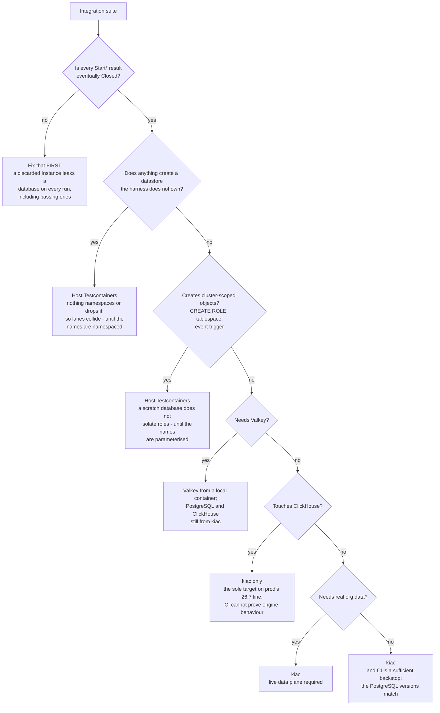

# Integration suite targets: Testcontainers, kiac, or CI

Every Go integration suite in dev-health-ops needs a real datastore. There are
three places it can come from, and picking the wrong one produces a green run
that proves nothing.

Tracked by CHAOS-4428. The companion runbook,
[Lane isolation on a kiac cluster](lane-isolation-kiac.md), covers how a lane
cluster is built; this page covers only **where a given suite should run**.

## The three targets

| Target | What it is | What it costs |
| --- | --- | --- |
| **Host Testcontainers** | `StartPostgres`/`StartClickHouse`/`StartValkey` start a container per caller through Docker. The default. | Docker CPU on the developer's Mac — the allocation CHAOS-4428 exists to reduce. |
| **kiac in-cluster** | The same helpers, pointed at a cluster's existing datastores by env DSN. Every caller **that goes through the harness** gets its own scratch database; a resource created out-of-band is outside that ownership model — see below. | Near zero extra CPU: the datastores are already running. |
| **GitHub Actions CI** | The suite is not run locally at all; the `go-storage-integration-*` jobs are the signal. | No local cost, but see the version table — CI does not run what production runs. |

## The rule

**Start from the engine versions, not from convenience.** They are not the same
across the three targets, and that is what decides the routing:

| Where | ClickHouse | PostgreSQL | How this was established |
| --- | --- | --- | --- |
| Host Testcontainers (this repo) | **26.6.1.1193** | 18-alpine | The image is digest-pinned with no version in the source; resolved from the registry config blob label `com.clickhouse.build.version` (built 2026-06-26). Independently corroborated in-repo: `internal/providersync/linear_stale_project_ownership_cleanup.go:75-82` records the same resolution, reached by running against the digest directly. |
| GitHub Actions CI services | **25.1** | 18-alpine | `.github/workflows/test.yml:165,335`; `.github/workflows/live-e2e.yml:82,176`. |
| kiac in-cluster (`acr-local`) | **26.7.3.19** | **18.6** | Live readback, `SELECT version()` / `SHOW server_version`, 2026-08-31. |
| acr's own Testcontainers | 26.7.5.10 | 18-alpine | Pinned deliberately by CHAOS-4549; floor `26.7` in `acr/internal/chfixture`. |
| Production | 26.7.x (floating) | — | CHAOS-4519: prod's exact patch drifts, so the floor is `major.minor`. |

Three consequences follow, and they are the whole decision procedure:

1. **CI cannot prove ClickHouse engine behaviour.** It runs 25.1 against a
   production line of 26.7. CHAOS-4549 is the precedent for why the gap
   matters rather than being cosmetic: a multi-arm `JOIN ... ON (... OR ...)`
   is accepted on 26.7 and rejected on 24.8 with
   `Code: 403 Unsupported JOIN ON conditions`, under every analyzer setting.
   A version gap changes *what SQL is accepted at all*.
2. **The ops host Testcontainers cannot prove it either.** They run
   26.6.1, one minor **below** the 26.7 floor acr ruled for exactly this
   reason — so an ops host container would fail acr's own
   `AtLeastVersionFloor` check. This is the caveat that is easiest to miss:
   "I ran it against a real ClickHouse locally" is not the same claim as "I
   ran it against production's engine".
3. **kiac is the only target in dev-health-ops that matches production's
   ClickHouse line.** So moving ClickHouse-touching suites there is a
   correctness upgrade, not only a Docker saving.

> **Open:** the ops ClickHouse pin is an opaque digest set under CHAOS-3033 and
> never revisited, and it disagrees with acr's ruled 26.7 floor. Reconciling
> the two is tracked separately — it changes what every ops ClickHouse suite
> runs against and needs its own red-first change, so it is deliberately not
> folded in here.

## Decision flow

Routing is **per store**, not per suite: a suite that needs Valkey still takes
its PostgreSQL and ClickHouse from kiac. Only the store that cannot be isolated
stays local.



Note what is **not** a fork here. "Does it assert a pristine database?" used to
be one, and should not be: every caller gets a freshly created scratch database,
so that requirement is satisfied on either target. The distinction that matters
for those suites is scratch vs. *seeded*, which is a different question and is
covered below.

## Per-package matrix — Go, dev-health-ops

Weights are the declared CI shard weights from `ci/go_integration_shards.tsv`;
they are the best available proxy for what each package costs. "Stores" is
derived from which harness entry points the package's files call — including
files that reach the harness through a package-local helper without importing
`testcontainers` themselves, which is the majority.

Two questions are answered separately, because they are separate:

- **Local target** — where the suite runs on a developer's machine.
- **Is CI sufficient proof?** — whether the `go-storage-integration-*` jobs can
  stand in for a local run at all. This is where the version table bites.

PostgreSQL-only packages get **yes**: CI's PostgreSQL is the same 18 line as
kiac (18.6) and production, so nothing about the engine differs. ClickHouse-
touching packages get **no** unless every construct they exercise is engine-
neutral — CI is 25.1 against a 26.7 production line.

Engine-sensitivity below is per-package and evidenced. The recurring sensitive
constructs in this codebase are `FINAL` on `ReplacingMergeTree`, `argMax`
tie-breaks, window functions, and insert-block dedup `SETTINGS` — all of them
semantics that a version change can move.

| Package | Weight | Stores | Local target | CI proof? | Engine notes |
| --- | --- | --- | --- | --- | --- |
| `internal/providersync` | 1166s | CH+PG | **kiac** | **no** | Sensitive. `FINAL`/`argMax`/`ReplacingMergeTree` in 53 of 55 CH-touching files, plus a dedup-window `SETTINGS` test. Largest single cost in the repo. |
| `internal/scheduler/fixed` | 143s | PG | kiac | yes | Self-seeding PostgreSQL. |
| `internal/streamhandlers` | 113s | CH | **kiac** | **no** | Sensitive. `argMax` tie-break over `(occurred_at, event_id)`; migration 077 states outright that a tie lets ClickHouse "return either key". Weight is *almost entirely container startup* (six tests, fresh container each) — the biggest per-package saving. |
| `internal/storage/postgres` | 91s | PG | **host** (roles) | yes | Creates roles without dropping them first, so a shared cluster fails on re-run. Otherwise pure PostgreSQL. |
| `internal/testsupport/computeparity` | 50s | CH | **host** (out-of-band) | **no** | Creates FIXED-name databases (`parity_left`, `parity_right`, `parity_capacity_*`) through a fixture tool outside the harness, and provisions them with `--reset`. On a shared cluster one lane drops another's live database. Also sensitive: `capacity_table_parity` uses `FINAL` on `ReplacingMergeTree(computed_at)`. |
| `internal/jobs/report` | 33s | CH+PG | **kiac** | **no** | Mixed: most files use only `LIMIT 1 BY`/`uniqExact`, but `team_metrics_daily_ratio` uses `countIf(...) OVER (PARTITION BY ...)`. |
| `internal/scheduler/sync` | 32s | PG | kiac | yes | Pure PostgreSQL. |
| `cmd/dev-health-worker` | 24s | CH+PG+VK | **host** (Valkey) | **no** | Sensitive via `dora_refusal_boot`, which classifies ordering contracts from `system.tables.sorting_key`. PG/CH still come from kiac. |
| `internal/syncreconciler` | 16s | PG | **host** (roles) | yes | Creates roles without dropping them first. |
| `internal/externalrecompute` | 15s | PG+VK | **host** (Valkey) | yes | PostgreSQL from kiac; only Valkey is local. |
| `internal/joboperator` | 13s | PG | **host** (roles) | yes | Creates roles without dropping them first. |
| `internal/synccoverage` | 13s | PG | kiac | yes | Pure PostgreSQL. |
| `cmd/dev-health-workerctl` | 13s | PG | **host** (roles) | yes | Creates roles without dropping them first. |
| `internal/testsupport/containers` | 13s | CH+PG+VK | **host** (self-test) | yes | Engine-neutral (boot/open/close only) — but it is the harness's own self-test, so it must keep exercising the container path. |
| `internal/joboutbox` | 12s | PG | **host** (roles) | yes | Creates roles without dropping them first. |
| `internal/jobs/system` | 12s | PG | kiac | yes | Pure PostgreSQL. |
| `internal/providerfoundation` | 12s | CH+PG+VK | **host** (Valkey) | **no** | Sensitive: asserts insert-block dedup under `SETTINGS non_replicated_deduplication_window=100`. |
| `cmd/dev-health-reconciler` | 10s | PG | kiac | yes | Pure PostgreSQL. |
| `internal/storage/river` | 9s | PG | kiac | yes | Applies the River schema to a scratch DB. |
| `internal/jobs/pagerduty` | 9s | PG | kiac | yes | Pure PostgreSQL. |
| `internal/jobs/workgraph` | 7s | PG | kiac | yes | Pure PostgreSQL. |
| `internal/jobroute` | 6s | PG | kiac | yes | **Demonstrated** — see below. |
| `internal/jobs/metrics/daily` | 6s | CH+PG | **host** (roles) | **no** | Creates roles without dropping them first -- this is the package the failure was found on. Also sensitive: `argMax` tie-break, `DateTime64(6)` precision, `INNER JOIN ... FINAL`. **Demonstrated** — see below. |
| `internal/jobs/metrics/remaining` | 6s | CH+PG | **kiac** | **no** | Mixed: the capacity schema guard reads `system.tables` as strings (neutral), but `dora_ordering_contract` tests `FINAL` vs `LIMIT 1 BY` divergence directly. |
| `internal/syncdispatchruntime` | 6s | CH+PG+VK | **host** (Valkey) | **no** | Sensitive: `argMax(id, updated_at)` dedup readback. |
| `internal/jobrescue` | 5s | PG | kiac | yes | Pure PostgreSQL. |
| `internal/jobruntime` | 5s | PG | kiac | yes | Pure PostgreSQL. |
| `cmd/query-api/internal/routeswitch` | 5s | PG | kiac | yes | Pure PostgreSQL. |
| `internal/syncroute` | 3s | PG | kiac | yes | Pure PostgreSQL. |
| `internal/cacheinvalidation` | 2s | VK | **host** (Valkey) | yes | Valkey only. |
| `internal/streamrunner` | 2s | VK | **host** (Valkey) | yes | Valkey only. |

**Nine packages carry engine-sensitive ClickHouse SQL and cannot be proven by
CI at all** — 1416s, 76.5% of the total integration weight. Three of them
(`computeparity`, `jobs/report`, `jobs/metrics/remaining`) are sensitive only
in *some* files; splitting those files into their own packages would let the
neutral remainder defer to CI, which is a worthwhile follow-up but is not done
here.

Two classifications were left explicitly uncertain rather than guessed:
`jobs/metrics/daily/repo_user_commit_org_scope` (queries `FROM work_items FINAL`
but never inserts into that table, so `FINAL`'s effect is not outcome-asserted)
and `cmd/dev-health-worker/multi_family_boot` (may transitively hit the
ordering guard but asserts nothing about it). Both sit inside packages already
routed to kiac, so the uncertainty changes no routing decision today.

### The second blocker: PostgreSQL roles are cluster-scoped

A scratch **database** isolates tables. It does **not** isolate roles, tablespaces
or event triggers — those live in the cluster, which is shared.

19 test files across 10 packages run `CREATE ROLE`, and **17 of them do not drop
the role first**; they rely on the container being a brand-new cluster. Point
one of those at a shared server and the first run passes, leaves the role
behind, and the second run fails:

```
ERROR: role "finalize_redrive_test_domain" already exists (SQLSTATE 42710)
```

Found by running `internal/jobs/metrics/daily` twice against kiac. It is a
re-runnability failure, not a correctness one, and it is invisible on the first
run — which is exactly what makes it worth writing down.

Two packages (`internal/providersync`, `internal/storage/river`) already
`DROP ROLE` before creating, so they are safe to re-run. Even those are not
*concurrency* safe: two lanes on one cluster would race on the same fixed role
name.

**Until role names are parameterised per run, the affected packages keep a local
container.** That is a per-test change, not a harness change — the harness
cannot rename a role the test hard-codes, and having it drop unknown roles on a
shared server would be far more dangerous than the problem it solves.

### What that adds up to

31 packages, **1852s (30.9 min)** of declared integration weight.

| Class | Weight | Share |
| --- | --- | --- |
| Movable to kiac today | 1577s | **85.2%** |
| Blocked by unparameterised roles | 151s | 8.2% |
| Blocked by Valkey | 61s | 3.3% |
| Blocked by out-of-band fixed-name databases | 50s | 2.7% |
| The harness's own self-test | 13s | 0.7% |

Exactly, 1577/1852 = **85.15%**, rounded to 85.2% above.

Two of these are removable. Parameterising the role names recovers 151s;
namespacing `computeparity`'s fixed database names recovers its 50s. Together
they would take the movable share to **96.0%**.

The other two are not blockers and will not shrink. The Valkey packages keep
only a *Valkey* container — they still take PostgreSQL and ClickHouse from kiac,
and Valkey's container is the cheapest of the three. `internal/testsupport/containers`
is separated out deliberately rather than folded in with them: it is the
harness's own self-test and must keep exercising the container path, because
that path is the thing under test.

### Before moving a suite: check it actually closes its Instance

**This is the precondition that is easiest to miss, because the container path
hid it.** Discarding an `Instance` and keeping only a connection was harmless
against a container — the daemon reaps the container when the run ends. Against
a shared server the `Instance` holds the *only* closure that drops the scratch
database, so a suite that discards it leaks a database on **every run,
including passing ones**.

`internal/jobs/metrics/remaining` did exactly this: its `migratedClickHouse`
helper cached the `driver.Conn` package-wide and dropped the `Instance` on the
floor. It now keeps the instances and releases them from `TestMain`, which is
the only scope matching the cache's lifetime — `t.Cleanup` would drop the store
while other tests still read through the cached conn.

So before routing a suite here, confirm every `StartPostgres` / `StartClickHouse`
result is eventually `Close`d. A suite that caches across tests needs a
`TestMain`, not a `t.Cleanup`.

### And check nothing creates a datastore behind the harness's back

The check above is necessary but not sufficient, because it only sees resources
the harness created. `internal/testsupport/computeparity` passes it — both its
callers close their instance correctly — and is still unsafe on a shared
cluster, because it creates **fixed-name** databases (`parity_left`,
`parity_right`, `parity_capacity_*`) through a separate fixture tool and
provisions them with `--reset`. Two lanes then collide on the same names and one
drops the other's live database. The tool's ownership marker does not help: it
is the same table name in every lane, so it distinguishes a fixture database
from a real one but not one lane's from another's.

**So the second question is: does anything here create a datastore the harness
does not own?** Any creator that is not the harness is a potential collision and
a potential orphan, because nothing will namespace it and nothing will drop it.
Swept at the time of writing: no Go test issues `CREATE DATABASE` directly, and
`scripts/worker/compute_parity_fixtures.py` is the only out-of-band creator in
the repository, used by four call sites in that one package.

That package is therefore **host-only until its names are namespaced** — which
leaves it in an uncomfortable spot worth stating plainly: it is
engine-sensitive *and* host-only, so today it can be proven neither by CI (25.1)
nor by kiac (destructive), and its host containers run 26.6.1 rather than
production's 26.7 line.

### Orphans

A run that fails hard can also leave its scratch database behind, which is what
the per-lane prefix and the create/drop log exist for. A failed `DROP`
additionally logs `ORPHANED`, because callers routinely discard
`Instance.Close`'s error and would otherwise never see it.

## Why Valkey stays on Testcontainers

It is the one deliberate exception and it is not an oversight — a test pins it.

PostgreSQL and ClickHouse both have `CREATE DATABASE`, so a shared server can
hand each caller a private database. Valkey has no equivalent: only 16 fixed
numeric slots, which cannot cover packages running in parallel, and a suite
that issues `FLUSHDB` would silently destroy a neighbour's state. Eleven of the
164 files touch Valkey and its container is by far the lightest of the three,
so accepting that isolation risk would buy back almost no CPU.

## Suites that must never point at a shared database

Independent of the target, some suites assert a **pristine** database and break
against anything holding prior state:

- Migration suites that assert an exact applied-version sequence.
- Suites asserting exact row counts starting from zero.

The scratch-database-per-caller design satisfies these — a scratch database is
empty by construction — but pointing such a suite at a *seeded* lane database
does not. CHAOS-4457 recorded this concretely: two `tests/test_dispatch_outbox.py`
tests failed with `IndexError` against a seeded lane whose `worker_job_outbox`
already held 32 pending rows, because they claim with `limit=1` and expect
their own seeded row back. Against a scratch database both pass unchanged (see
the executed evidence below). **The distinction that matters is scratch vs.
seeded, not container vs. cluster.**

## How to run a suite against kiac

```bash
export KUBECONFIG=<repo>/acr/.tmp/kiac/acr-local/kubeconfig
eval "$(bash acr/deploy/local/trial-data.sh dsn --env | sed -E 's/^/export /')"

export DEV_HEALTH_TEST_POSTGRES_DSN="postgres://${ACR_TEST_TRIAL_PG_USER}:${ACR_TEST_TRIAL_PG_PASSWORD}@${ACR_TEST_TRIAL_PG_HOST}:${ACR_TEST_TRIAL_PG_PORT}/${ACR_TEST_TRIAL_PG_DB}?sslmode=disable"
export DEV_HEALTH_TEST_CLICKHOUSE_DSN="clickhouse://${ACR_TEST_TRIAL_CH_USER}:${ACR_TEST_TRIAL_CH_PASSWORD}@${ACR_TEST_TRIAL_CH_HOST}:${ACR_TEST_TRIAL_CH_PORT}/${ACR_TEST_TRIAL_CH_DB}"
export DEV_HEALTH_TEST_CLICKHOUSE_HTTP_DSN="clickhouse://${ACR_TEST_TRIAL_CH_USER}:${ACR_TEST_TRIAL_CH_PASSWORD}@${ACR_TEST_TRIAL_CH_HOST}:${ACR_TEST_TRIAL_CH_HTTP_PORT}/${ACR_TEST_TRIAL_CH_DB}"

# Namespaces this lane's scratch databases so an orphan from a killed run can
# be swept without matching a concurrent lane's live ones.
export DEV_HEALTH_TEST_SCRATCH_PREFIX=lane_<ticket>

# ClickHouse suites that apply the real migration chain shell out to python3
# (internal/testsupport/chschema). The ambient interpreter is not enough --
# without the repo venv on PATH they fail with ModuleNotFoundError:
# typing_extensions, which reads as a ClickHouse problem and is not one.
export PATH="<repo>/.venv/bin:$PATH"

go test -tags=integration ./internal/jobroute/ -count=1
```

Set neither DSN and the harness starts containers exactly as before — the
default is unchanged, so nothing that works today stops working.

`DEV_HEALTH_TEST_CLICKHOUSE_HTTP_DSN` is needed alongside the native DSN
whenever a suite reaches ClickHouse over HTTP (the Python migration runner
does). A remote instance has no container to ask for a mapped port, so the HTTP
address cannot be derived; omitting it produces an error that names the
variable rather than a connection failure.

### Sweeping orphans

Each scratch database is announced before it is created, confirmed, and logged
again when dropped:

```
containers: creating scratch postgres database "lane_4428_8a2c4feb5e391ab5"
containers: created  scratch postgres database "lane_4428_8a2c4feb5e391ab5"
containers: dropped  scratch postgres database "lane_4428_8a2c4feb5e391ab5"
```

The first line exists because a server can commit `CREATE DATABASE` and the
client still lose the response to a timeout or a dropped connection. Logging
only on success would leave that database with no name anywhere. **The sweep
rule is therefore: any `creating` with no matching `dropped` is a candidate
orphan** — not any `created`.

That race cannot be closed, only made findable: there is no way to create a
database and register its cleanup atomically across a network.

A run killed at any point leaves the database behind. Find them by prefix:

```sql
SELECT datname FROM pg_database WHERE datname LIKE 'lane_<ticket>%';
```

## Executed evidence (2026-08-31)

Against `acr-local`'s in-cluster data plane — ClickHouse 26.7.3.19,
PostgreSQL 18.6 — with the Docker daemon left untouched. Running-container
count was **22 before and 22 after every run**.

| Suite | Language | Stores | Result |
| --- | --- | --- | --- |
| `internal/jobroute` | Go | PostgreSQL | **PASS** — run twice, 0.85s / 0.94s |
| `internal/jobs/report` | Go | PostgreSQL + ClickHouse | **PASS** — run twice, 1.04s / 1.10s |
| `tests/test_dispatch_outbox.py` (the two `test_real_postgres_*` cases) | Python | PostgreSQL | **PASS**, 6.68s |

Each Go suite was run **twice** deliberately. A single green run against a
shared server proves less than it looks: the role collision described above
passes on the first run and only fails on the second.

The Python pair is the CHAOS-4457 sub-item (b) result: both are recorded there
as failing against a seeded lane database, and both pass against a scratch one
with no change to the tests. The DSN used the `postgresql+asyncpg://` dialect,
which is sub-item (a)'s correction.

Isolation was verified by comparing the full `pg_database` and
`system.databases` listings before and after: both are byte-identical to their
baselines, and a `LIKE 'lane_4428%'` sweep returns 0. The shared trial
ClickHouse `default` database and the real-data `dh_0830` database were never
written to.

## acr's Go suites

acr is **not** covered by the plumbing above and needs its own change, tracked
separately.

It has no single chokepoint. `acr/internal/chfixture` looks like one but starts
no containers — it holds the image pin, the version floor, and the static
JOIN-portability linter that replaced the old-engine fixture gate. The
container starts instead live in roughly twenty per-package helpers
(`newXTestDatabase`, `newXIntegrationClient`, `newLiveAdapter`), so remote-DSN
support is about twenty small edits rather than one.

acr already has the convention to adopt — `ACR_TEST_TRIAL_{PG,CH,FALKOR}_*`,
`ACR_CLICKHOUSE_INTEGRATION_DSN`, `ACR_CHAOS4645_KIAC_DSN` — and several suites
already skip unless a live DSN is set. Its highest-risk suites to move are
under `migrations/postgres`, which take a fresh container per test and assert
exact migration sequences; those need a scratch database, never a shared one.
