# Lane isolation on a kiac cluster

Run the **whole** Dev Health stack — Postgres, PgBouncer, ClickHouse, Valkey,
FalkorDB, the ops API, the metrics API, the Go worker family, web, and the ACR
hosted runtime plus its projector — inside one local Kubernetes cluster, with
**one namespace per lane**. Each lane gets its own datastores seeded from
`backups/`, its own migrations, and its own worker fleet, so parallel agents
stop contending for the shared Docker Compose stack.

The cluster is provisioned by [kiac](https://github.com/kiac-dev/kiac) on
Apple's `container` runtime, entirely outside any Docker daemon, so it never
competes with Compose or with host Testcontainers.

Tracked by CHAOS-4428. The runtime interface lives in the ACR repository
(`deploy/local/kiac.sh`, `deploy/local/trial-data.sh`) because that is where the
kiac pilot (CHAOS-4051/4055) and the trial data plane (CHAOS-4186) already live.

## What isolation buys you

These standing rules exist only because lanes share one Compose stack. **For a
cluster-isolated lane they do not apply:**

| Standing rule (shared Compose stack) | Cluster-isolated lane |
| --- | --- |
| Downgrade an unmerged Alembic revision when you finish, so you do not break another lane's `migrate` | **Not needed.** `alembic_version` is per database and each namespace has its own Postgres. Two namespaces sat at 0115 and 0109 simultaneously with both stacks healthy. |
| Give a cross-domain heads-up before `compose up -d --build` | **Not needed.** `helm upgrade` touches one namespace. |
| Take the host-wide `local_validate` lock | **Not needed** for a gate pointed at a lane namespace's own DSNs. Still required for anything that runs against the Compose stack. |
| Never write to the shared Postgres/ClickHouse | **Not needed.** Write freely; the blast radius is the namespace. |

What does **not** change: never touch another lane's namespace, never run
`kiac down`/`delete`/`prune` against a cluster you did not create, and never run
host-wide `container system` verbs — those stop every kiac VM on the machine.

## Topology

```mermaid
flowchart TB
    subgraph host["macOS host"]
        backups[("backups/<br/>postgres-all-*.sql.gz<br/>clickhouse-*.zip")]
        docker["Docker Desktop<br/>(shared Compose stack —<br/>untouched)"]
        images["docker buildx build<br/>→ docker save<br/>→ container image load<br/>→ kiac.sh load-image"]
    end

    subgraph cluster["kiac cluster 'dev-full' — one node VM (apple/container)"]
        subgraph lanea["namespace lane-a — NodePort base 30500"]
            apga[("trial-postgres")]
            acha[("trial-clickhouse")]
            afka[("trial-falkordb")]
            aapp["ops api · metrics-api · web · valkey<br/>3 × pgbouncer · 9 go-worker groups"]
            aacr["acr-api · acr-projector"]
            aapp --> apga & acha
            aacr --> apga & acha & afka
        end
        subgraph laneb["namespace lane-b — NodePort base 30510"]
            bpga[("trial-postgres")]
            bcha[("trial-clickhouse")]
            bfka[("trial-falkordb")]
            bapp["ops api · metrics-api · web · valkey<br/>3 × pgbouncer · 9 go-worker groups"]
            bacr["acr-api · acr-projector"]
            bapp --> bpga & bcha
            bacr --> bpga & bcha & bfka
        end
    end

    backups -->|restore-postgres / restore-clickhouse| apga & acha
    backups -->|restore-postgres / restore-clickhouse| bpga & bcha
    images -->|containerd, imagePullPolicy Never| cluster
    docker -. no dependency .-> cluster
```



Namespaces are the isolation boundary, not nodes: a kiac node's CPU and memory
are fixed at **create time** (there is no live-resize path), so a node per lane
would freeze the split before the lanes exist and resizing would cost a cluster
recreate, which destroys the PVC data. Namespaces cost one Postgres, one
ClickHouse and one FalkorDB pod per lane and can be added and removed freely.

## Recipe

### 1. Create the cluster (once per machine)

```bash
cd acr
ACR_KIAC_CLUSTER_NAME=dev-full \
ACR_KIAC_WORKERS=0 \
ACR_KIAC_CPUS=4 \
ACR_KIAC_CP_MEMORY=24G \
ACR_KIAC_ALLOW_VERSION_DRIFT=1 \
deploy/local/kiac.sh up

export KUBECONFIG="$(ACR_KIAC_CLUSTER_NAME=dev-full deploy/local/kiac.sh kubeconfig)"
```

`ACR_KIAC_ALLOW_VERSION_DRIFT=1` is expected while the installed `container`
CLI is ahead of `kiac.sh`'s pin; the drift is informational.

Check the host first. Start with **one** node and add more only if
`sysctl hw.memsize`, `vm_stat` and `uptime` say the machine can carry them.

### 2. Side-load the images

`container build` is broken on these Dockerfiles, so build with Docker and
bridge the result into the cluster's containerd:

```bash
# ops runtime, from your worktree
SHA=$(git rev-parse --verify HEAD)
docker build --target api \
  --build-arg "SETUPTOOLS_SCM_PRETEND_VERSION=0.0.0+g${SHA:0:12}" \
  -f docker/Dockerfile -t "dev-health-ops-local:${SHA:0:12}" .

# every image, one per line (zsh does NOT word-split an unquoted list)
while IFS= read -r image; do
  docker save -o /tmp/img.tar "$image"
  container image load -i /tmp/img.tar
done < image-list.txt

cd acr && ACR_KIAC_CLUSTER_NAME=dev-full ACR_KIAC_ALLOW_VERSION_DRIFT=1 \
  deploy/local/kiac.sh load-image <image> [<image>...]
```

Every workload then uses `imagePullPolicy: Never`. Registry images with
multi-architecture manifest lists (`edoburu/pgbouncer`, `valkey/valkey`) fail
`container image load` with `missingContent(sha256:…)` — leave those at
`IfNotPresent` and let the node pull them; the node has egress.

### 3. Bring up one lane's datastores and seed them

```bash
cd acr
export ACR_TRIAL_DATA_NAMESPACE=lane-a
export ACR_TRIAL_NODEPORT_BASE=30500        # one base per lane; +10 for the next

deploy/local/trial-data.sh apply
deploy/local/trial-data.sh wait
deploy/local/trial-data.sh restore-postgres   ../backups/<ts>/postgres-all-<ts>.sql.gz
deploy/local/trial-data.sh restore-clickhouse ../backups/<ts>/clickhouse-default-<ts>.zip
deploy/local/trial-data.sh dsn --env          # DSNs for host-side tools
```

NodePorts are **cluster**-scoped, not namespace-scoped, so every lane needs its
own `ACR_TRIAL_NODEPORT_BASE`. The base must be a multiple of 10 inside
30000–30990: each lane uses four consecutive ports, and the 10-port stride is
what makes two lanes' *ranges* disjoint rather than merely their base values.

`trial-data.sh dsn` reads the ports off the **deployed** Services, not off your
shell, so a stale or missing `ACR_TRIAL_NODEPORT_BASE` cannot hand you another
lane's endpoints.

### 4. Pin the runtime role passwords

The dump restores `devhealth_domain`, `devhealth_queue` and
`devhealth_coordinator` with whatever passwords the source stack had, which
nothing here knows:

```sql
ALTER ROLE devhealth_domain      WITH LOGIN PASSWORD 'devhealth_domain';
ALTER ROLE devhealth_queue       WITH LOGIN PASSWORD 'devhealth_queue';
ALTER ROLE devhealth_coordinator WITH LOGIN PASSWORD 'devhealth_coordinator';
```

### 5. Run the three migration steps IN THIS ORDER

This ordering is not cosmetic. `provision_river_roles.sql` **revokes** the
runtime-role grants; `dev-health-worker-migrate` is what **grants** them. Run
provisioning last and every Go worker fails readiness with nothing in the log
but `failed_checks:"domain_postgres"`.

1. **Provision the roles** — `scripts/worker/provision_river_roles.sql`, with
   `domain_role`/`queue_role`/`coordinator_role` and their passwords set.
2. **Alembic + ClickHouse** — the ops chart's migration hook (below).
3. **River + grants** — the `dev-health-worker-migrate` image as a one-shot Job
   with `MIGRATION_DATABASE_URI` pointing **directly** at Postgres (never at a
   pooler). Confirm `dev_health_runtime_posture_missing{role="…"} 0` for all
   three roles in its output.

### 6. Install the two releases

Install from **your worktree's** charts, not from `deploy/vendor/` — those
submodules are pinned to older commits.

```bash
helm upgrade --install lane-a <ops-worktree>/deploy/helm/dev-health \
  -n lane-a -f lane-a-ops.yaml --timeout 15m --wait

helm upgrade --install lane-a-acr <acr-worktree>/deploy/helm/acr \
  -n lane-a -f lane-a-acr.yaml --timeout 10m --wait
```

The lane values must set `postgresql.enabled: false` and
`clickhouse.enabled: false` and point every DSN at the namespace's own
`trial-postgres` / `trial-clickhouse` Services, with
`contextFabric.falkor.addr: trial-falkordb:6379`, `tls: false`,
`allowInsecure: true`.

Two things the values must NOT do:

- **Do not set `migrations.hook.secretData.MIGRATION_DATABASE_URI`.** The chart
  documents it as preferred, but the CLI defaults its global `--db` from
  `POSTGRES_URI` *or* `DATABASE_URI`, and the migration Job always inherits
  `DATABASE_URI` from the app Secret, so the two always collide
  (`--db cannot be combined with MIGRATION_DATABASE_URI`). Set `POSTGRES_URI`
  instead and run River separately, per step 5.
- **Leave `sync-provider` at `replicas: 0`.** That group cannot compose until
  the provider job-routes are activated, and the chart renders no
  route-activation Job (Compose does this with five `*-route-activate`
  one-shots plus `go-worker-operator-credential`).

### 7. Secrets

Create the ACR Secrets by hand; the chart takes only `existingSecret`
references:

| Secret | Keys |
| --- | --- |
| `acr-runtime` | `ACR_POSTGRES_DSN`, `ACR_CLICKHOUSE_DSN`, `ACR_EVIDENCE_ID_ACTIVE_KID`, `ACR_EVIDENCE_ID_KEYS` |
| `acr-migration` | `ACR_POSTGRES_MIGRATION_DSN` |
| `acr-model` | `ACR_CONTEXT_FABRIC_MODEL_API_KEY`, `ACR_CONTEXT_FABRIC_EMBED_API_KEY` |

**Strip the surrounding quotes** when you copy a value out of a `.env` file.
Docker Compose strips them; `kubectl create secret --from-literal` does not, and
a quoted key reaches the provider as an invalid credential.

## Testcontainers: which suite runs where

| Suite | Where |
| --- | --- |
| Go unit and `internal/...` seam tests | Host Testcontainers. No cluster dependency. |
| Go integration suites needing Postgres + ClickHouse + River | In-cluster DSNs via the lane's NodePorts, scratch database per lane. |
| `ci/check_go.sh live-python-oracles` | In-cluster DSNs. |
| ops `ci/local_validate.sh` full gate | In-cluster Postgres and a scratch ClickHouse database inside the lane's own ClickHouse. The namespace satisfies the scratch-ClickHouse safety requirement. |
| web Playwright e2e | The lane's own ops API and web. |
| ACR two-turn corpus cases | The lane's own Postgres, ClickHouse and FalkorDB. |

The rule: keep Testcontainers only where a suite genuinely wants a **throwaway**
store. Anything that needs the seeded real organization must use the in-cluster
plane.

## Cost

Measured on one 4 vCPU / 24 GB node with the full stack in `lane-a` and the
datastores plus most of `lane-b`:

| Step | Wall time |
| --- | --- |
| Cluster create to node Ready | 78 s |
| Datastore rollout (Postgres, ClickHouse, FalkorDB) | 42 s |
| Postgres restore (93 MB gzip, `pg_dumpall`) | 28 s |
| ClickHouse restore (177 MB archive) | 9 s |
| **Cold, empty machine to seeded datastores** | **157 s** |
| `docker save` + `container image load`, 12 images | 34 s |
| `kiac.sh load-image`, 10 images | 14 s |
| A second seeded lane namespace | 80 s |

Node use with the full stack in one namespace: 1114 m CPU (22 %) and 4449 MiB
(18 % of 24 GB). With a second seeded lane it rose to 1550 m (31 %) and
6997 MiB (28 %). Roughly three lanes fit on one node of this size.
