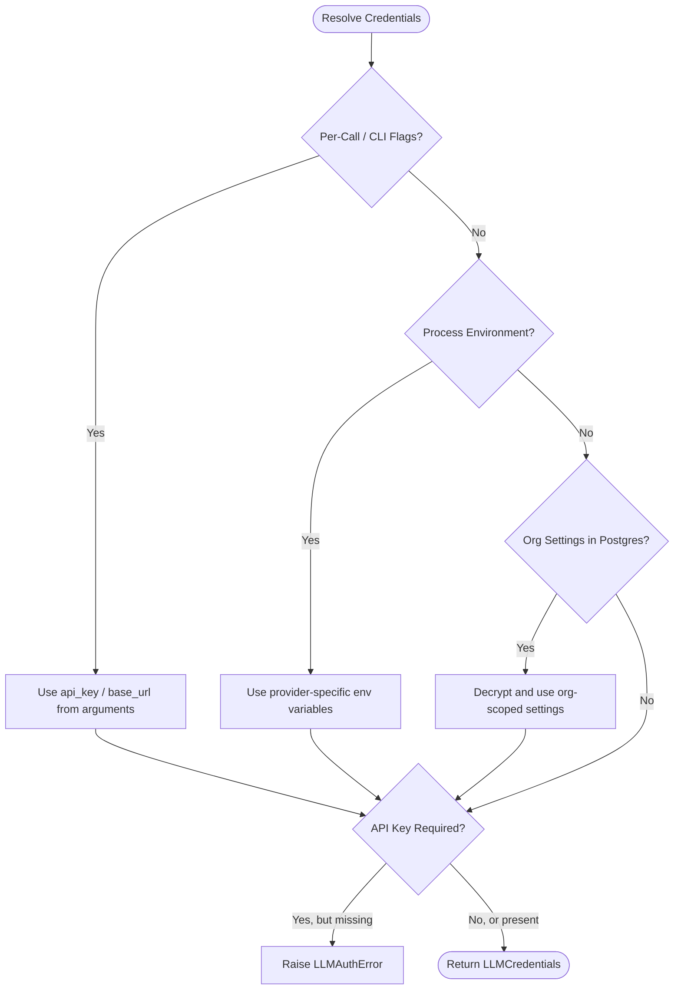

# BYO-LLM Credential Resolution

This page describes how the Dev Health platform resolves credentials for Bring Your Own LLM (BYO-LLM) configurations.

## Resolution Precedence

When a component requests an LLM provider, the system resolves the API key and base URL using a strict precedence order. The first source that provides a value wins.

## Precedence Details

1. **Per-Call Arguments / CLI Flags**:
   Values passed directly to the function call (e.g., `--llm-api-key` or `--llm-base-url` from the CLI) take the highest priority.
2. **Process Environment Variables**:
   If no per-call arguments are present, the system checks the environment. Each provider has a list of environment variables it checks in order. For example, the `openai` provider checks `LLM_API_KEY` first, then `OPENAI_API_KEY`.
3. **Organization Settings**:
   If neither per-call arguments nor environment variables are set, the system queries the Postgres database for organization-scoped settings. These settings are stored under the `llm` category and decrypted using the `SettingsService`.

## Provider Environment Variable Mapping

The system maps providers to specific environment variables.

| Provider | API Key Environment Variables | Base URL Environment Variables |
|---|---|---|
| `openai` | `LLM_API_KEY`, `OPENAI_API_KEY` | `LLM_BASE_URL`, `OPENAI_BASE_URL` |
| `anthropic` | `LLM_API_KEY`, `ANTHROPIC_API_KEY` | `LLM_BASE_URL`, `ANTHROPIC_BASE_URL` |
| `gemini` | `LLM_API_KEY`, `GEMINI_API_KEY` | `LLM_BASE_URL`, `GEMINI_BASE_URL` |
| `qwen` | `LLM_API_KEY`, `QWEN_API_KEY`, `DASHSCOPE_API_KEY` | `LLM_BASE_URL`, `DASHSCOPE_BASE_URL` |
| `local` | `LLM_API_KEY`, `LOCAL_LLM_API_KEY` | `LLM_BASE_URL`, `LOCAL_LLM_BASE_URL` |
| `ollama` | `LLM_API_KEY`, `LOCAL_LLM_API_KEY` | `LLM_BASE_URL`, `OLLAMA_BASE_URL` |
| `lmstudio` | `LLM_API_KEY`, `LOCAL_LLM_API_KEY` | `LLM_BASE_URL`, `LMSTUDIO_BASE_URL` |

## Validation and Errors

If a provider requires an API key (such as `openai`, `anthropic`, `gemini`, or `qwen`) and none is found after checking all sources, the system raises an `LLMAuthError`. This error lists the missing configuration options to help operators resolve the issue.
