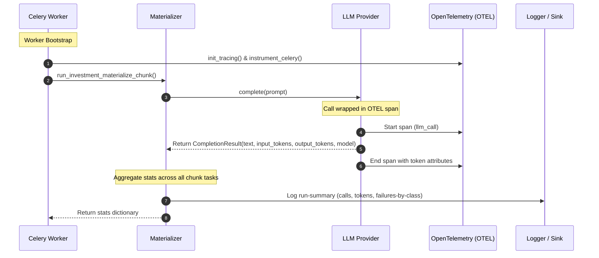

# LLM Spend Observability and Tracing

This page describes how the Dev Health platform tracks LLM token usage, costs, and execution traces.

## Observability Flow

The system tracks token usage and execution details at both the individual call level and the aggregate run level.

## Token Tracking

The `CompletionResult` dataclass captures token usage details returned by the provider APIs:
- `input_tokens`: Number of tokens in the prompt.
- `output_tokens`: Number of tokens in the response.
- `model`: The exact model name used for the completion.

Each provider implementation (e.g., OpenAI, Anthropic, Gemini) extracts these values from the raw API response and populates the `CompletionResult`.

## OpenTelemetry Integration

Tracing is initialized during the Celery worker bootstrap process. The `init_tracing` function configures the OpenTelemetry SDK with an OTLP gRPC exporter. The `instrument_celery` function then instruments all Celery tasks.

Each LLM call is wrapped in an OpenTelemetry span. The span includes attributes for:
- `llm.provider`: The provider name (e.g., `openai`).
- `llm.model`: The model name (e.g., `gpt-5-mini`).
- `llm.usage.input_tokens`: The prompt token count.
- `llm.usage.output_tokens`: The completion token count.

## Run-Summary Aggregation

At the end of an investment materialization run, the system aggregates usage statistics across all processed components. The summary includes:
- **Total Calls**: The sum of all successful and failed LLM calls.
- **Token Counts**: Total input and output tokens consumed.
- **Failures by Class**: A breakdown of errors categorized by class (e.g., `rate_limit`, `quota_exceeded`, `auth`, `server_error`, `context_length`, `output_error`).

This summary is logged to the standard output and returned to the orchestrator for reporting.
