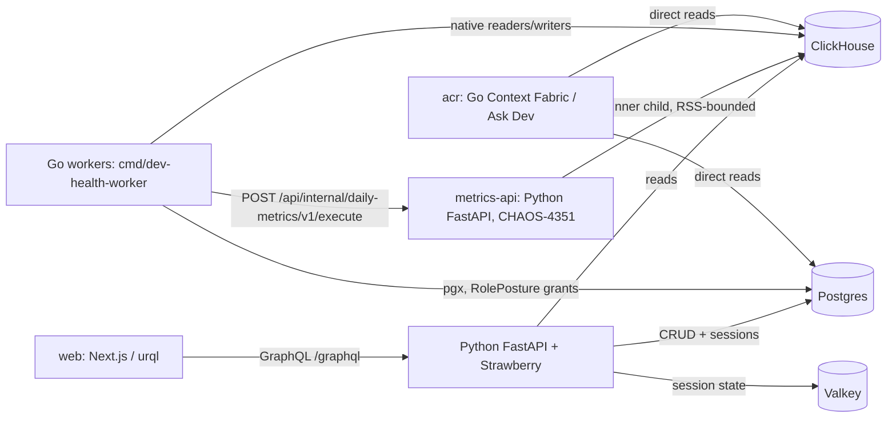
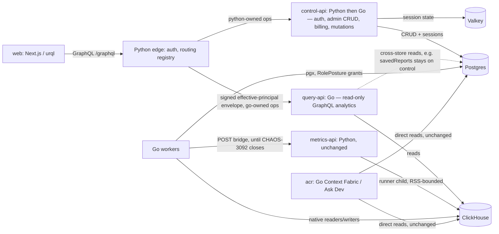
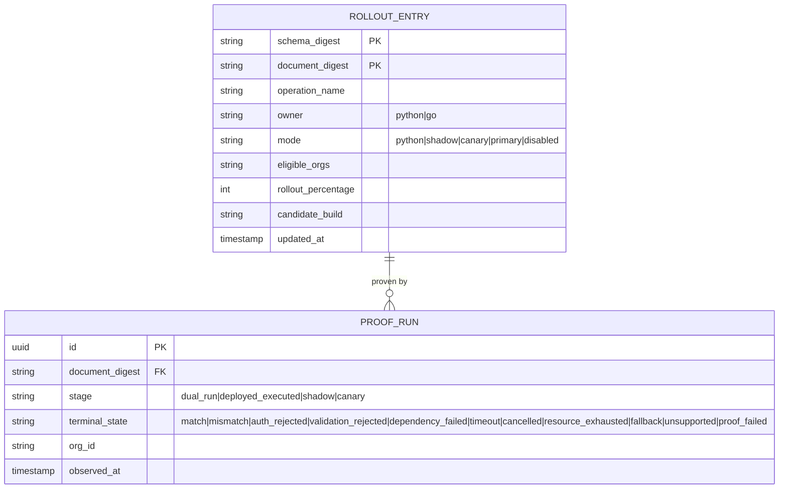

# Go API Epic — Plan (CHAOS-4352)

Status: DRAFT. Author: lane-go-api-plan (Fable), 2026-08-27. Codex architectural review: `gpt-5.6-sol --effort=xhigh`, round 1 in `.remember/lanes/lane-go-api-plan/codex_round1_architecture.out`.

## 1. Why this plan exists

CHAOS-4352 was a placeholder epic ("almost want even the Python API off Python", chris 2026-08-25). It was not scoped. This document scopes it: inventories the current Python API surface, proposes a Go target architecture and service boundary, and defines a migration strategy that will not repeat the incidents from the Celery→Go worker cutover (CHAOS-3033), which chris stopped mid-migration on 2026-08-26 after prod hit an RLIMIT_AS-vs-RSS memory-bound false positive and a stranded-partition classification gap that were never caught locally before they shipped.

## 2. Current state — API surface inventory

`ops/src/dev_health_ops/api/main.py` mounts, in order:

| Router | Backing store | Domain |
|---|---|---|
| `graphql_app` (Strawberry, `/graphql`) | ClickHouse (queries) + Postgres (mutations) | Analytics, investment, work graph, team attribution, DORA-class metrics; admin-ish mutations |
| `webhooks_router` | Postgres | Inbound provider webhooks |
| `admin_router` (19 sub-routers: ask_dev, audit_logs, credentials, customer_push, features, github_app, governance, identities, integrations, ip_allowlist, orgs, pagerduty(+bindings/services), platform, platform_ask_dev, retention, settings, setup, sync, teams, users) | Postgres | Org/user/team/identity CRUD, credentials, integrations, sync config, retention, feature flags, governance |
| `impersonation_router` | Postgres + Valkey | Support impersonation |
| `auth_router` | Postgres + Valkey (session) | Auth/session |
| `billing_router` | Postgres | Billing/licensing/subscriptions |
| `dev_router` (Ask Dev, ~45 files under `api/dev/`) | Mixed | Python Ask Dev prototype — **not a porting target**: chris's standing rule is that this prototype is not a reference; the real Ask Dev runtime is native Go in `acr/` against ClickHouse tables + contracts. Only the admin-facing slice (feature flags, settings surfaced via `admin/routers/ask_dev.py`) is durable. |
| `licensing_router`, `telemetry_router`, `product_telemetry_router` | Postgres | Licensing, telemetry |
| `ingest_router`, `external_ingest_router`(+status) | Postgres/ClickHouse | Ingest endpoints |
| `internal_acr_router` | — | Internal, consumed by `acr/` |
| `worker_operational_router`, `worker_sync_router`, `worker_metrics_router`, `worker_workgraph_router` | Postgres/ClickHouse | **Internal bridge routes for Go workers.** `worker_metrics_router` is `/api/internal/daily-metrics/v1/execute` — the daily-metrics compatibility bridge Go's heavy worker calls into a Python child process for families not yet natively ported (CHAOS-3092). This was just hardened 2026-08-27 (PR 3f1223b9e: RSS-based memory enforcement, replacing a self-imposed RLIMIT_AS bound that false-fired in prod). A dedicated `metrics-api` service (CHAOS-4351) now runs this Python image standalone in prod so the bridge's runner-child memory profile doesn't compete with the main API replicas. |
| `orgs_router` | Postgres | Org management |

Endpoint density (`@router.get/post/put/delete/patch` count) — heaviest Postgres-CRUD surfaces: `admin/routers/sync.py` (16), `customer_push.py` (15), `settings.py` (13), `integrations.py` (13), `teams.py` (11), `orgs.py` (11); `dev/router.py` (10), `billing/router.py` (8).

GraphQL: `api/graphql/schema.py` defines `Query` and `Mutation` root types; 33 resolver files under `api/graphql/resolvers/`. Consumer: `web/` (Next.js, urql client, TypeScript types generated from a schema export consumed by web CI for drift detection — `api/graphql/export_schema.py`). `acr/` (Go) does **not** consume this API; it reads Postgres/ClickHouse directly for its own runtime.

Auth/session: Valkey-backed sessions, per-request web session sync, tier resolution via `resolve_org_tier` (never `OrgLicense`-only), impersonation state kept in sync between Valkey and per-request web state.

Governing platform rule (root `AGENTS.md`): **ClickHouse is the only supported analytics backend; PostgreSQL is the semantic layer only.** Team/identity attribution has zero Postgres presence (CHAOS-2600) — it is ClickHouse-only, query-time.

## 3. Service boundary — recommendation

*(Codex `gpt-5.6-sol --effort=xhigh` architectural review incorporated below; raw output in `.remember/lanes/lane-go-api-plan/codex_round1_architecture.out`, lines 8401-8598.)*

**Recommendation: three planes, not a strict ClickHouse/Postgres split.**

| Plane | Runtime | Owns |
|---|---|---|
| `query-api` | Go (new) | Read-only, latency-bounded GraphQL analytics operations (mostly ClickHouse, some cross-store) |
| `control-api` | Python today, incremental Go | Auth, impersonation, billing/licensing, Postgres CRUD (admin routers), webhooks/ingest, operational controls, report metadata/mutations |
| `metrics-compat-api` | Existing Python `metrics-api` (CHAOS-4351) | Only the worker daily-metrics compatibility bridge endpoints + runner subprocess — unchanged by this epic |

The current FastAPI process is a composition root, not a service boundary — it mounts GraphQL, admin, auth, billing, ingest, Ask Dev, telemetry, and worker bridges in one process (`main.py`).

**Why this is not simply "metrics vs admin" along store lines.** The split follows workload and state ownership, not GraphQL verb or datastore name. Counter-examples that break a literal ClickHouse/Postgres cut:
- `savedReports` (a Query field) is Postgres-backed; all current Mutation fields are Postgres-backed report-control operations — both stay on `control-api` despite being reached through the same schema as the ClickHouse analytics queries.
- Team/identity administration reads/writes ClickHouse (the CHAOS-2600 attribution store) but is **administration**, not interactive analytics — it stays on `control-api`.
- The Ask Dev prototype (`api/dev/*`) is out of scope for either plane; its Go runtime lives in `acr/`.

**Auth stays put initially.** Do not split auth/session into a third thing yet — the request-path auth contract (Postgres token validation + impersonation precedence + org selection + ClickHouse context construction, `graphql/app.py`) is too entangled to lift alongside the first Go plane. `query-api` receives a short-lived, audience-bound signed effective-principal envelope from the Python edge; it must never reduce auth to bare JWT signature validation (disabled users, token-version revocation, org-switch membership checks, active impersonation, and tier fallback are all part of the contract) — see open decision 1.

**What `metrics-api` (CHAOS-4351) actually is:** the same Python API image, no route split, reachable only internally, isolated purely so the compatibility bridge's runner-child memory/PID profile doesn't compete with normal API traffic. It does **not** partially implement this split and must not be reused as the `query-api` name. Retire it only when no Go worker still calls the compatibility endpoints, ledger-recovery is no longer needed, and a defined zero-traffic window has passed — moving GraphQL resolvers to Go neither requires nor justifies retiring it early.

## 4. GraphQL library choice

**Use gqlgen.** Strawberry already exports the schema as SDL (`export_schema.py`); gqlgen is schema-first and generates Go models/plumbing/resolver interfaces from that SDL, matching the existing server-schema → client-codegen direction. Web keeps its urql operations and generated TS types unchanged — GraphQL Code Generator accepts either a local SDL or a live endpoint, so the server language is irrelevant as long as the schema and wire behavior are stable. (`graph-gophers/graphql-go` also consumes SDL but offers less generation leverage at this schema size; `graphql-go/graphql` builds the schema programmatically, which would introduce a second manually-maintained schema — the wrong direction for drift control.)

During coexistence, enforce as a CI gate: `Strawberry export == checked-in canonical SDL == gqlgen input SDL == web codegen SDL`. Preserve runtime behavior, not just schema shape — custom scalar serialization, nullability, error paths/extension codes, subscriptions, query-depth/alias limits, disabled production introspection, and the existing request-size bound (`graphql/security.py`) are all client-visible contracts. Do not adopt gqlgen's automatic-persisted-query extension as a drop-in for the current `X-Persisted-Query-Id` header/registry — audit actual web usage first; the handshake shapes differ.

## 5. Migration strategy — not repeating the worker cutover's failures

The worker cutover's incidents shared one shape: a family was ported and deployed before its local-proof/executed-proof gate existed to catch a resource-model mismatch (RLIMIT_AS counts virtual address space, not RSS) and a classification gap (a dead ledger claim never reaching a terminal state). The API migration needs the HTTP/GraphQL equivalent of "executed-proof": a per-route/per-operation gate that proves the Go implementation produces the same observable result as Python on real traffic shapes, not just that it compiles and passes a hand-written unit test.

**Operation identity and routing.** `/graphql` multiplexes many behaviors, so path routing is insufficient. A rollout registry is keyed by `schema digest + canonical document digest + selected operation` (operation *name* is telemetry only — names collide and don't capture aliases/fragments/changed selections; a persisted-query ID is only an index once it resolves to the registered document digest). Each entry carries `owner: python|go`, `mode: python|shadow|canary|primary|disabled`, `eligible_orgs`/`rollout_percentage`, `candidate_build`, `schema_digest`. Rules: route the *whole* operation, never individual fields; an operation with both migrated and unmigrated root fields stays on Python; unregistered documents, introspection, subscriptions, and (initially) all mutations stay on Python; rollout is sticky by org + operation digest; **rollback is a registry change, not an image rollback.**

**Five-stage proof gate**, each with a named terminal state (`match`, `mismatch`, `auth_rejected`, `validation_rejected`, `dependency_failed`, `timeout`, `cancelled`, `resource_exhausted`, `fallback`, `unsupported`, `proof_failed` — no unclassified equivalent of a stranded partition is acceptable):
1. **Proof infrastructure first** — comparator, operation registry, rollout ledger, auth-context fixture matrix, and rollback path all exist before any resolver is ported.
2. **Local dual-run proof** — real Python and Go servers against the same producer-seeded scratch Postgres/ClickHouse/Valkey state; compare the *complete* observable response (status + contract headers, GraphQL `data`, `errors` incl. paths/extension codes, null-vs-omitted, scalar formatting, list ordering/pagination/cursors). Every exclusion needs a written reason and must match something; the comparator itself must be falsified with planted defects (a removed row, changed nullability, changed error path, reordered results) — the CHAOS-3033 differential-oracle discipline applied to HTTP.
3. **Deployed executed proof** — the exact candidate build handles the request through real ingress, auth, org/impersonation resolution, GraphQL parse/validate, resolver dispatch, real DB access, serialization. A constructor, health check, direct resolver test, or bare 200 does not qualify.
4. **Read-only shadow** — Python serves the client response while Go receives the same authenticated operation in parallel; compare response digests only when both observed the same data watermark/snapshot.
5. **Sticky canary** — one operation, selected orgs first, widen gradually. No one-shot family deployment (the exact failure mode of the worker cutover's metrics-family ports).

Semantic parity and operational safety are separate claims — a canary must also execute representative concurrency inside the real container/cgroup measuring RSS, PIDs, cancellation, latency, error rate (the RLIMIT_AS-vs-RSS lesson: neither implies the other). For mutations (later phase): never shadow-dual-write production state, prove against cloned isolated stores first, canary a single primary implementation, require authoritative DB readback plus audit/outbox/job-ledger evidence, and never fall back after dispatch once a write outcome may be ambiguous.

Non-negotiables carried over from the worker cutover's post-mortem:
- **Local-proof-first.** No prod deploy of a cut-over route until it is proven on the shared local stack against real data (an org with real rows, not only fixtures) — this is standing orchestration policy after the 2026-08-26 stop order.
- **One-shot deploy waves**, not continuous partial rollout of unfinished waves.
- **Per-route feature flag + rollback**, not a big-bang switch.
- **A parity oracle**, built from the real producer (the actual resolver/handler), never hand-authored fixtures — the differential-oracle lesson from CHAOS-3033 (`internal/testsupport/oraclecompare`) is mandatory practice, not optional.
- **What does NOT get ported** must be explicit and written down before a wave starts, not discovered mid-port. Candidates already known: dead REST endpoints behind the `useGraphQLAnalytics` flag (CHAOS-4248 class); the Python Ask Dev prototype (`api/dev/*`) is out of scope entirely — Ask Dev's Go runtime lives in `acr/`, not this API.

## 6. Sequencing

**Wave 0 — build the gate** (no user-facing porting): freeze/export canonical SDL; inventory actual web documents + production operation frequency; implement the operation router + proof ledger; implement the effective-principal envelope; prove the comparator detects intentional divergences (planted-defect controls); deploy an empty Go `query-api` and prove a route becomes reachable when, and only when, its individual switch is enabled (the CHAOS-3033 "cited constructor is not proof of capability" lesson, applied here as a table-driven reachability test).

**Wave 1 — `featureFlags` only.** Strongest first canary: read-only, ClickHouse-only, bounded, stable explicit ordering, already has a live ClickHouse test, and exercises a real non-happy-path (missing-table degraded result). Port only `featureFlags` in the first switch, not `featureFlagEvents`. If production inventory shows `featureFlags` gets no real traffic, use it for local/staging proof only and pick `reviewEdges` as the first production canary — a route with no traffic cannot furnish production executed-proof (stage 3 above).

**Recommended continuation:** (2) `reviewEdges` — after making tie-ordering deterministic; (3) `hotspots`, `complexityTimeseries`, `cognitiveLoad`; (4) higher-fan-out analytics, Work Graph, DORA, batch `analytics`; (5) Postgres report reads, then mutations with readback gates; (6) admin/control REST lanes; (7) public auth/impersonation edge **last**. The Python Ask Dev `dev_*` runtime is never in this sequence — it is out of scope for the Go API entirely.

## 7. Open decisions for chris

1. **Effective-principal trust boundary.** Should phase-one Go independently query Postgres/Valkey for auth state, or trust a short-lived signed principal envelope issued by the Python edge? *Recommendation: signed envelope — reproducing the full auth contract (disabled users, token-version revocation, org-switch membership, impersonation, tier fallback) independently in Go before it has proven anything else is unnecessary risk.*
2. **GraphQL eligibility policy.** Must Go-routed operations be registered/persisted documents, or is arbitrary normalized-AST eligibility allowed? *Recommendation: registered documents only, initially — closes the door on an unbounded operation-shape surface during the riskiest phase.*
3. **Canonical parity rules.** Sign off on exact treatment of error ordering, null-vs-omission, floating-point comparison, concurrent ClickHouse watermark handling, and list tie-ordering — these decide what "match" is allowed to mean, before any operation reaches stage 2 of the proof gate.
4. **Mutation admission.** May any write operation move before the read plane is broadly proven? What DB/audit/outbox readback is required per mutation family? *Recommendation: no mutation moves until Wave 1-6 (all reads) are stable in production.*
5. **`metrics-api` retirement.** Name the exact remaining Python-compatibility families, recovery obligations, zero-traffic window, and rollback window that must all close before the `metrics-api` deployment is deleted — this is owned by CHAOS-3092, not this epic, but the two must not silently diverge.

## 8. Diagrams

### 8.1 Current topology

### 8.2 Target topology (end state of this epic — Wave 6, before public auth edge moves)

### 8.3 Operation rollout ledger (data model)

