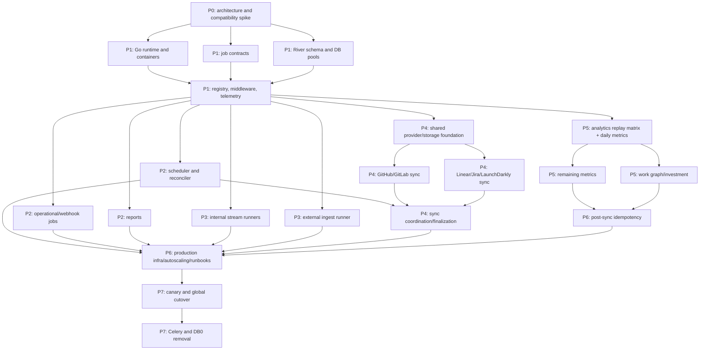

# Go Worker Migration Implementation Plan

**Status:** Proposed  
**Parent epic:** CHAOS-3033  
**Linear project:** Go Worker Runtime Migration  
**Last updated:** 2026-07-20  
**PRD:** [Go Worker Migration PRD](../product/go-worker-migration-prd.md)  
**TRD:** [Go Worker Runtime TRD](../architecture/go-worker-runtime-trd.md)

## 1. Delivery strategy

Migrate by workload family behind explicit routing flags. Do not run two write-capable implementations of the same job kind at the same time unless the underlying side effect is proven deduplicated.

The sequence is intentionally:

1. validate the runtime, pooler, cross-language, and licensing assumptions;
2. build the shared Go foundation and contracts;
3. migrate low-risk bounded jobs and scheduler/reconciler infrastructure;
4. remove long-lived stream consumers from Celery;
5. port provider and sync execution;
6. port analytics and LLM-heavy work after replay classification;
7. complete post-sync idempotency;
8. cut over all producers, observe stable releases, and remove Celery.

This sequencing creates useful production value before the largest provider and analytics ports, while keeping every cutover reversible.

## 2. Program dependency graph



## 3. Program-wide rules

### 3.1 Branch and review discipline

- Each child issue ships in a focused branch and pull request.
- Database changes are additive until final decommission.
- Any PR that changes a job contract updates schemas, fixtures, registry, Python/Go compatibility tests, and operator documentation.
- Any PR that changes provider or analytics behavior includes parity evidence.
- Any PR that changes deployment profiles renders and tests every supported stack.
- No migration PR removes the current rollback path unless its issue explicitly owns decommission.

### 3.2 Required artifacts per migrated job family

Each family must add:

- job kind/version and JSON schema;
- Go and transitional Python types;
- registry entry;
- queue/profile and resource policy;
- timeout/retry/error classification;
- idempotency and side-effect matrix;
- unit and integration tests;
- shadow/canary comparison;
- dashboards and alerts;
- runbook and rollback steps;
- removal ticket for the old Celery path.

### 3.3 Promotion states

```text
inventory -> contract_frozen -> go_implemented -> shadow
-> canary -> go_default -> celery_fallback_only -> celery_removed
```

Promotion state is tracked in the registry or a generated migration manifest. CI rejects a state that lacks its required evidence.

## 4. Phase 0 — architecture and compatibility lock

### CHAOS-3034 — Validate River, PgBouncer, Python enqueue, and licensing

**Purpose:** remove the assumptions that could invalidate the architecture.

**Recorded decision:** [CHAOS-3034 River compatibility ADR](../decisions/chaos-3034-river-compatibility.md)  
**Evidence:** [versioned Go worker migration evidence](../architecture/evidence/go-worker-migration/README.md)

#### Completed

- Recorded candidate pins for Go 1.25.9, River/`riverpgxv5` 0.40.0,
  River N-1 0.39.0, pgx 5.10.0 (5.9.2 at N-1), ClickHouse Go 2.47.0, `valkey-go`
  1.0.76, OTel Go 1.44.0, `testcontainers-go` 0.43.0, and the pinned
  PostgreSQL/PgBouncer test images.
- Verified `riverqueue` 0.7.0 with SQLAlchemy 2.0.49 and `asyncpg` 0.31.0
  on Python 3.13.14. Direct PostgreSQL and PgBouncer transaction mode both
  commit exactly one standard River job, preserve queue/priority/attempts/
  schedule policy, and create no job on rollback. The PgBouncer path uses
  `NullPool`, disabled statement caches, and unique prepared-statement names.
- Rejected `riverqueue` as a production dependency: unique insertion fails on
  the River 0.40.0 schema because its `ON CONFLICT (kind, unique_key)` target
  was removed by River migration 006.
- Selected the language-neutral `worker_job_outbox` plus Go relay as the
  Python-to-Go transactional bridge. Python must not write River tables
  directly.
- Recorded River MPL-2.0 distribution obligations and the public clean-room
  ACR boundary; no private code is copied or imported.
- Ran the checked-in Go 1.25.9 harness with 20 samples per mode. Direct
  PostgreSQL passed execution, retry, scheduled state, running cancellation,
  connection, and load gates. PollOnly passed execution, retry, scheduled
  state, connection, and load gates at a 250 ms interval.
- Proved the River 0.39 schema-6 to River 0.40 schema-7 rolling window, Python
  and Go contract interoperability, and real `SIGKILL` rescue to attempt 2 in
  both connection profiles.
- Recorded a GO for River 0.40.0 with mandatory direct PostgreSQL queue
  control. Session mode remains unverified until it passes the same matrix.
  Rejected transaction-mode PgBouncer PollOnly as the sole production path:
  neither cross-client nor same-client cancellation reached a running worker.

#### Remaining production evidence

- Populate the checked-in Celery baseline capture from real production data.

The generic outbox claim/insert/mark crash-window matrix is a Phase 1
foundation acceptance item because Phase 1 owns the relay implementation. It
must pass before foundation closes, but it does not make starting Phase 1
circular.

#### Acceptance and sequencing

- The checked-in compatibility matrix is the Phase 0 gate record. Its PollOnly
  running-cancellation failure is an architecture boundary, not an unmeasured
  row.
- Phase 1 foundation may proceed only with direct PostgreSQL queue control as a
  hard deployment prerequisite, a session-mode endpoint that separately passes
  the same matrix, or after a separately approved cancellation plane passes
  equivalent tests. Missing production Celery baseline values do not
  independently block foundation work.
- Shadow-to-canary promotion and every production canary remain blocked until
  the real Celery baseline and parity thresholds are recorded and reviewed.
- Any failed compatibility row that can require a different broker reopens the
  architecture decision before implementation proceeds.

## 5. Phase 1 — Go platform foundation

### CHAOS-3035 — Establish Go module, runtime shell, and verified containers

#### Work

- Add Go module and command shells.
- Implement ACR-inspired config validation, `_FILE` secret sources, safe startup attributes, `slog`, signal contexts, ordered shutdown, health/readiness, and version metadata.
- Add pgx, ClickHouse, and Valkey connection factories with bounded pools.
- Add `Makefile`/CI targets: format, vet, test, race, contract test, build.
- Add multi-stage non-root container targets, SBOM, scan, pin, and reproducibility checks.
- Add testcontainers test harness.
- Update repository platform contract to recognize Go workers without changing Python API ownership.

#### Acceptance

- `make verify` equivalent passes.
- `go test -race ./...` passes.
- Each binary starts, reports version, exposes health/readiness, and shuts down in order.
- Secrets and DSNs never appear in safe config or startup logs.
- Container smoke tests pass as non-root.

### CHAOS-3036 — Define versioned job contracts and cross-language gates

#### Work

- Define common envelope and schema conventions.
- Add `contracts/jobs/v1`.
- Implement Go contract types and Python dataclasses/protocol adapters.
- Add golden fixtures for every initial pilot kind.
- Implement `worker-contractcheck`.
- Add N/N-1 support checks and rollout capability reporting.
- Define registry schema and migration-state schema.
- Add breaking-change detection.

#### Acceptance

- Python and Go cross-decode every fixture.
- Unknown versions fail safely.
- CI fails on a breaking in-place contract edit.
- Contract artifacts contain no credentials or raw payloads.
- A rolling deployment can prove all live profiles support a producer version before routing.

### CHAOS-3037 — Add River migrations, dual PostgreSQL pools, and retention

#### Work

- Add pinned River migrations to the one-shot migration path.
- Add the proposed `WORKER_DATABASE_URI` queue-control DSN while retaining `POSTGRES_URI` as the canonical domain DSN and preserving documented compatibility aliases.
- Update configuration examples and `docs/ops/database-connection-pooling.md` in the same change that introduces the new variable.
- Add queue-control and domain database roles/DSNs.
- Implement mandatory direct PostgreSQL queue-control connectivity and fail
  readiness when only the transaction-mode domain pool is configured. A
  session-mode endpoint may replace direct connectivity only after the same
  matrix passes.
- Configure River job retention and maintenance.
- Add database growth, index, vacuum, backup, and restore tests.
- Add migration prefix/suffix compatibility checks modeled after ACR.
- Add rendered connection-budget validation across deployment profiles.

#### Acceptance

- Long-running processes do not auto-migrate.
- Queue work survives process and broker-equivalent outages.
- A PgBouncer-only PollOnly deployment fails readiness with an actionable
  queue-control configuration error.
- Production default direct PostgreSQL pool is least-privilege and bounded; a
  session-mode alternative requires equivalent evidence first.
- Restore test preserves runnable and terminal job state.
- Maximum configured connections stay within documented budgets.

### CHAOS-3038 — Build registry, middleware, telemetry, and operator controls

#### Work

- Implement typed River worker adapter.
- Implement job registry and startup completeness validation.
- Add middleware for recovery, contract validation, redaction, correlation, deadline, tracing, metrics, tenant scope, budgets, idempotency, and error classification.
- Add safe CLI/internal endpoints for queue/job/stream inspection, pause/resume, eligible retry/cancel, and drain.
- Audit operator actions.
- Add dashboards and alerts for queue age/depth, running jobs, attempts, saturation, domain mismatches, stream lag, and database pools.
- Add registry-to-deployment queue coverage generation/tests.

#### Acceptance

- An unknown or incompletely defined kind prevents readiness.
- Operator output never includes encoded args.
- Every control action is authorized and audited.
- Telemetry remains available if any one workload profile is saturated.
- Registry and manifests cannot drift in CI.
- Panic, cancellation, timeout, retry, discard, and terminal domain paths have integration tests.

## 6. Phase 2 — first bounded jobs and orchestration infrastructure

Current boundary: the route-safe generic `worker_job_outbox` slice is in
place, the scheduler track is complete in code, and the remaining active work
is the typed `syncdispatchruntime` wiring. Python now
gates enqueue on a valid executable migration state/route pair, the Go relay
leaves known Celery rows untouched while still terminalizing unknown rows, and
the reconciler command composes the bounded loop with readiness and metrics.
Startup is fail-closed until that loop succeeds once, and later persistence
failures close readiness. Checked-in deployment profiles remain
`coexistence_disabled` with zero replicas; both registered kinds still route to
Celery, no producer calls the bridge, and no Go handler is compiled. The
mutation-capable scheduler and sync-domain transport work in CHAOS-3039
therefore remains unported and no tandem parity is claimed.

The first sync-domain transport dependency is now frozen independently of
runtime activation. `contracts/sync-dispatch/v1/transport-routes.json`
enumerates the four existing wakeup kinds and preserves their current delivery
semantics. Strict Python and Go loaders consume the same artifact. The dormant
Go reconciler also runs a bounded, read-only observer over the first due-row
window in Python claim order and closes readiness on contract or database
drift. Celery records the same versioned, redacted digest immediately before
claiming; Go records its initial observation and then at most one per minute.
It does not lock, claim, update, or publish, and capture failure does not alter
Celery behavior. Every checked-in route and rollback route remains Celery, so
the Celery reconciler is still the only mutation owner. The observer supplies
an autonomous comparison surface, but observations with different cutoffs are
operational evidence rather than tandem proof. This slice does not authorize
promotion.

Evidence contract for the next slice:

- Use one immutable UTC cutoff and one identical limit for both runtimes,
  supplied before either claimer runs.
- Capture both runtimes against the same quiescent or otherwise correlated
  dataset/session.
- Compare only the redacted parity record: cutoff, limit, predicate version,
  digest version, candidate digest, sampled/truncated state, and per-kind
  aggregate counts.
- Treat raw IDs, payloads, tenant data, claim tokens, and source URLs as
  out-of-scope for comparison.
- Keep `deploy/go-workers/profiles.json` dormant (`coexistence_disabled`,
  zero replicas) until a separate promotion review closes the observability
  gaps recorded in the baseline capture.

The same-snapshot comparison is now implemented by
`cmd/dev-health-sync-parity`. It holds one exported read-only
`REPEATABLE READ` transaction across the Python and Go observers, and the
sanitized production-equivalent local result is recorded in
`v2-sync-dispatch-parity`. That match closes the observer-comparison slice
only; it is not mutation, handler, scheduler, or canary evidence. The
`sync-parity` Docker target packages the Go binary, Python observer and
installed runtime, plus the checked-in sync-dispatch contract for repeatable
container execution.

The first mutation-safety prerequisite is also implemented without activating
River. Migration `0049` seeds a four-row database route fence with Celery
ownership and generation 1. Python claims bind the active route generation and
retain their route-plus-outbox locking through publish and mark. Separately,
the dormant Go kernel commits a bounded River claim set first, then performs
fresh per-claim River inserts and terminal marks in atomic transactions.
Go mark/failure writes fail closed after any route change. The
authenticated `dev-health-workerctl routes` surface can inspect, pause, drain,
and resume one fixed route at a time with durable audit intent and monotonic
generation changes. Route mutation follows Python's route-row-first lock order,
then holds a table barrier across the post-terminal/pre-commit window and
rechecks route state and live claims. The shipped command
registers no River cutover capability, every checked-in route remains Celery,
and the Go reconciler closes readiness while a route is paused or divergent,
so these controls do not activate River.

The dormant `internal/scheduler/sync` package retains its read-only
schedule-evaluation foundation. It reads at most 101 active configuration/job
rows to produce a 100-row, deterministically ordered snapshot, then evaluates
occurrence, manual-only, active-job, `is_running`-staleness, and `next_run_at`
gates without a transaction or write. Its versioned digest retains candidate
identities only in memory. The evaluator
implements a versioned deterministic five-field Croniter subset, including the
ordinary list/range/step/name forms and the explicitly tested timezone and DST
behavior. A valid Croniter form outside that grammar is reported as
unsupported and can never become timing-eligible; this includes random `R`,
unported mixed special-day forms, and optional seconds/year fields. Results
and their digest are labeled `schedule_and_marker_only`; unsupported or
invalid cron is a fail-closed activation boundary that rolls the locked window
back with `ErrSchedulerFallbackRequired`, performs no coordinator or marker
writes, and never opens readiness. Celery remains the sole owner until policy
parity is complete, so the scheduler can keep older candidates from starving
while the checked-in Go path stays non-authoritative.

A separate dormant transaction kernel now locks an existing-marker due window,
calls an injected coordinator through the same PostgreSQL transaction, and
advances the marker only after that durable handoff succeeds. A second dormant
kernel can claim River-routed sync outbox rows and invoke transaction-local
at-least-once seams, including `post_sync`. The Go reconciler image packages
the sync-dispatch contract needed to construct that kernel. Nothing imports
either kernel from a command or deployment profile, and every checked-in and
persisted route remains Celery, so these additions are failure-tested
boundaries rather than activation.

Migration `0050` and the active Python scheduler now provide the first Phase 4
planning boundary. A stable, language-neutral occurrence row links one
configuration/cron timestamp to its authoritative `JobRun` and `SyncRun`.
`dispatch_scheduled_syncs` locks configuration then marker state, revalidates
organization and entitlement policy, and commits the occurrence, planner graph,
reference-discovery outbox, and `next_run_at` in one transaction. A planner or
marker failure rolls back the whole graph; replay of the same occurrence reuses
the typed plan links. Missing-marker and coalesced catch-up behavior remain
Celery-owned and are covered by PostgreSQL replica tests.

The dormant Go occurrence coordinator can insert or verify the same identity
through the scheduler transaction. The active Python planner completes an
existing pending row when its own Celery dispatch reaches the same occurrence,
so concurrent/retried cross-language handoff is idempotent. Migration `0051`
adds a durable pending/retry/completed/quarantined reconciliation lifecycle,
and a bounded Python consumer can lock configuration, marker, and occurrence
state in the canonical order before materializing the authoritative plan. It
validates the versioned identity, applies persisted retry backoff to transient
planner failures, and quarantines malformed or exhausted occurrences so a
poisoned prefix cannot strand later work. Both its Beat entry and call-time
execution gate default off. The scheduler command retains a production factory
that can construct the Go coordinator and mutation repository, but both
private source-review activation gates remain checked-in false; the consumer
is not enabled by any checked-in profile. This is still not authorization to
advance production markers. The public scheduler repository
constructor embeds an opaque Celery/`coexistence_disabled` ownership policy,
and `HandoffDue` rejects mutation before opening a transaction. Only
package-private test and future activation composition can construct Go
mutation authority. Scheduler activation needs a reviewed source change,
unsupported-cron policy parity, remaining
coordinator policy parity, and an explicit review that enables the consumer
before Go may own a marker. The dormant loop currently rolls back a whole
locked window and keeps readiness closed if any cron requires Celery fallback.

The Go reconciler command still selects an explicit no-begin shadow adapter.
Its retained source-gated mutation factory composes lease repair,
materialization, transport delivery, and post-mutation observation, but the
private activation gate remains checked-in false. The materializer
can reconstruct bounded dispatch, finalize, discovery, and missing post-sync
wakeups in one domain transaction. It never reads routes, claims rows, or
publishes work; existing pending rows, including guarded at-least-once
post-sync rows, retain their current semantics. The composed repair step preserves the
current eligible Linear-backfill expired-lease transition, including bounded
retry exhaustion and provider/org/cost-class serialization. A persisted
publish-failure recorder can rearm an already committed River claim with the
same bounded backoff as Python. The least-privilege queue-control role has
also been exercised through the real River `InsertTx` API in the same
transaction as the outbox terminal mark. Reconciler activation still needs the
command composition that resolves authoritative domain references and binds
the committed-claim kernel to concrete River publishers and handlers. The
typed `syncdispatchruntime` package is
intentionally all-or-nothing: its claim projection drops the claim token, its
River args validate the exact contract/version/UUID/generation tuple, its
publisher only calls `InsertTx` through the caller's transaction, and its
`GenerationTracker` exposes a publisher-owned local generation-drain API for
`post_sync`. The shipped command registers no River cutover capability, every
checked-in route remains Celery, and a transport-changing `post_sync` resume
still requires a separately proven cross-process quiescer/controller and
external-handoff binding.

An opt-in live PostgreSQL test now proves the Python producer's outer rollback
and dedupe/savepoint path. Before any generic kind is promoted from Celery,
retain that proof in promotion validation, record evidence for the relay
batch-size/claim-lease defaults, and exercise pending, claimed, delivered,
running, and retryable work through the documented stop/drain/restore/restart
rollback sequence. The generic bridge intentionally does not republish
deferred rows to Celery; selectable Celery/River transport for the existing
sync-domain outbox remains part of the work below.

### CHAOS-3039 — Implement Go scheduler and sync reconciler transport

#### Work

- Port schedule evaluation with advisory lock or `FOR UPDATE SKIP LOCKED`.
- Preserve occurrence, `next_run_at`, organization state, entitlement, and catch-up semantics.
- Port the sync reconciler loops:
  - expired lease handling;
  - materialization of missing dispatch/finalize/post-sync rows;
	- outbox claiming;
	- River insertion;
	- guarded insert-and-terminal-mark semantics for every replay-safe kind.
- Add no-op/shadow transport mode.
- Keep Celery transport selectable until sync cutover.
- Expose schedule/reconciler metrics and readiness.

Foundation status: the scheduler transaction handoff and reconciler transport
kernels exist with unit/failure-injection coverage, the reconciler image
packages its sync-dispatch contract, and a containerized parity target exists.
The Python scheduler now persists idempotent occurrences and its complete plan
atomically. A durable, default-off Python consumer can finish Go-authored
occurrences without retrying poison rows forever. The reconciler command
selects the shadow adapter by default; its retained source-gated mutation
factory composes expired-lease repair, outbox materialization, delivery, and
observation but remains unreachable while the private activation gate is
false. Persisted transport-failure
backoff and the least-privilege River transaction boundary are implemented as
dormant primitives, but the kernel now claims first and then performs fresh
per-claim insert/mark transactions, including `post_sync`. The scheduler has an opaque default-Celery
ownership fence, the remaining Python policy-parity blockers are organization
existence, entitlement, occurrence claiming, catch-up, and unsupported-cron
policy; an unsupported or invalid cron currently rolls back the whole Go
window and keeps readiness closed. The typed `syncdispatchruntime` generation
tracker is only a publisher-owned local drain API today. Audited route pause/drain/resume
controls are implemented with an empty activation-capability registry. Every
route remains Celery-only; scheduler coordinator policy parity,
concrete River delivery capabilities, and the cross-process `post_sync`
quiescer/controller plus external-handoff binding remain open.

#### Acceptance

- Two replicas cannot duplicate a schedule occurrence.
- Every documented outbox crash window passes failure-injection tests.
- Existing eligible Linear expired-lease behavior is unchanged.
- Post-sync is guarded at-least-once after the CHAOS-2596 reader remediation.
- Transport can route per outbox kind to Celery or River for rollback.
- Scheduler contains no heavy business work.

### CHAOS-3040 — Migrate operational, webhook, billing, heartbeat, and retention jobs

#### Work

- Inventory side effects and idempotency for:
  - generic webhook processing;
  - `process_pagerduty_webhook_event`, including its Valkey stream read/delete, retry, and dead-letter behavior;
  - billing alert email;
  - heartbeat;
  - retention cleanup;
  - team autoimport if independent of sync cutover;
  - low-volume admin jobs.
- Introduce canonical domain run/idempotency rows where missing.
- Implement Go handlers and provider/email adapters.
- Shadow using recorded inputs or compare-only sinks.
- Canary per job kind and organization.
- Replace `monitor_queue_depths` and the queue-based health task with native telemetry/endpoints; keep the coexistence-only `monitoring` queue covered until both replacements pass parity.

#### Acceptance

- External side effects use stable idempotency keys or are explicitly non-retryable.
- Webhook duplicate-delivery tests pass.
- PagerDuty crash-window tests preserve the source entry until success or terminal dead-lettering, then delete it exactly once.
- Health no longer depends on a queue round trip.
- Queue telemetry is native and low-cardinality.
- Each kind has a one-command rollback route.

### CHAOS-3041 — Migrate report scheduling and execution

#### Work

- Freeze report job contracts.
- Make `ReportRun` creation and job insertion atomic.
- Enforce schedule occurrence uniqueness.
- Port report query, rendering, storage, and notification dependencies needed by workers.
- Compare rendered report artifacts and metadata.
- Add cancellation and retry policy based on `ReportRun` state.

#### Acceptance

- A schedule occurrence creates one `ReportRun`.
- Retry cannot create a duplicate report or notification.
- Golden report fixtures match allowed formatting tolerance.
- Failed/canceled jobs produce coherent `ReportRun` status.
- On-demand and scheduled reports can be independently rolled back.

## 7. Phase 3 — dedicated stream runners

### CHAOS-3042 — Replace internal ingest and product telemetry Celery tasks

#### Work

- Port stream schemas and validation.
- Implement lifecycle-owned `XREADGROUP` loops.
- Reuse ClickHouse/PostgreSQL sinks per process.
- Ack only after durable writes.
- Define pending-entry reclaim, poison-message, and quarantine policy.
- Add lag, pending, oldest-pending, throughput, reclaim, and shutdown metrics.
- Remove Beat entries and `ingest` Celery queue routing after canary.

#### Acceptance

- No periodic queue message is needed to keep consumers alive.
- Process restart leaves uncommitted messages pending and reprocessable.
- Soak test shows no duplicate scheduled-consumer backlog.
- Sink connections are reused.
- Stream lag stays within the established baseline/SLO under canary.
- Celery rollback can be re-enabled until the stability gate.

### CHAOS-3043 — Migrate external ingest to a singleton Go stream runner

#### Work

- Port schema registry, validation, authorization linkage, dedup, and sinks.
- Preserve one replica, one consumer identity, and concurrency 1.
- Port `flush_external_ingest_recompute` as a bounded control job, preserving the SETNX guard, atomic GETDEL consumption, coalesced scope, and persisted batch outcomes.
- Replace `external_ingest_stream_health` with equivalent stream-runner lag, depth, and alert telemetry.
- Test pending-entry behavior across crash and rollout.
- Add deployment validation that rejects multiple replicas.
- Document a separate future scaling design rather than changing reclaim semantics here.

#### Acceptance

- Duplicate deployment fails configuration/readiness.
- Crash-before-ack and crash-after-write tests prove no loss and bounded duplication.
- Customer-facing ingest status remains coherent.
- Quarantine/error behavior matches the current contract.
- External ingest backlog cannot starve internal ingest or bounded jobs.
- Recompute debounce crash-window tests prove a newer pending scope cannot be deleted by an older flush.
- No external-ingest health Beat task remains after replacement telemetry passes parity.

## 8. Phase 4 — provider and sync migration

### CHAOS-3044 — Port shared provider, credential, rate-budget, and sink foundations

#### Work

- Define provider interfaces matching current ownership boundaries.
- Port credential resolver types and explicit client construction.
- Port HTTP transport, pagination helpers, error taxonomy, Retry-After handling, distributed rate-limit gate, and budget reservations.
- Port canonical normalized models and sink interfaces.
- Implement PostgreSQL/ClickHouse stores required by sync units.
- Build provider fixture harness from current Python tests and recorded sanitized responses.
- Add cross-language normalized-output comparison.

#### Acceptance

- No provider credential is read from or written to process-global environment.
- 401/403/404/409/429/5xx and pagination fixtures match current classifications.
- Distributed backoff is shared with remaining Python workers during coexistence.
- Normalized model and sink fixtures match.
- Connection and retry budgets are bounded and observable.

### CHAOS-3045 — Migrate GitHub and GitLab sync unit execution

#### Work

- Port reference and work-item dataset capabilities.
- Preserve GitHub App/token and GitLab credential behavior.
- Port pagination, incremental windows, backfills, discovery, and cost classification.
- Implement lease heartbeats and cancellation.
- Shadow provider reads and compare normalized/sink-ready batches.
- Canary by organization, dataset, and cost class.
- Treat ClickHouse insert-token deduplication as a finite engine window, not
  an exactly-once ledger. Persist each deterministic block transition
  (`pending` → `writing` → `committed`) under the leased sync unit. A recovered
  `writing` block is ambiguous and must pass durable readback reconciliation;
  it is never automatically replayed based only on the ClickHouse window.

#### Acceptance

- Fixture and live canary parity passes for every supported dataset.
- Provider call counts and rate-limit behavior do not regress beyond approved tolerance.
- Kill tests prove claim/lease recovery.
- No duplicate ClickHouse generation or provider side effect occurs.
- Recovery outside the ClickHouse deduplication window refuses ambiguous block
  replay and records a reconciliation-required outcome.
- GitHub and GitLab queues can be independently rolled back.

### CHAOS-3046 — Migrate Linear, Jira, and LaunchDarkly sync unit execution

#### Work

- Port provider-specific auth, pagination, schema, windowing, and normalization.
- Preserve Linear backfill retry-safe surface matrix.
- Preserve Jira/Atlassian client behavior and rate-limit classification.
- Preserve LaunchDarkly capability/cost classification.
- Shadow and canary per provider/dataset.

#### Acceptance

- All provider fixture matrices pass.
- Linear expired-lease retry eligibility is unchanged.
- Jira pagination and rate-limit behavior match.
- LaunchDarkly writes and cursors match.
- Each provider has an independent routing flag and rollback.

### CHAOS-3047 — Migrate sync dispatch, finalization, discovery, and team autoimport

#### Work

- Implement `sync.dispatch_run`, `sync.finalize_run`, reference discovery, `sync_team_drift`, and post-sync team autoimport.
- Implement `sync.plan_scheduled_config` with a unique occurrence identity and
  transactional creation of the authoritative scheduled `JobRun`, `SyncRun`,
  units, and dispatch outbox.
- Generate provider/cost queue routing from the registry.
- Preserve exact cross-run concurrency and budget behavior.
- Replace Celery group/chord assumptions with explicit domain counts and finalization outbox rows.
- Verify `JobRun`, `SyncRun`, `SyncRunUnit`, and backfill observer-state propagation.
- Route all sync outbox kinds to River except gated post-sync changes.

#### Acceptance

- Duplicate coordinator jobs do not duplicate units or finalization.
- Capped units remain planned/retrying and are redispatched.
- Queue coverage tests prove every provider/cost route has a consumer.
- Product/admin status matches domain truth under success, partial failure, cancel, and worker loss.
- No Celery chord/result backend is required by the canonical sync path.
- Team-drift discovery preserves `{jira, gitlab, github, linear}` coverage, fail-closed credential handling, and ClickHouse projection authority.

## 9. Phase 5 — analytics, graph, and LLM workloads

### CHAOS-3048 — Establish analytics replay matrix and migrate daily metrics

#### Executable wiring (still Celery-routed)

The heavy worker now compiles the three daily adapters, their fixed
`/internal/worker/daily-metrics/v1/execute` compatibility client, PostgreSQL
stores, and generic outbox publisher. The checked-in route remains `celery`,
so the River component is not constructed and no queue is fetched until all
three daily route controls move together to an executable route.

Partition completion serializes on the durable run row. The last partition
success and the deduplicated `metrics.daily_finalize` outbox row commit in the
same PostgreSQL transaction. A failure after the outbox insert rolls back both
changes; the partition lease is then reclaimed and the same finalizer identity
is published exactly once. The live PostgreSQL test exercises this kill
window. This closes finalizer liveness but does not establish numerical parity
or authorize promotion.

#### Work

- Inventory every ClickHouse table and reader touched by daily metrics.
- Classify generation and replay semantics.
- Add stable partition/run/generation identities.
- Port dispatcher, partition workers, and finalizer.
- Port numerical transformations and SQL.
- Compare seeded outputs and production-like shadow generations.
- Prevent duplicate writes or readers from raw-aggregating generations.

#### Acceptance

- Replay matrix is reviewed by data owners.
- Every partition can be retried safely or is explicitly single-attempt with a repair path.
- Golden metrics match exact/tolerance rules.
- Finalization is once-only.
- A kill at each write boundary has a documented outcome.

### CHAOS-3049 — Migrate remaining metrics, backfills, recommendations, and membership jobs

#### Current compatibility foundation (not promotion)

The checked-in compatibility bridge is a dormant, fail-closed foundation. Its
HTTP requests carry only durable run/partition identifiers and a fixed
operation; PostgreSQL supplies the organization, generation, scope, claim, and
lease. Celery remains the production owner. No remaining-metrics family is
promoted or independently rollback-capable merely because its reviewed Python
callable appears in the bridge allowlist.

Each output identity has one durable execution row. A new row starts at attempt
one. A completed row returns `skipped`; an `executing` or `ambiguous` row never
silently re-enters compute. Operators first use the authenticated readback
endpoint and inspect the output named by the generation/scope digest. The
repair endpoint requires a distinct, operator-only
`WORKER_METRIC_REPAIR_TOKEN`; the compute/readback bridge token cannot
authorize repair, and the repair token cannot execute compute. Both secrets
are bounded, compared in constant time, and fail closed when missing,
oversized, or configured to the same value. Configure the repair secret
wherever operator repair is enabled. Rotate it independently with a coordinated
API/client switch; the old value stops authorizing repairs as soon as the API
changes. Operators may then submit one exact-state repair:

- `confirm_succeeded` records bounded reviewed output evidence and makes the
  next worker call return `skipped`;
- `retry_safe` records why no effect exists and moves the row to
  `retry_authorized`; only the next matching durable claim may consume that
  authorization and increment the execution attempt;
- an `executing` or `ambiguous` attempt cannot be repaired while its original
  claim and lease remain active.

Repairs require the expected state and attempt count, use a deterministic
repair identity, and persist an immutable repair audit row. This is the bounded
repair path required for a single-attempt effect boundary; it is not a generic
task/command executor.

The family inventory's `max_concurrency`, ClickHouse read budget, and
ClickHouse write budget are still declarative evidence at this foundation
stage. Promotion remains blocked until worker registration enforces those
limits, per-family shadow/parity evidence is reviewed, each route has an
audited Celery/River transition and rollback, and the four `inventory_only`
families have independent compute/write parity rather than broad shared-job
coverage.

#### Work

- Port complexity, DORA, release impact, capacity, recommendations, extra metrics, membership backfill, and team metrics.
- Preserve known historical-scan limitations until separately approved.
- Add bounded partitioning and checkpoints for large backfills.
- Verify numerical and query parity.
- Add resource/cost profiles and ClickHouse concurrency caps.

#### Acceptance

- Each family has replay classification and output evidence.
- Backfills resume without restarting completed partitions.
- Historical limitations are documented rather than silently changed.
- Heavy workloads do not regress latency/sync profiles.
- ClickHouse connection and write budgets remain within limits.

### CHAOS-3050 — Migrate work graph and investment/LLM jobs

#### Work

- Port work graph edge construction and persistence.
- Port the direct investment task and the complete partitioned path: dispatcher, chunk worker, and finalizer.
- Implement Go LLM provider adapters or an approved narrow temporary service boundary.
- Preserve prompts, structured outputs, taxonomy, quality, cost, and trace metadata.
- Add deterministic fixture/evaluation corpus.
- Add concurrency and spend controls.

#### Acceptance

- Work graph edges and provenance match.
- Persisted investment distributions remain within approved deterministic/evaluation criteria.
- LLM model/config, token/cost, retry, and failure metadata remain observable.
- No UX-time recategorization is introduced.
- Temporary Python boundary, if used, is explicit and not a generic task executor.
- Registry and routing tests prove all four current investment entrypoints have an explicit target or are retired at cutover.

## 10. Phase 6 — post-sync, infrastructure, and production readiness

### CHAOS-3051 — Complete post-sync idempotency and enable durable Go fanout

**Blocked by:** CHAOS-2596.

#### Work

- Complete raw-reader and write-path dedup fixes from CHAOS-2596.
- Add retry/duplicate-generation tests for every post-sync consumer.
- Change post-sync outbox relay from mark-before-insert to durable guarded at-least-once.
- Port all post-sync fanout kinds to River.
- Add once-only or generation ledgers where needed.

#### Acceptance

- CHAOS-2596 is Done with production-like evidence.
- Duplicate post-sync dispatch cannot double-count any supported reader.
- Publish/insert failure re-drives safely.
- Existing data is backfilled or reader-compatible without destructive rewrite.
- Delivery-semantics documentation is updated.

### CHAOS-3052 — Update all deployment stacks, autoscaling, observability, and runbooks

#### Work

- Update root Compose, production Compose, Kubernetes, Helm, Docker Swarm, env examples, secrets, CI, and config tests.
- Add all Go profiles and dual-runtime coexistence values.
- Add queue-control DSN/role and connection budgets.
- Replace Redis queue-depth HPA signals with River job age/depth/saturation and stream lag.
- Add dashboards, alerts, safe inspection, pause, retry, cancel, drain, schema recovery, and rollback runbooks.
- Add rolling deploy tests with long sync work.
- Validate non-root/read-only container posture.

#### Acceptance

- Every supported stack renders and starts in coexistence and Go-only modes.
- Registry-generated queue coverage passes.
- HPA cannot exceed provider/DB/ClickHouse budgets.
- Telemetry survives one profile outage.
- A rollout with active long-running jobs completes without lost work.
- Runbooks are executable and payload-redacted.

## 11. Phase 7 — cutover and decommission

### CHAOS-3053 — Run canaries, cut over producers, and complete stability gates

#### Work

- Define canary organizations and job-family order.
- Capture before/after SLOs and correctness evidence.
- Promote routing flags family by family.
- Exercise rollback in staging and at least once in a production-like environment.
- Observe two stable releases with Celery as fallback only and no rollback use.
- Verify no Celery-only jobs remain queued/scheduled/active.
- Freeze new Celery task development.

#### Acceptance

- All production kinds are `go_default`.
- Parity and SLO evidence is attached by family.
- No unsupported contract versions or orphan queues remain.
- Rollback procedure is proven.
- Two stable releases complete without Celery fallback use.
- Decommission checklist is approved.

### CHAOS-3054 — Remove Celery, Beat, Python worker code, and Valkey DB0 contract

#### Work

- Remove Celery dependencies, task decorators, app/config, signals, runner/inspect, async bridge, Beat schedule, result-backend use, and Celery-specific tests.
- Remove Celery worker/Beat services from every stack.
- Remove Valkey database 0 broker/result config and operational cleanup paths.
- Remove obsolete routing flags and fallback adapters.
- Archive or rewrite worker docs and architecture diagrams.
- Update `AGENTS.md`, platform contract, deployment guide, observability docs, and security threat model.
- Verify no import, configuration, key pattern, or documentation reference remains except migration history.

#### Acceptance

- Repository search and dependency lock contain no production Celery import.
- No deployed service connects to Valkey database 0 for worker purposes.
- Go-only worker integration and disaster-recovery tests pass.
- Documentation describes one target runtime.
- Database and Valkey cleanup is backed up, audited, and reversible at the infrastructure level.
- CHAOS-3033 exit criteria are met.

## 12. Detailed task-family migration matrix

| Current family | Existing source area | Target package | First safe validation | Cutover dependency |
|---|---|---|---|---|
| Scheduled sync dispatch | `src/dev_health_ops/workers/sync_scheduler.py` | `internal/scheduler/sync` | duplicate concurrent tick test | P1 foundation |
| Sync outbox reconciler | `src/dev_health_ops/workers/sync_reconciler.py` | `internal/reconciler/sync` | lost insert / expired claim tests | P1 database |
| Sync dispatch | `src/dev_health_ops/workers/sync_units.py` (`dispatch_sync_run`) | `internal/jobs/sync/dispatch` | duplicate coordinator fixture | reconciler |
| Sync unit | `src/dev_health_ops/workers/sync_units.py` (`run_sync_unit`), providers | `internal/jobs/sync/unit` | provider fixture shadow | provider foundation |
| Sync finalizer | `src/dev_health_ops/workers/sync_units.py` (`finalize_sync_run`) | `internal/jobs/sync/finalize` | duplicate finalizer | sync units |
| Team drift | `src/dev_health_ops/workers/team_drift_sync.py` (`sync_team_drift`) | `internal/jobs/sync/teamdrift` | provider/auth/projection matrix | provider foundation |
| Post-sync | metrics/autoimport tasks | `internal/jobs/sync/postsync` | duplicate generation | CHAOS-2596 |
| Daily metrics | metrics jobs | `internal/jobs/metrics/daily` | seeded parity | replay matrix |
| Extra metrics | metrics jobs | `internal/jobs/metrics/extra` | seeded parity | replay matrix |
| Complexity | complexity job | `internal/jobs/metrics/complexity` | fixture parity | Go analyzer parity |
| DORA/release | DORA/release jobs | `internal/jobs/metrics/dora` | seeded parity | replay matrix |
| Capacity/recommendations | capacity/recommendation jobs | `internal/jobs/metrics/planning` | numeric/output parity | replay matrix |
| Work graph | work graph tasks | `internal/jobs/workgraph` | edge fixture parity | storage adapters |
| Investment direct/dispatch | `src/dev_health_ops/workers/work_graph_tasks.py` (`run_investment_materialize`, `dispatch_investment_materialize_partitioned`) | `internal/jobs/investment` | direct/partitioned routing fixtures | LLM adapter |
| Investment chunk | `src/dev_health_ops/workers/work_graph_tasks.py` (`run_investment_materialize_chunk`) | `internal/jobs/investment/chunk` | checkpoint + evaluation corpus | LLM adapter |
| Investment finalizer | `src/dev_health_ops/workers/work_graph_tasks.py` (`finalize_investment_materialize_partitioned`) | `internal/jobs/investment/finalize` | aggregate/follow-on fixture | investment chunks |
| Membership | membership tasks | `internal/jobs/membership` | partition resume | replay matrix |
| Reports | report tasks/scheduler | `internal/jobs/reports` | artifact parity | contracts |
| Webhooks | `src/dev_health_ops/workers/system_webhooks.py` (`process_webhook_event`) | `internal/jobs/webhooks` | duplicate event | idempotency row |
| PagerDuty webhooks | `src/dev_health_ops/workers/system_webhooks.py` (`process_pagerduty_webhook_event`) | `internal/jobs/webhooks/pagerduty` | stream retry/dead-letter fixture | stream + provider adapters |
| Billing email | billing task | `internal/jobs/notifications` | provider sandbox | idempotency key |
| Heartbeat | system task | `internal/jobs/system` | unique occurrence | scheduler |
| Retention | retention tasks | `internal/jobs/system/retention` | bounded delete fixture | scheduler |
| Ingest | ingest consumer task | `internal/streams/ingest` | crash/reclaim | stream runtime |
| Product telemetry | telemetry consumer task | `internal/streams/product` | crash/reclaim | stream runtime |
| External ingest | external consumer task | `internal/streams/external` | singleton crash/reclaim | stream runtime |
| External recompute flush | `src/dev_health_ops/workers/external_ingest_recompute.py` | `internal/jobs/externalingest/recompute` | debounce/crash-window fixture | external stream runtime |
| External stream health | `src/dev_health_ops/workers/system_ops.py` | `internal/streams/external` telemetry | lag/alert parity | external stream runtime |
| Queue monitor | `src/dev_health_ops/workers/queue_monitor.py` | `internal/platform/telemetry` | dashboard parity | runtime |
| Worker health | health task/inspect | `internal/platform/health` | dependency failure tests | runtime |

## 13. Infrastructure file checklist

The implementation must inspect and update at least:

```text
go.mod
go.sum
Makefile
pyproject.toml
docker/Dockerfile
compose.yml
deploy/docker-compose/compose.production.yml
deploy/kubernetes/
deploy/helm/dev-health/
deploy/docker-swarm/stack.yml
.github/workflows/
ci/local_validate.sh
src/dev_health_ops/workers/
src/dev_health_ops/db.py
src/dev_health_ops/providers/
src/dev_health_ops/metrics/
src/dev_health_ops/ingest/
src/dev_health_ops/external_ingest/
tests/test_compose_config.py
tests/deploy/
docs/ops/workers.md
docs/ops/deployment-guide.md
docs/ops/database-connection-pooling.md
docs/architecture/dispatch-outbox.md
docs/architecture/worker-scaling-readiness.md
AGENTS.md
docs/contributing/platform-contract.md
```

This is a minimum inventory, not an exhaustive change list.

## 14. Validation matrix

| Gate | Unit | Integration | Failure injection | Shadow/canary | Operator |
|---|---|---|---|---|---|
| Runtime | config/redaction | real dependencies | shutdown/panic | pilot jobs | health/drain |
| Contracts | schema/version | Python↔Go | malformed/unsupported | producer rollout | contract listing |
| Scheduler | occurrence math | two replicas | crash in transaction | compare dispatch | schedule status |
| Reconciler | claim logic | outbox/River | every crash window | mirror transport | retry/pause |
| Sync unit | error/budget | provider + stores | kill at lease/write | org/dataset canary | domain correlation |
| Metrics | calculations | CH/PG | duplicate generation | shadow generation | run state |
| Streams | parser/checkpoint | Valkey + stores | crash before/after ack | consumer canary | lag/pending |
| Infra | rendered values | stack smoke | rolling failure | profile canary | dashboards/runbooks |
| Decommission | dependency scan | Go-only stack | restore drill | stable releases | cleanup audit |

## 15. Rollback matrix

| Migration state | Rollback action | Data action |
|---|---|---|
| `go_implemented` | no producer change | none |
| `shadow` | disable shadow route | delete compare-only artifacts |
| `canary` | route canary orgs to Celery | reconcile domain rows; leave River rows |
| `go_default` | flip family route to Celery | stop/cancel Go jobs per policy; no schema downgrade |
| `celery_fallback_only` | re-enable selected fallback | incident-specific reconciliation |
| `celery_removed` | application rollback requires a prior release and infra restore decision | never drop additive queue schema during emergency rollback |

No rollback purges queues blindly. Every rollback begins by stopping new routing and inspecting authoritative domain rows.

## 16. Data and schema migration rules

- River migrations and worker-domain migrations are one-shot deploy jobs.
- Migrations are additive through P7 cutover.
- Queue rows are not product history; domain run rows remain.
- New idempotency/ledger columns are backfilled before route enablement.
- ClickHouse schema changes use current migration and compatibility rules.
- Reader changes precede writer retries when enabling replay.
- Destructive cleanup is a separate, audited post-stability action.

## 17. Observability launch checklist

Before each family enters canary:

- queue depth and oldest age dashboard exists;
- job duration/wait/attempt metrics exist;
- domain status mismatch alert exists;
- handler error categories are bounded;
- traces link enqueue to execution;
- provider budget and rate-limit metrics exist where applicable;
- stream lag/pending metrics exist where applicable;
- runbook links are in alert annotations;
- logs pass payload/secret scans.

## 18. Security launch checklist

- job schema contains no secrets;
- tenant ID matches domain row;
- credentials resolve only after claim;
- database roles are least privilege;
- operator controls require authorization and audit;
- secret-file permission tests pass;
- panic/error text is redacted;
- image runs non-root;
- dependency, image, and license scans pass;
- private ACR source is not present in public artifacts.

## 19. Program risks and owner decisions

| Decision | Required by | Default if not decided |
|---|---|---|
| River version/support window | Resolved in P0 | River 0.40.0 with N-1 0.39.0; rerun the matrix on any pin change |
| Python client vs generic outbox fallback | Resolved in P0 | use `worker_job_outbox`; no direct Python River writes |
| direct PostgreSQL or separately verified session-mode queue DB availability | P1 database | block worker readiness and P1 deployment; PollOnly is not the sole fallback |
| shared Go module extraction | after first two families | keep in ops |
| River UI deployment | P6 infra | do not deploy; use sanitized CLI/endpoints |
| temporary Python algorithm service | before affected P5 issue | keep task on Celery |
| external ingest horizontal scaling | separate future design | singleton |
| post-sync durable retry | CHAOS-3051 | guarded at-least-once relay |
| Celery removal approval | P7 stability gate | retain fallback |

## 20. Definition of done for the program

CHAOS-3033 can close only when:

- all registered production task kinds are Go-owned or are explicitly removed;
- scheduler and reconciler run in Go;
- all three stream consumers run as dedicated Go processes;
- all supported deployment stacks are Go-only for workers;
- River and domain state survive failure and restore drills;
- every family has parity, replay, canary, and rollback evidence;
- post-sync semantics are documented and safe;
- no Celery/Beat process, dependency, import, queue, result backend, or operational command remains;
- Valkey database 0 is not part of the worker platform contract;
- worker docs, platform contract, architecture, security, and runbooks are current;
- the public repository contains no unapproved private ACR code;
- product-visible job state and operator controls are coherent and payload-redacted.
