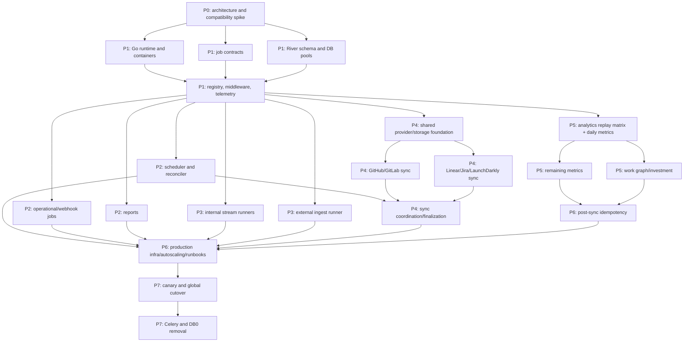

# Go Worker Migration Implementation Plan

**Status:** Proposed  
**Parent epic:** CHAOS-3033  
**Linear project:** Go Worker Runtime Migration  
**Last updated:** 2026-07-20  
**PRD:** [Go Worker Migration PRD](../product/go-worker-migration-prd.md)  
**TRD:** [Go Worker Runtime TRD](../architecture/go-worker-runtime-trd.md)

## 1. Delivery strategy

Migrate by workload family behind explicit routing flags. Do not run two write-capable implementations of the same job kind at the same time unless the underlying side effect is proven deduplicated.

The sequence is intentionally:

1. validate the runtime, pooler, cross-language, and licensing assumptions;
2. build the shared Go foundation and contracts;
3. migrate low-risk bounded jobs and scheduler/reconciler infrastructure;
4. remove long-lived stream consumers from Celery;
5. port provider and sync execution;
6. port analytics and LLM-heavy work after replay classification;
7. complete post-sync idempotency;
8. cut over all producers, observe stable releases, and remove Celery.

This sequencing creates useful production value before the largest provider and analytics ports, while keeping every cutover reversible.

## 2. Program dependency graph



## 3. Program-wide rules

### 3.1 Branch and review discipline

- Each child issue ships in a focused branch and pull request.
- Database changes are additive until final decommission.
- Any PR that changes a job contract updates schemas, fixtures, registry, Python/Go compatibility tests, and operator documentation.
- Any PR that changes provider or analytics behavior includes parity evidence.
- Any PR that changes deployment profiles renders and tests every supported stack.
- No migration PR removes the current rollback path unless its issue explicitly owns decommission.

### 3.2 Required artifacts per migrated job family

Each family must add:

- job kind/version and JSON schema;
- Go and transitional Python types;
- registry entry;
- queue/profile and resource policy;
- timeout/retry/error classification;
- idempotency and side-effect matrix;
- unit and integration tests;
- shadow/canary comparison;
- dashboards and alerts;
- runbook and rollback steps;
- removal ticket for the old Celery path.

### 3.3 Promotion states

```text
inventory -> contract_frozen -> go_implemented -> shadow
-> canary -> go_default -> celery_fallback_only -> celery_removed
```

Promotion state is tracked in the registry or a generated migration manifest. CI rejects a state that lacks its required evidence.

## 4. Phase 0 — architecture and compatibility lock

### CHAOS-3034 — Validate River, PgBouncer, Python enqueue, and licensing

**Purpose:** remove the assumptions that could invalidate the architecture.

#### Work

- Pin candidate Go, River, pgx, ClickHouse, Redis, OTel, and testcontainers versions.
- Install River migrations in an isolated test database.
- Validate River with:
  - direct PostgreSQL;
  - PgBouncer transaction mode with `PollOnly=true`;
  - rolling clients at N/N-1 schema compatibility.
- Measure queue-start latency and PostgreSQL load for direct notifications and PollOnly intervals.
- Validate the Python `riverqueue` async SQLAlchemy client against the selected River schema:
  - insert;
  - insert in the same transaction as a domain write;
  - rollback;
  - uniqueness/advisory locks;
  - priority, queue, attempts, scheduled availability;
  - PgBouncer transaction mode.
- Prove that a Go worker can decode Python fixtures and that Python can validate Go fixtures.
- Document the fallback generic `worker_job_outbox` relay if the client is not acceptable.
- Record River MPL-2.0 obligations.
- Record that private ACR code is reference-only; choose clean implementation in ops or an approved public shared module.
- Establish production baselines for current Celery queue latency, retry rates, resource use, stream lag, and deploy behavior.
- Produce an architecture decision record and go/no-go recommendation.

#### Acceptance

- Compatibility matrix is checked into the repository.
- Load/failure test results support the selected queue-control connection mode.
- A committed Python transaction creates exactly one runnable Go job; rollback creates none.
- Selected versions and migration policy are documented.
- Licensing/code-provenance decision is approved.
- No unresolved P0 risk can require a different broker without an explicit architecture re-review.

## 5. Phase 1 — Go platform foundation

### CHAOS-3035 — Establish Go module, runtime shell, and verified containers

#### Work

- Add Go module and command shells.
- Implement ACR-inspired config validation, `_FILE` secret sources, safe startup attributes, `slog`, signal contexts, ordered shutdown, health/readiness, and version metadata.
- Add pgx, ClickHouse, and Valkey connection factories with bounded pools.
- Add `Makefile`/CI targets: format, vet, test, race, contract test, build.
- Add multi-stage non-root container targets, SBOM, scan, pin, and reproducibility checks.
- Add testcontainers test harness.
- Update repository platform contract to recognize Go workers without changing Python API ownership.

#### Acceptance

- `make verify` equivalent passes.
- `go test -race ./...` passes.
- Each binary starts, reports version, exposes health/readiness, and shuts down in order.
- Secrets and DSNs never appear in safe config or startup logs.
- Container smoke tests pass as non-root.

### CHAOS-3036 — Define versioned job contracts and cross-language gates

#### Work

- Define common envelope and schema conventions.
- Add `contracts/jobs/v1`.
- Implement Go contract types and Python dataclasses/protocol adapters.
- Add golden fixtures for every initial pilot kind.
- Implement `worker-contractcheck`.
- Add N/N-1 support checks and rollout capability reporting.
- Define registry schema and migration-state schema.
- Add breaking-change detection.

#### Acceptance

- Python and Go cross-decode every fixture.
- Unknown versions fail safely.
- CI fails on a breaking in-place contract edit.
- Contract artifacts contain no credentials or raw payloads.
- A rolling deployment can prove all live profiles support a producer version before routing.

### CHAOS-3037 — Add River migrations, dual PostgreSQL pools, and retention

#### Work

- Add pinned River migrations to the one-shot migration path.
- Add queue-control and domain database roles/DSNs.
- Implement direct/session queue-control connection and PollOnly fallback.
- Configure River job retention and maintenance.
- Add database growth, index, vacuum, backup, and restore tests.
- Add migration prefix/suffix compatibility checks modeled after ACR.
- Add rendered connection-budget validation across deployment profiles.

#### Acceptance

- Long-running processes do not auto-migrate.
- Queue work survives process and broker-equivalent outages.
- Transaction-mode PgBouncer deployment works in PollOnly mode.
- Production default direct/session pool is least-privilege and bounded.
- Restore test preserves runnable and terminal job state.
- Maximum configured connections stay within documented budgets.

### CHAOS-3038 — Build registry, middleware, telemetry, and operator controls

#### Work

- Implement typed River worker adapter.
- Implement job registry and startup completeness validation.
- Add middleware for recovery, contract validation, redaction, correlation, deadline, tracing, metrics, tenant scope, budgets, idempotency, and error classification.
- Add safe CLI/internal endpoints for queue/job/stream inspection, pause/resume, eligible retry/cancel, and drain.
- Audit operator actions.
- Add dashboards and alerts for queue age/depth, running jobs, attempts, saturation, domain mismatches, stream lag, and database pools.
- Add registry-to-deployment queue coverage generation/tests.

#### Acceptance

- An unknown or incompletely defined kind prevents readiness.
- Operator output never includes encoded args.
- Every control action is authorized and audited.
- Telemetry remains available if any one workload profile is saturated.
- Registry and manifests cannot drift in CI.
- Panic, cancellation, timeout, retry, discard, and terminal domain paths have integration tests.

## 6. Phase 2 — first bounded jobs and orchestration infrastructure

### CHAOS-3039 — Implement Go scheduler and sync reconciler transport

#### Work

- Port schedule evaluation with advisory lock or `FOR UPDATE SKIP LOCKED`.
- Preserve occurrence, `next_run_at`, organization state, entitlement, and catch-up semantics.
- Port the sync reconciler loops:
  - expired lease handling;
  - materialization of missing dispatch/finalize/post-sync rows;
  - outbox claiming;
  - River insertion;
  - current mark-before/mark-after semantics.
- Add no-op/shadow transport mode.
- Keep Celery transport selectable until sync cutover.
- Expose schedule/reconciler metrics and readiness.

#### Acceptance

- Two replicas cannot duplicate a schedule occurrence.
- Every documented outbox crash window passes failure-injection tests.
- Existing eligible Linear expired-lease behavior is unchanged.
- Post-sync remains at-most-once.
- Transport can route per outbox kind to Celery or River for rollback.
- Scheduler contains no heavy business work.

### CHAOS-3040 — Migrate operational, webhook, billing, heartbeat, and retention jobs

#### Work

- Inventory side effects and idempotency for:
  - webhook processing;
  - billing alert email;
  - heartbeat;
  - retention cleanup;
  - team autoimport if independent of sync cutover;
  - low-volume admin jobs.
- Introduce canonical domain run/idempotency rows where missing.
- Implement Go handlers and provider/email adapters.
- Shadow using recorded inputs or compare-only sinks.
- Canary per job kind and organization.
- Remove queue-monitor and health tasks in favor of native telemetry/endpoints.

#### Acceptance

- External side effects use stable idempotency keys or are explicitly non-retryable.
- Webhook duplicate-delivery tests pass.
- Health no longer depends on a queue round trip.
- Queue telemetry is native and low-cardinality.
- Each kind has a one-command rollback route.

### CHAOS-3041 — Migrate report scheduling and execution

#### Work

- Freeze report job contracts.
- Make `ReportRun` creation and job insertion atomic.
- Enforce schedule occurrence uniqueness.
- Port report query, rendering, storage, and notification dependencies needed by workers.
- Compare rendered report artifacts and metadata.
- Add cancellation and retry policy based on `ReportRun` state.

#### Acceptance

- A schedule occurrence creates one `ReportRun`.
- Retry cannot create a duplicate report or notification.
- Golden report fixtures match allowed formatting tolerance.
- Failed/canceled jobs produce coherent `ReportRun` status.
- On-demand and scheduled reports can be independently rolled back.

## 7. Phase 3 — dedicated stream runners

### CHAOS-3042 — Replace internal ingest and product telemetry Celery tasks

#### Work

- Port stream schemas and validation.
- Implement lifecycle-owned `XREADGROUP` loops.
- Reuse ClickHouse/PostgreSQL sinks per process.
- Ack only after durable writes.
- Define pending-entry reclaim, poison-message, and quarantine policy.
- Add lag, pending, oldest-pending, throughput, reclaim, and shutdown metrics.
- Remove Beat entries and `ingest` Celery queue routing after canary.

#### Acceptance

- No periodic queue message is needed to keep consumers alive.
- Process restart leaves uncommitted messages pending and reprocessable.
- Soak test shows no duplicate scheduled-consumer backlog.
- Sink connections are reused.
- Stream lag stays within the established baseline/SLO under canary.
- Celery rollback can be re-enabled until the stability gate.

### CHAOS-3043 — Migrate external ingest to a singleton Go stream runner

#### Work

- Port schema registry, validation, authorization linkage, dedup, and sinks.
- Preserve one replica, one consumer identity, and concurrency 1.
- Test pending-entry behavior across crash and rollout.
- Add deployment validation that rejects multiple replicas.
- Document a separate future scaling design rather than changing reclaim semantics here.

#### Acceptance

- Duplicate deployment fails configuration/readiness.
- Crash-before-ack and crash-after-write tests prove no loss and bounded duplication.
- Customer-facing ingest status remains coherent.
- Quarantine/error behavior matches the current contract.
- External ingest backlog cannot starve internal ingest or bounded jobs.

## 8. Phase 4 — provider and sync migration

### CHAOS-3044 — Port shared provider, credential, rate-budget, and sink foundations

#### Work

- Define provider interfaces matching current ownership boundaries.
- Port credential resolver types and explicit client construction.
- Port HTTP transport, pagination helpers, error taxonomy, Retry-After handling, distributed rate-limit gate, and budget reservations.
- Port canonical normalized models and sink interfaces.
- Implement PostgreSQL/ClickHouse stores required by sync units.
- Build provider fixture harness from current Python tests and recorded sanitized responses.
- Add cross-language normalized-output comparison.

#### Acceptance

- No provider credential is read from or written to process-global environment.
- 401/403/404/409/429/5xx and pagination fixtures match current classifications.
- Distributed backoff is shared with remaining Python workers during coexistence.
- Normalized model and sink fixtures match.
- Connection and retry budgets are bounded and observable.

### CHAOS-3045 — Migrate GitHub and GitLab sync unit execution

#### Work

- Port reference and work-item dataset capabilities.
- Preserve GitHub App/token and GitLab credential behavior.
- Port pagination, incremental windows, backfills, discovery, and cost classification.
- Implement lease heartbeats and cancellation.
- Shadow provider reads and compare normalized/sink-ready batches.
- Canary by organization, dataset, and cost class.

#### Acceptance

- Fixture and live canary parity passes for every supported dataset.
- Provider call counts and rate-limit behavior do not regress beyond approved tolerance.
- Kill tests prove claim/lease recovery.
- No duplicate ClickHouse generation or provider side effect occurs.
- GitHub and GitLab queues can be independently rolled back.

### CHAOS-3046 — Migrate Linear, Jira, and LaunchDarkly sync unit execution

#### Work

- Port provider-specific auth, pagination, schema, windowing, and normalization.
- Preserve Linear backfill retry-safe surface matrix.
- Preserve Jira/Atlassian client behavior and rate-limit classification.
- Preserve LaunchDarkly capability/cost classification.
- Shadow and canary per provider/dataset.

#### Acceptance

- All provider fixture matrices pass.
- Linear expired-lease retry eligibility is unchanged.
- Jira pagination and rate-limit behavior match.
- LaunchDarkly writes and cursors match.
- Each provider has an independent routing flag and rollback.

### CHAOS-3047 — Migrate sync dispatch, finalization, discovery, and team autoimport

#### Work

- Implement `sync.dispatch_run`, `sync.finalize_run`, reference discovery, and post-sync team autoimport.
- Generate provider/cost queue routing from the registry.
- Preserve exact cross-run concurrency and budget behavior.
- Replace Celery group/chord assumptions with explicit domain counts and finalization outbox rows.
- Verify `JobRun`, `SyncRun`, `SyncRunUnit`, and backfill observer-state propagation.
- Route all sync outbox kinds to River except gated post-sync changes.

#### Acceptance

- Duplicate coordinator jobs do not duplicate units or finalization.
- Capped units remain planned/retrying and are redispatched.
- Queue coverage tests prove every provider/cost route has a consumer.
- Product/admin status matches domain truth under success, partial failure, cancel, and worker loss.
- No Celery chord/result backend is required by the canonical sync path.

## 9. Phase 5 — analytics, graph, and LLM workloads

### CHAOS-3048 — Establish analytics replay matrix and migrate daily metrics

#### Work

- Inventory every ClickHouse table and reader touched by daily metrics.
- Classify generation and replay semantics.
- Add stable partition/run/generation identities.
- Port dispatcher, partition workers, and finalizer.
- Port numerical transformations and SQL.
- Compare seeded outputs and production-like shadow generations.
- Prevent duplicate writes or readers from raw-aggregating generations.

#### Acceptance

- Replay matrix is reviewed by data owners.
- Every partition can be retried safely or is explicitly single-attempt with a repair path.
- Golden metrics match exact/tolerance rules.
- Finalization is once-only.
- A kill at each write boundary has a documented outcome.

### CHAOS-3049 — Migrate remaining metrics, backfills, recommendations, and membership jobs

#### Work

- Port complexity, DORA, release impact, capacity, recommendations, extra metrics, membership backfill, and team metrics.
- Preserve known historical-scan limitations until separately approved.
- Add bounded partitioning and checkpoints for large backfills.
- Verify numerical and query parity.
- Add resource/cost profiles and ClickHouse concurrency caps.

#### Acceptance

- Each family has replay classification and output evidence.
- Backfills resume without restarting completed partitions.
- Historical limitations are documented rather than silently changed.
- Heavy workloads do not regress latency/sync profiles.
- ClickHouse connection and write budgets remain within limits.

### CHAOS-3050 — Migrate work graph and investment/LLM jobs

#### Work

- Port work graph edge construction and persistence.
- Port investment materialization orchestration.
- Implement Go LLM provider adapters or an approved narrow temporary service boundary.
- Preserve prompts, structured outputs, taxonomy, quality, cost, and trace metadata.
- Add deterministic fixture/evaluation corpus.
- Add concurrency and spend controls.

#### Acceptance

- Work graph edges and provenance match.
- Persisted investment distributions remain within approved deterministic/evaluation criteria.
- LLM model/config, token/cost, retry, and failure metadata remain observable.
- No UX-time recategorization is introduced.
- Temporary Python boundary, if used, is explicit and not a generic task executor.

## 10. Phase 6 — post-sync, infrastructure, and production readiness

### CHAOS-3051 — Complete post-sync idempotency and enable durable Go fanout

**Blocked by:** CHAOS-2596.

#### Work

- Complete raw-reader and write-path dedup fixes from CHAOS-2596.
- Add retry/duplicate-generation tests for every post-sync consumer.
- Change post-sync outbox relay from mark-before-insert to durable guarded at-least-once.
- Port all post-sync fanout kinds to River.
- Add once-only or generation ledgers where needed.

#### Acceptance

- CHAOS-2596 is Done with production-like evidence.
- Duplicate post-sync dispatch cannot double-count any supported reader.
- Publish/insert failure re-drives safely.
- Existing data is backfilled or reader-compatible without destructive rewrite.
- Delivery-semantics documentation is updated.

### CHAOS-3052 — Update all deployment stacks, autoscaling, observability, and runbooks

#### Work

- Update root Compose, production Compose, Kubernetes, Helm, Docker Swarm, env examples, secrets, CI, and config tests.
- Add all Go profiles and dual-runtime coexistence values.
- Add queue-control DSN/role and connection budgets.
- Replace Redis queue-depth HPA signals with River job age/depth/saturation and stream lag.
- Add dashboards, alerts, safe inspection, pause, retry, cancel, drain, schema recovery, and rollback runbooks.
- Add rolling deploy tests with long sync work.
- Validate non-root/read-only container posture.

#### Acceptance

- Every supported stack renders and starts in coexistence and Go-only modes.
- Registry-generated queue coverage passes.
- HPA cannot exceed provider/DB/ClickHouse budgets.
- Telemetry survives one profile outage.
- A rollout with active long-running jobs completes without lost work.
- Runbooks are executable and payload-redacted.

## 11. Phase 7 — cutover and decommission

### CHAOS-3053 — Run canaries, cut over producers, and complete stability gates

#### Work

- Define canary organizations and job-family order.
- Capture before/after SLOs and correctness evidence.
- Promote routing flags family by family.
- Exercise rollback in staging and at least once in a production-like environment.
- Observe two stable releases with Celery as fallback only and no rollback use.
- Verify no Celery-only jobs remain queued/scheduled/active.
- Freeze new Celery task development.

#### Acceptance

- All production kinds are `go_default`.
- Parity and SLO evidence is attached by family.
- No unsupported contract versions or orphan queues remain.
- Rollback procedure is proven.
- Two stable releases complete without Celery fallback use.
- Decommission checklist is approved.

### CHAOS-3054 — Remove Celery, Beat, Python worker code, and Valkey DB0 contract

#### Work

- Remove Celery dependencies, task decorators, app/config, signals, runner/inspect, async bridge, Beat schedule, result-backend use, and Celery-specific tests.
- Remove Celery worker/Beat services from every stack.
- Remove Valkey database 0 broker/result config and operational cleanup paths.
- Remove obsolete routing flags and fallback adapters.
- Archive or rewrite worker docs and architecture diagrams.
- Update `AGENTS.md`, platform contract, deployment guide, observability docs, and security threat model.
- Verify no import, configuration, key pattern, or documentation reference remains except migration history.

#### Acceptance

- Repository search and dependency lock contain no production Celery import.
- No deployed service connects to Valkey database 0 for worker purposes.
- Go-only worker integration and disaster-recovery tests pass.
- Documentation describes one target runtime.
- Database and Valkey cleanup is backed up, audited, and reversible at the infrastructure level.
- CHAOS-3033 exit criteria are met.

## 12. Detailed task-family migration matrix

| Current family | Existing source area | Target package | First safe validation | Cutover dependency |
|---|---|---|---|---|
| Scheduled sync dispatch | `workers/sync_scheduler.py` | `internal/scheduler/sync` | duplicate concurrent tick test | P1 foundation |
| Sync outbox reconciler | `workers/sync_reconciler.py` | `internal/reconciler/sync` | lost insert / expired claim tests | P1 database |
| Sync dispatch | `workers/sync_dispatcher.py` | `internal/jobs/sync/dispatch` | duplicate coordinator fixture | reconciler |
| Sync unit | `workers/sync_unit.py`, providers | `internal/jobs/sync/unit` | provider fixture shadow | provider foundation |
| Sync finalizer | `workers/sync_finalizer.py` | `internal/jobs/sync/finalize` | duplicate finalizer | sync units |
| Post-sync | metrics/autoimport tasks | `internal/jobs/sync/postsync` | duplicate generation | CHAOS-2596 |
| Daily metrics | metrics jobs | `internal/jobs/metrics/daily` | seeded parity | replay matrix |
| Extra metrics | metrics jobs | `internal/jobs/metrics/extra` | seeded parity | replay matrix |
| Complexity | complexity job | `internal/jobs/metrics/complexity` | fixture parity | Go analyzer parity |
| DORA/release | DORA/release jobs | `internal/jobs/metrics/dora` | seeded parity | replay matrix |
| Capacity/recommendations | capacity/recommendation jobs | `internal/jobs/metrics/planning` | numeric/output parity | replay matrix |
| Work graph | work graph tasks | `internal/jobs/workgraph` | edge fixture parity | storage adapters |
| Investment | investment tasks | `internal/jobs/investment` | evaluation corpus | LLM adapter |
| Membership | membership tasks | `internal/jobs/membership` | partition resume | replay matrix |
| Reports | report tasks/scheduler | `internal/jobs/reports` | artifact parity | contracts |
| Webhooks | webhook task | `internal/jobs/webhooks` | duplicate event | idempotency row |
| Billing email | billing task | `internal/jobs/notifications` | provider sandbox | idempotency key |
| Heartbeat | system task | `internal/jobs/system` | unique occurrence | scheduler |
| Retention | retention tasks | `internal/jobs/system/retention` | bounded delete fixture | scheduler |
| Ingest | ingest consumer task | `internal/streams/ingest` | crash/reclaim | stream runtime |
| Product telemetry | telemetry consumer task | `internal/streams/product` | crash/reclaim | stream runtime |
| External ingest | external consumer task | `internal/streams/external` | singleton crash/reclaim | stream runtime |
| Queue monitor | monitoring task | `internal/platform/telemetry` | dashboard parity | runtime |
| Worker health | health task/inspect | `internal/platform/health` | dependency failure tests | runtime |

## 13. Infrastructure file checklist

The implementation must inspect and update at least:

```text
go.mod
go.sum
Makefile
pyproject.toml
docker/Dockerfile
compose.yml
deploy/docker-compose/compose.production.yml
deploy/kubernetes/
deploy/helm/dev-health/
deploy/docker-swarm/stack.yml
.github/workflows/
ci/local_validate.sh
src/dev_health_ops/workers/
src/dev_health_ops/db.py
src/dev_health_ops/providers/
src/dev_health_ops/metrics/
src/dev_health_ops/ingest/
src/dev_health_ops/external_ingest/
tests/test_compose_config.py
tests/deploy/
docs/ops/workers.md
docs/ops/deployment-guide.md
docs/architecture/dispatch-outbox.md
docs/architecture/worker-scaling-readiness.md
AGENTS.md
docs/contributing/platform-contract.md
```

This is a minimum inventory, not an exhaustive change list.

## 14. Validation matrix

| Gate | Unit | Integration | Failure injection | Shadow/canary | Operator |
|---|---|---|---|---|---|
| Runtime | config/redaction | real dependencies | shutdown/panic | pilot jobs | health/drain |
| Contracts | schema/version | Python↔Go | malformed/unsupported | producer rollout | contract listing |
| Scheduler | occurrence math | two replicas | crash in transaction | compare dispatch | schedule status |
| Reconciler | claim logic | outbox/River | every crash window | mirror transport | retry/pause |
| Sync unit | error/budget | provider + stores | kill at lease/write | org/dataset canary | domain correlation |
| Metrics | calculations | CH/PG | duplicate generation | shadow generation | run state |
| Streams | parser/checkpoint | Valkey + stores | crash before/after ack | consumer canary | lag/pending |
| Infra | rendered values | stack smoke | rolling failure | profile canary | dashboards/runbooks |
| Decommission | dependency scan | Go-only stack | restore drill | stable releases | cleanup audit |

## 15. Rollback matrix

| Migration state | Rollback action | Data action |
|---|---|---|
| `go_implemented` | no producer change | none |
| `shadow` | disable shadow route | delete compare-only artifacts |
| `canary` | route canary orgs to Celery | reconcile domain rows; leave River rows |
| `go_default` | flip family route to Celery | stop/cancel Go jobs per policy; no schema downgrade |
| `celery_fallback_only` | re-enable selected fallback | incident-specific reconciliation |
| `celery_removed` | application rollback requires a prior release and infra restore decision | never drop additive queue schema during emergency rollback |

No rollback purges queues blindly. Every rollback begins by stopping new routing and inspecting authoritative domain rows.

## 16. Data and schema migration rules

- River migrations and worker-domain migrations are one-shot deploy jobs.
- Migrations are additive through P7 cutover.
- Queue rows are not product history; domain run rows remain.
- New idempotency/ledger columns are backfilled before route enablement.
- ClickHouse schema changes use current migration and compatibility rules.
- Reader changes precede writer retries when enabling replay.
- Destructive cleanup is a separate, audited post-stability action.

## 17. Observability launch checklist

Before each family enters canary:

- queue depth and oldest age dashboard exists;
- job duration/wait/attempt metrics exist;
- domain status mismatch alert exists;
- handler error categories are bounded;
- traces link enqueue to execution;
- provider budget and rate-limit metrics exist where applicable;
- stream lag/pending metrics exist where applicable;
- runbook links are in alert annotations;
- logs pass payload/secret scans.

## 18. Security launch checklist

- job schema contains no secrets;
- tenant ID matches domain row;
- credentials resolve only after claim;
- database roles are least privilege;
- operator controls require authorization and audit;
- secret-file permission tests pass;
- panic/error text is redacted;
- image runs non-root;
- dependency, image, and license scans pass;
- private ACR source is not present in public artifacts.

## 19. Program risks and owner decisions

| Decision | Required by | Default if not decided |
|---|---|---|
| River version/support window | P0 close | no implementation start |
| Python client vs generic outbox fallback | P0 close | generic outbox spike only |
| direct/session queue DB availability | P1 database | PollOnly with explicit SLO |
| shared Go module extraction | after first two families | keep in ops |
| River UI deployment | P6 infra | do not deploy; use sanitized CLI/endpoints |
| temporary Python algorithm service | before affected P5 issue | keep task on Celery |
| external ingest horizontal scaling | separate future design | singleton |
| post-sync durable retry | CHAOS-2596 | preserve at-most-once |
| Celery removal approval | P7 stability gate | retain fallback |

## 20. Definition of done for the program

CHAOS-3033 can close only when:

- all registered production task kinds are Go-owned or are explicitly removed;
- scheduler and reconciler run in Go;
- all three stream consumers run as dedicated Go processes;
- all supported deployment stacks are Go-only for workers;
- River and domain state survive failure and restore drills;
- every family has parity, replay, canary, and rollback evidence;
- post-sync semantics are documented and safe;
- no Celery/Beat process, dependency, import, queue, result backend, or operational command remains;
- Valkey database 0 is not part of the worker platform contract;
- worker docs, platform contract, architecture, security, and runbooks are current;
- the public repository contains no unapproved private ACR code;
- product-visible job state and operator controls are coherent and payload-redacted.
