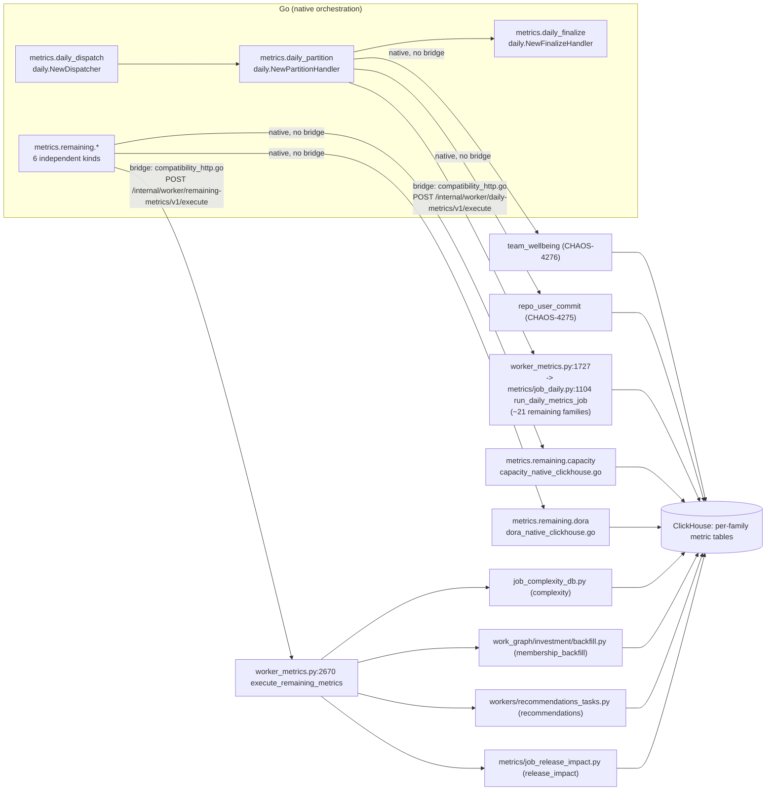
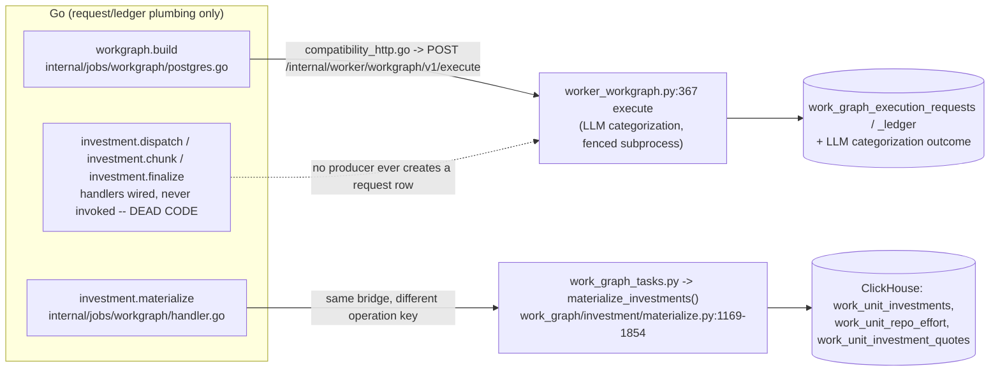

# Python↔Go live-path ledger

chris, 2026-08-28: *"This is what I mean when I say python <> go compatibility isn't tracking. 4th time today I've had to tell an agent autoimport does NOT exist anymore."* and *"make sure EVERYTHING IS BEING TRACKED SO IT CAN BE FOUND."*
{: .fc-page-lede }

Two Linear tickets were marked Done (CHAOS-4323 "remove the auto-import setting", CHAOS-3716 "Linear reference-catalog parity") and read by later agents as "team auto-import is ported to Go." Neither claim was true of the *write path*: the config flag was removed and a Go route was built, but every team/member/project-ownership row in production is still written by Python (`sync.team_autoimport`, bridge to `team_autoimport_{linear,github,gitlab,jira}.py`). "Done" described a step, not the whole path, and nothing in the repo recorded that distinction per kind or route -- so it kept getting re-asserted as finished.

This page is the fix: one row per River job kind, one row per `bridge.go` route, one row per Python worker module, each with an executed-or-argued evidence citation and a ticket if the row represents unfinished or dead work. A [drift gate](#drift-gate) fails CI the moment a kind, route, or file is added, removed, or renamed without a matching row here.

The drift gate only guarantees *coverage* (every kind/route/file has a row) -- it cannot verify a row's *content* is correct, since that requires reading the code. Two pre-merge review rounds on this PR caught 8 factual errors this way, across the worker-file table (`feature_flag_sync.py` wrongly called an orphan, then its call path mis-described as unconditional; `org_guard.py`'s evidence chain was incomplete) and the River-kinds table (`metrics.daily_finalize`'s Python writer and two of its three output tables were omitted; `sync.team_autoimport`'s producer column cited the consumer registration instead of the enqueue site, then the enqueue itself was wrongly described as unconditional when it is gated by the org's 3 CHAOS-4323 flags; a worker-module count was off by one). All are corrected below and marked `corrected 2026-08-28` in their evidence -- treat any row without that note as unreviewed-past-this-PR's-drift-gate, not as independently verified.

## How to read this page

- **state** is the header line's own claim (`native` / `bridge` / `mixed` / `dead-code`), followed by what `contracts/jobs/v1/migration-state.json` itself claims (`state`/`route`). The two can legitimately disagree: `migration-state.json`'s `route: river` only says River is the **dispatch transport** -- it says nothing about where the **compute** happens. A kind can be `go_default`/`river` in the contract and still bridge every byte of its actual work to Python. That gap is exactly what caused the confusion this ticket exists to close.
- **evidence** is labeled `local` (re-executed against real synced data in org `70d529e0-3c06-4597-8480-794fd02328b6` on the shared dev stack), `fixtures` (generated, contrived), `live` (prod; this lane has no prod access, so no `live` rows below), or `argued` (established by reading code this session, not re-executed -- the tables/writers claim came from `rg`/direct file reads against ops main tip `7ea3cad23` on 2026-08-28, not from running the code path).
- The three tables below (kinds, routes, worker files) are **generated** -- do not hand-edit the text between a `<!-- BEGIN/END GENERATED ... -->` marker pair. Edit the curated `_LEDGER` dicts in `scripts/gen_python_go_ledger_docs.py` and run:

  ```bash
  PYTHONPATH=src .venv/bin/python scripts/gen_python_go_ledger_docs.py
  ```

  then commit the diff in the same PR as whatever code change caused it.

## Sync family

`sync.team_autoimport` is the kind that caused this ticket. Its dispatch is Go, gated by the OR of the org's 3 CHAOS-4323 flags (`auto_import_teams`/`projects`/`members` -- all 3 false means the job is never enqueued). **CHAOS-4492 update (2026-08-29):** as of #1989 (`27bef7286`, Linear), #1984 (`950752653`, GitHub), and #1985 (`5bff38a5a`, GitLab) -- all merged to main -- team/member/project-ownership writes for **linear, github, and gitlab are Go-native for sync-time dispatch**: a sync run resolves its own provider and, if that provider has an entry in the Go `nativeTeamCatalogCollectors` registry (`cmd/dev-health-worker/sync_dispatch.go`), runs the native collector and never calls either bridge route at all. Every other provider (jira, pagerduty, launchdarkly, ...) still reaches Python mechanically -- through the narrow `reference-discovery-populate` bridge (synchronous, inside sync finalization) and the best-effort `team-autoimport` bridge (post-sync, fire-and-forget) -- but **jira** is the only one of them whose Python side actually writes anything: pagerduty and launchdarkly aren't in `_IMPORTER_MODULES` (`team_autoimport.py:20-25`), so `_provider_capability` is false and their calls are no-op zero-summaries. A `SyncRunReferenceDiscovery` row is created unconditionally for every sync run (`sync/planner.py:380`) regardless of provider, which is why the bridge is reached mechanically for providers that never write through it. **Corrected 2026-08-29 (CHAOS-4492 codex round 1+2, P2/P3):** there is no `exclude_providers` field on either bridge request -- both send only `{organization_id, sync_run_id}`; the native/bridge choice is made entirely in Go before any HTTP call; jira is not the *only* provider reaching the bridge, just the only one whose reach does anything; and the `Fallback` field wiring is `sync_dispatch.go:580`, not `:576`. **CHAOS-4498 update (2026-08-29):** the operator-triggered **backfill tool** (`src/dev_health_ops/backfill/runner.py`) no longer calls the per-provider Python populator directly. It now arms the SAME `sync_run_reference_discoveries` ledger + outbox row sync-time dispatch uses (`sync.planner.seed_reference_discovery_run`, off a zero-unit anchor `SyncRun`, reusing `plan_sync_run`'s own seeding rather than duplicating it) and waits for a terminal outcome (`workers.reference_discovery.await_reference_discovery_terminal`, bounded by the SAME lease/lifetime env constants `NativeReferenceDiscoveryService` uses for its own claim/execution deadlines). A backfill therefore reaches `TeamCatalogDiscoveryExecutor` exactly like any other sync run: linear/github/gitlab go native, every other provider (jira today) reaches the same `Fallback` bridge. Every non-success ledger outcome (`failed`/`not_claimed`/`timeout_running`) raises -- there is no silent fallback to a direct Python call. `linear/github/gitlab` populators are therefore no longer execution-reachable via backfill either; see the worker-file table below. `sync.team_repo_ownership_derivation` is a *different*, fully Go-native producer downstream of those ownership tables -- it derives `team_repo_ownership` (source=`inferred`) from whichever ownership rows exist; it does not replace direct provider writes, and it is a lower-specificity signal.

The bridge routes are **not yet marked fully dead** for linear/github/gitlab: this section's evidence is a local/CI readback (org `70d529e0`), not a prod readback. `/team-autoimport` and `/reference-discovery-populate` go dead for these three providers specifically once the 5.6 prod deploy readback confirms the native collectors are the live prod writer -- see the [Known tracking gaps](#known-tracking-gaps-opened-from-this-page) entry.

```mermaid
flowchart LR
  subgraph GoDispatch["Go (native)"]
    PS["post-sync / native_post_sync.go"] -->|"enqueues"| K1["River kind: sync.team_autoimport"]
    RD["NativeReferenceDiscoveryService.Discover<br/>(native_reference_discovery.go:132)"] --> TCE["TeamCatalogDiscoveryExecutor.Discover<br/>(team_catalog_discovery_executor.go:131)"]
    K1 --> TAB["teamCatalogAutoimportBridge.TeamAutoImport<br/>(team_catalog_clients.go:426)"]
    REG["nativeTeamCatalogCollectors registry<br/>(sync_dispatch.go) — linear/github/gitlab registered, jira not"]
  end
  TCE -->|"this run's own provider registered?"| REG
  TAB -->|"this run's own provider registered?"| REG
  REG -->|"yes: linear #1989 27bef7286<br/>github #1984 950752653<br/>gitlab #1985 5bff38a5a"| NATIVE["Go-native collectors<br/>Collect(ctx, org, syncRun, selections)<br/>bridge never called"]
  REG -->|"no: jira, pagerduty, launchdarkly, ... —<br/>request carries org_id/sync_run_id only,<br/>no provider list"| R1["POST /api/internal/worker-sync/team-autoimport"]
  REG -.->|"no: same providers, same request shape"| R2["POST /api/internal/worker-sync/reference-discovery-populate"]
  BF["Operator backfill tool<br/>backfill/runner.py<br/>CHAOS-4498"] -->|"seed_reference_discovery_run<br/>(zero-unit anchor SyncRun)"| SEED["sync_run_reference_discoveries<br/>ledger + outbox row<br/>(SAME row plan_sync_run seeds)"]
  SEED --> RD
  BF -.->|"await_reference_discovery_terminal<br/>(polls the SAME ledger row)"| SEED
  subgraph Python["Python (bridge target — jira is the only reacher that WRITES; pagerduty/launchdarkly reach it and no-op)"]
    R1 --> H1["worker_sync.py:269 team_autoimport_reference"]
    R2 --> H2["worker_sync.py:286 reference_discovery_populate_reference"]
    H1 --> TA["workers/team_autoimport.py:228 run_post_sync_team_autoimport"]
    H2 --> TAS["workers/team_autoimport.py:169 run_team_autoimport_strict"]
    TA --> POP["per-provider populate()<br/>team_autoimport_{linear,github,gitlab,jira}.py<br/>(CHAOS-4498: no longer reachable via backfill for linear/github/gitlab -- CHAOS-4435 can now delete them)"]
    TAS --> POP
  end
  NATIVE --> CH[("ClickHouse: teams, team_memberships,<br/>team_project_ownership")]
  POP --> CH
  DERIVE["Go-native: TeamRepoOwnershipDerivationService<br/>(CHAOS-4365, deriveTeamRepoOwnership)"] -->|"reads (downstream, not a replacement)"| CH
  DERIVE --> TRO[("team_repo_ownership<br/>source=inferred")]
```



Bridge routes `/team-autoimport` and `/reference-discovery-populate` still show as **live** above because every provider without a native collector still reaches them mechanically (jira, pagerduty, launchdarkly, ...), whether the sync run came from sync-time dispatch or a CHAOS-4498 backfill arm -- jira is the only one of those whose reach actually writes rows, but "live" here describes the code path being called, not just jira's writes. They are documented as "dead for linear/github/gitlab both dispatch modes pending 5.6 prod readback" in the bridge-route table below, never as dead code paths, until prod proof exists (see [Known tracking gaps](#known-tracking-gaps-opened-from-this-page)).

A wider ownership-attribution diagram (native_team / issue_project / assignee_membership / linked_issue precedence, the tracker-agnostic `team_project_ownership` -> `work_items` -> `team_repo_ownership` derivation chain) already exists and should not be re-derived: see [Team attribution architecture, "Sync produces team_project_ownership" diagram](../../contribute/architecture/team-attribution.md).

Live-path verdict for the four providers, updated 2026-08-29 (CHAOS-4492) now that CHAOS-4431/4432/4434 are Done:

| item | linear | github | gitlab | jira | pagerduty |
| --- | --- | --- | --- | --- | --- |
| `teams` | Go native (#1989 `27bef7286`) | Go native (#1984 `950752653`) | Go native (#1985 `5bff38a5a`) | Python (bridge) | Go native (`PagerDutyTeamsRouteHandler`) |
| `team_memberships` | Go native (#1989) | Go native (#1984) | Go native (#1985) | Python (bridge) | -- |
| `team_project_ownership` | Go native (#1989) | none written | Go native (#1985) | Python (bridge) | -- |
| `team_repo_ownership` (derivation) | Go native, downstream of the above | Go native, downstream | Go native, downstream | Go native, downstream | Go native, downstream |

Evidence (`local`, org `70d529e0`, 2026-08-29 07:11 UTC re-armed reference-discovery run -- lane-4431-linear-route close-out + CHAOS-4431/4432/4434 close-out comments): outcome `native` for linear with rows written to `teams`/`team_memberships`/`team_project_ownership`; ClickHouse `teams.updated_at` matches the re-arm instant; `system.query_log` writer is `clickhouse-go/2.47.0`, not Python's `clickhouse-connect`. This supersedes the earlier 2026-08-28 22:03 UTC readback (102 Python-client `default.teams` inserts, 0 Go-client inserts in the trailing 2 days), which predates the #1989/#1984/#1985 merges and no longer describes the live path for linear/github/gitlab.

**Not yet proven:** the table above is local/CI evidence, not a prod readback. `system.query_log` against **prod** for linear/github/gitlab `default.teams` writes is scoped to the 5.6 deploy readback and has not been re-executed from this worktree (no prod access) -- see [Known tracking gaps](#known-tracking-gaps-opened-from-this-page). jira is unchanged and stays on the Python bridge (CHAOS-4198, not yet split into a Jira porting child).

**Scope of "native" (updated 2026-08-29, CHAOS-4498):** the table above now covers **both** sync-time dispatch (post-sync team-autoimport + reference discovery) and the operator-triggered backfill tool. `backfill/runner.py` no longer calls the Python populator directly for any provider -- it arms the same `sync_run_reference_discoveries` ledger + outbox row and routes through `TeamCatalogDiscoveryExecutor`, so a backfill for a "native" provider (linear/github/gitlab) writes via the Go collector, exactly like a live sync run. jira backfills reach the same `Fallback` bridge jira sync runs already used. See `.remember/lanes/lane-4498-backfill-registry/handoff-2026-08-29.md` for the executed test evidence.

## Provider source discovery

chris (CHAOS-4602, 2026-08-30): *"This still doesn't answer why the GO JIRA provider, which is supposedly the one syncing them, isn't getting ANY sources."* -- Provider **sources** (`integration_sources` rows: repos for github/gitlab, projects for jira) are a DIFFERENT mechanism from everything above this section: team/project/member **ownership** (the tables in the "Sync family" section) is derived by a sync run from the org's three CHAOS-4323 selections; a provider's **sources** come from source discovery, which is unconditional for a config with no explicit scope and independent of those selections.

Before CHAOS-4602 the only source-discovery mechanism anywhere in the system was Python, API-plane, one-shot, at sync-config creation (`src/dev_health_ops/sync/discovery.py::discover_sources_for_integration` -> `src/dev_health_ops/discovery/repos.py::discover_repos_for_config`) -- github/gitlab only; jira fell through to an empty list and so got zero sources, ever, no matter how many projects existed. That one-shot never re-runs, so a provider's repos/projects changing after config creation were invisible too. Neither this ledger's KIND_LEDGER (River job kinds), BRIDGE_ROUTE_LEDGER (bridge.go routes), nor WORKER_FILE_LEDGER (`workers/*.py` files) could ever have caught this: source discovery is an API-request-time / materializer-time side effect, none of those three mechanisms, which is exactly why the by-mechanism audits that built this page missed it (the same "enumerate by mechanism, not by producer" lesson CHAOS-4602 itself names).

This PR adds a fourth mechanism and its own drift-gated table below: a native Go per-occurrence source-discovery step (`internal/scheduler/sync/source_discovery.go`, `NativeSourceDiscoveryService`), called from `loadMaterializationPlan` immediately before `loadPlanSources` reads `integration_sources` for unit planning -- modeled on native reference discovery's shape (its own executor interface, idempotent, per-outcome telemetry) but without a claim/lease ledger of its own, since a read-then-idempotent-upsert has no partial-effect window a retry needs to recover from. It covers exactly the providers with source-type scope: github, gitlab, and jira (`sourceDiscoveryProviders`; `sourceDiscoveryExemptProviders` records why pagerduty/linear/launchdarkly are NOT in that set, drift-gated by `TestEveryProviderDatasetFamilyHasADecidedSourceDiscoveryStance`). An explicit-scope config (`sync_configurations.source_id IS NOT NULL`, i.e. pinned to one already-known source) skips discovery entirely; every other config for these three providers discovers on every scheduled occurrence, upserting `integration_sources` keyed on the same unique constraint the Python one-shot uses (`org_id,integration_id,provider,external_id`) -- an existing row's `is_enabled` and `discovered_at` are **never** touched, only `name`/`full_name`/`metadata` refresh. Telemetry: `provider_source_discovery_total{provider,outcome=created|existing|skipped|error}`.

<!-- BEGIN GENERATED SOURCE DISCOVERY LEDGER -->
| provider | producer | plane | trigger | evidence | state | ticket |
| --- | --- | --- | --- | --- | --- | --- |
| `github` | `internal/scheduler/sync/source_discovery.go` `NativeSourceDiscoveryService.discoverGitHub`, called from `loadMaterializationPlan` before `loadPlanSources` reads sources for planning (CHAOS-4602) | native Go, inside the scheduled-sync materializer, once per occurrence | every scheduled occurrence for a config with no explicit scope (`sync_configurations.source_id IS NULL`) | argued — code read this PR; local integration-test evidence in `internal/scheduler/sync/source_discovery_integration_test.go` (idempotent upsert never flips `is_enabled`, discovery runs before `loadPlanSources`, explicit-scope configs skip it, a failure does not fail the occurrence) | native (this PR) — the Python one-shot at sync-config creation (`src/dev_health_ops/discovery/repos.py::discover_repos_for_config`) stays wired as an INTERIM, now-superseded mechanism (it still runs once at config creation; it is not yet deleted) | CHAOS-4602 (this PR); retiring the Python one-shot is follow-up once a prod readback confirms the Go step as the live writer, the same pattern CHAOS-4435 already uses for the team-catalog populators above |
| `gitlab` | `internal/scheduler/sync/source_discovery.go` `NativeSourceDiscoveryService.discoverGitLab`, same call site as github | native Go, inside the scheduled-sync materializer, once per occurrence | every scheduled occurrence for a config with no explicit scope | argued — code read this PR; same integration-test evidence as github | native (this PR) — the Python one-shot at sync-config creation stays wired as an interim, now-superseded mechanism, not yet deleted | CHAOS-4602 (this PR); retiring the Python one-shot is follow-up |
| `jira` | `internal/scheduler/sync/source_discovery.go` `NativeSourceDiscoveryService.discoverJira`, same call site as github/gitlab | native Go, inside the scheduled-sync materializer, once per occurrence | every scheduled occurrence for a config with no explicit scope | argued — code read this PR; local integration-test evidence (source_discovery_integration_test.go). CHAOS-4602's own executed finding: jira had NO source-discovery mechanism at all before this PR (`discover_repos_for_config`'s jira branch does not exist on main as of this PR; CHAOS-4584 is a separate, still-in-flight Python interim, not yet merged) -- this Go step is jira's FIRST source-discovery mechanism, not a port of an existing one | native (this PR, and jira's ONLY mechanism -- there is no Python one-shot to supersede for jira the way there is for github/gitlab) | CHAOS-4602 (this PR) + CHAOS-4584 (interim Python jira branch at config-creation time, separate/in-flight, does not block this PR) + CHAOS-4576 (Jira REFERENCE discovery -- boards/sprints -- to native Go; a different discovery surface, coordinate if the same route can carry both) |
<!-- END GENERATED SOURCE DISCOVERY LEDGER -->

For github/gitlab the Python one-shot at config creation still runs too (unchanged, unremoved) -- the Go step is a supplementary idempotent re-discovery that also catches repos/projects added after config creation, and is the mechanism this ledger now calls "native" for those two providers, superseding the one-shot pending the same kind of prod-readback proof this page requires elsewhere before calling a bridge route fully dead (see [Known tracking gaps](#known-tracking-gaps-opened-from-this-page)). For **jira** there was no prior mechanism at all: this Go step is jira's first and only source-discovery path.

## Manual Sync Now + Backfill planning

CHAOS-4602 scope reversal (chris, direct): a manual "Sync Now" click or an operator/admin Backfill request used to plan units by calling `plan_sync_run` (`src/dev_health_ops/sync/planner.py:264`) in-process, synchronously, inside the admin API request -- a completely separate path from the Go-native scheduled materializer, and the one this section now tracks. Full architecture: [Manual Sync Now + Backfill planning architecture](../../contribute/architecture/manual-backfill-sync-planning.md).

This PR moves that planning into the Go scheduler for **planner-managed parent configs only**, behind a rollout flag (`SYNC_GO_MANUAL_BACKFILL_PLANNER_ENABLED`, default OFF at launch, flipped PERMANENTLY ON by CHAOS-4629 landing -- chris ruling, 2026-08-31). `create_sync_execution_trigger` (`execution_trigger.py`) branches on `config.planner_managed AND` that flag; a non-planner-managed (child, explicit-`source_id`) config keeps calling `plan_sync_run` in-process, byte-for-byte unchanged -- enforced structurally too, since `NativeMaterializer.Materialize`'s eligibility gate already rejects `!ConfigPlannerManaged` outright (`ErrOccurrenceIneligible`), so a routing bug cannot silently mis-plan a child config through the Go path.

The Go hand-off path reuses `scheduled_sync_occurrences` (migration 0050, its pickup query already producer-agnostic) and adds one new table, `sync_manual_triggers` (migration 0118): the mode override and, for backfill, the `since`/`before`/`source_ids`/`dataset_keys` selector, 1:1 with one occurrence. `internal/scheduler/sync/backfill_planner.go`'s `BuildBackfillPlan` is the pure backfill sibling of `BuildScheduledPlan` (which rejects backfill mode outright), verified against the live Python planner (`planner_oracle_test.go::TestBuildBackfillPlanMatchesLivePythonPlanner`). The admin router bounds its wait on Go materializing the occurrence via `await_sync_execution_trigger_materialized` (three outcomes: materialized, pending-on-deadline, or a client-visible failed status on a Go-side quarantine -- never silently folded into pending).

| trigger | producer | plane | state | ticket |
| --- | --- | --- | --- | --- |
| manual "Sync Now" / admin Backfill, planner-managed parent config | `internal/scheduler/sync/backfill_planner.go` `BuildBackfillPlan` + `BuildScheduledPlan`, picked up via the reused `scheduled_sync_occurrences` pickup path | native Go, materializer, one hand-off per trigger click (flag-gated) | native (this PR) behind `SYNC_GO_MANUAL_BACKFILL_PLANNER_ENABLED` (default ON as of CHAOS-4629) -- `plan_sync_run` stays wired, in-process, as the path taken only when the flag is explicitly overridden off | CHAOS-4602 (this PR) + CHAOS-4603 (plan-telemetry-after-commit fix, folded into this PR) + CHAOS-4629 (default-ON flip) |
| manual "Sync Now" / admin Backfill, non-planner-managed (child, explicit `source_id`) config | `src/dev_health_ops/sync/planner.py:264` `plan_sync_run`, called in-process from `create_sync_execution_trigger` | Python, admin API request, synchronous | unchanged -- out of scope for this PR by explicit ruling (fork 1), enforced structurally by `Materialize`'s `ConfigPlannerManaged` gate | CHAOS-4604 (follow-up: port this case too) |

## Metrics family

Two sub-families dispatch through two different compatibility bridges. `daily_*` fans out ~23 per-repo/per-org metric computations; `remaining.*` is 6 independent kinds, of which 2 are already Go-native.



`workgraph.build` and the `investment.*` family share a second, separate bridge endpoint (`/internal/worker/workgraph/v1/execute`) with zero Go-native compute anywhere -- only React-to-request/ledger plumbing is Go:



## Operational, system, and report family

Two `state=go_default` Python-facing docstrings were found stale/inverted during this ticket's research: `worker_operational.py`'s module docstring calls its handlers "dormant Go operational handlers" when `operational.billing_notification`, `operational.webhook_delivery`, and `system.heartbeat` are the live production path; `internal/jobs/report/report.go` and `runtime.go` call the report kernel "dormant... while report jobs remain Celery-routed" when `report.execute_on_demand`/`execute_scheduled` are in fact fully Go-native (CUT-03). Both are corrected in the generated table below and filed as a tracking gap (see [Known tracking gaps](#known-tracking-gaps-opened-from-this-page)) rather than silently fixed here, since they are unrelated code-comment edits outside this PR's diff surface.

`sync.provider_unit`, `system.retention_cleanup`, and `system.sync_coverage_refresh` are fully Go-native with no discrepancy against `migration-state.json`.

## River job kinds

<!-- BEGIN GENERATED KIND LEDGER -->
| kind | producer | trigger | gate | writer | tables written | evidence | state | ticket |
| --- | --- | --- | --- | --- | --- | --- | --- | --- |
| `investment.chunk` | Go handler wired, never invoked -- `internal/jobs/workgraph/handler.go:158-163` | none — no producer ever creates a `work_graph_execution_requests` row with this kind | n/a | Python `work_graph_tasks.run_investment_materialize_chunk.run` (bridge target, unreachable) — `src/dev_health_ops/api/internal/worker_workgraph.py:186` | none written (never invoked) | argued — rg found zero `WriteTx`/enqueue callers for this kind repo-wide (2026-08-28) | dead-code (migration-state: `go_default`/`river`) | CHAOS-4438 (dead investment.* kinds) |
| `investment.dispatch` | Go handler wired, never invoked -- `internal/jobs/workgraph/handler.go:152-157` | none — only reachable via the legacy Celery-chord function, not scheduled and Celery is retired prod-wide | n/a | Python `work_graph_tasks.py:508 dispatch_investment_materialize_partitioned` (Celery-only, unreachable) | none written (never invoked) | argued — rg found zero `WriteTx`/enqueue callers for this kind repo-wide (2026-08-28) | dead-code (migration-state: `go_default`/`river`) | CHAOS-4438 (dead investment.* kinds) |
| `investment.finalize` | Go handler wired, never invoked -- `internal/jobs/workgraph/handler.go:164-169` | none — no producer ever creates a `work_graph_execution_requests` row with this kind | n/a | Python `work_graph_tasks.finalize_investment_materialize_partitioned.run` (bridge target, unreachable) — `worker_workgraph.py:187` | none written (never invoked) | argued — rg found zero `WriteTx`/enqueue callers for this kind repo-wide (2026-08-28) | dead-code (migration-state: `go_default`/`river`) | CHAOS-4438 (dead investment.* kinds) |
| `investment.materialize` | `internal/syncdispatchruntime/native_post_sync.go:230-232` (`workGraph.StartRequestTx`) | post-sync | `plan.Investment` (`native_post_sync.go:610`, set when `git \|\| hasWorkItems`) | Go handler orchestrates only (`internal/jobs/workgraph/handler.go:24-68,146-151`); compute is Python `work_graph_tasks.py:172-278` -> `materialize_investments()` (`src/dev_health_ops/work_graph/investment/materialize.py:1169-1854`) | ClickHouse `work_unit_investments`, `work_unit_repo_effort`, `work_unit_investment_quotes` (`src/dev_health_ops/metrics/sinks/clickhouse/investment.py:117-186`) | argued — code read, not re-executed this session | bridge (migration-state: `go_default`/`river`) | CHAOS-4441 (workgraph subsystem gap) |
| `metrics.daily_dispatch` | `internal/scheduler/fixed/producers.go:442` (fanout) + `native_post_sync.go` `DailyPostSyncWriter.StartRunTx` | post-sync + fixed schedule (backstop) | none found (queue-selected only, `cmd/dev-health-worker/daily.go:36`) | Go `internal/jobs/metrics/daily/postgres.go` (`daily.NewDispatcher`, wired `daily.go:135`) | `public.daily_metrics_runs` (`postgres.go:219,296`), `public.daily_metrics_partitions` (`postgres.go:263`) | argued — code read, not re-executed this session | native (migration-state: `go_default`/`river`) | n/a (orchestration only; per-family compute tracked on `metrics.daily_partition`) |
| `metrics.daily_finalize` | River worker `cmd/dev-health-worker/daily.go:236` (`daily.NewFinalizeHandler(store, compatibility)`) | follows partition completion (same run) | none found | Go run bookkeeping (`postgres.go:630,661,1100,1126,1160`); the actual finalize compute is Python `worker_metrics.py:1688 _run_daily_direct` (operation='finalize') -> `src/dev_health_ops/metrics/job_daily.py:1997 run_daily_metrics_finalize` -- IC cross-repo aggregation, reading already-persisted `user_metrics_daily`/`work_item_user_metrics_daily` | `public.daily_metrics_runs` (Go); ClickHouse `user_metrics_daily` (`job_daily.py:2125 write_user_metrics` -> `wellbeing.py`'s sink), `ic_landscape_rolling_30d`, and team-level metric tables (Python finalize compute -- corrected 2026-08-28 per codex review across 2 rounds: an earlier draft omitted the Python writer and its output tables entirely, then a follow-up correction still missed `user_metrics_daily`) | argued — code read, not re-executed this session | mixed (migration-state: `go_default`/`river`) | CHAOS-3092 children (per-family) |
| `metrics.daily_partition` | River worker `cmd/dev-health-worker/daily.go:235` (`daily.NewPartitionHandler`) | driven by dispatch/run rows | none (family selection is unconditional fan-out) | MIXED: Go-native for `team_wellbeing` (CHAOS-4276, `daily.go:212-234` `NewTeamWellbeingExecutor`) and `repo_user_commit` (CHAOS-4275, `NewRepoUserCommitExecutor`); the other ~21 families still bridge via `internal/jobs/metrics/daily/compatibility_http.go` -> POST `/internal/worker/daily-metrics/v1/execute` -> `worker_metrics.py:1727` -> `src/dev_health_ops/metrics/job_daily.py:1104 run_daily_metrics_job` (NOT `workers/metrics_daily.py`, which is dead Celery-only code, see worker-file ledger) | `public.daily_metrics_partitions` plus per-family ClickHouse output tables | argued — corrects both `.remember/chaos-3092-port-inventory-2026-08-25.md`'s '21/23 Python' framing (2 families are now native) and a prior fork's mis-citation of `workers/metrics_daily.py` (that file is dead; the live module is `src/dev_health_ops/metrics/job_daily.py`) | mixed (2 native, ~21 bridge) (migration-state: `go_default`/`river`) | CHAOS-3092 children (per-family, tracked separately; not re-enumerated here) |
| `metrics.remaining.capacity` | `internal/scheduler/fixed/inventory.go:197` (capacity_forecast_weekly_fanout) | schedule (WeeklyAt Mon 04:00 UTC) | ClickHouse schema check in `NewCapacityExecutor` (`internal/jobs/metrics/remaining/capacity_native.go:87`) | Go `internal/jobs/metrics/remaining/capacity_native_clickhouse.go:243` | `capacity_forecasts` | argued — code read; wired `cmd/dev-health-worker/daily.go:359-393,401-410` | native (migration-state: `go_default`/`river`) | n/a — Python `_run_capacity` (`worker_metrics.py:1752`) is dead code, see worker-file dead-code child ticket |
| `metrics.remaining.complexity` | `internal/scheduler/fixed/inventory.go:58` (complexity_daily_fanout) | schedule (DailyAt 00:45 UTC) | none (always bridge) | Python `run_complexity_db_job` `src/dev_health_ops/metrics/job_complexity_db.py:238` | `file_complexity_snapshots`, `repo_complexity_daily` | argued — code read | bridge (migration-state: `go_default`/`river`) | CHAOS-3092 (metrics families) |
| `metrics.remaining.dora` | `internal/scheduler/fixed/inventory.go:147` (dora_daily_fanout) | schedule (DailyAt 02:15 UTC) + post-sync | ordering/schema checks in `NewDORAExecutor` (`internal/jobs/metrics/remaining/dora_native.go:100`) | Go `internal/jobs/metrics/remaining/dora_native_clickhouse.go:379` | `dora_metrics_daily` | argued — wired `daily.go:315-353,415-427` | native (migration-state: `go_default`/`river`) | n/a — Python `_run_dora` (`worker_metrics.py:1797`) is dormant/dead |
| `metrics.remaining.membership_backfill` | `internal/scheduler/fixed/inventory.go:176` (membership_backfill_daily_fanout) | schedule (DailyAt 03:30 UTC, safety net) + event-driven post-sync materializer (primary) | none | Python `backfill_memberships` `src/dev_health_ops/work_graph/investment/backfill.py:176` | `work_unit_membership`, `work_unit_membership_runs` | argued — code read | bridge (migration-state: `go_default`/`river`) | CHAOS-3092 (metrics families) |
| `metrics.remaining.recommendations` | `internal/scheduler/fixed/inventory.go:127` (recommendations_daily_fanout) | schedule (DailyAt 02:00 UTC, safety net behind a finalize-gated primary trigger) | none | Python `_compute_recommendations_for_org` `src/dev_health_ops/workers/recommendations_tasks.py:334` | `recommendations_daily` | argued — code read | bridge (migration-state: `go_default`/`river`) | CHAOS-3092 (metrics families) |
| `metrics.remaining.release_impact` | `internal/scheduler/fixed/inventory.go:75` (release_impact_daily_fanout) | schedule (DailyAt 01:30 UTC) | none | Python `run_release_impact_job` `src/dev_health_ops/metrics/job_release_impact.py:29` | `release_impact_daily` | argued — code read | bridge (migration-state: `go_default`/`river`) | CHAOS-3092 (metrics families) |
| `operational.billing_notification` | `cmd/dev-health-worker/operational.go:120-131` | manual (billing event enqueues run) | `descriptor.Executable()` (route=river) | Python `system_ops.py:25 send_billing_notification` | Python-owned (email dispatch; no dedicated table) | argued — code read | bridge (migration-state: `go_default`/`river`) | CHAOS-3952 (idempotency-key gap) + CHAOS-4440 (stale docstring) |
| `operational.webhook_delivery` | `cmd/dev-health-worker/operational.go:132-143` | manual (webhook receipt enqueues) | `descriptor.Executable()` (route=river) | Python `system_webhooks.py:63 process_webhook_event` | Python-owned (github/gitlab/jira event tables) | argued — code read | bridge (migration-state: `go_default`/`river`) | CHAOS-4440 (stale docstring) |
| `report.execute_on_demand` | `cmd/dev-health-worker/reports.go:36-96` (`buildReportWorker`) | manual (on-demand report request) | `descriptor.Executable()` (route=river); both report kinds gated together (`reports.go:57`) | Go `internal/jobs/report/runtime.go:18-40` (`NewClickHouseQueryAdapter`/`NewDeterministicRenderer`/`NewSHA256ArtifactAdapter`/`NewInAppNotificationAdapter`) | `report_runs` (Postgres) + generated artifact row | argued — code read; CUT-03 wired real adapters into the binary per `reports.go:17-20` | native (migration-state: `go_default`/`river`) | CHAOS-4440 (stale docstring, package doc still claims Celery-routed/dormant) |
| `report.execute_scheduled` | `cmd/dev-health-worker/reports.go:36-96` (shared build) | schedule (cron-driven report) | same as `report.execute_on_demand` | same `runtime.go` adapters, `NewScheduledHandler` (`report.go:196`) | same as `report.execute_on_demand` | argued — code read | native (migration-state: `go_default`/`river`) | CHAOS-4440 (stale docstring) |
| `sync.provider_unit` | `internal/jobs/providerunit/providerunit.go:538 (*Handler).Work` | post-sync (leased unit from sync-run dispatch) | route=`river_canary` (`Executable()` true for canary too) | `internal/providersync/repository_postgres.go:144 (*PostgresRepository).Complete` | `public.sync_run_units`, `public.sync_run_unit_effect_chunks`, `public.sync_run_unit_chunk_checkpoints` | argued — code read; no Python call found in the `Work()` path | native (migration-state: `canary`/`river_canary`) | n/a — matches migration-state.json canary state, no gap |
| `sync.team_autoimport` | enqueue: `cmd/dev-health-worker/sync_dispatch.go:195 teamAutoimportPostSyncWriter.PublishTx`, called from `NativePostSyncService.publishTeamAutoimport` (`native_post_sync.go:337-344`) only when `plan.TeamAutoimport` is true; dequeue/consumer: `internal/syncdispatchruntime/worker.go:95 RegisterTeamAutoimportWorker`, wired `sync_dispatch.go:565`. Per-provider dispatch is now split BEFORE any bridge call: `teamCatalogAutoimportBridge.TeamAutoImport` (`cmd/dev-health-worker/team_catalog_clients.go:426`) resolves the sync run's own provider (`resolveTeamCatalogProvider`), and if that provider has a registered entry in the `nativeTeamCatalogCollectors` map (`sync_dispatch.go:522`, added by #1989/#1984/#1985: linear/github/gitlab) it runs the Go collector directly and never calls `bridge.TeamAutoImport` at all. Corrected 2026-08-29 (CHAOS-4492 codex round 2, P2): the fallback is NOT jira-exclusive at the routing layer -- ANY provider absent from that 3-entry map reaches the wrapped bridge, including pagerduty and launchdarkly sync runs (a `SyncRunReferenceDiscovery` row is created unconditionally for every sync run, `sync/planner.py:380`, regardless of provider); jira is simply the only one of those whose Python call actually writes rows -- `_provider_capability` (`team_autoimport.py:45`) is false for pagerduty/launchdarkly (neither is in `_IMPORTER_MODULES`, `team_autoimport.py:20-25`), so their bridge call is a no-op zero-summary, while jira has a real populator. Also corrected 2026-08-29 (CHAOS-4492 codex round 1, P2): there is no `exclude_providers` field on the wire, the routing decision is made entirely in Go before the HTTP call, and the bridge request the wrapped `HTTPBridge.TeamAutoImport` (`bridge.go:113`) sends is unconditionally `{organization_id, sync_run_id}` only (`teamAutoImportReference`, `bridge.go:92-96`) -- Python re-resolves its own provider independently from the sync run's own integration row (`worker_sync.py:269` -> `team_autoimport.py:228`), it is never told which provider(s) to skip | post-sync (best-effort, fire-and-forget) | Go-side: `plan.TeamAutoimport` (`native_post_sync.go:560-577`) = OR of the org's 3 CHAOS-4323 sync_options flags (`auto_import_teams`/`auto_import_projects`/`auto_import_members`) -- when all 3 are false, the job is never enqueued at all, not merely a no-op inside the populator. Provider routing gate: presence of a registered entry in `nativeTeamCatalogCollectors` (linear/github/gitlab present, jira absent) selects native collector vs. Python bridge fallback per sync run's own provider (see producer column -- no per-call exclude list, a whole sync run either goes native or goes to the bridge). Python-side: `run_post_sync_team_autoimport` re-reads the same 3 sync_options flags independently for whichever provider it resolves; see CHAOS-4430 for the executed proof of the flag chain | linear/github/gitlab sync runs: Go-native collectors registered in `nativeTeamCatalogCollectors` (`cmd/dev-health-worker/sync_dispatch.go`), writing via `providerfoundation.CredentialResolver` + per-provider ClickHouse effects -- #1989 `27bef7286` (Linear), #1984 `950752653` (GitHub), #1985 `5bff38a5a` (GitLab), all merged to main. jira sync runs (the only provider still resolving to the bridge branch): `bridge.go:113 TeamAutoImport` -> POST `/api/internal/worker-sync/team-autoimport` -> `worker_sync.py:269 team_autoimport_reference` -> `workers/team_autoimport.py:228 run_post_sync_team_autoimport` -> `team_autoimport_jira.py populate()` (not yet ported, CHAOS-4198). CHAOS-4498 (this PR): the operator-triggered backfill tool (`backfill/runner.py`) no longer calls `run_team_autoimport_strict` directly for any provider -- it now arms the SAME `sync_run_reference_discoveries` ledger + outbox row sync-time dispatch uses (`sync.planner.seed_reference_discovery_run`, reusing `plan_sync_run`'s own seeding) and waits for a terminal outcome, so a backfill reaches `TeamCatalogDiscoveryExecutor` exactly like any other sync run: native collector for linear/github/gitlab, the same jira/pagerduty/launchdarkly `Fallback` bridge otherwise. linear/github/gitlab populators are therefore no longer execution-reachable via backfill either -- CHAOS-4435 can now delete `team_autoimport_{linear,github,gitlab}.py` without a backfill blocker (jira stays Python, CHAOS-4198 main scope) | ClickHouse `teams`, `team_memberships`, `team_project_ownership` | local — re-armed reference-discovery run, org 70d529e0, 2026-08-29 07:11 UTC (lane-4431-linear-route close-out + CHAOS-4431/4432/4434 close-out comments): outcome `native` for linear with `rows_written` for teams/team_memberships/team_project_ownership; ClickHouse `teams.updated_at` matches the re-arm instant; `system.query_log` writer `clickhouse-go/2.47.0`, not Python's `clickhouse-connect`. Superseded citation: the 2026-08-28 22:03 UTC readback of 102 Python-client `default.teams` inserts / 0 Go-client inserts predates these merges and no longer reflects the sync-time live path for linear/github/gitlab -- re-running that query against prod is scoped to the 5.6 readback (CHAOS-4492), not yet executed (no prod access from this worktree). CHAOS-4498's backfill-routing change is argued (code read + unit/integration test suite, `tests/test_backfill.py` + `tests/test_reference_discovery_stage.py`), not yet re-executed against org 70d529e0 real data from this worktree. | mixed (migration-state below) — native for linear/github/gitlab sync-time AND backfill dispatch (CHAOS-4431/4432/4434 sync-time, CHAOS-4498 backfill), bridge for jira only (CHAOS-4198, not yet ported) among providers whose populate() actually writes rows -- pagerduty/launchdarkly sync runs also reach the bridge call mechanically but no-op there (not import-capable, see producer column) (migration-state: `go_default`/`river`) | CHAOS-4198 (jira populator, remaining scope) + CHAOS-4435 (delete kind/routes/modules once jira is native — the backfill blocker CHAOS-4498 closed) + CHAOS-4492 (ledger regen) + CHAOS-4498 (backfill re-pointed at the native-collector-or-bridge seam, this PR) |
| `sync.team_repo_ownership_derivation` | native Go post-sync derivation (CHAOS-4365 1b) | post-sync | none (celery_removed, rollback=none) | Go `TeamRepoOwnershipDerivationService` (`deriveTeamRepoOwnership`, CHAOS-4365) | `team_repo_ownership` (source=inferred) | local — `.remember/python-bridge-route-inventory-2026-08-28.md` EXECUTED VERDICT table; downstream of the Python-written tables above, not a replacement for them | native (migration-state: `celery_removed`/`river`) | CHAOS-4365 (Done) |
| `system.heartbeat` | `cmd/dev-health-worker/operational.go:144-155` | schedule | `descriptor.Executable()` (route=river) | Python `system_ops.py:172 phone_home_heartbeat` | Python-owned `audit_logs` row + external `TELEMETRY_ENDPOINT` POST | argued — code read; `internal/jobs/system/heartbeat.go:12-33` docstring is accurate and non-stale about this (explicitly says 'CLASSIFICATION: python_compatibility, not native Go') | bridge (migration-state: `go_default`/`river`) | CUT-20 (code label, no Linear ticket found — see report) |
| `system.retention_cleanup` | `cmd/dev-health-worker/operational.go:156-167` | schedule (per-policy) | `descriptor.Executable()` (route=river); policy dispatch `retention.go:89-105` | Go `internal/jobs/system/retention_postgres.go:39,91,168` + `internal/joboutbox/repository.go:265` | `provider_rate_limit_observations`, `dev_conversations`/`dev_conversation_tombstones`, `external_ingest_batches`, `worker_job_outbox` | argued — code read; 4 policies bound, fully Go-native | native (migration-state: `go_default`/`river`) | n/a — no gap |
| `system.sync_coverage_refresh` | `internal/jobs/synccoverage/handler.go:34 (*Handler).Work` | schedule | `descriptor.Executable()` (route=river, rollback=none) | `internal/synccoverage/projector.go:76` | `sync_coverage_projections` | argued — code read; zero Python involvement, matches migration-state.json exactly | native (migration-state: `celery_removed`/`river`) | n/a — no gap |
| `workgraph.build` | `internal/scheduler/fixed/producers.go:826` (startGraphBuild) + `native_post_sync.go:222` (`workGraph.StartRequestTx`) | post-sync + fixed-schedule prerequisite (before membership projection) | none found | Go request/ledger plumbing only (`internal/jobs/workgraph/postgres.go:69,105,135,185`); compute is Python `worker_workgraph.py:367 execute` (fenced subprocess-per-request, LLM categorization) | `public.work_graph_execution_requests`, `public.work_graph_execution_ledger` (Go); LLM categorization outcome + evidence (Python) | argued — rg over `internal/` finds zero graph-construction compute, only dispatcher/request/ledger state-machine code | bridge (migration-state: `go_default`/`river`) | CHAOS-4441 (workgraph subsystem gap) |
<!-- END GENERATED KIND LEDGER -->

## Bridge routes (`internal/syncdispatchruntime/bridge.go`)

Three of the five routes (`dispatch`, `finalize`, `reference-discovery`) are dead in the live binary: `RegisterWorkers` (`internal/syncdispatchruntime/worker.go:72-87`) takes the four `Native*Service` types, never the `HTTPBridge` -- the interface methods still exist and still compile, but nothing calls them. Only `team-autoimport` and `reference-discovery-populate` are reachable at runtime.

<!-- BEGIN GENERATED BRIDGE ROUTE LEDGER -->
| route | Go caller | Python handler | computes/writes | state | ticket |
| --- | --- | --- | --- | --- | --- |
| `/api/internal/worker-sync/dispatch` | `bridge.go:98 HTTPBridge.Dispatch` — interface method exists but `RegisterWorkers` (`worker.go:72-87`) takes the 4 Native services, never `bridge`; no live registrant calls `.Dispatch()` | `worker_sync.py:205 dispatch_reference` -> `sync_units.py:761 dispatch_sync_run` | reads/writes `sync_run`, `sync_run_unit`, dispatches units | dead in live wiring — superseded by `NativeDispatchSyncRunService` (CHAOS-4175, Done) | CHAOS-4175 (Done) |
| `/api/internal/worker-sync/finalize` | `bridge.go:102 HTTPBridge.Finalize` — same as above, no live registrant | `worker_sync.py:235 finalize_reference` -> `sync_units.py:2053 finalize_sync_run` | finalizes `sync_run`, coverage-cache invalidation, compute checkpoints | dead in live wiring — superseded by `NativeFinalizeSyncRunService` (CHAOS-4175, Done) | CHAOS-4175 (Done) |
| `/api/internal/worker-sync/reference-discovery` | `bridge.go:106 HTTPBridge.Discover` — same, no live registrant | `worker_sync.py:250 reference_discovery_reference` -> `reference_discovery.py:56 run_sync_reference_discovery` | reference-discovery orchestration (claim/lease/heartbeat/outbox) | dead in live wiring — superseded by `NativeReferenceDiscoveryService` (CHAOS-4175, Done); its populate step still bridges, see next row | CHAOS-4175 (Done) |
| `/api/internal/worker-sync/reference-discovery-populate` | `bridge.go:133 PopulateReferenceDiscovery`, called from `bridge_discovery_executor.go:45` (`BridgeDiscoveryExecutor`), wired as the `Fallback` field of `TeamCatalogDiscoveryExecutor` (`sync_dispatch.go:580`, corrected 2026-08-29 CHAOS-4492 codex round 2, P3 -- an earlier draft cited line 576, which is `teamCatalogObserver`, not `Fallback`) — LIVE, synchronous, blocking. As of #1989/#1984/#1985 `TeamCatalogDiscoveryExecutor.Discover` reaches this Fallback for any sync run whose OWN provider has no entry in `nativeTeamCatalogCollectors` -- linear/github/gitlab sync runs never call it, but every other provider (jira, pagerduty, launchdarkly, ...) mechanically does; a `SyncRunReferenceDiscovery` row is created unconditionally per sync run (`sync/planner.py:380`) regardless of provider. Corrected 2026-08-29 (CHAOS-4492 codex round 1, P2): the call itself carries no provider-exclusion field -- `BridgeDiscoveryExecutor.Discover` explicitly ignores its own `provider` argument (see its doc comment) and sends only `{organization_id, sync_run_id}`; Python resolves the provider itself from the sync run's own integration row | `worker_sync.py:286 reference_discovery_populate_reference` -> `reference_discovery.py:226` -> `team_autoimport.py:169 run_team_autoimport_strict` -> per-provider `populate()`. jira is the only provider that reaches this route AND has a real populator (`_IMPORTER_MODULES`, `team_autoimport.py:20-25`); pagerduty/launchdarkly also reach the route but `_provider_capability` (`team_autoimport.py:45`) is false for them, so the call is a no-op zero-summary | jira teams/members/memberships/project-ownership rows via this route (the only provider whose call actually writes); credential decrypt + PagerDuty OAuth rotation Python-side. linear/github/gitlab sync runs never reach this handler at all (Go never calls it for them). CHAOS-4498: backfill's arm-and-wait now reaches this route the same way sync-time discovery does -- it is no longer a separate direct-call code path (see `sync.team_autoimport` kind row's writer column) | bridge — live for jira sync-time AND backfill dispatch; dead for linear/github/gitlab both dispatch modes pending 5.6 prod readback (CHAOS-4492) confirming the native collectors are the live prod writer, not just local/CI-proven. CHAOS-4498 (this PR): the backfill tool no longer calls the underlying Python function directly -- it reaches this route (or bypasses it, for a native provider) through the SAME `TeamCatalogDiscoveryExecutor` seam sync-time dispatch uses | CHAOS-4198 (jira, remaining scope) + CHAOS-4435 (retirement once jira native — the backfill blocker CHAOS-4498 closed) + CHAOS-4492 (ledger regen) + CHAOS-4498 (backfill re-pointed, this PR) |
| `/api/internal/worker-sync/team-autoimport` | `bridge.go:113 TeamAutoImport`, called from `teamCatalogAutoimportBridge.TeamAutoImport` (`cmd/dev-health-worker/team_catalog_clients.go:426`), the wrapper `RegisterTeamAutoimportWorker` (`worker.go:93`) registers, wired `sync_dispatch.go:565` — LIVE, fire-and-forget. Same per-sync-run provider-routing split as reference-discovery-populate: `teamCatalogAutoimportBridge` resolves the run's own provider and calls its embedded `CoordinatorBridge.TeamAutoImport` (i.e. this route) for ANY provider absent from `nativeTeamCatalogCollectors`, not jira-exclusively (corrected 2026-08-29, CHAOS-4492 codex round 2, P2 -- see the kind row's producer column for the pagerduty/launchdarkly detail); it never sends a provider list either -- `teamAutoImportReference` (`bridge.go:92-96`) is `{organization_id, sync_run_id}` only | `worker_sync.py:269 team_autoimport_reference` -> `team_autoimport.py:228 run_post_sync_team_autoimport` -> same per-provider `populate()`. jira is the only provider reaching this route with a real populator; pagerduty/launchdarkly reach it too but `_provider_capability` is false for them, so it no-ops | same tables as reference-discovery-populate, best-effort variant, jira sync-time dispatch only (the only provider reaching this route whose call actually writes) | bridge — live for jira sync-time AND backfill dispatch; dead for linear/github/gitlab both dispatch modes pending 5.6 prod readback (CHAOS-4492) confirming the native collectors are the live prod writer, not just local/CI-proven. CHAOS-4498 (this PR): the backfill tool no longer calls the underlying Python function directly -- it reaches this route (or bypasses it, for a native provider) through the SAME `TeamCatalogDiscoveryExecutor` seam sync-time dispatch uses | CHAOS-4198 (jira, remaining scope) + CHAOS-4435 (retirement once jira native — the backfill blocker CHAOS-4498 closed) + CHAOS-4492 (ledger regen) + CHAOS-4498 (backfill re-pointed, this PR) |
<!-- END GENERATED BRIDGE ROUTE LEDGER -->

A separate bridge, `internal/syncdispatchruntime/budget_estimate_bridge.go`, calls `POST /api/internal/worker-sync/dispatch-budget-estimate` (6 per-provider Python budget estimators, ~2000 LOC) and `internal/jobs/pagerduty/compatibility.go` calls a PagerDuty reconciliation bridge from `dev-health-stream-runner`. Both are live, both are out of `bridge.go`'s literal scope so the drift gate does not enumerate them, and both already have owning tickets (CHAOS-4198 for the budget-estimate layer, CHAOS-4105 for PagerDuty) -- listed here so this page stays the complete picture even where the mechanical gate's scope is narrower.

## Python worker modules (`src/dev_health_ops/workers/*.py`)

Category key: **LIVE** = reached today from a live FastAPI bridge route. **CELERY-TASK-ONLY / DEAD** = decorated as a Celery task with no live route caller; Celery itself has been archived in production since 2026-08-19 (CHAOS-4026), so these files have zero production callers. **LIBRARY / SHARED** = helper code imported by other worker modules, not itself a route or task target. **TEST/FIXTURE ONLY** = referenced only from `tests/` (none found).

<!-- BEGIN GENERATED WORKER FILE LEDGER -->
| file | category | evidence | ticket |
| --- | --- | --- | --- |
| `__init__.py` | LIBRARY / SHARED | package marker, no logic | n/a |
| `async_runner.py` | LIBRARY / SHARED | imported by live sync_bootstrap/system_ops/system_webhooks/work_graph_tasks (and dead metrics_daily/feature_flag_sync) — 'run coroutine inside Celery task' helper | n/a |
| `celery_app.py` | LIBRARY / SHARED | imported by ~20 workers files, including live ones, for `@celery_app.task` — Celery app factory, still load-bearing for the decorator even on live functions | n/a |
| `config.py` | LIBRARY / SHARED | used by queue_monitor.py, queues.py, celery_app.py, sync_reconciler.py, external_ingest_reconciler.py, and api/external_ingest/stream_health.py — env/config constants | n/a |
| `external_ingest_recompute.py` | CELERY-TASK-ONLY / DEAD | `@celery_app.task` x2 (L230,L313); sole importer tasks.py:1; zero hits in api/internal/*.py | CHAOS-4439 (dead worker modules) |
| `external_ingest_reconciler.py` | CELERY-TASK-ONLY / DEAD | `@celery_app.task` (L59 prune_external_ingest_batches); sole importer tasks.py:9 | CHAOS-4439 (dead worker modules) |
| `feature_flag_sync.py` | LIVE | LIVE — corrected 2026-08-28 per codex review across 2 rounds: an earlier draft wrongly claimed zero importers, then a follow-up correction wrongly said both helpers are called unconditionally. Actual shape: `_run_feature_flags_dataset` (`dataset_adapters.py:684`, called from the live dataset dispatcher at `:758`) branches per provider (`dataset_adapters.py:694-712`) -- calls `_sync_gitlab_feature_flags` for `provider=='gitlab'`, `_sync_launchdarkly_feature_flags` for `provider=='launchdarkly'`, raises `ValueError` for any other provider | n/a — live |
| `job_outbox.py` | LIVE | enqueue_worker_job called sync_units.py:1047, inside dispatch_sync_run (live via worker_sync.py:26) | n/a |
| `job_routes.py` | LIVE | resolve_worker_job_route called sync_units.py:999, inside dispatch_sync_run | n/a |
| `metrics_daily.py` | CELERY-TASK-ONLY / DEAD | `@celery_app.task` (L19 run_daily_metrics); sole importer tasks.py:5; live daily-metrics route calls dev_health_ops.metrics.job_daily instead (worker_metrics.py:1682) — different module | CHAOS-4439 (dead worker modules) |
| `metrics_extra.py` | CELERY-TASK-ONLY / DEAD | `@celery_app.task` x2 (L14/L88); sole importer tasks.py:6-9; live complexity/DORA routes call metrics.job_complexity_db/job_dora instead | CHAOS-4439 (dead worker modules) |
| `org_guard.py` | LIBRARY / SHARED | corrected 2026-08-28 per codex review (a 3rd caller exists, but is itself dead): `organization_exists_sync` is also called at `sync/execution_trigger.py:325`, inside `_require_locked_scheduled_eligibility` — but that function's ONLY caller is `create_scheduled_sync_execution_trigger` (`execution_trigger.py:74`), whose ONLY caller is `sync_scheduler.py:318` (dead, category b below). `create_sync_execution_trigger` (the function the LIVE admin router `api/admin/routers/sync.py` calls) does NOT reach this eligibility check. Do not delete without re-verifying this chain at delete time — a future refactor could make `create_scheduled_sync_execution_trigger` live again | CHAOS-4439 (re-verify chain before deleting) |
| `post_sync_dispatch.py` | LIVE | build_post_sync_dispatch_payload called sync_units.py:2274, inside finalize_sync_run (live via worker_sync.py:26) | n/a |
| `provider_family_contract.py` | LIVE | imported by provider_unit_route.py & sync_units.py:122, reached from dispatch_sync_run | n/a |
| `provider_unit_route.py` | LIVE | imported sync_units.py:125, used sync_units.py:999-1000 inside dispatch_sync_run | n/a |
| `queue_monitor.py` | CELERY-TASK-ONLY / DEAD | `@celery_app.task` (L84 monitor_queue_depths); importers celery_app.py (comment only) + tasks.py:8; no route caller | CHAOS-4439 (dead worker modules) |
| `queues.py` | LIBRARY / SHARED | imported only by config.py:1 — per-provider queue-name constants | n/a |
| `rate_limit_defer.py` | LIVE | plan_rate_limit_deferral imported sync_units.py:130-132, called sync_units.py:1514 inside dispatch_sync_run | n/a |
| `recommendations_tasks.py` | LIVE | _compute_recommendations_for_org imported/called worker_metrics.py:1833/1863, served by /remaining-metrics/v1/execute | n/a |
| `reference_discovery.py` | LIVE | imported directly worker_sync.py:22-25; served by /reference-discovery and /reference-discovery-populate routes | n/a |
| `report_task.py` | CELERY-TASK-ONLY / DEAD | corrected 2026-08-28 per codex review: `execute_saved_report` also has a live caller — `api/graphql/resolvers/reports.py:617`, inside the on-demand report GraphQL mutation, calls `execute_saved_report.apply_async(...)` wrapped in `try/except (ImportError, AttributeError): pass`. That call is a Celery dispatch with no consumer (Celery retired, CHAOS-4026) so it is a live call site with a dead effect — deleting this file changes that call from 'silently enqueues into a void' to 'silently ImportErrors, same net no-op' (the except clause already handles absence), but the reports.py:617 call site must be removed/updated in the SAME change, not left importing a deleted module | CHAOS-4439 (coordinate with reports.py:617 removal, not a pure file deletion) |
| `runner.py` | LIBRARY / SHARED | used by src/dev_health_ops/cli.py:728,842 (register_commands) — operator CLI for Celery queue inspection, not the Go bridge | n/a |
| `sync_bootstrap.py` | LIVE | imported by reference_discovery.py/team_autoimport.py/sync_units.py:134; resolve_run_auth reached from dispatch_sync_run | n/a |
| `sync_reconciler.py` | CELERY-TASK-ONLY / DEAD | `@celery_app.task` x2 (L84 reconcile_sync_dispatch, L131 prune_rate_limit_observations); sole importer tasks.py:11-13 | CHAOS-4439 (dead worker modules) |
| `sync_scheduler.py` | CELERY-TASK-ONLY / DEAD | `@celery_app.task` (L394 dispatch_scheduled_syncs); sole importer tasks.py:14 | CHAOS-4439 (dead worker modules) |
| `sync_units.py` | LIVE | dispatch_sync_run/finalize_sync_run imported worker_sync.py:26, served by /dispatch and /finalize | n/a |
| `system_ops.py` | LIVE | imported worker_operational.py:15-18 (health_check, phone_home_heartbeat, send_billing_notification) | n/a |
| `system_tasks.py` | LIBRARY / SHARED | corrected 2026-08-28 per codex review: NOT a dead shim — `api/webhooks/router.py:34` and `api/billing/router.py:45` import `process_webhook_event`/`send_billing_notification` from this module and call `.delay(...)`/`.apply_async(...)` on them, gated behind `if route_requires_celery(route):`. Since `operational.webhook_delivery`/`billing_notification` are `route=river` in migration-state.json, that gate evaluates false in production today, so the call is live-but-inert (same 'live call site, dead effect' shape as report_task.py above) — the module itself cannot be deleted without removing these two router imports first | CHAOS-4439 (coordinate with api/webhooks/router.py + api/billing/router.py, not a pure file deletion) |
| `system_webhooks.py` | LIVE | imported worker_operational.py:19,166 (process_webhook_event) | n/a |
| `task_utils.py` | LIBRARY / SHARED | imported by live files (sync_units, reference_discovery, team_autoimport, work_graph_tasks, system_webhooks) and dead ones — shared credential/cache helpers | n/a |
| `tasks.py` | CELERY-TASK-ONLY / DEAD | Celery task-name aggregator (__all__ re-export of every task); no api/internal reference — dead since CHAOS-4026 | CHAOS-4439 (dead worker modules) |
| `team_autoimport.py` | LIVE | run_post_sync_team_autoimport imported worker_sync.py:27, served by /team-autoimport | CHAOS-4198 |
| `team_autoimport_categories.py` | LIVE | imported by team_autoimport.py (live) and the provider variants | n/a |
| `team_autoimport_github.py` | LIVE | imported by team_autoimport.py; ported CHAOS-4434 (`950752653`, Done) — a GitHub sync run's post-sync/reference-discovery dispatch now resolves to the Go-native collector in `nativeTeamCatalogCollectors` and never calls the bridge, so `populate()` is no longer reached via sync-time dispatch. CHAOS-4498 (this PR): the backfill path no longer calls `run_team_autoimport_strict` directly either (it now arms the same ledger/outbox row and routes through `TeamCatalogDiscoveryExecutor`, which resolves GitHub to this same native collector, never the Python populator) — `populate()` in this file is no longer reachable from any live production or operator call path. Not yet deleted: that is CHAOS-4435's scope, now unblocked | CHAOS-4435 (delete — the backfill blocker CHAOS-4498 closed; jira native still required for the shared kind/route/module, unaffected by this file specifically) |
| `team_autoimport_gitlab.py` | LIVE | imported by team_autoimport.py; ported CHAOS-4432 (`5bff38a5a`, Done) — a GitLab sync run's post-sync/reference-discovery dispatch now resolves to the Go-native collector and never calls the bridge, so `populate()` is no longer reached via sync-time dispatch. CHAOS-4498 (this PR): the backfill path no longer calls `run_team_autoimport_strict` directly either — same routing story as `team_autoimport_github.py` above. `populate()` in this file is no longer reachable from any live production or operator call path; deletion is CHAOS-4435's scope, now unblocked | CHAOS-4435 (delete — the backfill blocker CHAOS-4498 closed) |
| `team_autoimport_jira.py` | LIVE | imported by team_autoimport.py; sole live writer of Jira team_project_ownership — the only provider whose sync-time dispatch still reaches `populate()` through the bridge (`nativeTeamCatalogCollectors` has no jira entry). CHAOS-4498 (this PR): the backfill path reaches this same bridge fallback (jira has no native collector) rather than calling `populate()` directly — same net reachability, different call chain; not yet split into its own porting child | CHAOS-4198 (not yet split into a Jira child) |
| `team_autoimport_linear.py` | LIVE | imported by team_autoimport.py; ported CHAOS-4431 (`27bef7286`, Done) — the previously-unwired Go route (CHAOS-3716) is now registered in `nativeTeamCatalogCollectors`, so a Linear sync run's post-sync/reference-discovery dispatch never calls the bridge. CHAOS-4498 (this PR): the backfill path no longer calls `run_team_autoimport_strict` directly either — same routing story as `team_autoimport_github.py` above. `populate()` in this file is no longer reachable from any live production or operator call path. CHAOS-4555 (2026-08-30): unlike github/gitlab, this unreachability is no longer just an emergent property of caller wiring — `team_autoimport._resolve_populator` (`team_autoimport.py:103-111`) refuses provider=linear outright, so no current or future caller (of `run_team_autoimport`/`run_team_autoimport_strict`, or of `_resolve_populator` directly) can import this module at all; deletion is CHAOS-4435's scope, now unblocked | CHAOS-4435 (delete — the backfill blocker CHAOS-4498 closed, reachability closed by CHAOS-4555) |
| `team_drift_sync.py` | CELERY-TASK-ONLY / DEAD | `@celery_app.task` (L56 sync_team_drift); sole importer tasks.py:22 | CHAOS-4439 (dead worker modules) |
| `work_graph_tasks.py` | LIVE | imported inline worker_workgraph.py:147, dispatched by worker_workgraph_router routes | n/a |
<!-- END GENERATED WORKER FILE LEDGER -->

## Known tracking gaps opened from this page

Filed as children of CHAOS-3092 (Go Worker Runtime Migration) because they had no owning ticket at the time this page was written:

- **CHAOS-4438** -- dead `investment.dispatch`/`investment.chunk`/`investment.finalize` kinds: handlers fully wired, zero producer anywhere ever creates a request row for them.
- **CHAOS-4439** -- 9 dead Celery-only Python worker modules with genuinely zero live callers, safe to delete now that Celery is archived (CHAOS-4026): `external_ingest_recompute.py`, `external_ingest_reconciler.py`, `metrics_daily.py`, `metrics_extra.py`, `queue_monitor.py`, `sync_reconciler.py`, `sync_scheduler.py`, `team_drift_sync.py`, `tasks.py`. Three more need coordinated (not standalone) removal: `report_task.py` and `system_tasks.py` have live-but-inert callers (a Celery dispatch call with no consumer today) in `reports.py`/`api/webhooks/router.py`/`api/billing/router.py` that must be removed in the same change; `org_guard.py`'s one non-obviously-dead caller chain should be re-verified at delete time. (`feature_flag_sync.py` was in an earlier draft of this list -- it is LIVE, see the worker-file table, and was removed after a pre-merge review caught the error.)
- **CHAOS-4440** -- stale/inverted "dormant" doc comments in `worker_operational.py` and `internal/jobs/report/{report,runtime}.go`: they describe the live production path as dormant/Celery-routed.
- **CHAOS-4492** (this page's own regen, 2026-08-29) -- the linear/github/gitlab native-writer claim above is proven `local`/CI only (org `70d529e0` re-arm readback), not `live`. Re-run the `system.query_log` evidence query against **prod** ClickHouse after the 5.6 deploy readback to confirm the native Go client (not `clickhouse-connect`) is the writer in production, and only then flip the two bridge routes' state from "dead pending 5.6 readback" to fully dead for these three providers. Until that readback lands, treat the bridge routes as still load-bearing infrastructure (they remain live and mechanically reached by jira, pagerduty, and launchdarkly regardless -- jira is simply the only one of those whose reach writes anything, see the "Sync family" section's codex-round-2 correction).
- **CHAOS-4492 codex round 1 (2026-08-29)** -- a first draft of this page's regen claimed a nonexistent `exclude_providers` wire field and marked `team_autoimport_{linear,github,gitlab}.py`'s `populate()` "dead-in-practice", both wrong: neither bridge request carries a provider field (routing is decided in Go before the call), and `backfill/runner.py:101 _run_strict_reference_discovery_for_backfill` still calls `run_team_autoimport_strict(provider=...)` directly for any of the four providers, bypassing `nativeTeamCatalogCollectors` entirely. Corrected in this same PR. Filed as **CHAOS-4498** (child of CHAOS-4198, blocks CHAOS-4435): port the backfill call path to the same native-collector seam before CHAOS-4435 can delete the Python populators.
- **CHAOS-4492 codex round 2 (2026-08-29)** -- the round-1 fix still overstated jira as the *only* provider reaching the bridge fallback: `TeamCatalogDiscoveryExecutor`'s Fallback is reached by ANY provider absent from `nativeTeamCatalogCollectors` (pagerduty, launchdarkly included -- a `SyncRunReferenceDiscovery` row is created unconditionally per sync run, `sync/planner.py:380`, regardless of provider), not jira-exclusively; jira is only the sole provider among those whose Python side is import-capable (`_provider_capability`, `team_autoimport.py:45`) and therefore actually writes rows -- pagerduty/launchdarkly reach the same handler and no-op. Also fixed a wrong line citation (`sync_dispatch.go:576` is `teamCatalogObserver`, not the `Fallback` field wiring at `:580`). Corrected in this same PR.
- **CHAOS-4441** -- `workgraph.build` + `investment.materialize` compute has no Go-native port and no owning ticket: both bridge 100% of their compute to Python with zero native alternative anywhere in the tree.
- **CHAOS-4731** -- `github`+`work-items` (PR/issue normalization into `work_items`, `ghpr:`/`gh:` ids) is Go-native and live (`GitHubWorkItemsRouteHandler`, `internal/providersync/github_work_items_route.go`, dispatched from `cmd/dev-health-worker/provider_sync.go`), but this page's four generated blocks (River job kinds, bridge routes, Python worker files, source discovery) have no category for a `providersync.CompleteRouteDescriptor`-dispatched composite route at all -- this bullet is that route's only entry on this page, not a generated row, and will not appear if the doc is regenerated. Root cause of the ticket: `sync_executed_proof_ledger` recorded this pair `Attempted` (2026-06-21) but never `Proven` under the pre-2026-08-19 producer (which never persisted `records`/`persisted`); CHAOS-4060 (2026-08-22) then started enforcing that ledger at plan time and, finding no `ExecutedProofWaiver`, silently vetoed every planning attempt for the CURRENT (2026-08-19..08-25 rewrite) producer too, org-wide, for over two months -- `sync_plan_gate_total{provider,dataset,outcome}` (CHAOS-4731, `internal/scheduler/sync/plan_gate_telemetry.go`) is the new counter that would have caught this. Fixed with an `ExecutedProofWaiver` on the `github`+`work-items` descriptor (`execution_registry.go`), self-retiring once a live unit reports `records`>0.

See each ticket for the exact file:line evidence cited above.

## Drift gate

`tests/docs/test_python_go_ledger_drift.py` runs inside the unmarked pure-Python unit suite (`ci/local_validate.sh`'s full-suite stage, and CI's `pytest tests -m "not benchmark and not clickhouse"`), so it cannot be silently skipped. It fails when:

1. `contracts/jobs/v1/registry.json` gains, loses, or renames a job kind without a matching `KIND_LEDGER` row in `scripts/gen_python_go_ledger_docs.py`.
2. `internal/syncdispatchruntime/bridge.go` gains, loses, or renames a `bridge.call`/`bridge.callWithResult` route string without a matching `BRIDGE_ROUTE_LEDGER` row.
3. `src/dev_health_ops/workers/*.py` gains or loses a file without a matching `WORKER_FILE_LEDGER` row.
4. `internal/scheduler/sync/source_discovery.go`'s `sourceDiscoveryProviders` map gains, loses, or renames a provider without a matching `SOURCE_DISCOVERY_LEDGER` row (CHAOS-4602) -- the fourth mechanism, covering the one class of drift the first three could never catch (source discovery is neither a kind, a route, nor a worker file; see [Provider source discovery](#provider-source-discovery)).
5. The generated blocks in this page are stale relative to the curated dicts (someone edited a `_LEDGER` entry but forgot to regenerate).

`test_every_registry_kind_and_bridge_route_and_worker_file_has_a_curated_row` is the falsification control: it plants an untracked kind/route/file/source-discovery-provider in memory and asserts the generator's consistency guard actually raises, so the guard's ability to fail is proven on every CI run rather than assumed.
