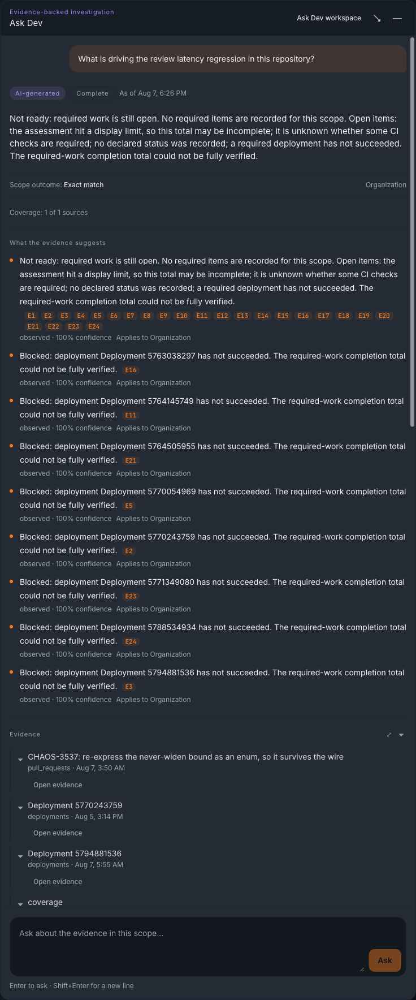
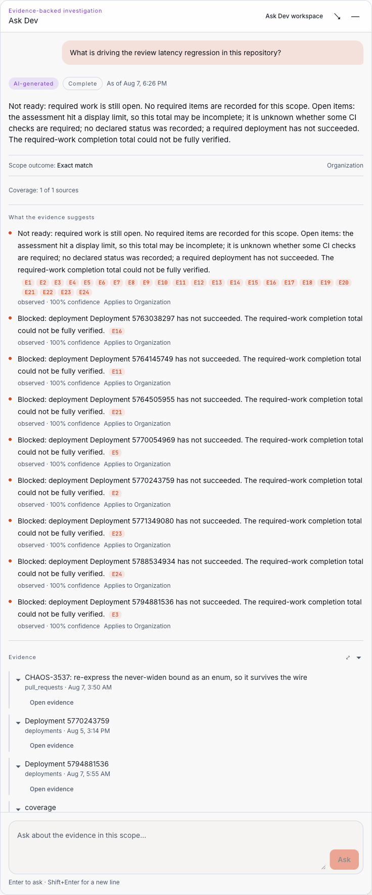
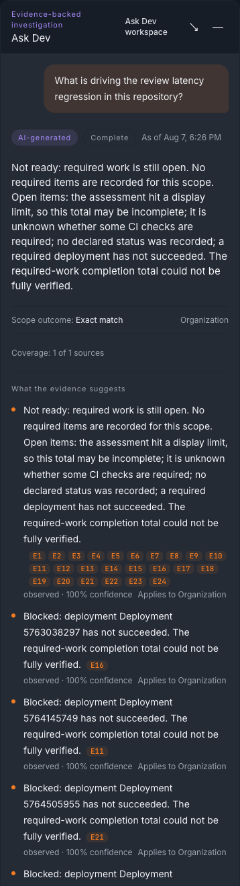
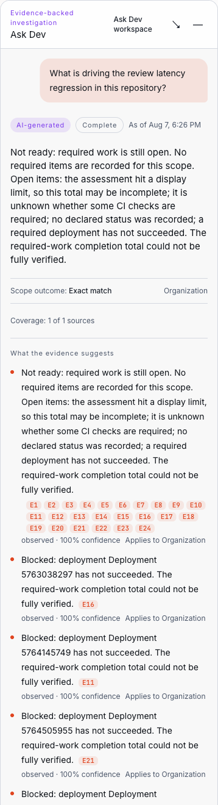

# Read an Ask Dev answer

Every Ask Dev answer carries its own outcome, its provenance, what it could not cover, and the evidence behind it. Read those before the prose. An answer that stopped short says so; it does not present a partial result as a complete one.
{: .fc-page-lede }

<figure class="fc-product-figure" markdown="1">

<figcaption>Completed answer — outcome, a finding with its provenance label, coverage, and the evidence list — desktop, dark theme. Source: dev-health-web PR #859 (merged to main as 45f9026d0), captured 2026-08-07. Seeded local acceptance fixture data only (admin@devhealth.example test org) — no customer data. Owner: Ask Dev web lane. Review trigger: re-capture when answer rendering or the evidence accordion changes materially.</figcaption>
</figure>

<figure class="fc-product-figure" markdown="1">

<figcaption>Completed answer — outcome, a finding with its provenance label, coverage, and the evidence list — desktop, light theme. Source: dev-health-web PR #859 (merged to main as 45f9026d0), captured 2026-08-07. Seeded local acceptance fixture data only (admin@devhealth.example test org) — no customer data. Owner: Ask Dev web lane. Review trigger: re-capture when answer rendering or the evidence accordion changes materially.</figcaption>
</figure>

<figure class="fc-product-figure" markdown="1">

<figcaption>Completed answer — outcome, a finding with its provenance label, and coverage; the evidence list continues below the fold and is shown in full in the desktop capture above — mobile, dark theme. Source: dev-health-web PR #859 (merged to main as 45f9026d0), captured 2026-08-07. Seeded local acceptance fixture data only (admin@devhealth.example test org) — no customer data. Owner: Ask Dev web lane. Review trigger: re-capture when the mobile Ask Dev layout changes materially.</figcaption>
</figure>

<figure class="fc-product-figure" markdown="1">

<figcaption>Completed answer — outcome, a finding with its provenance label, and coverage; the evidence list continues below the fold and is shown in full in the desktop capture above — mobile, light theme. Source: dev-health-web PR #859 (merged to main as 45f9026d0), captured 2026-08-07. Seeded local acceptance fixture data only (admin@devhealth.example test org) — no customer data. Owner: Ask Dev web lane. Review trigger: re-capture when the mobile Ask Dev layout changes materially.</figcaption>
</figure>

## Read it in this order

1. **Outcome.** Whether this is an answer at all, and if so whether it is complete.
2. **Direct answer.** The single-sentence response to what you asked.
3. **Completion and readiness.** Two separate judgements. How much is done is not whether it is ready.
4. **Provenance labels.** Which statements were observed, which were inferred, and which are recommendations.
5. **Disclosures.** Per-statement flags for stale, uncertain, conflicting, or untrusted-source input.
6. **Coverage and source observations.** Which sources were required, which were usable, and what each contributed.
7. **Conflicts and limitations.** Where sources disagreed, and what the answer does not cover.
8. **Evidence.** The specific records behind the claims.

## Outcomes

The outcome is the first thing to read, because it decides whether the rest of the answer means anything.

<!-- BEGIN ASK-DEV OUTCOME LABELS -->
| Outcome | Shown as | What it means |
| --- | --- | --- |
| `answered` | Answered | The question was answered within the coverage stated |
| `answered_with_gaps` | Answered with some gaps | A real answer, with named parts it could not cover. Read the limitations and coverage before acting |
| `needs_clarification` | Needs clarification | The subject was ambiguous. Ask Dev offers candidates instead of guessing |
| `not_found` | Not found | No matching subject you are authorized to see. Also the response for a subject in another organization |
| `temporarily_unavailable` | Temporarily unavailable | A required source or the provider was unreachable. Retrying later is reasonable |
| `unsupported` | Not supported yet | The question is outside what Ask Dev supports today |
| `denied` | Not permitted | You do not have access to ask about this |
| `refused` | Not something Ask Dev can do | The question asked Ask Dev to act, not to read |
| `failed` | Something went wrong | The run did not complete. Nothing partial is presented as a result |
<!-- END ASK-DEV OUTCOME LABELS -->

Only `answered` and `answered_with_gaps` carry content. On every other outcome, the answer deliberately contains **no** narrative, findings, metrics, evidence, or follow-up suggestions — just the outcome, one plain sentence, one suggested next step, and the identifiers needed to reference the run. That emptiness is the design: a no-answer result never leaks a half-formed conclusion.

`answered_with_gaps` is the one to slow down on. It is a genuine answer, and it is also a statement that something is missing. Treat the gap as part of the result, not as a footnote.

## Refusals and what they mean

Ask Dev distinguishes two different reasons it will not do something, and words them differently on purpose.

<!-- BEGIN ASK-DEV REFUSAL COPY -->
| You asked it to | Outcome | What you see | Suggested next step |
| --- | --- | --- | --- |
| Run a command, execute code or a query, or change data | `refused` | *Ask Dev can only read and summarize your data; it can't run commands or make changes.* | *Ask a read-only question about your data instead.* |
| Fetch an external URL, or generate open-ended content | `unsupported` | *This question is not supported yet.* | *Try a status, health, or metric question instead.* |
<!-- END ASK-DEV REFUSAL COPY -->

The distinction matters. "Refused" means the capability is deliberately absent and always will be — Ask Dev does not write, execute, or act. "Not supported yet" means the question shape is outside the current product, which is a boundary that can move. Neither is an error, and neither is a partial attempt: a refused request is never executed and then rolled back; it is never started.

The other no-answer outcomes read the same way — one sentence and one next step:

<!-- BEGIN ASK-DEV NO-ANSWER COPY -->
| Outcome | You see | Suggested next step |
| --- | --- | --- |
| `not_found` | *No matching subject was found for this question.* | *Check the name and try again.* |
| `temporarily_unavailable` | *This answer is temporarily unavailable. Please try again shortly.* | *Try the question again in a few minutes.* |
| `denied` | *You do not have access to ask about this.* | *Ask an administrator for access to this area.* |
| `failed` | *Something went wrong while preparing this answer.* | *Try the question again.* |
<!-- END ASK-DEV NO-ANSWER COPY -->

## Provenance and disclosure

Every statement in an answer is labelled with how it was arrived at:

- **Observed** — read directly from your data.
- **Inferred** — derived from observed facts. It follows from them; it was not measured.
- **Recommendation** — a suggested action. It is a suggestion, not a finding.

A statement may additionally carry disclosures: **stale**, **uncertain**, **conflicting**, or **untrusted source**. These describe the input, not the confidence of the wording. A stale observed fact is still an observation — of an older state.

Where sources disagree, the answer names the conflict and points at the evidence on each side rather than silently preferring one.

## Coverage, source state, and the difference between zero and nothing

Coverage tells you which sources the question required, how many were usable, and which were unavailable, stale, or degraded. Read it before reading a number.

Each source reports what it actually contributed, and these are never interchangeable:

- **measured zero** — the source was read and the value is genuinely `0`;
- **no data** — the source had nothing to report for this scope and window;
- **not measured** — the source was not consulted for this question.

Source availability is reported with the same precision: current, stale, unknown, unconfigured, unavailable, not visible to you, not applicable, or truncated. A dimension that does not apply to a subject is shown as **not applicable** — it is never collapsed into "healthy", and never counted as a pass.

The same care applies to health: a dimension with no usable input reads **unknown**, not healthy.

## Evidence

Evidence is the point of the answer, not a citation ornament.

- Evidence entries are **opaque references**, not arbitrary links. Ask Dev does not hand you a URL it fetched.
- Opening one **re-checks your authorization at that moment** — that the answer is yours, and that you may still see the referenced repository or entity. A reference that is missing, unrelated, or no longer authorized reads as not found.
- Excerpts are **inert plain text**, stripped of HTML, links, and common secrets, capped at 64 KiB, and treated as untrusted source content.
- Evidence entries carry their own state — stale, unavailable, redacted, deleted, uncertain, conflicting, or untrusted content — and their own observed-at time and freshness.
- Some measures cite evidence at the aggregate or source-class level rather than per record. Where that is the case, the answer says so instead of implying record-level backing it does not have.
- Occasionally a part of an answer is withheld and shown as <!-- BEGIN ASK-DEV WITHHELD COPY -->*This part of the answer could not be shown.*<!-- END ASK-DEV WITHHELD COPY --> That is a deliberate safety projection, not a rendering failure.

Every answer also records the definitions it ran under — plan, metric definition, rule, query, and interpreter versions — so a result can be compared against a later one on equal terms.

## What an answer is not

- It is not a decision, and not an instruction. Recommendations are labelled as such.
- It is not a statement about a person. Ask Dev has no per-engineer health, workload, commitment, productivity, or ranking output.
- It is not proof of cause. An inference explains what follows from the observations; it does not establish why.
- It is not a live system check. It reports what the sources had, as of the times shown.
- It is not training data. Dev Health does not use Ask Dev conversation content to train models.

## Data handling you should know about

Ask Dev sends your question and the retrieved context to a configured model provider to compose the answer. Which provider that is — a platform provider or your organization's own — is an administrator decision, as is whether a fallback between them is permitted. Content is not used for model training by default. Conversation retention is set for the whole workspace by an administrator, at either zero days or 30 days; see [Understand Ask Dev conversation history](index.md#understand-ask-dev-conversation-history).

Answers never expose internal prompts, provider messages, tool payloads, or raw provider errors, on any surface, including error messages.

## If an answer looks wrong

- An unexpectedly empty or partial answer is usually a coverage or source-state result — start at [No or incomplete data](../troubleshooting/no-or-incomplete-data.md).
- An answer about the wrong thing is usually subject naming — see [Ask what Ask Dev supports](ask-dev-questions.md#name-the-subject-so-ask-dev-can-find-it).
- A `temporarily_unavailable` or `failed` outcome that repeats is worth reporting with the run identifier shown on the answer.

## Related information

- [Ask what Ask Dev supports](ask-dev-questions.md)
- [Ask Dev, Context Fabric, and agent context](index.md#ask-dev-context-fabric-and-agent-context)
- [Understand loading, empty, stale, and partial data](../navigate/data-states.md)
- [Missing permission or unavailable view](../troubleshooting/permissions-and-availability.md)
