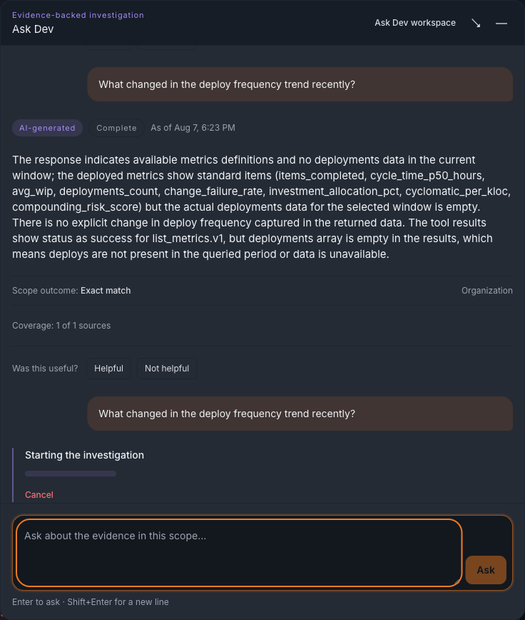
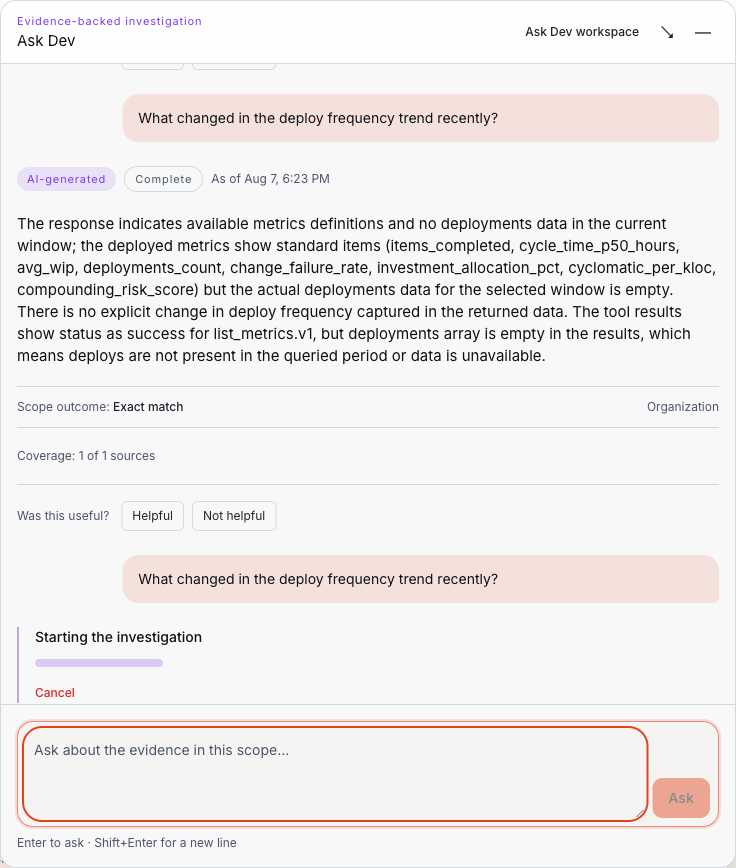

# Ask what Ask Dev supports

Ask Dev answers a bounded set of question families about work your organization already has data for. It is a read-only investigator: it looks things up, explains what it found, and shows the evidence. Knowing the boundary in advance is faster than discovering it one refusal at a time.
{: .fc-page-lede }

For the surfaces themselves — the in-app window, the `/dev` workspace, shared conversation history, and retention — see [Ask Dev, Context Fabric, and agent context](index.md#ask-dev-context-fabric-and-agent-context). For what an answer's parts mean, see [Read an Ask Dev answer](ask-dev-answers.md).

<figure class="fc-product-figure" markdown="1">

<figcaption>Ask Dev window with a supported question in progress, desktop, dark theme. Source: dev-health-web PR #859 (merged to main as 45f9026d0), captured 2026-08-07. Seeded local acceptance fixture data only (admin@devhealth.example test org) — no customer data. Owner: Ask Dev web lane. Review trigger: re-capture when the Ask Dev window layout changes materially.</figcaption>
</figure>

<figure class="fc-product-figure" markdown="1">

<figcaption>Ask Dev window with a supported question in progress, desktop, light theme. Source: dev-health-web PR #859 (merged to main as 45f9026d0), captured 2026-08-07. Seeded local acceptance fixture data only (admin@devhealth.example test org) — no customer data. Owner: Ask Dev web lane. Review trigger: re-capture when the Ask Dev window layout changes materially.</figcaption>
</figure>

## Name the subject so Ask Dev can find it

Ask Dev resolves a question against a **subject**: a specific repository, project, team, work unit, issue, or pull request that you are authorized to see. There is no person subject — Ask Dev has no per-engineer ranking, score, or productivity view to ask for.

Name the subject the way the product does, and put the kind word next to it:

- **Include the kind noun.** `repository`, `repo`, `project`, `team`, `work unit`, `issue`, `ticket`, `pull request`, `merge request`, `PR`, and their plurals are recognized. A name with no kind noun beside it is not read as a subject.
- **Capitalize or quote the name.** `the repo "meridian/web-app"` and `the Platform Reliability team` both work; a bare lowercase slug on its own does not.
- **Ask about at most 25 subjects at once.** Over that, Ask Dev declines the question rather than silently answering about the first 25. A bound is a refusal, never a quiet truncation.
- **Keep one kind per set.** A single question about a set of subjects covers one kind — repositories *or* teams, not a mixture.

Acronyms and short aliases are matched for projects and teams only. A near match, or a match of a different kind than the one you named, is never committed silently: it comes back as a clarification with candidates for you to choose from. Ask Dev asks rather than guesses. See [Read an Ask Dev answer](ask-dev-answers.md#outcomes).

Asking about the organization as a whole is supported as a *scope*, not as a subject: "across the organization" widens the question rather than naming a thing.

## Question families you can ask today

| Ask about | Example question | Answers with |
| --- | --- | --- |
| Status of one subject | *How is the repo "meridian/web-app" doing?* | Current state, with completion and readiness kept separate |
| Readiness | *Is the repo "meridian/web-app" release-ready?* | A readiness judgement that is `ready`, `not ready`, or `indeterminate` — never a percentage standing in for one |
| Remaining work | *What work remains before the repo "meridian/web-app" ships?* | Outstanding work, scoped and evidenced |
| Several subjects, or the portfolio | *What's the status of all our projects across the organization's portfolio?* | Per-subject statuses, plus what could not be covered |
| Project health | *Is the repo "meridian/web-app" healthy?* | Health by dimension, with not-applicable dimensions shown as such rather than folded into "healthy" |
| Team health | *Is the "Platform Reliability" team healthy?* | Team-level health; teams are a first-class subject, individuals are not |
| Workload pressure | *Is the "Platform Reliability" team overburdened?* | Pressure against a stated denominator — or an explicit not-calculable result when the denominator is missing |
| Investment mix | *What's our investment mix across feature/maintenance/risk work?* | Distribution across the investment taxonomy, with unclassified coverage stated |
| Operational deficiencies | *What operational deficiencies does the "Platform Reliability" team have?* | Deficiencies by category, with applicability and verification |
| Observed change | *How did items completed change this month?* | The change actually observed in the window, not a projection |
| Metric comparison | *Compare items completed against cyclomatic per kloc* | Two registered metrics, compared on stated definitions |
| Data trust and source health | *How trustworthy is the data behind the status of the repo "meridian/web-app"?* | Source state, freshness, coverage, and conflicts |

Metric questions name metrics from a registered catalog — items completed, cycle time, average WIP, deployments, change failure rate, investment allocation, cyclomatic per kloc, and compounding risk score. Ask Dev does not invent a metric on request; a metric that is not registered cannot be asked for.

A question the recognizers do not match still runs, as a bounded investigation over the same read-only tools and the same evidence rules. It is not a different, freer mode — the same limits apply.

## What Ask Dev will not do

These are refusals by design, not gaps waiting on a fix. Ask Dev tells you which one applies rather than failing vaguely:

- **No writes or changes.** It cannot update a ticket, close an issue, merge, deploy, or change any setting.
- **No command, code, SQL, GraphQL, or MCP execution.** Requests to run something are refused, not attempted.
- **No external fetching or open-ended generation.** It cannot browse a URL, search the web, or write code for you.
- **No file upload.** There is nothing to attach; Ask Dev works from data already in your workspace.
- **No autonomous background work.** A question runs while you wait and finishes; nothing continues afterward.
- **No person-level output.** There is no per-engineer health, workload, commitment, productivity, or ranking answer — the capability does not exist to be enabled.

Requests to act (write, execute) and requests outside the product's shape (fetch a URL, generate open-ended content) produce **different** results, with different wording. See [Refusals](ask-dev-answers.md#refusals-and-what-they-mean).

Ask Dev also holds your own authorization: it answers only about what you can already see. A subject in another organization, or one you are not authorized for, comes back as not found — the same response as a subject that does not exist, so nothing is revealed by the difference.

## Known limitations in the current release

Stated plainly, because an answer that quietly stops short is worse than a documented boundary:

- **"Which teams are light on feature work?" does not yet return an attributed answer.** The question is accepted, but no attributed signal is produced for it today.
- **Scope inherited from earlier page or conversation context is not applied.** Each question carries the scope you can see committed on it; nothing is silently carried forward from where you were.

These two are current product behavior. Separately, a number of behaviors are shipped but not yet fully exercised by the acceptance harness — a verification gap, not a product limitation — and are deliberately not listed here as things the product does not do.

## If Ask Dev is not available to you

Ask Dev is enabled per organization and is not part of any plan by default. If you do not see it, or it reports as unavailable, see [Missing permission or unavailable view](../troubleshooting/permissions-and-availability.md) and ask your workspace administrator.

## Related information

- [Read an Ask Dev answer](ask-dev-answers.md)
- [Ask Dev, Context Fabric, and agent context](index.md#ask-dev-context-fabric-and-agent-context)
- [Understand loading, empty, stale, and partial data](../navigate/data-states.md)
- [Metric definitions](../../reference/metrics/definitions.md)
