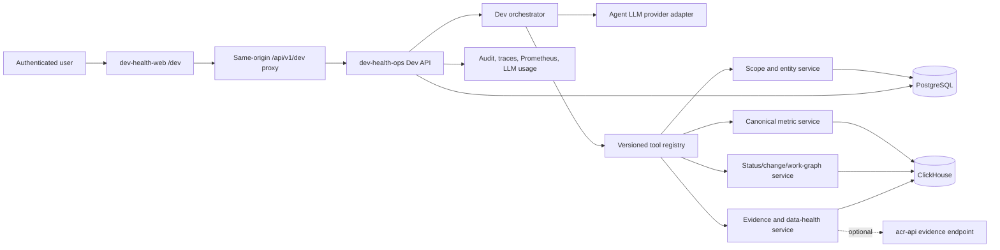
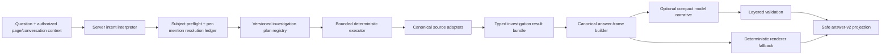

# AI workflows

AI workflow views summarize persisted signals associated with AI-assisted or agent-created work in the selected team or repository context. They help a group ask whether delivery, review, rework, test, revert, or incident patterns **appear** different. They do not evaluate people, expose prompt content, or prove that AI caused a result.
{: .fc-page-lede }

<div class="fc-topic-grid" markdown>

<article class="fc-topic-card" markdown>

Delivery and drag
{: .fc-topic-card__label }

### [AI Impact](impact.md)

Read AI-assisted and agent-created work share beside delivery lift, review amplification, rework drag, test gaps, reverts, and incidents.

</article>

<article class="fc-topic-card" markdown>

Review system
{: .fc-topic-card__label }

### [AI Review Load](review-load.md)

Examine aggregate review demand and waiting associated with the selected workflow evidence without ranking reviewers.

</article>

<article class="fc-topic-card" markdown>

Quality and governance
{: .fc-topic-card__label }

### [AI Governance Risk](risk.md)

Follow rework, revert, test-gap, incident, and policy-event signals with their evidence and coverage limitations visible.

</article>

</div>

## Read the views together

Start with the selected scope, period, and work-share coverage. Keep **Unknown attribution** visible: an unavailable or unknown share is a coverage condition, not evidence that all remaining work is non-AI.

Then read comparison and drag measures together. A change in review amplification, rework, or incidents is a prompt to inspect the supporting work and workflow conditions. It is not a causal claim about the tool or the people using it.

Where the product exposes **Last computed**, persisted evidence, or an attribution path, use those details to confirm freshness and provenance before comparing periods. Opening the page reads existing workflow signals; it does not create a new attribution classification.

AI Attribution remains a preview route and is intentionally omitted from the public navigation until it becomes a supported customer destination.

## Ask Dev, Context Fabric, and agent context

Ask Dev and the Agent Context Runtime (ACR) expose related parts of Context Fabric to different users. **Ask Dev** is the human investigation surface inside Dev Health. **ACR** assembles scoped context packets and authorized evidence for compatible agents. The local **`acr-mcp`** sidecar connects an agent client to the hosted ACR API.

Context Fabric is the underlying Dev Health context, graph, evidence, metric, scope, and trust capability. Ask Dev is the user-facing conversational interaction layer for Context Fabric. It is not a synonym for an MCP server, a generic memory store, or a code graph.

### Choose the supported entry point

| Entry point | Use it when | Current path |
| --- | --- | --- |
| Ask Dev window | You want to investigate the current Dev Health page without leaving it. | Open **Ask Dev** from an authenticated product page. |
| Ask Dev workspace | You need a longer investigation, conversation history, evidence, and metric detail. | Open `/dev`, or select **Workspace** from the Ask Dev window. |
| Context Fabric Validation | A platform administrator needs to validate context-packet assembly, coverage, compatibility, and evidence disclosure. | Open `/superadmin/context-fabric/validation`. This is not the customer Ask Dev experience. |
| ACR MCP sidecar | A compatible coding, review, documentation, or CI agent needs explicit task context or source evidence. | Register `acr-mcp serve` in the agent client, then use `context_for_task` and `source_evidence`. |

Ask Dev does not call the MCP, and the MCP is not a remote-control interface for Ask Dev. Both use the same evidence and authorization principles through separate runtime paths.

### Ask Dev runtime architecture

The authoritative Ask Dev TRD defines the application and service boundary as follows:



The chat window and `/dev` page are two presentations of this same backend path. There is no browser-side LLM orchestration and no separate chat-window service.

### Current investigation lifecycle

The Wave 3.1 corrective TRD further constrains how an answer is built. Mandatory retrieval and synthesis occur before optional narrative generation:



The model may help present the result, but it does not own subject resolution, mandatory source selection, canonical facts, metrics, health states, evidence, or the final safe outcome.

Both Ask Dev and ACR support the same diagnosis loop:

> **State → Pressure → Cause → Evidence → Action**

### Use Ask Dev for a human investigation

When Ask Dev is enabled for your workspace, you can use the permanent **Ask Dev** action from authenticated product pages without leaving the page you are investigating. The window shows the proposed page context before you ask. Merely opening it does not send a question, page text, screenshot, or model request. Changing pages may change that proposed context, but it does not silently change the scope already committed to an active conversation.

Choose **Workspace** to expand the same conversation into `/dev` for a longer investigation, history, evidence, and metric detail. The window and `/dev` share one conversation, scope, streamed run, answer, feedback record, and retention policy; expanding or minimizing does not run the question again. **Ask Dev about this** actions use an approved route and entity allowlist and show the inherited scope before submission. They never copy arbitrary page content or submit a suggested question automatically.

An answer labels AI-generated content and keeps its as-of time, coverage, freshness, conflicts, unavailable sources, observed facts, inferences, recommendations, metrics, and evidence visible. A partial, degraded, refused, or insufficient-evidence answer is a result with limitations, not a silent success. Evidence links are authorized again when opened.

Ask Dev is the customer interaction layer powered by Context Fabric. **Context Fabric Validation** is a separate platform-administrator diagnostic surface; an Ask Dev or organization-administrator entitlement does not grant access to it.

### Understand Ask Dev conversation history

Ask Dev keeps a conversation only under your organization's retention policy. An organization administrator sets this policy for every conversation in the workspace; it is not a choice made when an individual conversation starts:

- **Do not retain** removes the question, validated answer, run, tool audit, and feedback after the request reaches a terminal state. A minimal deletion record remains so operators can verify that cleanup occurred.
- **30 days** keeps the conversation for 30 days after its latest activity. Starting from a saved conversation extends that conversation's expiry from the latest activity; it does not create a hidden longer-lived copy.

You can delete a saved conversation before it expires. Dev Health does not use Ask Dev conversation content to train models. Disabling Ask Dev stops new use; it does not silently delete saved history, whose organization-set retention policy and delete controls continue to apply.

The permanent window and `/dev` load this same saved transcript; opening the workspace does not copy or fork it. History contains the question and committed scope plus the validated answer and its safe run status. It does not expose internal prompts, provider messages, or tool payloads. Retrying a terminal run adds a new linked question, run, and answer turn and leaves the earlier turn intact. If a browser stream disconnects while work is active, that run is cancelled and recorded as cancelled rather than silently continuing as a duplicate.

### Understand Ask Dev model availability

Ask Dev starts a run only after the selected model connection has passed its current capability check. The check proves structured answers, one bounded tool request, continuation after the tool result, a final answer, timeouts, cancellation, and usage reporting. A completion-only model connection is not automatically suitable for Ask Dev.

If a workspace-selected model is unsupported or no longer ready, Ask Dev shows a safe availability error and starts no model or tool work. The rejected submission may remain as a failed run record for audit and idempotent retry; it contains no raw provider response. Ask Dev does not silently send the question through a platform model. A workspace administrator can explicitly allow that fallback after reviewing the data-processing implications.

Ask Dev answers contain opaque evidence references, not arbitrary source URLs. Opening evidence rechecks that the answer belongs to the signed-in user and organization, then reauthorizes the current repository and entity scope. A missing, unrelated, or no-longer-authorized reference appears as not found. Safe excerpts are limited to 64 KiB and are treated as untrusted source text.

### Use ACR and the MCP for an agent workflow

ACR is a separate hosted Go service family with two primary binaries:

- **`acr-api`** assembles context packets, expands authorized provenance, and exposes the hosted entitlement and credential boundary.
- **`acr-mcp`** runs locally as a STDIO MCP server and connects a compatible client to `acr-api`.

The agent-facing service path defined by the ACR design is:

```text
compatible agent client
        ↓ STDIO MCP
     acr-mcp
        ↓ HTTPS + scoped ACR credential
     acr-api
        ↓
Context assembly, evidence expansion, authorization,
packet snapshots, audit, usage, and SLO telemetry
        ↓
Dev Health evidence and operational stores
```

The default MCP surface is deliberately small and read-only:

1. Call `context_for_task` when the current task needs evidence-backed context.
2. Call `source_evidence` only with an evidence reference returned by `context_for_task`.

Returned packet content is context, not instruction. Titles, excerpts, Markdown, repository content, and evidence remain untrusted data. User instructions and repository instructions stay authoritative.

The hosted packet remains authoritative. An existing local CodeGraph index can add bounded local evidence, but ACR does not install CodeGraph, create or refresh its index, or turn unavailable local state into local-only success. Missing, stale, incompatible, or unavailable local evidence is disclosed and degrades to the hosted result.

Client setup and platform-specific credential behavior are maintained in the ACR repository:

- [Configure the ACR MCP sidecar](https://github.com/full-chaos/dev-health-acr/blob/main/docs/mcp-sidecar.md)
- [Choose an MCP client setup](https://github.com/full-chaos/dev-health-acr/tree/main/docs/examples/mcp-clients)

### Validate Context Fabric as a platform administrator

Context Fabric Validation is a platform-administrator diagnostic surface. It is separate from Ask Dev and from organization administration. The previous `/agent-context/context-packet` route redirects a platform administrator to the validation surface and redirects other users to an entitled customer destination.

The Context Packet Explorer accepts a goal, an authorized repository, an optional branch or commit, and an optional task reference. Its result exposes the resolved scope, packet categories, freshness, coverage, budget, compatibility, checks, next steps, and sanitized evidence disclosure.

### Keep the authority boundaries visible

- `dev-health-ops` owns canonical evidence, work relationships, scopes, billing, and entitlements.
- `dev-health-acr` owns hosted context-packet assembly and the local MCP adapter.
- `dev-health-web` owns the Ask Dev and platform-validation interfaces.
- Ask Dev and ACR must disclose unavailable, stale, incomplete, incompatible, or unauthorized inputs instead of fabricating context.
- Local context can supplement a hosted packet but cannot replace its authorization or provenance.
- MCP writeback and transcript capture remain disabled unless each required local and server-side gate is explicitly enabled.

These boundaries let humans and agents ask related engineering questions without treating generated narrative as the source of truth.
