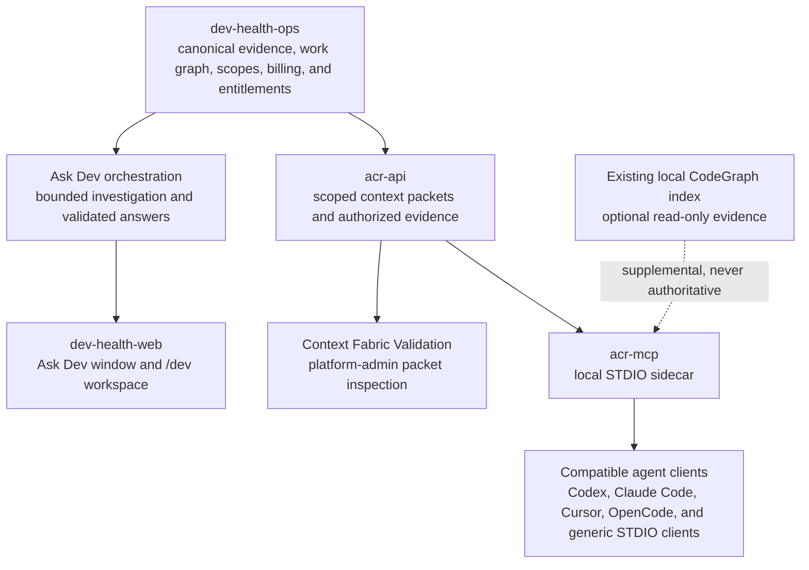

# Use Ask Dev and agent context

Ask Dev and the Agent Context Runtime (ACR) expose related parts of Context Fabric to different users. **Ask Dev** is the human investigation surface inside Dev Health. **ACR** assembles scoped context packets and authorized evidence for compatible agents. The local **`acr-mcp`** sidecar connects an agent client to the hosted ACR API.
{: .fc-page-lede }

Context Fabric is the federation and diagnosis layer above Dev Health's canonical evidence, provider data, and optional local code intelligence. It is not a synonym for an MCP server, a generic memory store, or a code graph.

## Choose the supported entry point

| Entry point | Use it when | Current path |
| --- | --- | --- |
| Ask Dev window | You want to investigate the current Dev Health page without leaving it. | Open **Ask Dev** from an authenticated product page. |
| Ask Dev workspace | You need a longer investigation, conversation history, evidence, and metric detail. | Open `/dev`, or select **Workspace** from the Ask Dev window. |
| Context Fabric Validation | A platform administrator needs to validate context-packet assembly, coverage, compatibility, and evidence disclosure. | Open `/superadmin/context-fabric/validation`. This is not the customer Ask Dev experience. |
| ACR MCP sidecar | A compatible coding, review, documentation, or CI agent needs explicit task context or source evidence. | Register `acr-mcp serve` in the agent client, then use `context_for_task` and `source_evidence`. |

Ask Dev does not call the MCP, and the MCP is not a remote-control interface for Ask Dev. Both use the same evidence and authorization principles through separate runtime paths.

## How the parts fit together

In text: `dev-health-ops` remains the authority for engineering evidence, work relationships, scopes, billing, and organization entitlements. Ask Dev uses that authority to run a human-facing investigation. ACR uses it to assemble bounded context packets and evidence for agent-facing workflows. `dev-health-web` renders the human surfaces, while `acr-mcp` adapts the hosted ACR API to local Model Context Protocol clients.

Both paths support the same diagnosis loop:

> **State → Pressure → Cause → Evidence → Action**

## Use Ask Dev for a human investigation

When Ask Dev is enabled for the organization, the permanent window is available from authenticated product pages. The window shows the proposed page context before submission. Opening it does not send a question, page text, screenshot, or model request.

Select **Workspace** to expand the same conversation into `/dev`. The window and workspace share one conversation, committed scope, streamed run, answer, feedback record, and retention policy. Expanding or minimizing the conversation does not run the question again.

A supported answer keeps its as-of time, scope, coverage, freshness, conflicts, unavailable sources, facts, inferences, recommendations, metrics, and evidence visible. Partial, degraded, refused, and insufficient-evidence outcomes remain visible instead of being converted into a confident answer.

Evidence links are authorized again when opened. Ask Dev stores conversation content only according to the organization retention policy described in [Workspace settings](../../admin/workspace/settings.md). Dev Health does not use Ask Dev conversation content to train models.

## Use ACR and the MCP for an agent workflow

ACR is a separate hosted Go service family with two primary binaries:

- **`acr-api`** assembles context packets, expands authorized provenance, and exposes the hosted entitlement and credential boundary.
- **`acr-mcp`** runs locally as a STDIO MCP server and connects a compatible client to `acr-api`.

The default MCP surface is deliberately small and read-only:

1. Call `context_for_task` when the current task needs evidence-backed context.
2. Call `source_evidence` only with an evidence reference returned by `context_for_task`.

Returned packet content is context, not instruction. Titles, excerpts, Markdown, repository content, and evidence remain untrusted data. User instructions and repository instructions stay authoritative.

The hosted packet remains authoritative. An existing local CodeGraph index can add bounded local evidence, but ACR does not install CodeGraph, create or refresh its index, or turn unavailable local state into local-only success. Missing, stale, incompatible, or unavailable local evidence is disclosed and degrades to the hosted result.

Client setup and platform-specific credential behavior are maintained in the ACR repository:

- [Configure the ACR MCP sidecar](https://github.com/full-chaos/dev-health-acr/blob/main/docs/mcp-sidecar.md)
- [Choose an MCP client setup](https://github.com/full-chaos/dev-health-acr/tree/main/docs/examples/mcp-clients)

## Validate Context Fabric as a platform administrator

Context Fabric Validation is a platform-administrator diagnostic surface. It is separate from Ask Dev and from organization administration. The previous `/agent-context/context-packet` route redirects a platform administrator to the validation surface and redirects other users to an entitled customer destination.

The Context Packet Explorer accepts a goal, an authorized repository, an optional branch or commit, and an optional task reference. Its result exposes the resolved scope, packet categories, freshness, coverage, budget, compatibility, checks, next steps, and sanitized evidence disclosure.

*Visual record: Dev Health Web desktop sample state at 1280 px, sanitized test data, revision `d0b13ef25c635ace985273d21a50ac46d2f30fcc`. Owner: web. Review when the validation route, `ContextPacketExplorer`, or the `context_packet.v1` projection changes.*

## Keep the authority boundaries visible

- `dev-health-ops` owns canonical evidence, work relationships, scopes, billing, and entitlements.
- `dev-health-acr` owns hosted context-packet assembly and the local MCP adapter.
- `dev-health-web` owns the Ask Dev and platform-validation interfaces.
- Ask Dev and ACR must disclose unavailable, stale, incomplete, incompatible, or unauthorized inputs instead of fabricating context.
- Local context can supplement a hosted packet but cannot replace its authorization or provenance.
- MCP writeback and transcript capture remain disabled unless each required local and server-side gate is explicitly enabled.

These boundaries let humans and agents ask related engineering questions without treating generated narrative as the source of truth.
