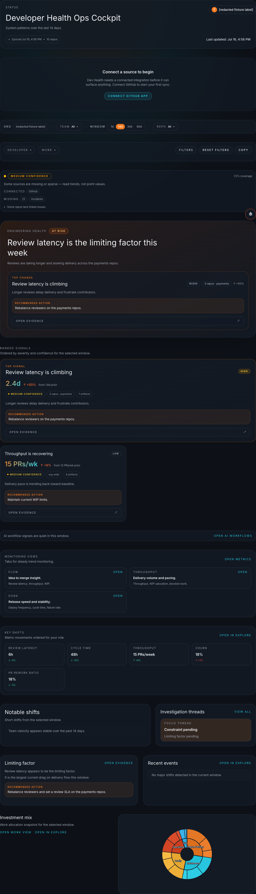

# Your first 10 minutes

Dev Health is a manual for asking better questions about how work moves. It is not a
scorecard for people. Start in the **Cockpit**, then follow a signal to its evidence
before deciding what to do next.

The image is a sanitized fixture capture, not a production workspace. Its [capture
metadata](images/fixture-capture-metadata.json) records the source, redaction, and
viewport. Your workspace can show different values, connections, and available views.

## 1. Orient in the Cockpit

The Cockpit puts the selected time window, scope, confidence, and the next evidence
link in one place. Use the navigation to move from a broad operating mode to a view
that answers a narrower question:

- **Diagnose** for flow, investment, code, and relationship views.
- **Plan** for capacity and planned work.
- **Improve** and **Govern** for improvement and stewardship conversations.
- **Reports** when a repeatable narrative is more useful than an interactive view.

Choose a time window and scope before you interpret a chart. A change in window or
filter can change the context; compare like with like.

## 2. Read a chart as a question

Start with the chart title and its unit. Then read the trend before the latest point.
Ask what changed over the same period and scope, and use the chart to choose an
evidence path—not to assign a verdict.

!!! note "Confidence and evidence"
    Confidence describes the available support for an interpretation. It does not make
    a signal a fact. Open the linked evidence to see the work, time range, and caveats
    behind it.

## 3. Use the next link, help, and caveat

When a chart raises a useful question, choose **Open evidence** or the nearby drill-down
link. If the source is incomplete, treat that as information about coverage rather than
filling in a story. Use the page's help and troubleshooting paths when a connection,
filter, or empty state needs attention.

## Operating modes, not judgments

Dev Health helps a team notice recurring operating modes: delivery pressure, review
delays, maintenance work, quality work, or risk work. It uses **trends over absolutes**
and **signals not judgment**. A useful next step is usually a team conversation about
the evidence, not a conclusion about an individual.

## Continue

- [How to read Dev Health](how-to-read-dev-health.md) explains the common terms and
  interpretation habits.
- [Find the right view](views-index.md) helps match a question to a chart.
- [Read the glossary](glossary.md) when a metric label is unfamiliar.
